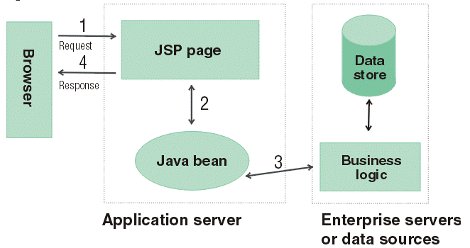
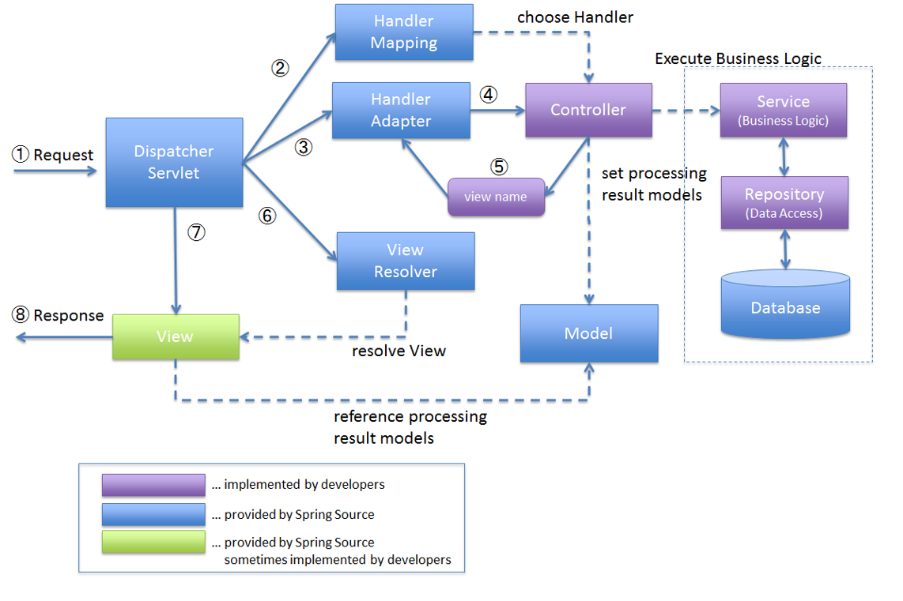

> 부스트 코스 - 웹 프로그래밍(풀스택) 강의를 학습, 정리한 내용입니다. (https://www.boostcourse.org/web316/joinLectures/12943)

# Tab UI 실습 - FrontEnd
# 목차

- [Tab UI 실습 - FrontEnd](#tab-ui-실습---frontend)
- [목차](#목차)
- [1) Spring MVC란?](#1-spring-mvc란)
  - [핵심 개념](#핵심-개념)
  - [MVC란?](#mvc란)
    - [MVC Model 1 아키텍처](#mvc-model-1-아키텍처)
    - [MVC Model 2 아키텍처](#mvc-model-2-아키텍처)
    - [MVC Model2 발전형태](#mvc-model2-발전형태)
    - [Spring Web Module](#spring-web-module)
  - [생각해보기](#생각해보기)
  - [참고 자료](#참고-자료)
- [2) Spring MVC구성요소](#2-spring-mvc구성요소)
  - [학습 목표](#학습-목표)
  - [핵심 개념](#핵심-개념-1)
  - [Spring MVC 기본 동작 흐름](#spring-mvc-기본-동작-흐름)
  - [DispatcherServlet](#dispatcherservlet)
    - [DispatcherServlet 내부 동작흐름](#dispatcherservlet-내부-동작흐름)
  - [요청 선처리 작업시 사용된 컴포넌트](#요청-선처리-작업시-사용된-컴포넌트)
    - [DispatcherServlet 내부 동작흐름 상세 - 요청 선처리 작업](#dispatcherservlet-내부-동작흐름-상세---요청-선처리-작업)
  - [요청 전달시 사용된 컴포넌트](#요청-전달시-사용된-컴포넌트)
    - [DispatcherServlet 내부 동작흐름 상세 - 요청 전달](#dispatcherservlet-내부-동작흐름-상세---요청-전달)
  - [요청 처리시 사용된 컴포넌트](#요청-처리시-사용된-컴포넌트)
    - [DispatcherServlet 내부 동작흐름 상세 - 요청 처리](#dispatcherservlet-내부-동작흐름-상세---요청-처리)
  - [예외 처리시 사용된 컴포넌트](#예외-처리시-사용된-컴포넌트)
  - [뷰 렌더링 과정시 사용된 컴포넌트](#뷰-렌더링-과정시-사용된-컴포넌트)
    - [DispatcherServlet 내부 동작흐름 상세 - 뷰 렌더링 과정](#dispatcherservlet-내부-동작흐름-상세---뷰-렌더링-과정)
    - [DispatcherServlet 내부 동작흐름 상세 - 요청 처리 종료](#dispatcherservlet-내부-동작흐름-상세---요청-처리-종료)
  - [생각해보기](#생각해보기-1)
  - [참고 자료](#참고-자료-1)

<small><i><a href='http://ecotrust-canada.github.io/markdown-toc/'>Table of contents generated with markdown-toc</a></i></small>

# 1) Spring MVC란?
Spring 프레임워크에서 웹 어플리케이션 작성을 위해 제공하는 Web MVC모듈

## 핵심 개념
* MVC Model 1
* MVC Model 2
* Spring MVC

## MVC란?
* MVC는 Model-View-Controller의 약자입니다.
* 원래는 제록스 연구소에서 일하던 트뤼그베 린즈커그가 처음으로 소개한 개념으로, 데스트톱 어플리케이션용으로 고안되었습니다.
* Model : 모델은 뷰가 렌더링하는데 필요한 데이터입니다. 예를 들어 사용자가 요청한 상품 목록이나, 주문 내역이 이에 해당합니다.
* View : 웹 애플리케이션에서 뷰(View)는 실제로 보이는 부분이며, 모델을 사용해 렌더링을 합니다. 뷰는 JSP, JSF, PDF, XML등으로 결과를 표현합니다.
* Controller : 컨트롤러는 사용자의 액션에 응답하는 컴포넌트입니다. 컨트롤러는 모델을 업데이트하고, 다른 액션을 수행합니다.

### MVC Model 1 아키텍처

### MVC Model 2 아키텍처

### MVC Model2 발전형태

### Spring Web Module

Model2 MVC 패턴을 지원하는 Spring Module

## 생각해보기
프론트 컨트롤러(Front Controller)는 모든 요청을 받아 들여 공통적인 작업을 처리해준다. 이를 통해 얻을 수 있는 장점엔 어떤 것이 있을 수 있을까?
 
## 참고 자료
> [참고링크] Web MVC framework
https://docs.spring.io/spring-framework/docs/3.2.x/spring-framework-reference/html/mvc.html

> [참고링크] MVC Model2 | Opendocs
https://myblog.opendocs.co.kr/archives/tag/mvc-model2

> [참고링크] Model 1 and Model 2 (MVC) Architecture
https://www.javatpoint.com/model-1-and-model-2-mvc-architecture

> [참고링크] Modules
https://docs.spring.io/spring-framework/docs/3.0.0.M4/reference/html/ch01s02.html

> [참고링크] IBM Knowledge Center
https://www.ibm.com/docs/en/configurepricequote/10.0?topic=file-working-struts-framework-in-web-ui-framework

# 2) Spring MVC구성요소
Spring MVC에서 가장 핵심적인 역할을 수행하는 DispatcherServlet이 어떤 순서로 동작하는지 살펴본다.

또한 이를 통해서 Spring MVC에서 사용되는 컴포넌트들에 대해 알아본다.

## 학습 목표
* DispatcherServlet이 어떤 순서로 동작하는지 이해한다.
* DispatcherServlet에서 사용되는 컴포넌트(객체)들이 어떤 것들이 있는지 안다.
 

 

## 핵심 개념
* DispatcherServlet
* HandlerMapping
* HandlerAdapter
* ViewResolver

## Spring MVC 기본 동작 흐름

## DispatcherServlet
* 프론트 컨트롤러 (Front Controller)
* 클라이언트의 모든 요청을 받은 후 이를 처리할 핸들러에게 넘기고 핸들러가 처리한 결과를 받아 사용자에게 응답 결과를 보여준다.
* DispathcerServlet은 여러 컴포넌트를 이용해 작업을 처리한다.

### DispatcherServlet 내부 동작흐름
 

## 요청 선처리 작업시 사용된 컴포넌트
* org.springframework.web.servlet.LocaleResolver
  * 지역 정보를 결정해주는 전략 오브젝트이다.
  * 디폴트인 AcceptHeaderLocalResolver는 HTTP 헤더의 정보를 보고 지역정보를 설정해준다.

* org.springframework.web.servlet.FlashMapManager
  * FlashMap객체를 조회(retrieve) & 저장을 위한 인터페이스
  * RedirectAttributes의 addFlashAttribute메소드를 이용해서 저장한다.
  * 리다이렉트 후 조회를 하면 바로 정보는 삭제된다.

* org.springframework.web.context.request.RequestContextHolder
  * 일반 빈에서 HttpServletRequest, HttpServletResponse, HttpSession 등을 사용할 수 있도록 한다.
  * 해당 객체를 일반 빈에서 사용하게 되면, Web에 종속적이 될 수 있다.

* org.springframework.web.multipart.MultipartResolver
  * 멀티파트 파일 업로드를 처리하는 전략

### DispatcherServlet 내부 동작흐름 상세 - 요청 선처리 작업

## 요청 전달시 사용된 컴포넌트

* org.springframework.web.servlet.HandlerMapping
  * HandlerMapping구현체는 어떤 핸들러가 요청을 처리할지에 대한 정보를 알고 있다.
  * 디폴트로 설정되는 있는 핸들러매핑은 BeanNameHandlerMapping과 DefaultAnnotationHandlerMapping 2가지가 설정되어 있다.

* org.springframework.web.servlet.HandlerExecutionChain
  * HandlerExecutionChain구현체는 실제로 호출된 핸들러에 대한 참조를 가지고 있다.
  * 즉, 무엇이 실행되어야 될지 알고 있는 객체라고 말할 수 있으며, 핸들러 실행전과 실행후에 수행될 HandlerInterceptor도 참조하고 있다.

* org.springframework.web.servlet.HandlerAdapter
  * 실제 핸들러를 실행하는 역할을 담당한다.
  * 핸들러 어댑터는 선택된 핸들러를 실행하는 방법과 응답을 ModelAndView로 변화하는 방법에 대해 알고 있다.
  * 디폴트로 설정되어 있는 핸들러어댑터는 HttpRequestHandlerAdapter, SimpleControllerHandlerAdapter, AnnotationMethodHanlderAdapter 3가지이다.
  * @RequestMapping과 @Controller 애노테이션을 통해 정의되는 컨트롤러의 경우 DefaultAnnotationHandlerMapping에 의해 핸들러가 결정되고, 그에 대응되는 AnnotationMethodHandlerAdapter에 의해 호출이 일어난다.

### DispatcherServlet 내부 동작흐름 상세 - 요청 전달

## 요청 처리시 사용된 컴포넌트

* org.springframework.web.servlet.ModelAndView
* ModelAndView는 Controller의 처리 결과를 보여줄 view와 view에서 사용할 값을 전달하는 클래스이다.
* org.springframework.web.servlet.RequestToViewNameTranslator
* 컨트롤러에서 뷰 이름이나 뷰 오브젝트를 제공해주지 않았을 경우 URL과 같은 요청정보를 참고해서 자동으로 뷰 이름을 생성해주는 전략 오브젝트이다. 디폴트는 DefaultRequestToViewNameTranslator이다.
 
### DispatcherServlet 내부 동작흐름 상세 - 요청 처리

## 예외 처리시 사용된 컴포넌트
* org.springframework.web.servlet.handlerexceptionresolver
  * 기본적으로 DispatcherServlet이 DefaultHandlerExceptionResolver를 등록한다.
  * HandlerExceptionResolver는 예외가 던져졌을 때 어떤 핸들러를 실행할 것인지에 대한 정보를 제공한다.

DispatcherServlet 내부 동작흐름 상세 - 예외처리
 

## 뷰 렌더링 과정시 사용된 컴포넌트
* org.springframework.web.servlet.ViewResolver
  * 컨트롤러가 리턴한 뷰 이름을 참고해서 적절한 뷰 오브젝트를 찾아주는 로직을 가진 전략 오프젝트이다.
  * 뷰의 종류에 따라 적절한 뷰 리졸버를 추가로 설정해줄 수 있다.

### DispatcherServlet 내부 동작흐름 상세 - 뷰 렌더링 과정

### DispatcherServlet 내부 동작흐름 상세 - 요청 처리 종료
 

## 생각해보기
* DispatcherServlet은 요청을 받은 후, 요청을 처리하기 위해서 여러가지 작업을 수행하고 있다. 
* 개발자는 DispatcherServlet이 어떤 방식으로 동작하는지 이해한다면 좀 더 잘 Spring MVC를 잘 사용할 수 있다.
* Spring외에 다른 프레임워크를 학습할 때에도, 해당 프레임워크의 동작원리를 이해하는 것은 굉장히 중요.
* 어떻게 하면, 다른 사람이 만든 라이브러리나 프레임워크를 좀 더 잘 이해할 수 있을지 고민.
 
## 참고 자료
> [강의해석블로그] https://tte-yeong.tistory.com/70

> [참고링크] Overview of Spring MVC Architecture
https://terasolunaorg.github.io/guideline/1.0.1.RELEASE/en/Overview/SpringMVCOverview.html

> [참고링크] Modules
https://docs.spring.io/spring-framework/docs/3.0.0.M4/reference/html/ch01s02.html

> [참고링크] Spring MVC - DispatcherServlet 동작 원리 출처: http://jess-m.tistory.com/15 [Jess's Home]
https://jess-m.tistory.com/15

> [참고링크] Spring MVC – Full java based config
https://samerabdelkafi.wordpress.com/2014/08/03/spring-mvc-full-java-based-config/

>[참고링크] web.xml vs Initializer with Spring
https://www.baeldung.com/spring-xml-vs-java-config

> [참고링크] Spring – Mixing XML and JavaConfig
https://mkyong.com/spring/spring-mixing-xml-and-javaconfig/
 
> [참고링크] arey/spring-javaconfig-sample
https://github.com/arey/spring-javaconfig-sample/blob/master/src/main/webapp/WEB-INF/web.xml

> [참고링크] WebMvcConfigurationSupport
https://docs.spring.io/spring-framework/docs/3.0.6.RELEASE_to_3.1.0.BUILD-SNAPSHOT/3.1.0.BUILD-SNAPSHOT/org/springframework/web/servlet/config/annotation/WebMvcConfigurationSupport.html

> [참고링크] Migrate Spring MVC servlet.xml to Java Config
https://www.luckyryan.com/2013/02/07/migrate-spring-mvc-servlet-xml-to-java-config/

> [참고링크] Spring RequestMapping
https://www.baeldung.com/spring-requestmapping