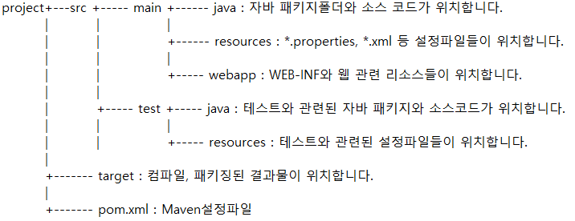

> 부스트코스 - 웹 프로그래밍(풀스택)강의를 학습, 정리한 내용입니다.(https://www.boostcourse.org/web316/joinLectures/12943)

# Maven - BackEnd

- [Maven - BackEnd](#maven---backend)
- [1. Maven이란?](#1-maven이란)
  - [핵심 개념](#핵심-개념)
  - [Maven](#maven)
  - [Maven을 사용할 경우 얻게 되는 이점은?](#maven을-사용할-경우-얻게-되는-이점은)
  - [Maven 기본](#maven-기본)
  - [생각해보기](#생각해보기)
    - [`pom.xml`파일 작성방법](#pomxml파일-작성방법)
- [2. Maven을 이용한 웹 어플리케이션 실습](#2-maven을-이용한-웹-어플리케이션-실습)
  - [핵심 개념](#핵심-개념-1)
  - [Maven 생성](#maven-생성)
  - [Maven 프로젝트의 디렉터리 구조](#maven-프로젝트의-디렉터리-구조)
  - [Maven 프로젝트의 JDK 버전 확인 후 변경](#maven-프로젝트의-jdk-버전-확인-후-변경)
    - [pom.xml](#pomxml)
  - [Maven 프로젝트의 실행](#maven-프로젝트의-실행)
    - [index.jsp](#indexjsp)
    - [4가지 scope](#4가지-scope)
    - [프로젝트 실행](#프로젝트-실행)
  - [다이나믹 웹 모듈 3.1 설정](#다이나믹-웹-모듈-31-설정)
    - [web.xml](#webxml)
  - [웹 어플리케이션 초기화 후 실행](#웹-어플리케이션-초기화-후-실행)
    - [jstl02.jsp 실행결과](#jstl02jsp-실행결과)
  - [생각해보기](#생각해보기-1)
    - [검색자료](#검색자료)
  - [참고 자료](#참고-자료)

<small><i><a href='http://ecotrust-canada.github.io/markdown-toc/'>Table of contents generated with markdown-toc</a></i></small>


# 1. Maven이란?
* 프로젝트가 복잡해지고 사용자가 많아질수록 라이브러리의 관리와 소스를 컴파일하고 배포하는 것은 어려워진다.
* 이러한 문제들을 해결하기 위한 유용한 도구 Maven
## 핵심 개념
* Maven
* CoC
* pom.xml
## Maven
* Maven은 지금까지 애플리케이션을 개발하기 위해 반복적으로 진행해왔던 작업들을 지원하기 위하여 등장한 도구
* Maven을 사용하면 빌드(Build), 패키징, 문서화, 테스트와 테스트 리포팅, git, 의존성관리, svn등과 같은 형상관리서버와 연동(SCMs), 배포 등의 작업을 손쉽게 할 수 있다.
* Maven을 이해하려면 CoC(Convention over Configuration)라는 단어를 먼저 이해해야 
* CoC란 일종의 관습을 말하는데, 예를 들자면 프로그램의 소스파일은 어떤 위치에 있어야 하고, 소스가 컴파일된 파일들은 어떤 위치에 있어야 하고 등을 미리 정해놨다는 것
* 이 말은 관습에 이미 익숙한 사용자는 쉽게 Maven을 사용할 수 있는데, 관습에 익숙하지 않은 사용자는 이러한 제약사항에 대해서 심한 거부감을 느낄 수 있다.
* Maven을 사용한다는 것은 어쩌면 이러한 관습, 즉 CoC에 대해서 알아나가는 것
## Maven을 사용할 경우 얻게 되는 이점은?
* 편리한 '의존성 라이브러리' 관리
  * 앞에서 JSTL을 학습할 때, 몇 가지 파일(라이브러리)을 다운로드 하여 /WEB-INF/lib폴더에 복사하여 사용했었다.
  * 관련된 라이브러리가 많아질수록 이러한 방식은 상당히 불편
  * Maven을 사용하면 설정 파일에 몇 줄 적어줌으로써 직접 다운로드 받거나 하는 것을 하지 않아도 라이브러리를 사용할 수 있다.
* 모든 개발자의 작업방식에 일관성 부여
  * 프로젝트에 참여하는 개발자가 많아지게 되면, 프로젝트를 빌드하는 방법에 대하여 가이드하는 것도 쉬운 일이 아니다.(프로젝트 및 작업의 공유)
  * Maven을 사용하게 되면 Maven에 설정한 대로 모든 개발자가 일관된 방식으로 빌드를 수행할 수 있게 됩니다.
* 다양한 플러그인 > 자동화
  * Maven은 또한 다양한 플러그인을 제공해줘서, 굉장히 많은 일들을 자동화시킬 수 있다.
## Maven 기본
* Archetype을 이용한 Maven 기반 프로젝트를 생성할 경우 생성된 프로젝트 하위에 pom.xml 파일이 생성된다.

pom.xml 파일을 살펴보면 다음과 같습니다. 
```xml
<project xmlns="http://maven.apache.org/POM/4.0.0"
    xmlns:xsi="http://www.w3.org/2001/XMLSchema-instance"
    xsi:schemaLocation="http://maven.apache.org/POM/4.0.0 http://maven.apache.org/maven-v4_0_0.xsd">
    <modelVersion>4.0.0</modelVersion>
    <groupId>kr.or.connect</groupId>
    <artifactId>examples</artifactId>
    <packaging>jar</packaging>
    <version>1.0-SNAPSHOT</version>
    <name>mysample</name>
    <url>http://maven.apache.org</url>
    <dependencies>
        <dependency>
            <groupId>junit</groupId>
            <artifactId>junit</artifactId>
            <version>3.8.1</version>
            <scope>test</scope>
        </dependency>
    </dependencies>
</project>
```
각각의 태그의 의미
* **project** : pom.xml 파일의 최상위 루트 엘리먼트(Root Element)입니다.
* **modelVersion** : POM model의 버전입니다. 
* **groupId** : 프로젝트를 생성하는 조직의 고유 아이디를 결정합니다. 일반적으로 도메인 이름을 거꾸로 적습니다.
* **artifactId** : 해당 프로젝트에 의하여 생성되는 artifact의 고유 아이디를 결정합니다. Maven을 이용하여  pom.xml을 빌드할 경우 다음과 같은 규칙으로 artifact가 생성됩니다. artifactid-version.packaging. 위 예의 경우 빌드할 경우 examples-1.0-SNAPSHOT.jar 파일이 생성됩니다.
* **packaging** : 해당 프로젝트를 어떤 형태로 packaging 할 것인지 결정합니다. jar, war, ear 등이 해당됩니다.
* **version** : 프로젝트의 현재 버전. 추후 살펴보겠지만 프로젝트가 개발 중일 때는 SNAPSHOT을 접미사로 사용합니다. Maven의 버전 관리 기능은 라이브러리 관리를 편하게 합니다.
* **name** : 프로젝트의 이름입니다.
* **url** : 프로젝트 사이트가 있다면 사이트 URL을 등록하는 것이 가능합니다.
```
Maven 을 이용할 경우 얻게 되는 큰 이점 중의 하나는 Dependency Management 기능입니다.

위 pom.xml 파일에서 <dependencies/> 엘리먼트가 Dependency Management 기능의 핵심이라고 할 수 있습니다.

해당 엘리먼트 안에 필요한 라이브러리를 지정하게 됩니다.
```
## 생각해보기
* Maven은 정해진 관습을 사용하기 때문에, 처음 배울 때는 갑갑한 느낌이 듭니다.
* 이러한 관습에 빨리 익숙해지려면, 많이 찾아보고 사용해봐야합니다.
* 인터넷에서 pom.xml파일의 작성방법에 대해 조사해보세요.
### `pom.xml`파일 작성방법
기본적으로 최초생성되는 기본구분(필수구문)과 추가적인 설정으로 생성되는 부분으로 나눠진다.
즉, 기본구문을 베이스로 프로젝트에 필요한 내용을 추가할 수 있다.
* 기본구문
  * Artifact - Overview 탭 / 필수 정보(생성시 생기는 정보) + 배포 정보
  * dependencies - 의존성 정의 부분, 라이브러리를 불러오는 부분
    * Maven을 통한 라이브러리는 Java Build Path 에선 Maven Dependencies 하위 목록에 들어간다.
      * 별도 설정이 불가하며, pom.xml을 통한 추가/삭제/버전변경 등이 가능.
    * '의존성 전의' : 어떤 라이브러리가 경로에 추가된 다른 라이브러리를 필요로 한다면(의존성이 있다면) 자동으로 참조해준다.
  * build - 빌드 시 사용할 플로그인 목록
  
* 추가구문
  * properties - pom.xml에서 자주 사용되는 정보를 변수처럼 만들어서 사용 가능
    * 같은 내용을 여러 번 쓸 때 또는 프로젝트 설정의 중요한 사항에 대해 보기 쉽게 위에 따로 정의할 때 사용 
  * distributionManagement - artifact가 배포될 repository 정보와 설정
    * 'Nexus', repository 나눠 등록 - 'release, snapshots, 3rd party' 등
  * profiles - 로컬, 개발서버, 운영서버 등으로 나누어 배포할 때 각각의 설정 파일과 개발 환경 구축을 위해 사용


# 2. Maven을 이용한 웹 어플리케이션 실습
Ecilpse에서 Maven을 이용한 실습 - 생성과 설정, Maven project 실행
## 핵심 개념
* pom.xml
* project facet
* project properties menu
 
## Maven 생성
1. 이클립스를 실행하고, 이클립스의 메뉴 중 "File - New - Project"를 선택
2. 프로젝트 위자드(Wizard)가 뜨면, Maven아래의 "Maven Project"를 선택한 후 "Next"버튼을 클릭
3. Maven프로젝트가 기존 워크스페이스 경로에 생성되도록 한다. ("Use default Workspace location" 체크확인)
4. "Next"버튼을 클릭
5. 아키타입(Archetype)을 선택
   * 아키타입이란 일종의 프로젝트 템플릿(Template)
   * 어떤 아키타입을 선택했느냐에 따라서 자동으로, 여러 가지 파일들을 생성하거나 라이브러리를 셋팅해주거나 등의 일을 해준다.

6. "maven-archetype-webapp"를 선택한 후 "Next" 버튼을 클릭
   * Maven을 이용하여 웹 어플리케이션을 개발하기 위해서


1. Archetype 매개변수 지정

   * Group Id는 보통 프로젝트를 진행하는 회사나 팀의 도메인 이름을 거꾸로 적습니다.
   * Artifact Id는 해당 프로젝트의 이름을 적습니다.
   * 버전은 보통 기본값(0.0.1-SNAPSHOT)으로 설정합니다.
   * package이름은 group id와 Artifact Id가 조합된 이름이 됩니다.
   * Group Id를 "kr.or.connect"이고 Artifact Id가 "mavenweb"으로 설정했기 때문에 * package이름은 "kr.or.connect.mavenweb"이 됩니다.
   * "finish"버튼을 클릭합니다.

## Maven 프로젝트의 디렉터리 구조
* 'Navigator view'를 통해 확인한 Mavenweb의 디렉터리 구조

* Maven으로 생성된 프로젝트의 경우 자바 소스는 src/main/java 폴더에 생성
* 웹 어플리케이션과 관련된 html, css등은 src/main/webapp 폴더에서 작성
* src/main/java 폴더 부재
* 필요한 폴더는 별도로 생성 필요



## Maven 프로젝트의 JDK 버전 확인 후 변경
1. 버전 확인
   * 프로젝트 - properties - Java Compiler 메뉴
   * JDK 1.7 버전을 사용하는 것을 확인 가능
* JDK8을 사용하도록 하려면 Maven설정 파일인 pom.xml파일을 수정
2. pom.xml 수정
   * pom.xml파일을 더블 클릭

### pom.xml
```
<?xml version="1.0" encoding="UTF-8"?>

<project xmlns="http://maven.apache.org/POM/4.0.0" xmlns:xsi="http://www.w3.org/2001/XMLSchema-instance"
  xsi:schemaLocation="http://maven.apache.org/POM/4.0.0 http://maven.apache.org/xsd/maven-4.0.0.xsd">
  <modelVersion>4.0.0</modelVersion>

  <groupId>kr.or.connect</groupId>
  <artifactId>mavenweb</artifactId>
  <version>0.0.1-SNAPSHOT</version>
  <packaging>war</packaging>

  <name>mavenweb Maven Webapp</name>
  <!-- FIXME change it to the project's website -->
  <url>http://www.example.com</url>

  <properties>
    <project.build.sourceEncoding>UTF-8</project.build.sourceEncoding>
    <maven.compiler.source>1.7</maven.compiler.source>
    <maven.compiler.target>1.7</maven.compiler.target>
  </properties>

  <dependencies>
    <dependency>
      <groupId>junit</groupId>
      <artifactId>junit</artifactId>
      <version>4.11</version>
      <scope>test</scope>
    </dependency>
  </dependencies>
```
* <dependencies>를 보면 자동으로 
자동으로 juint 4.11 라이브러리를 추가하고 있다.
* junit은 테스트를 위한 라이브러리
3. pom.xml에 코드 추가
   * 위의 내용에 다음의 코드를 추가/수정한다.
```
<plugin>
    <groupId>org.apache.maven.plugins</groupId>
    <artifactId>maven-compiler-plugin</artifactId>
    <version>3.6.1</version>
    <configuration>
        <source>1.8</source>
        <target>1.8</target>
    </configuration>
</plugin>
```
   * 코드를 입력하였으면, 저장
   * 수정 후 다시 프로젝트 프로퍼티의 자바 컴파일러 항목을 보면 여전히 1.7


* 프로젝트 프로퍼티를 선택한 후 Maven메뉴 아래의 Java EE Integration을 선택
* 보이는 것처럼 Enable Project Specific Settings 앞의 체크박스를 선택
* 그리고 아래의 Apply and Close버튼을 클릭
* 그리고, 다시 프로퍼티의 자바 컴파일러 버전을 확인하면 JDK 1.8이 사용되는 것을 알 수 있다.
* Maven의 설정을 바꾸면, 이클립스 프로젝트 설정이 연동되게 된 것
> [참고자료]maven eclipse 연동  
https://copycoding.tistory.com/176

## Maven 프로젝트의 실행
### index.jsp
* 이번엔 webapp폴더 아래의 index.jsp를 열어보도록 하겠습니다.
```JSP
<html>
<body>
<h2>Hello World!</h2>
</body>
</html>
```
* HttpServlet을 찾을 수 없다는 오류 메시지가 보입니다.
* 앞에서 Dynamic Web Application을 만들 때는 WAS Runtime설정을 하면서 Tomcat을 지정했었습니다.
* WAS Runtime이 지정되면 Tomcat에 있는 라이브러리를 이클립스에서 사용할 수 있게 됩니다.
* Tomcat안에 있는 서블릿 라이브러리가 사용되면서 문제가 없게 됩니다.
* 실행시에도 WAS 위에서 실행되기 때문에 WAS의 서블릿 라이브러리를 사용하게 됩니다.
* Maven프로젝트로 생성했을 경우에는 WAS 런타임이 지정을 안 했기 때문에 서블릿 라이브러리를 찾을 수 없습니다.
* dependencies 엘리먼트 아래에 다음을 추가합니다.
```
<dependency>
        <groupId>javax.servlet</groupId>
        <artifactId>javax.servlet-api</artifactId>
        <version>3.1.0</version>
        <scope>provided</scope>
</dependency>
```
* 위의 내용을 보면 scope에 provided라는 항목이 있는데 servlet라이브러리를 컴파일 시에만 사용되고 배포 시에는 사용되지 않는다는 것을 의미합니다.

### 4가지 scope
* scope는 다음과 같은 4가지가 있습니다.
  1. compile : 컴파일 할 때 필요. 테스트 및 런타임에도 클래스 패스에 포함됩니다. scope 을 설정하지 않는 경우 기본값입니다.
  2. runtime : 런타임에 필요. JDBC 드라이버 등이 예가 됩니다. 컴파일 시에는 필요하지 않지만, 실행 시에 필요한 경우입니다.
  3. provided : 컴파일 시에 필요하지만, 실제 런타임 때에는 컨테이너 같은 것에서 제공되는 모듈. servlet, jsp api 등이 이에 해당. 배포 시 제외됩니다. 
  4. test : 테스트 코드를 컴파일 할 때 필요. 테스트 시 클래스 패스에 포함되며, 배포 시 제외됩니다.
* 위의 내용을 추가하고 index.html을 가보면 오류가 발생하지 않는 것을 알 수 있습니다.

### 프로젝트 실행
* 프로젝트를 선택한 후 우측버튼을 클릭하여 Run on Server를 선택
* 해당 웹 어플리케이션을 실행할 Runtime을 지정하고, 항상 해당 런타임을 사용하겠다는 아래쪽 체크박스도 선택한 후 Finish버튼을 클릭

* 브라우저가 실행되면서 index.html이 보여지는 것을 확인할 수 있다.
* 이번엔 pom.xml 파일에 JSTL라이브러리를 추가
```
<dependency>
        <groupId>javax.servlet</groupId>
        <artifactId>jstl</artifactId>
        <version>1.2</version>
</dependency>
```
* JSTL은 Tomcat이 기본으로 제공하지 않기 때문에, 컴파일할 때도 배포할 때도 사용돼야 합니다.
* 그래서 scope에 이번엔 provided가 있지 않습니다.
* webapp폴더에 앞에서 작성했던 jstl02.jsp 를 붙여넣기를 하도록 하겠습니다.
* 라이브러리가 변경되었으니, 다시 run on server를 합니다.
* 실행해도 결과가 아무것도 나오지 않는 것을 확인할 수 있습니다.
* 프로젝트 프로퍼티를 선택한 후, Project facets 항목을 보면 다이나믹 웹 모듈의 버전이 2.3입니다.'


* 다이나믹 웹 모듈의 2.4부터 EL이 기본으로 사용할 수 있도록 설정되기 때문에 2.3일 경우에는 EL표기법의 결과가 출력되지 않습니다.

## 다이나믹 웹 모듈 3.1 설정
* 앞의 프로젝트처럼 다이나믹 웹 모듈 3.1이 되도록 설정해보도록 하겠습니다.
* 먼저 WEB-INF의 web.xml 파일을 열어보도록 하겠습니다.

### web.xml
```xml
<!DOCTYPE web-app PUBLIC
 "-//Sun Microsystems, Inc.//DTD Web Application 2.3//EN"
 "http://java.sun.com/dtd/web-app_2_3.dtd" >

<web-app>
  <display-name>Archetype Created Web Application</display-name>
</web-app>
```
위의 내용을 다음과 같이 수정
```
<?xml version="1.0" encoding="UTF-8"?>
<web-app xmlns="http://xmlns.jcp.org/xml/ns/javaee" xmlns:xsi="http://www.w3.org/2001/XMLSchema-instance" 
         xsi:schemaLocation="http://xmlns.jcp.org/xml/ns/javaee http://xmlns.jcp.org/xml/ns/javaee/web-app_3_1.xsd" version="3.1">
  <display-name>Archetype Created Web Application</display-name>
</web-app>
```
* 프로젝트아래의 .settings/org.eclipse.wst.common.project.facet.core.xml 파일을 연다.
  * 이클립스 navigator에서 보면 보입니다.
```xml
<?xml version="1.0" encoding="UTF-8"?>
<faceted-project>
  <fixed facet="wst.jsdt.web"/>
  <installed facet="jst.web" version="2.3"/>
  <installed facet="wst.jsdt.web" version="1.0"/>
  <installed facet="java" version="1.8"/>
</faceted-project>
```
을 아래와 같이 수정
```xml
<?xml version="1.0" encoding="UTF-8"?>
<faceted-project>
  <fixed facet="wst.jsdt.web"/>
  <installed facet="jst.web" version="3.1"/>
  <installed facet="wst.jsdt.web" version="1.0"/>
  <installed facet="java" version="1.8"/>
</faceted-project>
```
* 프로젝트 프로퍼티의 Project facets항목을 보면 다이나믹 웹 모듈이 3.1로 바뀐 것을 볼 수 있다.
* 이제 jstl02.jsp를 run on server로 실행
* 실행을 하지만 오류가 나면서 실행이 안 되는 경우가 있을 수 있다.
* 이클립스의 버그로, 수정되기 전의 데이터와 수정된 데이터가 섞여서 실행되기 때문

## 웹 어플리케이션 초기화 후 실행
이 경우 웹 어플리케이션을 깔끔히 초기화하고 실행하는 것이 좋을 수 있다.
1. 기존 tomcat을 종료
2. 혹시 바뀌지 않았다면 프로젝트를 선택, 우측버튼을 눌러서 Maven 메뉴 아래의 update project를 선택한 후 확인
3. Servers view에서 기존 Tomcat Runtime을 삭제
4. Project 메뉴의 Clean선택
5. 프로젝트 익스플로러에서 Server 삭제

위와 같은 과정을 거친 후 Run on Server로 실행해보자
* 결과가 잘 나오는 것을 확인할 수 있다.
* 다이나믹 웹 모듈을 2.3에서 3.1로 바꾸는 것은 프로젝트가 한번 만들어지면, 그 이후부터는 그 프로젝트가 더 이상 사용되지 않을 때까지 계속 사용되기 때문에 자주 개발자가 해야 할 일은 아니다.
* 그 이후부터는 pom.xml에 원하는 기능을 추가하면서 개발을 진행하면 된다.

### jstl02.jsp 실행결과
```
n과 10은 같습니다. 
```
* 404 not found 에러가 떠서 서버를 지우고 다시 run on server하는 과정에서 port번호가 겹처서 8005와 8080을 각각 8006과 8081로 수정하였다.
## 생각해보기
* 이클립스에는 Maven이 내장되어 있다. 
* 이번 시간엔 이클립스에 내장된 Maven을 이용해 프로젝트를 생성해보았다. 
* cmd창이나 터미널에서 maven명령을 수행해서 컴파일하고 실행할 수도 있다. 
* 이를 위해선 Maven을 별도로 설치를 해야 한다. 
* Maven을 설치하고, 콘솔이나 터미널에서 실행할 방법을 찾아보자.

### 검색자료
> Maven 콘솔에서 컴파일, 실행해보기  
https://splendidlolli.tistory.com/208
 

## 참고 자료
> [참고링크] Maven – Welcome to Apache Maven
http://maven.apache.org

> [참고링크] How to Create Dynamic Web Project using Maven in Eclipse? • Crunchify
http://crunchify.com

> [참고링크] How to fix Cannot change version of project facet Dynamic Web Module to 3.0 Error in Eclipse • Crunchify
http://crunchify.com

> [참고링크] Maven in 5 Minutes
https://maven.apache.org