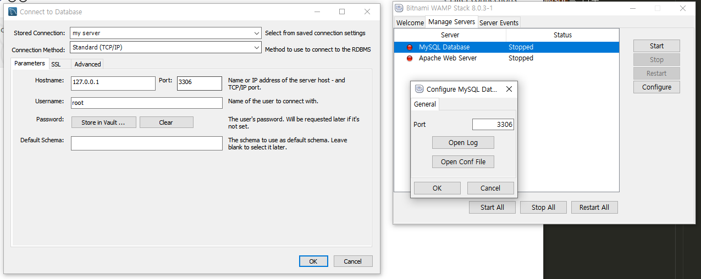
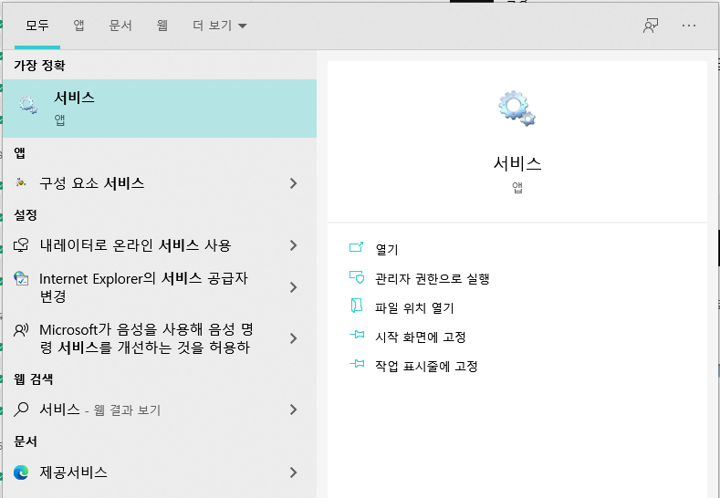
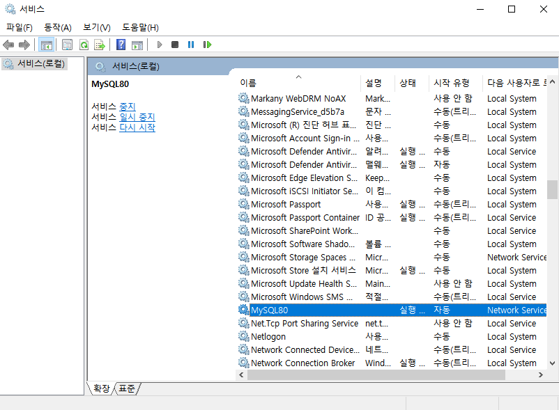

> 부스트코스 - 웹 프로그래밍(풀스택)강의를 학습, 정리한 내용입니다.(https://www.boostcourse.org/web316/joinLectures/12943)

# MySQL - BackEnd

- [MySQL - BackEnd](#mysql---backend)
- [1. 데이터베이스와 DBMS](#1-데이터베이스와-dbms)
  - [핵심 개념](#핵심-개념)
  - [데이터베이스의 기본개념 (정의)](#데이터베이스의-기본개념-정의)
  - [데이터베이스의 특성](#데이터베이스의-특성)
  - [데이터베이스 관리 시스템 (Database Management System = DBMS)](#데이터베이스-관리-시스템-database-management-system--dbms)
  - [데이터베이스 관리 시스템의 장/단점](#데이터베이스-관리-시스템의-장단점)
  - [생각해보기](#생각해보기)
  - [참고 자료](#참고-자료)
- [2. MySQL 설치](#2-mysql-설치)
  - [MySQL for windows 설치](#mysql-for-windows-설치)
    - [주의 사항](#주의-사항)
  - [환경변수 설정](#환경변수-설정)
  - [참고 자료](#참고-자료-1)
- [3. MySQL 실행](#3-mysql-실행)
  - [핵심 개념](#핵심-개념-1)
  - [1. MS Window 10](#1-ms-window-10)
  - [2. Mac](#2-mac)
    - [MySQL 서버 실행하기](#mysql-서버-실행하기)
    - [MySQL을 데몬으로 실행하기](#mysql을-데몬으로-실행하기)
  - [생각해보기](#생각해보기-1)
  - [참고 자료](#참고-자료-2)
- [4. MySQL 종료](#4-mysql-종료)
  - [1. 윈도우에서 MySQL서버 종료하기](#1-윈도우에서-mysql서버-종료하기)
  - [2. 맥에서의 MySQL 종료하기](#2-맥에서의-mysql-종료하기)
    - [터미널 실행](#터미널-실행)
    - [HomeBrew 이용 데몬으로 실행](#homebrew-이용-데몬으로-실행)
  - [생각해보기](#생각해보기-2)
  - [참고 자료](#참고-자료-3)

<small><i><a href='http://ecotrust-canada.github.io/markdown-toc/'>Table of contents generated with markdown-toc</a></i></small>


# 1. 데이터베이스와 DBMS
## 핵심 개념
* 데이터베이스 (Database)
* 데이터베이스 메니지먼트 시스템 (DBMS) - 데이터를 쉽고 편리하게 다루기 위해 고안한 시스템
    * 데이터베이스 - 책
    * DBMS - 사서(책을 관리해주는)
## 데이터베이스의 기본개념 (정의)
* 데이터의 집합 (a Set of Data)
* 여러 응용 시스템(프로그램)들의 통합된 정보들을 저장하여 운영할 수 있는 공용(share) 데이터의 집합
* 효율적으로 저장, 검색, 갱신할 수 있도록 데이터 집합들끼리 연관시키고 조직화되어야 한다.
## 데이터베이스의 특성
- 실시간 접근성(Real-time Accessability)
  - 사용자의 요구를 즉시 처리할 수 있다.
- 계속적인 변화(Continuous Evolution)
  - 정확한 값을 유지하려고 삽입·삭제·수정 작업 등을 이용해 데이터를 지속적으로 갱신할 수 있다.
- 동시 공유성(Concurrent Sharing)
  - 사용자마다 서로 다른 목적으로 사용하므로 동시에 여러 사람이 동일한 데이터에 접근하고 이용할 수 있다.
- 내용 참조(Content Reference)
  - 저장한 데이터 레코드의 위치나 주소가 아닌 사용자가 요구하는 데이터의 내용, 즉 데이터 값에 따라 참조할 수 있어야 한다.
## 데이터베이스 관리 시스템 (Database Management System = DBMS)
* 데이터베이스를 관리하는 소프트웨어
* 여러 응용 소프트웨어(프로그램) 또는 시스템이 동시에 데이터베이스에 접근하여 사용할 수 있게 한다
* 필수 3기능
  - 정의기능 :  데이터 베이스의 논리적, 물리적 구조를 정의
  - 조작기능 : 데이터를 검색, 삭제, 갱신, 삽입, 삭제하는 기능
  - 제어기능 :  데이터베이스의 내용 정확성과 안전성을 유지하도록 제어하는 기능
* Oracle, SQL Server, MySQL, DB2 등의 상용 또는 공개 DBMS가 있다.
## 데이터베이스 관리 시스템의 장/단점
* 장점
  - 데이터 중복이 최소화
  - 데이터의 일관성 및 무결성 유지
  - 데이터 보안 보장
* 단점
  - 운영비가 비싸다
  - 백업 및 복구에 대한 관리가 복잡
  - 부분적 데이터베이스 손실이 전체 시스템을 정지
## 생각해보기
* Database와 DBMS를 개발자가 아닌 사람에게 설명해보자.
* 데이터의 모음이 데이터베이스, DBMS는 데이터베이스들을 사용하기 쉽게 도와주는 시스템을 말한다.
## 참고 자료
> [참고링크] 데이터베이스 관리 시스템
https://ko.wikipedia.org


# 2. MySQL 설치
## MySQL for windows 설치
> https://www.mysql.com/downloads/
* 위 주소 접속
* "MySQL Community (GPL) Downloads" 링크 클릭
* MySQL Community Server 링크 클릭
* 윈도우 버전 선택 후 "Go to Download Page >" 링크 클릭
* web 버전이 아닌 다운로드 클릭(아래)
* No thanks, just start my download.(로그인하지 않고 다운로드)
* 라이선스 동의
* Developer Defalut로 셋업 타입 설정 후 설치
* root 계정 비밀번호 설정
* 모든 설치가 끝나면 MySQL workbench와 MySQL shell 실행 확인
### 주의 사항
* WAMP Stack으로 이미 MySQL을 다운 받았다면 MySQL shell정도만 추가로 다운받아도 된다.
* 새로 다운 받고 싶다면 서버 설정시 포트번호를 바꿔줘야 서버 충돌 가능성이 사라진다.
    > [참고링크] https://sunovivid.tistory.com/45
* workbench와 WAMP의 포트번호 확인

* WAMP의 MySQL서버 포트번호를 3307로 바꿔주었다.
  * 참고로 Apache web server 포트번호는 80으로 설정되어 있다.
  * 포트번호들이 서로 겹쳐서 서버가 충돌하는 상황이 생기지 않게 서버를 구동할 때 번호들을 체계적으로 매기고 잘 정리해 두어야 겠다.
## 환경변수 설정
* 검색 : 시스템 환경 변수 편집 > 환경 변수 > 시스템 변수 > Path > "C:\Program Files\MySQL\MySQL Server 8.0\bin"
  * WAMP의 MySQL 환경변수가 설정되어 있으나 실습에 문제 없을 듯 하다.(필요시 WAMP 환경 변수 제거 또는 후순위로 변경)
## 참고 자료
> [참고링크] Installing and Upgrading MySQL
https://dev.mysql.com/doc/refman/8.0/en/installing.html

> [참고링크] DBMS ranking 2021
https://db-engines.com/en/ranking


# 3. MySQL 실행
## 핵심 개념
* Service
* 데몬 (Daemon)
## 1. MS Window 10
1. 검색 > 서비스 입력 > 서비스 앱 실행
    
2. MySQL80 서비스실행 확인
    
   * 참고로 MySQL이 설치될 때 MySQL80이라는 서비스 이름으로 서비스가 실행된다는 메시지가 나온다.
   * 시작 유형은 자동으로 되어 있기 때문에, 윈도우가 실행될 때 자동으로 서버가 서비스 형태로 실행된다.
   * 나중에, MySQL이 동작하지 않는다면 해당 서비스에서 “실행 중”이라고 표시되는지 확인
## 2. Mac
* HomeBrew를 이용해서 MySQL을 설치했다면, 실행과 중지가 상당히 간편
* 환경 변수 설정 등이 모두 자동으로 이뤄지기 때문
### MySQL 서버 실행하기
* mysql서버를 실행하려면 터미널을 실행해 주신 후 아래와 같이 명령을 실행
  * `mysql.server start`
* 위의 명령을 내리면 아래와 같은 메시지가 실행된다.
    ```
    Starting MySQL
    . SUCCESS!
    ```
### MySQL을 데몬으로 실행하기
* 운영체제의 백그라운드로 MySQL이 계속 실행되도록 하고 싶다면 HomeBrew가 제공하는 명령을 이용
* HomeBrew로 다음과 같이 mysql 데몬을 실행
* 아래와 같이 명령을 수행하면 간단하게 mysql을 데몬형태로 실행 가능
  * `brew services start mysql`
* 서비스 재시작도 HomeBrew가 제공하는 명령을 이용
  * `brew services restart mysql`
* 데몬으로 실행되고 있는 프로그램들이 확인
  * `brew services list`
## 생각해보기
MySQL 프로세스가 운영체제에 실행되고 있는지 어떻게 확인할까?
* 서비스앱 확인, workbench확인, WAMP확인
* MySQL 로그인 후 `show full processlist;` 쿼리 명령어 사용
## 참고 자료
> [참고링크] Installing and Upgrading MySQL
https://dev.mysql.com


# 4. MySQL 종료
## 1. 윈도우에서 MySQL서버 종료하기
* 서비스 목록 > MySQL80 우클릭 > 속성 > "중지" 
* 원도우 실행시 자동 실행 설정 변경 가능
    * 매번 서버를 직접 시작해줘야 된다.
## 2. 맥에서의 MySQL 종료하기
### 터미널 실행
* 서버 실행 `mysql.server start`
* 서버 종료 `mysql.server stop`
  * 종료 메세지
    ```
    Shutting down MySQL

    .. SUCCESS!
    ```
### HomeBrew 이용 데몬으로 실행
* 서버 실행 `brew services start mysql`
* 서버 종료 `brew services stop mysql`
## 생각해보기
사용자 사용 중 MySQL서버가 종료된다면?
* 데이터 손실, 서비스 마비
## 참고 자료
> [참고링크] Installing and Upgrading MySQL
https://dev.mysql.com


