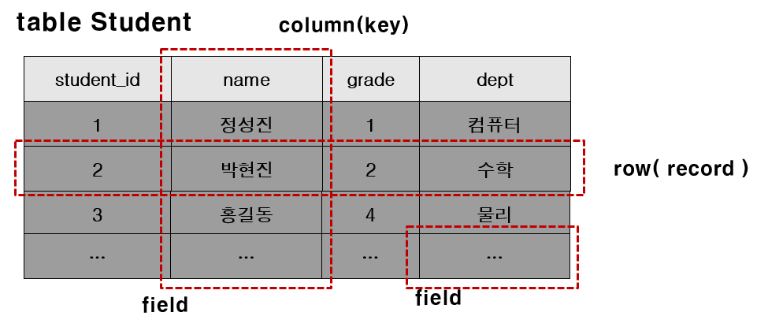

> 부스트코스 - 웹 프로그래밍(풀스택)강의를 학습, 정리한 내용입니다.(https://www.boostcourse.org/web316/joinLectures/12943)

# SQL 1 - BackEnd

- [SQL 1 - BackEnd](#sql-1---backend)
- [1. SQL이란? - 1](#1-sql이란---1)
  - [핵심 개념](#핵심-개념)
  - [SQL(Structured Query Language)](#sqlstructured-query-language)
    - [SQL의 구분](#sql의-구분)
  - [Database 생성하기](#database-생성하기)
  - [Database 사용자 생성과 권한 주기](#database-사용자-생성과-권한-주기)
    - [문법](#문법)
    - [실습 코드](#실습-코드)
  - [생성한 Database에 접속하기](#생성한-database에-접속하기)
    - [실습 코드](#실습-코드-1)
  - [MySQL 연결끊기](#mysql-연결끊기)
    - [실습 코드](#실습-코드-2)
  - [MySQL 버전과 현재 날짜 구하기](#mysql-버전과-현재-날짜-구하기)
  - [SQL 특징](#sql-특징)
    - [키워드는 대소문자를 구별하지 않는다.](#키워드는-대소문자를-구별하지-않는다)
    - [쿼리를 이용해서 계산식의 결과도 구할 수 있다.](#쿼리를-이용해서-계산식의-결과도-구할-수-있다)
    - [여러 문장을 한 줄에 연속으로 붙여서 실행 가능하다](#여러-문장을-한-줄에-연속으로-붙여서-실행-가능하다)
    - [하나의 SQL은 여러 줄로 입력 가능하다](#하나의-sql은-여러-줄로-입력-가능하다)
    - [SQL을 입력하는 도중에 취소 가능하다](#sql을-입력하는-도중에-취소-가능하다)
  - [DBMS에 존재하는 데이터베이스 확인하기](#dbms에-존재하는-데이터베이스-확인하기)
  - [사용중인 데이터베이스 전환하기](#사용중인-데이터베이스-전환하기)
    - [실습 코드](#실습-코드-3)
  - [참고](#참고)
  - [참고 자료](#참고-자료)
- [1) SQL이란?-2](#1-sql이란-2)
  - [핵심 개념](#핵심-개념-1)
  - [테이블(Table)](#테이블table)
  - [테이블(table)의 구성요소](#테이블table의-구성요소)
  - [테이블 목록 확인](#테이블-목록-확인)
  - [SQL 연습을 위한 테이블 생성과 값의 저장](#sql-연습을-위한-테이블-생성과-값의-저장)
  - [테이블 구조를 확인하기 위한 DESCRIBE 명령](#테이블-구조를-확인하기-위한-describe-명령)
  - [생각해보기](#생각해보기)
    - [생각해보기 실습](#생각해보기-실습)
  - [참고 자료](#참고-자료-1)

<small><i><a href='http://ecotrust-canada.github.io/markdown-toc/'>Table of contents generated with markdown-toc</a></i></small>


# 1. SQL이란? - 1
DBMS에게 명령을 내리는 언어인 SQL
* SQL
* 데이터베이스, 데이터베이스 사용자 생성 
## 핵심 개념
* create database
* grant
* flush privileges
* select
## SQL(Structured Query Language)
* SQL은 데이터를 보다 쉽게 검색하고 추가, 삭제, 수정 같은 조작을 할 수 있도록 고안된 컴퓨터 언어
* 관계형 데이터베이스에서 데이터를 조작하고 쿼리하는 표준 수단
### SQL의 구분
1. DML (조작어, Data Manipulation Language): 데이터를 조작하기 위해 사용
  * INSERT, UPDATE, DELETE, SELECT 등이 여기에 해당
2. DDL (정의어, Data Definition Language): 데이터베이스의 스키마를 정의하거나 조작하기 위해 사용
  * CREATE, DROP, ALTER 등이 여기에 해당
3. DCL (제어어, Data Control Language) : 데이터를 제어하는 언어
  * 권한을 관리하고, 데이터의 보안, 무결성 등을 정의(그랜트, 리보크, 트랜잭선 부여, 커밋, 롤백)
  * GRANT, REVOKE 등이 여기에 해당
## Database 생성하기
MySQL 관리자 계정(root)로 접속
* `mysql –uroot  -p`
  * window - 설치 시에 입력했던 암호를 입력
  * 맥 - 암호가 없으니 그냥 엔터를 입력

Database "connectdb" 생성
* `mysql> create database connectdb;`
## Database 사용자 생성과 권한 주기
* Database를 생성했다면, 해당 데이터베이스를 사용하는 계정을 생성해야 한다.
* 또한, 해당 계정이 데이터베이스를 이용할 수 있는 권한을 줘야 한다.
### 문법
* db이름 뒤의 `* `는 모든 권한을 의미한다.
* `@’%’`는 어떤 클라이언트에서든 접근 가능하다는 의미이고, `@’localhost’`는 해당 컴퓨터에서만 접근 가능하다는 의미
* `flush privileges`는 DBMS에게 적용을 하라는 의미
  * 해당 명령을 반드시 실행해줘야 한다.
```
grant all privileges on db이름.* to 계정이름@'%' identified by ＇암호’;
grant all privileges on db이름.* to 계정이름@'localhost' identified by ＇암호’;
flush privileges;
```
* 사용자 계정이름은 'connectuser', 암호는 'connect123!@#', 해당 사용자가 사용하는 데이터베이스는 'connectdb'로 계정을 생성하려면 다음과 같이 명령을 수행
```sql
grant all privileges on connectdb.* to connectuser@'%' identified by 'connect123!@#';

grant all privileges on connectdb.* to connectuser@'localhost' identified by 'connect123!@#';

flush privileges;
```
### 실습 코드
```
mysql> show databases;
+--------------------+
| Database           |
+--------------------+
| information_schema |
| mysql              |
| performance_schema |
| sys                |
+--------------------+
4 rows in set (0.02 sec)

mysql> create database connectdb;
Query OK, 1 row affected (0.01 sec)

mysql> create user connectuser@localhost identified by 'connect123!@#';
Query OK, 0 rows affected (0.02 sec)

mysql> grant all privileges on connectdb.* TO 'connectuser'@'localhost';
Query OK, 0 rows affected (0.01 sec)

mysql> flush privileges;
Query OK, 0 rows affected (0.01 sec)

mysql> show databases;
+--------------------+
| Database           |
+--------------------+
| connectdb          |
| information_schema |
| mysql              |
| performance_schema |
| sys                |
+--------------------+
5 rows in set (0.00 sec)
```
## 생성한 Database에 접속하기
원하는 데이터베이스에 접속
* `mysql –h호스트명 –uDB계정명 –p` 
* `mysql –h127.0.0.1 –uconnectuser –p connectdb [enter]`
### 실습 코드
```
C:\Users\Junha\github-workspace>mysql -h127.0.0.1 -uconnectuser -p connectdb
Enter password: *************
Welcome to the MySQL monitor.  Commands end with ; or \g.
Your MySQL connection id is 17
Server version: 8.0.25 MySQL Community Server - GPL

Copyright (c) 2000, 2021, Oracle and/or its affiliates.

Oracle is a registered trademark of Oracle Corporation and/or its
affiliates. Other names may be trademarks of their respective
owners.

Type 'help;' or '\h' for help. Type '\c' to clear the current input statement.
```
## MySQL 연결끊기
* 프롬프트에서 quit혹은 exit라고 입력
```
mysql> QUIT
mysql> exit
```
* Bye라고 나오면 연결 끊기 성공
### 실습 코드
```
mysql> quit;
Bye
```
## MySQL 버전과 현재 날짜 구하기
```
mysql> select version(), current_date;
+-----------+--------------+
| version() | current_date |
+-----------+--------------+
| 8.0.25    | 2021-07-16   |
+-----------+--------------+
1 row in set (0.00 sec)
```
* 프롬프트에서는 SQL을 입력
* SQL은 semicolon (;)으로 끝난다.
* SQL은 쿼리(Query)라고 읽는다.
* 쿼리는 DBMS에게 명령을 내릴 때 사용하는 문장이라고 생각하면 쉽다.
* SELECT는 어떤 내용을 조회할 때 사용하는 키워드
* `1 row in set (0.00 sec)`
  * MySQL은 쿼리에 해당하는 결과의 전체 row를 출력하고 마지막에 전체 row 수와 쿼리실행에 걸린 시간을 표시
## SQL 특징
### 키워드는 대소문자를 구별하지 않는다.
다음 쿼리들은 모두 같다.
```
mysql> SELECT VERSION(), CURRENT_DATE;
mysql> select version(), current_date;
mysql> SeLeCt vErSiOn(), current_DATE;
```
### 쿼리를 이용해서 계산식의 결과도 구할 수 있다.
*함수 및 수식 사용 예제*
```
mysql> select sin(pi()/4), (4+1)*5;
+--------------------+---------+
| sin(pi()/4)        | (4+1)*5 |
+--------------------+---------+
| 0.7071067811865476 |      25 |
+--------------------+---------+
1 row in set (0.00 sec)
``` 
### 여러 문장을 한 줄에 연속으로 붙여서 실행 가능하다
각 문장에 semicolon(;)만 붙혀 주면 된다.
```
mysql> select version(); select current_date;
+-----------+
| version() |
+-----------+
| 8.0.25    |
+-----------+
1 row in set (0.00 sec)

+--------------+
| current_date |
+--------------+
| 2021-07-16   |
+--------------+
1 row in set (0.00 sec)
```
### 하나의 SQL은 여러 줄로 입력 가능하다
MySQL은 문장의 끝을 라인으로 구분하는 것이 아니라 semicolon(;)으로 구분하기 때문에 여러 줄에 거쳐 문장을 쓰는 것도 가능
```
mysql> select       
    -> user()
    -> ,
    -> current_date;
+-----------------------+--------------+
| user()                | current_date |
+-----------------------+--------------+
| connectuser@localhost | 2021-07-16   |
+-----------------------+--------------+
1 row in set (0.00 sec)
```
### SQL을 입력하는 도중에 취소 가능하다
긴 쿼리를 작성하다가 중간에 취소해야 하는 경우에는 즉시 `\c`를 붙혀주면 된다.
```
mysql> SELECT

    -> USER()

    -> \c

mysql>
```
## DBMS에 존재하는 데이터베이스 확인하기
작업하기 위한 데이터베이스를 선택하기 위해서는 어떤 데이터베이스가 존재하는지 알아보아야 한다.

현재 서버에 존재하는 데이터베이스를 찾아보기 위해서 `SHOW` statement을 사용
```
mysql> show databases;
+--------------------+
| Database           |
+--------------------+
| connectdb          |
| information_schema |
+--------------------+
2 rows in set (0.00 sec)
```
## 사용중인 데이터베이스 전환하기
Database을 선택하기 위해,  “use” command 사용
* `mysql> use mydb;`

데이터베이스를 전환하려면, 이미 데이터베이스가 존재해야 하며 현재 접속 중인 계정이 해당 데이터베이스를 사용할 수 있는 권한이 있어야 한다.
### 실습 코드
```
C:\Users\Junha\github-workspace>mysql -uroot -p
Enter password: ******
Welcome to the MySQL monitor.  Commands end with ; or \g.
Your MySQL connection id is 21
Server version: 8.0.25 MySQL Community Server - GPL

Copyright (c) 2000, 2021, Oracle and/or its affiliates.

Oracle is a registered trademark of Oracle Corporation and/or its
affiliates. Other names may be trademarks of their respective
owners.

Type 'help;' or '\h' for help. Type '\c' to clear the current input statement.

mysql> use connectdb;
Database changed
```
## 참고
mysql 버전 8에서는 사용자 생성 및 권한 주는 부분이 아래와 같이 변경

설치한 mysql 버전을 확인 하고, 알맞게 사용. 

참고로 설치시에 "Use Lagacy Password Encryption" 방식으로 설치했을 때 해당

이렇게 설정을 해야지만 MySQL 5.x버전에서 사용하던 인증방식과 호환

만약, SHA 256기반의 암호화를 사용해야 한다면 'Use Strong Password Encryption for Authentication'을 선택

하지만, 이렇게 되면 새 버전(8.x)에서 제공하는 프로그램들만 서버에 접근이 가능하기 때문에 이전에 하던 모든 프로그램을 업그레이드 해야 한다.

JDBC Driver도 8.x에 맞는 버전을 사용해야 한다.  

`mysql -u root -p `

위와 같이 root 계정으로 접속

암호는 설치시 입력한 암호를 사용
```
CREATE DATABASE connectdb;

CREATE USER connectuser@localhost IDENTIFIED BY 'connect123!@#';

GRANT ALL PRIVILEGES ON connectdb.* TO 'connectuser'@'localhost';

FLUSH PRIVILEGES:
```
## 참고 자료
> 데이터베이스의 언어··· SQL이란 무엇인가
https://www.ciokorea.com

> [참고링크] MySQL 8.0 Reference Manual
https://dev.mysql.com/doc/refman/8.0/en/


# 1) SQL이란?-2
값을 저장할 수 있는 테이블을 알아보고  
앞으로 실습에 사용할 데이터를 examples.sql 파일을 이용해 테이블에 넣어 보자.
## 핵심 개념
* create database
* grant
* flush privileges
* select
## 테이블(Table)
마이크로소프트의 엑셀(Excel)을 실행하면 표가 나온다.  
이러한 표에 각종 값을 저장할 수 있다.  
데이터베이스도 엑셀의 표와 유사한 테이블을 가질 수 있다.  
엑셀과 다른 점은 데이터베이스를 생성해도 테이블은 존재하지 않는다는 것입니다.
* 데이터를 저장하는 공간.
* 관계형 DB는 대부분 테이블에 데이터를 저장한다.
* 테이블을 사용하려면 테이블을 생성하는 SQL을 사용해야 한다.
* 그리고, 테이블에 값을 저장하려면 저장하기 위한 SQL을 사용해야 한다.
## 테이블(table)의 구성요소

* 테이블 : RDBMS의 기본적 저장구조 1개 이상의 column과 0개 이상의 row로 구성
* 열(Column) : 테이블 상에서의 단일 종류의 데이터를 나타냄. 특정 데이터 타입 및 크기를 가지고 있다.
* 행(Row) : Column들의 값의 조합. 레코드라고 불림. 기본키(PK)에 의해 구분. 기본키는 중복을 허용하지 않으며 없어서는 안 된다.
* Field : Row와 Column의 교차점으로 Field는 데이터를 포함할 수 있고 없을 때는 NULL 값을 가지고 있다.
## 테이블 목록 확인
* 현재 데이터베이스에 존재하는 테이블 목록 확인하기  
* Database를 선택 후, Database의 전체 테이블 목록을 출력
```
mysql> show tables;
Empty set (0.02 sec)
```
“Empty set” 은  데이터베이스에 어떤 테이블도 아직 생성되지 않았다는 것
## SQL 연습을 위한 테이블 생성과 값의 저장
1. examples.sql을 다운로드.
    >[examples.sql](/examples.sql)
2. 터미널에서 examples.sql이 있는 폴더로 이동 
3. 테이블 생성 및 값 저장(접속/암호입력)
   * `mysql   -uconnectuser  -p  connectdb   <  examples.sql`
     * examples.sql에는 연습을 위한 테이블 생성문과 해당 테이블에 값을 저장하는 입력문이 존재
4. connectdb에 접속
   * `mysql –uconnectuser -p  connectdb`
5. 접속한 db의 테이블 목록 확인
   * `mysql> show tables`
        ```
        mysql> show tables;
        +-----------------------+
        | Tables_in_connectdb   |
        +-----------------------+
        | bonus                 |
        | department            |
        | employee              |
        | project               |
        | project_participation |
        | role                  |
        | salarygrade           |
        +-----------------------+
        7 rows in set (0.00 sec)
        ```
## 테이블 구조를 확인하기 위한 DESCRIBE 명령
* table 구조를 확인하기 위해,  DESCRIBE 명령을 사용 가능(짧게 DESC)
* EMPLOYEE테이블의 구조 확인
  * `mysql> desc EMPLOYEE;`
## 생각해보기
* 하나의 DBMS에는 여러 개의 데이터베이스를 생성하고, 각각의 데이터베이스를 사용할 수 있는 사용자를 추가할 수 있습니다.
* 이번 시간에 만든 connectdb와 connectuser 말고, 추가로 데이터베이스를 생성하고, 생성한 데이터베이스를 사용한 사용자를 추가하고 로그인해보세요.
### 생각해보기 실습
* database : qufstar7
* user : qufstar7user
* pw : qufstar7123!@#
* privileges : All
* tables : None
```
mysql> create database qufstar7;
Query OK, 1 row affected (0.01 sec)

mysql> create user qufstar7user@localhost identified by 'qufstar7123!@#';
Query OK, 0 rows affected (0.01 sec)

mysql> grant all privileges on qufstar7.* to 'qufstar7user'@'localhost';
Query OK, 0 rows affected (0.00 sec)

mysql> flush privileges;
Query OK, 0 rows affected (0.01 sec)

mysql> show databases;
+--------------------+
| Database           |
+--------------------+
| connectdb          |
| information_schema |
| mysql              |
| performance_schema |
| qufstar7           |
| sys                |
+--------------------+
6 rows in set (0.00 sec)

mysql> quit
Bye

C:\Users\Junha\github-workspace\TIL\Web programming(full stack)>mysql -uqufstar7user -p qufstar7
Enter password: **************
Welcome to the MySQL monitor.  Commands end with ; or \g.
Your MySQL connection id is 32
Server version: 8.0.25 MySQL Community Server - GPL

Copyright (c) 2000, 2021, Oracle and/or its affiliates.

Oracle is a registered trademark of Oracle Corporation and/or its
affiliates. Other names may be trademarks of their respective
owners.

Type 'help;' or '\h' for help. Type '\c' to clear the current input statement.

mysql> select version(), current_date();
+-----------+----------------+
| version() | current_date() |
+-----------+----------------+
| 8.0.25    | 2021-07-16     |
+-----------+----------------+
1 row in set (0.00 sec)

mysql> show databases;
+--------------------+
| Database           |
+--------------------+
| information_schema |
| qufstar7           |
+--------------------+
2 rows in set (0.00 sec)

mysql> show tables;
Empty set (0.00 sec)
```
## 참고 자료
> [참고링크] 데이터베이스의 언어··· SQL이란 무엇인가
http://www.ciokorea.com

> [참고링크] 13.1.11 CREATE DATABASE Syntax
https://dev.mysql.com

> [참고링크] 13.7.1.4 GRANT Syntax
https://dev.mysql.com

> [참고링크] 13.2.9 SELECT Syntax
https://dev.mysql.com