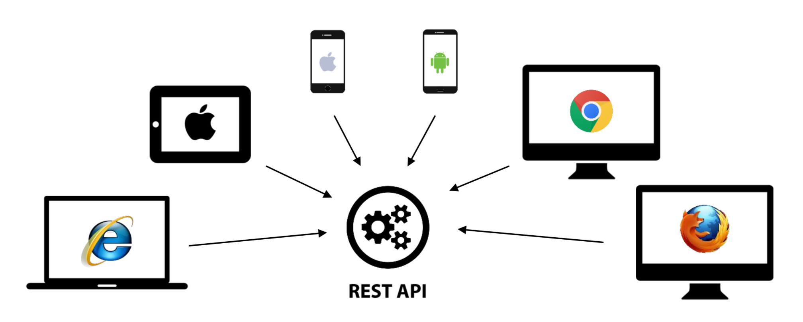

> 부스트코스 - 웹 프로그래밍(풀스택)강의를 학습, 정리한 내용입니다.(https://www.boostcourse.org/web316/joinLectures/12943)

# Web API - BackEnd

- [Web API - BackEnd](#web-api---backend)
- [1) Rest API](#1-rest-api)
  - [핵심 개념](#핵심-개념)
  - [API란?](#api란)
    - [wiki](#wiki)
    - [java 8 API specification](#java-8-api-specification)
  - [REST API란?](#rest-api란)
    - [API LINKS](#api-links)
  - [REST API 의 기준](#rest-api-의-기준)
    - [스타일(제약조건의 집합)](#스타일제약조건의-집합)
    - [uniform interface의 스타일](#uniform-interface의-스타일)
    - [독립적 진화](#독립적-진화)
    - [정리](#정리)
  - [REST API의 대체품 : Web API](#rest-api의-대체품--web-api)
  - [생각해보기](#생각해보기)
  - [참고 자료](#참고-자료)
- [Web API](#web-api)
  - [핵심 개념](#핵심-개념-1)
  - [Web API 디자인 가이드](#web-api-디자인-가이드)
    - [자원에 대한 행위는 HTTP Method로 표현](#자원에-대한-행위는-http-method로-표현)
    - [URI는 정보의 자원을 표현해야 한다.](#uri는-정보의-자원을-표현해야-한다)
    - [자원에 대한 행위는 HTTP Method로 표현](#자원에-대한-행위는-http-method로-표현-1)
  - [URI 표현 규칙](#uri-표현-규칙)
    - [예시 URI](#예시-uri)
  - [상태 코드의 종류](#상태-코드의-종류)
    - [상태 코드 (성공) - 200번대](#상태-코드-성공---200번대)
    - [상태 코드 (클라이언트로 인한 오류) - 400번대](#상태-코드-클라이언트로-인한-오류---400번대)
    - [상태 코드 (서버로 인한 오류) - 301, 500](#상태-코드-서버로-인한-오류---301-500)
  - [생각해보기](#생각해보기-1)
  - [참고 자료](#참고-자료-1)
- [Web API 실습](#web-api-실습)
  - [핵심 개념](#핵심-개념-2)
  - [실습](#실습)
    - [실습 단계](#실습-단계)
    - [실습 코드](#실습-코드)
    - [실행 결과](#실행-결과)
    - [오류상황 및 해결](#오류상황-및-해결)
  - [실습 2](#실습-2)
    - [실습 단계](#실습-단계-1)
    - [실습 코드](#실습-코드-1)
  - [생각해보기](#생각해보기-2)
    - [내생각](#내생각)
  - [참고 자료](#참고-자료-2)

<small><i><a href='http://ecotrust-canada.github.io/markdown-toc/'>Table of contents generated with markdown-toc</a></i></small>


# 1) Rest API
웹 브라우저, 안드로이드, ios와 같은 다양한 클라이언트에게 정보를 제공하는 방식을 일원화 하는 방식 중 대표적인 방식인 REST API(HTTP프로토콜로 API를 제공하는 것)
## 핵심 개념
* REST API
* WEB API (HTTP API)
## API란?
* API :  Application Programming Interface
### wiki
* “API(Application Programming Interface, 응용 프로그램 프로그래밍 인터페이스)는 응용 프로그램에서 사용할 수 있도록, 운영 체제나 프로그래밍 언어가 제공하는 기능을 제어할 수 있게 만든 인터페이스"
* 주로 파일 제어, 창 제어, 화상 처리, 문자 제어 등을 위한 인터페이스를 제공
### java 8 API specification
>[참고 바로가기] https://docs.oracle.com/javase/8/docs/api/
* 자바 언어가 제공하는 클래스와 인터페이스에 대한 설명 = API문서
* 자바 프로그램이 제공하는 클래스와 인터페이스를 알면 내부적으로 어떻게 구현되어 있는지 몰라도 각종 기능들을 사용할 수 있다.
* 즉, 해당 라이브러리를 사용할 때 구현코드를 알지 못해도 인터페이스만 알면 사용할 수 있다.
* 이렇게 프로그래밍을 할 때 필요한 인터페이스를 API라고 한다.
## REST API란?
* REST는 REpresentational State Transfer라는 용어의 약자로서 2000년도에 로이 필딩 (Roy Fielding)의 박사학위 논문에서 최초로 소개되었습니다.
* REST API란 말 그대로 REST형식의 API를 말합니다. 
* REST API란 핵심 컨텐츠 및 기능을 외부 사이트에서 활용할 수 있도록 제공되는 인터페이스입니다.
* 예를 들어, 네이버에서 블로그에 글을 저장하거나, 글 목록을 읽어갈 수 있도록 외부에 기능을 제공하거나 우체국에서 우편번호를 조회할 수 있는 기능을 제거하거나, 구글에서 구글 지도를 사용할 수 있도록 제공하는 것들을 말합니다.



* 웹 브라우저 뿐만 아니라 앱 등 다양한 클라이언트가 등장하면서 그러한 클라이언트들에게 대응하기 위해 REST API가 널리 사용되기 시작하였습니다.
* 서비스 업체들이 다양한 REST API를 제공함으로써, 클라이언트는 이러한 REST API들을 조합한 어플리케이션을 만들 수 있게 되었습니다.
* 이를 매시업(Mashup)이라고 합니다.

### API LINKS
* 유명 사이트에서 제공하는 API 관련된 문서 링크
>네이버 API 소개 바로가기 (https://developers.naver.com/products/intro/plan/plan.md)
>페이스북의 그래프 API 문서 바로가기 (https://developers.facebook.com/docs/graph-api)
>공공 데이터 포털 바로가기 (https://www.data.go.kr/)
## REST API 의 기준
* 이렇게 REST API가 널리 사용되었지만, REST를 논문으로 최초 소개한 로이필딩은 대부분의 REST API라고 하는 것들이 REST API가 아니라고 말합니다.

* REST는 다음과 같은 스타일을 반드시 지켜야 한다고 말한다.
### 스타일(제약조건의 집합)
1. client-server
2. stateless
3. cache
4. uniform interface
5. layered system
6. code-on-demand (optional)

* HTTP프로토콜을 사용한다면 client-server, stateless, cache, lared system, code-on-demand 등에 대해서는 모두 쉽게 구현 가능

* 하지만, 문제는 uniform interface입니다.

### uniform interface의 스타일
1. 리소스가 URI로 식별되야 합니다.
2. 리소스를 생성,수정,추가하고자 할 때 HTTP메시지에 표현을 해서 전송해야 합니다.
3. 메시지는 스스로 설명할 수 있어야 합니다.
(Self-descriptive message)
4. 애플리케이션의 상태는 Hyperlink를 이용해 전이되야 합니다.(HATEOAS)
  
* 첫 번째와 두 번째 항목은 지키기 어렵지 않은데, *메시지가 스스로 설명할 수 있어야 하는 부분*과 *HATEOAS를 지원하는 것*은 웹과는 다르게 API로는 쉽지가 않습니다.
* 응답 결과에 보통 JSON 메시지(다음 시간에 간단히 다루게 됩니다.)를 사용하게 되는데, 이 JSON메시지가 어디에 전달되는지 그리고 JSON메시지를 구성하는 것이 어떤 의미를 표현해야만 메시지 스스로 설명할 수 있다고 말할 수 있는데, 그게 쉽지 않습니다.
* 우리가 웹 게시판을 사용할 때, 리스트 보기를 보면, 상세보기나 글쓰기로 이동할 수 있는 링크가 있습니다.
* 상세보기에서는 글 수정이나 글 삭제로 갈 수 있는 링크가 있습니다.
* 이렇게 웹 페이지를 보면, 웹 페이지 자체에 관련된 링크가 있는것을 알 수 있는데 이를 HATEOAS라고 말합니다.
* 이런 HATEOAS를 API에서 제공하는 것은 쉽지 않습니다.
### 독립적 진화
서버와 클라이언트가 각각 독립적으로 진화한다.  
서버의 기능이 바뀌어도 클라이언트를 업데이트할 필요가 없다.  
로이 필딩이 REST를 민든 계기 : HTTP를 웹을 붕괴시키지 않고 발전시키기 위함.  
즉 , HTTP를 업데이트해도 웹이 붕괴되지 않고 그대로 사용할 수 있어야 한다는 의미.
* REST를 만족시키는 예시 - web
  * 웹 페이지를 변경해도 웹 브라우저를 업데이트할 필요가 없다.
  * 반대로 웹 브라우저를 업데이트해도 웹 페이지를 변경할 필요가 없다.
  * HTTP와 HTML의 명세가 바뀌어도 웹은 잘 동작한다. (깨질 수 는 있다.)
### 정리
로이필딩이 말하길 서버와 클라이언트의 독립적 진화(ex. 웹 - 브라우저와 페이지(클라이언트) 중 하나가 변경되어도 나머지 하나가 업데이트할 필요가 없이 잘 동작한다...form이 깨질 수는 있다.)를 위해 REST API의 아키텍쳐 스타일을 지켜야한다. REST API를 굳이 쓰지 않아도 된다.(1. 시스템 전체를 통제할 수 있을 경우 2. 진화에 관심이 없는 경우) 
## REST API의 대체품 : Web API
* REST의 uniform interface를 지원하는 것은 쉽지 않기 때문에, 많은 서비스가 REST에서 바라는 것을 모두 지원하지 않고 API를 만들게 됩니다.
* REST의 모든 것을 제공하지 않으면서 REST API라고 말하는 경우도 있습니다.
* REST의 모든 것을 제공하지 않고 Web API 혹은 HTTP API라고 부르는 경우가 있습니다.
* 우리는 2번째 방식을 따르려고 합니다.
* 이번 시간엔 REST API가 무엇인지 개념을 살펴봤습니다.
* 다음 시간에는 Web API에 대해서 알아보고 실습도 해보도록 하겠습니다.
## 생각해보기
이번 시간엔 Rest API라는 용어에 대해 살펴보았습니다.  
REST에서 몇가지 규칙을 지키지 않을 경우 Web API혹은 HTTP API라고 부르기로 하였습니다.  
프로그래밍을 공부하다보면 용어에 대해 굉장히 깐깐히 다루는 것을 종종 목격하게 됩니다.  
용어에 대해서 명확하게 정의하지 않을 경우 어떤 일이 발생할까요?
* 개발자 자신이 아닌 사람이 해당 프로그램을 사용할 때 용어에 대해 잘못 이해해 해석, 사용, 수정에 어려움이 있을 수 있다.
## 참고 자료
> [참고링크] REST API Tutorial
http://www.restapitutorial.com

> [참고영상] 그런 REST API로 괜찮은가 
https://www.youtube.com/watch?v=RP_f5dMoHFc&ab_channel=naverd2
 
> [참고링크] 당신의 API가 Restful 하지 않은 5가지 증거
https://beyondj2ee.wordpress.com

> [참고링크] Five Clues That Your API isn't RESTful - DZone Performance
https://dzone.com
 
> [참고링크] REST API 제대로 알고 사용하기 : TOAST Meetup
http://meetup.toast.com


# Web API
REST API와 Web API의 차이점  
* REST API의 아키텍쳐 스타일을 모두 구현하지 못한 경우에는 REST API라고 부르기보다는 Web API나 HTTP API라고 부른다

Web API 디자인 가이드(규칙)
## 핵심 개념
* Web API
* HTTP Methods
Web API 란?
## Web API 디자인 가이드
1. URI를 잘 표현해야 한다.
   * URI는 정보의 자원을 표현해야 합니다.
2. 자원에 대한 행위는 HTTP Method(GET, POST, PUT, DELETE)로 표현한다.
### 자원에 대한 행위는 HTTP Method로 표현

### URI는 정보의 자원을 표현해야 한다.
* GET /members  
: 멤버의 모든 정보를 달라는 요청입니다.
* GET /members/delete/1  
: 틀린 표현. GET은 정보를 요청할 때 사용. 위와 같이 동사로 삭제를 표현하면 안된다. 2개가 겹쳐서 사용 x(의미 불명확)
* DELETE /members/1  
: HTTP Method 중의 하나인 DELETE를 이용하여 삭제를 표현
### 자원에 대한 행위는 HTTP Method로 표현
* 동사로 표현된 방식은 잘못된 것. ( 중간에 get, add 와 같은 표현 사용 )
* Method / members / 1번데이터

|   |   |
|---|---|
GET /members/get/1| (x)
GET /members/1| (o)
GET /members/add| (x)
POST /members| (o)
GET /members/update/1| (x)
PUT /members/1| (o)
GET /members/del/1| (x)
DELETE /members/1| (o)
## URI 표현 규칙
* 슬래시 구분자(/)는 계층을 나타낼 때 사용.
* URI 마지막 문자로 슬래시 구분자(/)를 포함하지 않는다.
* 하이픈(-)은 URI가독성을 높일 때 사용
* 언더바(_)는 사용하지 않는다.
* URI경로는 소문자만 사용.
* RFC 3986(URI 문법 형식)은 URI스키마와 호스트를 제외하고는 대소문자를 구별.
* 파일 확장자는 URI에 포함하지 않는다.
* Accept Header를 사용.
### 예시 URI
http://domain/houses/apartments
* 집들 중 아파트 요청
http://domain/departments/1/employees
* 부서들 중 1번 부서의 사원 요청
## 상태 코드의 종류
### 상태 코드 (성공) - 200번대 

### 상태 코드 (클라이언트로 인한 오류) - 400번대

* 405 - 서블릿에 doGET만 가지고 있는데 사용자가 POST로 요청하면 응답되는 코드 
### 상태 코드 (서버로 인한 오류) - 301, 500

## 생각해보기
기계와 기계가 통신하는 방법 중에 web API가 있습니다. 이 외에 또 어떤 방법으로 기계와 기계가 통신할 수 있을까요?
* 통신 프로토콜 :  컴퓨터나 원거리 통신 장비 사이에서 메시지를 주고 받는 양식과 규칙의 체계(참조 : 위키), 즉 기계의 언어라 할 수 있다.  
HTTP부터 WebAPI까지 모든 통신 프로토콜(또는 그 집합)은 기계와 기계가 통신하는 방법이라 할 수 있다.
## 참고 자료
> [참고링크] REST API 제대로 알고 사용하기 : TOAST Meetup
http://meetup.toast.com

> [참고링크] Servlet and path parameters like /xyz/{value}/test, how to map in web.xml?
https://stackoverflow.com


# Web API 실습
Servlet을 이용해 Web API를 작성 (RoleDao.java도 이번 시간에 재활용)   
객체를 JSON문자열로 변환  
## 핵심 개념
* JSON
* ObjectMapper
* URL pattern에서 wildcard(*)

## 실습
JDBC에서 role 리스트를 가져와 json의 형태로 출력
### 실습 단계
1. maven project 생성 
   * archetype : webapp
   * Group id : kr.or.connect
   * ARTIFACT ID : webapiexam
2. JDK 1.8 version 사용을 위한 plugin 추가
3. 라이브러리 추가(dependency)
   * maven repository 링크 
     1. mysql connector/j (jdbc driver for mysql)
     https://mvnrepository.com/artifact/mysql/mysql-connector-java

     1. Json 라이브러리 - jackson core(Streaming api)
     https://mvnrepository.com/artifact/com.fasterxml.jackson.core/jackson-core


     1. java servlet api
     https://mvnrepository.com/artifact/javax.servlet/javax.servlet-api


     1. jstl
     https://mvnrepository.com/artifact/javax.servlet/jstl
4. Maven update project
5. .settings - org.eclipse...core.xml 파일 수정 (Navigator탭)
   * `jst.web` - version : 2.3 > 3.1
   * 사용할 서블릿 버전으로 수정
   * 변경 확인 (Dynamic Web Module : 3.1)
    
6. web.xml 삭제
   * 경로 : webapiexam\src\main\webapp\WEB-INF\web.xml
7. pom.xml - properties 오류 방지 코드 추가
   * web.xml을 찾을 때 발생하는 오류 방지
        ```xml
        <properties>
            <!-- web.xml 파일을 삭제해도 eclipse에서 오류가 발생하지 않는다. -->
            <failOnMissingWebXml>false</failOnMissingWebXml>
        </properties>
        ```
8. src/main/경로에 'java' 폴더 생성 - 자바 패키지와 클래스 저장용 폴더
9. 패키지 생성 - project explorer 탭
   * src/main/java 밑에 'kr.or.connecdt.webapiexam.api'패키지 생성
10. 'jdbcexam' 프로젝트에서 'jdbcexam.dao', 'jdbcexam.dto'패키지를 복사
    * src/main/java밑으로 붙여넣기.
  
여기까지가 준비단계

* 실습용 추가 설명
  * 모든 롤 정보 읽어오기. GET /roles
  * 특정한 롤정보 읽어오기. GET /roles/{roleId}
  * 롤정보 등록하기. POST /roles
  * 롤정보 삭제하기. DELETE /roles/{roleId}
  * 롤정보 수정하기. PUT /roles/{roleId}

11. RolesServlet 서블릿 생성 및 작성
    * 위치 : webapiexam.api패키지
    * url mapping : /roles
    * 오버라이딩 : doGET()

### 실습 코드
* pom.xml
```xml
<project xmlns="http://maven.apache.org/POM/4.0.0" xmlns:xsi="http://www.w3.org/2001/XMLSchema-instance"
	xsi:schemaLocation="http://maven.apache.org/POM/4.0.0 http://maven.apache.org/maven-v4_0_0.xsd">
	<modelVersion>4.0.0</modelVersion>
	<groupId>kr.or.connect</groupId>
	<artifactId>webapiexam</artifactId>
	<packaging>war</packaging>
	<version>0.0.1-SNAPSHOT</version>
	<name>webapiexam Maven Webapp</name>
	<url>http://maven.apache.org</url>
	<properties>
		<!-- web.xml 파일을 삭제해도 eclipse에서 오류가 발생하지 않는다. -->
		<failOnMissingWebXml>false</failOnMissingWebXml>
	</properties>
	<dependencies>
		<dependency>
			<groupId>mysql</groupId>
			<artifactId>mysql-connector-java</artifactId>
			<version>5.1.45</version>
		</dependency>

		<!-- json 라이브러리 databind jackson-core, jackson-annotaion에 의존성이 있다. -->
		<dependency>
			<groupId>com.fasterxml.jackson.core</groupId>
			<artifactId>jackson-databind</artifactId>
			<version>2.9.4</version>
		</dependency>

		<dependency>
			<groupId>javax.servlet</groupId>
			<artifactId>javax.servlet-api</artifactId>
			<version>3.1.0</version>
			<scope>provided</scope>
		</dependency>

		<dependency>
			<groupId>javax.servlet</groupId>
			<artifactId>jstl</artifactId>
			<version>1.2</version>
		</dependency>

		<dependency>
			<groupId>junit</groupId>
			<artifactId>junit</artifactId>
			<version>3.8.1</version>
			<scope>test</scope>
		</dependency>
	</dependencies>
	<build>
		<finalName>webapiexam</finalName>
		<plugins>
			<plugin>
				<groupId>org.apache.maven.plugins</groupId>
				<artifactId>maven-compiler-plugin</artifactId>
				<version>3.6.1</version>
				<configuration>
					<source>1.8</source>
					<target>1.8</target>
				</configuration>
			</plugin>
		</plugins>
	</build>
</project>
```

* RoleServlet.java
```java
package kr.or.connect.webapiexam.api;

import java.io.IOException;
import java.io.PrintWriter;
import java.util.List;

import javax.servlet.ServletException;
import javax.servlet.annotation.WebServlet;
import javax.servlet.http.HttpServlet;
import javax.servlet.http.HttpServletRequest;
import javax.servlet.http.HttpServletResponse;

import com.fasterxml.jackson.databind.ObjectMapper;

import kr.or.connect.jdbcexam.dao.RoleDao;
import kr.or.connect.jdbcexam.dto.Role;

@WebServlet("/roles")
public class RolesServlet extends HttpServlet {
	private static final long serialVersionUID = 1L;

	public RolesServlet() {
		super();
	}

	protected void doGet(HttpServletRequest request, HttpServletResponse response)
			throws ServletException, IOException {
		response.setCharacterEncoding("utf-8");
		response.setContentType("application/json");

		RoleDao dao = new RoleDao();

		List<Role> list = dao.getRoles();

		ObjectMapper objectMapper = new ObjectMapper();
		String json = objectMapper.writeValueAsString(list);

		PrintWriter out = response.getWriter();
		out.println(json);
		out.close();
	}

}
```
코드설명
1. 인코딩
2. contenttype
3. RoleDao 객체 생성
4. list 객체 생성(getRoles메서드 사용)
5. Jackson라이브러리가 제공해주는 ObjectMapper()를 이용
  * Json문자열로 바꾸거나 Json문자열을 객체로 바꾸는 역할을 수행해주는 메서드
6. writeValueAsString()사용
  * 파라미터로 list 를 넣어주면 list가 JSON문자로 바뀐다.
  * List를 JSON문자로 바꿔서 출력하기 위해
7. PrintWriter로 json객체 출력
### 실행 결과
```
[{"roleId":201,"description":null},{"roleId":102,"description":"Project manager"},{"roleId":101,"description":"Researcher"},{"roleId":100,"description":"Developer"}]
```
* JSON메세지가 출력되었다.
* JSON은 javascript object notation의 약어로 아주 가벼운 형태의 메시지 교환형식
* 자바스크립트에서는 객체로 만들 때 사용하는 표현식이기도하다.
* 대괄호는 배열, 리스트를 의미
* 중괄호는 객체 한 건을 의미한다
* 중괄호 안에는 작은따옴표나 큰따옴표로 묶인 속성명이 나온다.
* 콜론 다음에는 값이 나온다.
* 숫자는 작은 따옴표나 큰따옴표로 묶이지는 않는다.
* 문자열만 큰 따옴표로 묶여있다.
* JDBC소스에서 Role에 대한 데이터를 가져와서 JSON 형태로 바꿔서 응답 결과를 보내 출력이 되고 있는 것
### 오류상황 및 해결
1. application/json IE8,9 에서 인식안되서 파일 저장으로 나오는 문제에 대한 해결 
    > [jQuery $.ajax에서 응답 Content-Type을 application/json 사용시 응답 내용이 파일로 다운로드 처리되는 문제](https://blog.asamaru.net/2016/02/23/jquery-ajax-ie8-content-type-application-json/)
    > [ie9 등에서 json 파일 다운로드](http://webprogramer.kr/blog/P000000301/post.do)
    * 실행 시 window web browser를 chrome, fire fox, ms edge로 바꿔서 실행해 보았지만 모두 실행결과를 출력하지 않고 role이라는 파일이 다운로드가 되었다.
    * 위의 블로그, 포스트에서는 ie 9 이하의 버전에서의 문제라고 하는데 브라우저의 문제가 아니었다. 
    * ajax 사용 시 해당문제가 나타날 때 jquery의 최신 버전에서는 알아서 해결해준다고 한다.
    * 일단 포스트에서 설명해준대로 응답타입을 text/plain으로 바꿔서 실행하니 제대로 출력 되었다.
2. Maven의 라이브러리 인식 오류
   * Maven Dependency에 가져왔던 라이브러리들이 다 있음에도 import가 제대로 안되는 문제들이 종종 발생한다.
   * 이클립스 자체적으로 가지고 있는 문제이기도 하다.
   * 파일 탐색기를 열어서 확인을 해보면
   * C드라이브에 User를 찾아 `.m2`라는 디렉토리를 열어보면 repository가 있고 사용중인 모든 라이브러리를 확인할 수 있다.
    
   * 이 `.m2` 디렉토리를 아예 삭제하고(이클립스를 닫고 삭제) Maven > update project 해준다.
   * 그럼 다시 import하는 과정을 거쳐 제대로 라이브러리를 읽어온다.

## 실습 2
아이디 한 건에 대해서 role 정보를 읽어오는 서블릿을 작성
### 실습 단계
1. 서블릿 작성 - RoleById 서블릿
   * urlmapping : /roles/*
     * roles밑에 어떤 문자든지 올 수 있다.
   * 오버라이딩 : doGET()
### 실습 코드
* RoleByIdServlet.java
```java
package kr.or.connect.webapiexam.api;

import java.io.IOException;
import java.io.PrintWriter;

import javax.servlet.ServletException;
import javax.servlet.annotation.WebServlet;
import javax.servlet.http.HttpServlet;
import javax.servlet.http.HttpServletRequest;
import javax.servlet.http.HttpServletResponse;

import com.fasterxml.jackson.databind.ObjectMapper;

import kr.or.connect.jdbcexam.dao.RoleDao;
import kr.or.connect.jdbcexam.dto.Role;

@WebServlet("/roles/*")
public class RoleByIdServlet extends HttpServlet {
	private static final long serialVersionUID = 1L;

	public RoleByIdServlet() {
		super();
		// TODO Auto-generated constructor stub
	}

	protected void doGet(HttpServletRequest request, HttpServletResponse response)
			throws ServletException, IOException {
		response.setCharacterEncoding("utf-8");
		response.setContentType("application/json");

		String pathInfo = request.getPathInfo(); // /roles/{roleId}
		String[] pathParts = pathInfo.split("/");
		String idStr = pathParts[1];
		int id = Integer.parseInt(idStr);

		RoleDao dao = new RoleDao();

		Role role = dao.getRole(id);

		ObjectMapper objectMapper = new ObjectMapper();
		String json = objectMapper.writeValueAsString(role);

		PrintWriter out = response.getWriter();
		out.println(json);
		out.close();
	}

}
```
* request객체의 getPathInfo()메서드를 이용해 path정보를 읽어온다
* pathInfo를 /를기준으로 잘라서 배열을 만들었다.
* roleId 값을 int값으로 바꿔준다.
  * 배열의 0번은 roles고 roleId가 1번
* objectMapper 의 writeValueAsString()를 이용해 JSON문자열을 구하고
* response.getWriter를 이용해서 출력
## 생각해보기
자바 서블릿은 보통 하나의 URL에 대한 처리만 합니다.

그런데 이번 실습을 보면 Role과 관련된 다양한 URL이 필요했고, 이를 처리하기 위한 클래스가 여러 개 필요했습니다.

객체지향은 관련된 여러 개의 기능을 하나로 모으는 것이 중요합니다.

그런데, 관련된 여러 개의 URL 처리를 여러 개의 서블릿으로 나눠서 하고 있습니다.

이러한 문제를 해결하려면 어떻게 해야 할까요?
### 내생각
url mapping 을 여러 개 추가한다  
멀티스레딩을 활용한다  
넷빈즈와 같은 툴을 사용한다  
오버라이딩을 여러 개 해서 기능을 추가한다  
Node.js, python, spring 등 프레임 워크들을 사용해 url만 따로 모아두는 파일을 만든다    
* > https://docs.oracle.com/cd/E19957-01/816-6105-10/pservlet.htm
* > https://stackoverflow.com/questions/8960355/how-to-use-single-servlet-with-different-url-pattern
* > https://help.perforce.com/hydraexpress/4.6.0/html/rwsfservletug/4-8.html
* > https://stackoverflow.com/questions/52494162/servlet-multiple-request-handle-at-same-time-on-tomcat
## 참고 자료
> [참고링크] JDBC Basics
https://docs.oracle.com