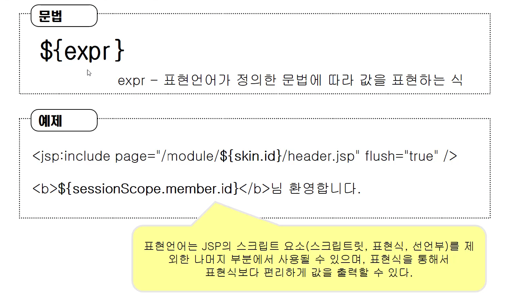
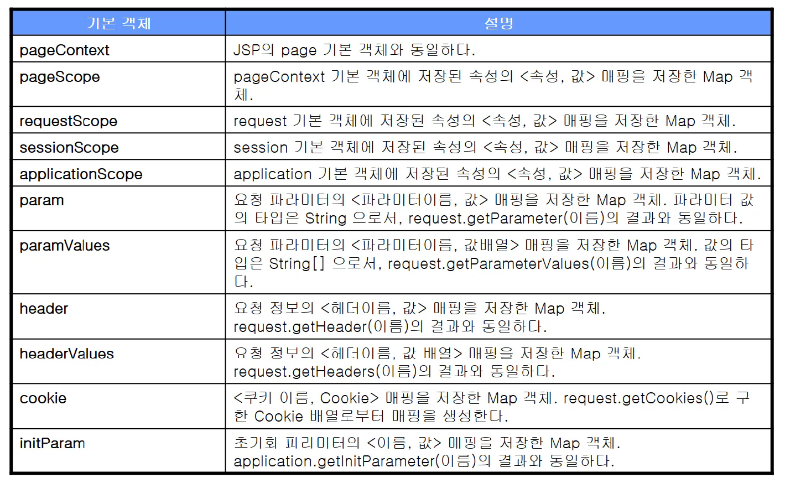
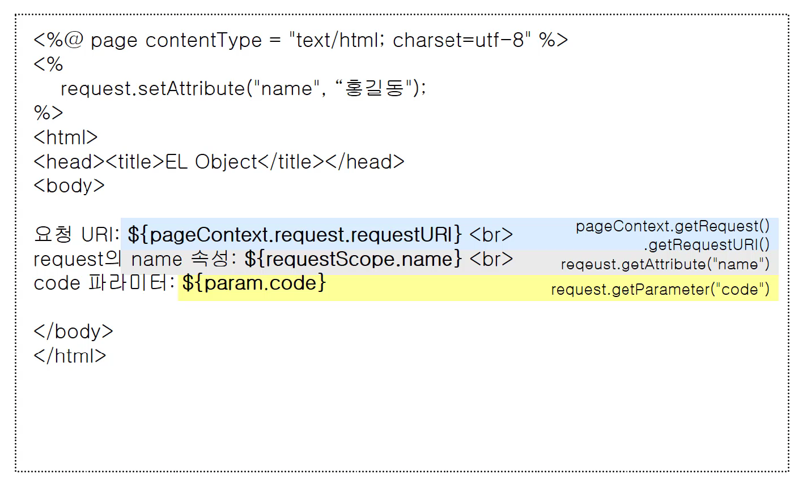
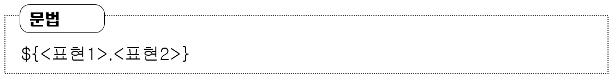
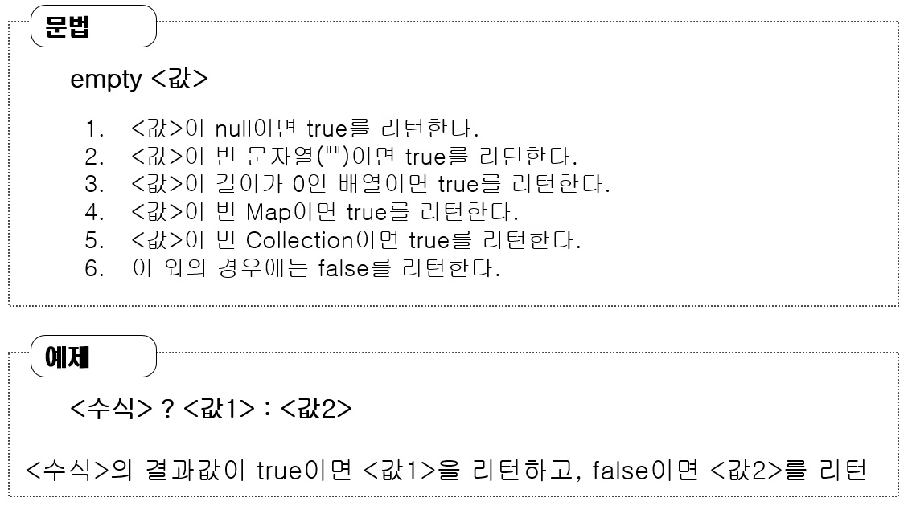
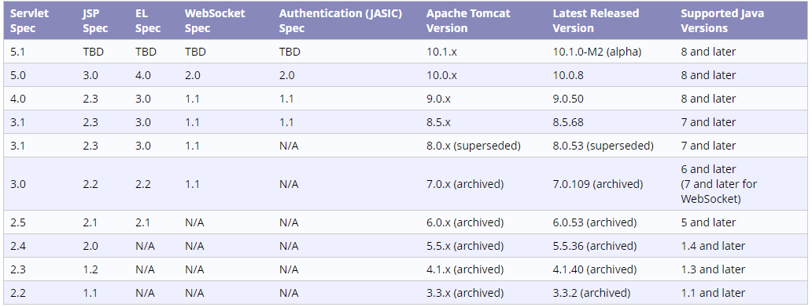

> 부스트코스 - 웹 프로그래밍(풀스택)강의를 학습, 정리한 내용입니다.(https://www.boostcourse.org/web316/joinLectures/12943)

# EL - BackEnd

- [EL - BackEnd](#el---backend)
- [EL(Expression Language)](#elexpression-language)
  - [핵심 개념](#핵심-개념)
  - [표현 언어란?](#표현-언어란)
  - [표현 언어가 제공하는 기능](#표현-언어가-제공하는-기능)
  - [표현언어의 표현방법](#표현언어의-표현방법)
  - [표현언어의 기본 객체](#표현언어의-기본-객체)
  - [표현 언어의 기본 객체 사용 예](#표현-언어의-기본-객체-사용-예)
  - [표현 언어의 데이터 타입](#표현-언어의-데이터-타입)
  - [객체 접근 규칙](#객체-접근-규칙)
    - [문법](#문법)
    - [객체 접근 규칙](#객체-접근-규칙-1)
  - [표현 언어의 수치 연산자](#표현-언어의-수치-연산자)
  - [비교 연산자](#비교-연산자)
  - [논리 연산자](#논리-연산자)
  - [empty 연산자, 비교선택 연산자](#empty-연산자-비교선택-연산자)
  - [연산자 우선순위](#연산자-우선순위)
  - [표현 언어 비활성화 : JSP에 명시하기](#표현-언어-비활성화--jsp에-명시하기)
  - [서블릿 별 EL 지원](#서블릿-별-el-지원)
  - [실습 1](#실습-1)
    - [el01.jsp](#el01jsp)
  - [실습 2](#실습-2)
    - [el02.jsp](#el02jsp)
  - [생각해보기](#생각해보기)
  - [참고 자료](#참고-자료)

<small><i><a href='http://ecotrust-canada.github.io/markdown-toc/'>Table of contents generated with markdown-toc</a></i></small>


# EL(Expression Language)
표현언어(EL)을 이해하고 사용해보자
* 표현언어는 기본적으로 jsp, java코드가 디자이너, 프론트엔드개발자에게 이질적으로 느껴지는 문제점을 해소하기 위해 고안된 좀더 직관적이고 이질감이 덜한 스크립트 언어이다.
* jsp에서 표현식을 이용해 값을 출력할 때 변수의 값이 null이면 화면에 null이 출력되었다.
* 이 경우 null인지를 check한 후 null이면 아무것도 없는 문자열을 출력해야 하는 등 불편한 과정을 거쳐야 한다.
* EL을 사용하면 좀 더 편리하게 변수를 JSP에서 사용할 수 있다.
## 핵심 개념
* EL
* isELIgnored
## 표현 언어란?
표현 언어(Expression Language)는 ***값을 표현하는 데 사용되는 스크립트 언어***로서 ***JSP의 기본 문법을 보완하는 역할***을 한다.
## 표현 언어가 제공하는 기능
* JSP의 스코프(scope)에 맞는 속성 사용
  * 각 스코프 변수들을 쉽게 출력 가능
* 집합 객체에 대한 접근 방법 제공
  * 컬렉션, 프레임워크 제공 객체의 값도 쉽게 출력 가능
* 수치 연산, 관계 연산, 논리 연산자 제공
* 자바 클래스 메소드 호출 기능 제공
* 표현언어만의 기본 객체 제공
## 표현언어의 표현방법

## 표현언어의 기본 객체

## 표현 언어의 기본 객체 사용 예

## 표현 언어의 데이터 타입
* 불리언 타입 - true와 false
* 정수타입 - 0~9로 이루어진 정수 값 음수의 경우 '-'가 붙음
* 실수타입 - 0~9로 이루어져 있으며, 소수점('.')을 사용할 수 있고, `3.24e3`과 같이 지수형으로 표현 가능하다.
* 문자열 타입 - 따옴표( ' 또는" )로 둘러싼 문자열. 만약 작은 따옴표(')를 사용해서 표현할 경우 값에 포함된 작은 따옴표는 `\`' 와 같이 `\` 기호와 함께 사용해야 한다.
* `\` 기호 자체는 `\\` 로 표시한다.
* 널 타입 - null
## 객체 접근 규칙
### 문법

### 객체 접근 규칙
* 표현 1이나 표현 2가 null이면 null을 반환한다.
* 표현1이 Map일 경우 표현2를 key로한 값을 반환한다.
* 표현1이 List나 배열이면 표현2가 정수일 경우 해당 정수 번째 index에 해당하는 값을 반환한다.
  * 만약 정수가 아닐 경우에는 오류가 발생한다.
* 표현1이 객체일 경우는 표현2에 해당하는 getter메소드에 해당하는 메소드를 호출한 결과를 반환한다.
## 표현 언어의 수치 연산자
* `+` : 덧셈
* `-` : 뺄셈
* `*` : 곱셈
* `/` 또는 `div` : 나눗셈
* `%` 또는 `mod` : 나머지
  * `/`, `%`가 예약어로 잡혀 있을 경우 `div`, `mod` 사용
* 숫자가 아닌 객체와 수치 연산자를 사용할 경우 객체를 숫자 값으로 변환 후 연산자를 수행 : `${"10"+1} → ${10+1}`
* 숫자로 변환할 수 없는 객체와 수치 연산자를 함께 사용하면 에러를 발생 : `${"열"+1}` → 에러
* 수치 연산자에서 사용되는 객체가 null이면 0으로 처리 : `${null + 1}` → `${0+1}`
## 비교 연산자
* `==` 또는 `eq`
* `!=` 또는 `ne`
* `<` 또는 `lt`
* `>` 또는 `gt`
* `<=` 또는 `le`
* `>=` 또는 `ge`
* 문자열 비교: `${str == '값'} str.compareTo("값") == 0` 과 동일
  * HTML태그와 혼용하기 때문에 꺽쇠(`<>`)와 같은 경우 영문자를 활용한다.
## 논리 연산자
* && 또는 and
* || 또는 or
* ! 또는 not
## empty 연산자, 비교선택 연산자

연산자, 비교선택 연산자
## 연산자 우선순위
1. `[] .`
2. `()`
3. `- (단일) not ! empty`
4. `* / div % mod`
5. `+ -`
6. `< > <= >= lt gt le ge`
7. `== != eq ne`
8. `&& and`
9. `|| or`
10. `? :`
## 표현 언어 비활성화 : JSP에 명시하기
* EL을 비활성화 시킬 수 있다.
* page 지시자에 isELIgnored 속성에다 값을 준다.
* defalut는 false, true 입력시 EL 무시
* `<%@ page isELIgnored = "true" %>
`
## 서블릿 별 EL 지원
* 서블릿 스펙에 따라서 EL지원이 약간씩 다르다.

> [출처] http://tomcat.apache.org/whichversion.html
## 실습 1
### el01.jsp
* Scope별 표현 언어의 사용
```jsp
<%@ page language="java" contentType="text/html; charset=UTF-8"
    pageEncoding="UTF-8"%>
<!DOCTYPE html>

/* scope set */
<%
	pageContext.setAttribute("p1", "page scope value");
	request.setAttribute("r1", "request scope value");
	session.setAttribute("s1", "session scope value");
	application.setAttribute("a1", "application scope value");	
%>

<html>
<head>
<meta charset="UTF-8">
<title>Insert title here</title>
</head>
<body>
    /* jsp 표현식 사용 */
    pageContext.getAttribute("p1") : <%=pageContext.getAttribute("p1") %><br>
    /* EL 사용 1 */
    pageContext.getAttribute("p1") : ${pageScope.p1}<br>
    request.getAttribute("r1") : ${requestScope.r1}<br>
    session.getAttribute("s1") : ${sessionScope.s1}<br>
    application.getAttribute("a1") : ${applicationScope.a1}<br>
    /* EL 사용 2 (변수가 겹치지 않을 때 사용가능하나 명시적이지 않아 바람직 하지 않다.) */
    pageContext.getAttribute("p1") : ${p1}<br>
    request.getAttribute("r1") : ${r1}<br>
    session.getAttribute("s1") : ${s1}<br>
    application.getAttribute("a1") : ${a1}<br>
</body>
</html>
```
##  실습 2
### el02.jsp
* 표현 언어의 연산
```jsp
<%@ page language="java" contentType="text/html; charset=UTF-8"
    pageEncoding="UTF-8"%>

/*
<%@ page isELIgnored = "true" %>
*/
<%
request.setAttribute("k", 10); 
request.setAttribute("m", true);
%>
    
<!DOCTYPE html>
<html>
<head>
<meta charset="UTF-8">
<title>Insert title here</title>
</head>
<body>

k : ${ k } <br>
K + 5 : ${ k + 5 } <br>
K - 5 : ${ k - 5 } <br>
K * 5 : ${ k * 5} <br>
K / 5 : ${ k div 5 } <br>
<br>

k : ${ k } <br>
m : ${ m } <br>

k > 5 : ${ k > 5 } <br>
k < 5 : ${ k < 5 } <br>
k <= 10 : ${ k <= 10 } <br>
k >= 10 : ${ k >= 10 } <br>
m : ${ m } <br>
!m : ${ !m } <br>

</body>
</html>
```
* EL 문법 사용하지 않고 문자열 그대로 표시할 때
```jsp
<%@ page isELIgnored = "true" %> 
```
## 생각해보기
* 표현식으로 값을 출력하는 것과 EL을 이용해서 값을 출력하는 것 중 어떤 게 편해 보이나요? 
* 혹시 표현식으로 표현하는 것이 좀 더 편리해 보인다 하더라도 실망하지 마세요. 
* EL은 다음 시간에 배우게 될 JSTL과 함께 사용하면 더 효율적으로 사용할 수 있습니다.
## 참고 자료
> [참고링크] JSP Expression Language | EL - javatpoint
https://www.javatpoint.com