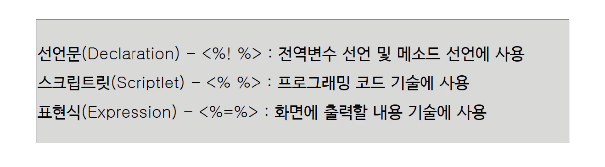

> 부스트코스 - 웹 프로그래밍(풀스택)강의를 학습, 정리한 내용입니다.(https://www.boostcourse.org/web316/joinLectures/12943)

# JSP - BackEnd

- [JSP - BackEnd](#jsp---backend)
- [1) JSP란?](#1-jsp란)
  - [JSP 실습](#jsp-실습)
    - [JSP 파일 생성(eclipse에서)](#jsp-파일-생성eclipse에서)
    - [JSP 지시자](#jsp-지시자)
    - [sum10.jsp 코드](#sum10jsp-코드)
  - [JSP 등장 배경](#jsp-등장-배경)
  - [이클립스 프로젝트 관련 추가 조사내용](#이클립스-프로젝트-관련-추가-조사내용)
    - [WebContent와 webapp 차이점](#webcontent와-webapp-차이점)
    - [Maven](#maven)
    - [Maven을 지원하는 웹 프로젝트를 원할 때:](#maven을-지원하는-웹-프로젝트를-원할-때)
- [2) JSP 라이프싸이클](#2-jsp-라이프싸이클)
  - [JSP 파일 위치](#jsp-파일-위치)
    - [sum10.jsp 파일 위치](#sum10jsp-파일-위치)
    - [sum10_jsp.class, sum10_jsp.java 파일 위치](#sum10_jspclass-sum10_jspjava-파일-위치)
  - [sum10_jsp.java 파일 열어보기](#sum10_jspjava-파일-열어보기)
    - [JSP의 작동 원리 정리](#jsp의-작동-원리-정리)
  - [JSP의 실행순서](#jsp의-실행순서)
    - [JSP 재정리](#jsp-재정리)
  - [lifecycle.jsp 코드](#lifecyclejsp-코드)
    - [`out.println()`, `System.out.println()`의 차이](#outprintln-systemoutprintln의-차이)
    - [jsp 파일 run on server 결과](#jsp-파일-run-on-server-결과)
    - [lifecycle_jsp.java 코드](#lifecycle_jspjava-코드)
    - [`<%! ... %>` 선언식](#---선언식)
  - [생각해보기](#생각해보기)
- [3) JSP 문법](#3-jsp-문법)
  - [스크립트 요소의 이해](#스크립트-요소의-이해)
  - [선언문](#선언문)
    - [exam1.jsp 코드](#exam1jsp-코드)
    - [결과](#결과)
    - [exam1_jsp.java 파일](#exam1_jspjava-파일)
    - [정리](#정리)
  - [스크립트릿](#스크립트릿)
    - [exam02.jsp 코드](#exam02jsp-코드)
    - ['html 소스보기' 결과](#html-소스보기-결과)
    - [exam2_jsp.java 결과](#exam2_jspjava-결과)
  - [표현식(Expression)](#표현식expression)
  - [주석(Comment)](#주석comment)
  - [주석 실습코드](#주석-실습코드)
    - [웹 페이지 html 소스보기](#웹-페이지-html-소스보기)
    - [exam2_jsp.java 결과](#exam2_jspjava-결과-1)
    - [JSP 작업 시 주석 사용 정리](#jsp-작업-시-주석-사용-정리)
  - [생각해보기](#생각해보기-1)
- [4) JSP 내장객체](#4-jsp-내장객체)
  - [JSP 내장 객체란?](#jsp-내장-객체란)
    - [exam1_jsp.java 내장 객체 코드](#exam1_jspjava-내장-객체-코드)
  - [내장 객체의 종류](#내장-객체의-종류)
  - [실습코드](#실습코드)
    - [ImplicitObjects.jsp 코드](#implicitobjectsjsp-코드)
    - [웹페이지 결과값](#웹페이지-결과값)
    - [ImplicitObjects_jsp.java 코드](#implicitobjects_jspjava-코드)
  - [생각해보기](#생각해보기-2)
- [참고자료](#참고자료)

<small><i><a href='http://ecotrust-canada.github.io/markdown-toc/'>Table of contents generated with markdown-toc</a></i></small>


# 1) JSP란?
* 이름 : JSP (Java Server Page)
* 설명 
  * HTML내에 자바 코드를 삽입하여 웹 서버에서 동적으로 웹 페이지를 생성하여 웹 브라우저에 돌려주는 서버 사이드 스크립트 언어.  
* 특징 
  * Java EE의 일부로 웹 애플리케이션 서버에서 동작한다.  
  * 모든 JSP는 서블릿으로 바뀌어서 동작한다. (JSP 파일을 Servlet 클래스로 변환하고 실행시켜 주는 역할을 하는 프로그램은 서블릿 컨테이너라고 부른다.)
* 서블릿과의 차이점 : 
  * 서블릿과 거의 유사하지만 서블릿과 달리 HTML표준에 따라 작성되므로 웹 디자인하기에 편리
* 지원하는 IDE : Ecilpse, netBeans, IntelliJ IDEA + VScode ..
* 경쟁자 :
  * ASP 
  * PHP 
  * ASP.<area>NET
  * Node.js 
  * Go 
  * Ruby on Rails 
  * Python의 Django와 Flask 웹 프레임워크
* 세계적으로는 ASP, PHP등의 경쟁자들에 비해 밀리는 추세
  1. 경직된 구조 
  2. API주도형 사이트 구축방식과 SPA와 안맞음
  3. 안정성원툴(대기업,금융권,관공서 등 큰 규모만)
  4. 무겁고 느림
  5. EJB는 잔 코드가 많고 로딩 시간 김
  6. 기타 경쟁자 출몰(Node.js, Go, Ruby on Rails, Python-Django, Flask)
* 그럼에도 우리나라는 자바왕국이기 때문에 JSP의 사용은 꽤 오랫동안 꾸준할 듯(알아두자)(주로 대규모 기업용 시스템 구축에 사용)
## JSP 실습
1부터 10까지의 합을 구하는 JSP파일을 만들어 보자
### JSP 파일 생성(eclipse에서)
new > jsp file > file name 지정 > JSP 템플릿 선택 > finish
* 파일 위치 : firstWeb(Dynamic Web Project로서 Servlet 실습했던 프로젝트)의 Content directory에 위치(WebContent 또는 webapp) - jsp 폴더 (폴더 생성 여부는 선택)
* 파일 이름 : sum10.jsp(1부터 10까지의 합을 구하는 jsp 실습예제)
* JSP 템플릿 : HTML5
  * > 참고 (https://www.educba.com/html5-vs-html4/) 

### JSP 지시자
JSP는 약속된 몇 가지 기호들을 가지고 있는데  
기호에 따라서 JSP가 서블릿으로 바뀔 때 바꾸는 방식 지정

* `<%@ page ~` 페이지 지시자  
    ```jsp
    <%@ page language="java" contentType="text/html; charset=UTF-8"	pageEncoding="UTF-8"%>
    ```
    language, contentType, charset, pageEncoding을 지정한다.  
    서블릿을 작성할 때 `setContentType("text/html;charset=UTF-8")`을 작성했었다. (동일한 역할을 하는 요소가 있다. JSP는 서블릿으로 바뀌어 동작한다는 것을 명심)  
* `<% ... %>` scriptlet(스크립트릿)   
    스크립트 영역.(자바코드입력)  
    실행시에 javax.servlet.http.HttpServlet 클래스를 상속받은 Java 소스 코드로 변환한 다음 컴파일되어 실행된다.
* `<%= ... %>` 표현식  
    스크립트릿에서 얻어낸 값을 브라우저한테 응답결과로 주고 싶을 때 사용  
    예제의 표현식은 서블릿의 `out.print(total);`과 같다

### sum10.jsp 코드
```jsp
<%@ page language="java" contentType="text/html; charset=UTF-8"
	pageEncoding="UTF-8"%>
<!DOCTYPE html PUBLIC "-//W3C//DTD HTML 4.01 Transitional//EN" "http://www.w3.org/TR/html4/loose.dtd">
<html>
<head>
<meta http-equiv="Content-Type" content="text/html; charset=UTF-8">
<title>Insert title here</title>
</head>
<body>

	<%
	int total = 0;
	for (int i = 1; i <= 10; i++) {
		total = +i;
	}
	%>

	1부터 10까지의 합:
	<%=total%>

</body>
</html>
```  
실제로 출력되는 값은 
```
// 1부터 10까지의 합 : 'total 값'
1부터 10까지의 합 : 55 
```

## JSP 등장 배경
* 마이크로소프트에서 ASP(Active Server Page)라는 쉽게 웹을 개발할 수 있는 스크립트(script) 엔진을 발표함 (1998년)
* 1997년에 발표된 서블릿은 ASP에 비하여 상대적으로 개발 방식이 불편함
* ASP에 대항하기 위하여 1999년 썬마이크로시스템즈에서 JSP를 발표
* JSP는 실제로 서블릿 기술을 사용

## 이클립스 프로젝트 관련 추가 조사내용
jsp와는 상관없지만 이클립스 프로젝트 생성시의 디렉토리 구조 관련 내용이다.

### WebContent와 webapp 차이점
프로젝트의 디렉토리 구조는 프로젝트가 어떻게 생성됐는지 그리고 빌드 툴을 어떤 것을 사용하였는지에 따라 다르다.
* WebContent 
  * 이클립스에서 Dynamic web project 생성시 Content directory : /WebContent 디렉토리
  * 표준 Eclipse 프로젝트 구조로 인식된다
* webapp
  * Maven을 이용해서 생성시 Content directory 구조 : /src/main/webapp.
  * 표준 Maven 프로젝트 구조로 인식된다 (Maven 프로젝트에서 제대로 작동하려면 Maven 플러그인을 설치하고 프로젝트를 Maven과 연결해야 한다.)

### Maven 
>http://maven.apache.org/  
>http://maven.apache.org/what-is-maven.html
* 자바용 프로젝트 관리 도구
* C#, Ruby, Scala등에서도 프로젝트 관리 도구로 사용 가능(거의 사용 x)
* 아파치 앤트의 대안.=, 아파치 라이선스로 배포되는 오픈 소스 소프트웨어
* 빌드 프로세스를 쉽게, 유니폼 빌드 시스템 제공, 프로젝트 정보 제공, 모범사례 개발을 위한 가이드라인 제공

* Maven은 지금까지 애플리케이션을 개발하기 위해 반복적으로 진행해왔던 작업들을 지원하기 위하여 등장한 도구
* Maven을 사용하면 빌드(Build), 패키징, 문서화, 테스트와 테스트 리포팅, git, 의존성관리, svn등과 같은 형상관리서버와 연동(SCMs), 배포 등의 작업을 손쉽게 할 수 있다.
* Maven을 사용한다는 것은 어쩌면 이러한 관습 즉 CoC에 대해서 알아나가는 것이라고도 할 수 있다.
  * CoC(Convention over Configuration)란 일종의 관습을 말하는데, 예를 들자면 프로그램의 소스파일은 어떤 위치에 있어야 하고, 소스가 컴파일된 파일들은 어떤 위치에 있어야 하고 등을 미리 정해놨다는 것

### Maven을 지원하는 웹 프로젝트를 원할 때: 
1.  WebContent을 유지하고 Maven을 지원하는 웹 프로젝트로 변경
    1. File > New > Dynamic Web Project > write Project name > Next > Next > check Generate web.xml deployment descriptor
    2. new project folder 우클릭 > Configure > Convert to Maven Project.
2. webapp에서 src/main 만들기
    * File > New > Maven Project > Next > select maven-archetype-webapp as Artifact Id > Next > Group Id and Artifact Id 추가 > Finish.


# 2) JSP 라이프싸이클

## JSP 파일 위치

### sum10.jsp 파일 위치
`C:\Users\Junha\java-workspace\.metadata\.plugins\org.eclipse.wst.server.core\tmp0\wtpwebapps\firstWeb\jsp`

### sum10_jsp.class, sum10_jsp.java 파일 위치
`java-workspace\.metadata\.plugins\org.eclipse.wst.server.core\tmp0\work\Catalina\localhost\ROOT\org\apache\jsp\jsp`

## sum10_jsp.java 파일 열어보기
* sum10.jsp 파일의 코드가 약간 특수한 형태의 서블릿 소스로 생성이 된 것을 확인 할 수 있다.
```java
/*
 * Generated by the Jasper component of Apache Tomcat

--- 주석 생략 ---

*/

--- 앞부분 중략 ---

  // init 메서드
  public void _jspInit() {
  }
  // destroy 메서드
  public void _jspDestroy() {
  }
  // service메서드
  // 우리가 만든 코드는 여기 들어있다.
  public void _jspService(final javax.servlet.http.HttpServletRequest request, final javax.servlet.http.HttpServletResponse response)
      throws java.io.IOException, javax.servlet.ServletException { 
  // 내장 객체(JSP를 서블릿으로 바꿀 때 알아서 만들어 놓는 객체들) 생략

--- 중략 ---

      // html코드
      out.write("\r\n");
      out.write("<!DOCTYPE html>\r\n");
      out.write("<html>\r\n");
      out.write("<head>\r\n");
      out.write("<meta charset=\"UTF-8\">\r\n");
      out.write("<title>Insert title here</title>\r\n");
      out.write("</head>\r\n");
      out.write("<body>\r\n");
      out.write("\t");
    
	int total = 0;
	for (int i = 1; i <= 10; i++) {
		total = total + i;
	} // JSP파일의 Scriptlet코드
	
      out.write("\r\n");
      out.write("\r\n");
      out.write("\t1부터 10까지의 합 :\r\n");
      out.write("\t");     
      out.print(total); // `<%=` 표현식코드
      out.write("\r\n");
      out.write("</body>\r\n");
      out.write("</html>");
     } catch (java.lang.Throwable t) {

--- 중략 ---

      }
    } finally {
      _jspxFactory.releasePageContext(_jspx_page_context);
    }
  }
```

### JSP의 작동 원리 정리
* `.metadata`폴더 안에 java파일이 생성이 됬다.
* 파일 안에 _jspService 메서드가 작성되어 있다.
* 이 메서드 안에 JSP 코드에서 작성했던 코드들(표현식, Scriptlet)이 그대로 변환되서 들어가 있다.

즉 실제로 자바가 서블릿 소스로 컴파일이 돼서 실행이 되면서 그 결과가 브라우저에 보여지고 있었던 것

## JSP의 실행순서
1. 브라우저가 웹서버에 JSP에 대한 요청 정보를 전달한다.
2. 브라우저가 요청한 JSP가 최초로 요청했을 경우만 JSP로 작성된 코드가 서블릿으로 코드로 변환한다. (java 파일 생성)
3. 서블릿 코드를 컴파일해서 실행가능한 bytecode로 변환한다. (class 파일 생성)
4. 서블릿 클래스를 로딩하고 인스턴스를 생성한다.(JSP 엔진이)
5. 서블릿이 실행되어 요청을 처리하고 응답 정보를 생성한다.

### JSP 재정리
* JSP로 요청이 들어왔을 때 서버는 JSP에 해당하는 서블릿이 존재하는지 체크한다. (요청이 처음인지 아닌지 알아내기 위해서) 
  * 존재한다면 서블릿 엔진이 서블릿 라이프 사이클대로 실행을 하게 될 것
  * 존재하지 않는다면 JSP 엔진이 그것을 받아서 알맞는 서블릿으로 만들고 컴파일하고 이 서블릿 객체를 생성하는 일들을 수행하게 된다.

## lifecycle.jsp 코드
```jsp
<%@ page language="java" contentType="text/html; charset=UTF-8"
    pageEncoding="UTF-8"%>
<!DOCTYPE html PUBLIC "-//W3C//DTD HTML 4.01 Transitional//EN" "http://www.w3.org/TR/html4/loose.dtd">
<html>
<head>
<meta http-equiv="Content-Type" content="text/html; charset=UTF-8">
<title>Insert title here</title>
</head>
<body>
hello
<%
	System.out.println("_jspService()");
%>

<%!
public void jspInit() {
	System.out.println("jspInit()!");
}

public void jspDestroy() {
	System.out.println("jspDestroy()");
}
%>

</body>
</html>
``` 

### `out.println()`, `System.out.println()`의 차이
1. `System.out.println()` : 콘솔에 출력된다 (System.out - 콘솔을 의미)
2. `out.println()` : 웹 화면에 출력된다 (response한테 받아온 out - 응답 결과의 out)
### jsp 파일 run on server 결과
web 화면에 hello~가 뜨고 console에 새로고침을 누를 때마다 "jspService()"문구가 추가된다.
### lifecycle_jsp.java 코드
```java
---생략---
  out.write("<body>\r\n");
      out.write("hello~\r\n");

	System.out.println("jspService()");

      out.write("\r\n");
      out.write("</body>\r\n");
      ---생략---
```
* jsp에서 작성한 코드들은 _jspService()메서드 안에 들어간다

### `<%! ... %>` 선언식
선언식에 작성한 코드는 서블릿 파일에서 _jspService()메서드 바깥쪽에 코드가 만들어 진다.
* init, destroy 메서드 작성
```jsp
<%!
public void jspInit() {
	System.out.println("jspInit()!");
}

public void jspDestroy() {
	System.out.println("jspDestroy()");
}
%>
```

## 생각해보기
서블릿과 jsp의 lifecycle method 이름 비교 
 * 서블릿 라이프 싸이클 - init(), service(), destroy()
 * JSP 라이프 싸이클 - _jspInit(), _jspService(), _jspDestroy()


# 3) JSP 문법
JSP는 HTML태그와 자바코드를 섞어서 개발할 수 있다.  
JSP에서 자바코드는 어떻게 입력을 하는지, 어떤 결과를 출력하려면 어떤 것을 사용해야 하는지 알아보자

## 스크립트 요소의 이해
JSP 페이지에서는 선언문(Declaration), 스크립트릿(Scriptlet), 표현식(Expression) 이라는 3가지의 스크립트 요소를 제공


## 선언문
* 선언문 : <%! %>
* 선언문은 JSP 페이지 내에서 필요한 멤버변수나 메소드가 필요할 때 선언해 사용하는 요소
* 선언문은 파일내의 위치가 크게 중요하지 않다.
  
### exam1.jsp 코드
선언문 테스트용  
```jsp
<%@ page language="java" contentType="text/html; charset=UTF-8"
    pageEncoding="UTF-8"%>
<!DOCTYPE html PUBLIC "-//W3C//DTD HTML 4.01 Transitional//EN" "http://www.w3.org/TR/html4/loose.dtd">
<html>
<head>
<meta http-equiv="Content-Type" content="text/html; charset=UTF-8">
<title>Insert title here</title>
</head>
<body>

id : <%=getId() %>
</body>
</html>

<%!
    String id = "u001"; //멤버변수 선언
    public String getId( ) { //메소드 선언
        return id;
    }
%>
```

### 결과
```
id : u001 
```

### exam1_jsp.java 파일
```java
---중략
    String id = "u001"; //멤버변수 선언
    public String getId( ) { //메소드 선언
        return id;
    }
---중략
  out.write("id : ");
      out.print(getId() );
      out.write("\r\n");
---중략
```

### 정리
JSP에서 멤버 변수나 메서드를 선언할 때 사용하는 것이 선언문 `<%! %>`이다.

## 스크립트릿
* 스크립트릿 : `<% %>`
* 가장 일반적으로 많이 쓰이는 스크립트 요소
* 주로 프로그래밍의 로직을 기술할 때 사용
* 스크립트릿에서 선언된 변수는 지역변수(Service()메서드 안에 선언되는 변수)

### exam02.jsp 코드
```jsp
<%@ page language="java" contentType="text/html; charset=UTF-8"
	pageEncoding="UTF-8"%>
<!DOCTYPE html>
<html>
<head>
<meta charset="UTF-8">
<title>Insert title here</title>
</head>
<body>
	<%
	for (int i = 1; i <= 5; i++) {
	%>
	<H<%=i%>>아름다운 한글</H<%=i%>>
	<%
	}
	%>
</body>
</html>
```

### 'html 소스보기' 결과
```html
<!DOCTYPE html>
<html>
<head>
<meta charset="UTF-8">
<title>Insert title here</title>
</head>
<body>
	
	<H1>아름다운 한글</H1>
	
	<H2>아름다운 한글</H2>
	
	<H3>아름다운 한글</H3>
	
	<H4>아름다운 한글</H4>
	
	<H5>아름다운 한글</H5>
	
</body>
</html>
```

### exam2_jsp.java 결과
서블릿으로 변환된 주요 코드 부분
```java
---중략
	for (int i = 1; i <= 5; i++) {
	
      out.write("\r\n");
      out.write("\t<H");
      out.print(i);
      out.write(">아름다운 한글</H");
      out.print(i);
      out.write(">\r\n");
      out.write("\t");

	}
---중략
```

## 표현식(Expression)
* 표현식 : `<%=%>`
* JSP 페이지에서 웹 브라우저에 출력할 부분을 표현 (즉, 응답에 포함하고 싶은 것)
* 스크립트릿내에서 출력할 부분은 내장객체인 `out` 객체의 `print()` 또는 `println()` 메소드를 사용해서 출력

## 주석(Comment)
JSP페이지에서 사용할 수 있는 주석  
HTML주석, 자바주석, JSP주석
 
1. HTML 주석 `<!--로 시작해서 -->`
   * HTML 주석은 HTML주석을 사용한 페이지를 웹에서 서비스할 때 화면에 주석이 내용이 표시되지는 않으나 , 웹페이지 상에서 우클릭 - **[페이지 소스보기]**를 클릭하면 HTML주석의 내용 확인 가능
2. JSP주석  `<%--로 시작해서 --%>`
   * **JSP 페이지에서만 사용된다.**
   * JSP 주석은 해당 페이지를, 웹 브라우저를 통해 출력 결과로서 표시하거나, 웹 브라우저 상에서 소스 보기를 해도 표시 되지 않음.
   * 또한 JSP주석 내에 실행코드를 넣어도 그 코드는 실행되지 않음.
3. 자바주석  `//`(한 줄), `/**/`(여러 줄)
   * 스크립트릿이나 선언문에서 사용되는 주석으로, 자바와 주석 처리 방법이 같음, 즉 서블릿으로 실행할 때 실행되지 않음.

## 주석 실습코드
```jsp
<%@ page language="java" contentType="text/html; charset=UTF-8"
	pageEncoding="UTF-8"%>
<!DOCTYPE html>
<html>
<head>
<meta charset="UTF-8">
<title>Insert title here</title>
</head>
<body>
	<%
	int total = 0;
	for (int i = 1; i <= 10; i++) {
		total = total + i;
	}
	%>

	1부터 10까지의 합 :
	<%=total%>
</body>
</html>
```

### 웹 페이지 html 소스보기
```html
<!DOCTYPE html>
<html>
<head>
<meta charset="UTF-8">
<title>Insert title here</title>
</head>
<body>

<!--  html 주석 -->
	
	<H1>아름다운 한글</H1>
	
	<H2>아름다운 한글</H2>
	
	<H3>아름다운 한글</H3>
	
	<H4>아름다운 한글</H4>
	
	<H5>아름다운 한글</H5>
	
</body>
</html>
```
html 소스보기에서 html 주석은 나타나지만 자바주석과 jsp주석은 보이지 나타나지 않는다.

### exam2_jsp.java 결과
```java
out.write("<!--  html 주석 -->\r\n");
      out.write("\t");


	//자바 주석 한 줄
	/*
	자바 주석 여러 줄
	*/
```
서블릿으로 변환된 파일에서 html 주석과 자바 주석은 나타나지만 JSP 주석은 나타나지 않는다.

### JSP 작업 시 주석 사용 정리
JSP파일에서 주석을 사용할 때
* html 주석은 JSP파일과 html소스와 서블릿파일에서 확인가능하고
* 자바 주석은 JSP파일과 서블릿파일에서 확인가능하고
* JSP 주석은 JSP파일에서만 확인가능하다.

## 생각해보기
JSP들이 서블릿 소스로 변환될 때 스크립틀릿, 표현식, 선언문이 어떻게 변환될지 예상해보자.

스크립틀릿은 자바문으로 변환되고 
표현식은 출력 값으로 변환되고
선언문은 자바문으로 변환된다.


# 4) JSP 내장객체
JSP에서는 개발자가 선언하지 않아도, 사용할 수 있는 미리 선언된 변수가 존재  
바로 ***내장객체***  
개발자가 선언하지 않았음에도 어떻게 JSP에서 내장객체를 사용할 수 있는지,  
그리고 이 내장 객체를 어떻게 사용해야 하는지 알아보자  

## JSP 내장 객체란?
* JSP를 실행하면 서블릿 소스가 생성되고 실행된다.
* JSP에 입력한 대부분의 코드는 생성되는 서블릿 소스의 `_jspService()` 메소드 안에 삽입되는 코드로 생성된다.
* `_jspService()`에 삽입된 코드의 윗부분에 미리 선언된 객체들이 있는데, 해당 객체들은 jsp에서도 사용 가능하다.
* `response`, `request`, `application`, `session`, `out`과 같은 변수를 내장객체라고 한다.

### exam1_jsp.java 내장 객체 코드
앞에서 작성한 exam1.jsp의 서블릿 코드의 내장객체 확인.  
`request, response, pageContext, session, application, config, out, page, _jspx_out, _jspx_page_context`
```java
// 내장객체 선언
public void _jspService(final javax.servlet.http.HttpServletRequest request, final javax.servlet.http.HttpServletResponse response)
      throws java.io.IOException, javax.servlet.ServletException {

    final java.lang.String _jspx_method = request.getMethod();
    if (!"GET".equals(_jspx_method) && !"POST".equals(_jspx_method) && !"HEAD".equals(_jspx_method) && !javax.servlet.DispatcherType.ERROR.equals(request.getDispatcherType())) {
      response.sendError(HttpServletResponse.SC_METHOD_NOT_ALLOWED, "JSP들은 오직 GET, POST 또는 HEAD 메소드만을 허용합니다. Jasper는 OPTIONS 메소드 또한 허용합니다.");
      return;
    }

    final javax.servlet.jsp.PageContext pageContext;
    javax.servlet.http.HttpSession session = null;
    final javax.servlet.ServletContext application;
    final javax.servlet.ServletConfig config;
    javax.servlet.jsp.JspWriter out = null;
    final java.lang.Object page = this;
    javax.servlet.jsp.JspWriter _jspx_out = null;
    javax.servlet.jsp.PageContext _jspx_page_context = null;

// 내장객체 사용
    try {
      response.setContentType("text/html; charset=UTF-8");
      pageContext = _jspxFactory.getPageContext(this, request, response,
      			null, true, 8192, true);
      _jspx_page_context = pageContext;
      application = pageContext.getServletContext();
      config = pageContext.getServletConfig();
      session = pageContext.getSession();
      out = pageContext.getOut();
      _jspx_out = out;
```

## 내장 객체의 종류


## 실습코드
내장객체를 사용하는 간단한 예제를 작성  
ImplicitObjects.jsp 를 작성  
내장객체가 이미 선언되어 있기 때문에  
jsp파일에서 사용할 수 있다.

### ImplicitObjects.jsp 코드
```jsp
<%@ page language="java" contentType="text/html; charset=UTF-8"
    pageEncoding="UTF-8"%>
<!DOCTYPE html PUBLIC "-//W3C//DTD HTML 4.01 Transitional//EN" "http://www.w3.org/TR/html4/loose.dtd">
<html>
<head>
<meta http-equiv="Content-Type" content="text/html; charset=UTF-8">
<title>Insert title here</title>
</head>
<body>
<%
    StringBuffer url = request.getRequestURL();

    out.println("url : " + url.toString());
    out.println("<br>");
%>
</body>
</html>
```

### 웹페이지 결과값
```
url :http://localhost:8080/jsp/ImplicitObject.jsp 
```

### ImplicitObjects_jsp.java 코드
```java
  public void _jspService(final javax.servlet.http.HttpServletRequest request, final javax.servlet.http.HttpServletResponse response)
      throws java.io.IOException, javax.servlet.ServletException {

    ......

    javax.servlet.jsp.JspWriter _jspx_out = null;

    ......

    out = pageContext.getOut();
    ......


        StringBuffer url = request.getRequestURL();

        out.println("url : " + url.toString());
        out.println("<br>");
```
     
## 생각해보기
내장객체를 JSP 선언문에서 사용할 수 있을까?  
사용할 수 없다면 왜 그럴까?

* 사용할 수 없다. 내장 객체는 _jspService() 메서드 안에서 선언된 지역객체이고 JSP 선언문
안의 코드는 _jspService()밖에서 사용된다.
* JSP 선언문
에서 선언한 변수나 메소드는 public final class 파일명_jsp로 _jspService()밖에서 선언된다
* 선언문은 JSP 페이지 내에서 _jspService()밖에서 멤버변수나 메소드가 필요할 때 선언해서 사용하는 용도이다.
* 선언문에서 내장객체와 같은 이름의 변수를 선언할 수는 있으나 사용하지 않는 것이 당연히 좋다.


# 참고자료
* [JCP information - Program overview](https://jcp.org/en/procedures/overview)
* [Difference webcontent and webapp](https://stackoverflow.com/questions/18412866/difference-webcontent-and-webapp)
* [Maven이란? 그리고 Dynamic Web Project?](https://kimmy100b.github.io/maven/2020/09/16/maven/)
* [Java Server Pages (JSP) Life Cycle](https://beginnersbook.com)
* [Lifecycle of JSP](https://www.studytonight.com)
* [JSP Declaration Scripting Element](http://www.w3processing.com)
* [JSP Scriptlet Scripting Element](http://www.w3processing.com)
* [JSP Expression Scripting Element](http://www.w3processing.com)
* [JSP Implicit Objects - javatpoint](https://www.javatpoint.com)