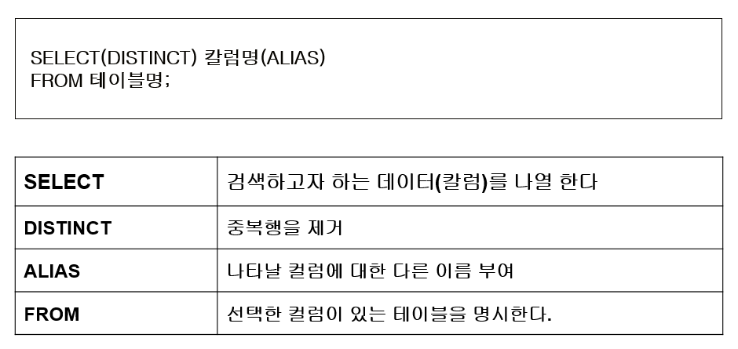
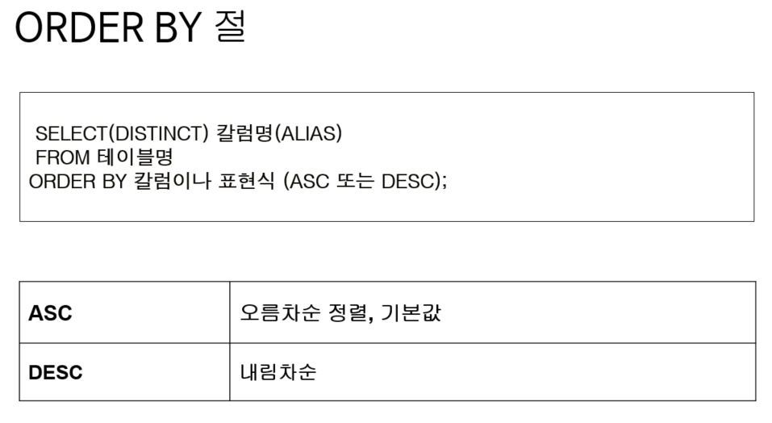
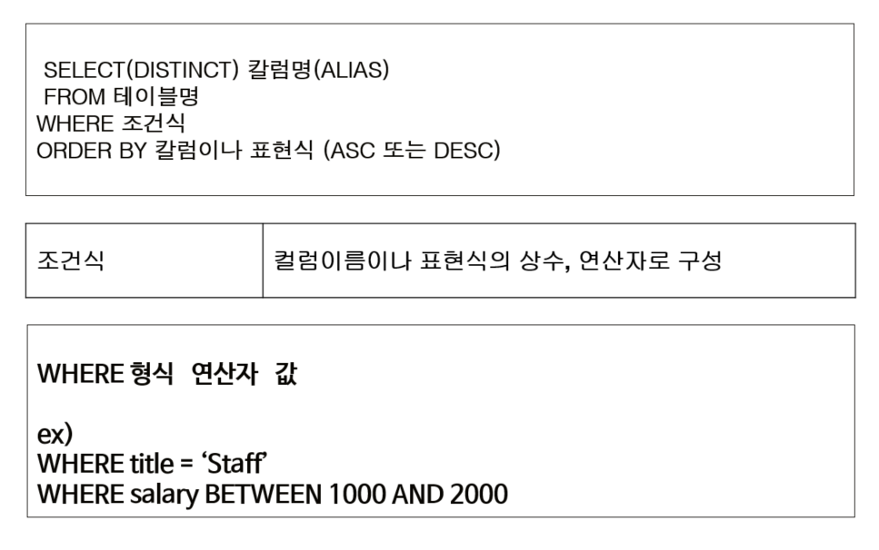
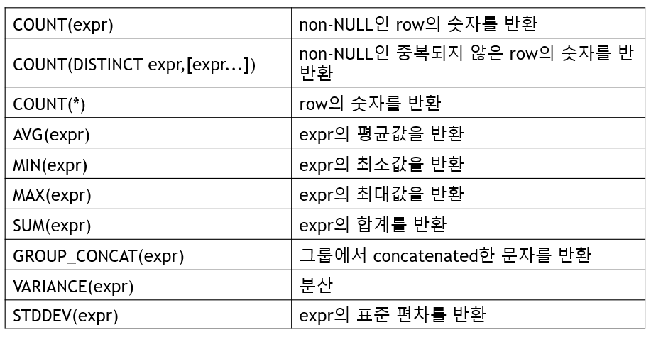
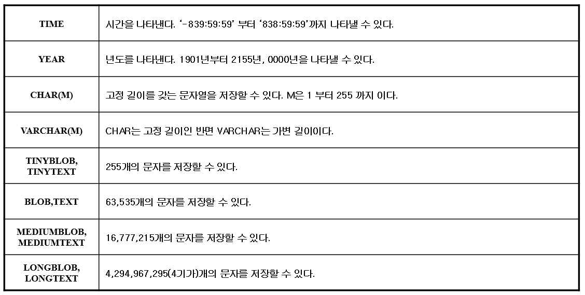

> 부스트코스 - 웹 프로그래밍(풀스택)강의를 학습, 정리한 내용입니다.(https://www.boostcourse.org/web316/joinLectures/12943)

# SQL - BackEnd

- [SQL - BackEnd](#sql---backend)
- [1. SQL이란? - 1](#1-sql이란---1)
  - [핵심 개념](#핵심-개념)
  - [SQL(Structured Query Language)](#sqlstructured-query-language)
    - [SQL의 구분](#sql의-구분)
  - [Database 생성하기](#database-생성하기)
  - [Database 사용자 생성과 권한 주기](#database-사용자-생성과-권한-주기)
    - [문법](#문법)
    - [실습 코드](#실습-코드)
  - [생성한 Database에 접속하기](#생성한-database에-접속하기)
    - [실습 코드](#실습-코드-1)
  - [MySQL 연결끊기](#mysql-연결끊기)
    - [실습 코드](#실습-코드-2)
  - [MySQL 버전과 현재 날짜 구하기](#mysql-버전과-현재-날짜-구하기)
  - [SQL 특징](#sql-특징)
    - [키워드는 대소문자를 구별하지 않는다.](#키워드는-대소문자를-구별하지-않는다)
    - [쿼리를 이용해서 계산식의 결과도 구할 수 있다.](#쿼리를-이용해서-계산식의-결과도-구할-수-있다)
    - [여러 문장을 한 줄에 연속으로 붙여서 실행 가능하다](#여러-문장을-한-줄에-연속으로-붙여서-실행-가능하다)
    - [하나의 SQL은 여러 줄로 입력 가능하다](#하나의-sql은-여러-줄로-입력-가능하다)
    - [SQL을 입력하는 도중에 취소 가능하다](#sql을-입력하는-도중에-취소-가능하다)
  - [DBMS에 존재하는 데이터베이스 확인하기](#dbms에-존재하는-데이터베이스-확인하기)
  - [사용중인 데이터베이스 전환하기](#사용중인-데이터베이스-전환하기)
    - [실습 코드](#실습-코드-3)
  - [참고](#참고)
  - [참고 자료](#참고-자료)
- [1) SQL이란?-2](#1-sql이란-2)
  - [핵심 개념](#핵심-개념-1)
  - [테이블(Table)](#테이블table)
  - [테이블(table)의 구성요소](#테이블table의-구성요소)
  - [테이블 목록 확인](#테이블-목록-확인)
  - [SQL 연습을 위한 테이블 생성과 값의 저장](#sql-연습을-위한-테이블-생성과-값의-저장)
  - [테이블 구조를 확인하기 위한 DESCRIBE 명령](#테이블-구조를-확인하기-위한-describe-명령)
  - [생각해보기](#생각해보기)
    - [생각해보기 실습](#생각해보기-실습)
  - [참고 자료](#참고-자료-1)
- [3. DML](#3-dml)
  - [핵심 개념](#핵심-개념-2)
  - [데이터 조작어(Data Manipulation Language, DML)의 종류](#데이터-조작어data-manipulation-language-dml의-종류)
  - [SELECT 구문의 기본문형](#select-구문의-기본문형)
  - [SELECT 구문 예제(전체 데이터 검색)](#select-구문-예제전체-데이터-검색)
    - [실습 코드](#실습-코드-4)
  - [SELECT 구문 예제(특정 컬럼 검색)](#select-구문-예제특정-컬럼-검색)
    - [실습 코드](#실습-코드-5)
  - [SELECT 구문 예제(컬럼에 Alias부여하기)](#select-구문-예제컬럼에-alias부여하기)
    - [실습 코드](#실습-코드-6)
  - [SELECT 구문 예제(컬럼의 합성(Concatenation))](#select-구문-예제컬럼의-합성concatenation)
    - [실습 코드](#실습-코드-7)
  - [SELECT 구문 예제(중복행의 제거)](#select-구문-예제중복행의-제거)
    - [실습코드](#실습코드)
    - [실습코드](#실습코드-1)
  - [SELECT 구문 예제(정렬하기 - 오름차순)](#select-구문-예제정렬하기---오름차순)
    - [실습코드](#실습코드-2)
  - [SELECT 구문 예제(정렬하기 - 내림차순)](#select-구문-예제정렬하기---내림차순)
    - [실습코드](#실습코드-3)
  - [SELECT 구문 예제(특정 행 검색- where절)](#select-구문-예제특정-행-검색--where절)
    - [산술비교 연산자](#산술비교-연산자)
    - [논리연산자](#논리연산자)
    - [IN 키워드](#in-키워드)
    - [LIKE 키워드](#like-키워드)
  - [SELECT 구문 예제(함수의 사용)](#select-구문-예제함수의-사용)
    - [UCASE, UPPER](#ucase-upper)
    - [특정 테이블의 데이터가 필요하지 않은 연산의 경우(오라클 DB vs MySQL)](#특정-테이블의-데이터가-필요하지-않은-연산의-경우오라클-db-vs-mysql)
    - [LCASE, LOWER](#lcase-lower)
    - [substring](#substring)
    - [LPAD, RPAD](#lpad-rpad)
    - [TRIM, LTRIM, RTRIM](#trim-ltrim-rtrim)
    - [ABS(x)](#absx)
    - [MOD(n,m) %](#modnm-)
  - [SELECT 구문(기타 함수)](#select-구문기타-함수)
  - [SELECT 구문 (CAST 형변환)](#select-구문-cast-형변환)
  - [SELECT 구문(그룹함수)](#select-구문그룹함수)
  - [SELECT 구문 예제(그룹함수)](#select-구문-예제그룹함수)
  - [SELECT 구문 예제(그룹함수와 groupby 절)](#select-구문-예제그룹함수와-groupby-절)
    - [groupby 오류 오라클db vs MySQL](#groupby-오류-오라클db-vs-mysql)
  - [데이터 입력 (INSERT문)](#데이터-입력-insert문)
  - [데이터 입력 실습 (INSERT문)](#데이터-입력-실습-insert문)
  - [데이터 수정(UPDATE문)](#데이터-수정update문)
  - [데이터 수정 실습(UPDATE문)](#데이터-수정-실습update문)
  - [데이터 삭제(DELETE문)](#데이터-삭제delete문)
  - [데이터 삭제 실습(DELETE문)](#데이터-삭제-실습delete문)
  - [생각해보기](#생각해보기-1)
    - [실습](#실습)
  - [참고 자료](#참고-자료-2)
- [4. DDL](#4-ddl)
  - [핵심 개념](#핵심-개념-3)
  - [MySQL 데이터 타입](#mysql-데이터-타입)
  - [테이블 생성](#테이블-생성)
  - [테이블 생성 실습](#테이블-생성-실습)
  - [테이블 수정 (컬럼 추가 / 삭제)](#테이블-수정-컬럼-추가--삭제)
  - [테이블 수정 실습 (컬럼 추가)](#테이블-수정-실습-컬럼-추가)
  - [테이블 수정 실습 (컬럼 삭제)](#테이블-수정-실습-컬럼-삭제)
  - [테이블 수정 (컬럼 수정)](#테이블-수정-컬럼-수정)
  - [테이블 수정 실습 (컬럼 수정)](#테이블-수정-실습-컬럼-수정)
  - [테이블 이름 변경](#테이블-이름-변경)
  - [테이블 이름 변경 실습](#테이블-이름-변경-실습)
  - [테이블 삭제하기](#테이블-삭제하기)
    - [제약조건 - 외래키 관계](#제약조건---외래키-관계)
  - [테이블 삭제 실습](#테이블-삭제-실습)
  - [생각해보기](#생각해보기-2)
    - [질문 1](#질문-1)
    - [질문 1 실습](#질문-1-실습)
    - [질문 2](#질문-2)
    - [char vs varchar](#char-vs-varchar)
    - [질문 2 정리](#질문-2-정리)
    - [질문 3](#질문-3)
    - [질문 3 정리](#질문-3-정리)
  - [질문 1, 2 ,3 정리](#질문-1-2-3-정리)
  - [참고 자료](#참고-자료-3)

<small><i><a href='http://ecotrust-canada.github.io/markdown-toc/'>Table of contents generated with markdown-toc</a></i></small>


# 1. SQL이란? - 1
DBMS에게 명령을 내리는 언어인 SQL
* SQL
* 데이터베이스, 데이터베이스 사용자 생성 
## 핵심 개념
* create database
* grant
* flush privileges
* select
## SQL(Structured Query Language)
* SQL은 데이터를 보다 쉽게 검색하고 추가, 삭제, 수정 같은 조작을 할 수 있도록 고안된 컴퓨터 언어
* 관계형 데이터베이스에서 데이터를 조작하고 쿼리하는 표준 수단
### SQL의 구분
1. DML (조작어, Data Manipulation Language): 데이터를 조작하기 위해 사용
  * INSERT, UPDATE, DELETE, SELECT 등이 여기에 해당
2. DDL (정의어, Data Definition Language): 데이터베이스의 스키마를 정의하거나 조작하기 위해 사용
  * CREATE, DROP, ALTER 등이 여기에 해당
3. DCL (제어어, Data Control Language) : 데이터를 제어하는 언어
  * 권한을 관리하고, 데이터의 보안, 무결성 등을 정의(그랜트, 리보크, 트랜잭선 부여, 커밋, 롤백)
  * GRANT, REVOKE 등이 여기에 해당
## Database 생성하기
MySQL 관리자 계정(root)로 접속
* `mysql –uroot  -p`
  * window - 설치 시에 입력했던 암호를 입력
  * 맥 - 암호가 없으니 그냥 엔터를 입력

Database "connectdb" 생성
* `mysql> create database connectdb;`
## Database 사용자 생성과 권한 주기
* Database를 생성했다면, 해당 데이터베이스를 사용하는 계정을 생성해야 한다.
* 또한, 해당 계정이 데이터베이스를 이용할 수 있는 권한을 줘야 한다.
### 문법
* db이름 뒤의 `* `는 모든 권한을 의미한다.
* `@’%’`는 어떤 클라이언트에서든 접근 가능하다는 의미이고, `@’localhost’`는 해당 컴퓨터에서만 접근 가능하다는 의미
* `flush privileges`는 DBMS에게 적용을 하라는 의미
  * 해당 명령을 반드시 실행해줘야 한다.
```
grant all privileges on db이름.* to 계정이름@'%' identified by ＇암호’;
grant all privileges on db이름.* to 계정이름@'localhost' identified by ＇암호’;
flush privileges;
```
* 사용자 계정이름은 'connectuser', 암호는 'connect123!@#', 해당 사용자가 사용하는 데이터베이스는 'connectdb'로 계정을 생성하려면 다음과 같이 명령을 수행
```sql
grant all privileges on connectdb.* to connectuser@'%' identified by 'connect123!@#';

grant all privileges on connectdb.* to connectuser@'localhost' identified by 'connect123!@#';

flush privileges;
```
### 실습 코드
```
mysql> show databases;
+--------------------+
| Database           |
+--------------------+
| information_schema |
| mysql              |
| performance_schema |
| sys                |
+--------------------+
4 rows in set (0.02 sec)

mysql> create database connectdb;
Query OK, 1 row affected (0.01 sec)

mysql> create user connectuser@localhost identified by 'connect123!@#';
Query OK, 0 rows affected (0.02 sec)

mysql> grant all privileges on connectdb.* TO 'connectuser'@'localhost';
Query OK, 0 rows affected (0.01 sec)

mysql> flush privileges;
Query OK, 0 rows affected (0.01 sec)

mysql> show databases;
+--------------------+
| Database           |
+--------------------+
| connectdb          |
| information_schema |
| mysql              |
| performance_schema |
| sys                |
+--------------------+
5 rows in set (0.00 sec)
```
## 생성한 Database에 접속하기
원하는 데이터베이스에 접속
* `mysql –h호스트명 –uDB계정명 –p` 
* `mysql –h127.0.0.1 –uconnectuser –p connectdb [enter]`
### 실습 코드
```
C:\Users\Junha\github-workspace>mysql -h127.0.0.1 -uconnectuser -p connectdb
Enter password: *************
Welcome to the MySQL monitor.  Commands end with ; or \g.
Your MySQL connection id is 17
Server version: 8.0.25 MySQL Community Server - GPL

Copyright (c) 2000, 2021, Oracle and/or its affiliates.

Oracle is a registered trademark of Oracle Corporation and/or its
affiliates. Other names may be trademarks of their respective
owners.

Type 'help;' or '\h' for help. Type '\c' to clear the current input statement.
```
## MySQL 연결끊기
* 프롬프트에서 quit혹은 exit라고 입력
```
mysql> QUIT
mysql> exit
```
* Bye라고 나오면 연결 끊기 성공
### 실습 코드
```
mysql> quit;
Bye
```
## MySQL 버전과 현재 날짜 구하기
```
mysql> select version(), current_date;
+-----------+--------------+
| version() | current_date |
+-----------+--------------+
| 8.0.25    | 2021-07-16   |
+-----------+--------------+
1 row in set (0.00 sec)
```
* 프롬프트에서는 SQL을 입력
* SQL은 semicolon (;)으로 끝난다.
* SQL은 쿼리(Query)라고 읽는다.
* 쿼리는 DBMS에게 명령을 내릴 때 사용하는 문장이라고 생각하면 쉽다.
* SELECT는 어떤 내용을 조회할 때 사용하는 키워드
* `1 row in set (0.00 sec)`
  * MySQL은 쿼리에 해당하는 결과의 전체 row를 출력하고 마지막에 전체 row 수와 쿼리실행에 걸린 시간을 표시
## SQL 특징
### 키워드는 대소문자를 구별하지 않는다.
다음 쿼리들은 모두 같다.
```
mysql> SELECT VERSION(), CURRENT_DATE;
mysql> select version(), current_date;
mysql> SeLeCt vErSiOn(), current_DATE;
```
### 쿼리를 이용해서 계산식의 결과도 구할 수 있다.
*함수 및 수식 사용 예제*
```
mysql> select sin(pi()/4), (4+1)*5;
+--------------------+---------+
| sin(pi()/4)        | (4+1)*5 |
+--------------------+---------+
| 0.7071067811865476 |      25 |
+--------------------+---------+
1 row in set (0.00 sec)
``` 
### 여러 문장을 한 줄에 연속으로 붙여서 실행 가능하다
각 문장에 semicolon(;)만 붙혀 주면 된다.
```
mysql> select version(); select current_date;
+-----------+
| version() |
+-----------+
| 8.0.25    |
+-----------+
1 row in set (0.00 sec)

+--------------+
| current_date |
+--------------+
| 2021-07-16   |
+--------------+
1 row in set (0.00 sec)
```
### 하나의 SQL은 여러 줄로 입력 가능하다
MySQL은 문장의 끝을 라인으로 구분하는 것이 아니라 semicolon(;)으로 구분하기 때문에 여러 줄에 거쳐 문장을 쓰는 것도 가능
```
mysql> select       
    -> user()
    -> ,
    -> current_date;
+-----------------------+--------------+
| user()                | current_date |
+-----------------------+--------------+
| connectuser@localhost | 2021-07-16   |
+-----------------------+--------------+
1 row in set (0.00 sec)
```
### SQL을 입력하는 도중에 취소 가능하다
긴 쿼리를 작성하다가 중간에 취소해야 하는 경우에는 즉시 `\c`를 붙혀주면 된다.
```
mysql> SELECT

    -> USER()

    -> \c

mysql>
```
## DBMS에 존재하는 데이터베이스 확인하기
작업하기 위한 데이터베이스를 선택하기 위해서는 어떤 데이터베이스가 존재하는지 알아보아야 한다.

현재 서버에 존재하는 데이터베이스를 찾아보기 위해서 `SHOW` statement을 사용
```
mysql> show databases;
+--------------------+
| Database           |
+--------------------+
| connectdb          |
| information_schema |
+--------------------+
2 rows in set (0.00 sec)
```
## 사용중인 데이터베이스 전환하기
Database을 선택하기 위해,  “use” command 사용
* `mysql> use mydb;`

데이터베이스를 전환하려면, 이미 데이터베이스가 존재해야 하며 현재 접속 중인 계정이 해당 데이터베이스를 사용할 수 있는 권한이 있어야 한다.
### 실습 코드
```
C:\Users\Junha\github-workspace>mysql -uroot -p
Enter password: ******
Welcome to the MySQL monitor.  Commands end with ; or \g.
Your MySQL connection id is 21
Server version: 8.0.25 MySQL Community Server - GPL

Copyright (c) 2000, 2021, Oracle and/or its affiliates.

Oracle is a registered trademark of Oracle Corporation and/or its
affiliates. Other names may be trademarks of their respective
owners.

Type 'help;' or '\h' for help. Type '\c' to clear the current input statement.

mysql> use connectdb;
Database changed
```
## 참고
mysql 버전 8에서는 사용자 생성 및 권한 주는 부분이 아래와 같이 변경

설치한 mysql 버전을 확인 하고, 알맞게 사용. 

참고로 설치시에 "Use Lagacy Password Encryption" 방식으로 설치했을 때 해당

이렇게 설정을 해야지만 MySQL 5.x버전에서 사용하던 인증방식과 호환

만약, SHA 256기반의 암호화를 사용해야 한다면 'Use Strong Password Encryption for Authentication'을 선택

하지만, 이렇게 되면 새 버전(8.x)에서 제공하는 프로그램들만 서버에 접근이 가능하기 때문에 이전에 하던 모든 프로그램을 업그레이드 해야 한다.

JDBC Driver도 8.x에 맞는 버전을 사용해야 한다.  

`mysql -u root -p `

위와 같이 root 계정으로 접속

암호는 설치시 입력한 암호를 사용
```
CREATE DATABASE connectdb;

CREATE USER connectuser@localhost IDENTIFIED BY 'connect123!@#';

GRANT ALL PRIVILEGES ON connectdb.* TO 'connectuser'@'localhost';

FLUSH PRIVILEGES:
```
## 참고 자료
> 데이터베이스의 언어··· SQL이란 무엇인가
https://www.ciokorea.com

> [참고링크] MySQL 8.0 Reference Manual
https://dev.mysql.com/doc/refman/8.0/en/


# 1) SQL이란?-2
값을 저장할 수 있는 테이블을 알아보고  
앞으로 실습에 사용할 데이터를 examples.sql 파일을 이용해 테이블에 넣어 보자.
## 핵심 개념
* create database
* grant
* flush privileges
* select
## 테이블(Table)
마이크로소프트의 엑셀(Excel)을 실행하면 표가 나온다.  
이러한 표에 각종 값을 저장할 수 있다.  
데이터베이스도 엑셀의 표와 유사한 테이블을 가질 수 있다.  
엑셀과 다른 점은 데이터베이스를 생성해도 테이블은 존재하지 않는다는 것입니다.
* 데이터를 저장하는 공간.
* 관계형 DB는 대부분 테이블에 데이터를 저장한다.
* 테이블을 사용하려면 테이블을 생성하는 SQL을 사용해야 한다.
* 그리고, 테이블에 값을 저장하려면 저장하기 위한 SQL을 사용해야 한다.
## 테이블(table)의 구성요소

* 테이블 : RDBMS의 기본적 저장구조 1개 이상의 column과 0개 이상의 row로 구성
* 열(Column) : 테이블 상에서의 단일 종류의 데이터를 나타냄. 특정 데이터 타입 및 크기를 가지고 있다.
* 행(Row) : Column들의 값의 조합. 레코드라고 불림. 기본키(PK)에 의해 구분. 기본키는 중복을 허용하지 않으며 없어서는 안 된다.
* Field : Row와 Column의 교차점으로 Field는 데이터를 포함할 수 있고 없을 때는 NULL 값을 가지고 있다.
## 테이블 목록 확인
* 현재 데이터베이스에 존재하는 테이블 목록 확인하기  
* Database를 선택 후, Database의 전체 테이블 목록을 출력
```
mysql> show tables;
Empty set (0.02 sec)
```
“Empty set” 은  데이터베이스에 어떤 테이블도 아직 생성되지 않았다는 것
## SQL 연습을 위한 테이블 생성과 값의 저장
1. examples.sql을 다운로드.
    >[examples.sql](/examples.sql)
2. 터미널에서 examples.sql이 있는 폴더로 이동 
3. 테이블 생성 및 값 저장(접속/암호입력)
   * `mysql   -uconnectuser  -p  connectdb   <  examples.sql`
     * examples.sql에는 연습을 위한 테이블 생성문과 해당 테이블에 값을 저장하는 입력문이 존재
4. connectdb에 접속
   * `mysql –uconnectuser -p  connectdb`
5. 접속한 db의 테이블 목록 확인
   * `mysql> show tables`
        ```
        mysql> show tables;
        +-----------------------+
        | Tables_in_connectdb   |
        +-----------------------+
        | bonus                 |
        | department            |
        | employee              |
        | project               |
        | project_participation |
        | role                  |
        | salarygrade           |
        +-----------------------+
        7 rows in set (0.00 sec)
        ```
## 테이블 구조를 확인하기 위한 DESCRIBE 명령
* table 구조를 확인하기 위해,  DESCRIBE 명령을 사용 가능(짧게 DESC)
* EMPLOYEE테이블의 구조 확인
  * `mysql> desc EMPLOYEE;`
## 생각해보기
* 하나의 DBMS에는 여러 개의 데이터베이스를 생성하고, 각각의 데이터베이스를 사용할 수 있는 사용자를 추가할 수 있습니다.
* 이번 시간에 만든 connectdb와 connectuser 말고, 추가로 데이터베이스를 생성하고, 생성한 데이터베이스를 사용한 사용자를 추가하고 로그인해보세요.
### 생각해보기 실습
* database : qufstar7
* user : qufstar7user
* pw : qufstar7123!@#
* privileges : All
* tables : None
```
mysql> create database qufstar7;
Query OK, 1 row affected (0.01 sec)

mysql> create user qufstar7user@localhost identified by 'qufstar7123!@#';
Query OK, 0 rows affected (0.01 sec)

mysql> grant all privileges on qufstar7.* to 'qufstar7user'@'localhost';
Query OK, 0 rows affected (0.00 sec)

mysql> flush privileges;
Query OK, 0 rows affected (0.01 sec)

mysql> show databases;
+--------------------+
| Database           |
+--------------------+
| connectdb          |
| information_schema |
| mysql              |
| performance_schema |
| qufstar7           |
| sys                |
+--------------------+
6 rows in set (0.00 sec)

mysql> quit
Bye

C:\Users\Junha\github-workspace\TIL\Web programming(full stack)>mysql -uqufstar7user -p qufstar7
Enter password: **************
Welcome to the MySQL monitor.  Commands end with ; or \g.
Your MySQL connection id is 32
Server version: 8.0.25 MySQL Community Server - GPL

Copyright (c) 2000, 2021, Oracle and/or its affiliates.

Oracle is a registered trademark of Oracle Corporation and/or its
affiliates. Other names may be trademarks of their respective
owners.

Type 'help;' or '\h' for help. Type '\c' to clear the current input statement.

mysql> select version(), current_date();
+-----------+----------------+
| version() | current_date() |
+-----------+----------------+
| 8.0.25    | 2021-07-16     |
+-----------+----------------+
1 row in set (0.00 sec)

mysql> show databases;
+--------------------+
| Database           |
+--------------------+
| information_schema |
| qufstar7           |
+--------------------+
2 rows in set (0.00 sec)

mysql> show tables;
Empty set (0.00 sec)
```
## 참고 자료
> [참고링크] 데이터베이스의 언어··· SQL이란 무엇인가
http://www.ciokorea.com

> [참고링크] 13.1.11 CREATE DATABASE Syntax
https://dev.mysql.com

> [참고링크] 13.7.1.4 GRANT Syntax
https://dev.mysql.com

> [참고링크] 13.2.9 SELECT Syntax
https://dev.mysql.com


# 3. DML
데이터 조작어 DML.  
DBMS에 값을 저장, 수정, 삭제, 조회하는 방법
## 핵심 개념
* select
* insert
* update
* delete
## 데이터 조작어(Data Manipulation Language, DML)의 종류
* 데이터 조작어는 모두 동사로 시작
* 4가지 조작어
  1. SELECT – 검색
  2. INSERT - 등록
  3. UPDATE - 수정
  4. DELETE - 삭제
## SELECT 구문의 기본문형

select 기본문은 '테이블명'이라는 테이블에서 '컬럼명(별칭)'의 내용을 보여 주세요 라는 뜻
* DISTICT : 중복 데이터 제외(선택 가능한 예약어)
* 컬럼명은 여러 개 올 수있다.(콤마',' 로 구분)
* ALIAS는 별칭, 별명을 의미
## SELECT 구문 예제(전체 데이터 검색)
SELECT 뒤에 * 를 사용
* *예제* : departments 테이블의 모든 데이터를 출력하시오.
  * `SELECT * FROM  DEPARTMENT;`
### 실습 코드
```
mysql> select * from department;
+--------+------------+----------+
| deptno | name       | location |
+--------+------------+----------+
|     10 | ACCOUNTING | NEW YORK |
|     20 | RESEARCH   | DALLAS   |
|     30 | SALES      | CHICAGO  |
|     40 | OPERATIONS | BOSTON   |
+--------+------------+----------+
4 rows in set (0.00 sec)
```
## SELECT 구문 예제(특정 컬럼 검색)
SELECT 뒤에 컬럼을 콤마(,)로 구별해서 나열
* *예제* : employee 테이블에서 직원의 사번(empno), 이름(name), 직업(job)을 출력하시오.
  * 어떤 칼럼이 있는지는 desc명령으로 확인  
    * ***(사용전에 항상 확인하는 습관을 가지자)***
  * `select empno, name, job from employee;`
### 실습 코드
```
mysql> select empno, name, job from employee;
+-------+--------+-----------+
| empno | name   | job       |
+-------+--------+-----------+
|  7369 | SMITH  | CLERK     |
|  7499 | ALLEN  | SALESMAN  |
|  7521 | WARD   | SALESMAN  |
|  7566 | JONES  | MANAGER   |
|  7654 | MARTIN | SALESMAN  |
|  7698 | BLAKE  | MANAGER   |
|  7782 | CLARK  | MANAGER   |
|  7788 | SCOTT  | ANALYST   |
|  7839 | KING   | PRESIDENT |
|  7844 | TURNER | SALESMAN  |
|  7876 | ADAMS  | CLERK     |
|  7900 | JAMES  | CLERK     |
|  7902 | FORD   | ANALYST   |
|  7934 | MILLER | CLERK     |
+-------+--------+-----------+
14 rows in set (0.00 sec)
```
## SELECT 구문 예제(컬럼에 Alias부여하기)
컬럼에 대한 ALIAS(별칭)을 부여해서 나타내는 칼럼의 HEADING을 변경 가능
* *예제* : employee 테이블에서 직원의 사번(empno), 이름(name), 직업(job)을 출력하시오.
  * `select empno as 사번, name as 이름, job as 직업 from employee;`
    * 부서명 뒤에 바로 별칭을 적거나
    * `as`를 사용하면 
    * ALIAS를 지정해서 select문을 사용 가능하다. 
    * 결과 출력시 별칭으로 출력
### 실습 코드
```
mysql> select empno as 사번, name as 이름, job as 직업 from employee;
+--------+--------+-----------+
| 사번   | 이름   | 직업      |
+--------+--------+-----------+
|   7369 | SMITH  | CLERK     |
|   7499 | ALLEN  | SALESMAN  |
|   7521 | WARD   | SALESMAN  |
|   7566 | JONES  | MANAGER   |
|   7654 | MARTIN | SALESMAN  |
|   7698 | BLAKE  | MANAGER   |
|   7782 | CLARK  | MANAGER   |
|   7788 | SCOTT  | ANALYST   |
|   7839 | KING   | PRESIDENT |
|   7844 | TURNER | SALESMAN  |
|   7876 | ADAMS  | CLERK     |
|   7900 | JAMES  | CLERK     |
|   7902 | FORD   | ANALYST   |
|   7934 | MILLER | CLERK     |
+--------+--------+-----------+
14 rows in set (0.00 sec)

mysql> select deptno 부서번호, name 이름 from department;    
+--------------+------------+
| 부서번호     | 이름       |
+--------------+------------+
|           10 | ACCOUNTING |
|           20 | RESEARCH   |
|           30 | SALES      |
|           40 | OPERATIONS |
+--------------+------------+
4 rows in set (0.00 sec)
```
## SELECT 구문 예제(컬럼의 합성(Concatenation))
문자열 결합함수 `concat` 사용
* *예제* : employee 테이블에서 사번과 부서번호를 하나의 칼럼으로 출력하시오.
    ```
    SELECT concat( empno, '-', deptno) AS '사번-부서번호' 
    FROM employee;
    ```
### 실습 코드
```
mysql> select concat(empno, '-', deptno) as '사번-부서번호' from employee;
+---------------------+
| 사번-부서번호       |
+---------------------+
| 7782-10             |
| 7839-10             |
| 7934-10             |
| 7369-20             |
| 7566-20             |
| 7788-20             |
| 7876-20             |
| 7902-20             |
| 7499-30             |
| 7521-30             |
| 7654-30             |
| 7698-30             |
| 7844-30             |
| 7900-30             |
+---------------------+
14 rows in set (0.00 sec)
```
## SELECT 구문 예제(중복행의 제거)
중복되는 행이 출력되는 경우, `DISTINCT` 키워드로 중복행을 제거
* *예제1* : 사원 테이블의 모든 부서번호 출력하시오. (사원 수 만큼 출력된다.)
  * `select deptno from employee;`
### 실습코드
```
mysql> select deptno from employee;
+--------+
| deptno |
+--------+
|     10 |
|     10 |
|     10 |
|     20 |
|     20 |
|     20 |
|     20 |
|     20 |
|     30 |
|     30 |
|     30 |
|     30 |
|     30 |
|     30 |
+--------+
14 rows in set (0.00 sec)
```
* *예제2* : 사원 테이블의 부서번호를 중복되지 않게 출력하시오.
  * `select distinct deptno from employee;`
### 실습코드
```
mysql> select distinct deptno from employee; 
+--------+
| deptno |
+--------+
|     10 |
|     20 |
|     30 |
+--------+
3 rows in set (0.00 sec)
```
## SELECT 구문 예제(정렬하기 - 오름차순)

ORDER BY 절
* *예제* : employee 테이블에서 직원의 사번(empno), 이름(name), 직업(job)을 출력하시오.
  * 단, 이름을 기준으로 오름차순 정렬합니다.
    ```
    select empno, name, job from employee order by name;

    select empno as 사번, name as 이름, job as 직업 from employee order by 이름;
    ```
### 실습코드
* *select 구문 예제(alias를 사용하지 않았을 경우)*
```
mysql> select empno, name, job from employee order by name;
+-------+--------+-----------+
| empno | name   | job       |
+-------+--------+-----------+
|  7876 | ADAMS  | CLERK     |
|  7499 | ALLEN  | SALESMAN  |
|  7698 | BLAKE  | MANAGER   |
|  7782 | CLARK  | MANAGER   |
|  7902 | FORD   | ANALYST   |
|  7900 | JAMES  | CLERK     |
|  7566 | JONES  | MANAGER   |
|  7839 | KING   | PRESIDENT |
|  7654 | MARTIN | SALESMAN  |
|  7934 | MILLER | CLERK     |
|  7788 | SCOTT  | ANALYST   |
|  7369 | SMITH  | CLERK     |
|  7844 | TURNER | SALESMAN  |
|  7521 | WARD   | SALESMAN  |
+-------+--------+-----------+
14 rows in set (0.00 sec)
```
* *select 구문 예제(alias를 사용했을 경우)*
```
mysql> select empno 사원번호, name 이름, job 직업 from employee order by name; 
+--------------+--------+-----------+
| 사원번호     | 이름   | 직업      |
+--------------+--------+-----------+
|         7876 | ADAMS  | CLERK     |
|         7499 | ALLEN  | SALESMAN  |
|         7698 | BLAKE  | MANAGER   |
|         7782 | CLARK  | MANAGER   |
|         7902 | FORD   | ANALYST   |
|         7900 | JAMES  | CLERK     |
|         7566 | JONES  | MANAGER   |
|         7839 | KING   | PRESIDENT |
|         7654 | MARTIN | SALESMAN  |
|         7934 | MILLER | CLERK     |
|         7788 | SCOTT  | ANALYST   |
|         7369 | SMITH  | CLERK     |
|         7844 | TURNER | SALESMAN  |
|         7521 | WARD   | SALESMAN  |
+--------------+--------+-----------+
14 rows in set (0.00 sec)
```
## SELECT 구문 예제(정렬하기 - 내림차순)
* *예제* : employee 테이블에서 직원의 사번(empno), 이름(name), 직업(job)을 출력하시오.
  * 단, 이름을 기준으로 내림차순 정렬합니다.
    ```
    select empno, name, job from employee order by name desc;
    ```
### 실습코드
```
mysql> select empno, name, job from employee order by name desc;
+-------+--------+-----------+
| empno | name   | job       |
+-------+--------+-----------+
|  7521 | WARD   | SALESMAN  |
|  7844 | TURNER | SALESMAN  |
|  7369 | SMITH  | CLERK     |
|  7788 | SCOTT  | ANALYST   |
|  7934 | MILLER | CLERK     |
|  7654 | MARTIN | SALESMAN  |
|  7839 | KING   | PRESIDENT |
|  7566 | JONES  | MANAGER   |
|  7900 | JAMES  | CLERK     |
|  7902 | FORD   | ANALYST   |
|  7782 | CLARK  | MANAGER   |
|  7698 | BLAKE  | MANAGER   |
|  7499 | ALLEN  | SALESMAN  |
|  7876 | ADAMS  | CLERK     |
+-------+--------+-----------+
14 rows in set (0.00 sec)
```
## SELECT 구문 예제(특정 행 검색- where절)

### 산술비교 연산자
*예제 1* : employee 테이블에서 고용일(hiredate)이 1981년 이전의 사원이름과 고용일을 출력하시오.
```
mysql> select name, hiredate from employee where hiredate < 1981;
+-------+------------+
| name  | hiredate   |
+-------+------------+
| SMITH | 1980-12-17 |
+-------+------------+
1 row in set, 14 warnings (0.00 sec)
```
### 논리연산자
*예제 2* : employee 테이블에서 부서번호가 30인 사원이름과 부서번호를 출력하시오.
```
mysql> select name 사원이름, deptno 부서번호 from employee where deptno = 30;
+--------------+--------------+
| 사원이름     | 부서번호      |
+--------------+--------------+
| ALLEN        |           30 |
| WARD         |           30 |
| MARTIN       |           30 |
| BLAKE        |           30 |
| TURNER       |           30 |
| JAMES        |           30 |
+--------------+--------------+
6 rows in set (0.00 sec)
```
### IN 키워드
*예제 3* : employee 테이블에서 부서번호가 10또는 30인 사원이름과 부서번호를 출력하시오.
```
mysql> select  name 사원이름 , deptno 부서번호 from employee where deptno in (10, 30);  
+--------------+--------------+
| 사원이름     | 부서번호     |
+--------------+--------------+
| CLARK        |           10 |
| KING         |           10 |
| MILLER       |           10 |
| ALLEN        |           30 |
| WARD         |           30 |
| MARTIN       |           30 |
| BLAKE        |           30 |
| TURNER       |           30 |
| JAMES        |           30 |
+--------------+--------------+
9 rows in set (0.00 sec)
```
* and나 or 연산자를 where문의 조건식에 사용할 수 있다.
```
mysql> select * from employee where deptno = 10 or deptno = 30;                         
+-------+--------+-----------+------+------------+---------+---------+--------+
| empno | name   | job       | boss | hiredate   | salary  | comm    | deptno |
+-------+--------+-----------+------+------------+---------+---------+--------+
|  7782 | CLARK  | MANAGER   | 7839 | 1981-06-09 | 2450.00 |    NULL |     10 |
|  7839 | KING   | PRESIDENT | NULL | 1981-11-17 | 5000.00 |    NULL |     10 |
|  7934 | MILLER | CLERK     | 7782 | 1982-01-23 | 1300.00 |    NULL |     10 |
|  7499 | ALLEN  | SALESMAN  | 7698 | 1981-02-20 | 1600.00 |  300.00 |     30 |
|  7521 | WARD   | SALESMAN  | 7698 | 1981-02-22 | 1250.00 |  500.00 |     30 |
|  7654 | MARTIN | SALESMAN  | 7698 | 1981-09-28 | 1250.00 | 1400.00 |     30 |
|  7698 | BLAKE  | MANAGER   | 7839 | 1981-05-01 | 2850.00 |    NULL |     30 |
|  7844 | TURNER | SALESMAN  | 7698 | 1981-09-08 | 1500.00 |    0.00 |     30 |
|  7900 | JAMES  | CLERK     | 7698 | 1981-12-03 |  950.00 |    NULL |     30 |
+-------+--------+-----------+------+------------+---------+---------+--------+
9 rows in set (0.00 sec)

mysql> select * from employee where deptno = 30 and salary <1500; 
+-------+--------+----------+------+------------+---------+---------+--------+
| empno | name   | job      | boss | hiredate   | salary  | comm    | deptno |
+-------+--------+----------+------+------------+---------+---------+--------+
|  7521 | WARD   | SALESMAN | 7698 | 1981-02-22 | 1250.00 |  500.00 |     30 |
|  7654 | MARTIN | SALESMAN | 7698 | 1981-09-28 | 1250.00 | 1400.00 |     30 |
|  7900 | JAMES  | CLERK    | 7698 | 1981-12-03 |  950.00 |    NULL |     30 |
+-------+--------+----------+------+------------+---------+---------+--------+
3 rows in set (0.00 sec)
```
### LIKE 키워드
와일드 카드(2개)를 사용하여 특정 문자를 포함한 값에 대한 조건을 처리
  * '%' 는 0에서부터 여러 개의 문자열을 나타냄
    * %A : "---A"
    * A% : "A---"
    * %A% : "---A---"
  * '_' 는 단 하나의 문자를 나타내는 와일드 카드
    * _A : "_A"
    * %_A : "---_A"
    * _A% : "_A---"
    * __A%B_: "__A---B_"

*예제 4* : employee 테이블에서 이름에 'A'가 포함된 사원의 이름(name)과 직업(job)을 출력하시오.

이름이 ...
  1. A로 시작하는 사원
  2. A로 끝나는 사원
  3. A가 포함된 사원
  4. A가 2번째 글자에 포함된 사원
```
mysql> select * from employee where name like 'A%';   
+-------+-------+----------+------+------------+---------+--------+--------+
| empno | name  | job      | boss | hiredate   | salary  | comm   | deptno |
+-------+-------+----------+------+------------+---------+--------+--------+
|  7499 | ALLEN | SALESMAN | 7698 | 1981-02-20 | 1600.00 | 300.00 |     30 |
|  7876 | ADAMS | CLERK    | 7788 | 1983-01-12 | 1100.00 |   NULL |     20 |
+-------+-------+----------+------+------------+---------+--------+--------+
2 rows in set (0.00 sec)

mysql> select * from employee where name like '%A'; 
Empty set (0.00 sec)

mysql> select * from employee where name like '%A%'; 
+-------+--------+----------+------+------------+---------+---------+--------+
| empno | name   | job      | boss | hiredate   | salary  | comm    | deptno |
+-------+--------+----------+------+------------+---------+---------+--------+
|  7499 | ALLEN  | SALESMAN | 7698 | 1981-02-20 | 1600.00 |  300.00 |     30 |
|  7521 | WARD   | SALESMAN | 7698 | 1981-02-22 | 1250.00 |  500.00 |     30 |
|  7654 | MARTIN | SALESMAN | 7698 | 1981-09-28 | 1250.00 | 1400.00 |     30 |
|  7698 | BLAKE  | MANAGER  | 7839 | 1981-05-01 | 2850.00 |    NULL |     30 |
|  7782 | CLARK  | MANAGER  | 7839 | 1981-06-09 | 2450.00 |    NULL |     10 |
|  7876 | ADAMS  | CLERK    | 7788 | 1983-01-12 | 1100.00 |    NULL |     20 |
|  7900 | JAMES  | CLERK    | 7698 | 1981-12-03 |  950.00 |    NULL |     30 |
+-------+--------+----------+------+------------+---------+---------+--------+
7 rows in set (0.00 sec)

mysql> select * from employee where name like '_A%'; 
+-------+--------+----------+------+------------+---------+---------+--------+
| empno | name   | job      | boss | hiredate   | salary  | comm    | deptno |
+-------+--------+----------+------+------------+---------+---------+--------+
|  7521 | WARD   | SALESMAN | 7698 | 1981-02-22 | 1250.00 |  500.00 |     30 |
|  7654 | MARTIN | SALESMAN | 7698 | 1981-09-28 | 1250.00 | 1400.00 |     30 |
|  7900 | JAMES  | CLERK    | 7698 | 1981-12-03 |  950.00 |    NULL |     30 |
+-------+--------+----------+------+------------+---------+---------+--------+
3 rows in set (0.00 sec)
```
## SELECT 구문 예제(함수의 사용)
### UCASE, UPPER
대문자로 바꾸기
```
mysql> select upper ('SEoul'), UCASE('seOUL');
+-----------------+----------------+
| upper ('SEoul') | UCASE('seOUL') |
+-----------------+----------------+
| SEOUL           | SEOUL          |
+-----------------+----------------+
1 row in set (0.00 sec)
```
* from 다음에 테이블이 없을 경우에는 테이블에서 조회하는 것이 아니다.
### 특정 테이블의 데이터가 필요하지 않은 연산의 경우(오라클 DB vs MySQL)
* ORACLE DATABASE는 뒤에 from절이 반드시 필요하다.
  * DUAL이라는 임시 테이블을 사용한다.
* ORACLE DATABASE과 달리 MySQL은 뒤에 from절이 반드시 있어야 하는 것은 아니다.

### LCASE, LOWER
소문자로 바꾸기
```
mysql> select lower('SEoul'), lcase('seOUL');
+----------------+----------------+
| lower('SEoul') | lcase('seOUL') |
+----------------+----------------+
| seoul          | seoul          |
+----------------+----------------+
1 row in set (0.00 sec)

mysql> select lower(name) from employee;
+-------------+
| lower(name) |
+-------------+
| smith       |
| allen       |
| ward        |
| jones       |
| martin      |
| blake       |
| clark       |
| scott       |
| king        |
| turner      |
| adams       |
| james       |
| ford        |
| miller      |
+-------------+
14 rows in set (0.00 sec)
```
### substring
문자열 자르기(부분 문자열 반환)  
인덱스는 1번부터 시작
* 3번 인덱스부터 2글자 반환
    ```
    mysql> SELECT SUBSTRING('Happy Day',3,2);
    +-----------------+-----------------+
    | SUBSTRING('Happy Day',3,2)        |
    +-----------------+-----------------+
    | pp                                |
    +-----------------+-----------------+
    ```
* 3번 인덱스부터 23개 반환
    ```
    mysql> SELECT SUBSTRING('abcdefghijklmnopqrstuvxwyz',3,23); 
    +----------------------------------------------+
    | SUBSTRING('abcdefghijklmnopqrstuvxwyz',3,23) |
    +----------------------------------------------+
    | cdefghijklmnopqrstuvxwy                      |
    +----------------------------------------------+
    1 row in set (0.00 sec)
    ```
### LPAD, RPAD
출력시 지정된 자리수보다 적은 문자열이 입력되어 공백이 존재하면 해당 부분의 왼쪽, 오른쪽에 지정한 문자 채우기
* 'hi'문자열 왼쪽으로 5자리 채워지게 '?' 추가, 'joe'문자열 왼쪽으로 7자리 채워지게 '*'추가
* 'KJH' 문자열 오른쪽으로 5자리 채워지게 '^'추가
* employee 테이블의 name 왼쪽으로 10자리 채워지게 '+'추가
```
mysql> SELECT LPAD('hi',5,'?'),LPAD('joe',7,'*');
+------------------+-------------------+
| LPAD('hi',5,'?') | LPAD('joe',7,'*') |
+------------------+-------------------+
| ???hi            | ****joe           |
+------------------+-------------------+
1 row in set (0.00 sec)

mysql> select rpad('KJH',5,'^'); 
+-------------------+
| rpad('KJH',5,'^') |
+-------------------+
| KJH^^             |
+-------------------+
1 row in set (0.00 sec)

mysql> select LPAD(name, 10, '+') from employee;
+---------------------+
| LPAD(name, 10, '+') |
+---------------------+
| +++++SMITH          |
| +++++ALLEN          |
| ++++++WARD          |
| +++++JONES          |
| ++++MARTIN          |
| +++++BLAKE          |
| +++++CLARK          |
| +++++SCOTT          |
| ++++++KING          |
| ++++TURNER          |
| +++++ADAMS          |
| +++++JAMES          |
| ++++++FORD          |
| ++++MILLER          |
+---------------------+
14 rows in set (0.00 sec)
```
### TRIM, LTRIM, RTRIM
공백 없애주는 함수  

```
mysql> SELECT LTRIM(' hello '), RTRIM(' hello ');
+------------------+------------------+
| LTRIM(' hello ') | RTRIM(' hello ') |
+------------------+------------------+
| hello            |  hello           |
+------------------+------------------+
1 row in set (0.00 sec)

mysql> SELECT TRIM(' hi '),TRIM(BOTH 'x' FROM 'xxxhixxx');
+--------------+--------------------------------+
| TRIM(' hi ') | TRIM(BOTH 'x' FROM 'xxxhixxx') |
+--------------+--------------------------------+
| hi           | hi                             |
+--------------+--------------------------------+
1 row in set (0.00 sec)
```
### ABS(x)
x의 절대값을 구한다.
```
mysql> SELECT ABS(2), ABS(-2);
+-----------+------------+ 
| ABS(2)     | ABS(-2)    | 
+-----------+------------+ 
| 2            | 2             | 
+-----------+------------+
```
### MOD(n,m) % 
n을 m으로 나눈 나머지 값을 출력
```
mysql> SELECT MOD(234,10), 253 % 7, MOD(29,9);
+----------------+------------+-------------+ 
| MOD(234,10)  | 253 % 7   | MOD(29,9) | 
+----------------+------------+-------------+ 
|      4.             |       1      |      2         | 
+----------------+------------+-------------+
```
## SELECT 구문(기타 함수)
* FLOOR(x) : x보다 크지 않은 가장 큰 정수를 반환합니다. BIGINT로 자동 변환합니다.
* CEILING(x) : x보다 작지 않은 가장 작은 정수를 반환합니다.
* ROUND(x) : x에 가장 근접한 정수를 반환합니다.
* POW(x,y) POWER(x,y) : x의 y 제곱 승을 반환합니다.
* GREATEST(x,y,...) : 가장 큰 값을 반환합니다.
* LEAST(x,y,...) : 가장 작은 값을 반환합니다.
* CURDATE(),CURRENT_DATE : 오늘 날짜를 YYYY-MM-DD나 YYYYMMDD 형식으로 반환합니다.
* CURTIME(), CURRENT_TIME : 현재 시각을 HH:MM:SS나 HHMMSS 형식으로 반환합니다.
* NOW(), SYSDATE() , CURRENT_TIMESTAMP : 오늘 현시각을 YYYY-MM-DD HH:MM:SS나 YYYYMMDDHHMMSS 형식으로 반환합니다. 
* DATE_FORMAT(date,format) : 입력된 date를 format 형식으로 반환합니다.
* PERIOD_DIFF(p1,p2) : YYMM이나 YYYYMM으로 표기되는 p1과 p2의 차이 개월을 반환합니다.
## SELECT 구문 (CAST 형변환)
* 오라클 DB의 TO_CHAR, TO_NUMBER, TO_DATE와 같은 함수들을 데이터 타입을 바꿔서 사용하는데 이용할 수 있다.
* MySQL에서도 버전 4.2부터 형변환 함수가 추가되었다.
*예제*
```
mysql> select cast(now() as date);
+---------------------+
| cast(now() as date) |
+---------------------+
| 2021-07-16          |
+---------------------+
1 row in set (0.00 sec)

mysql> select cast(1-2 as unsigned);
+-----------------------+
| cast(1-2 as unsigned) |
+-----------------------+
|  18446744073709551615 |
+-----------------------+
1 row in set (0.00 sec)
```
* signed와 unsigned
  * 컴퓨터 프로그램에서 수를 표기하는 자료형의 특성
  * C/C++ 프로그램 언어에서 정수형 변수 중 부호를 갖는/갖지않는 변수를 선언
## SELECT 구문(그룹함수)
위의 함수들은 컬럼 하나 당 출력 하나만 나오는 단일 함수.  
그룹함수는 여러 개의 칼럼의 값을 가지고  결과 값을 하나만 만들어 내는 함수이다.

* count(*)은 Null값도 포함해서 개수를 센다. 즉, 전체 레코드(row)의 개수를 알 수 있다.
## SELECT 구문 예제(그룹함수)
* *예제* : employee 테이블에서 부서번호가 30인 직원의 급여 평균과 총합계를 출력하시오.
```
mysql> SELECT AVG(salary) , SUM(salary)
    -> FROM employee
    -> WHERE deptno = 30;
+-------------+-------------+
| AVG(salary) | SUM(salary) |
+-------------+-------------+
| 1566.666667 |     9400.00 |
+-------------+-------------+
1 row in set (0.00 sec)
```
## SELECT 구문 예제(그룹함수와 groupby 절)
* *예제* : employee 테이블에서 부서별 직원의 부서번호, 급여 평균과 총합계를 출력하시오.
  * deptno는 부서번호로 각 번호마다 특정 부서를 의미
```
mysql> SELECT deptno, AVG(salary) , SUM(salary)
    -> FROM employee
    -> group by deptno;
+--------+-------------+-------------+
| deptno | AVG(salary) | SUM(salary) |
+--------+-------------+-------------+
|     10 | 2916.666667 |     8750.00 |
|     20 | 2175.000000 |    10875.00 |
|     30 | 1566.666667 |     9400.00 |
+--------+-------------+-------------+
3 rows in set (0.00 sec)
```
### groupby 오류 오라클db vs MySQL
```
mysql> select name, avg(salary) from employee;
+-------+-------------+
| name  | avg(salary) |
+-------+-------------+
| SMITH | 2073.214286 |
+-------+-------------+
1 row in set (0.00 sec)
```
* 오라클 db와 다르게 MySQL은 오류가 나와야할 명령어 입력시 위 처럼 잘못된 값을 보여주기도 한다.
* group by는 필요한 상황에서 빼먹지말자.
## 데이터 입력 (INSERT문)
```
INSERT INTO 테이블명(필드1, 필드2, 필드3, 필드4, … ) 
        VALUES ( 필드1의 값, 필드2의 값, 필드3의 값, 필드4의 값, … )

INSERT INTO 테이블명
        VALUES ( 필드1의 값, 필드2의 값, 필드3의 값, 필드4의 값, … )
```
* 필드명을 지정해주는 방식은 디폴트 값이 세팅되는 필드는 생력할 수 있다.
* 반면 null값이 들어갈수 없는 칼럼들은 반드시 나열해 값을 지정해 줘야 한다.(프라이머리키로 지정된 필드)
* 필드명을 지정해주는 방식은  추 후, 필드가 추가/변경/수정 되는 변경에 유연하게 대처 가능하다.
* 필드명을 생략했을 경우에는 모든 필드 값을 반드시 입력해야 한다.
## 데이터 입력 실습 (INSERT문)
* *예제* : ROLE테이블에 role_id는 200, description에는 'CEO'로 한건의 데이터를 저장하시오.
```
mysql> desc role;
+-------------+--------------+------+-----+---------+-------+
| Field       | Type         | Null | Key | Default | Extra |
+-------------+--------------+------+-----+---------+-------+
| role_id     | int          | NO   | PRI | NULL    |       |
| description | varchar(100) | YES  |     | NULL    |       |
+-------------+--------------+------+-----+---------+-------+
2 rows in set (0.00 sec)

mysql> insert into ROLE values(200, 'CEO'); 
Query OK, 1 row affected (0.00 sec)

mysql> select * from role;
+---------+-----------------+
| role_id | description     |
+---------+-----------------+
|     100 | Developer       |
|     101 | Researcher      |
|     102 | Project manager |
|     200 | CEO             |
+---------+-----------------+
4 rows in set (0.00 sec)
```
## 데이터 수정(UPDATE문)
```
 UPDATE  테이블명
        SET  필드1=필드1의값, 필드2=필드2의값, 필드3=필드3의값, …
   WHERE  조건식
```
* 조건식을 통해 특정 row만 변경 가능
* 조건식을 주지 않으면 전체 로우가 영향을 미치니 조심해서 사용
* *예제* : user 번호가 1인 사용자의 이름을 영문으로 바꾸고,  join_date을 현재 시간이 적용되도록 수정하시오.
## 데이터 수정 실습(UPDATE문)
* *예제* : ROLE테이블에 role_id가 200일 경우 description을 'CTO'로 수정하시오.
```
mysql> update ROLE
    -> set description = 'CTO'
    -> where role_id = 200;
Query OK, 1 row affected (0.00 sec)
Rows matched: 1  Changed: 1  Warnings: 0

mysql> select * from role;
+---------+-----------------+
| role_id | description     |
+---------+-----------------+
|     100 | Developer       |
|     101 | Researcher      |
|     102 | Project manager |
|     200 | CTO             |
|     201 | NULL            |
+---------+-----------------+
5 rows in set (0.00 sec)
```
* where절은 필수는 아니다
* ***where절을 안줄 경우 모든 데이터가 수정되니 조심***

## 데이터 삭제(DELETE문)
```
DELETE
    FROM  테이블명
WHERE  조건식
``` 
조건식을 통해 특정 row만 삭제 가능  
조건식을 주지 않으면 전체 로우가 영향을 미치니 조심해서 사용
* *예제12* user 번호가 1인 사용자를 삭제하시오.
## 데이터 삭제 실습(DELETE문)
* *예제* : ROLE테이블에서 role_id는 200인 정보를 삭제하시오.
```
mysql> delete from ROLE where role_id = 200;
Query OK, 1 row affected (0.01 sec)

mysql> select * from role;
+---------+-----------------+
| role_id | description     |
+---------+-----------------+
|     100 | Developer       |
|     101 | Researcher      |
|     102 | Project manager |
|     201 | NULL            |
+---------+-----------------+
4 rows in set (0.00 sec)
```
* ***where절을 안줄 경우 모든 데이터가 삭제되니 조심***
## 생각해보기
* 사원의 이름과 그 사원이 속한 부서명을 구하려면 어떻게 해야할까요?
* 이 경우엔 EMPLOYEE 테이블과 DEPARTMENT 테이블을 조인(Join)해야 합니다. 
* select문과 join에 대해 알아보자.
### 실습
```
mysql> select employee.name 사원, department.name 부서명 from employee join department where employee.deptno = department.deptno;                         
+--------+------------+
| 사원   | 부서명     |
+--------+------------+
| CLARK  | ACCOUNTING |
| KING   | ACCOUNTING |
| MILLER | ACCOUNTING |
| SMITH  | RESEARCH   |
| JONES  | RESEARCH   |
| SCOTT  | RESEARCH   |
| ADAMS  | RESEARCH   |
| FORD   | RESEARCH   |
| ALLEN  | SALES      |
| WARD   | SALES      |
| MARTIN | SALES      |
| BLAKE  | SALES      |
| TURNER | SALES      |
| JAMES  | SALES      |
+--------+------------+
14 rows in set (0.00 sec)
```
## 참고 자료
> [참고링크] 13.2.9 SELECT Statement
https://dev.mysql.com

> [참고링크] 13.2.5 INSERT Statement
https://dev.mysql.com

> [참고링크] 13.2.11 UPDATE Statement
https://dev.mysql.com

> [참고링크] 13.2.2 DELETE Statement
https://dev.mysql.com

> [참고링크] SQL Joins
https://www.w3schools.com

> [참고링크] 테이블 JOIN - SQL 프로그래밍 배우기 (Learn SQL Programming)
http://www.sqlprogram.com


# 4. DDL
데이터가 저장되는 틀인 테이블을 생성, 수정, 삭제하는 방법
* DDL : Data Definition Language : 데이터 정의어 
  * 데이터베이스의 스키마 객체를 데이터를 생성, 수정, 삭제하는 정의어
  * 즉, DDL은 테이블 뿐만 아니라 DB에서 제공하는 뷰, synonym index 등 다양한 객체들에 대한 생성, 변경, 삭제할 수 있는 명령어이다.
  * 테이블에 대한 DDL을 알아보자.
## 핵심 개념
* create table
* alter table
* drop table
## MySQL 데이터 타입

MySQL 데이터 타입-1


MySQL 데이터 타입-2
## 테이블 생성
```
create table 테이블명( 
          필드명1 타입 [NULL | NOT NULL][DEFAULT ][AUTO_INCREMENT], 
          필드명2 타입 [NULL | NOT NULL][DEFAULT ][AUTO_INCREMENT], 
          필드명3 타입 [NULL | NOT NULL][DEFAULT ][AUTO_INCREMENT], 
          ........... 
          PRIMARY KEY(필드명) 
          );
```
* 데이터 형 외에도 속성값의 빈 값 허용 여부는 `NULL` 또는 `NOT NULL`로 설정
* `DEFAULT` 키워드와 함께 입력하지 않았을 때의 초기값을 지정
* 입력하지 않고 자동으로 1씩 증가하는 번호를 위한 `AUTO_INCREMENT`
## 테이블 생성 실습
* *예제* : EMPLOYEE와 같은 구조를 가진 EMPLOYEE2 테이블을 생성하시오. + 'book' table
```
mysql> create table EMPLOYEE2(
    -> empno INTEGER NOT NULL primary key,
    -> name varchar(10),
    -> job varchar(9),
    -> boss integer, 
    -> jiredate varchar(12),
    -> salary decimal(7,2),
    -> comm decimal(7,2),
    -> deptno integer);
Query OK, 0 rows affected (0.04 sec)

mysql> show tables;
+-----------------------+
| Tables_in_connectdb   |
+-----------------------+
| bonus                 |
| department            |
| employee              |
| employee2             |
| project               |
| project_participation |
| role                  |
| salarygrade           |
+-----------------------+
8 rows in set (0.00 sec)

mysql> select * from employee2;
Empty set (0.00 sec)

mysql> desc employee2;
+----------+--------------+------+-----+---------+-------+
| Field    | Type         | Null | Key | Default | Extra |
+----------+--------------+------+-----+---------+-------+
| empno    | int          | NO   | PRI | NULL    |       |
| name     | varchar(10)  | YES  |     | NULL    |       |
| job      | varchar(9)   | YES  |     | NULL    |       |
| boss     | int          | YES  |     | NULL    |       |
| jiredate | varchar(12)  | YES  |     | NULL    |       |
| salary   | decimal(7,2) | YES  |     | NULL    |       |
| comm     | decimal(7,2) | YES  |     | NULL    |       |
| deptno   | int          | YES  |     | NULL    |       |
+----------+--------------+------+-----+---------+-------+
8 rows in set (0.00 sec)

mysql> create table book(
    -> isbn varchar(10) primary key,
    -> title varchar(20) not null,
    -> price integer not null);
Query OK, 0 rows affected (0.02 sec)

mysql> desc book;
+-------+-------------+------+-----+---------+-------+
| Field | Type        | Null | Key | Default | Extra |
+-------+-------------+------+-----+---------+-------+
| isbn  | varchar(10) | NO   | PRI | NULL    |       |
| title | varchar(20) | NO   |     | NULL    |       |
| price | int         | NO   |     | NULL    |       |
+-------+-------------+------+-----+---------+-------+
3 rows in set (0.01 sec)
```
## 테이블 수정 (컬럼 추가 / 삭제)
```
alter table 테이블명
          add  필드명 타입 [NULL | NOT NULL][DEFAULT ][AUTO_INCREMENT];

alter table 테이블명
         drop  필드명;
```

## 테이블 수정 실습 (컬럼 추가)
실습 – EMPLOYEE2 테이블에 생일(birthdate)칼럼을 varchar(12)형식으로 추가하시오.
```
mysql> alter table employee2
    -> add birthdate varchar(12);
Query OK, 0 rows affected (0.01 sec)
Records: 0  Duplicates: 0  Warnings: 0

mysql> desc employee2;
+-----------+--------------+------+-----+---------+-------+
| Field     | Type         | Null | Key | Default | Extra |
+-----------+--------------+------+-----+---------+-------+
| empno     | int          | NO   | PRI | NULL    |       |
| name      | varchar(10)  | YES  |     | NULL    |       |
| job       | varchar(9)   | YES  |     | NULL    |       |
| boss      | int          | YES  |     | NULL    |       |
| jiredate  | varchar(12)  | YES  |     | NULL    |       |
| salary    | decimal(7,2) | YES  |     | NULL    |       |
| comm      | decimal(7,2) | YES  |     | NULL    |       |
| deptno    | int          | YES  |     | NULL    |       |
| birthdate | varchar(12)  | YES  |     | NULL    |       |
+-----------+--------------+------+-----+---------+-------+
9 rows in set (0.00 sec)
```
## 테이블 수정 실습 (컬럼 삭제)
실습 – EMPLOYEE2 테이블의 생일(birthdate)칼럼을 삭제하시오.
```
mysql> alter table EMPLOYEE2
    -> drop birthdate;​
Query OK, 0 rows affected (0.04 sec)
Records: 0  Duplicates: 0  Warnings: 0

mysql> desc employee2;
+----------+--------------+------+-----+---------+-------+
| Field    | Type         | Null | Key | Default | Extra |
+----------+--------------+------+-----+---------+-------+
| empno    | int          | NO   | PRI | NULL    |       |
| name     | varchar(10)  | YES  |     | NULL    |       |
| job      | varchar(9)   | YES  |     | NULL    |       |
| boss     | int          | YES  |     | NULL    |       |
| jiredate | varchar(12)  | YES  |     | NULL    |       |
| salary   | decimal(7,2) | YES  |     | NULL    |       |
| comm     | decimal(7,2) | YES  |     | NULL    |       |
| deptno   | int          | YES  |     | NULL    |       |
+----------+--------------+------+-----+---------+-------+
8 rows in set (0.00 sec)
```
## 테이블 수정 (컬럼 수정)
```
alter table  테이블명
     change  필드명  새필드명 타입 [NULL | NOT NULL][DEFAULT ][AUTO_INCREMENT];
```
change 키워드를 사용하고  칼럼을 새롭게 재정의 (이름부터 속성까지 전부)
## 테이블 수정 실습 (컬럼 수정)
실습 – EMPLOYEE2 테이블의 부서번호(deptno)를 dept_no로 수정하시오.
```
mysql> alter table EMPLOYEE2
    -> change deptno dept_no int(11);
Query OK, 0 rows affected, 1 warning (0.02 sec)
Records: 0  Duplicates: 0  Warnings: 1

mysql> desc employee2;       
+----------+--------------+------+-----+---------+-------+
| Field    | Type         | Null | Key | Default | Extra |
+----------+--------------+------+-----+---------+-------+
| empno    | int          | NO   | PRI | NULL    |       |
| name     | varchar(10)  | YES  |     | NULL    |       |
| job      | varchar(9)   | YES  |     | NULL    |       |
| boss     | int          | YES  |     | NULL    |       |
| jiredate | varchar(12)  | YES  |     | NULL    |       |
| salary   | decimal(7,2) | YES  |     | NULL    |       |
| comm     | decimal(7,2) | YES  |     | NULL    |       |
| dept_no  | int          | YES  |     | NULL    |       |
+----------+--------------+------+-----+---------+-------+
8 rows in set (0.00 sec)
```
## 테이블 이름 변경
```
alter table  테이블명 rename 변경이름
```
## 테이블 이름 변경 실습
실습 – EMPLOYEE2 테이블의 이름을 EMPLOYEE3로 변경하시오.
```
mysql> alter table EMPLOYEE2
    -> rename EMPLOYEE3;
Query OK, 0 rows affected (0.01 sec)

mysql> desc employee2;       
ERROR 1146 (42S02): Table 'connectdb.employee2' doesn't exist

mysql> desc employee3; 
+----------+--------------+------+-----+---------+-------+
| Field    | Type         | Null | Key | Default | Extra |
+----------+--------------+------+-----+---------+-------+
| empno    | int          | NO   | PRI | NULL    |       |
| name     | varchar(10)  | YES  |     | NULL    |       |
| job      | varchar(9)   | YES  |     | NULL    |       |
| boss     | int          | YES  |     | NULL    |       |
| jiredate | varchar(12)  | YES  |     | NULL    |       |
| salary   | decimal(7,2) | YES  |     | NULL    |       |
| comm     | decimal(7,2) | YES  |     | NULL    |       |
| dept_no  | int          | YES  |     | NULL    |       |
+----------+--------------+------+-----+---------+-------+
8 rows in set (0.01 sec)
```
## 테이블 삭제하기
```
drop table 테이블이름;
```
참고로, 제약 조건이 있을 경우에는 drop table 명령으로도 테이블이 삭제되지 않을 수 있다.
* 제약조건은 외래키 관계를 가지고 있는 경우와 같다. 

그럴 경우는 테이블을 생성한 반대 순서로 삭제를 해야합니다.  
( 외래키 관계에 의한 삭제의 제약 조건 )
### 제약조건 - 외래키 관계
* department 테이블과 employee 테이블은 둘 다 deptno 컬럼을 가지고 있다.
* 두 deptno 컬럼은 foreign key 관계를 서로 가지고 있다.
* emp 테이블 안에 deptno를 삽입할 때는 dept테이블이 가지고 있는 넘버만 삽입이 가능하다.(dept테이블에서 deptno는 primary key)
* 그렇지 않으면 null값으로 입력해야 된다.
* 실습
```
mysql> show tables;
+-----------------------+
| Tables_in_connectdb   |
+-----------------------+
| bonus                 |
| book                  |
| department            |
| employee              |
| employee3             |
| project               |
| project_participation |
| role                  |
| salarygrade           |
+-----------------------+
9 rows in set (0.00 sec)

mysql> desc department;
+----------+-------------+------+-----+---------+-------+
| Field    | Type        | Null | Key | Default | Extra |
+----------+-------------+------+-----+---------+-------+
| deptno   | int         | NO   | PRI | NULL    |       |
| name     | varchar(14) | YES  |     | NULL    |       |
| location | varchar(13) | YES  |     | NULL    |       |
+----------+-------------+------+-----+---------+-------+
3 rows in set (0.00 sec)

mysql> desc employee;
+----------+--------------+------+-----+---------+-------+
| Field    | Type         | Null | Key | Default | Extra |
+----------+--------------+------+-----+---------+-------+
| empno    | int          | NO   | PRI | NULL    |       |
| name     | varchar(10)  | YES  |     | NULL    |       |
| job      | varchar(9)   | YES  |     | NULL    |       |
| boss     | int          | YES  | MUL | NULL    |       |
| hiredate | varchar(12)  | YES  |     | NULL    |       |
| salary   | decimal(7,2) | YES  |     | NULL    |       |
| comm     | decimal(7,2) | YES  |     | NULL    |       |
| deptno   | int          | YES  | MUL | NULL    |       |
+----------+--------------+------+-----+---------+-------+
8 rows in set (0.00 sec)

mysql> insert into employee (empno, name, deptno)
    -> values(1111, 'kang', 100);
ERROR 1452 (23000): Cannot add or update a child row: a foreign key constraint fails (`connectdb`.`employee`, CONSTRAINT `department` FOREIGN KEY (`deptno`) REFERENCES `department` (`deptno`))

mysql> select * from department;
+--------+------------+----------+
| deptno | name       | location |
+--------+------------+----------+
|     10 | ACCOUNTING | NEW YORK |
|     20 | RESEARCH   | DALLAS   |
|     30 | SALES      | CHICAGO  |
|     40 | OPERATIONS | BOSTON   |
+--------+------------+----------+
4 rows in set (0.00 sec)
```
* department의 deptno에 100이 없으므로 100을 deptno으로 가지는 employee를 추가 할 수 없다.
* emp테이블과 dep테이블을 삭제하고자 할 때는
* emp먼저 지워야 한다.
## 테이블 삭제 실습

* 테이블 삭제 후 desc 명령을 수행하면, 존재하지 않는 테이블이라고 표시된다.

실습 – EMPLOYEE2 테이블을 삭제하시오.
```
mysql> drop table EMPLOYEE3;  
Query OK, 0 rows affected (0.03 sec)

mysql> show tables;
+-----------------------+
| Tables_in_connectdb   |
+-----------------------+
| bonus                 |
| book                  |
| department            |
| employee              |
| project               |
| project_participation |
| role                  |
| salarygrade           |
+-----------------------+
8 rows in set (0.00 sec)
```
테이블 삭제 실습
## 생각해보기
### 질문 1
* 칼럼의 길이가 10인데, 해당 칼럼에 값이 저장되어 있습니다. 
* 이 때 칼럼의 길이를 5로 바꾼다면 어떤 일이 벌어질까요?

### 질문 1 실습
```
mysql> desc bonus;
+-------+--------------+------+-----+---------+-------+
| Field | Type         | Null | Key | Default | Extra |
+-------+--------------+------+-----+---------+-------+
| ename | varchar(10)  | NO   | PRI | NULL    |       |
| job   | varchar(9)   | NO   | PRI | NULL    |       |
| sal   | decimal(7,2) | YES  |     | NULL    |       |
| comm  | decimal(7,2) | YES  |     | NULL    |       |
+-------+--------------+------+-----+---------+-------+
4 rows in set (0.00 sec)

mysql> alter table bonus change job job varchar(5);
Query OK, 0 rows affected (0.05 sec)
Records: 0  Duplicates: 0  Warnings: 0

mysql> desc bonus;
+-------+--------------+------+-----+---------+-------+
| Field | Type         | Null | Key | Default | Extra |
+-------+--------------+------+-----+---------+-------+
| ename | varchar(10)  | NO   | PRI | NULL    |       |
| job   | varchar(5)   | NO   | PRI | NULL    |       |
| sal   | decimal(7,2) | YES  |     | NULL    |       |
| comm  | decimal(7,2) | YES  |     | NULL    |       |
+-------+--------------+------+-----+---------+-------+
4 rows in set (0.01 sec)

mysql> select * from bonus;
Empty set (0.00 sec)

mysql> alter table department change name name varchar(5); 
ERROR 1265 (01000): Data truncated for column 'name' at row 1
```
* 데이터가 비어있는 테이블의 컬럼은 길이를 더 짧게 수정해도 된다.
* 반면 이미 데이터가 저장되어있는 테이블의 컬럼은 길이를 더 짧게 수정하면 안된다.

### 질문 2
* 문자열을 저장하는 데이터 타입인 CHAR와 VARCHAR 차이점에 대해 알아보고 어떤 상황에서 CHAR 또는 VARCHAR 를 선택하는 것이 효율적인지 생각해봅시다.
### char vs varchar
> [참고자료] CHAR와 VARCHAR 비교 및 특징  https://goodgid.github.io/JS-char-vs-varchar/

데이터 저장의 차이
* CHAR형은 고정형. 최대 길이는 255.
* VARCHAR형은 가변형. 최대 길이는 65,535.
* VARCHAR 유형은 가변 길이이므로 필요한 영역은 실제 데이터 크기뿐
  * 그렇기 때문에 길이가 다양한 컬럼과 정의된 길이와 실제 데이터 길이에 차이가 있는 컬럼에 적합
* 저장 측면에서도  varchar 가 CHAR 유형보다 작은 영역에 저장할 수 있으므로 장점이 있다.

비교 방법의 차이
* CHAR에서는 문자열을 비교할 때 공백을 채워서 비교하는 방법을 사용한다.
* CHAR(8)이고 ‘AA’가 저장되어 있다면 ‘AA’ 뒤에 공백 6자리를 붙여 8자리로 비교하는 것이다.
```
따라서  'AA' = 'AA  '은 실제로 'AA      ' = 'AA      '가 되어 같다는 결과가 나온다.
```
* 반면 VARCHAR에서는 공백도 하나의 문자로 취급하므로 끝에 공백이 들어가면 다른 문자로 판단한다.
* 같은 예로 들면 'AA' != 'AA '로 공백이 있어 서로 다른 문자로 판단한다.
* 따라서 이름, 주소 등의 길이가 변할 수 있는 값은 VARCHAR를 사용하고
* 사번, 주민등록번호와 같이 길이가 일정한 데이터는 CHAR를 사용하는게 좋다.

속도 측면
* Fixed table vs Dynamic table의 속도 차이를 테스트
```
아래와 같이 2개의 테이블을 만들고 

create table variable (
one int primary key,
two VARCHAR(10),
three VARCHAR(30) );

create table fixed (
one int primary key,
two CHAR(10),
three CHAR(30) );

10만건의 자료를 
insert 한 후 select 속도를 비교한 결과
 
select는 table full scan
"select * from variable"
"select * from fixed"
2개의 쿼리를 사용

CHAR를 사용했을 경우에는 0.54 sec가 걸렸으며
VARCHAR를 사용했을 경우에는 0.64 sec 가 걸렸다.

즉 Fixed type table(고정길이 테이블)을 사용할 경우
0.1 sec가 더 빨랐다.

겨우 0.1초라고 생각할 수도 있으나 동시에 100개의 접속이
들어올 경우를 가정한다면 무시할 수 없는 속도 차이이다.
```
* VARCHAR형의 경우 일일이 그 길이를 계산하여야 다음 ROW를 얻을 수 있는 반면
CHAR형의 경우는 항상 고정된 ROW 사이즈를 가지고 있으므로 얻고자하는 ROW를 찾아내는데 훨씬 빠르다.
### 질문 2 정리
* 데이터 저장에서의 차이 - varchar가 유리하다
* 비교방법에서의 차이 - varchar가 유리하다
* 속도 측면의 차이 - char가 유리하다
### 질문 3
* 문자열 데이터 타입에는 문자셋을 지정할 수 있다. 
* 문자셋에 따라 해당 필드가 차지하는 공간 크기를 한번 계산해보자. 
* 예: VARCHAR(10) CHARACTER SET UTF8; 은 몇 Byte 크기를 차지할까요? ASCII 일때는 또 몇 Byte 크기를 가질까요?
### 질문 3 정리
* [ euc-kr ] ascii 코드 + 한글 
  * 영문/숫자/기호는 1바이트. 한글과 한자는 2바이트 
  * 즉 예시에선 10~20바이트 차지

* [ utf-8 ] 
  * 영문/숫자/기호는 1바이트로, 한글과 한자 등은 3바이트로 표현 
  * 즉 예시에선 10~30바이트 차지
> (참고 사이트 : http://www.rcy.co.kr/xeb/study/2900)

> https://techcommunity.microsoft.com/t5/sql-server/introducing-utf-8-support-for-sql-server/ba-p/734928

## 질문 1, 2 ,3 정리
1.  데이터가 없다면 수정이 가능하나 데이터가 있다면 칼럼의 길이를 더 짧게 줄일 때 "ERROR 1265 (01000): Data truncated for column 'name' at row 1"라는 에러가 발생한다.

2. 데이터 저장에서의 차이 - varchar가 유리하다, 비교방법에서의 차이 - varchar가 유리하다, 속도 측면의 차이 - char가 유리하다. 가변길이 데이터(이름, 가격 등)를 사용할 때는 varchar, 고정길이 데이터(사번, 부서번호 등)를 사용할 때는 char를 사용하는 것이 유리하다.
> 참고 링크 https://goodgid.github.io/JS-char-vs-varchar/

> 참고 링크 https://www.geeksforgeeks.org/char-vs-varchar-in-sql/

3. ASCII코드는 1또는 2바이트이므로 예시에선 10~20바이트 차지, UTF-8은 1 또는 3바이트 이므로 10~30바이트 차지한다.

> 참고링크 https://techcommunity.microsoft.com/t5/sql-server/introducing-utf-8-support-for-sql-server/ba-p/734928

## 참고 자료
> [참고링크] 13.1.18 CREATE TABLE Syntax
https://dev.mysql.com/doc/refman/8.0/en/create-table.html

> [참고링크] 13.1.8 ALTER TABLE Syntax
https://dev.mysql.com/doc/refman/8.0/en/alter-table.html

> [참고링크] 13.1.29 DROP TABLE Syntax
https://dev.mysql.com/doc/refman/8.0/en/drop-table.html