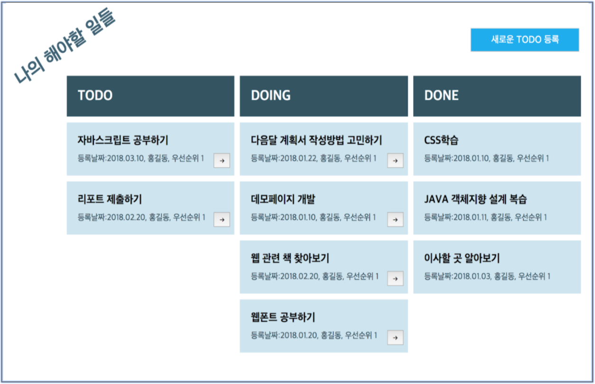
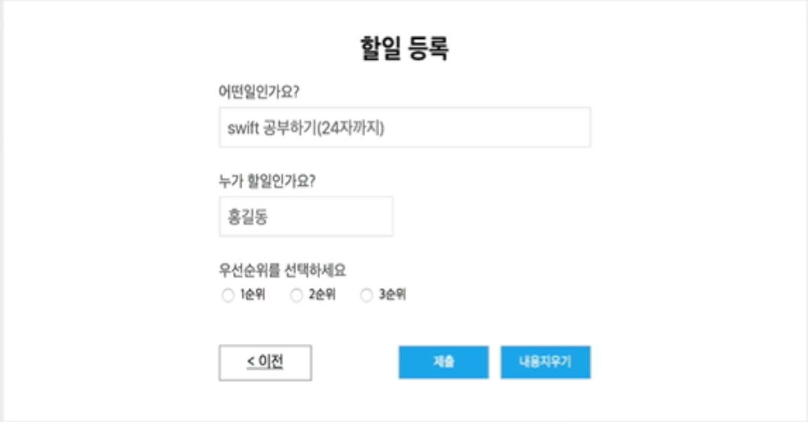
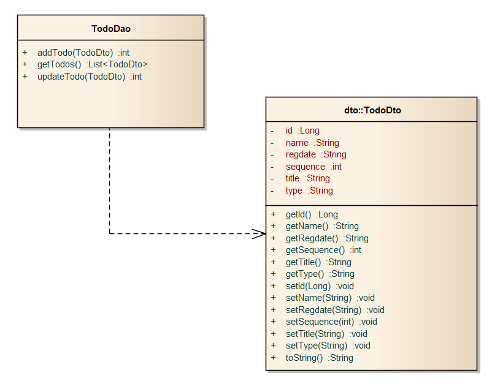

# Project B. TO-DO LIST 구현하기

# 1. 프로젝트 개요
'할 일 관리' 웹 페이지를 개발

'할 일 관리'는 해야 할 일, 하고 있는 일, 한 일을 웹 브라우저에서 확인할 수 있는 웹 애플리케이션

# 기획서
> [부코_웹_PJT2_TODO-LIST.pptx](https://docs.google.com/presentation/d/163ZmA14C4OGB85QnlXMOo9vO9KFN3YzXYbTYPW7wngs/edit#slide=id.p3)





# 2. 프로젝트의 개발스펙
## 웹프론트엔드 기술요구사항
* 총 2개의 화면이 존재
  - 할 일 목록 화면 (리스트)
  - 할 일 등록 화면 (쓰기)
* CSS는 기획서와 동일한 수준으로 만들어야 합니다.
* 따라서 HTML 엘리먼트간의 배치와 간격은 일정하고 반듯해야 합니다.
* 글자의 크기는 일정한 수준을 유지합니다.
* CSS는 외부 라이브러리(부트스트랩)을 사용하지 않습니다.
* jQuery를 사용하지 않고, querySelector, addEventListener, innerHTML을 사용해서 DOM, EVENT 처리를 합니다.
* Ajax는 XMLHTTPRequest를 사용합니다.
 
## 웹백엔드 기술요구사항
* 프로젝트는 maven프로젝트로 생성합니다.
* 제공된 테이블 생성 SQL을 이용해서 테이블을 생성합니다.
* TodoDto 클래스와 TodoDao클래스를 주어진 스펙에 맞게 작성합니다.
* 메인화면을 보여주기 위한 MainServlet과 main.jsp를 작성합니다.
* MainServlet은 TodoDao를 이용해 결과를 조회해서 main.jsp 에 전달합니다.
* 새로운todo등록 버튼을 클릭하면 해당 요청을 서블릿이 받아서 jsp로 포워딩하여 할 일 등록 화면을 보여줍니다.
* 할일등록폼에서 값을 입력하고 제출 버튼을 누르면 post 방식으로 요청하게 합니다.
* 해당 요청을 서블릿이 받아서 처리하게하고, 요청에 대한 모든 일이 끝나면 메인화면으로 리다이렉트 합니다.
* 메인화면에서 todo 상태변경 버튼(->)을 클릭하여 요청을 보낼 때, Todo 의 Id와 상태값을 전달하여 다음 상태로 (현재 상태가 Todo라면 doing으로 doing 이라면 done) 상태를 나타내는 컬럼값을 변경하고 응답결과로 "success"를 보냅니다.

# 3. 프로젝트 개발과정 참고
## BE 개발 - MySql설치
1. 프로젝트 이름을 Todo로해서 maven프로젝트를 생성합니다.
2. 제공된 테이블 생성 SQL을 이용해서 테이블을 생성합니다.
3. Todo 테이블에 정보 한 건을 담을 수 있는 TodoDto 클래스를 주어진 스펙에 맞게 작성합니다.
4. Todo 테이블에 입력, 수정, 조회하는 TodoDao클래스를 주어진 스펙에 맞게 작성합니다.
5. 메인화면을 보여주기 위한 MainServlet과 main.jsp를 작성합니다.
6. MainServlet은 TodoDao를 이용해 결과를 조회해서 main.jsp 에 전달합니다.
7. main.jsp에서는 전달받은 결과를 JSTL 과 EL을 이용해 출력합니다.
8. 새로운todo등록 버튼을 클릭하면 TodoFormServlet이 실행되고, TodoFormServlet은 todoForm.jsp로 포워딩하여 할 일 등록 화면을 보여줍니다.
9. 할 일 등록폼에서 값을 입력하고 제출 버튼을 누르면 post 방식으로 TodoAddServlet으로 값이 전달되고, TodoAddServlet에서는 TodoDao를 이용해서 테이블에 저장하고 메인화면으로 리다이렉트합니다.
10. 메인화면에서 todo 상태변경버튼(->)을 클릭하면 TodoTypeServlet에게 Todo 의 Id와 상태 값을 전달하여 다음 상태로 (현재 상태가 TODO라면 DOING으로 DOING 이라면 DONE로) TodoDao를 이용해서 변경합니다.



## 테이블 생성 SQL
```sql
CREATE TABLE todo ( id BIGINT(20) UNSIGNED NOT NULL AUTO_INCREMENT, title VARCHAR(255) NOT NULL, name VARCHAR(100) NOT NULL, sequence INT(1) NOT NULL, type VARCHAR(20) DEFAULT 'TODO', regdate DATETIME DEFAULT NOW(), PRIMARY KEY (id) );
```

## 프로그램 관련 SQL(참고용)

- 입력
```sql
insert into todo(title, name, sequence) values('자바스크립트공부하기', '홍길동', 1); insert into todo(title, name, sequence) values('리포트 제출하기', '홍길동', 1);
```

- 수정
```sql
update todo set type = 'DOING' where id = 1; update todo set type = 'DONE' where id = 1;
```

- 조회
```sql
select id, title, name, sequence, type, regdate from todo order by regdate desc select id, title, name, sequence, type, regdate from todo where type = 'TODO' order by regdate desc
```
## TodoDao와 TodoDto
주어진 클래스다이어그램과 같이 필드와 메소드를 가지는 TodoDto와 TodoDao클래스를 작성합니다.


# 프로젝트 실습
## 1. 프로젝트 생성
* new project - maven project
* 아키타입 선택
  * Group id - arg.apache.maven.archetypes
  * Artifact id - maven-archetype-webapp
  * version - 1.4
* 아키타입 아이디 설정
  * Group id - kr.or.connect
  * Artifact id - Todo
## 2. 데이터베이스 접속 후 테이블 생성
* connectdb 데이터베이스에 접속 
* todo 테이블을 생성
* todo 테이블이 잘 생성되었는지 확인
### 실습코드
```
C:\Users\Junha>mysql -h127.0.0.1 -uconnectuser -p connectdb
Enter password: *************
Welcome to the MySQL monitor.  Commands end with ; or \g.
Your MySQL connection id is 13
Server version: 8.0.25 MySQL Community Server - GPL

Copyright (c) 2000, 2021, Oracle and/or its affiliates.

Oracle is a registered trademark of Oracle Corporation and/or its
affiliates. Other names may be trademarks of their respective
owners.

Type 'help;' or '\h' for help. Type '\c' to clear the current input statement.

mysql> CREATE TABLE todo ( id BIGINT(20) UNSIGNED NOT NULL AUTO_INCREMENT, title VARCHAR(255) NOT NULL, name VARCHAR(100) NOT NULL, sequence INT(1) NOT NULL, type VARCHAR(20) DEFAULT 'TODO', regdate DATETIME DEFAULT NOW(), PRIMARY KEY (id) );
ERROR 1050 (42S01): Table 'todo' already exists
mysql> Query OK, 0 rows affected, 2 warnings (0.11 sec)

mysql> desc todo;
+----------+-----------------+------+-----+-------------------+-------------------+
| Field    | Type            | Null | Key | Default           | Extra             |
+----------+-----------------+------+-----+-------------------+-------------------+
| id       | bigint unsigned | NO   | PRI | NULL              | auto_increment    |
| title    | varchar(255)    | NO   |     | NULL              |                   |
| name     | varchar(100)    | NO   |     | NULL              |                   |
| sequence | int             | NO   |     | NULL              |                   |
| type     | varchar(20)     | YES  |     | TODO              |                   |
| regdate  | datetime        | YES  |     | CURRENT_TIMESTAMP | DEFAULT_GENERATED |
+----------+-----------------+------+-----+-------------------+-------------------+
6 rows in set (0.00 sec)
```
## 3. TodoDto 클래스 작성
테이블의 있는 id, name, sequencem, title, type 이 5개의 컬럼과 regDate라는 객체를 담을 공간을 마련하기 위한 데이터 전송 객체(DTO) 작성
### 클래스다이어그램
```
id :Long
name :String
regDtae :String
sequence :int
title :String
type :String

---

getId() :long
getName() :String
getRegDate() :String
getSequence() :int
getTitle() :String
getType() :String
setId(long) :void
setName(String) :void
setRegDate(String) :void
setSequence(int) :void
setTitle(String) :void
setType(String) :void
toString() :String
```
### 작성단계
1. New class 생성
   * kr.or.connect.dto 패키지 안에 생성
   * 이름은 TodoDto
2. 6개의 변수 선언
3. getter(), setter() 메서드 생성
   * Source > Generate Getters and Setters...
   * select All
4. toString()메서드 오버라이드 
   * 값들이 중요한 객체기 때문에 더 편하게 출력할 수 있도록 하는 목적
   * Source > Generate toString()...
5. TodoDto 생성자 추가
   * 더 편하게 객체를 생성하기 위해 6개의 인자값을 받아 각각에다 값을 담아주는 생성자 추가

```java
package kr.or.connect.dto;

public class TodoDto {
	private Long id;
	private String name;
	private String regDate;
	private Integer sequence;
	private String title;
	private String type;

	public TodoDto(Long id, String name, String regDate, Integer sequence, String title, String type) {
		super();
		this.id = id;
		this.name = name;
		this.regDate = regDate;
		this.sequence = sequence;
		this.title = title;
		this.type = type;
	}

	public Long getId() {
		return id;
	}

	public void setId(Long id) {
		this.id = id;
	}

	public String getName() {
		return name;
	}

	public void setName(String name) {
		this.name = name;
	}

	public String getRegDate() {
		return regDate;
	}

	public void setRegDate(String regDate) {
		this.regDate = regDate;
	}

	public Integer getSequence() {
		return sequence;
	}

	public void setSequence(Integer sequence) {
		this.sequence = sequence;
	}

	public String getTitle() {
		return title;
	}

	public void setTitle(String title) {
		this.title = title;
	}

	public String getType() {
		return type;
	}

	public void setType(String type) {
		this.type = type;
	}

	@Override
	public String toString() {
		return "TodoDto [id=" + id + ", name=" + name + ", regDate=" + regDate + ", sequence=" + sequence + ", title="
				+ title + ", type=" + type + "]";
	}
}
```

## 4. TodoDao 클래스 작성
Todo테이블에 입력, 수정, 조회하는 클래스 작성  
dao : 데이터 접근 객체
### 클래스다이어그램
```
addTodo(TodoDto) :int
getTodos() :List<TodoDto>
updateTodo(TodoDto) :int
```
### 작성단계
* New class 생성
   * kr.or.connect.dㅁo 패키지 안에 생성
   * 이름은 TodoDao
1. `addTodo(TodoDto) : int` 
   * 데이터를 추가하는 메서드
   * 한 건의 데이터를 입력하는 메서드
   * 값을 입력할 인자로 `todoDto`을 가져온다.
   * int형 변수를 하나 선언해서 "몇 건의 결과가 추가되었습니다" 라는 결과값을 리턴할 수 있게 한다.
   * 결과값을 ResultSet으로 가져오지 않기 때문에 ResultSet 객체는 사용 x 
   * Connection, PreparedStatement 객체 선언
   * 드라이버로딩 > getConnection()메서드로 conn객체 얻어옴 > conn 객체로부터 ps 객체를 가져온다.
   * sql문
		```sql
		INSERT INTO todo ()
		```
   * ?가 들어간 쿼리문은 완전한 쿼리문이 아니기 때문에 물음표 값을 바인딩하는 코드가 필요하므로 PS객체에 set()메서드{파라미터 : 물음표의 순서 , todoDto객체가 가지고 있는 getter()메서드 중 가져올 객체}를 이용하여 작성.
   * select와 달리 insert, update, delete문은 executeUpdate메서드를 사용하므로 이 메서드를 사용해 실행 코드 작성
   * 쿼리가 실행되면 int값을 `insertCount`에 받아서 가져온다.
   * 예외처리
   * 얻어온 객체에 반대 순서대로 닫아주는 코드까지 작성
2. `getTodos() : List<TodoDto>`
   * 데이터를 모두 조회하여 가져오는 메서드
   * TodoDto의 모든 List를 조회하기위해 ArrayList<>사용
   * try-with resource라는 문법을 사용해 연결을 close하는 부분을 자동적으로 처리한다. 
3. `updateTodo(TodoDto) :int`
   * 데이터를 수정하는 메서드
   * addTodo메서드와 쿼리문의 내용만 다르고 전부 같다.
   * ResultSet객체는 사용하지 않는다
   * 드라이버 로드 후 드라이버를 이용해 get connnection한다.
   * 쿼리문을 ?를 이용하여 수정기능을 구현한다.
   * ?를 정의해주고 결과를 executeUpdate한다.
   * 예외처리한다(try-wite resource로 수정가능)

### 실습코드
```java
package kr.or.connect.dao;

import java.sql.Connection;
import java.sql.DriverManager;
import java.sql.PreparedStatement;
import java.sql.ResultSet;
import java.util.ArrayList;
import java.util.List;
import kr.or.connect.dto.TodoDto;

public class TodoDao {
	private static String dburl = "jdbc:mysql://localhost:3306/connectdb?allowMultiQueries=true";
	private static String dbUser = "connectuser";
	private static String dbpasswd = "connect123!@#";

	public int addTodo(TodoDto todoDto) {
		int insertCount = 0;
		Connection conn = null;
		PreparedStatement ps = null;
		try {
			Class.forName("com.mysql.cj.jdbc.Driver");
			conn = DriverManager.getConnection(dburl, dbUser, dbpasswd);
			String sql = "INSERT INTO todo(title, name, sequence) VALUES(?, ?, ?)";
			ps = conn.prepareStatement(sql);
			ps.setString(1, todoDto.getTitle());
			ps.setString(2, todoDto.getName());
			ps.setInt(3, todoDto.getSequence());
			insertCount = ps.executeUpdate();
		} catch (Exception e) {
			e.printStackTrace();
		} finally {
			if (ps != null) {
				try {
					ps.close();
				} catch (Exception e) {
				}
			}
			if (conn != null) {
				try {
					conn.close();
				} catch (Exception e) {
				}
			}
		}
		return insertCount;
	}

	public List<TodoDto> getTodo() {
		List<TodoDto> list = new ArrayList<>();
		try {
			Class.forName("com.mysql.cj.jdbc.Driver");
		} catch (ClassNotFoundException e) {
			e.printStackTrace();
		}
		String sql = "select id, title, name, sequence, type, regdate from todo order by regdate desc; select id, title, name, sequence, type, regdate from todo where type = 'TODO' order by regdate desc;";
		try (Connection conn = DriverManager.getConnection(dburl, dbUser, dbpasswd);
				PreparedStatement ps = conn.prepareStatement(sql)) {
			try (ResultSet rs = ps.executeQuery()) {
				while (rs.next()) {
					long id = rs.getLong("id");
					String name = rs.getString("name");
					String regDate = rs.getString(3);
					Integer sequence = rs.getInt(4);
					String title = rs.getString(5);
					String type = rs.getString(6);
					TodoDto todoDto = new TodoDto(id, name, regDate, sequence, title, type);
					list.add(todoDto);
				}
			} catch (Exception e) {
				e.printStackTrace();
			}
		} catch (Exception ex) {
			ex.printStackTrace();
		}
		return list;
	}

	public int updateTodo(TodoDto todoDto) {
		int updateCount = 0;
		Connection conn = null;
		PreparedStatement ps = null;
		try {
			Class.forName("com.mysql.cj.jdbc.Driver");
			conn = DriverManager.getConnection(dburl, dbUser, dbpasswd);
			String sql = "UPDATE todo SET type = ? where id = ?";
			ps = conn.prepareStatement(sql);
			ps.setString(1, todoDto.getType());
			ps.setLong(2, todoDto.getId());
			updateCount = ps.executeUpdate();
		} catch (Exception ex) {
			ex.printStackTrace();
		} finally {
			if (ps != null) {
				try {
					ps.close();
				} catch (Exception ex) {
				}
			}
			if (conn != null) {
				try {
					conn.close();
				} catch (Exception ex) {
				}
			}
		}
		return updateCount;
	}
}
```
### 기능 확인 연습 코드
1. `addExam.java`
   * addTodo()의 데이터 추가 기능 확인용 연습 파일
```java
package kr.or.connect;

import kr.or.connect.dao.TodoDao;
import kr.or.connect.dto.TodoDto;

public class addExam {
	public static void main(String[] args) {
		String title = "0000하기";
		String name = "김철수";
		int sequence = 22;

		TodoDto todoDto = new TodoDto(null, name, null, sequence, title, null);

		TodoDao dao = new TodoDao();
		int insertCount = dao.addTodo(todoDto);

		System.out.println(insertCount);
	}
}
```

2. `getExam.java`
   * todo테이블의 데이터를 모두 조회하는 기능을 구현한 getTodo()메서드를 확인하기 위한 간단한 연습 파일
```java
package kr.or.connect;

import java.util.List;

import kr.or.connect.dao.TodoDao;
import kr.or.connect.dto.TodoDto;

public class getListExam {
	public static void main(String[] args) {

		TodoDao dao = new TodoDao();

		List<TodoDto> list = dao.getTodo();

		for (TodoDto todoDto : list) {
			System.out.println(todoDto);
		}
	}
}
```

3. `updateExam.java`
   * updateTodo()메서드의 수정기능 확인용 파일
```java
package kr.or.connect;

import kr.or.connect.dao.TodoDao;
import kr.or.connect.dto.TodoDto;

public class updateExam {
	public static void main(String[] args) {

		long id = 1;
		String type = "Doing";
				
		TodoDto todoDto = new TodoDto(id, null, null, null, null, type);

		TodoDao dao = new TodoDao();
		int updateCount = dao.updateTodo(todoDto);

		System.out.println(updateCount);
	}
}
```

## 5. MainServlet, Main.jsp 작성
* Servlet과 jsp는 각각 프로그램 로직 수행, 결과 출력에 장점이 있다.
* 따라서 MainServlet에서 TodoDao를 이용한 결과, 즉 add, get, update의 기능을 구현하는 로직을 작성하고
* Main.jsp에서 HTML문으로 결과를 출력하도록 작성한다.
## 5-1. MainServlet 작성
* TodoDao를 이용해 결과를 조회해서 main.jsp에 전달하는 서블릿
* src/main/java/kr/or/connect/servlet 패키지에 생성
* TodoDao객체 dao 생성
* TodoDao를 저장할 ArrayList객체, todoDtoList 생성 
* dtoList에 dao(TodoDao객체)의 getTodo()메서드를 대입
* request.setAttribute()메서드로 dtoList의 값을 저장
* RequestDispatcher 객체, rd 에 request의 getRequestDispatcher()를 사용해 main.jsp로 포워드
```java
package kr.or.connect.servlet;

import java.io.IOException;
import java.util.List;

import javax.servlet.RequestDispatcher;
import javax.servlet.ServletException;
import javax.servlet.annotation.WebServlet;
import javax.servlet.http.HttpServlet;
import javax.servlet.http.HttpServletRequest;
import javax.servlet.http.HttpServletResponse;

import kr.or.connect.dao.TodoDao;
import kr.or.connect.dto.TodoDto;

@WebServlet("/MainServlet")
public class MainServlet extends HttpServlet {
	private static final long serialVersionUID = 1L;

	public MainServlet() {
		super();
	}

	protected void doPost(HttpServletRequest request, HttpServletResponse response)
			throws ServletException, IOException {
		TodoDao dao = new TodoDao();
		List<TodoDto> todoDtoList = dao.getTodo();
		request.setAttribute("todoDtoList", todoDtoList);
		RequestDispatcher rd = request.getRequestDispatcher("/main.jsp");
		rd.forward(request, response);
	}
}
```
## 5-2. main.jsp 작성
* MainServlet에서 전달받은 결과를 html, JSTL, EL을 이용해 출력(java 코드 사용 최대한 x)
### EL
표현언어
* 문법
  * `${expr}`
* 예제
```html
<jsp:include page="/module/${skin.id}/header.jsp" flush="true" />

<b>${sessionScope.member.id}</b>님 환영합니다.
```
* 사용법
  * jsp의 스크립트 요소(스크립트릿, 표현식, 선언부)를 제외한 나머지 부분에서 사용될 수 있으며, 표현식을 통해서 표현식보다 편리하게 값을 출력할 수 있다.
### JSTL
JSTL은 jsp페이지에서 조건문, 반복문 처리 등을 html태그의 형태로 작성할 수 있게 도와준다.
* 사용하려면
  * >[jar파일 다운로드 사이트](http://tomcat.apache.org/download-taglibs.cgi)
  * 위 사이트에서 3가지 jar파일을 다운로드한 후 WEB-INF/lib/ 폴더에 복사
### main.jsp 작성코드
```jsp
<%@page import="java.util.ArrayList"%>
<%@page import="kr.or.connect.TodoList.dto.TodoDto"%>
<%@page import="java.util.List"%>
<%@ page language="java" contentType="text/html; charset=UTF-8"
    pageEncoding="UTF-8"%>
<%@ taglib prefix ="c" uri="http://java.sun.com/jsp/jstl/core" %>

<!DOCTYPE html>
<html>
<head>
<meta charset="UTF-8">
<meta name="viewport" content="width=device-width">
<title>Todo-List</title>
<link rel="stylesheet" href="main.css?after">
</head>
<body>
	
<header>
  <button class="new" onclick="location.href='http://localhost:8080/TodoList/TodoFormServlet'">할일 등록</button>
</header>

<section id = "sec-body">
  <section id = "left" class="com" style="width:100px">
  </section>
  <section id = "TODO" class="com">
    <p class="title">TODO</p>
    <c:forEach var="todo" items="${dtoList}">
		<c:if test="${todo.getType() eq 'TODO'}">
		    <section class="content">
		      <p class="content-title">${todo.getTitle() }</p>
		      <p class="content-data">등록날짜 : ${todo.getRegDate() }, ${todo.getName() } 우선순위 : ${todo.getSequence() }</p>
		      <button id="${todo.getId()}#${todo.getType()}" class="nextType" onclick="next(id)">-></button>
		    </section>
		</c:if>
  	</c:forEach>
  </section>
  <section id = "DOING" class="com">
    <p class="title">DOING</p>
        <c:forEach var="todo" items="${dtoList}">
		<c:if test="${todo.getType() eq 'DOING'}">
		    <section class="content">
		      <p class="content-title">${todo.getTitle() }</p>
		      <p class="content-data">등록날짜 : ${todo.getRegDate() }, ${todo.getName() } 우선순위 : ${todo.getSequence() }</p>
		      <button id="${todo.getId()}#${todo.getType()}" class="nextType" onclick="next(id)">-></button>
		    </section>
		</c:if>
  		</c:forEach>
  </section>
  <section id = "DONE" class="com">
    <p class="title">DONE</p>
        <c:forEach var="todo" items="${dtoList}">
		<c:if test="${todo.getType() eq 'DONE'}">
		    <section class="content">
		      <p class="content-title">${todo.getTitle() }</p>
		      <p class="content-data">등록날짜 : ${todo.getRegDate() }, ${todo.getName() } 우선순위 : ${todo.getSequence() }</p>
		      <c:set var="vid3" scope="request" value="${todo.getId() }"/>
		      <button id="${todo.getId()}#${todo.getType()}" class="nextType" onclick="buttonDelete(id)">X</button>
		    </section>
		</c:if>
  		</c:forEach>
  </section>  
</section>
  
</body>

<script type="text/javascript" src="./main.js?v=<%=System.currentTimeMillis() %>"></script>
</html>
```