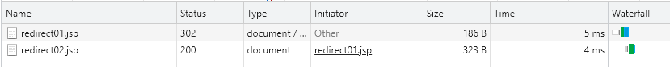
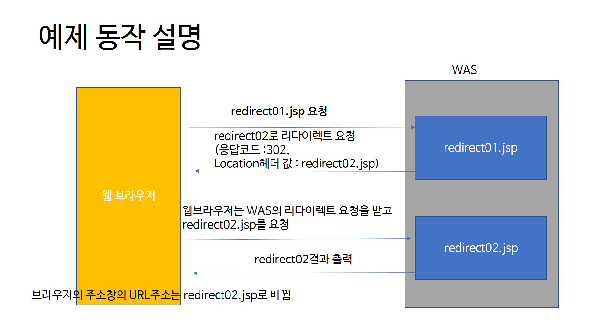
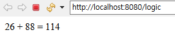

> 부스트코스 - 웹 프로그래밍(풀스택)강의를 학습, 정리한 내용입니다.(https://www.boostcourse.org/web316/joinLectures/12943)

# redirect & forward - BackEnd

- [redirect & forward - BackEnd](#redirect--forward---backend)
- [REDIRECT](#redirect)
  - [예시 - 인터넷 게시판에서 글을 작성할 때](#예시---인터넷-게시판에서-글을-작성할-때)
  - [핵심 개념](#핵심-개념)
  - [redirect의 과정](#redirect의-과정)
  - [redirect 실습](#redirect-실습)
    - [redirect01.jsp](#redirect01jsp)
    - [redirect02.jsp](#redirect02jsp)
    - [실행 결과](#실행-결과)
    - [브라우저에서 리다이렉트 확인](#브라우저에서-리다이렉트-확인)
    - [예제 동작 설명](#예제-동작-설명)
    - [주의사항](#주의사항)
  - [리다이렉션의 장점과 단점](#리다이렉션의-장점과-단점)
    - [장점](#장점)
    - [단점](#단점)
  - [참고 자료](#참고-자료)
- [FORWARD](#forward)
  - [핵심 개념](#핵심-개념-1)
  - [forward란?](#forward란)
    - [주의사항](#주의사항-1)
  - [forward의 과정](#forward의-과정)
  - [Forward 실습](#forward-실습)
  - [실습 코드](#실습-코드)
    - [`FrontServlet.java`](#frontservletjava)
    - [`NextSevlet.java`](#nextsevletjava)
  - [생각해보기](#생각해보기)
    - [서블릿 > jsp 포워드](#서블릿--jsp-포워드)
  - [참고 자료](#참고-자료-1)
- [servlet & jsp연동](#servlet--jsp연동)
  - [핵심 개념](#핵심-개념-2)
  - [Servlet과 JSP연동](#servlet과-jsp연동)
  - [servlet jsp연동 실습](#servlet-jsp연동-실습)
  - [실습코드](#실습코드)
    - [LogicServlet.java](#logicservletjava)
    - [result.jsp](#resultjsp)
  - [Servelt과 jsp의 연동의 과정](#servelt과-jsp의-연동의-과정)
  - [생각해보기](#생각해보기-1)
    - [URL patterns](#url-patterns)
    - [syntax](#syntax)
    - [URL Patterns 정리](#url-patterns-정리)
  - [참고 자료](#참고-자료-2)

<small><i><a href='http://ecotrust-canada.github.io/markdown-toc/'>Table of contents generated with markdown-toc</a></i></small>


# REDIRECT
* http프로토콜로 정해진 규칙
* 서버가 클라이언트에게 보내는 요청
* 특정 URL로 이동할때 사용

## 예시 - 인터넷 게시판에서 글을 작성할 때
* 글을 모두 작성한 후에 글 작성 버튼을 클릭하면 클라이언트가 서버에게 글을 작성해주세요라는 요청을 보내게 되고 서브는 해당 글을 저장한 후, 웹 브라우저에게 글 목록으로 이동하라고 응답을 보내게 된다.
* 웹 브라우저는 글목록으로 이동하라는 서버의 요청을 받은 후, 자동으로 서버에게 글 목록을 요청하여 응답받아 출력하게 된다.
* 이렇게 서버가 클라이언트에게 어떤 URL로 이동하라는 요청을 보내는 것을 리다이렉트라고 한다.
## 핵심 개념
1. HttpServletResponse 
2. sendRedirect() 
## redirect의 과정
1. 클라이언트의 요청
   * 서버는 클라이언트로부터 요청을 받은 후, 클라이언트에게 특정 URL로 이동하라고 요청할 수 있는데 이를 리다이렉트라고 한다.
2. 서버의 응답
   * 서버에서는 클라이언트에게 응답할 때 상태코드 302와 함께 이동할 URL정보를 Location 헤더(Header)에 담아 전송한다.
3. 클라이언트 재요청
   * 클라이언트는 서버로부터 받은 상태값이 302 이면 Location헤더값으로 재요청을 보내게 된다.
   * 이때 브라우저의 주소창은 전송받은 URL로 바뀌게 된다.
* 서블릿이나 jsp는 redirect하기 위해서 HttpServeltResponse가 가지고 있는 sendRedirect()메소드를 사용한다.
## redirect 실습
* redirect01.jsp, redirec02.jsp 파일 작성
* 웹 브라우저가 redirect01.jsp를 요청
* redirect01은 redirect02.jsp로 리다이렉팅하는 로직이 실행되도록 함
* 결과 확인
### redirect01.jsp
```jsp
<%@ page language="java" contentType="text/html; charset=UTF-8"
    pageEncoding="UTF-8"%>
<% 
	response.sendRedirect("redirect02.jsp");
%>
```
* `response.sendRedirect(location);`
  * location(URL)로 리다이렉트
### redirect02.jsp
```jsp
<%@ page language="java" contentType="text/html; charset=UTF-8"
    pageEncoding="UTF-8"%>
<!DOCTYPE html>
<html>
<head>
<meta charset="UTF-8">
<title>Insert title here</title>
</head>
<body>
	redirect된 페이지 입니다.
</body>
</html>
```
### 실행 결과
* redirect01.jsp파일을 Run on server로 실행하니 URL에 redirect02.jsp가 보인다.
* redirect01.jsp파일에서 리다이렉트 location인 redirect02.jsp로 이동(리다이렉션)한 것.
### 브라우저에서 리다이렉트 확인
* 크롬브라우저 - 검사 - Networt
  * redirect01.jsp를 실행하면 서버로부터 응답코드로 302를 받는 것을 알 수 있다.

### 예제 동작 설명

1. 클라이언트 브라우저는 redirect01.jsp를 요청했고
2. 톰캣(WAS), 서버)에서는 redirect01.jsp 요청을 받았다
* 01.jsp에서는 sendRedirect()메서드를 수행하면서 location으로 redirect02.jsp라는 값을 넣어서 보냈다.
  * 01.jsp는 응답결과로 다시 브라우저한테 보낸 것(응답코드-302, Location헤더값 - redirect02.jsp)
3. WAS는 리다이렉트 요청
   * 사용자가 링크를 클릭한다거나 URL을 바꿔서 쓴다거나 하는 동작을 하지 않았음에도 이 브라우저가 알아서 302라는 응답코드를 확인하고 Location헤더값에 가져온 주소를 요청한다.
   * 브라우저가 알아서 자동으로 다시 서버한테 redirect02.jsp를 요청을 하게 되는 것
4. 웹브라우저는 WAS의 리다이렉트 요청을 받고 redirect02.jsp를 요청
5. redirect02.jsp 결과 출력
   * 브라우저 URL은 redirect02.jsp로 바뀜(순식간이라 바뀐것이 아닌것처럼 보이지만 바뀐 것.)
### 주의사항
* 요청 2번, 응답 2번.
 * 각각의 요청객체, 응답객체는 서로 다른 객체이다.

## 리다이렉션의 장점과 단점
### 장점
* 신뢰성 증가(URL응답 실패시 리다이렉션 > 사용자신뢰향상)
* 응답시간 감소(가까운 리소스로 리다이렉션 )
* 네트워크 혼잡도 감소(여러 서버에 분산해 리다이렉션)
### 단점
* URL이 리다이렉트 시마다 변경된다. (전송값 재사용 불가)
* 새로운 객체 생성 후 기존 객체 사라진다.(요청 객체 재사용 불가) - cf)포워드
* 페이지 이동 노출(Network노출)
 

## 참고 자료
> [참고링크] Servlet Tutorial: sendRedirect method - javatpoint
https://www.javatpoint.com
 
> [참고링크] HTTP 상태 코드
https://developer.mozilla.org

> [참고링크] HTTP Status Code
http://ooz.co.kr
 
> [참고링크] Redirections in HTTP
https://developer.mozilla.org

> [참고링크] URL Shortener and Link Management Platform
https://bitly.com

> [참고링크] Google URL Shortener
https://goo.gl


# FORWARD
* WAS의 서블릿이나 JSP가 요청을 받은 후 그 요청을 처리하다가, 추가적인 처리를 같은 웹 어플리케이션안에 포함된 다른 서블릿이나 JSP에게 위임하는 경우가 있다.
* 이렇게 위임하는 것 : 포워드(forward)
## 핵심 개념
1. RequestDispatcher
2. forward()
## forward란?

> 출처 http://java.scwcd.jobs4times.com/Web-Container-Model.html
* 클라이언트가 서버에게 보낸 요청보냈을 때, 요청을 받은 Servlet1이 요청을 혼자 다 처리하지 않고 일정 부분까지만 처리하고 나머지를 Servlet2에게 넘겨준다.
* 이렇게 넘겨주는 작업을 포워드라고 한다.
* Servlet2가 마저 처리한 후 응답을 만들어서 클라이언트에게 보내 주는 것이 포워드
### 주의사항
* 포워드와 리다이렉트를 혼동하지 않도록 하자.
1. 리다이렉트
   * 클라이언트가 서버에게 요청을 보냈을 때, 서버는 필요한 일들을 처리하고 다시 클라이언트에게 응답
   * 새로운 요청할 곳(redirect location)을 알려주면서 다시 요청하라고 알려줌
   * 그러면 브라우저가 location에 맞게 재요청
   * URL주소가 바뀐다.
   * 재요청시 request, response 객체가 새로 만들어진다.
2. 포워드
   * 클라이언트는 '요청받은 Servlet1이 혼자 처리했는지', '다른 서블릿에게 위임했는지' 전혀 알 필요가 없다.
   * URL주소가 바뀌지 않는다.
   * request, response 객체가 한 번만 만들어진다.
* 요청이 하나면 포워드 서로 다른 2 개면 리다이렉트
## forward의 과정
1. 웹 브라우저에서 Servlet1에게 요청을 보냄
2. Servlet1은 요청을 처리한 후, 그 결과를 HttpServletRequest에 저장
3. Servlet1은  
    결과가 저장된 HttpServletRequest와  
    응답을 위한 HttpServletResponse를  
    같은 웹 어플리케이션 안에 있는 Servlet2에게 전송(forward)
4. Servlet2는  
   Servlet1으로 부터 받은   
   HttpServletRequest와  
   HttpServletResponse를 이용하여  
   요청을 처리한 후  
   웹 브라우저에게 결과를 전송

## Forward 실습
* `FrontServlet`, `NextServlet` 작성
* `http://localhost:8080/firstweb/front`
  * 위의 URL이 호출되면 `FrontServlet`이 실행됨.
  * `FrontServlet`에서는 랜덤한 주사위 값을 구하고, 그 값을 `NextServlet`에게 forward
  * `NextServlet`에서는 `FrontServlet`으로부터 전달받은 주사위 값만큼 "hello"를 출력
## 실습 코드
### `FrontServlet.java`
```java
package examples;

import java.io.IOException;

import javax.servlet.RequestDispatcher;
import javax.servlet.ServletException;
import javax.servlet.annotation.WebServlet;
import javax.servlet.http.HttpServlet;
import javax.servlet.http.HttpServletRequest;
import javax.servlet.http.HttpServletResponse;

@WebServlet("/front")
public class FrontServlet extends HttpServlet {
    private static final long serialVersionUID = 1L;

    public FrontServlet() {
        super();
    }

    protected void service(HttpServletRequest request, HttpServletResponse response) throws ServletException, IOException {
            
            int diceValue = (int)(Math.random() * 6) + 1; 
            request.setAttribute("dice", diceValue);
            
            RequestDispatcher requestDispatehcer = request.getRequestDispatcher("/next");
            requestDispatehcer.forward(request, response);
    }

}
```
### `NextSevlet.java`
```java
package examples;

import java.io.IOException;
import java.io.PrintWriter;
import java.util.Enumeration;
import javax.servlet.ServletException;
import javax.servlet.annotation.WebServlet;
import javax.servlet.http.HttpServlet;
import javax.servlet.http.HttpServletRequest;
import javax.servlet.http.HttpServletResponse;

@WebServlet("/forward")
public class ForwardServlet extends HttpServlet {
    private static final long serialVersionUID = 1L;
    public ForwardServlet() {
        super();
    }

    protected void service(HttpServletRequest request, HttpServletResponse response) throws ServletException, IOException {
        response.setContentType("text/html");
        PrintWriter out = response.getWriter();
        out.println("<html>");
        out.println("<head><title>form</title></head>");
        out.println("<body>");

        int dice = (Integer)request.getAttribute("dice");
        out.println("dice : " + dice);
        for(int i = 0; i < dice; i++) {
            out.print("<br>hello");
        }
        out.println("</body>");
        out.println("</html>");
    }

}
```
## 생각해보기
* 서블릿은 프로그램 로직을 개발하기에 편리하지만, HTML 태그를 출력하기엔 불편합니다.
* JSP는 프로그램 로직을 개발하기는 좀 불편하지만, HTML 태그를 출력하기엔 편리합니다.
* 서블릿과 JSP는 서로 장단점이 반대입니다.
* 포워드를 이용해서 이러한 단점을 해결하고 싶습니다. 
* 어떻게 해야 할까요?
### 서블릿 > jsp 포워드
서블릿 -> jsp로 포워드.
서블릿에서 프로그램 로직을 처리하고 jsp에서 html태그를 처리
## 참고 자료
> [참고링크] Servlet forward example - How to forward from a servlet to a JSP
https://alvinalexander.com


# servlet & jsp연동
* 서블릿과 JSP는 서로 상호 보완적인 관계
* 서블릿은 로직을 구현하기에 알맞지만, HTML을 출력하기엔 불편
* JSP는 로직을 구현하는 것은 불편하지만 HTML을 출력하기엔 편리
* 이러한 서블릿과 JSP를 좀 더 잘 사용하기 위해서 forward가 사용되는 경우가 많다.
* 서블릿과 JSP의 연동을 알아보자
## 핵심 개념
1. forward
2. request.setAttribute()
3. request.getAttribute()
## Servlet과 JSP연동
* Servlet은 프로그램 로직이 수행되기에 유리하다.
  * 자바파일이기 때문
    * jsp에서는 '스크립트릿', '선언문'과 같은 요소들을 사용해야 한다.
  * IDE 등에서 지원을 좀 더 잘해준다.
* JSP는 결과를 출력하기에 Servlet보다 유리하다. 
  * 필요한 html문을 그냥 입력하면 됨.
    * 서블릿에서 HTML페이지를 만들려면
    * out.println에서 문자열로 html태그들을 다 넣어 줘야 한다.
  
* 프로그램 로직 수행은 Servlet에서, 결과 출력은 JSP에서 하는 것이 유리하다.
* Servlet과 JSP의 장단점을 해결하기 위해서 Servlet에서 프로그램 로직이 수행되고, 그 결과를 JSP에게 포워딩하는 방법이 사용되게 되었다. 
  * 이를 Servlet과 JSP연동이라고 한다.

## servlet jsp연동 실습
* LogicServelt에서 1부터 100사이의 random한 값 2개와, 그 값의 합을 구한 후
* 그 결과를 result.jsp에게 포워딩하는 방법으로 전송하여 결과를 출력
## 실습코드
### LogicServlet.java
```java
package examples;

import java.io.IOException;
import javax.servlet.RequestDispatcher;
import javax.servlet.ServletException;
import javax.servlet.annotation.WebServlet;
import javax.servlet.http.HttpServlet;
import javax.servlet.http.HttpServletRequest;
import javax.servlet.http.HttpServletResponse;

@WebServlet("/logic")
public class LogicServlet extends HttpServlet {
	private static final long serialVersionUID = 1L;

    public LogicServlet() {
        super();
    }

	protected void service(HttpServletRequest request, HttpServletResponse response) throws ServletException, IOException {
		int v1 = (int)(Math.random() * 100) + 1;
		int v2 = (int)(Math.random() * 100) + 1;
		int result = v1 + v2;
		
		request.setAttribute("v1", v1);
		request.setAttribute("v2", v2);
		request.setAttribute("result", result);
		
		RequestDispatcher rd = request.getRequestDispatcher("/jsp/result.jsp");
		rd.forward(request, response);
	}
}
```

### result.jsp
```jsp
<%@ page language="java" contentType="text/html; charset=UTF-8"
    pageEncoding="UTF-8"%>
<!DOCTYPE html>
<html>
<head>
<meta charset="UTF-8">
<title>Insert title here</title>
</head>
<body>
EL표기법으로 출력<br>
${v1} + ${v2} = ${result} <br><br>

스클립틀릿과 표현식을 이용해 출력<br>
<%
    int v1 = (int)request.getAttribute("v1");
    int v2 = (int)request.getAttribute("v2");
    int result = (int)request.getAttribute("result");
%>
<%=v1 %> + <%=v2 %> = <%=result %>
</body>
</html>
```
* EL 표기법, JSTL은 자바코드를 되도록 줄일 수 있게 도와주는 문법(추후 학습)

* 포워드는 URL이 바뀌지 않는다.
## Servelt과 jsp의 연동의 과정

1. 클라이언트(웹브라우저)가 LogicServlet을 요청
2. WAS가 LogicServlet을 실행
3. result.jsp로 포워드
4. result.jsp결과 출력
   * 응답결과들을 response객체에 담아서 클라이언트에게 응답
## 생각해보기
* 객체지향에서 객체는 관련된 것들을 모아서 가지고 있는 특징이 있습니다. 
* 웹 페이지 URL도 관련된 URL이 있습니다. 예를 들어, 게시판 글쓰기, 읽기, 목록 보기 등은 모두 게시판과 관련된 URL일 것입니다. 
* 하지만 지금까지의 예제들을 보면 서블릿은 하나의 URL만 처리하고 있습니다. 
* 하나의 서블릿이 여러 개의 요청을 받을 수는 없을까요?
* (힌트 : 서블릿 URL mapping에서 와일드카드('*'기호)를 사용하는 방법에 대해서 조사해보세요.)
### URL patterns
> [참고링크] URL Patterns 
https://help.perforce.com/hydraexpress/3.5.0/html/rwsfservletug/4-3.html

* '4.3.1 URL Pattern Syntax'을 보면 다음과 같이 써있다.
* "At the end of a pattern, `/*` matches any sequence of characters from that point forward. The pattern `*.`extension matches any file name ending with extension."
* 해석하자면.. 
* "패턴의 끝에서 /*는 해당 지점부터 앞으로의 모든 문자 시퀀스와 일치한다. *.extension은 파일 이름이 extension 확장자로 끝나는 모든 파일과 일치한다."
### syntax
* 예시 상황 - example.com의 서블릿 컨테이너의 examples 문맥에 대한 web.xml파일의 패턴 일치
1. 폴더 경로 일치 `/*`
   * `<url-pattern>/status/*</url-pattern>`
   * examples/status의 경로에 대한 패턴  일치
2. 확장자 패턴 일치 `*.`
   * `<url-pattern>*.map</url-pattern>`
   * /examples 경로에 마지막이 .map인 패턴과 일치
   * 대소문자 구별됨.(MAP 안됨)
### URL Patterns 정리
* 패턴 끝에 `/*`를 사용하면 `/*` 앞으로 나오는 모든 문자열과 매치. 
* `*.extension`는 파일 이름이 'extension'으로 끝나는 모든 파일과 매치 
> [참고링크] https://help.perforce.com/hydraexpress/3.5.0/html/rwsfservletug/4-3.html
## 참고 자료
> [참고링크] URL Patterns
http://docs.roguewave.com

