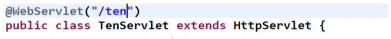
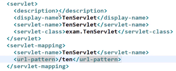

> 부스트코스 - 웹 프로그래밍(풀스택)강의를 학습, 정리한 내용입니다.(https://www.boostcourse.org/web316/joinLectures/12943)

# Servlet

- [Servlet](#servlet)
- [1) Servlet 이란?](#1-servlet-이란)
  - [**핵심 개념**](#핵심-개념)
  - [**자바 웹 어플리케이션(Java Web Application)**](#자바-웹-어플리케이션java-web-application)
  - [**자바 웹 어플리케이션의 폴더 구조**](#자바-웹-어플리케이션의-폴더-구조)
  - [**자바 웹 어플리케이션의 폴더 구조**](#자바-웹-어플리케이션의-폴더-구조-1)
    - [**서블릿이란?**](#서블릿이란)
  - [**생각해보기**](#생각해보기)
    - [답](#답)
- [2) Servlet 작성 방법](#2-servlet-작성-방법)
  - [**핵심 개념**](#핵심-개념-1)
  - [**버전에 따른 Servlet 작성 방법**](#버전에-따른-servlet-작성-방법)
    - [**1. Servlet 3.0 spec 이상에서 사용하는 방법**](#1-servlet-30-spec-이상에서-사용하는-방법)
    - [**2. Servlet 3.0 spec미만에서 사용하는 방법**](#2-servlet-30-spec미만에서-사용하는-방법)
  - [**실습코드**](#실습코드)
  - [**실습코드**](#실습코드-1)
  - [**생각해보기**](#생각해보기-1)
    - [답](#답-1)
  - [url tttt로 요청을 하게되면 url mapping이 찾아내고 여기에서 찾지 못하면 404라는 오류페이지가 보여진다. 찾아내면 servlet-name을 찾는다. <servlet>태그 안에서 똑같은 이름의 servlet-name이 있는지 찾아 실제패키지인 exam안의 TenServlet을 실행시킨다.](#url-tttt로-요청을-하게되면-url-mapping이-찾아내고-여기에서-찾지-못하면-404라는-오류페이지가-보여진다-찾아내면-servlet-name을-찾는다-servlet태그-안에서-똑같은-이름의-servlet-name이-있는지-찾아-실제패키지인-exam안의-tenservlet을-실행시킨다)

<small><i><a href='http://ecotrust-canada.github.io/markdown-toc/'>Table of contents generated with markdown-toc</a></i></small>


# 1) Servlet 이란?
웹 어플리케이션은 정적인 콘텐츠와 동적인 콘텐츠로 나누어 볼 수 있다.

프로그램을 수행해서 페이지를 동적으로 만들어 주는 서블릿
## **핵심 개념**

- 자바 웹 어플리케이션
- 서블릿

## **자바 웹 어플리케이션(Java Web Application)**

WAS에 설치(deploy)되어 동작하는 어플리케이션.

자바 웹 어플리케이션에는 HTML, CSS, 이미지, 자바로 작성된 클래스(Servlet도 포함됨, package, 인터페이스 등), 각종 설정 파일 등이 포함.

## **자바 웹 어플리케이션의 폴더 구조**


## **자바 웹 어플리케이션의 폴더 구조**

### **서블릿이란?**

자바 웹 어플리케이션의 구성요소 중 동적인 처리를 하는 프로그램의 역할.

서블릿을 정의해보면 서블릿(servlet)은 WAS에 동작하는 JAVA 클래스.

서블릿은 HttpServlet 클래스를 상속받아야 .

서블릿과 JSP로부터 최상의 결과를 얻으려면, 웹 페이지를 개발할 때 이 두 가지(JSP, 서블릿)를 조화롭게 사용해야.

예를 들어, 웹 페이지를 구성하는 화면(HTML)은 JSP로 표현하고, 복잡한 프로그래밍은 서블릿으로 구현.

---

## **생각해보기**

1. 동적인 페이지가 필요한 경우는 어떤 것일까요?
### 답
단순한 데이터를 보여주는 페이지가 아닌 상황 ,시간, 날짜, 요청 등에 의해 달라지는 페이지가 필요할 때.


# 2) Servlet 작성 방법

현재 프로젝트에서 웹을 개발할 때 서블릿을 직접 써서 개발하지는 않는.

조금 더 편하게 사용할 수 있게 도와주는 다양한 프레임워크를 사용해서 개발하는 경우가 더 많다.

하지만, 그 프레임워크들도 서블릿이 없이는 동작할 수 없기 때문에 서블릿의 기본적인 작성법이나, 서블릿의라이프 사이클을 이해하고 있어야 웹의 동작을 제대로 이해할 수 있다.

---

**학습 목표**

1. 서블릿을 작성할 수 있습니다.
2. 서블릿 버전에 따른 web.xml을 적절하게 작성할 수 있습니다.

---

## **핵심 개념**

- HttpServlet
- web.xml


## **버전에 따른 Servlet 작성 방법**

### **1. Servlet 3.0 spec 이상에서 사용하는 방법**

- web.xml 파일을 사용하지 않는다.
- 자바 어노테이션(annotation)을 사용.
- 앞에서 실습했던 first web에서 사용.

    )

### **2. Servlet 3.0 spec미만에서 사용하는 방법**

- servlet을 등록할 때 web.xml 파일에 등록합니다.

    

## **실습코드**

TenServlet.java

```java
package examples;

import java.io.IOException;
import java.io.PrintWriter;

import javax.servlet.ServletException;
import javax.servlet.annotation.WebServlet;
import javax.servlet.http.HttpServlet;
import javax.servlet.http.HttpServletRequest;
import javax.servlet.http.HttpServletResponse;

/**
 * Servlet implementation class TenServlet
 */
@WebServlet("/ten")
public class TenServlet extends HttpServlet {
	private static final long serialVersionUID = 1L;

    /**
     * @see HttpServlet#HttpServlet()
     */
    public TenServlet() {
        super();
        // TODO Auto-generated constructor stub
    }

	/**
	 * @see HttpServlet#doGet(HttpServletRequest request, HttpServletResponse response)
	 */
	protected void doGet(HttpServletRequest request, HttpServletResponse response) throws ServletException, IOException {
		response.setContentType("text/html;charset=utf-8");
		PrintWriter out = response.getWriter();
		out.print("<h1>1부터 10까지 출력합니다.<h1>");
		for(int i = 1; i<=10; i++) {
			out.print(i+"<br>");
		}
		out.close();
	}

}

```


## **실습코드**

web.xml

```xml
<?xml version="1.0" encoding="UTF-8"?>
<?xml version="1.0" encoding="UTF-8"?>
<web-app xmlns:xsi="http://www.w3.org/2001/XMLSchema-instance" 
xmlns="http://java.sun.com/xml/ns/javaee" 
xsi:schemaLocation="http://java.sun.com/xml/ns/javaee http://java.sun.com/xml/ns/javaee/web-app_2_5.xsd" 
version="2.5">
    <display-name>exam25</display-name>
    <welcome-file-list>
        <welcome-file>index.html</welcome-file>
        <welcome-file>index.htm</welcome-file>
        <welcome-file>index.jsp</welcome-file>
        <welcome-file>default.html</welcome-file>
        <welcome-file>default.htm</welcome-file>
        <welcome-file>default.jsp</welcome-file>
    </welcome-file-list>
    <servlet>
        <description></description>
        <display-name>TenServlet</display-name>
        <servlet-name>TenServlet</servlet-name>
        <servlet-class>exam.TenServlet</servlet-class>
    </servlet>
    <servlet-mapping>
        <servlet-name>TenServlet</servlet-name>
        <url-pattern>/ttt</url-pattern>
    </servlet-mapping>
</web-app>
```

---

## **생각해보기**
1. HelloServlet 클래스 파일을 작성할 때 HttpServlet을 상속하지 않았다면 어떻게 동작할까요?

### 답
서블릿은 버전에 따라서 생성하는 방법은 같지만 등록하는 방법은 조금 다르다.
```xml
<servlet>
    <description></description>
    <display-name>TenServlet</display-name>
    <servlet-name>TenServlet</servlet-name>
    <servlet-class>exam.TenServlet</servlet-class>
  </servlet>
  <servlet-mapping>
    <servlet-name>TenServlet</servlet-name>
    <url-pattern>/tttt</url-pattern>
  </servlet-mapping>
```
버전 2.5는 3.1과 다르게 어노테이션이 없고 web.xml에 추가된 코드가 있다.

서블릿은 요청이 들어왔을 때 반드시 서블릿 이름으로 요청하지는 않는다

url tttt로 요청을 하게되면 url mapping이 찾아내고 여기에서 찾지 못하면 404라는 오류페이지가 보여진다. 찾아내면 servlet-name을 찾는다. <servlet>태그 안에서 똑같은 이름의 servlet-name이 있는지 찾아 실제패키지인 exam안의 TenServlet을 실행시킨다.
---


