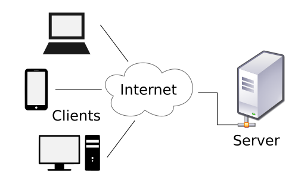
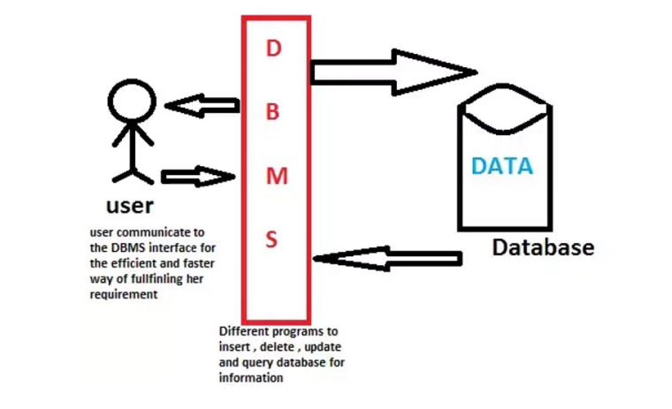
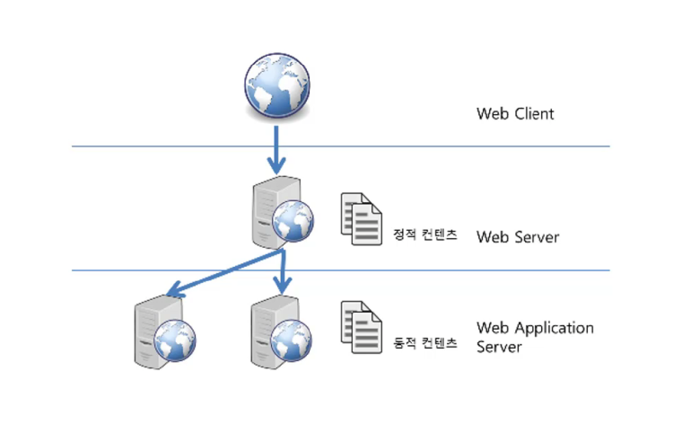

> 부스트코스 - 웹 프로그래밍(풀스택)강의를 학습, 정리한 내용입니다.(https://www.boostcourse.org/web316/joinLectures/12943)

- [WAS](#was)
  - [핵심 개념](#핵심-개념)
  - [클라이언트/서버 구조](#클라이언트서버-구조)
  - [DBMS (DataBase Management System)](#dbms-database-management-system)
  - [미들웨어 (MiddleWare)](#미들웨어-middleware)
  - [WAS (Web Application Server)](#was-web-application-server)
  - [웹 서버 vs WAS](#웹-서버-vs-was)
  - [생각해보기](#생각해보기)

<small><i><a href='http://ecotrust-canada.github.io/markdown-toc/'>Table of contents generated with markdown-toc</a></i></small>

# WAS 
WAS는 무엇이고, 왜 필요한지 그리고, 어떤 종류의 WAS가 있는지, 웹서버와의 차이점은 무엇인지
## 핵심 개념
- WAS (Web Application Server)
- Apache Tomcat
## 클라이언트/서버 구조
클라이언트(Client)는 서비스(Service)를 제공하는 서버(Server)에게 정보를 요청하여 응답 받은 결과를 사용

## DBMS (DataBase Management System)

다수의 사용자가 데이터베이스 내의 데이터에 접근할 수 있도록 해주는 소프트웨어

DBMS (DataBase Management System)

## 미들웨어 (MiddleWare)
클라이언트 쪽에 비즈니스 로직이 많을 경우, 클라이언트 관리(배포 등)로 인해 비용이 많이 발생하는 문제가 있다.

비즈니스 로직을 클라이언트와 DBMS사이의 미들웨어 서버에서 동작하도록 함으로써 클라이언트는 입력과 출력만 담당하도록 한다.

**미들웨어(MiddleWare)**

## WAS (Web Application Server)

WAS는 일종의 미들웨어로 웹 클라이언트(보통 웹 브라우저)의 요청 중 웹 애플리케이션이 동작하도록 지원하는 목적

WAS (Web Application Server)

## 웹 서버 vs WAS

- WAS도 보통 자체적으로 웹 서버 기능을 내장하고 있다.
- 현재는 WAS가 가지고 있는 웹 서버도 정적인 콘텐츠를 처리하는 데 있어서 성능상 큰 차이가 없다.
- 규모가 커질수록 웹 서버와 WAS를 분리
- 자원 이용의 효율성 및 장애 극복, 배포 및 유지보수의 편의성을 위해 웹서버와 WAS를 대체로 분리

---

## 생각해보기
톰켓 버전별 차이점

* 톰캣은 버전별로 서블릿, JSP, EL, WebSocket, JASIC의 사양과의 매핑이 다르고 지원되는 java버전 또한 각기 다르니 자신이 사용하려는 기술의 버전과 일치하는 톰캣 버전을 사용해야한다.

> 참고자료 [http://tomcat.apache.org/whichversion.html](http://tomcat.apache.org/whichversion.html)