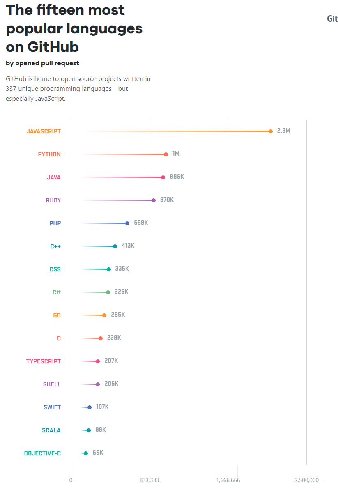
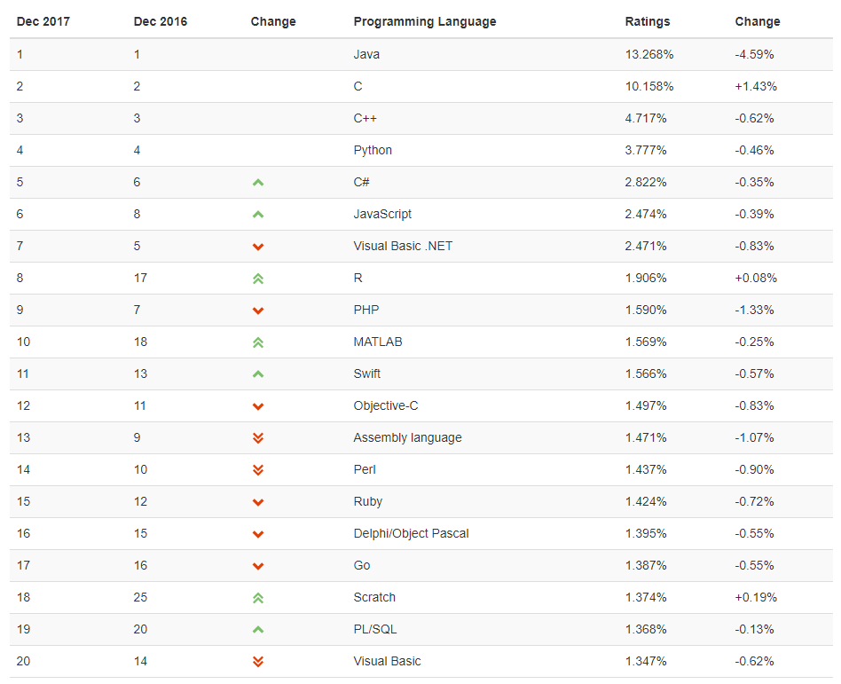

> 부스트코스 - 웹 프로그래밍(풀스택)강의를 학습, 정리한 내용입니다.(https://www.boostcourse.org/web316/joinLectures/12943)

# programming languages

- [programming languages](#programming-languages)
- [프로그래밍 언어](#프로그래밍-언어)
  - [**저급 언어**](#저급-언어)
    - [어셈블리어](#어셈블리어)
  - [**고급 언어**](#고급-언어)
    - [고급 언어의 종류](#고급-언어의-종류)
    - [**웹 프로그래밍에서 인기가 많은 언어**](#웹-프로그래밍에서-인기가-많은-언어)
    - [**웹 관련 인기 언어**](#웹-관련-인기-언어)
- [**생각해보기**](#생각해보기)
    - [내가 내린 답](#내가-내린-답)
- [**참고 자료**](#참고-자료)

<small><i><a href='http://ecotrust-canada.github.io/markdown-toc/'>Table of contents generated with markdown-toc</a></i></small>

# 프로그래밍 언어
프로그램을 만들기 위한 프로그래밍 언어의 종류는 굉장히 다양

10년을 주기로 보통 40~50개의 프로그래밍 언어가 탄생

수 많은 프로그래밍 언어 중에서 어떤 언어를 선택하는 것이 좋을까
## **저급 언어**
* 기계 중심의 언어
  * 기계가 직접 알아들을 수 있는 말로 '프로그램 코드를 작성한다'
* 컴퓨터는 전기로 동작
  * 전기신호인 켜졌다(on)와 꺼졌다(off) 2가지 상태 값으로 동작한다
  * 보통 숫자로 표현하면 켜졌다는 1, 꺼졌다는 0을 의미. (2진수)
  * 2진수로 이뤄진 값으로 작성하는 프로그래밍 언어 : **기계어(Machine Language)**
* 유지보수 어렵다.

### 어셈블리어
숫자로만 된 프로그래밍 언어는 사용이 굉장히 어려웠다.

그래서, 이 숫자로 된 문장과 1:1로 대응하는 기호를 만들고, 그 기호로 프로그래밍을 하게 되었다.

단 기호로 작성된 프로그램은 기계가 바로 알아들을 수 없기 때문에 기호로 작성된 문장들을 원래의 숫자로 바꿔야 하는 과정이  필요

* 이러한 과정에서 사용되는 도구: 컴파일러(Compiler)
* 이러한 기호로 작성된 언어: **어셈블리어(Assembly Language)**

현재는 아주 특수한 경우를 제외하고는 기계어와 어셈블리어로 프로그램을 개발하는 경우는 거의 없다.

그만큼 프로그래밍이 어렵고 유지보수가 어렵기 때문

## **고급 언어**
* 사람 중심의 언어
  * 사람이 좀 더 이해하기 쉬운 문법으로 프로그래밍 가능
이런 일이 가능하기 위해선 작성된 소스코드를 번역하는 과정이 필요(컴파일러로 컴파일)

컴퓨터 성능이 좋아지고, 컴파일러와 관련된 기술이 발전하면서 사람 중심의 언어로 프로그래밍할 수 있다고 생각하면 된다.

### 고급 언어의 종류
- FORTRAN : 최초의 고급언어 중의 하나, 과학 계산용으로 주로 사용. 현재 공대에서도 많이 사용.
- COBOL : FORTRAN과 더불어 역사가 오래된 언어. 일반 업무에서 사용할 목적으로 만들어졌으며, 현재도 은행 등에서 사용.
- PROLOG : 논리형 프로그래밍 언어, 논리식을 토대로 오브젝트와 오브젝트 간의 관계에 관한 문제를 해결하기 위해 사용.
- C : 1972년 미국 벨 연구소의 데니스 리치에 의해 개발된 고급 언어, 시스템 프로그래밍에 가장 적합한 평가를 받는 언어.
- Erlang :스웨덴의 에릭슨에서 개발한 함수형 병행성 프로그래밍 언어, 통신 인프라를 위한 언어.
- Lisp : LISt Processsor의 약자로써 대표적인 함수형 언어. 프로그래밍 언어의 역사를 말할 때, 현대의 컴퓨터를 위해 등장한 고급 언어 중 가장 오래된 것이 포트란, 두 번째로 오래된 것이 바로 이 리스프.
- Swift : 2014년 WWDC(Apple WorldWide Developers Conference)에서 공개한 프로그래밍 언어. 최근에 만들어진 언어로 현대 프로그래밍 언어의 발전을 대다수 계승한 모던 프로그래밍 언어.
- Kotlin : IntelliJ IDEA의 개발사 JetBrains에서 2011년에 개발한 프로그래밍 언어. JVM기반의 언어이며 Java와의 상호 운영이 100% 지원된다. Swift와 마찬가지로 현대 프로그래밍 언어의 발전을 대다수 계승한 모던 프로그래밍 언어.
- Clojure : 클로저(Clojure)는 리치 히키(Rich Hickey)가 만든 리스프 프로그래밍 언어의 방언으로서, 범용 함수형 언어.
- Python : 프로그래밍 입문자가 읽기 쉽고 적은 코드를 사용하여 프로그램을 개발할 수 있다. 많은 사람에게 추천되는 언어, 데이터 과학에서도 자주 사용되며 웹사이트 개발에서도 많이 사용되고 있다. 최근 python은 ML (machine learning)에서도 많이 사용된다.
- JAVA : 1995년 썬 마이크로 시스템즈에서 개발한 객체지향 프로그래밍 언어. 거의 매년 세계에서 가장 많이 사용되는 인기 1등을 차지하고 있다.

### **웹 프로그래밍에서 인기가 많은 언어**
프로그래밍 언어 중에서 가장 인기 있는 언어는 ?

사람마다 다른 관점으로 언어를 바라보기 때문에 순위를 매기기 쉽지 않다.

기업이나 언론의 경우 인기 있는 프로그래밍 언어를 알기 위해서 github, stackoverflow와 같은 사이트에서 언급되는 횟수를 활용하기도

**Github에서 가장 인기 있는 언어 15개**

>출처 https://octoverse.github.com/

이외에도 티오베([https://www.tiobe.com](https://www.tiobe.com/))의 자료를 많은 개발자가 공신력이 있다고 생각하고 있다.

티오베는 소프트웨어 품질 관련 서비스를 제공하고 있는 기업으로써 위키피디아, 아마존, 유튜브, 구글 검색창의 입력되는 정보를 이용하여 순위를 정하게 된다.

**티오베의 순위**

티오베의 순위를 보면 2016, 2017년도 1등은 Java언어가 차지

단, 다른 언어들의 인기가 높아지면서 비율이 떨어진 것을 알 수 있다.

2006년부터 웹과 관련된 언어들이 인기를 얻기 시작하였고, 2012년부터는 모바일 앱을 만들기 위한 언어가 인기를 얻게 되었다.

그리고 2016년부터는 데이터 과학과 관련된 언어들이 인기를 얻고 있다.

### **웹 관련 인기 언어**
- Python : 프로그래밍 입문자가 읽기 쉽고 적은 코드를 사용하여 프로그램을 개발할 수 있다. 많은 사람에게 추천되는 언어, 데이터 과학에서도 자주 사용되며 웹사이트 개발에서도 많이 사용되고 있다.
- PHP : 웹의 80% 이상이 PHP로 만들어졌다고 말한다. 그만큼 PHP는 웹 개발에서 많이 사용된다.
- JavaScript : 자바 스크립트는 처음 시작이 브라우저에서 동작하는 언어였다. 현재는 서버에서도 작성하는 프로그램으로 점차 영역을 넓혀가고 있다. 프론트 개발자라면 반드시 알아야 할 언어. 자바스크립트 커뮤니티도 점점 더 거대해지고 있다.
- JAVA : 엔터프라이즈 소프트웨어 환경에 잘 맞는 언어. 큰 규모의 소프트웨어 개발에 자바언어가 많이 사용되고 있다. JAVA언어를 지원하는 수많은 커뮤니티에 위해서, 지속적으로 발전되어 훌륭한 구조와 설계 기법들이 잘 갖춰져 있다.
- Ruby : 빠른 개발에 널리 사용되며, 단순함과 세련된 웹 어플리케이션을 만들 수 있기 때문에 인기 있는 언어 중의 하나.

# **생각해보기**
1. 프론트 엔드부터 서버 개발까지 한 가지 프로그래밍 언어를 사용하여 개발한다면 어떤 언어를 사용하는 것이 좋을까?
2. 다양한 라이브러리, 쉬운 개발, 읽기 쉽고 적은 코드를 장점으로 한다면 어떤 언어를 사용하는 것이 좋을까?
3. 프로그래밍 언어에게 좋은 커뮤니티가 있다는 것은 어떤 장점을 가질까?

### 내가 내린 답

1. java or python

2. javascript

3. 접근성이 뛰어나고 발전 가능성이 크다.

모든 언어는 쓰는 사람이 있어야 의미가 있다. 언어에게 사람은 생명력이고 커뮤니티는 생명력을 뿜어내는 심장, 중추혈관. 좋은 자료가 많아 정보를 찾기 쉽다. 질문을 하거나 신 기술을 공유하거나 코드를 응용하거나 하는 활발한 생산성을 갖추게 된다.

# **참고 자료**
> [**[참고링크] GitHub Octoverse 2017**
https://octoverse.github.com](https://octoverse.github.com/)

> **[[참고링크] TIOBE Index | TIOBE - The Software Quality Company**
https://www.tiobe.com](https://www.tiobe.com/tiobe-index/)

> [**[참고링크] 위키피디아 프로그래밍 언어**
https://ko.wikipedia.org](https://ko.wikipedia.org/wiki/%ED%94%84%EB%A1%9C%EA%B7%B8%EB%9E%98%EB%B0%8D_%EC%96%B8%EC%96%B4)

> **[[참고링크] 프로그램 언어의 종류**
https://opentutorials.org](https://opentutorials.org/course/2471/13907)