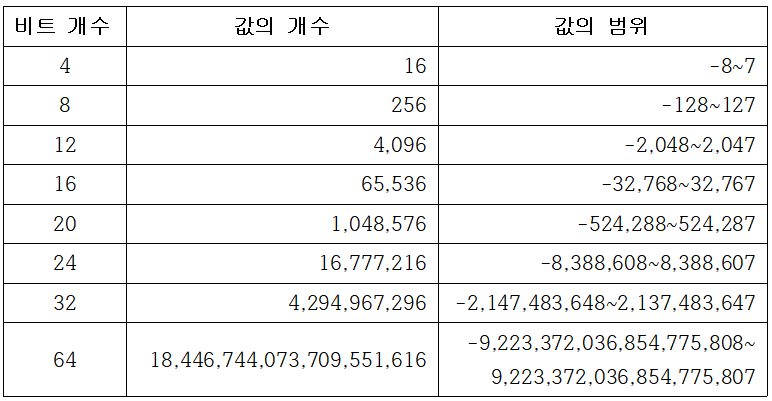

# The secret life of programming 
 **Chapter 1. Language system inside the computer (2)**
- What language does the computer use
***
***
## **5. 정수를 비트로 표현하는 방법**
    비트를 사용해 수를 표현하는 방법
* **5-1. 양의 정수 표현**
    * 10진수과 2진수의 차이 : 밑이 10, 2인 지수 체계

        예를 들어 5028을 표현하면

        * 10진수
            $$5\times10^{3}+0\times10^{2}+2\times10^{1}+8\times10^{0}$$

        * 2진수 -   13비트

            $$1\times2^{12}+0\times2^{11}+0\times2^{10}+1\times2^{9}+1\times2^{8}+1\times2^{7}+0\times2^{6}+1\times2^{5}+0\times2^{4}+0\times2^{3}+1\times2^{2}+0\times2^{1}+0\times2^{0}$$
       

    * LSB, MSB
    * 리딩제도

* **5-2. 2진수 덧셈**

    

  * 오버플로 - 비트의 개수로 표현할 수 있는 범위를 벗어나는 경우
  * 언더플로 - MSB 위쪽에서 1을 빌려오는 경우

* **5-3. 음수 표현**
  1. 부호와 크기 표현법 

      * 한 비트를 부호에 사용하고 나머지 비트를 수의 크기에 사용하는 방법
      * 비용낭비와 XOR과 AND 덧셈 사용 불가

  2. 1의 보수 표현법

      * 음수를 표현하는 또 다른 방법으로 양수의 모든 비트를 뒤집는 방법
      * 순환 올림

    순환올림을 처리하기 위한 추가적인 하드웨어가 필요하기 때문에 두 표현법 모두 사용 하지 않는다. 

  3. 2의 보수 표현법

        * 부호가 있는 정수를 표현할 때 널리 쓰인다
        * 비트를 뒤집고 1을 추가하여 음수를 얻는 방법

        2의 보수로 표현할 수 있는 값의 범위
        
        

***
## **6. 실수를 표현하는 방법**
    10진 소수점과 2진 소수점

* **6-1. 고정소수점 표현법**
    * 2진 소수점의 위치를 임의로 고정
    * DSP와 같은 일부 장치만 사용

* **6-2. 부동소수점 표현법**
    * 과학적 표기법
    * 수를 해석하는 새로운 방법을 도입해 블라크 상수부터 아보가드로 수에 이르는 범위의 값을 2진수로 표현한다는 문제를 해결    
    * 10진 소수점 왼쪽이 한 자리뿐인 소수에 10을 몇 번 거듭제곱한 값을 곱하는 방식

        예시) $$0.0012 = 1.2\times 10^{-3}$$
    * 소수점의 위치가 지수가 무엇인가에 따라 변화해서 부동소수점 표현법이라 한다.
    * 지수와 가수를 분리해 0을 모두 저장하지 않고도 큰 실수나 작은 실수 를 표현가능

* **6-3. IEEE 부동소수점 수 표준**
    
    부동소수점 수 시스템은 컴퓨터에서 계산을 수행할 때 실수를 표현하는 표준 방법
    * IEEE754

        낭비되는 비트 조합을 최소화하고 반올림을 쉽게 하기 위한 여러가지 기능을 정의
        1. 기본 정밀도 부동 소수점 수
        2. 2배 정밀도 부동소수점 수
        * 부호비트 - 편향된 지숫값 사용

    정밀도 높이는 트릭
        1. 정규화
        2. 디지털 이큅먼트 (DEC)

***
## **7. 2진 코드화한 10진수 시스템**

    * BCD는 4비트를 사용해 10진 숫자 하나를 표현
    * 디스플레이나 가속도 센서 등에서 사용

***
## **8. 2진수를 다루는 쉬운 방법**
    2진수를 더 쉽게 표현할 수 있는 방법

* **8-1. 8진 표현법**
     
    * 2진수 비트들을 3개씩 그룹화

* **8-2. 16진 표현법**

    * 10~15를 abcdef(ABCDEF)로 표현

    2진수와 16진수 변환표

    

* **8-3. 프로그래밍 언어의 진법 표기법**

    * 0으로 시작하는 숫자는 8진 숫자
    * 1 부터 9 사이의 숫자로 시작하는 숫자는 10진수
    * 0x가 앞에 붙은 숫자는 16진수

***
## **9. 비트그룹의 이름**

   * 비트의 묶음을 부르는 이름
     - nibble = 4 bit
     - byte = 8 bit
     - half word = 16 bit
     - long word = 32bit
     - double word = 64bit

* 워드(word) : 각 컴퓨터가 설계상 자연스럽게 사용할 수 있는 비트 묶음의 크기 (빠르게 처리할 수 있는 가장 큰 덩어리)
    
    kilobit나 kilobyte에서 kilo = 1024, 2의10승
    megabyte의 mega는 2의20승
    gigabyte의 giga는 2의30승
    terabyte의 tera는 2의40승

    * IEC 표준 접수사
        - 키비kibi(KiB) = 2의10승 
        - 메비mebi(MiB) = 2의20승      
        - 기비gibi(GiB) = 2의30승
        - 테비tebi(TiB) = 2의40승

***
## **10. 텍스트 표현**

* 컴퓨터에서 수를 사용해 문자나 키보드에 있는 다른 기호등을 표현하는 방법

* 아스키코드(ASCII) : 정보교환을 위한 미국 표준 코드의 준말로 키보드에 있는 모든 기호에 대해 7비트 수 값을 할당

* 다른 표준의 진화 - ISO-646, ISO-8859, KS C 5601(한국), 유니코드 등등

* **유니코드** : 21비트로 모든 문자를 다 표현하는 표준 문자 표현 코드

* 유니코드변환 형식 8비트 (**UTF-8**)

* 하위 호환성과 효율성 때문에 가장 널리 쓰이는 인코딩 방법
* 문자를 8비트 덩어리의 시퀀스로 인코딩

***
## **11. 문자를 사용한 수 표현**

        UTF-8은 문자를 표현하는 비트들로부터 나온 숫자들을 표현하는 숫자들을 표현하기 위해 숫자들을 사용
        문자를 사용해 수를 표현가능

* **11-1. 출력 가능하게 변경한 인코딩**

    * 쿼티드 프린터블 인코딩, QP인코딩
    * 8비트 데이터를 7비트 데이터만 지원하는 통신 경로를 통해 송수신하기 위한 인코딩 방법

* **11-2. 베이스64 인코딩**

    * 3바이트 데이터를 4문자로 표현
    * 3바이트 데이터의 24비트를 네 가지 6비트 덩어리로 나누고, 각 덩어리의 6비트값에 출력 가능한 문자를 할당해 표현

* **11-3. URL 인코딩**

    * 퍼센트 인코딩
    * 웹페이지의 인코딩 방식
    * 특별한 의미를 지니는 문자 : 리터럴
    * %20(띄어쓰기)%2F(/)와 같은 리터럴 사용 

 ***   
## **12. 색을 표현하는 방법**

    - picture element (pixel) : 색을 표현하는 점(blob)
    - graphics : pixel을 이용해 그림을 만드는 과정
    - RGB color model color (red, green, blue)
    - color cube 
    - additive color system <-> subtractive color system (cyon, magenta, yellow)

* **12-1. 투명도 추가**
    * cell animation > compositing algebra > 
    * 셀 애니메이션 : 투명한 셀룰로이드 필름위에 그림을 그려 배경에서 움직이는 애니메이션을  만듦
    * 합성계산법 : 각 픽셀에 알파라는 투명도 값을 추가해 새로운 색을 만들어 내는 방법

* **12-2. 색인코딩**

    텍스트를 사용해 색을 표현할 방법이 필요
    * 16진 트리플렛(hex triplet) : 웹에서 색을 표현하는 방식 #rrggbb

*** 
## **chapter 1 정리**

* 단순한 비트를 사용해 아주 큰 숫자나 문자, 색 등의 복잡한 요소를 표현할 수 있다.
* 10진수를 2진수로 표현하는 방법
* 2진수를 사용해 간단한 사칙연산을 수행하는 방법
* 음수와 분수를 표현하는 방법
* 비트를 사용해 문자를 인코딩하는 여러가지 표준

[1장 추가 조사](extra%20search%20of%20chap1)