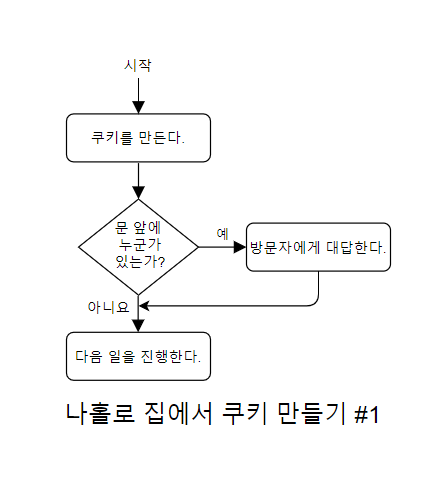
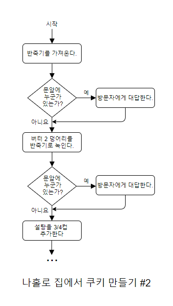
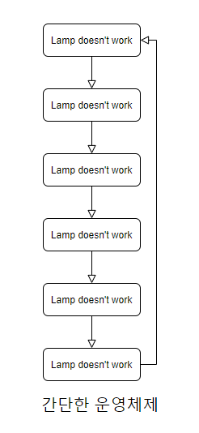
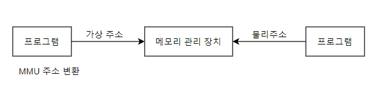

- [The secret life of programming](#the-secret-life-of-programming)
  * [**1. 기본적인 구조 요소들**](#--1--------------)
    + [**1-1. precess core**](#--1-1-precess-core--)
    + [**1-2. 마이크로프로세서와 마이크로컴퓨터**](#--1-2--------------------)
  * [**2. 프로시저, 서브루틴, 함수**](#--2-----------------)
  * [**3. 스택**](#--3-----)
    + [여러 가지 수식 표기법](#------------)
  * [**4. 인터럽트**](#--4-------)
    + [2. **인터럽트 시스템**](#2-------------)
  * [**5. 상대 주소 지정**](#--5-----------)
    + [**시분할(time slicing)** : OS가 타이머를 사용해 사용자 프로그램을 전환시켜줄 때가 됐는지 판단하는 식의 사용자 프로그램의 실행 시간을 조절하는 스케줄링 기법](#------time-slicing------os-----------------------------------------------------------------------)
  * [**6. 메모리 관리 장치**](#--6------------)
    + [**메모리 관리장치(Memory Management Unit) MMU**](#-----------memory-management-unit--mmu--)
  * [**7. 가상 메모리**](#--7---------)
    + [**가상 메모리**](#----------)
    + [**최소 최근 사용(LRU) 알고리즘**](#-----------lru--------)
  * [**8. 시스템 공간과 사용자 공간**](#--8-----------------)
    + [**시스템모드** vs **사용자모드**](#----------vs----------)
  * [**9. 메모리 계층과 성능**](#--9-------------)
    + [**캐시 (cache)** - 식품 저장고](#------cache------------)
  * [**10. 코프로세서**](#--10--------)
    + [코프로세서](#-----)
  * [**11. 메모리상의 데이터 배치**](#--11---------------)
    + [**동적 데이터** : 프로그램 실행전에는 크기를 알 수 없는 데이터](#--------------------------------------)
    + [**힙(heap)** : 동적 데이터가 쌓이는 영역(주로 정적 데이터 영영 바로 위)](#----heap---------------------------------------)
  * [**12. 프로그램 실행**](#--12----------)
    + [라이브러리](#-----)
    + [연결(링크)](#------)
    + [**런타임 라이브러리**](#-------------)
  * [**13. 메모리 전력 소비**](#--13------------)
  * [**chapter 5 정리**](#--chapter-5-----)

<small><i><a href='http://ecotrust-canada.github.io/markdown-toc/'>Table of contents generated with markdown-toc</a></i></small>


# The secret life of programming 
 **Chapter 5. Computer architecture and operation system**

- How the computer systematically manages program and memory
    - 컴퓨터 아키텍처
    - 메모리와 관련한 구조개선
    - 멀티태스킹
    - 운영체제

*** 
***
## **1. 기본적인 구조 요소들**
    * 가장 흔한 컴퓨터 구조(2)
        1. **폰 노이만 구조**
        2. **하버드 구조**
            * 두 구조의 차이 : 메모리 배열

### **1-1. precess core**
폰 노이만 구조, 하버드 구조 모두 CPU 1개
- **멀티프로세서(multiprocessor)**
  - 단일 CPU의 한계를 벗어나기 위한 방법
  - 문제 : **병렬화(parallelized)** - 여러 CPU를 활용할 수 있도록 프로그램을 병렬화하는 문제
    -  cf) 초기 워크스테이션(초기 X윈도우 시스템)  
- **전력 장벽**
  - (2000년경)반도체 회로 크기가 줄어들면서 비용도 낮아지고 성능도 개선 하지만 전력을 더 많이 소모해 단위 면적당 열 방생은 더 많아짐.
  - 열로 인해 회로를 이루는 물질의 녹는점 이상으로 온도가 올라가는 것을 방지하면서 회로가 소형화 고성능화하기 어려워짐
- **프로세스 코어**
  - CPU : process core 
- ****멀티코어**
  - 코어가 여럿 들어가는 multicore processor가 이제 일반적
  - 심지어 멀티코어가 여러개 들어간 시스템도 있다.(데이터 센터 등)

### **1-2. 마이크로프로세서와 마이크로컴퓨터**
메모리와 I/O가 프로세서 코어와 같은 패키지에 들어 있지 않으면 **마이크로프로세서**.
모든 요소를 한 칩 안에 패키징하면 **마이크로컴퓨터**
마이크로컴퓨터가 가리키는 대상을 **마이크로컨트롤러**라고도 한다.
마이크로프로세서를 중심으로 만들어진 컴퓨터 시스템을 마이크로컴퓨터라고도 한다.(의미 모호하게 쓰인다.)
- 아두이노
    - 아트멜 AVR 마이크로컴퓨터 칩을 기반으로 만들어진 하버드 구조의 컴퓨터
    - 오픈 소스를 기반으로 한 단일 보드 마이크로컨트롤러로 완성된 보드(상품)와 관련 개발 도구 및 환경
    - [아두이노 깃헙 저장소](https://github.com/arduino/Arduino)
- 마이크로컴퓨터
    - 식기세척기 등에서 쓰이는 작은 컴퓨터
- 마이크로프로세서
    - 큰 시스템에 들어가는 부품으로 주로 쓰인다.
  - **단일 칩 시스템 (SoC, System on a Chip)** : 더 복잡한 마이크로컴퓨터
  - WiFi 회로 등의 더 복잡한 장치가 들어있다
  - 핸드폰 등의 장치에 SoC내재
  - 원하는 대로 커스터마이즈가 가능한 FPGA(field programmable gate array)를 제공하는 SoC도 있다.


***
## **2. 프로시저, 서브루틴, 함수**
    코드 반복을 피하는 이유
        - 메모리 덜 차지
        - 버그 수정 시 한 번에 수정
- **함수**
    - =  프로시저 = 서브루틴 (언어에 따라 부르는 이름이 다르다)
    - 코드를 재사용하는 주요 수단
    - 자바스크립트 함수 예제) 'cube'함수
        ```javascript
        function 
        cube(x)
        {
            return (x * x * x);
        }
        ```
    - x라는 이름으로 파라미터값을 받고 세제곱을 반환
    - 자바스크립트 함수 호출 예제)
        ```javascript
        y = cube(3);
        ```
    - cube를 여러번 작성하지 않아도 여러 번 호출할 수 있다.
      - 코드의 작동원리
        - 함수를 호출하는 부분에서 함수를 실행하고 다시 원래 자리로 돌아올 방법 - 위치 : 프로그램 카운터의 값
      - 명령어 집합을 활용해 함수를 호출하는 방법
     
      주소 | 명령어 | 피연산자 | 설명
      ---|---|---|---
      100|pca||프로그램 카운터 > 누산기
      101|add|5(즉시)|함수에서 돌아올 주소(100 + 5 = 105)
      102|store|200(직접)|돌아올 주소를 메모리(200번지)에 저장
      103|load|3(즉시)|세제곱할 값(함수의 파라미터값)을 누산기에 넣기
      104|bra|300(직접)|cube함수를 호출(분기)
      105|||함수에서 돌아온 뒤에 실행될 부분
      ...|||
      200|||함수에서 돌아올 주소를 저장하기 위해 미리 확보해둔 메모리 위치
      ...|||
      300|||cube 함수 시작부분
      ...|||cube 함수의 나머지 명령어들
      310|bra|200(간접)|저장했던 주소로 돌아감(간접 주소 지정을 사용해 분기)
       
       - 반환 주소는 프로그램 시작으로부터 5개의 명령어가 지난 다음 > 200번지에 넣는다 > 함수 호출 > 함수 실행 > 200번지 값 사용해 간접 분기(105번지)
       - 상당히 많은 작업 필요 - 대부분의 기계는 이런 과정을 돕는 명령어를 제공
       -  EX) ARM 프로세서 - **'링크 레지스터를 사용해 분기'** 명령어(함수로 호출 명령어 + 다음 위치 저장 명령어)


***
## **3. 스택**
    단순하지 않은 함수 - 다른 함수 호출, 자기 자신 호출
- **재귀(recursion)**
    - ex) JPEG(Joint Photographic Experts Group)를 사용한 사진 크기 감소(이미지 압축)
    - **재귀적 분할**을 사용해 압축 : 부분 나누기, 부분 검사하기(1픽셀조각까지)
    - subdivide 함수(의사코드 : 우리말이나 영어등의 언어로 간결하게 적은 코드)
      - parameter : 정사각형의 왼쪽 아래 꼭짓점의 x 및 y 좌표와 크기
      - 왼쪽 아래, 왼쪽 위, 오른쪽 위, 오른쪽 아래 순서로 이미지를 색이 똑같은 정사각형 덩어리로 나눈다.
      - 64픽셀 > 분할완료 노드 40개 압축성공
    - **트리(tree)** : **유향 비순환 그래프(DAG) **
      - 화살표를 따라가며 읽는다
      - 화살표는 아래만 가리킨다(순환x)
      - **잎노드(leaf node)** : 화살표가 뻗어나가지 않는 부분. 트리의 맨 마지막
    - **쿼드 트리** - **공간 데이터 구조**에 속한다.
    - 재귀 함수 주의점
      - 최초 함수를 호출했던 자리로 돌아가기 위해 반환 주소를 여럿 저장할 수 있어야 한다.
      - 반환할 때 저장된 주소 중 어떤 주소를 사용할지 결정할 수 있어야 한다.
    - **깊이 우선 순회** : 아래로 가다 옆으로
    - **너비 우선 순회** : 옆으로 가다 아래로
- **스택** : 아래부터 쌓고(push) 위에서부터 꺼낸다.(pop) **LIFO구조(last in first out)**
    - **스택 오버플로** : 스택에 물건을 푸쉬하는데 더 이상 들어갈 공간이 없는 경우
    - **스택 언더플로** : 빈 스택에서 물건ㅇ르 가져오려고 하는 경우
    - 모든 함수는 자신이 전달받은 반환 주소를 나중에 사용하기 위해 스택에 넣을 수 있다.
    - 대부분의 컴퓨터 하드웨어는 스택을 지원 - **한계 레지스터(limit register)**
    - 단지 반환 주소만 저장하는 장소x
- **스택프레임** : 함수가 호출될 때마다 스택에 저장되는 데이터의 모음
    - 프로그램 속도 개선을 위해 지역변수를 지정해 여러번 사용.
    - 지역 변수값을 덮어쓰면 안되고, 스택에 저장한다.(각각의 함수 호출이 서로 독립적)
    - 각 함수 호출이 반환 주소와 지역 변수를 포함하는 새로운 스택프레임을 만든다
- 스택 기반 언어
    - forth 포스
    - PostScript 포스트 스크립트
    - 몇몇 언어와 옛날 HP 계산기 몇 가지
    - 한국어, 일본어
    - 요다의 언어 습관

### 여러 가지 수식 표기법

1. 중위 표기법 
    - 연산자를 피연산자 사이에
    - 괄호사용해 계산 순서 지정
    ex) (1 + 2) X (3 + 4)

2. 전위 표기법
    : 폴란드 표기법
    - 연산자를 피연산자보다 앞에
    - 괄호 필요 x
    ex) X + 1 2 + 3 4

3. 역 폴란드 표기법(RPN)
    - 연산자를 피연산자 뒤에 
    ex) 12+ 34 + X

* 스택을 사용하면 RPN을 쉽게 구현 - 피연산자는 스택에 푸쉬된다. 연산자는 피연산자를 스택에서 가져와 계산하고 결과를 스택에 넣는다.
    - HP RPN 계산기 
       ex)  1 ENTER 2 + 3 ENTER 4 + X
    - 포스트스크립트 언어
       ex)  1 2 add 3 4 add mul


***
## **4. 인터럽트**
    중요한 일을 수행할 때 더 중요한 일을 수행해야 한다면 컴퓨터는 어떻게 처리할까?
* 상황 설정
  * 홀로 집에서 쿠키를 만들 때 중요한 소포가 왔다. (**순서도flowchart**로 표현)

  

  * 쿠키를 만들기 위해 45분씩 배달원이 기다려주진 않는다. 다른 방법을 사용해야한다.

* 다른 방법 사용

  

  1. **폴링(polling)**

      

      - 소포를 못 받을 가능성은 적어지지만 문 앞에 누가 왔는지 검사하는데 너무 많은 시간이 걸린다.
      - 쿠키만들기 작업을 더 작은 하위작업들로 나누고 각 하위 작업 사이에 문을 검사하는 과정을 추가할 수 있다. 이렇게 하면 배달을 받을 확률은 높아지지만 문을 검사하는데 너무 많은 시간을 소모한다.
      - 실행 중인 프로그램을 잠깐 중단시켜서 외부의 요소에 대응하는 방법이 필요하다.
        - 실행장치에 새로운 하드웨어 기능을 추가한다.
  
 ### 2. **인터럽트 시스템**
      - 인터럽트 시스템이란?
          - 요즘 쓰이는 프로세서 대부분은 인터럽트 시스템이 들어간다.
          - 인터럽트 시스템은 적절한 신호가 들어오면 CPU시스템을 잠깐 중단시킬수 있는 핀이나 전기 연결을 포함한다.
            - **핀** : 칩에 연결된 전기적 접점 
          - 통합 주변장치(온칩 I/O 장치) : 내부적으로 인터럽트 시스템에 연결되어있는 장치
      - 인터럽트 시스템의 작동방식(순서)
          1. CPU가 주의를 기울여야 하는 주변장치는 **interrupt request**을 생성한다.
          2. 프로세서는 현재 실행 중인 명령어를 끝까지 실행
          3. 프로세서는 현재 실행중인 프로그램을 잠시 중단시키고 **인터럽트 핸들러**를 실행
          4. 인터럽트 핸들러(함수) 작업 후
          5. 원래 실행 중이던 프로그램이 중단된 위치부터 다시 실행

     - 쿠키만들기 예제에서 초인종이 일종의 인터럽트 시스템
     - 인터럽트에서 고려해야할 요소
       1. 응답시간 - 인터럽트를 정해진 시간안에 끝낸다.
       2. 현재 상태 저장할 방법 필요 - 인터럽트 처리 후 다시 원래대로 돌아오기 위해
          - 인터럽트 시스템은 스택에 돌아갈 프로그램 위치를 저장
          - 인터럽트 핸들러는 자신이 덮어쓸 레지스터를 모두 저장해야 할 책임이 있다. 
          - 인터럽트 핸들러는 저장해야 하는 요소를 최소화해서 가장 빠르게 인터럽트를 서비스할 수 있다.
     - **인터럽트 벡터** : 메모리 위치를 가리키는 포인터 
       - 벡터는 일종의 '여기서 저기로 가세요'하는 화살표(물리, 수학의 벡터와 비슷)
       - 인터럽트 핸들러 주소를 저장하는 메모리 주소에 여러 인터럽트 벡터가 들어 있고
       - 각 인터럽트 벡터는 CPU 가 지원하는 각 인터럽트에 대한 핸들러 주소를 지정한다.
       - 인터럽트가 일어나면 텀퓨터는 인터럽트 벡터에 저장된 주소를 살펴보고 제어를 그 주소로 옮긴다.(즉 프로그램 카운터를 인터럽트 벡터에 저장된 값으로 설정한다.)
     - 예외 상황에 대한 인터럽트 벡터 제공
       - 많은 기계가 물리적인 주소를 벗어나는 주소를 사용하려고 시도하거나, 스택오버플로가 일어나는 등의 상황에 인터럽트 벡터를 제공한다.
       - 인터럽트 핸들러 안에서 문제를 해결함으로써 오류가 생긴 프로그램이 계속 실행될 수 있는 경우도 있다.
     - 인터럽트 켜고 끄기
       - **마스크** : 인터럽트를 중단시킬 수 있다.
       - **우선순위** : 인터럽트가 많은 기계에선 인터럽트 간 우선순위가 존재, 더 중요한 인터럽트 먼저 처리
         - 작은 우선순위의 인터럽트를 더 높은 우선순위의 인터럽트가 인터럽트할 수 있음.
       - **타이머** : 일정 시간이 지나면 인터럽트를 발생시킬 수 있는 내장 타이머도 하나 이상 대부분의 하드웨어에 내장
     - 물리적 인터럽트에 접근할 수 있는 경우(다른 일반 프로그램들은 접근할 수 없는데)
       - 운영체제가 가상 인터럽트나 소프트웨어 인터럽트 시스템을 제공하기도
         - 유닉스 - 시그널 매커니즘
         - 최근 개발된 시스템들 : 이벤트라 부른다.


***
## **5. 상대 주소 지정**
    여러 프로그램을 동시에 실행하려면 어떻게 해야 할까?
    각 프로그램을 서로 전환시켜줄 수 있는 일종의 관리자 프로그램이 필요. - 운영체제 또는 운영체제 커널
* OS : 시스템 프로그램
* OS가 관리하는 다른 모든 프로그램 : 사용자 프로그램 or 프로세스

  

### **시분할(time slicing)** : OS가 타이머를 사용해 사용자 프로그램을 전환시켜줄 때가 됐는지 판단하는 식의 사용자 프로그램의 실행 시간을 조절하는 스케줄링 기법
  * 시간을 정해진 간격으로 나누고, 정해진 시간 간격 동안 사용자 프로그램을 실행한다.
  * **상태(state) 또는 문맥(context)** : 레지스터의 상태와 프로그램이 사용 중인 메모리(스택도 포함)의 상태
    * 프로그램을 메모리로 불러들이려면 시간이 오래 걸린다.
* 프로그램을 메모리로 불러오되 각 프로그램에게 각기 다른 공간을 허용할 수 있으면 훨씬 더 빠르게 시분할 실행이 가능하다. 하나씩 차례로 메모리에 프로그램이 올라가는 작동 방식. 어떻게? 절대 주소지정? > x
  * 문제 해결(2)
    1. **인덱스 레지스터**를 추가해 해결 인덱스 레지스터를 사용하면 인덱스 레지스터의 값을 명령어에 들어있는 주소와 더해서 유효 주소를 계산
    2. **상대 주소 지정**을 사용하면 프로그램을 메모리의 원하는 위치로 자유롭게 재배치 할 수 있다.


***
## **6. 메모리 관리 장치**
    멀티태스킹이 필수인 시대에서 인덱스 레지스터와 상대 주소 지정만으론 충분하지 않다.
### **메모리 관리장치(Memory Management Unit) MMU** 
  * MMU가 들어있는 시스템은 **가상 주소**와 **물리 주소**를 구분한다.
  * 프로그램은 가상 주소를 사용해 작성되고, MMU는 가상 주소를 물리 주소로 변환해 준다.
  * MMU는 프로세서에 따라 다르다.(프로세서 메뉴얼을 참조해야 한다.)

    

* MMU(예시)와 인덱스 레지스터 차이
  1. MMU는 가상 메모리 주소를 두 부분으로 나눈다. 
  2. 주소의 하부(LSB쪽) 부분은 물리적 주소 범위와 같다.
  3. 상위 부분은 **페이지 테이블**이라는 RAM 영역을 통해 주소를 변환한다.
  4. 메모리는 256바이트 크기의 페이지로 분할
  5. 모든 내용이 페이지 경계안에 들어있어야
  6. 여러 프로그램의 가상 메모리 중 일부가 같은 물리 메모리를 함께 사용하는 공유 메모리 기능을 제공할 수도

* 현대적 프로세서의 MMU
  * 페이지 테이블 크기가 정해져 있다.
  * 전체 페이지 테이블 항목은 주 메모리에 저장되거나 주 메모리가 부족한 경우 디스크에 저장된다
  * MMU는 페이지 테이블 항목 중 일부를 필요할 때만 자신의 페이지 테이블로 읽어들인다.

* 제어비트가 추가된 페이지 테이블
  * 예시) 실행 불가 비트 - 어떤 페이지에 설정 시 CPU가 이 페이지에 있는 명령어를 실행할 수 없다. 
  * 예시) 일기 전용으로 만드는 비트 - 읽기만 가능하게
    * 보안 문제 - 실수로 자기 데이터를 실행하는 경우 방지

* 페이지 폴트 예외 - 프로그램이 물리적 메모리에 연관되지 않은 주소에 접근하면 발생
  * 스택 오버플로등의 상황에 유용하게 쓰인다
  * 이 예외가 발생하면 OS는 실행중인 프로그램을 중단시키는 대신 MMU가 추가 메모리를 할당하게 해 스택 공간을 늘리고 사용자 프로그램 실행을 지속시킨다.


***
## **7. 가상 메모리**
    OS는 프로그램들 사이의 자원 분배를 관리한다.
    메모리역시 OS가 관리하는 자원
    OS는 MMU를 사용해 가상메모리를 사용자 프로그램에게 제공
### **가상 메모리**
  * 요청받은 메모리가 사용 가능한 메모리보다 더 크면?
  * **요구불 페이징 (demand paging)**
    * OS는 현재 필요하지 않은 메모리 페이지를 더 느리지만 더 용량이 큰 대용량 저장장치인 디스크로 옮긴다.(스왑아웃)
    * 그리고 필요한 메모리 공간을 확보하고 요청받은 페이지를 다시 메모리로 불러들인다.(스왑 인)
    * 스와핑 이 일어나면 시스템 성능이 크게 저하된다.
    * 느리더라도 실행하는게 낫다.
    * 성능 저하를 막기 위한 다양한 기법 활용.
  ### **최소 최근 사용(LRU) 알고리즘** 
    * 페이지 접근을 추적해서 스왑 아웃할 페이지를 결정하는 기법
    * 최근 덜 사용한 페이지를 스왑 아웃한다.


***
## **8. 시스템 공간과 사용자 공간**
    멀티태스킹 시스템에서 사용자가 MMU의 설정을 자유롭게 건드리면 
    MMU가 프로그램을 서로 격리시키지 못해 제대로 인터럽트 기능을 활용하지 못할 것
### **시스템모드** vs **사용자모드**
  * CPU가 제공하는 위의 문제를 해결하는 추가 하드웨어로 모드를 결정하는 비트가 어떤 레지스터 안에 들어있다. 
  * I/O를 처리하는 명령어 등 일부 명령어는 **특권 명령어**라서 오직 시스템 모드에서만 실행할 수 있다. 
  * **트랩**이나 **시스템 콜**이라고 부르는 특별한 명령어를 ㅌ오해 사용자 모드에서 실행 중인 프로그램이 시스템 모드 프로그램에게 요청을 보낼 수 있다.
  * 하드웨어 예외는 오직 시스템 모드에서 처리
  * 대부분의 개발자가 만드는 프로그램은 사용자 모드에서 실행되는 프로그램
  * 장점 
    1. 사용자로부터 OS보호, 프로그램으로부터 프로그램 보호
    2. OS가 자원할당을 전적으로 제어 


***
## **9. 메모리 계층과 성능**
CPU와 메모리의 속도 차이가 꽤 크다. - 시스템 성능에 크게 영향
메모리 비유
  1) 레지스터 - 냉장고 (작지만 가깝다)
  2) 주메모리 - 가게 (더 크지만 더 멀다)
  3) 디스크 - 창고 (엄청 넓고 멀다)

### **캐시 (cache)** - 식품 저장고
  * 아주 빠른 온칩 메모리 하드웨어 가게보다 훨씬 작지만 훨씬 빠르고 프로세서와 같은 속도로 작동
  * **CPU 메모리 컨트롤러**
    * 메모리에서 연속된 열에 있는 데이터를 한꺼번에 가져온다. (대부분 연속된 메모리가 필요)
  * **캐시실패**
  * **캐시적중**
  * 캐시 계층 - cpu에서 멀수록 느려지고 커진다 L1, L2, L3 캐시
  * 디스패처 : 여러 가지 크기의 장바구니, 박스, 트럭에 내용물을 채워넣거나 내용물ㅇ르 거내는 일을 담당하는 아주 큰 논리회로
  * 성능향상을 위한 추가적인 수정
    * **프리페치(prefetch)**해서 캐시를 준비시키기 위한 분기 예층 회로
    * **순서를 벗어나는 실행**을 처리하는 회로
  * **캐시 일관성** 유지 방법
    1. **라이트 스루** 접근 방법을 활용해 메모리 위치의 데이터가 변경됐음을 알 수 있다.
      * 데이터를 캐시에 기록하는 동시에 메모리에도 기록
    2. 기타 다양한 추가 캐시 관리 하드웨어


***
## **10. 코프로세서**
프로세서 코어는 아주 복잡한 회로로 이뤄졌다.
몇 가지 연산을 코프로세서라는 더 단순한 회로에 위임해 
프로세서 코어가 일반적인 연산에 활용할 수 있는 공간을 더 확보 가능
### 코프로세서
  * 일부 코프로세서는 데이터 복사만 담당 : 직접 메모리 접근
  * 유용한 연산을 더 많이 처리


***
## **11. 메모리상의 데이터 배치**
    메모리에 명령어 뿐 아니라 데이터도 담는다
* **정적 데이터** : 메모리에 담은 데이터
  * 정적 : '프로그램을 작성할 때 얼마나 많은 메모리가 필요한지 알고 있다'는 뜻

  * 스택을 위한 메모리, 정적 데이터를 위한 메모리, 명령어를 위한 메모리등 메모리의 여러 데이터 영역을 서로 충돌하지 않게 배치할 수 있어야. 

### **동적 데이터** : 프로그램 실행전에는 크기를 알 수 없는 데이터
### **힙(heap)** : 동적 데이터가 쌓이는 영역(주로 정적 데이터 영영 바로 위)
  * 힙과 스택 충돌x 중요


***
## **12. 프로그램 실행**
  프로그래머가 함수를 사용해 코드를 재사용할 때 누군가 만들어 놓은 코드를 활용할 수 있으면 편리하다.
### 라이브러리
  * 종류
    * 문자열 처리
    * 복잡한 수학
    * mp3 인코딩 
    * 등등

프로그램 전부를 한 파일에 저장하기 보다 여러 파일로 나눠 놓는 편이 더 좋다

여러 사람이 한 프로그램의 여러 부분을 동시에 개발 가능하기 때문
### 연결(링크)
  * 링커라는 프로그램을 사용해 여러 매개 파일로 나누어진 프로그램을 하나로 연결해 실행할 수 있다.
  * **실행과 링크가 가능한 형식(ELF)** : 가장 유명한 매개 파일 형식
* 정적 링크 : 과거 라이브러리를 단지 함수가 들어 있는 파일을 프로그램의 나머지 부분과 직접 연결해 실행파일을 만드는 것.
* 동적 링크 : 공유 라이브러리에서 가져온 명령어로 함수를 사용
* 진입점 : 프로그램의 첫 번째 명령어가 위치한 주소 
  
### **런타임 라이브러리**
* 프로그램을 이루는 모든 부분이 하나로 합쳐져서 실행파일을 이룰 떄 런타임 라이브러리가 추가된다.
* 런타임 라이브러리의 명령어가 먼저 실행되고 진입점의 명령어가 실행된다.
* 메모리의 설정을 책임짐. 스택과 힙영역을 설정한다는 뜻
* 정적 데이터에 위치한 데이터의 초깃값도 설정
* 그외 다양한 기능 수행


***
## **13. 메모리 전력 소비**
    데이터를 메모리에서 이리저리 옳기려면 전력이 소비된다.
* 전력의 중요성
  * 모바일장치에서 특히 전력 소비가 중요하다. 
* 전력소비와 성능 사이의 균형이 중요하다


***
## **chapter 5 정리**
메모리를 다루는 것은 아주 복잡하고 어렵다.
간단한 프로세서라도 메모리 사용을 개선하는 일은 아주 복잡하다.
하지만 컴퓨터 성능을 위해서 꼭 알아두어야 하는 중요한 장치이다.


  
><**Quotation**> 
description

[추가조사자료정리페이지](Extra%20search)

[한 권으로 읽는 컴퓨터 구조와 프로그래밍 - 조너선 스타인하트](https://books.google.co.kr/books/about/%ED%95%9C_%EA%B6%8C%EC%9C%BC%EB%A1%9C_%EC%9D%BD%EB%8A%94_%EC%BB%B4%ED%93%A8%ED%84%B0_%EA%B5%AC%EC%A1%B0%EC%99%80.html?id=dXxgzgEACAAJ&redir_esc=y)

 