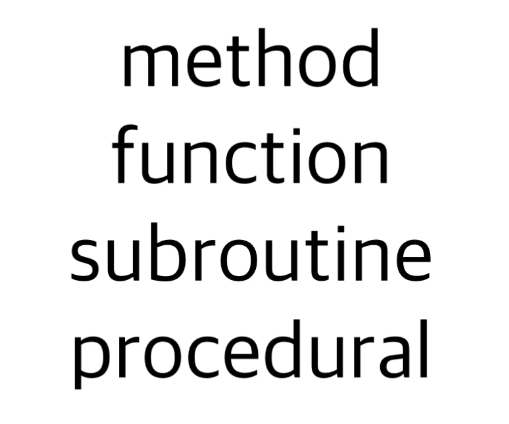
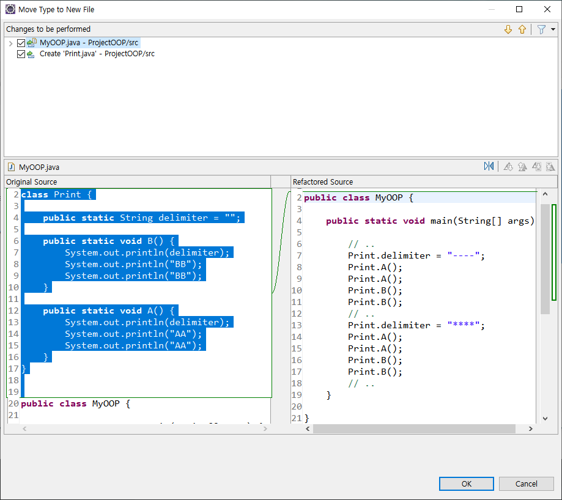
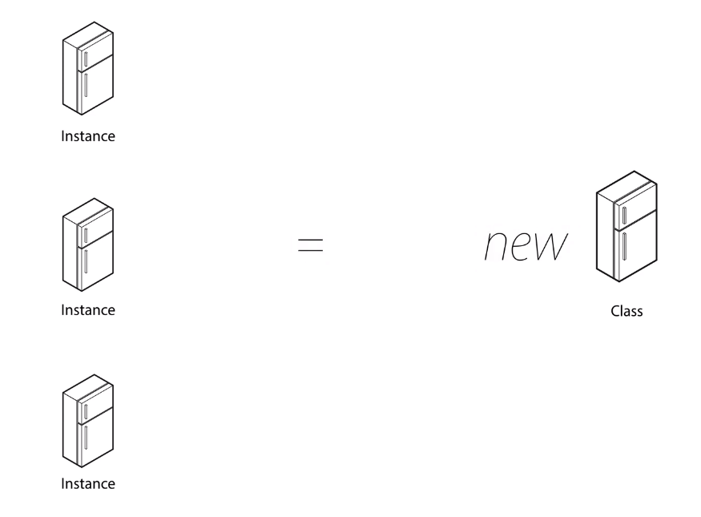
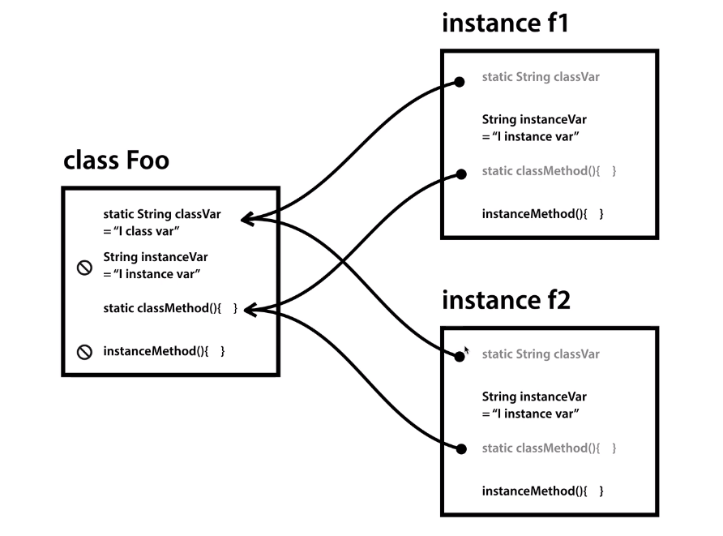

>> 생활코딩 Java - 객체 지향 프로그래밍을 학습, 정리한 내용입니다. (https://opentutorials.org/course/4074)

- 21.04.14 write on notion
- 21.06.11 notion to git

# Java OOP

- 객체 지향 프로그래밍
    - 클래스
    - 인스턴스
    - static
    - this

# 목차
* chapter 1 ~ chapter 9
    1. 소개
    2. 남의 클래스 & 남의 인스턴스
    3. 변수와 메소드
    4. 클래스-존재이유와 기본형식
    5. 클래스-형식
    6. 인스턴스
    7. 생성자와 this
    8. 활용
    9. 수업을 마치며


# 소개

## object oriented programming 
객체 지향 프로그래밍

## procedural programming 
절차 지향 프로그래밍 = 자바에선 메소드 프로그래밍

### 객체지향 프로그래밍은 클래스를 중심으로 프로그램의 구조를 만들어가는 방법론



## **객체 지향 프로그래밍**
(Object-Oriented Programming, OOP)
* 컴퓨터 프로그래밍의 패러다임 중 하나 
* 객체 지향 프로그래밍은 컴퓨터 프로그램을 명령어의 목록으로 보는 시각에서 벗어나 여러 개의 독립된 단위, 즉 "객체"들의 모임으로 파악하고자 하는 것
* 각각의 객체는 메시지를 주고받고, 데이터를 처리할 수 있다.
* 객체 지향 프로그래밍은 프로그램을 유연하고 변경이 용이하게 만들기 때문에 대규모 소프트웨어 개발에 많이 사용
* 또한 프로그래밍을 더 배우기 쉽게 하고 소프트웨어 개발과 보수를 간편하게 하며, 보다 직관적인 코드 분석을 가능하게
* 그러나 지나친 프로그램의 객체화 경향은 실제 세계의 모습을 그대로 반영하지 못한다는 비판을 받음.

> 출처: <[wikipedia](https://ko.wikipedia.org/wiki/%EA%B0%9D%EC%B2%B4_%EC%A7%80%ED%96%A5_%ED%94%84%EB%A1%9C%EA%B7%B8%EB%9E%98%EB%B0%8D)>


---
# 남의 클래스 & 남의 인스턴스

`FileWriter f1 = new FileWriter("data.txt");`

변수타입 변수명= 복제본생성 클래스명("파라미터");

`f1.메소드("파라미터");`

```java
import java.io.FileWriter;
import java.io.IOException;

public class OthersOOP {

	public static void main(String[] args) throws IOException {

		System.out.println(Math.PI);
		System.out.println(Math.floor(1.8));
		System.out.println(Math.ceil(1.8));
		//class : System, Math, FileWriter
		//instance : f1, f2
		//variable : PI, floor, ceil
		
		//data.txt파일을 작성하겠다는 정보를 담은 FileWriter 클래스 복제본 : 인스턴스 f1
		FileWriter f1 = new FileWriter("data.txt");
		f1.write("Hello");
		f1.write(" java");
		f1.close();
		
		FileWriter f2 = new FileWriter("data2.txt");
		f2.write("Hello");
		f2.write(" java2");
		f2.close();
	}

}
```

* `Math`는 클래스를 바로 사용한 것이고

* `FileWriter`는 `f1`에 복제본을 담아서 사용한 것. (`f1`은 인스턴스)

* `PI`, `floor`, `ceil`은 일회용으로 사용 (클래스에서 바로 사용)

* 긴 맥락에서 반복 사용할 경우 클래스를 복제해서 `f1`, `f2`이라는 인스턴스에 담아서 

* `f1.write` 와 같은 방식으로 반복 사용 가능하다.


# 변수와 메소드


## 메소드 정리 단계 정리

```java
public class MyOOP {

	public static void main(String[] args) {
		
		//..
		System.out.println("----");
		System.out.println("AA");
		System.out.println("AA");
		System.out.println("----");
		System.out.println("AA");
		System.out.println("AA");
		System.out.println("----");
		System.out.println("BB");
		System.out.println("BB");
		System.out.println("----");
		System.out.println("BB");
		System.out.println("BB");
		//..
		System.out.println("****");
		System.out.println("AA");
		System.out.println("AA");
		System.out.println("****");
		System.out.println("AA");
		System.out.println("AA");
		System.out.println("****");		
		System.out.println("BB");
		System.out.println("BB");
		System.out.println("****");		
		System.out.println("BB");
		System.out.println("BB");
		//..
	}

}
```

### 1. extract method

메소드를 생성한다. (이클립스기능 - 메소드 추출)

```java
public class MyOOP {

	public static void main(String[] args) {
		
		//..
		printA();
		printA();
		printB();
		printB();
		//..
		printA2();
		printA2();
		printB2();
		printB2();
		//..
	}

	public static void printB2() {
		System.out.println("****");		
		System.out.println("BB");
		System.out.println("BB");
	}

	public static void printA2() {
		System.out.println("****");
		System.out.println("AA");
		System.out.println("AA");
	}

	public static void printB() {
		System.out.println("----");
		System.out.println("BB");
		System.out.println("BB");
	}

	public static void printA() {
		System.out.println("----");
		System.out.println("AA");
		System.out.println("AA");
	}

}
```

### 2. parameter

각각의 메소드에 매개변수를 준다.

```java
public class MyOOP {

	public static void main(String[] args) {

		// ..
		printA("----");
		printA("----");
		printB("----");
		printB("----");
		// ..
		printA("****");
		printA("****");
		printB("****");
		printB("****");
		// ..
	}

	public static void printB(String delimiter) {
		System.out.println(delimiter);
		System.out.println("BB");
		System.out.println("BB");
	}

	public static void printA(String delimiter) {
		System.out.println(delimiter);
		System.out.println("AA");
		System.out.println("AA");
	}

}
```

### 3. variable

변수를 이용. 인자로 변수를 준다.

```java
public class MyOOP {

	public static void main(String[] args) {

		String delimiter = "----";
		// ..
		printA(delimiter);
		printA(delimiter);
		printB(delimiter);
		printB(delimiter);
		// ..

		delimiter = "****";
		printA(delimiter);
		printA(delimiter);
		printB(delimiter);
		printB(delimiter);
		// ..
	}

	public static void printB(String delimiter) {
		System.out.println(delimiter);
		System.out.println("BB");
		System.out.println("BB");
	}

	public static void printA(String delimiter) {
		System.out.println(delimiter);
		System.out.println("AA");
		System.out.println("AA");
	}

}
```

### 4. relocate variable

변수 위치 변경. 변수를 바깥쪽에서 정의해 중복되는 변수를 통합사용한다. (유효범위)

```java
public class MyOOP {

	public static void main(String[] args) {

		// ..
		delimiter = "----";
		printA();
		printA();
		printB();
		printB();
		// ..

		delimiter = "****";
		printA();
		printA();
		printB();
		printB();
		// ..
	}

		
	public static String delimiter = "";
	public static void printB() {
		System.out.println(delimiter);
		System.out.println("BB");
		System.out.println("BB");
	}

	public static void printA() {
		System.out.println(delimiter);
		System.out.println("AA");
		System.out.println("AA");
	}

}

```

## 출력결과

위의 코드들은 모두 출력결과가 같지만 새로운 코드를 입력하거나 삭제하거나 하는 관리 측면에서

효율성의 차이가 극도로 크다. 효율적으로 메소드 프로그래밍을 하자.

```java
----
AA
AA
----
AA
AA
----
BB
BB
----
BB
BB
****
AA
AA
****
AA
AA
****
BB
BB
****
BB
BB
```

## 정리

메소드를 이용해 코드를 효율적으로 정리하는 순서를 알아보았다. 코드가 많아질수록 복잡해질수록 관리하는 어려움은 기하급수적으로 증가하기 때문에 꼭 중복되는 코드를 없애고 리팩토링해야 됨을 잊지 말자.


# 클래스-존재이유와 기본형식

클래스를 도입해서  printA(); 를 Print.A();로, 즉 Print클래스에 소속된 A메소드로 바꿔보자.

```java
public class MyOOP {

	public static void main(String[] args) {

		// ..
		delimiter = "----";
		printA();
		printA();
		printB();
		printB();
		// ..

		delimiter = "****";
		printA();
		printA();
		printB();
		printB();
		// ..
	}

		
	public static String delimiter = "";
	public static void printB() {
		System.out.println(delimiter);
		System.out.println("BB");
		System.out.println("BB");
	}

	public static void printA() {
		System.out.println(delimiter);
		System.out.println("AA");
		System.out.println("AA");
	}

}

```

## 클래스 생성과정

Print 클래스 생성, 메소드, 변수 이동.

출력명령어 수정.

```java
class Print {
	public static String delimiter = "";
	public static void B() {
		System.out.println(delimiter);
		System.out.println("BB");
		System.out.println("BB");
	}

	public static void A() {
		System.out.println(delimiter);
		System.out.println("AA");
		System.out.println("AA");
	}
}

public class MyOOP {

	public static void main(String[] args) {

		// ..
		Print.delimiter = "----";
		Print.A();
		Print.A();
		Print.B();
		Print.B();
		// ..

		Print.delimiter = "****";
		Print.A();
		Print.A();
		Print.B();
		Print.B();
		// ..
	}

}
```

## 정리

클래스를 이용하면 소속된 메소드 변수 들이 서로 연관되어 있는 것임을 알 수 있고

클래스명. 을 쓰면 에디터가 명령어를 추천해준다.


# 클래스-형식

```java
class 클래스명 {
	변수 1 ;
	메소드1 {}
	메소드2 {}
}
```
* 포함된 메소드, 변수를 member라고 한다.

### 클래스, 메소드
java파일을 컴파일해서 실행하면 class파일의 main메소드를 실행한다.

여태 프로그램을 만들 때 우리는 java파일을 만들고 똑같은 이름의 class를 만들고 그 클래스 안에 main메소드를 만들었던 것.

하나의 파일에 2개 이상의 클래스를 만들면 실행시켰을때 각각의 클래스가 파일로써 존재하게 된다.

## 클래스 쪼개기 (파일 나누기)

파일내의 여러개의 클래스를 쪼갤 수도 있다.

```java
class Print {
	public static String delimiter = "";
	public static void B() {
		System.out.println(delimiter);
		System.out.println("BB");
		System.out.println("BB");
	}

	public static void A() {
		System.out.println(delimiter);
		System.out.println("AA");
		System.out.println("AA");
	}
}

public class MyOOP {

	public static void main(String[] args) {

		// ..
		Print.delimiter = "----";
		Print.A();
		Print.A();
		Print.B();
		Print.B();
		// ..
		Print.delimiter = "****";
		Print.A();
		Print.A();
		Print.B();
		Print.B();
		// ..
	}

}
```

### 클래스 코드 부분을 블록처리한 후 우클릭해서

### `Refactor > Move Type to New File...`




Original source와 Refactored source를 확인 할 수 있다. 

`Print.java` 파일이 생성되고 코드가 옳겨져 있는 것을 확인 할 수 있다.

```java
class Print {

	public static String delimiter = "";

	public static void B() {
		System.out.println(delimiter);
		System.out.println("BB");
		System.out.println("BB");
	}

	public static void A() {
		System.out.println(delimiter);
		System.out.println("AA");
		System.out.println("AA");
	}
}
```

```java
public class MyOOP {

	public static void main(String[] args) {

		// ..
		Print.delimiter = "----";
		Print.A();
		Print.A();
		Print.B();
		Print.B();
		// ..
		Print.delimiter = "****";
		Print.A();
		Print.A();
		Print.B();
		Print.B();
		// ..
	}

}
```

### 클래스 쪼개기 후

* 에러메세지
  * 'The type 클래스명 is already defined'
  * 위와 같은 에러 메세지가 클래스명에 뜨면 중복된 클래스가 같은 폴더나 패키지 안에 있는 것. 
  * 중복된 클래스명이 없어도 뜨면 
  * `project > clean`해준다.


# 인스턴스




## 인스턴스란?

* 클래스는 원형, 

* 인스턴스는 복제품.

## new 키워드. 
* `new`
  * 클래스 복제할 때 사용.

```java
		FileWriter f1 = new FileWriter("data.txt");
		f1.write("Hello");
		f1.write(" java");
		f1.close();	
```
* `FileWriter class`
  * 여기서 `FileWriter` 클래스는 java.io소속의 미리 등록되어있는 남이 만들어 놓은 클래스이고,

* `f1 instance`
  * `f1`이라고 우리가 이름 붙이긴 했지만 이 인스턴스도 결국 `FileWriter`의 복제품이기에 남의 클래스의 기능을 복제한 남의 인스턴스라고 할 수 있다. 
  * `f1.write`에서 `write`는 `java.io.Writer.`에 속한, `Writer`클래스에 속한 메소드로서 기능을 구현해 주고 있다.

직접 인스턴스를 만들어서 나의 인스턴스를 사용해 보자.

### 인스턴스를 쓰는 이유는?

```java
public class MyOOP {

	public static void main(String[] args) {
		Print.delimiter = "----";		
		Print.A();
		Print.A();
		Print.B();
		Print.B();	
		
		Print.delimiter = "****";
		Print.A();
		Print.A();
		Print.B();
		Print.B();
		
	}

}
```

```java
class Print {

	public static String delimiter = "";

	public static void B() {
		System.out.println(delimiter);
		System.out.println("BB");
		System.out.println("BB");
	}

	public static void A() {
		System.out.println(delimiter);
		System.out.println("AA");
		System.out.println("AA");
	}
}
```

위 코드를 보면 Print라는 하나의 클래스의 delimiter라는 상태를 여러 번 바꿔주고 있다.

```java
		Print.delimiter = "----";	
		Print.A();
		Print.delimiter = "****";
		Print.A();
		Print.delimiter = "----";	
		Print.B();
		Print.delimiter = "****";
		Print.B();
```

또 위 같은 코드를 추가로 작성해야 한다면 위 코드는 관리하기 쉽지 않은 코드가 된다.

즉 하나의 클래스만 사용하면 같은 기능에서 다양한 분류를 (구별자로 구분하는 것과 같은) 할 때 코드를 중복해서 사용해야 한다. 

***클래스의 복제품인 인스턴스를 사용하면 이러한 복잡한 코드를 심플하고 우아하게 만들 수 있다.***

## 인스턴스로 정리

다음 2개 클래스의 코드를 인스턴스를 이용해 정리해 보자.

```java
public class MyOOP {

	public static void main(String[] args) {
		Print.delimiter = "----";		
		Print.A();
		Print.A();
		Print.B();
		Print.B();	
		
		Print.delimiter = "****";
		Print.A();
		Print.A();
		Print.B();
		Print.B();
		
		Print.delimiter = "----";	
		Print.A();
		Print.delimiter = "****";
		Print.A();
		Print.delimiter = "----";	
		Print.B();
		Print.delimiter = "****";
		Print.B();
	}

}
```

```java
class Print {

	public static String delimiter = "";

	public static void B() {
		System.out.println(delimiter);
		System.out.println("BB");
		System.out.println("BB");
	}

	public static void A() {
		System.out.println(delimiter);
		System.out.println("AA");
		System.out.println("AA");
	}
}
```

---

결과값

```java
----
AA
AA
----
AA
AA
----
BB
BB
----
BB
BB
****
AA
AA
****
AA
AA
****
BB
BB
****
BB
BB
----
AA
AA
****
AA
AA
----
BB
BB
****
BB
BB
```

### 인스턴스 를 적용해 바꾼 코드

```java
public class MyOOP {

	public static void main(String[] args) {

		Print p1 = new Print();
		p1.delimiter = "****";
		p1.A();
		p1.A();
		p1.B();
		p1.B();

		Print p2 = new Print();
		p2.delimiter = "****";
		p2.A();
		p2.A();
		p2.B();
		p2.B();

//		Print.delimiter = "----";	
//		Print.A();
		p1.A();

		p2.A();
		p1.B();
		p2.B();
	}

}
```

```java
class Print {

	public String delimiter = "";

	public void B() {
		System.out.println(delimiter);
		System.out.println("BB");
		System.out.println("BB");
	}

	public void A() {
		System.out.println(delimiter);
		System.out.println("AA");
		System.out.println("AA");
	}
}
```

static은 클래스의 소속이기 때문에

인스턴스를 사용하기 위해서

클래스 멤버들에 지정된 static을 삭제.

### 결과값

```java
****
AA
AA
****
AA
AA
****
BB
BB
****
BB
BB
****
AA
AA
****
AA
AA
****
BB
BB
****
BB
BB
****
AA
AA
****
AA
AA
****
BB
BB
****
BB
BB
```

## 요약정리
인스턴스는 클래스를 하나만 적용해 기능을 다양한 구분에 의해 구현하고 있을 때 복잡한 코드를 클래스의 복제품인 인스턴스를 이용해 
우아한 코드를 짤 수 있다.


# static

static에 관련된 실험을 해보자

static이 붙어있으면 클래스 소속이고 안붙어있으면 인스턴스의 소속인지 확인

```java
class Foo{
	public static String classVar = "I class var"; // 클래스 변수
	public String instanceVar = "I instance var"; // 인스턴스 변수
	
	public static void classMethod() {
		// 클래스 메소드 안에서 클래스 변수에 접근 가능 o, 인스턴스 변수에는 접근 불가 x
		System.out.println(classVar); // OK
		System.out.println(instanceVar); // ERR 
	}
	public void instanceMethod() {
		// 인스턴스 메소드 안에서 클래스, 인스턴스 변수 모두 접근 가능 o
		System.out.println(classVar); // OK
		System.out.println(instanceVar); // OK
		//Cannot make a static reference to the non-static field instanceVar
	}
}
public class StaticApp {
	
	public static void main(String[] args) {
		//클래스를 통해서 클래스 변수에 접근 가능 o, 인스턴스 변수에 접근 불가 x
		System.out.println(Foo.classVar); // OK		
		System.out.println(Foo.instanceVar); // ERR
		//Cannot make a static reference to the non-static field Foo.instanceVar

		//인스턴스 메소드는 인스턴스 소속이기 때문에 클래스를 통해서 접근 불가 x
		Foo.classMethod(); // OK
		Foo.instanceMethod(); // ERR
		//Cannot make a static reference to the non-static method instanceMethod() from the type Foo

	}

}
```

`Foo f1 = new Foo();` // Foo 클래스의 f1 인스턴스 생성

## 인스턴스 생성시 클래스와 인스턴스 멤버들의 관계

`f1` 인스턴스를 생성하면 `instance` `f1`은 `class Foo`의 여러 멤버들을 복제해 온다.

### 1. 변수

- `classVar` 는 클래스의 소속이므로 f1에는 실제 값이 존재하지 않고 Foo라는 클래스를 가리키고 있을 뿐이다.
- `instanceVar는` `Foo에서` `f1이라는` 인스턴스가 생성될 때 `instanceVar` 라는 변수가 생성되면서 만약 클래스의 값도 세팅되어 있다면 그 값까지 복제가 된다.
- 그리고 클래스의 `instanceVar와` 인스턴스의 `instanceVar는` 서로 링크 걸려있지 않기 때문에 인스턴스의 `instanceVar` 값을 바꿔도 클래스의 `instanceVar값이` 바뀌지 않는다. 반면 `classVar는` 서로의 값에 영향을 받는다. (굉장히 무척 중요한 차이)

### 2. 메소드

- 마찬가지로 인스턴스의 `classMethod`는 클래스의 `classMethod`을 참조한 것이고, 인스턴스의`instanveMethod`는 클래스의 `classMethod`을 복제한 것으로 서로 독립된 존재이다

### 3. 2번째 인스턴스

- `instance f2`를 만들면 아래와 같은 그림처럼 서로를 참조하게 된다.
- 즉 `f2`의 `classVar`값을 바꾸면 `class`의  `classVar`값도 바뀌고 `f1`의  `classVar`값도 바뀐다



```java
		Foo f1 = new Foo();
		Foo f2 = new Foo();
		
		System.out.println(f1.classVar); // I class var
		System.out.println(f1.instanceVar); //  I instance var

		
		f1.classVar = "changed by f1"; 
		System.out.println(Foo.classVar); // changed by f1
		System.out.println(f2.classVar); // changed by f1
		
		f1.instanceVar = "changed by f1"; 
		System.out.println(f1.instanceVar); // changed by f1
		System.out.println(f2.instanceVar);	// I instance var
		System.out.println(Foo.classVar); // ERR
```

인스턴스 `f1`, `f2`를 만들어서 확인해보니 `f1`에서 `classVar`값을 바꾸면 `Foo`와 `f2`의 값도 바꼈다.

하지만 `instanceVar`를 바꾸니 `f1`의 값만 바뀌고 `f2`의 값은 바뀌지 않았고, `Foo`는 접근 불가로 에러.

* 이러한 클래스와 인스턴스의 관계를 외우려고 하지 말고 위의 그림을 머리속에 그리고 빠르고 쉽게 이해하고 실수하지 않도록 하자.


---
# 생성자와 this

```java
FileWriter f1 = new FileWriter("data.txt");
```

위의 코드는 `FilWriter`라는 남이 만든 클래스를 사용하여 `f1`인스턴스를 만든 코드인데

"data.txt" 에 처음 인스턴스를 생성할때 꼭 파일명을 작성해 줘야한다. 

이처럼 인스턴스가 생성될때 꼭 처리되어야 하는 어떠한 과정들이 있고 이 과정들이 엄청나게 많다면 이러한 과정의 중복을 생성자를 통해 해결할 수 있다.

```java
public 생성자명(타입 변수명){

}
```

생성자의 목적은 초기화 , 메소드와 형식이 비슷

```java
public class MyOOP {

	public static void main(String[] args) {

		Print p1 = new Print("----");
		p1.A();

	}

}
```

```java
----
AA
AA
```

```java
class Print {

	public String delimiter = "";
	public Print(String _delimiter) {
		delimiter = _delimiter;
	}

	public void B() {
		System.out.println(delimiter);
		System.out.println("BB");
		System.out.println("BB");
	}

	public void A() {
		System.out.println(delimiter);
		System.out.println("AA");
		System.out.println("AA");
	}
}
```

위의 맥락에서 생성자의 파라미터인 `_delimiter` 값은 `"——"` (마이너스 4개) 가 되고

`delimiter = _delimiter;` 이기 때문에 `Print` 클래스의 `delimiter` 값도 마이너스 4개가 된다

따라서 `A` 메소드를 호출하면 `——`와 `AA AA`가 호출된다. 생성자는 클래스의 이름과 똑같은 메소드를 정의하면 되고 `static`, `return datatype` 과 같은 것을 지정하지 않는다.

그런데 `_delimiter`에서 _를 빼면 클래스의 변수가 세팅되지 않는다. 이때 **`this.`**를 붙여준다.

```java
class Print {

	public String delimiter = "";
	public Print(String delimiter) {
		this.delimiter = delimiter;
	}

	public void B() {
		System.out.println(this.delimiter); // this 를 붙이는게 명시적으로 정확한 표현
		System.out.println("BB");
		System.out.println("BB");
	}

	public void A() {
		System.out.println(this.delimiter);
		System.out.println("AA");
		System.out.println("AA");
	}
}
```

***this는 생성한 인스턴스를 가리키는 이름이다.***


---
# 활용

## 1. 클래스

```java
public class AccountingApp {
    // 공급가액
    public static double valueOfSupply = 10000.0;
    // 부가가치세율
    public static double vatRate = 0.1;
 
    public static double getVAT() {
        return valueOfSupply * vatRate;
    }
     
    public static double getTotal() {
        return valueOfSupply + getVAT();
    }
 
    public static void main(String[] args) {
 
        System.out.println("Value of supply : " + valueOfSupply);
        System.out.println("VAT : " + getVAT());
        System.out.println("Total : " + getTotal());
 
    }
 
}
```

위 코드를 객체지향프로그래밍으로 정리해보자

```java
class Accounting {
	public static double valueOfSupply;
	public static double vatRate = 0.1;
	public static double getVAT() {
		return valueOfSupply * vatRate;
	}
	public static double getTotal() {
		return valueOfSupply + getVAT();
	}

}

public class AccountingApp {

	public static void main(String[] args) {
		Accounting.valueOfSupply = 10000.0;
		System.out.println("Value of supply : " + Accounting.valueOfSupply);
		System.out.println("VAT : " + Accounting.getVAT());
		System.out.println("Total : " + Accounting.getTotal());

	}

}
```

`Accounting` 클래스를 만들고 연관된 메소드와 변수를 옳겨 주고 `Accounting.`으로 App에 연결해주었다.

***

## 2. 인스턴스

지금은 하나의 클래스를 사용하고 있다.

클래스의 상태가 계속해서 바뀌어야 하는 상황 > 인스턴스사용

`vatRate`는 고정또는 바뀌어도 전체 적용이므로 클래스로 놔두고 (더 효율적이다)

`valueOfSupply`, `getVAT`, `getTotal`을 인스턴스를 이용해서 정리

```java
class Accounting {
	public double valueOfSupply;
	public static double vatRate = 0.1;
	public  double getVAT() {
		return valueOfSupply * vatRate;
	}
	public  double getTotal() {
		return valueOfSupply + getVAT();
	}
}
public class AccountingApp {

	public static void main(String[] args) {		
		Accounting a1 = new Accounting();
		a1.valueOfSupply = 10000.0;		
		
		Accounting a2 = new Accounting();
		a2.valueOfSupply = 20000.0;		
		
		System.out.println("Value of supply : " + a1.valueOfSupply);
		System.out.println("Value of supply : " + a2.valueOfSupply);
		
		System.out.println("VAT : " + a1.getVAT());
		System.out.println("VAT : " + a2.getVAT());
		
		System.out.println("Total : " + a1.getTotal());
		System.out.println("Total : " + a2.getTotal());
	}
}
```

***

## 3. 생성자

```java
class Accounting {
	public double valueOfSupply;
	public static double vatRate = 0.1;
	public Accounting (double valueOfSupply) {
		this.valueOfSupply = valueOfSupply;
	}
	public  double getVAT() {
		return valueOfSupply * vatRate;
	}
	public  double getTotal() {
		return valueOfSupply + getVAT();
	}
}
public class AccountingApp {

	public static void main(String[] args) {		
		Accounting a1 = new Accounting(10000.0);
		a1.valueOfSupply = 10000.0;		
		
		Accounting a2 = new Accounting(20000.0);
		a2.valueOfSupply = 20000.0;		
		
		System.out.println("Value of supply : " + a1.valueOfSupply);
		System.out.println("Value of supply : " + a2.valueOfSupply);
		
		System.out.println("VAT : " + a1.getVAT());
		System.out.println("VAT : " + a2.getVAT());
		
		System.out.println("Total : " + a1.getTotal());
		System.out.println("Total : " + a2.getTotal());
	}
}
```


# 수업을 마치며


## 도전해 볼 만한 주제
1. 상속
   * 상속 기능을 사용하면 부모를 수정하면 자식들도 다 바뀌는 효율적인 관리가 가능
2. 인터페이스 interface
   * 일종의 계약, 규격화 
   * 인터 페이스를 참조하면 인터페이스에 적혀있는 메소드들의 형식을 구현했거나 해야된다
   * 비유 : 220V 콘센트
3. 패키지 package
   * 클래스를 정리정돈하는 툴
   * 일종의 디렉토리