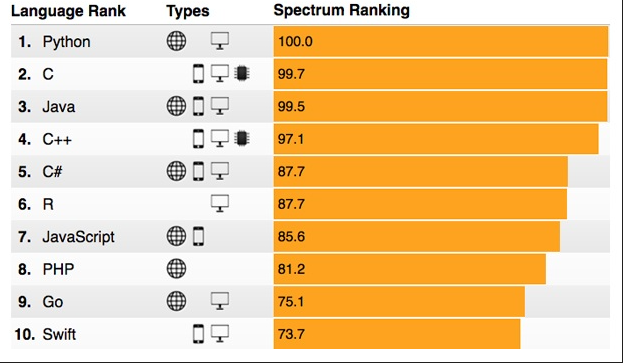
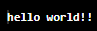
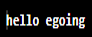
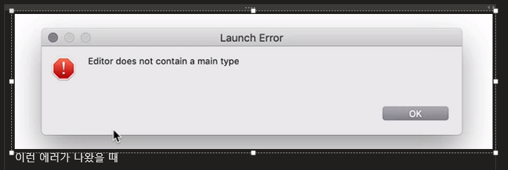
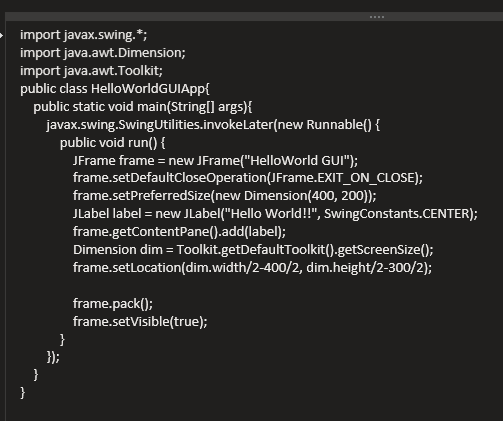

>> 생활코딩 java1을 학습, 정리한 내용입니다. (https://opentutorials.org/course/3930)

# Java basic 1
* 1강 ~ 5강
1. 수업 소개
   * 장단점
   * 개발 언어 순위
2. 실습 환경(java 설치)   
3. IDE 설치(eclipse 설치)
   * IDE 종류
4. 실행
   1. A/S
   2. java의 동작 원리
5. Hello Java World 
   1. 데스크톱 애플리케이션
   2. 사물을 자바로 제어하기
   3. 안드로이드 애플리케이션 만들기
---
---

## 1. what is Java?
* 컴퓨터 프로그래밍 언어
* in 1991, by 제임스 고슬링
* write once, run anywhere
* 활용 : 가전제품 > **웹** > 모바일 

### 1.1 장점
- java는 일단 프로그램을 작성하면 어떤 플랫폼에서도 실행된다.(WORA - Write Once, Run Anywhere)

### 1.2 단점
- C/C++ 코드로 작성된 코드보다 실행속도가 느리다.

### 21년 프로그래밍 언어 순위


>[출처 : IEEE spectrum](https://becominghuman.ai/top-20-most-popular-programming-languages-for-2021-and-beyond-735ee8370c61)


>[출처 : TIOBE](https://www.tiobe.com/tiobe-index/)

자바는 꾸준히 하락하고 있고 python이 강세다. 자바는 분명히 지는 별이지만 아직도 점유율이 꽤 높고 기업용 시장 웹 애플리케이션 개발, 모바일 시장(안드로이드)앱 개발에 중요한 언어로서 사용하고 있다.

## 2.1 온라인 실습환경
* JAVA online editor
  * [jdoodle](https://jdoodle.com)

## practice java
### practice 1) 
hello world(도구없이 모니터에 출력)
```
public class MyClass {
    public static void main(String args[]) {
        System.out.println("hello world!!");
    }
}
```

도구를 이용하지 않고 자바로 실행하면 모니터에 직접 hello world!!가 뜬다.


### practice 2)
배열 인자'name' 설정 후 "hello 이름"출력
```
public class MyClass {
    public static void main(String args[]) {
        System.out.println("hello "+args[0]);
    }
}
```

```
public class MyClass {
    public static void main(String args[]) {
        System.out.println("hello "+args[0]);
    }
}
```


## 2.2 자바 설치
1. java development kit 검색 
2. Oracle.com 접속
3. 원하는 버전 다운로드
   * 추천 버전 : [Java SE Development Kit 11 Downloads](https://www.oracle.com/kr/java/technologies/javase-jdk11-downloads.html)

## 3. IDE 설치 - eclipse
1. eclipse ide for java 검색
2. eclipse.org 접속
3. 최신 버전 다운로드
   * [Eclipse Installer 2021‑03 R](https://www.eclipse.org/downloads/packages/)
 * workspace는 이클립스 저장 디렉토리

><[이클립스에 대한 참고글](https://stackoverflow.com/questions/152691/is-eclipse-the-best-ide-for-java)>

### IDE 비교
* >[Top 10+ Best Java IDEs & Online Java Compilers [2021 Rankings]](https://www.softwaretestinghelp.com/best-java-ide-and-online-compilers/)

* >[Best Java IDE 2021 | Most Popular Java IDE](https://hackr.io/blog/best-java-ides)

* List Of The 10 Best Java IDE
  1. Eclipse
  2. IntelliJ Idea
  3. NetBeans
  4. BLUEJ
  5. JDeveloper
  6. DrJava
  7. Greenfoot
  8. JGrasp
  9. Android Studio
  10. JCreator

* How To Select A Java IDE
  * 뭘 개발 하고 있는지, 개발 프로세스는 어떻고 사용자의 기술 수준은 어떤지를 고려해서 결정한다.
  * 대부분 오픈소스이나 에디션에 따라 비용을 지불하는 경우가 있다.
  * 평점, 만족도, 배우기 쉬운 정도, 신택스 강조 여부, 성능을 고려해 \

## 4.1 실행


## 4.2 A/S


## 4.3 자바 동작 원리


# 5. Hello Java World
자바로 무엇을 할 수 있을까?
맛보기로 알아보자.
## 5.a 데스크톱 애플리케이션 만들기



"Hello World!!" - 나오는 문자 // SwingConstants.CENTER) - 문자 정렬 // new Dimension(400, 200) - 화면 사이즈

## 5.b 사물을 java로 제어하기

* 컴퓨터 발전 3요소
    1. 빨라진다.
    2. 싸진다.
    3. 작아진다.

* 크고 작은 사물에 작고 싼 컴퓨터를 설치해서 프로그래머블한 사물을 만든다

* 그리고 사물이 인터넷에 연결되서 프로그래밍적으로 제어된다는 뜻에서 사물인터넷(iot)라고 부른다.

* 예시) 라즈베리파이. 5만원정도하는 작은 컴퓨터(교육용)

* cpio라는 장치가 있다. 몇 번 핀에게 전기를 흐르게 해 라고 명령 할 수 있음.

* 이런 기술로 원하는 시간에 화물에 물을 주거나 지구 반대편에 있는 우리 집에 있는 전구에 불을 켤 수도 있다. 수많은 사물을 자동화된 방법으로 제어할 수 있게 되는 것!

```java
import com.pi4j.io.gpio.GpioController;
import com.pi4j.io.gpio.GpioFactory;
import com.pi4j.io.gpio.GpioPinDigitalOutput;
import com.pi4j.io.gpio.PinState;
import com.pi4j.io.gpio.RaspiPin;

public class HelloWorldRaspberryPi {

	public static void main(String[] args) throws InterruptedException {

		final GpioController gpio = GpioFactory.getInstance();
		final GpioPinDigitalOutput pin = gpio.provisionDigitalOutputPin(RaspiPin.GPIO_01,
 "PinLED", PinState.LOW);
		final int SHORT_INTERVAL = 200;
		final int LONG_INTERVAL = SHORT_INTERVAL * 3;
		final int LETTER_INTERVAL = SHORT_INTERVAL * 7;

		while (true) {
			// H
			pin.high();
			Thread.sleep(SHORT_INTERVAL);
			pin.low();
			Thread.sleep(SHORT_INTERVAL);
			pin.high();
			Thread.sleep(SHORT_INTERVAL);
			pin.low();
			Thread.sleep(SHORT_INTERVAL);
			pin.high();
			Thread.sleep(SHORT_INTERVAL);
			pin.low();
			Thread.sleep(SHORT_INTERVAL);
			pin.high();
			Thread.sleep(SHORT_INTERVAL);
			pin.low();
			Thread.sleep(LETTER_INTERVAL);

			// e
			pin.high();
			Thread.sleep(SHORT_INTERVAL);
			pin.low();
			Thread.sleep(LETTER_INTERVAL);

			// l
			pin.high();
			Thread.sleep(SHORT_INTERVAL);
			pin.low();
			Thread.sleep(SHORT_INTERVAL);

			pin.high();
			Thread.sleep(LONG_INTERVAL);
			pin.low();
			Thread.sleep(SHORT_INTERVAL);

			pin.high();
			Thread.sleep(SHORT_INTERVAL);
			pin.low();
			Thread.sleep(SHORT_INTERVAL);
			pin.high();
			Thread.sleep(SHORT_INTERVAL);
			pin.low();
			Thread.sleep(LONG_INTERVAL);

			// l
			pin.high();
			Thread.sleep(SHORT_INTERVAL);
			pin.low();
			Thread.sleep(SHORT_INTERVAL);

			pin.high();
			Thread.sleep(LONG_INTERVAL);
			pin.low();
			Thread.sleep(SHORT_INTERVAL);

			pin.high();
			Thread.sleep(SHORT_INTERVAL);
			pin.low();
			Thread.sleep(SHORT_INTERVAL);
			pin.high();
			Thread.sleep(SHORT_INTERVAL);
			pin.low();
			Thread.sleep(LONG_INTERVAL);
		}
	}
}
```

* 코드 설명
  * final int SHORT_INTERVAL = 200;  // 0.2 초정도 켜짐

  * high 켜짐, low 꺼짐. 켜지고 꺼짐으로 모스부호(hello) 표현

## 5.c 안드로이드 애플리케이션 만들기

검색) android development documentation

>[https://developer.android.com/docs?hl=ko](https://developer.android.com/docs?hl=ko)

'첫 앱 빌드' **안드로이드 스튜디오** 설치

---

* MainActivity에 자바 내용이 들어있다.

* ```setContentView(R.layout.*activity_main*);``` 파일

  * 파일 안에 Code 탭과 Design 탭이 있는데 여기서 코드와 미리보기 화면
확인 가능. 

* 시뮬레이터에서 실행
  * tools> AVD 매니저 (android virtual
manager) > 실행 후 my app avd manager manual

>[https://developer.android.com/studio/run/managing-avds](https://developer.android.com/studio/run/managing-avds)


---
## 생활 코딩 링크
> (오픈튜토리얼스)[https://opentutorials.org/course/1] 
> (생활코딩 로드맵)[https://seomal.org/?i=JAVA1]