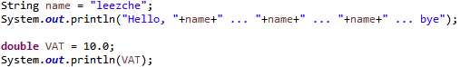

>> 생활코딩 java1을 학습, 정리한 내용입니다. (https://opentutorials.org/course/3930)

# Java basic 2
* 6강~10강
6. 데이터와 연산
    1. 데이터와 연산
    2. 데이터 타입
    3. 숫자와 연산
    4. 문자열의 표현
    5. 문자열 다루기
7. 작심삼일 공략 
8. 변수
    1. 변수의 정의
    2. 변수의 효용
    3. 데이터 타입의 변환
9. 프로그래밍
    1. 프로그래밍이란?
    2. 프로그램만들기 - IOT 라이브러리 설치
    3. IOT 프로그램 만들기
10. 디버거
---
---


# 6.1 데이터와 연산

2021년 4월 5일 월요일
오후 12:14


컴퓨터로 데이터를 연산하는 것
어떤 데이터를 연산할 수 있을까? 숫자 문자 등등..
데이터를 구분하는 이유는 데이터마다 맞는 처리방식이 다르다.
숫자 사칙연산, 미적분등 문자 길이확인, 색인, 문자삭제 등


# 6.2 데이터 타입

2021년 4월 5일 월요일
오후 12:17
``` java
System.out.println(6); // Number
System.out.println("six"); // String
System.out.println("6"); // String 6
System.out.println(6+6); // 12
System.out.println("6"+"6"); // 66
System.out.println(6*6); // 36
// System.out.println("6"*"6");
System.out.println("1111".length()); // 4
// System.out.println(1111.length());
System.out.println("Hello World"); //String 문자열
System.out.println('H'); //Char 문자
System.out.println("H");
```
>출처: <https://opentutorials.org/course/3930/26653> 


# 6.3 숫자와 연산

2021년 4월 5일 월요일
오후 2:25
```java
System.out.println(6 + 2); // 8
System.out.println(6 - 2); // 4
System.out.println(6 * 2); // 12
System.out.println(6 / 2); // 3
System.out.println(Math.PI); // 3.141592653589793
System.out.println(Math.floor(Math.PI)); // 버림 3.0
System.out.println(Math.ceil(Math.PI)); // 올림 4.0
```
>출처: <https://opentutorials.org/course/3930/26657> 

    + - * /    :    연산자(Operator)

자바 언어가 많은 기능이 있는데 
수학과 관련된 아주 유명하고 자주 사용되는 것들을 그루핑해놓은 매스 Math 라는게 있다
Math.을 치면 뒤에 많은 기능을 보여준다.

# 6.4 문자열의 표현

2021년 4월 5일 월요일
오후 2:31
```java
public class StringApp {
public static void main(String[] args) {
// Character VS String 
System.out.println("Hello World"); // String 문자열
System.out.println('H'); // Character 문자 -한 글자
System.out.println("H"); 
System.out.println("Hello "+ "World");
// new line
System.out.println("Hello \nWorld");
// escape
System.out.println("Hello \"World\"");// Hello "World"
}
}
```
>출처: <https://opentutorials.org/course/3930/26658> 
```java
System.out.println("Hello World"); 
	여기에서 Hello 뒤에 커서 놓고 Enter키 누르면 자동으로

System.out.println("Hello "
			+ "World"); 
	로 수정해준다 (eclipse개입) 하지만 결과는 
Hello World 
	줄바꿈이 안됬다 ㅠ

System.out.println("Hello \nWorld");
	결과
Hello 
World
		
	이렇게 \와n을 입력하면 줄바꿈! 역슬래쉬n
	
//escape		
	System.out.println("Hello \"World\"");
```
문자의 시작을 알려주는 "말고 일반적인 문자"는 \"(역슬래쉬")로 한다
역슬래쉬를 통해서 뒤에 따라오는 어떤 임무가 있는 문자를 인물을 일시적으로 도망시키는 것을 escape한다라고 함 
escape character 
문자열 내에서 사용하는 것으로,
특수문자를 표현하거나,
특수기능을 사용할때 사용한다.

>출처: <https://it1234.tistory.com/97> 


# 6.5 문자열 다루기

2021년 4월 5일 월요일
오후 2:46
```java
public class StringOperation {
public static void main(String[] args) {
System.out.println("Hello World".length()); // 11
System.out.println("Hello, leezche ... bye. ".replace("leezche", "egoing"));
System.out.println("Hello, [[[name]]] ... bye. ".replace("[[[name]]]", "duru"));
}
}
```
>출처: <https://opentutorials.org/course/3930/26658> 


# 7. 작심삼일 공학

2021년 4월 5일 월요일
오후 2:51

공부?
작심삼일?
의지?

작심삼일 >> 나는 의지가 부족하다는 뜻 x

공부를 그만하라는 뇌의 명령이다. 

과감하게 진도나가지 않고 지금까지 배운 것과 현실 삶의 문제에 접점을 찾기 위해 노력!

배운 것 만으로 여러가지 문제를 해결하기 위해서 동분서주! >> 내가 쓸모있는 것을 공부한다는 증명과정

뇌의 흥분도는 고조되고 적당한 타이밍에 뇌가 명령을 내리고 이 때는 고통스럽지도 지루하지도 않다.

언제나 화이팅이다!

# 8.1 변수의 정의

2021년 4월 5일 월요일
오후 3:28

* 변수 : 변수 값이 변할 수 있는 문자
    * 사용예) a = 1;


* 변수를 담을 때는 그 변수가 어떤 데이터 타입을 담을 수 있는가를 명확하게 해야 한다.

* 왜 자바와 같은 몇몇 언어들은 데이터 타입을 변수에 정의를 해줘야 되는가? 불편..

* **trade off**와 관련

* 언어들의 변수는 음료수 병과 같다. 음료수 병은 컵안에 있는 액체와 다르게 (미개봉시) 안의 내용물을 확신 할 수 있다. 하지만 컵안의 액체는 뭔지 모르고 누가 마셧을 수도 있다.
이처럼 컴퓨터 언어의 변수에는 반드시 정수가 온다 또는 문자열이 온다라고 정의를 해놓으면 그것이 아닌 데이터가 들어오면 컴파일이 안된다. 그 안에 있는 값은 반드시 정수거나 반드시 문자열 이라고 확신 할 수 있다. 꺼낼 때마다 값의 데이터 타입을 확인하지 않아도 되는 편리함이 있다.

# 8.2 변수의 효용

2021년 4월 5일 월요일
오후 3:44



* 변수를 지정하면
많은 데이터를 한꺼번에 관리할 수 있고, 사용자가 쉽게 데이터의 의미를 알 수 있다.
(leezche, 10이라고만 써있으면 쉽게 의미를 알기 힘들지만, name, VAT라고 의미있 이름으로 변수를 지정해서 이름, 부가가치세세율이라는 의미를 알 수 있다.) 

# 8.3 데이터 타입의 변환(casting)

2021년 4월 5일 월요일
오후 3:54


에러(빨간 밑줄)이 떳을 때 마우스를 hover하면 다음과 같이 에러이유와 빠른 해결법을 알려준다.


### 캐스팅(Casting)
* 캐스팅(Casting)은 형변환
* 객체지향(OOP)에서의 다향성(Polymorphism)에 있어 중요
* 자바의 데이터형 2가지
  * 기본형(primitive type)
    * 데이터 손실을 막기 위해 동작(자동, 수동)
    - Boolean Type(boolean)
    - Numeric Type(short, int, long, float, double, char)
  * 참조형(reference type)
    * 관련성이 유무에 따라 동작. 상속관계 또는 구현관계가 있어야함.   
    - Class Type
    - Interface Type
    - Array Type
    - Enum Type
    - 그 외 다른 것들

* 참조형 
  1. 업캐스팅(자식이 부모로)
  2. 다운캐스팅(업캐스팅되어 고유의 특성을 잃은 자식 클래스의 객체를 다시 복구)

* instanceof 
  * class간 관계가 복잡할 때 instanceof를 통해 객체의 클래스타입 판별

# 9.1 프로그래밍이란 무엇인가.
2021년 4월 5일 월요일
오후 4:27
* 프로그래밍이란 컴퓨터에게 어떠한 일을 순차적으로 실행하도록 하는 것, 이를 통해 "사람이 잘 못하고 기계가 더 잘하는 일"을 기계에게 시켜서 자동화


# 9.2 프로그램 만들기 - IOT라이브러리 설치하기
* 남이 만들어 놓은 코드(부품)를 가져와서 나의 앱(제품)을 만들자.
* 사물인터넷 관련 코드들.
    > https://github.com/egoing/java-iot


# 9.3 IOT 프로그램 만들기


# 10. 디버거 (debugger)

2021년 4월 5일 월요일
오후 6:57


멈추고 싶은 곳에서 더블클릭 > 브레이크 포인터 생성


toolbar에 있는 벌레버튼으로 디버그 모드로 전환


perspective(관점) java 모드 /디버그 모드 (화면구성이 해당 기능에 유리하게 바뀜)
퍼스펙티브는 일종의 템플릿, 테마 기능.


step over 버튼 : 명령어 한 개만 실행.


"실행하고 있는 변수 내에 id 변수가 JAVA APT 507 로 세팅"

즉, 디버거로 코드 한 줄씩 실행해 보면서 변수의 상태나 문제점을 하나하나 체크할 수 있다. 

한번더 step over누르면


myElevator라는 변수가 추가, 변수 내부적으로 _id라는 값에 변수에 JAVA APT 507 값이 들어가 있다. 라는 뜻.


Resume 버튼 한번에 선택한 코드행까지 실행.


step in : 메소드의 내용 확인

 on 


on 코드 내용확인.


on 메소드 코드 한줄씩 확인 가능.


step return 되돌아감


perspective 자바로 되돌아감

---
## 생활 코딩 링크
> (오픈튜토리얼스)[https://opentutorials.org/course/1] 
> (생활코딩 로드맵)[https://seomal.org/?i=JAVA1]
