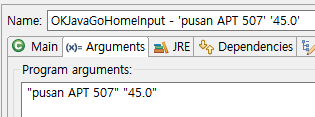

>> 생활코딩 java1을 학습, 정리한 내용입니다. (https://opentutorials.org/course/3930)

# Java basic 3 
- [Java basic 3](#java-basic-3)
- [11.1 입력과 출력](#111-입력과-출력)
- [11.2 I/O : arguments & parameter](#112-io--arguments--parameter)
    - [자바에서 arguments 와 parameter는 다르다? 같다?](#자바에서-arguments-와-parameter는-다르다-같다)
    - [결론](#결론)
    - [인자 입력(설정) 방법](#인자-입력설정-방법)
- [12.1 직접 컴파일하고 실행](#121-직접-컴파일하고-실행)
    - [직접 프로그램을 컴파일하고 실행하는 방법](#직접-프로그램을-컴파일하고-실행하는-방법)
    - [import java file](#import-java-file)
- [12.2 직접 컴파일하고 실행 - 실행환경 살펴보기](#122-직접-컴파일하고-실행---실행환경-살펴보기)
  - [자바 cmd 기본 명령어](#자바-cmd-기본-명령어)
  - [환경변수 설정](#환경변수-설정)
- [12.3 직접 컴파일하고 실행 - 컴파일과 실행하기](#123-직접-컴파일하고-실행---컴파일과-실행하기)
  - [terminal 명령어](#terminal-명령어)
    - [windows](#windows)
    - [mac](#mac)
    - [path 경로](#path-경로)
  - [terminal에서 자바 파일 컴파일](#terminal에서-자바-파일-컴파일)
- [12.4 직접 컴파일하고 실행 - 라이브러리 이용](#124-직접-컴파일하고-실행---라이브러리-이용)
- [12.5 직접 컴파일하고 실행 - 입력과 출력](#125-직접-컴파일하고-실행---입력과-출력)
- [13.1 자바문서 보는법 - API vs UI](#131-자바문서-보는법---api-vs-ui)
    - [자바가 제공하는 부품](#자바가-제공하는-부품)
    - [API](#api)
    - [UI](#ui)
    - [컴퓨터의 사용자 인터페이스](#컴퓨터의-사용자-인터페이스)
- [13.2 자바문서 보는법 - 패키지, 클래스, 변수, 메소드](#132-자바문서-보는법---패키지-클래스-변수-메소드)
    - [자바 공식 사용 설명서를 보는 법](#자바-공식-사용-설명서를-보는-법)
    - [class 는 하나의 프로그램이다?](#class-는-하나의-프로그램이다)
- [13.3 자바문서 보는법 - 클래스](#133-자바문서-보는법---클래스)
- [13.4 자바문서 보는법 - 인스턴스](#134-자바문서-보는법---인스턴스)
    - [PrintWriter 클래스](#printwriter-클래스)
    - [예외상황 처리](#예외상황-처리)
    - [인스턴스](#인스턴스)
- [13.5 자바문서 보는법 - 상속](#135-자바문서-보는법---상속)
    - [Inheritance](#inheritance)
    - [하이라키(계층구조/항목나열)](#하이라키계층구조항목나열)
- [14.1 나의 앱 만들기(myApp)](#141-나의-앱-만들기myapp)
- [14.2 myApp - 기본 기능 구현](#142-myapp---기본-기능-구현)
    - [Find/Replace 기능](#findreplace-기능)
- [14.3 myApp - 변수도입](#143-myapp---변수도입)
    - [MyApp에 변수 도입](#myapp에-변수-도입)
- [14.4 myApp - 입력값 도입](#144-myapp---입력값-도입)
    - [MyApp에 입력값 도입](#myapp에-입력값-도입)
- [14.5 myApp - 오리엔테이션2](#145-myapp---오리엔테이션2)
- [14.6 myApp - 조건문](#146-myapp---조건문)
- [14.7 myApp - 배열](#147-myapp---배열)
    - [결과](#결과)
  - [public static void main(String args[])](#public-static-void-mainstring-args)
    - [static](#static)
    - [public](#public)
    - [String args[]](#string-args)
    - [void](#void)
- [14.8 myApp - 반복문](#148-myapp---반복문)
    - [myApp에 반복문 적용](#myapp에-반복문-적용)
- [14.9 myApp - 메소드](#149-myapp---메소드)
    - [1. 메소드 추출](#1-메소드-추출)
    - [2. 전역변수 선언](#2-전역변수-선언)
    - [3. 메소드 이용](#3-메소드-이용)
    - [4. 입력값 삭제 (사용x)](#4-입력값-삭제-사용x)
    - [5. 필요없는  코드 삭제 >> 메소드에 저장 outline에서 메소드 확인가능](#5-필요없는--코드-삭제--메소드에-저장-outline에서-메소드-확인가능)
  - [완성 코드](#완성-코드)
- [14.10 myApp - 클래스](#1410-myapp---클래스)
  - [객체(클래스)](#객체클래스)
    - [myApp 적용](#myapp-적용)
- [14.11 myApp - 인스턴스](#1411-myapp---인스턴스)
    - [상황 설정](#상황-설정)
- [15. 수업을 마치며](#15-수업을-마치며)
  - [생활 코딩 링크](#생활-코딩-링크)

<small><i><a href='http://ecotrust-canada.github.io/markdown-toc/'>Table of contents generated with markdown-toc</a></i></small>

---
---

# 11.1 입력과 출력

2021년 4월 5일 월요일
오후 9:06


프로그램은 우리가 준 입력값에 따라서 출력값이 다르다

* java popup input text swing

    ```java
    String path = JOptionPane.showInputDialog("Enter a path");
    ```

    >출처: <https://stackoverflow.com/questions/17180023/how-do-i-make-a-popup-window-with-just-a-textfield> 


* JOptionPane import.

    

    

    

    

    ``` java
    import javax.swing.JOptionPane;
    String id = JOptionPane.showInputDialog("Enter a ID");
    ```
    자바가 스윙이라는 기술의 옵션페인이라는 기능에 쇼인풋 다이얼로그라는 기능을 켜주면 팝업창이 뜨고 우리가 값을 입력하면 그 값으로 변수 id가 바뀐다.

    ```java
    String bright = JOptionPane.showInputDialog("Enter a bright level");
    ```
    bright 는 실수 데이터 타입 double이 들어가야 되기 때문에 

    java string to double conversion검색

    > https://stackoverflow.com/questions/5769669/convert-string-to-double-in-java''
    ```java
    double value = Double.parseDouble(text);
    double value = Double.parseDouble(bright);
    ```


# 11.2 I/O : arguments & parameter

2021년 4월 5일 월요일
오후 10:18

* args 는 매개변수 parameter
* String[]는 문자열 배열

```java
String id = args[0];
String bright = args[1];
```

단어|	번역|	의미
---|---|---
Parameter|	매개변수|	함수와 메서드 입력 변수(Variable) 명
Argument|	전달인자, 인자|	함수와 메서드의 입력 값(Value)

>출처: <http://taewan.kim/tip/argument_parameter/> 


### 자바에서 arguments 와 parameter는 다르다? 같다?

* 일반적으로 매개 변수는 메소드 정의에 나타나는 것입니다. 인수는 런타임 중에 메서드에 전달되는 인스턴스입니다.

    > https://stackoverflow.com/questions/12709026/difference-between-arguments-and-parameters-in-java
	
### 결론
* 엄밀히 말하면 다르다. parameter가 argumet를 사용하는 것이다.

    하지만 어렵다면 같다고 봐도 무방하다.

    **args = arguments = parameter = 매개변수**

### 인자 입력(설정) 방법

* 경로
  * Run configuration > Java Application > java flie > Arguments

    

    

    


# 12.1 직접 컴파일하고 실행

2021년 4월 5일 월요일
오후 10:47

### 직접 프로그램을 컴파일하고 실행하는 방법
  * 자바만 있다면 이클립스와 같은 개발도구가 없어도 컴파일하고 개발할 수 있다.
  *  운영체제에 대한 많은 지식 필요     
     * 동작하는 흐름을 알자!

  * 자바 파일을 클래스 확장자로 컴파일
  * 클래스 파일을 실행
  * 실행할 때 입력값 입력 (입력값에 따라 다른 출력값)

### import java file
* import한 자바파일은 파일을 로딩 해줘야 > 어렵다
* 변수를 통해서 사용자가 입력한 정보를 가져와서 출력 > 더 어렵다.


# 12.2 직접 컴파일하고 실행 - 실행환경 살펴보기

2021년 4월 5일 월요일
오후 10:51

## 자바 cmd 기본 명령어
* javac
* where java
* java -version
* javac -version

* [windows cmd java and the windows command prompt](https://introcs.cs.princeton.edu/java/15inout/windows-cmd.html)

## 환경변수 설정
* path : 
  
   내 pc > 속성 > 고급시스템설정 > 고급 > 환경변수 > path


* 'HOME에 대한 사용자 변수'는 내 계정
'시스템 변수'는 모든 유저


# 12.3 직접 컴파일하고 실행 - 컴파일과 실행하기

2021년 4월 5일 월요일
오후 10:52

윈도 탐색기에서 컴파일을 하기 위해서는 자바 소스코드가 위치하고 있는 디렉토리 주소필요

## terminal 명령어
### windows
* cd path
* dir
### mac
* pwd 
* ls

### path 경로
* C:\Program Files\Java\jdk-16\bin>javac
Usage: javac <options> <source files>

* C:\Users\Junha\eclipse-workspace\Programming>java
Usage: java [options] <mainclass> [args...]

## terminal에서 자바 파일 컴파일
* javac Program.java :  자바파일을 클래스 파일로 컴파일 (클래스파일 생성, 이미 클래스 파일이 있을 경우 아무 메세지도 뜨지않음)
* java Program.java : 클래스파일 실행


* java 명령어를 입력하면 Program파일을 찾고 main 뒤에있는 코드를 실행해서 출력.


# 12.4 직접 컴파일하고 실행 - 라이브러리 이용

2021년 4월 5일 월요일
오후 10:52


Elevator는 import되어온 (불러온) 다른 폴더(패키지)에 있다.
package (org부터 iot디렉토리까지 패키지라고함)


OKJavaGoHome.class 파일을 삭제하고 org 폴더를 새폴더 lib안으로 옳기고 컴파일 해보자


org.opentutorials.iot 패키지를 찾지 못했다고 뜬다.

javac -cp ".;lib" OKJavaGoHome.java

--class-path <경로>|클래스를 경로에서 찾아라|또는 줄여서  -cp
---|---|---
.|현재 디렉토리에서도 찾아봐|	
;|구분 표시|맥에선 :
lib:<another경로>|lib디렉토리 찾아보세요|	ex)


.ClassNotFoundException: org.opentutorials.iot.Elevator

그래도 Elevator 클래스를 찾지 못했다고 뜸.

java 실행 할 때도 -cp로 불러온 클래스 경로를 알려줘야 한다!


# 12.5 직접 컴파일하고 실행 - 입력과 출력

2021년 4월 5일 월요일
오후 10:52

OKJavaGoHome.java 파일을 컴파일 해보자


클래스파일 위치를 알려주며 컴파일하여 클래스 파일이 생성되었지만
java 명령어로 실행했을때 에러가 발생 (OKJavaGoHomeInput.java:13) 로 보아 13번째 줄에서 발생

args[0]이 부분 때문에 에러가 발생! arguments 매개변수가 원인이다.
args는 그 프로그램을 실행할 때 그 프로그램의 입력 값을 주었을 때 그 입력 값을 받는 것이 args
args[0]의 args는 


여기 args랑 똑같아야!
0 번째 1 번째.. 가져온다


java -cp ".;lib" OKJavaGoHomeInput "java APT 105" 15.0

"java APT 105" 가 args[0]
15.0이 args[1] 
즉 매개변수 0번째와 1번째 값으로 입력되어 명령어java입력시 정상적으로 프로그램이 동작한다


값을 바꿔도 정상적으로 작동한다.


# 13.1 자바문서 보는법 - API vs UI

2021년 4월 7일 수요일
오후 7:31

### 자바가 제공하는 부품 
ex)
화면에 출력기능 : sysout
날짜 : Date
 수학적 기능 : Math.
* 자바가 기본적으로 제공하는 기능 : 기본라이브러리

  * 자바 기본 문법과 자바 기본라이브러리를 이용해서 프로그램을 만드는 것. 
### API
* Application programming interface : 프로그램이 다른 프로그램에게 제공하는 조작장치.
programming 은 시간의 의미, interface는 응용의 의미
* 부품들의 조작방법을 API라고 한다. 
다양한 api를 알고 능숙하게 사용하는 것이 잘하는 프로그래머.

### UI
User Interface : UI
* 개발자가 만든 프로그램을 조작하기 위해서 조작해야되는 조작장치가 UI
* ex) 
  * 웹 - 링크
  * 데스크탑 애플리케이션 - 버튼
  * 커맨드라인 시스템이면 - argument


### 컴퓨터의 사용자 인터페이스

* 컴퓨터 과학과 인간과 컴퓨터 상호 작용(HCI)에서 사용자 인터페이스는 프로그램이 사용자에게 보여 주는 화상·문자·소리 정보와 프로그램을 조작하기 위한 수단(이를테면 컴퓨터 자판의 글쇠 입력이나 마우스의 움직임)

* 종류
  * 그래픽 사용자 인터페이스(GUI)
  * 웹 사용자 인터페이스(WUI): 
  * 명령 줄 인터페이스(CLI)
  * 체감각 인터페이스
  * 터치 사용자 인터페이스

>출처: <https://ko.wikipedia.org/wiki/%EC%82%AC%EC%9A%A9%EC%9E%90_%EC%9D%B8%ED%84%B0%ED%8E%98%EC%9D%B4%EC%8A%A4#%EC%A2%85%EB%A5%98> 


# 13.2 자바문서 보는법 - 패키지, 클래스, 변수, 메소드

2021년 4월 7일 수요일
오후 7:42

### 자바 공식 사용 설명서를 보는 법
* 검색) API documentation java

### class 는 하나의 프로그램이다?
* 수학관련 > math
* java.lang > Math 라는 클래스가 소속된 패키지 
* Math 가 여러 개 있을 수 있음 > 충돌x 위해 
패키지로 정리정돈
* 패키지는 비슷한 성격의 클래스를 모아서 이름 붙인 것.
* 클래스는 서로 연관된 변수와 메소드를 모아서 이름 붙인 것.

)


# 13.3 자바문서 보는법 - 클래스

2021년 4월 7일 수요일
오후 7:48


* Math라는 클래스 (일종의 디렉토리) 안에 수많은 변수와 메소드가 담겨 있고
* Math.을 치고 ctrl space 누르면 메소드 목록이 뜬다.
* (Content Assist > Auto Activation 켜져있으면 자동으로)


# 13.4 자바문서 보는법 - 인스턴스

2021년 4월 7일 수요일
오후 8:00

### PrintWriter 클래스
* PrintWriter 라는 클래스를 사용해보자. (파일 생성 기능)
* 문법이 Math.과 다르게 뒤에 ("저장하고싶은파일명"); 이렇게 사용

```java 
new PrintWriter("저장하고싶은파일명");  // new를 붙여서 PrintWriter의 복제본(일종의 아바타)를 만든다.
p1 = new PrintWriter("저장하고싶은파일명");  // 그리고 그 복제본을 p1이라는 변수에 담고

// p1 변수에 담겨 있는 어떠한 무엇을 뭐라고 하냐면 PrintWriter클래스의 인스턴스인 것

PrintWriter p1 = new PrintWriter("저장하고싶은파일명"); 

// PrintWriter는 자바에 내장되어 있는 기능이긴 하지만 패키지를 불러와야 한다.
import java.io.PrintWriter;  // java.io패키지 안의 printWriter
```

### 예외상황 처리
* 파일을 읽다가 없으면 문제가 될 수 있기 때문에 예외 상황을 처리 해 줘야 한다. 
* Add throws declaration > IOException 으로 지정. >> 예외처리에 관한 내용은 뒤에 깊게 학습한다.


```java
public static void main(String[] args) throws IOException {
p1.write("Hello 1");   <<<  Hello1 이라는 파일 생성
p1.close();              <<< p1작업 끝나면 close를 통해서 파일 작업 종료(남도 수정할 수 있게)
```

### 인스턴스
* Math. 에서는 .뒤에 메소드를 이용해서 기능을 사용하였다 하지만 PrintWriter에서는 그냥 쓰지 않고 new
를 쓰고 복제한 코드를 p1에 담았다. 왜?


* 만약 위의 코드 처럼 클래스에다가 직접 .write하는(메소드를 사용하는) 방식은 메소드를 사용할 때마다 내가 어떤 파일을 수정할지에 대한 내용을 그때마다 알려줘야 된다. (효율성의 문제)
* 즉 자바에서 PrintWriter는 new를 통해서 인스턴스(p1)을 만들었고 그 인스턴스는 내부적으로 각자의 상태를 가지고 있다. p1은 result1.txt라는 상태를 내장하고 있는 것.
* 즉, 인스턴스 문법을 이용하면 result1.txt 문서를 수정 하고자 할 때마다 매번 직접 메소드를 사용(짧은 맥락의 일종의 일회용방식)하는게 아니라 p1인스턴스를 이용해서 동시에 어러작업들을 동시에 어러 개의 파일들을 작업하기 훨씬 쉽게 만들어 준다.

* printwriter(java.io.)는 constructor(java.lang.)가 있고 math는 없다


instance 


인스턴스 (컴퓨터 과학)
객체 지향 프로그래밍(OOP)에서 인스턴스(instance)는 해당 클래스의 구조로 컴퓨터 저장공간에서 할당된 실체를 의미한다. 여기서 클래스는 속성과 행위로 구성된 일종의 설계도이다. OOP에서 객체는 클래스와 인스턴스를 포함한 개념이다.

이해하기 쉽게 일반적인 단어로 설명하자면, 계산 문제를 '입력과 출력이 명확히 기술된 것'으로 수학적으로 정의할 때, 계산 문제의 입력이 될 수 있는 것은 무한히 많이 존재하고 그것들 하나하나를 해당 계산 문제의 인스턴스라고 부른다.

>출처: <https://ko.wikipedia.org/wiki/%EC%9D%B8%EC%8A%A4%ED%84%B4%EC%8A%A4_(%EC%BB%B4%ED%93%A8%ED%84%B0_%EA%B3%BC%ED%95%99)> 


# 13.5 자바문서 보는법 - 상속

2021년 4월 7일 수요일
오후 8:37

### Inheritance


위에 있는게 부모, 아래가 자식
* PrintWriter의 기능을 만들때 Writer라는 클래스가 갖고 있는 메소드 변수를 물려받으면서 자기가 원하는 메소드 변수를 추가한것이다.

### 하이라키(계층구조/항목나열)


* toString메소드를 아래서부터 찾아 나간다. 다 찾아도 없으면 에러가 발생
* 부모-자식 클래스 둘 다에 같은 메소드가 있으면 (부모 메소드를 override해서 자식 메소드로 가져온 것)자식 메소드를 사용 
* Object는 정점의 클래스 'Object'가 가지고 있는 메소드들은 모든 클래스가 사용하는 메소드들이다.


* Class Writer의 알려진 상속받은 자식 클래스들

    


# 14.1 나의 앱 만들기(myApp)

2021년 4월 7일 수요일
오후 8:47


내가 사업을 하고 있고 이런 사업에 관련된 비용을 계산하는 프로그램을 만든다고 상상하자.


# 14.2 myApp - 기본 기능 구현

2021년 4월 7일 수요일
오후 8:52


```java
System.out.println("Value of supply : "+10000.0);
System.out.println("VAT : "+ (10000.0*0.1) );
System.out.println("Total : "+ (10000.0 + 10000.0*0.1) );
System.out.println("Expense : "+ (10000.0*0.3) );
System.out.println("Income : "+ (10000.0 - 10000.0*0.3) );
System.out.println("Dividend : "+ (10000.0 - 10000.0*0.3) * 0.5 );
System.out.println("Dividend : "+ (10000.0 - 10000.0*0.3) * 0.3 );
System.out.println("Dividend : "+ (10000.0 - 10000.0*0.3) * 0.2 );
```

```java
Value of supply : 10000.0
VAT : 1000.0
Total : 11000.0
Expense : 3000.0
Income : 7000.0
Dividend : 3500.0
Dividend : 2100.0
Dividend : 1400.0
```

### Find/Replace 기능

Toolbar > search > Find/Replace(ctrl+F)


Edit >  Find/Replace

* Find/Replace(ctrl+F) 기능에서 10000.0 을 한번에 다른 숫자로 바꿀 수 있다.


# 14.3 myApp - 변수도입

2021년 4월 7일 수요일
오후 9:08

### MyApp에 변수 도입
* 10000.0 우클릭후 Extract local variable (로컬 변수 추출) 하면 한번에 변수화. alt + shift + L

* variable 하기전에 preview로 어떤 숫자가 변수화 되는지 확인해서 잘못된 변수화가 되지 않도록 하자.


* 변수도입전
    

* 변수도입후
    


# 14.4 myApp - 입력값 도입

2021년 4월 7일 수요일
오후 9:24

### MyApp에 입력값 도입
* 변수 도입으로 적은 데이터 수정만으로 많은 계산이 자동이로 이루어 지지만 프로그램을 열어서 데이터를 수정해야 된다.
* 입력값을 도입해서 
  	
    Run configurations > AccountingApp > arguments 로 값 변경 , 실행
	

	
* 이 방식으로 java 버추얼 머신이 설치되어 있으면 cmd 에서  class파일을 실행 할 수 있다.
* launch4j 소프트웨어를 사용하면 자바 버추얼 머신이 없어도 실행 할 수 있다.


# 14.5 myApp - 오리엔테이션2

2021년 4월 7일 수요일
오후 9:25


# 14.6 myApp - 조건문

2021년 4월 7일 수요일
오후 9:25

* 자바의 제어문은 조건문, 반복문 두 가지
프로그램이 알아서 수익이 10000원보다 클경우에는 5:3:2로 나누고
수익이 10000원보다 작을경우에는 1:0:0으로 나눠주는 조건문

* 조건문을 사용하면 알아서 상황을 프로그램이 판단해서 여러가지 상황에서 한개의 프로그램으로 기능을 수행할 수 있다.


# 14.7 myApp - 배열

2021년 4월 7일 수요일
오후 9:25

배열과반복문은 단짝이다

```java
double rate1 = 0.5;
double rate2 = 0.3;
double rate3 = 0.2;
//…
double devidend1 = income * rate1;
double devidend2 = income * rate2;
double devidend3 = income * rate3;
```

이렇게 변수화하면 코드가 중간에 많아질 경우에 변수가 침범받을 가능성(다른사람이 같은 변수 이름으로 변수선언)이 생긴다.

배열을 사용해야한다.

```java
double[] dividendRates = new double[3];
dividendRates[0] = 0.5;
dividendRates[1] = 0.3;
dividendRates[2] = 0.2;

double devidend1 = income * dividendRates[0];
double devidend2 = income * dividendRates[1];
double devidend3 = income * dividendRates[2];
```


코드는 이전과 똑같이 동작

### 결과
* 변수가 한 개. 침범받을 가능성이 현저하게 줄어들었다.

## public static void main(String args[])
### static
* static을 메소드에 붙이면 정적 메소드가 되고, 변수에 붙이면 정적 변수가 된다.
* 이렇게 '정적'으로 선언을 하게 되면 객체를 생성해주지 않아도 프로그램 실행시 자동으로 메모리에 적재
* main 메소드 같은 경우는 객체를 생성하지 않아도 자동으로 실행되어 작업을 수행해야하는 부분이기 때문에 static으로 선언하는 것
### public
* public 접근 제어자는 JVM이 main 함수가 어디에 있건 접근 가능해야하기 때문에 사용


### String args[]
* String args[] 는 매개변수
* 문자열 배열을 줄 수 있다는 것
* 이는 자바를 커맨드라인에서 실행할 때 매개변수를 지원해주기 위해 기본으로 사용해주는 것입니다.

### void
main 메소드가 끝나면 어차피 프로그램이 종료되는 것. 그 시점에서 return 값 의미가 없고, 있을 필요도 없다.

>출처: <https://haloworld.tistory.com/113> 


# 14.8 myApp - 반복문

2021년 4월 7일 수요일
오후 9:25

### myApp에 반복문 적용		
* 배열과 반복문은 단짝		
```java
double valueOfSupply = Double.parseDouble(args[0]);
double vatRate = 0.1;
double expenseRate = 0.3;		
double vat = valueOfSupply*vatRate;
double total = valueOfSupply + valueOfSupply*vatRate;
double expense = valueOfSupply*expenseRate;
double income = valueOfSupply - expense;	
    
double[] dividendRates = new double[3];
dividendRates[0] = 0.5;
dividendRates[1] = 0.3;
dividendRates[2] = 0.2;		

double devidend1 = income * dividendRates[0];
double devidend2 = income * dividendRates[1];
double devidend3 = income * dividendRates[2];

System.out.println("Value of supply : "+valueOfSupply);		
System.out.println("VAT : "+ vat );
System.out.println("Total : "+ total );
System.out.println("Expense : "+ expense );
System.out.println("Income : "+ income );
System.out.println("Dividend 1 : "+ devidend1 );
System.out.println("Dividend 2 : "+ devidend2 );
System.out.println("Dividend 3 : "+ devidend3 );
```		
이 코드에서 dividendRates배열이 3번 나오고 있는데 하나의 코드로 만들어보자

```java
int i = 0;
while(i < dividendRates.length) {
    System.out.println("Dividend 1 : "+ devidend1 );
    i = i + 1;
}
```
dividendRates.length는 3이 된다.(배열이 길이) 3보다 i의 값이 작은 동안에 whlie안의 코드가 반복 실행되고 i의 값이 1씩 증가하는 코드

```java
int i = 0;
while(i < dividendRates.length) {
    System.out.println("Dividend 1 : "+ (income*dividendRates[i]) );
    i = i + 1;
}
```
이렇게 바꾸고 실행하면 똑같이 잘 실행된다.
이렇게 코드를 반복문으로 짜서 이제 몇개의 배열이건 1줄의 코드로 실행 가능하다.
			

# 14.9 myApp - 메소드

2021년 4월 7일 수요일
오후 9:25

* 메소드는 서로 연관된 코드를 그룹핑해서 이름을 붙인 정리정돈 상자다. 정리정돈한 코드는 다른 패키지 안에 저장

### 1. 메소드 추출
   * Extract Method : 블록지정후 alt shift m (메소드 추출)

      1-1. 메소트 호출(실행)
       * 만들어진 메소드를 호출, 실행하는 코드
```double vat = getVAT(valueOfSupply, vatRate);```

      1-2. 메소드 생성
       * 메소드를 만드는 코드
            ```java
            private static double getVAT(double valueOfSupply, double vatRate) {
                    return valueOfSupply * vatRate;
            }
            ```
		
### 2. 전역변수 선언
   * 현재 valueOfSupply변수 등은 지역변수로 main메소드 안에서만 선언되어있다.
   * 지역변수를 전역변수로 변환 우클릭수 refactor > convert local variable to field…선택 하면 메인메소드 위에서 전역변수로서 해당 파일 전역에서 선언된다.

### 3. 메소드 이용
* getVAT메서드는 vat 변수를 정리정돈한 것으로 둘은 같은 내용이라고 할 수 있다.
```double vat = getVAT(); ```
이를 이용하면 전역변수를 선언하지 않아도 된다. 
    ```java
    double vat = getVAT();
    public static double getVAT() {
            return valueOfSupply * vatRate;
    }
    ```
	
### 4. 입력값 삭제 (사용x)

### 5. 필요없는  코드 삭제 >> 메소드에 저장 outline에서 메소드 확인가능
```java
double vat = getVAT();
double total = getTotal();
double expense = getExpense();
double income = getIncome();
double dividend1 = getDividend1();
double dividend2 = getDividend2();
double dividend3 = getDividend3();
```

## 완성 코드
```java
public class AccountingMethodApp {
    public static double valueOfSupply;
    public static double vatRate;
    public static double expenseRate;
    public static void main(String[] args) {
        valueOfSupply = 10000.0;
        vatRate = 0.1;
        expenseRate = 0.3;
        print();
    }		
    public static void print() {
        System.out.println("Value of supply : " + valueOfSupply);
        System.out.println("VAT : " + getVAT());
        System.out.println("Total : " + getTotal());
        System.out.println("Expense : " + getExpense());
        System.out.println("Income : " + getIncome());
        System.out.println("Dividend 1 : " + getDividend1());
        System.out.println("Dividend 2 : " + getDividend2());
        System.out.println("Dividend 3 : " + getDividend3());
    }

    public static double getDividend3() {
        return getIncome() * 0.2;
    }

    public static double getDividend2() {
        return getIncome() * 0.3;
    }

    public static double getDividend1() {
        return getIncome() * 0.5;
    }

    public static double getIncome() {
        return valueOfSupply - getExpense();
    }

    public static double getExpense() {
        return valueOfSupply * expenseRate;
    }

    public static double getTotal() {
        return valueOfSupply + getVAT();
    }

    public static double getVAT() {
        return valueOfSupply * vatRate;
    }

}
```

# 14.10 myApp - 클래스

2021년 4월 7일 수요일
오후 9:25

## 객체(클래스)
* 객체(클래스)는 서로 연관된 변수와 메소드를 그룹핑한 것이다 그리고 이름을 붙인 것.

### myApp 적용
* 만약 우리가 짠 계산기 프로그램에 다른 계산이외의 기능을 가진 코드가 아주 많다면 메소드와 변수가 너무 많아서 관리하기 힘들것이다. 이때 클래스를 사용해서 정리정돈한다.

1. 클래스 생성
	
2. 이사 - 전역변수들, 메소드(생성코드)
   * AccountingClassApp > Accounting
    ```java
    class Accounting{
    public static double valueOfSupply;
    public static double vatRate;
    public static double expenseRate;

        public static void print() {
            System.out.println("Value of supply : " + valueOfSupply);
            System.out.println("VAT : " + getVAT());
            System.out.println("Total : " + getTotal());
            System.out.println("Expense : " + getExpense());
            System.out.println("Income : " + getIncome());
            System.out.println("Dividend 1 : " + getDividend1());
            System.out.println("Dividend 2 : " + getDividend2());
            System.out.println("Dividend 3 : " + getDividend3());
        }

        public static double getDividend3() {
            return getIncome() * 0.2;
        }

        public static double getDividend2() {
            return getIncome() * 0.3;
        }

        public static double getDividend1() {
            return getIncome() * 0.5;
        }

        public static double getIncome() {
            return valueOfSupply - getExpense();
        }

        public static double getExpense() {
            return valueOfSupply * expenseRate;
        }

        public static double getTotal() {
            return valueOfSupply + getVAT();
        }

        public static double getVAT() {
            return valueOfSupply * vatRate;
        }

    }

    public class AccountingClassApp {

        public static void main(String[] args) {
            valueOfSupply = 10000.0;
            vatRate = 0.1;
            expenseRate = 0.3;
            print();
        }
    }
    ```
		
3. 클래스 이름 앞에 Accounting.붙여준다. 소속관계를 명확히 >> 다른 코드들과 섞여도 괜찮다.
	
    


# 14.11 myApp - 인스턴스

2021년 4월 7일 수요일
오후 9:25

* 인스턴스는 하나의 클래스를 복제해서 서로 다른 데이터의 값과 서로같은 메소드를 가진 복제본 만드는것이다.

### 상황 설정
* 만약  제품이 다양해지고 동일 제품이 불규칙적으로 입력되어야 하는 상황 이라면 (아래코드 (1,3 단락 제품코드 동일))

    ```java
    Accounting.valueOfSupply = 10000.0;
    Accounting.vatRate = 0.1;
    Accounting.expenseRate = 0.3;
    //...
    Accounting.print();

    Accounting.valueOfSupply = 20000.0;
    Accounting.vatRate = 0.05;
    Accounting.expenseRate = 0.2;
    //...
    Accounting.print();

    Accounting.valueOfSupply = 15000.0;
    Accounting.vatRate = 0.2;
    Accounting.expenseRate = 0.4;
    //...
    Accounting.print();
    //…
    ```
				
* 이런식으로 수많은 제품의 코드를 계산해야 되는 상황 때 클래스의 내부적인 상황을 바꾸는 행위가 버그를 유발할 가능성이 매우 높다.
* 이런상황에서는 일잘하는 사람은 Accounting1,2 class를 만들어서 제품 간 코드를 분산할 것.
   ```java
    Accounting.valueOfSupply = 10000.0
    Accounting1.vatRate = 0.1;
    Accounting1.expenseRate = 0.3;
    //...
    Accounting1.print();
    
    Accounting2.valueOfSupply = 20000.0;
    Accounting2.vatRate = 0.05;
    Accounting2.expenseRate = 0.2;
    //...
    Accounting2.print();
    
    Accounting.valueOfSupply = 10000.0;
    Accounting.vatRate = 0.1;
    Accounting.expenseRate = 0.3;
    //...
    Accounting3.print();
    //...
    ```
* 하지만 이런 방식은 한계가 있다. 계속 클래스를 만들어줘야하고 메소드를 바꿀려면 복제한 모든 클래스의 메소드를 바꿔줘야한다.
* 그래서 클래스라는 복제할 수 있는 기능이 있다.

## myApp instance 적용
* a1 , a2 가 instance
이 코드가 동작하기 위해서는 public static void (첫 코드?) 만 제외하고 static을 다 삭제해야한다.

1. new 클래스 로 인스턴스 선언?
2. static 삭제

```java
class Accounting {
	public double valueOfSupply;
	public double vatRate;
	public double expenseRate;

	public void print() {
		System.out.println("Value of supply : " + valueOfSupply);
		System.out.println("VAT : " + getVAT());
		System.out.println("Total : " + getTotal());
		System.out.println("Expense : " + getExpense());
		System.out.println("Income : " + getIncome());
		System.out.println("Dividend 1 : " + getDividend1());
		System.out.println("Dividend 2 : " + getDividend2());
		System.out.println("Dividend 3 : " + getDividend3());
	}

	public double getDividend3() {
		return getIncome() * 0.2;
	}

	public double getDividend2() {
		return getIncome() * 0.3;
	}

	public double getDividend1() {
		return getIncome() * 0.5;
	}

	public double getIncome() {
		return valueOfSupply - getExpense();
	}

	public double getExpense() {
		return valueOfSupply * expenseRate;
	}

	public double getTotal() {
		return valueOfSupply + getVAT();
	}

	public double getVAT() {
		return valueOfSupply * vatRate;
	}
}

public class AccountingInstanceApp {

	public static void main(String[] args) {
//		Accounting.valueOfSupply = 10000.0;
//		Accounting.vatRate = 0.1;
//		Accounting.expenseRate = 0.3;
//		//...
//		Accounting.print();
//		
//		Accounting.valueOfSupply = 20000.0;
//		Accounting.vatRate = 0.05;
//		Accounting.expenseRate = 0.2;
//		//...
//		Accounting.print();
//		
//		Accounting.valueOfSupply = 10000.0;
//		Accounting.vatRate = 0.1;
//		Accounting.expenseRate = 0.3;
//		//...
//		Accounting.print();
		
		
		//instance
		Accounting a1 = new Accounting();
		a1.valueOfSupply = 10000.0;
		a1.vatRate = 0.1;
		a1.expenseRate = 0.3;
		a1.print();
		
		Accounting a2 = new Accounting();
		a1.valueOfSupply = 20000.0;
		a1.vatRate = 0.05;
		a1.expenseRate = 0.2;
		a2.print();
		
		a1.print();
	}
}
```

* **자바에서는 메소드로 구조를 잡고 또 메소드와 변수를 그룹핑해서 클래스로 구조를 잡고
클래스를 복제한 인스턴스를 통해서 또 다른 구조를 만드는 방식을 통해서 코드의 성을 쌓아가는 것이 자바의 독특한 특징이다. 다른 많은 언어들도 따르는 특징이기도 하다.**


# 15. 수업을 마치며

2021년 4월 7일 수요일
오후 9:25

보편적인 프로그램은 개인적인 프로그램 널려있는 넓은 바다의 떠있는 섬과 같다.
나만을 위한 프로그램을 만들며 실력을 쌓자. 내가 현실에서 편리해지길 원하는, 문제해결을 원하는, 꿈을 실현하는 프로그램을 만들어 보자. 


---
## 생활 코딩 링크
> (오픈튜토리얼스)[https://opentutorials.org/course/1] 
> (생활코딩 로드맵)[https://seomal.org/?i=JAVA1]
