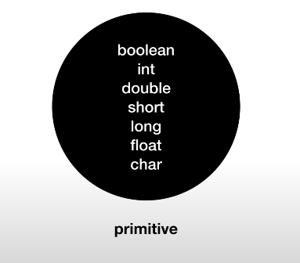
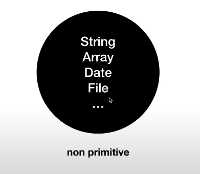
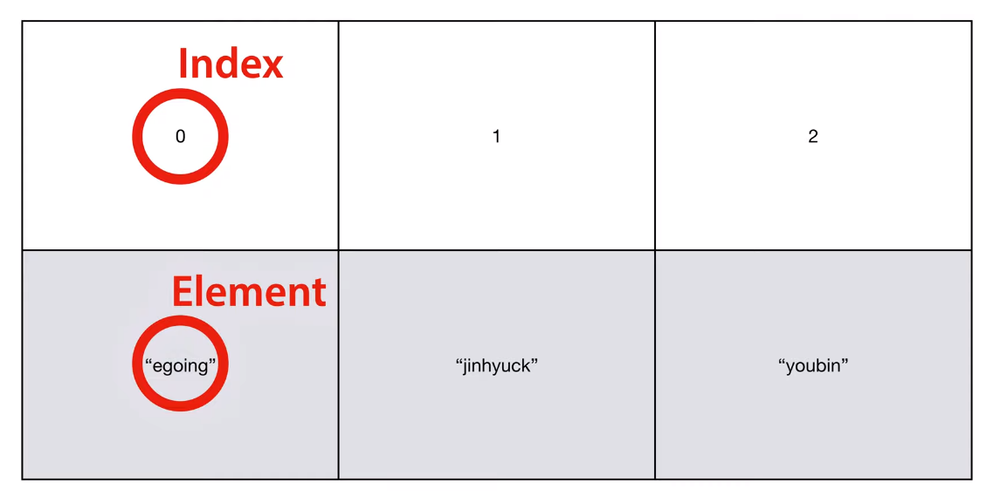

>> 생활코딩 JAVA-제어문의 학습, 정리한 내용입니다. (https://opentutorials.org/course/3975)
# Java flow control
  **자바 제어문**

- 흐름 제어
    - Boolean 
    - 비교연산자
    - 조건문
    - 논리연산자
    - 반복문
    - 배열

# 목차

- [Java flow control](#java-flow-control)
- [목차](#목차)
- [수업소개](#수업소개)
  - [프로그래밍과 흐름 제어](#프로그래밍과-흐름-제어)
    - [자바 프로그래밍 중력 제어](#자바-프로그래밍-중력-제어)
- [Boolean Datatype](#boolean-datatype)
  - [true와 false](#true와-false)
    - [실습](#실습)
    - [결과](#결과)
- [비교연산자](#비교연산자)
    - [숫자를 계산하는 산술연산자](#숫자를-계산하는-산술연산자)
    - [문자열을 더하는 결합연산자](#문자열을-더하는-결합연산자)
    - [양쪽을 비교하는 비교연산자](#양쪽을-비교하는-비교연산자)
    - [연산자 요약](#연산자-요약)
- [조건문 형식](#조건문-형식)
  - [조건문의 실행](#조건문의-실행)
- [조건문 응용](#조건문-응용)
  - [java 실습](#java-실습)
    - [로그인 조건문](#로그인-조건문)
    - [변수 입력](#변수-입력)
- [== vs equals](#-vs-equals)
  - [원시 데이터 타입](#원시-데이터-타입)
  - [원시 데이터가 아닌 데이터 타입](#원시-데이터가-아닌-데이터-타입)
  - [결론](#결론)
- [논리 연산자](#논리-연산자)
  - [실습](#실습-1)
- [배열](#배열)
- [반복문+배열](#반복문배열)
  - [실습내용](#실습내용)
- [종합응용 1](#종합응용-1)
- [종합응용 2](#종합응용-2)

<small><i><a href='http://ecotrust-canada.github.io/markdown-toc/'>Table of contents generated with markdown-toc</a></i></small>


# 수업소개

2021년 4월 10일 토요일
오후 11:55

## 프로그래밍과 흐름 제어
* 프로그래밍은 시간에 흐름에 따라서 프로그램이 동작하도록 하는 것.
* 하지만 사람의 동작에 따라서 프로그램의 작동이 달라져야 하는 상황(id, password 등 상호작용)일 때 조건문, 반복문을 사용
### 자바 프로그래밍 중력 제어
* 프로그래밍이 물이 흐르도록 하는 중력이라면 조건문, 반복문은 댐, 수문
* 이 댐을 동작시키기 위해 알아야 할 것들 : boolean, 비교연산자 
* 더 좋은 것과 더 나쁜 것을 판단하는 것 : 비교.
* 논리학의 위대한 성취인 boolean.
* boolean datatype을 만들어내는 유일한 연산자인 비교 연산자
* 교차로와 같은 조건문
* 순환도로라고 할 수 있는 반복문
* 위의 요소들을 사용해 변화 무쌍한 모습의 똑똑한 애플리케이션을 만들 수 있다.


# Boolean Datatype

2021년 4월 10일 토요일
오후 11:59

## true와 false
* 자바에서 true 와 false 는 boolean 타입에 속하는 단 2가지 데이터
* true 와 false 는 변수의 이름으로 사용할 수 없다.(reserved word : 이미 어떠한 쓰임이 있거나 앞으로 쓰일 가능성이 있는 문자)

### 실습
```java
public class BooleanApp {

	public static void main(String[] args) {
		System.out.println("One"); //string
		System.out.println(1); //integer
		
		System.out.println(true); //boolean
		System.out.println(false); //boolean

		String foo = "Hello world";
		// String true = "Hello world";   reserved word
		
		System.out.println(foo.contains("world"));
		System.out.println(foo.contains("egoing"));
	}
}
```
### 결과
```
One
1
true
false
true
false
```


# 비교연산자

2021년 4월 10일 토요일
오후 11:59

### 숫자를 계산하는 산술연산자
### 문자열을 더하는 결합연산자
### 양쪽을 비교하는 비교연산자
* 왼쪽 오른쪽을 비교해서 결과가 참이면 true, 거짓이면 false를 만들어내는 연산자

```java
System.out.println(1 > 1); //false
System.out.println(1 == 1); //true
System.out.println(1 < 1); //false
System.out.println(1 >= 1); //true	
```

### 연산자 요약
* 단순 할당 연산자(Simple Assignment Operator) 
  * `=` 단순 할당 연산자
* 산술 연산자(Arithmetic Operators)
  * `+` 더하기(문자열 연결로도 사용)
  * `-` 빼기
  * `*` 곱셈
  * `/` 몫
  * `%` 나머지
* 단항 연산자(Unary Operators)
  * `+` 단항 더하기
  * `-` 단항 나누기 
  * `++` 증가
  * `--` 감소
  * `!` 논리 보완 연산자 (블리언 반대로)
* 평등 및 관계 연산자(Equality and Relational Operators)
  * `==` 같다
  * `!=` 같지 않다
  * `>` 크다
  * `>=` 크거나 같다
  * `<` 작다
  * `<=` 작거나 같다
* 조건부 연산자(Conditional Operators)
  * `&&` AND 그리고
  * `||` OR 또한
  * `?:` 삼항연산자 if-then-else문 요약
* 유형 비교 연산자(Type Comparison Operator)
  *	`instanceof` 개체를 지정된 유형과 비교합니다.
* 비트 및 비트 시프트 연산자 (Bitwise and Bit Shift Operators)
  * `~` 단항 비트 보완
  * `<<` 서명된 왼쪽 시프트
  * `>>` 서명된 오른쪽 시프트
  * `>>>` 부호없는 오른쪽 시프트
  * `&` 비트 AND
  * `^` 비트간 배타적 논리합 (XOR)
  * `|` 비트 포함 OR

>출처 : [Operators - Oracle Docs](https://docs.oracle.com/javase/tutorial/java/nutsandbolts/opsummary.html)


# 조건문 형식

2021년 4월 10일 토요일
오후 11:59

## 조건문의 실행
* Conditional Statement 
  * 참이면 {코드}실행 
  * 거짓이면 {코드}실행x
```
if(조건) {
	(참일 때 실행할 코드)
}
```
```
if(조건1) {
	(조건1이 참일 때 실행할 코드)
} else if (조건2) {
	(조건1이 거짓이고 조건2가 참일 때 실행할 코드)
} else {
	(조건1, 2가 거짓일 때 실행할 코드)
}
```


# 조건문 응용

2021년 4월 11일 일요일
오전 12:00

## java 실습
### 로그인 조건문
* Auth 인증 - 로그인 같은 행동 후에 인증하는 과정
```
egoing > hi
else > who are u
```
라는 결과가 나오게

### 변수 입력
* run confuguration > argument [0] egoing

```java
    System.out.println(args[0]);
    String id = "egoing";
    String inputId = args[0];
    
    System.out.println("hi");
    

if (inputId.equals(id) && inputPass.equals(pass)) {
    System.out.println("Master!");
} else {
    System.out.println("WHO ARE U?");
}
```


# == vs equals

2021년 4월 11일 일요일
오전 12:00

## 원시 데이터 타입

* primitive 원시 데이터 타입 - 블리언 정수 실수 숏 롱 플롯 캐릭터
  
## 원시 데이터가 아닌 데이터 타입


## 결론 
* 원시 데이터 타입이 아닐때는 ==대신  equals를 쓰자


# 논리 연산자

2021년 4월 11일 일요일
오전 12:00

```java
// AND
System.out.println(true && true); // true
System.out.println(true && false); // false
System.out.println(false && true); // false
System.out.println(false && false); // false

// OR
System.out.println(true || true); // true
System.out.println(true || false); // true
System.out.println(false || true); // true
System.out.println(false || false); // false

// not
System.out.println(!true); // false
System.out.println(!false); // true
```		
```java
String id = "egoing";
String inputId = args[0];

String pass = "1111";
String pass2 = "2222";
String inputPass = args[1];

System.out.println("hi");

boolean isRightPass = (inputPass.equals(pass) || inputPass.equals(pass2)) ;
if (inputId.equals(id) && isRightPass) {
    System.out.println("Master!");
} else {
    System.out.println("WHO ARE U?");
}
```		

# 반복문

2021년 4월 11일 일요일
오전 12:00

```java
while (조건) {
반복할 코드
}
```
## 실습

```java
while (true) {
	System.out.println(2);
	System.out.println(3);
}
```
* 무한 반복 의도하지 않았다면 굉장히 심각한 오류.

```java
System.out.println("=== while ===");
int i = 0;
while (i < 3) {
	System.out.println(2);
	System.out.println(3);
//			i = i + 1;
	i++;
}
```
* i 변수를 이용해 i의 값을 반복할 때마다 1씩 증가 시키며 i < 3 라는 조건을 이용해 3번 반복하게 만든다.

```java
System.out.println("=== for ===");
		for (int j = 0; j < 3; j++) {
			System.out.println(2);
			System.out.println(3);
		}
```
1. int j = 0 을 무조건 한번만 실행 하고
2.   j++이 실행되고
3.   j<3이 실행되고 (true면 다시 2, 3 반복)

* while 에서는 ini = 0; / i++; / i<3이 떨어져 있어서 코드가 많아지면 간섭으로 인해 망가질 가능성이 높다.

* 하지만 for문에서는 반복문과 관련된 필수요소들이 응집되어 있어 관리하기 편하다.


# 배열

2021년 4월 11일 일요일
오전 12:00
```java
String[] users = new String[3];
users[0] = "egoing";
users[1] = "junhuck";
users[2] = "youbin";
```

```java
System.out.println(users[1]);
System.out.println(users.length);

int[] scores = {10, 100, 100};
System.out.println(scores[1]);
System.out.println(scores.length);
```



# 반복문+배열

2021년 4월 11일 일요일
오전 12:00

## 실습내용

```java
//		<li>egoing</li>
//		<li>jinhuck</li>
//		<li>youbin</li>
```

```java
String[] users = new String[3];
users[0] = "egoing";
users[1] = "junhuck";
users[2] = "youbin";

for (int i = 0; i < users.length; i++) {
    System.out.println("<li>"+users[i]+"</li>");
}
```
```java
<li>egoing</li>
<li>junhuck</li>
<li>youbin</li>
```


# 종합응용 1

2021년 4월 11일 일요일
오전 12:00

```java
String[] users = { "egoing", "jinhuck", "youbin" };
String inputId = args[0];

boolean isLogined = false; // 플래그변수
for (int i = 0; i < users.length; i++) {
    String currentId = users[i];
    if (currentId.equals(inputId)) {
        isLogined = true;
        break; // 반복문 종료
    }
}
System.out.println("Hi,");
if (isLogined) {
    System.out.println("Master!!");
} else {
    System.out.println("Who are you?");
}
```

* run configuration에서 arguments 설정.

* egoing을 넣으면
    ```
    Hi,
    Master!!
    ```
* 다른 값을 넣으면
    ```
    Hi,
    Who are you?
    ```


# 종합응용 2

2021년 4월 11일 일요일
오전 12:00

```java
//String[] users = { "egoing", "jinhuck", "youbin" };
// [][] 배열 안에 배열. users의 각 원소가 배열이고 각각의 배열의 원소의 값은 string
String[][] users = {
        {"egoing", "1111"},
        {"jinhuck", "2222"},
        {"youbin", "3333"}
};
String inputId = args[0];
String inputPwd = args[1];


boolean isLogined = false; // 플래그변수
for (int i = 0; i < users.length; i++) {
    String[] current = users[i];
    if (
            current[0].equals(inputId) &&
            current[1].equals(inputPwd)
    ) {
        isLogined = true;
        break; // 반복문 종료
    }
}
System.out.println("Hi,");
if (isLogined) {
    System.out.println("Master!!");
} else {
    System.out.println("Who are you?");
}
```
* run configuration에서 arguments 설정
* 'egoing 1111'로 설정한 값(올바른 값) 실행시
    ```
    Hi,
    Master!!
    ```
* 'youbin 2222'로 설정한 값(잘못된 패스워드) 실행시
    ```
    Hi,
    Who are you?
    ```
* 'leezche 1111'로 설정한 값(없는 값) 실행시
    ```
    Hi,
    Who are you?
    ```