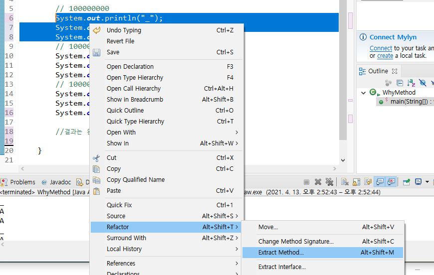
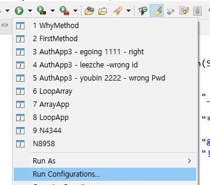
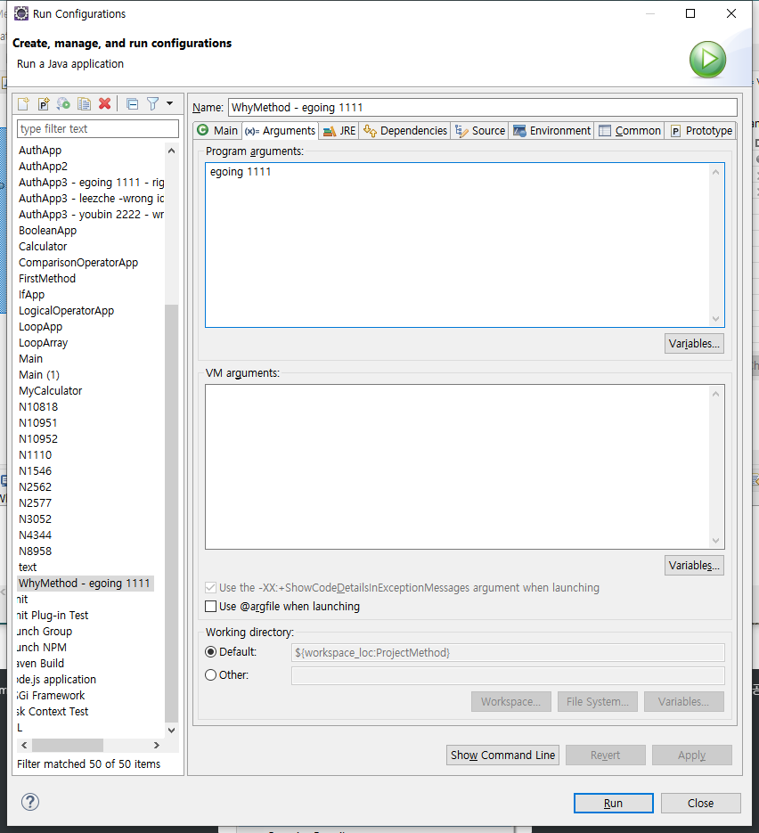
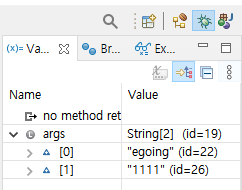
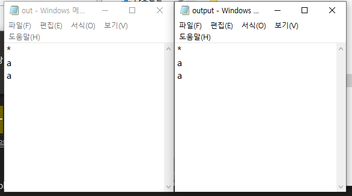

>> 생활코딩 Java - method 를 학습, 정리한 내용입니다. (https://opentutorials.org/course/4024)

- 21.04.14 write on notion
- 21.06.11 notion to git

# Java method

- 자바 메소드
    - 기본 형식
    - 입력
    - 출력
    - 활용

# 목차
* chapter 1 ~ chapter 9
    1. 소개
    2. 이미 익숙한 메소드
    3. 메소드의 기본형식
    4. 메소드의 입력
    5. 메소드의 출력
    6. 메소드의 활용
    7. 정리
    8. 부록 - access level modifiers
    9. 부록 - static

# 소개
## 함수와 메소드
* function = method 
* 복잡한 것을 정리해서 단순하게 만드는 정리정돈 도구

* 복잡한 것을 모아서 이름 하나에 저장하면 이름 하나만 기억하면 된다.

* 연관된 코드를 모아서 그룹핑하고 이름을 붙이면 함수, 자바에서는 method라고 한다.

* 이미 만들어 놓은 메소드를 사용하면 똑같은 코드를 작성하지 않고 재사용할 수 있다.

# 이미 익숙한 메소드

### FirstMethod
```java
public class FirstMethod {

	//<main 메소드
	public static void main(String[] args) {

		//문자 출력 코드(메소드)
		System.out.println("Hello Method");
		//수학 관련 기능 코드(floor는 입력값을 내림해서 출력해주는 메소드)
		System.out.println(Math.floor(1.1));
		
		//자바는 FirstMethod라는 클래스를 실행시키면 main메소드를 실행한다
		
	}
	//main 메소드>
}
```
* 우리는 클래스를 만들 때마다 메소드를 사용해왔다.

# 메소드의 기본형식

### WhyMethod-1

```java
public class WhyMethod {

	public static void main(String[] args) {
		
		// 100000000
		System.out.println("_");
		System.out.println("A");
		System.out.println("A");		
		// 100000000
		System.out.println("_");
		System.out.println("A");
		System.out.println("A");		
		// 100000000
		System.out.println("_");
		System.out.println("A");
		System.out.println("A");		
		
		//같은 코드가 1억번 반복된다면 코드의 관리가 매우 힘들다.
		//중복되는 코드를 하나의 메소드에 담아서 관리하자
					
	}

}
```

### WhyMethod-2

```java
public class WhyMethod {

// 메소드에 중복되는 코드를 넣고 printTwoTImesA 라고 이름 붙였다.
	public static void printTwoTimesA() {
		System.out.println("_");
		System.out.println("A");
		System.out.println("A");
	}

	public static void main(String[] args) {
		
		// 메소드의 이름을 이용해서 중복되는 코드를 바꿔주었다.
		// 100000000
		printTwoTimesA();	
		// 100000000
		printTwoTimesA();		
		// 100000000
		printTwoTimesA();		
		
		//결과는 완전히 같지만 훨씬 효율적인 코드로 바뀌었다.
				
	}

}
```

## 리팩토링
* 코드의 결과는 같지만 훨씬 효율적으로 만드는 것



### WhyMethod-3
```java
public class WhyMethod {
	public static void main(String[] args) {		
		// 100000000
		printTwoTImesA();			
		printTwoTImesA();		
		printTwoTImesA();		
// 한 번에 자동으로 메소드화
// 중복되는 주석이 삭제됨(주의)			
	}
	private static void printTwoTImesA() {
		System.out.println("_");
		System.out.println("A");
		System.out.println("A");
	}
}
```

## 참고

### 접근제한자(4)
* public > protexted > default > private
  * public 은 접근에 제한이 없다.
  * protected는 동일한 패키지나 파생 클래스에서 접근 가능하다.
  * default는 (아무런 접근제한자를 쓰지 않았을때 자동설정) 동일한 패키지 내에서만 접근이 가능하다
  * private은 자기 자신의 클래스 내에서만 접근이 가능하다.


# 메소드의 입력

## 개요

비슷한 메소드를 하나로 통합하고 메소드의 입력 값에 따라 출력 값이 다르게 나오도록 해보자.

### 메소드통합

### WhyMethod-4
```java
public class WhyMethod {

	public static void main(String[] args) {
		
		// 100000000
		printTwoTImesA();	
		// 100000000
		printTwoTImesA();		
		// 100000000
		printTwoTImesA();					
				
	}

	public static void printTwoTImesA() {
		System.out.println("_");
		System.out.println("A");
		System.out.println("A");
	}

}
```

### 위 코드에서 B를 출력하고 싶으면?

### WhyMethod-5

```java
public class WhyMethod {

	public static void main(String[] args) {
		
		// 100000000
		printTwoTImesA();	
		// 100000000
		printTwoTImesA();		
		// 100000000
		printTwoTImesA();					
		printTwoTImesB();					
				
	}

	public static void printTwoTImesA() {
		System.out.println("_");
		System.out.println("a");
		System.out.println("a");
	}
	public static void printTwoTImesB() {
		System.out.println("_");
		System.out.println("b");
		System.out.println("b");
	}

}
```

이렇게 하면 된다. 하지만 좀 아쉽다. 

뭐가? 

예를 들면

```java
System.out.println("Hello Method");
System.out.println(Math.floor(1.1));
```
위 코드에서 floor나 println메소드는 입력값에 따라서 출력값이 다르다! 

이렇게 입력값에 따라서 다른 값을 출력해주는 기능을 원한다.

우리가 하는 것은 단순한 리플레이.

***printTwoTimesA(); 에서 ()안에 입력값을 주면 출력값이 바뀌게 코드를 짤 수 있다!***

### 입력값에 따라 출력값이 다르게 (메소드 정리)

### WhyMethod-6

```java
public class WhyMethod {

	public static void main(String[] args) {
		
		//a또는 b 라는 입력값을 주면 출력값이 다르게 나온다!
		// 100000000
		printTwoTImes("a");	
		// 100000000
		printTwoTImes("a");		
		// 100000000
		printTwoTImes("a");					
		printTwoTImes("b");					
				
	}
	
	//	printTwoTImes라는 메소드를 정의하고 있다. 
	//	()안의 값은 반드시 String이고 들어온 값은 {}안에서 text라는 이름의 변수의 값이 된다.
	public static void printTwoTImes(String text) {
		System.out.println("_");
		System.out.println(text);
		System.out.println(text);
	}	
	
}
```

이렇게 입력값에 따라서 출력값이 다르게 코드를 짜면 메소드를 하나만 지정해도 된다.

표현하고자 하는 출력값에 따라서 메소드를 추가할 필요가 없는 엄청난 효과! 

리팩토링을 한 것! 

### 만약 "-"이런 구분자를 바꾸고 싶다면?

### WhyMethod-7

```java
public class WhyMethod {

	public static void main(String[] args) {
		
		// 100000000
		printTwoTImes("a", "_");	//인자
		// 100000000
		printTwoTImes("a", "*");		
		// 100000000
		printTwoTImes("a", "&");					
		printTwoTImes("b", "!");					
				
	}	
	
	// 문자열 변수 delimiter(구분자)를 설정해주면 구분자 입력값에 따라 다르게 구분자가 출력!
	public static void printTwoTImes(String text, String delimiter) { //파라미터
		System.out.println(delimiter);
		System.out.println(text);
		System.out.println(text);
	}	
	
}
```

### 출력값
```
_
a
a
*
a
a
&
a
a
!
b
b
```
---
## 정리

입력 값에 따라서 출력 값이 다르게 나오도록 해서 더 효율적으로 코드를 만들자. (메소드 통합)

## 추가학습

```java
public static void main(String[] args) {
```

main

main 메소드 자바에서의 약속. 이게 있어야 자바가 main이라는 메소드를 호출해서 우리가 실행하고자하는 프로그램을 (클래스를) 실행시킨다.

String[] 

서로 연관된 문자열을 그룸핑하는 문자열 배열

args

main 메소드를 자바가 실행할 때 입력해주는 입력값이 args를 통해서 들어온다.

### args 입력 값을 넣는 방법.

run configuration > arguments 입력





### debugger

debugger를 통해 args 배열의 인덱스별 요소를 확인할 수 있다.



## parameter(매개 변수)

```java
public static void printTwoTImes(String text, String delimiter)
```

에서 delimiter를 뭐라고 부를까?

'메소드를 사용하는 쪽에서 주입한 값을 메소드 안으로 흘려보내주는 매개자다.' 해서 한국어로는 매개 변수, 영어로는 parameter(파라미터) 라고 부른다.

## argument(인자)

```java
printTwoTImes("a", "-");
```

에서 a, - 와같은 값을 인자, argument라고 부른다.


# 메소드의 출력
## 개요

## 메소드의 출력(output)

### return값이란 무엇인가

### 함수(메소드)란 무엇인가

* 예시
  * Math.floor(1.1) 을 실행시키면 1.0이 된다.
  * Math.floor() 인자로 1.1을 주면 1.0이 되는 것.

***즉 함수는 특정한 기능을 가진 명령어와 같다.***

* 예시
  * 예를 들어 이메일을 보내주는 기능을 원한다고 하자.
  * Email.send("egoing@a.com", "Math floor", Math.floor);
  * 이런식의 기능일 것이다. 하지만 이런 기능은 자바에 없다.
***새로운 기능을 원하면 새로운 메소드를 만들어야 한다.***

### 실습
* 파일을 만들고 text를 2번 입력하는 기능을 메소드로 구현해보자 (출력말고 파일에 입력) 

### WhyMethod-8
```java
import java.io.FileWriter;
import java.io.IOException;

public class WhyMethod {

	public static void main(String[] args) {
						
		printTwoTimes("a", "_");
		writeFileTwoTimes("a", "*");	
		printTwoTimes("a", "&");
		printTwoTimes("b", "!");

	}	
									
	public static void printTwoTimes(String text, String delimiter) {
		System.out.println(delimiter);
		System.out.println(text);
		System.out.println(text);
	}
	
// 파일을 만들고 text를 2번 입력하는 메소드 (출력말고 파일에 입력)
	public static void writeFileTwoTimes(String text, String delimiter) throws IOException {
		FileWriter fw = new FileWriter("output.txt");
		fw.write(delimiter+"\n");
		fw.write(text+"\n");
		fw.write(text+"\n");
		fw.close();
	}

}
```

workspace 디렉토리에 output.txt 파일을 생성하고 fw.write기능으로 입력값을 입력한다.

---

## 중간 정리

즉 연산 결과를 어떻게 사용하느냐에 따라서 메소드를 계속 만들어야 하는 상황이 온다.

하지만 리턴값을 이용하여 메소드를 만들면 여러가지 기능을 가진 메소드를 하나의 공통적인 메소드 리턴값과 자바클래스들을 이용하여 쉽게 정리 정돈 할 수 있다.

---

## 리턴값을 가진 메소드로 정리하기

예시 ) OutputMethod 클래스를 만든다.

a라는 메소드를 만든다 

a메소드가 a가 되게

one 메소드를 만든다

one이 1이 되게


```java
public class OutputMethod {

	public static String a() {
		//..
		return "a";
		//a라는 메소드는 return값이 String이다. (void를 String 으로)
	}
	
	public static int one() {
		return 1;
	}
	
	
	public static void main(String[] args) {

		System.out.println(a());
		System.out.println(one());
	}

}
```

즉 a() 메소드는 return 값(output)이 String이다.

one() 메소드는 실행했을때 정수 1이 되는 것.

---

## 자바에서 메소드의 output?

1. 메소드의 return 뒤에 있는 값이 메소드의 실행 결과. 리턴값은 메소드를 종료시키는 역할도 한다. 리턴 뒤에 있는 코드는 메소드가 종료되었으므로 실행 x (리턴은 메소드가 끝나게 할 때도 사용한다.)
2. 메소드는 그 메소드의 리턴값이 어떤 데이터 타입인지 정해줘야 된다. void는 리턴값이 없다는 뜻. 

---

## WhyMethod 클래스에 리턴값을 이용한 메소드 활용

TwoTimes라는 새로운 메소드를 만들고 리턴값으로 반환해서 다양하게 사용할 수 있도록 하자.

### WhyMethod-9

```java
import java.io.FileWriter;
import java.io.IOException;

public class WhyMethod {

	public static void main(String[] args) throws IOException {
						
		printTwoTimes("a", "_");
		writeFileTwoTimes("a", "*");
		printTwoTimes("a", "&");
		printTwoTimes("b", "!");

	}	
	// twoTimes와 관련된 메소드를 통합하기 위한 twoTimes 메소드 생성
	public static String twoTimes(String text, String delimiter) {
		String out = "";
		out = out + delimiter + "\n";
		out = out + text + "\n";
		out = out + text + "\n";
		return out;
	}
	
	public static void printTwoTimes(String text, String delimiter) {
		System.out.println(delimiter);
		System.out.println(text);
		System.out.println(text);
	}
	
	public static void writeFileTwoTimes(String text, String delimiter) throws IOException {
		FileWriter fw = new FileWriter("output.txt");
		fw.write(delimiter+"\n");
		fw.write(text+"\n");
		fw.write(text+"\n");
		fw.close();
	}

}
```

---

### twoTimes를 main에 적용

```java
// printTwoTimes 메소드 사용하여 출력
printTwoTimes("a", "_");
// twoTimes메소드의 리턴 값을 println기능을 사용하여 출력
System.out.println(twoTimes("a", "_"));
```

위의 두 줄의 코드는 똑같은 코드가 된다.

하지만 twoTimes는 화면에 출력한다는 기능을 빼고 리턴값을 가지고 있기 때문에 여러 기능에서 사용할 수 있다.

---

### twoTimes 메소드를 이용해 writeFile기능을 사용.

```java
// writeFileTwoTimes메소드를 사용
writeFileTwoTimes("a", "*");
// twoTimes메소드를 사용하여 파일에 저장. fw는 인스턴스
FileWriter fw = new FileWriter("out.txt");
fw.write(twoTimes("a", "*"));
fw.close();
```

위의 첫번째 줄 코드와 그 외 아래 쪽 코드는 같은 기능을 출력한다.

workplace에 output.txt와 out.txt가 생성되고 문자열이 입력되었다.

### 결과




---

## 전체 코드

### WhyMethod-10

```java
import java.io.FileWriter;
import java.io.IOException;

public class WhyMethod {

	public static void main(String[] args) throws IOException {

		System.out.println(twoTimes("a", "_"));		
//		writeFileTwoTimes("a", "*");
		FileWriter fw = new FileWriter("out.txt");
		fw.write(twoTimes("a", "*"));
		fw.close();		
//		Email.send("egoing@a.com", "two times a", twoTimes("a", "&"));
		
	}	
	
	public static String twoTimes(String text, String delimiter) {
		String out = "";
		out = out + delimiter + "\n";
		out = out + text + "\n";
		out = out + text + "\n";
		return out;
	}
	
	public static void printTwoTimes(String text, String delimiter) {
		System.out.println(delimiter);
		System.out.println(text);
		System.out.println(text);
	}
	
	public static void writeFileTwoTimes(String text, String delimiter) throws IOException {
		FileWriter fw = new FileWriter("output.txt");
		fw.write(delimiter+"\n");
		fw.write(text+"\n");
		fw.write(text+"\n");
		fw.close();
	}

}
```

printTwoTimes 메소드와 writeFileTwoTimes 메소드의 기능을 

return값을 이용해

twoTimes메소드 하나로 구현할 수 있게 되었다.

---

## 정리

우리는 메소드를 이용하면 다양한 기능을 활용하되, 최대한 깔끔하고 중복된 내용이 없게 정리정돈 할 수 있다.  return을 이용하면 메소드의 값을 저장하고 반환할 수 있고, 적절히 활용하고 응용한다면 여러 메소드들의 기능을 통합하는 메소드를 만들어 효율적인 코드를 짤 수 있을 것이다. return 을 활용하는 메소드 리팩토링에 대한 충분한 연습이 필요할 것이다.

```java
public static 메소드타입 메소드명(변수타입 변수명, 변수타입 변수명) {
		// ... 코드작성	
		return 변수;
	}
```

```java
public static String twoTimes(String text, String delimiter) {
		String out = "";
		out = out + delimiter + "\n";
		out = out + text + "\n";
		out = out + text + "\n";
		return out;
	}
```

---

## 참고

### **Class FileWriter**

- [java.lang.Object](https://docs.oracle.com/javase/7/docs/api/java/lang/Object.html)
- [java.io.Writer](https://docs.oracle.com/javase/7/docs/api/java/io/Writer.html)
- [java.io.OutputStreamWriter](https://docs.oracle.com/javase/7/docs/api/java/io/OutputStreamWriter.html)
- java.io.FileWriter
    - **All Implemented Interfaces:**[Closeable](https://docs.oracle.com/javase/7/docs/api/java/io/Closeable.html), [Flushable](https://docs.oracle.com/javase/7/docs/api/java/io/Flushable.html), [Appendable](https://docs.oracle.com/javase/7/docs/api/java/lang/Appendable.html), [AutoCloseable](https://docs.oracle.com/javase/7/docs/api/java/lang/AutoCloseable.html) public class **FileWriter** extends [OutputStreamWriter](https://docs.oracle.com/javase/7/docs/api/java/io/OutputStreamWriter.html) Convenience class for writing character files. The constructors of this class assume that the default character encoding and the default byte-buffer size are acceptable. To specify these values yourself, construct an OutputStreamWriter on a FileOutputStream. Whether or not a file is available or may be created depends upon the underlying platform. Some platforms, in particular, allow a file to be opened for writing by only one FileWriter (or other file-writing object) at a time. In such situations the constructors in this class will fail if the file involved is already open. FileWriter is meant for writing streams of characters. For writing streams of raw bytes, consider using a FileOutputStream.

> 출처:
<[https://docs.oracle.com/javase/7/docs/api/java/io/FileWriter.html](https://docs.oracle.com/javase/7/docs/api/java/io/FileWriter.html)>

### **Return문**

[컴퓨터 프로그래밍](https://ko.wikipedia.org/wiki/%EC%BB%B4%ED%93%A8%ED%84%B0_%ED%94%84%EB%A1%9C%EA%B7%B8%EB%9E%98%EB%B0%8D)에서 **return 문**은 현재의 [함수](https://ko.wikipedia.org/wiki/%ED%95%A8%EC%88%98_(%ED%94%84%EB%A1%9C%EA%B7%B8%EB%9E%98%EB%B0%8D))에서 값이나 주소를 반환할 때 사용한다.

>출처:
<[https://ko.wikipedia.org/wiki/Return_%EB%AC%B8](https://ko.wikipedia.org/wiki/Return_%EB%AC%B8)>


# 메소드의 활용

## 개요

메소드를 활용하면 어떤 폭발적인 효과가 있을까?

```java
public class AccountingApp {
 
    public static void main(String[] args) {
	    	//공급가액(value of supply)
        double valueOfSupply = 10000.0;
        
        //부가가치세율(VAT rate)
        double vatRate = 0.1;                
        //부가세
        double vat = valueOfSupply * vatRate;
        //합계 (부가세+공급가액)
        double total = valueOfSupply + vat;        
   
        System.out.println("Value of supply : " + valueOfSupply);
        System.out.println("VAT : " + vat);
        System.out.println("Total : " + total);
      
    }
 
}
```

위 코드는 (java1 - 나의 앱 만들기 1 강의 2번째 소스코드를 참고)

공급가액과 부가가치세율이 주어졌을 때 

* 부가세, 합계를 계산하고 

* 공급가액, 부가세, 합계를 출력해준다.

### 문제 상황 가정 - 1억줄의 코드, 오랜만에 다시 코드 확인

만약 코드가 1억줄의 굉장히 복잡한 코드이고 계산 로직 뿐만 아니라 다양한 기능의 로직을 가지고 있다고 가정하자.

만약 내가 1년만에 코드를 다시 열었거나 다른사람이 이 코드를 본다고 한다면 코드의 취지를 파악하는게 정말 어렵다. 

## 정리정돈이 필요하다.

method를 이용해서 로직마다 이름을 붙이고 정리정돈한다면 코드의 목적, 취지를 쉽게 알 수 있다.

```java
public class AccountingApp {

	//변수 이동
	public static double valueOfSupply = 10000.0;
	public static double vatRate = 0.1;

	//getVAT 메소드 생성
	public static double getVAT() {
		return valueOfSupply * vatRate;
	}

	public static void main(String[] args) {	
		double vat = valueOfSupply * vatRate;
		double total = valueOfSupply + vat;
		System.out.println("Value of supply : " + valueOfSupply);
		System.out.println("VAT : " + vat);
		System.out.println("Total : " + total);
	}

}
```

1. getVAT() {}메소드를 생성하고 원하는 값을 리턴값으로 지정해준다.

2. 지역변수인 valueOfSupply와 vatRate를

    getVAT메소드도 이용할 수 있게 

    AccountingApp(class) 안이면서 main 과 getVAT 메소드 밖으로 옮겨준다.

3. 접근제한자(public)을 붙이고 

    정적변수(static )을 붙여줘서 
    
    AccountingApp의 직접적인 소속이라고 정해준다.

### 접근제한자

* 클래스, 메소드, 변수의 접근할 수 있는 제한을 지정해준다.

### 정적 메소드

* 메모리에 한번 할당되어 프로그램이 종료될 때 해제되는 변수 어려 객체가 메모리를 공유한다.

* 만약 valueOfSupply * vatRate 를 사용하는 코드가 1억줄이라면 

* getVAT메소드를 바꿈으로서 1억줄의 코드를 한번에 바꿀 수 있다.

---

```java
public class AccountingApp {
	
	public static double valueOfSupply = 10000.0;	
	public static double vatRate = 0.1;

	
	public static double getVAT() {
		return valueOfSupply * vatRate;
	}	

// getTotal 메소드 생성
	public static double getTotal() {
		return valueOfSupply + getVAT();
	}

	public static void main(String[] args) {		

		System.out.println("Value of supply : " + valueOfSupply);

//메소드를 이용해서 출력
		System.out.println("VAT : " + getVAT());
		System.out.println("Total : " + getTotal());

	}

}
```

1. getTotal 메소드를 만들고 

2. getVAT(), getTotal()메소드 리턴값을 받아서 출력한다.


# 정리

## 메소드
메소드는 서로 연관된 명령을 그룹핑해서 이름을 붙인 것.

## 클래스
클래스는 서로 연관된 메소드와 변수를 그룹핑해서 이름을 붙인 것.

### 클래스와 메소드
* 클래스가 없는 컴퓨터 언어도 있고 최근에야 생긴 언어도 있다.
* 즉 메소드만으로도 많은 것을 할 수 있었다.
* 자신이 아는 것을 충분히 활용해보고 다음 단계로 넘어가자.

### 다음 단계 : 객체지향


# 부록 - access level modifiers

## public
* 수없이 봐왔던 public은 무엇일까?

### 접근제한자 : access level modifiers

* 접근제한자의 종류에는 public , protected , default , private 4개가 있다.

### 메소드 클래스 접근제한자
메소드가 많아지면 서로 연관된 메소드들을 그룹핑하기 위해서 클래스를 만든다.

같은 클래스 안에서만 사용할 수 있는것이 private 

대부분의 상황에서 public을 쓰는게 좋다.

### 접근제한자 복습
* 접근제한자에는 public > protexted > default > private 가 있다

  * public 은 접근에 제한이 없다.

  * protected는 동일한 패키지나 파생 클래스에서 접근 가능하다.

  * default는 (아무런 접근제한자를 쓰지 않았을때 자동설정) 동일한 패키지 내에서만 접근이 가능하다

  * private은 자기 자신의 클래스 내에서만 접근이 가능하다.


# 부록 - static

(객체지향프로그래밍을 배울 때 다시 배울 수 있다.)

## static , no static
* static - class method
  * static이 붙은 메소드는 클래스의 메소드
* no static - instance method
  * static이 없는 메소드는 인스턴스의 메소드

### Print-1
```java
class Print {
	public static void a(String delimiter) {
		System.out.println(delimiter);
		System.out.println("a");
		System.out.println("a");
	}
	public static void b(String delimiter) {
		System.out.println(delimiter);
		System.out.println("b");
		System.out.println("b");
	}
}
public class staticMethod {	
	public static void main(String[] args) {
		Print.a("-");
		Print.b("-");
		
		Print.a("*");
		Print.b("*");
	}
}
```

* Print 클래스 안에 메소드를 넣고 Print.메소드명(파라미터);로 실행했다. 

* Print.a 와 비슷한 코드의 중복을 제거하고 효율적으로 작동시키기 위해 인스턴스를 이용한다.

### Print-2
```java
class Print {
	public String delimiter;
	public void a() {
		System.out.println(this.delimiter);
		System.out.println("a");
		System.out.println("a");
	}
	public void b() {
		System.out.println(this.delimiter);
		System.out.println("b");
		System.out.println("b");
	}
}
public class staticMethod {	
	public static void main(String[] args) {
//		Print.a("-");
//		Print.b("-");
		
		//instance
		Print t1 = new Print();
		t1.delimiter = "-";
		t1.a();
		t1.b();
		
//		Print.a("*");
//		Print.b("*");
		
		Print t2 = new Print();
		t2.delimiter = "-";
		t2.a();
		t2.b();
	}
}
```

`t1`, `t2` 인스턴스를 만들고 `delimiter` 값을 내부적으로 설정한 뒤 인자 대신 `this`를 이용해 출력하면 효율적인 코드를 짤 수 있다.

`Print.a("-");` 에서 `a("-")` 는 클래스인 `Print`의 소속으로 실행 됬었지만 이제 인스턴스인 `t1`의 소속으로 실행되고 있다. 

이렇게 

### 메소드가 인스턴스의 소속일 때는 `static`을 빼줘야 한다.

### 메소드가 클래스의 소속일 때는 `static`을 넣어줘야한다.

이렇게 코드를 짜니 출력값은 똑같다.

하지만 예전과 다르게 ***구분자 입력값을 넣어주지 않아도 된다.***

내부적으로 `delimiter`라는 변수값을 공유하기 때문에

`a()`, `b()` 메소드의 `static`을 빼줬기 때문에 더이상 `Print`클래스의 소속이 아니고 인스턴스의 소속이다. 따라서 `Print.a();`는 동작하지 않는다. 

### Print-3
```java
class Print {
	public String delimiter;
	public void a() {
		System.out.println(this.delimiter);
		System.out.println("a");
		System.out.println("a");
	}
	public void b() {
		System.out.println(this.delimiter);
		System.out.println("b");
		System.out.println("b");
	}
	public static void c(String delimiter) {
		System.out.println(delimiter);
		System.out.println("c");
		System.out.println("c");
	}
}
public class staticMethod {	

	public static void main(String[] args) {
//		Print.a("-");
//		Print.b("-");
		
		//instance
		Print t1 = new Print();
		t1.delimiter = "-";
		t1.a();
		t1.b();
		Print.c("$");
		
//		Print.a("*");
//		Print.b("*");
		
		Print t2 = new Print();
		t2.delimiter = "-";
		t2.a();
		t2.b();
	}

}
```

`static`을 넣은 c()메소드에 는 `Print.c();`가 동작한다.

## 부록 - static 요약

메소드를 정의할때 `static`을 쓰면 클래스의 소속 , 안쓰면 인스턴스의 소속이다