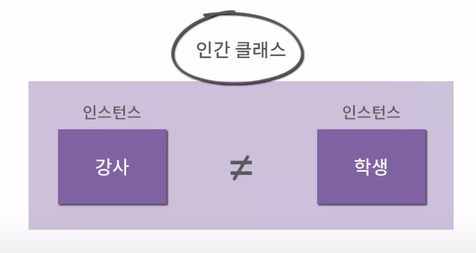
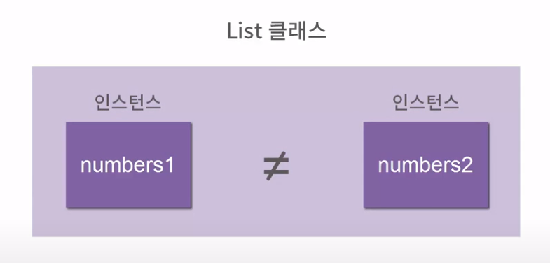

>> programmers 파이썬 입문 강의를 학습, 정리한 내용입니다 (https://programmers.co.kr/learn/courses/2)

# 15. 클래스와 객체지향 프로그래밍

- [15. 클래스와 객체지향 프로그래밍](#15-클래스와-객체지향-프로그래밍)
- [15.1 자료형 다루기](#151-자료형-다루기)
  - [실습 - REPL](#실습---repl)
  - [실습](#실습)
    - [결과](#결과)
  - [자료형 다루기 요약정리](#자료형-다루기-요약정리)
    - [자료형](#자료형)
- [15.2 인스턴스 이해](#152-인스턴스-이해)
  - [실습 - REPL](#실습---repl-1)
  - [실습(1)](#실습1)
    - [결과](#결과-1)
  - [실습 (2)](#실습-2)
    - [결과](#결과-2)
  - [인스턴스 이해 요약정리](#인스턴스-이해-요약정리)
    - [클래스](#클래스)
    - [인스턴스](#인스턴스)
- [15.3 클래스 만들기](#153-클래스-만들기)
  - [클래스를 쓰는 이유](#클래스를-쓰는-이유)
  - [실습 `make_class.py`](#실습-make_classpy)
    - [결과](#결과-3)
  - [실습](#실습-1)
  - [클래스 만들기 요약정리](#클래스-만들기-요약정리)
    - [클래스 선언](#클래스-선언)
    - [인스턴스 생성](#인스턴스-생성)
- [15.4 모델링](#154-모델링)
  - [실습 `class_modeling.py`](#실습-class_modelingpy)
    - [결과](#결과-4)
  - [모델링 요약정리](#모델링-요약정리)
    - [모델링(modeling)](#모델링modeling)
- [15.5 메소드 이해하기](#155-메소드-이해하기)
  - [실습 `class_method.py`](#실습-class_methodpy)
  - [실습](#실습-2)
    - [문제 설명](#문제-설명)
    - [예를 들어,](#예를-들어)
    - [답](#답)
  - [메소드 이해하기 요약정리](#메소드-이해하기-요약정리)
    - [메소드(Method)](#메소드method)
    - [클래스 내부에 함수를 포함시킨 예](#클래스-내부에-함수를-포함시킨-예)
    - [self](#self)
- [15.6 특수한 메소드](#156-특수한-메소드)
  - [실습 `special_method.py`](#실습-special_methodpy)
    - [결과](#결과-5)
  - [특수한 메소드 요약정리](#특수한-메소드-요약정리)
    - [초기화 함수](#초기화-함수)
    - [문자열화 함수](#문자열화-함수)

<small><i><a href='http://ecotrust-canada.github.io/markdown-toc/'>Table of contents generated with markdown-toc</a></i></small>


# 15.1 자료형 다루기
파이썬의 자료형에 대해 알아보자
* `type()`
* `isinstance(value, type)`
## 실습 - REPL
```powershell
>>> s = "Hello World"
>>> s
'Hello World'
>>> type(s)
<class 'str'>
>>> f = 3.14
>>> type(f)
<class 'float'>
>>> i = 42
>>> type(i)
<class 'int'>
>>> type(42.0)
<class 'float'>
>>> 42 == 42.0
True
>>> isinstance(42, int)
True
>>> isinstance(42, float)
False
>>> isinstance(42.0, float) 
True
>>> isinstance(42.0, int)    
False
```
## 실습
```py
my_list = [1, 2, 3]
my_dict = {"풀": 800, "색연필": 3000}
my_tuple = (1, 2, 3)
number = 10
real_number = 3.141592

print(type(my_list))
print(type(my_dict))
print(type(my_tuple))
print(type(number))
print(type(real_number))
```
### 결과
```
<class 'list'>
<class 'dict'>
<class 'tuple'>
<class 'int'>
<class 'float'>
```
## 자료형 다루기 요약정리
### 자료형
* `type( a ) # type( 변수명 )` : 자료형
* `isinstance( 42, int ) # isinstance( 값, 자료형 )` : 자료형 검사


# 15.2 인스턴스 이해
클래스와 인스턴스를 알아보자
## 실습 - REPL
```powershell

```
* 인스턴스는 `numbers1`이나 `characters`같이 값을 가지는 만들어져서 사용 가능한 리스트를 의미
* 클래스는 `numbers1`이 가지는 타입 리스트라는 타입을 의미
* 비유

  * 인간클래스의 각각의 인스턴스
    *  우리는 모두 인간이지만 각자 다 다르다.
*  프로그래밍에서도 똑같다.

  * '`numbers1`인스턴스와 `numbers2`인스턴스는 다르지만 같은 List클래스다'라고 말할 수 있다.

## 실습(1)
```py
list1 = [1, 2, 3]
list2 = [1, 2, 3]

if list1 is list1:
    print("당연히 list1과 list1은 같은 인스턴스입니다.")

if list1 == list2:
    print("list1과 list2의 값은 같습니다.")
    if list1 is list2:
        print("그리고 list1과 list2는 같은 인스턴스입니다.")
    else:
        print("하지만 list1과 list2는 다른 인스턴스입니다.")
```
### 결과
```
당연히 list1과 list1은 같은 인스턴스입니다.
list1과 list2의 값은 같습니다.
하지만 list1과 list2는 다른 인스턴스입니다.
```
## 실습 (2)
```py
list1 = list(range(10))
list2 = [1, 2, 3]

if isinstance( list1 , list) and isinstance( list2 , list):
    print("list1과 list2는 둘 다 list클래스 입니다.")
```
### 결과
```
list1과 list2는 둘 다 list클래스 입니다.
```
## 인스턴스 이해 요약정리
### 클래스
* 함수나 변수들을 모아 놓은 집합체
### 인스턴스
* 클래스에 의해 생성된 객체
* 인스턴스 각자 자신의 값을 가지고 있다.


# 15.3 클래스 만들기
클래스를 직접 만들어 보자
* 클래스 생성
    ```py
    class 클래스명():
    ```
* 클래스 호출(함수처럼 호출)
    ```py
    인스턴스1 = 클래스명()
    인스턴스2 = 클래스명()
    ```
* 리스트에서 인스턴스를 만들 때와 비슷하다
    ```py
    >>> a = list()
    >>> a
    []
    >>> isinstance(a,list)
    True
    ```
* 리스트 클래스의 특징은 '값을 순서대로 저장할 수 있다, 그리고 그 값을 변경할 수 있다.'는 것이었다.
* 각각의 클래스는 이런 특성들을 가지고 있다.
## 클래스를 쓰는 이유
* 클래스와 인스턴스는 코드를 만드는데 꼭 필요한 도구는 아닌 인위적인 도구
* 쓴다고 이전에 풀 수 없던 문제를 풀 수 있게 되지는 않는다.
* 하지만 사람이 코드를 이해하기 더 쉽게 해준다.
* 함수만 사용하는 코드와 비교했을 때 코드의 양이 복잡해지고 많아질수록 더 간단하게 만들 수 있다.(객체만 추가하면 되므로)
## 실습 `make_class.py`
```py
class Human():
    '''사람'''

person1 = Human()
person2 = Human()

person1.language = '한국어'
person2.language = 'English'

person1.name = '서울시민'
person2.name = '인도인'

def speak(person):
    print("{}이 {}로 말을 합니다.".format(person.name,person.language))

Human.speak = speak

person1.speak()
person2.speak()
```
### 결과
```
서울시민이 한국어로 말을 합니다.
인도인이 English로 말을 합니다.
```
* 클래스를 이용해 사람이라는 하나의 개념이 가지는 이름이나 언어라는 값과 말한다는 행동을 한번에 하나의 클래스 안에서 다룰 수 있도록 해준다.
## 실습
```py
class Car():
    '''자동차'''

taxi = Car()

# taxi.name에 "택시"라는 값을 저장하세요.
taxi.name = "택시"
```
## 클래스 만들기 요약정리
### 클래스 선언
```py
class Human( ):
    '''사람'''
```
### 인스턴스 생성
```py
person1 = Human( )
person2 = Human( )
```
* 클래스와 인스턴스를 이용하면 데이터와 코드를 사람이 이해하기 쉽게 포장할 수 있다.
(현실의 개념을 더 쉽게 코드에서 표현하기 위해 사용)

# 15.4 모델링
Human클래스를 더 풍부하게 만들어 보자
* 먹으면 살이 찌고 안 먹으면 살이 빠지는 존재라는 것을 표현해보자
## 실습 `class_modeling.py`
```py
class Human():
    '''인간'''

#person = Human()
#person.name = '철수'
#person.weight = 60.5

def create_human(name, weight):
    person = Human()
    person.name = name
    person.weight = weight
    return person

Human.create = create_human

person = Human.create("철수", 60.5)

def eat(person):
    person.weight += 0.1
    print("{}가 먹어서 {}kg이 되었습니다.".format(person.name, person.weight))

def walk(person):
    person.weight -= 0.1
    print("{}가 걸어서 {}kg이 되었습니다.".format(person.name, person.weight))

Human.eat = eat
Human.walk = walk

person.walk()
person.eat()
person.walk()
```
* Human 클래스를 만들고 create_human, dat, walk 함수를 만든 뒤 클래스에 함수를 다 넣어 주었다.
### 결과
```
철수가 걸어서 60.4kg이 되었습니다.
철수가 먹어서 60.5kg이 되었습니다.
철수가 걸어서 60.4kg이 되었습니다.
```
## 모델링 요약정리
### 모델링(modeling)
* 클래스로 현실의 개념을 표현하는 것


# 15.5 메소드 이해하기
클래스와 메소드에 대해 알아보자
* 클래스에 포함되어 있는 함수를 가리키는 말이 메소드
* 클래스가 메소드를 다루기 위해 제공하는 문법 : 클래스 안에 바로 함수 적기
## 실습 `class_method.py`
`class_modeling.py`의 코드를 수정해보자 
```py
class Human():
    '''인간'''
    def create(name, weight):
        person = Human()
        person.name = name
        person.weight = weight
        return person

    def eat(person):
        person.weight += 0.1
        print("{}가 먹어서 {}kg이 되었습니다.".format(person.name, person.weight))

    def walk(person):
        person.weight -= 0.1
        print("{}가 걸어서 {}kg이 되었습니다.".format(person.name, person.weight))

person = Human.create("철수", 60.5)
person.walk()
person.eat()
person.walk()
```
* 클래스에 속한 메서드가 잘 드러난다
* 함수를 클래스에 저장해주는 작업을 하지 않아도 된다.

## 실습
### 문제 설명
taxi는 Car클래스의 인스턴스로 "택시"라는 이름을 가지고 있습니다.taxi.run()을 호출할 수 있도록 Car클래스 밖에 정의되어 있는 run함수를 클래스 안으로 가져오세요. 가져온 다음에는 run의 매개변수인 car를 self로 변경하세요.

메소드는 클래스에 포함되어 있는 함수를 가리킵니다.
함수를 클래스 안으로 가져오려면 그 함수를 클래스 안에 넣어 들여쓰고, 메소드의 첫 번째 인자를 self로 변경해야 합니다.

### 예를 들어,
```py
class Human( ):
    '''인간'''
    def create( name, weight ): # 다음 강의에서 자세히 설명
        person = Human()
        person.name = name
        person.weight = weight
        return person

    def eat( self ):
        self.weight += 0.1
        print("{}가 먹어서 {}kg이 되었습니다".format(self.name, self.weight))
```
### 답
```py
class Car():
    '''자동차'''
    def run(self):
        print("{}가 달립니다.".format(self.name))

taxi = Car()
taxi.name = "택시"
taxi.run()
```

## 메소드 이해하기 요약정리
### 메소드(Method)
* 메소드는 함수와 비슷하다.
* 클래스에 묶여서 클래스의 인스턴스와 관계되는 일을 하는 함수
### 클래스 내부에 함수를 포함시킨 예
```py
class Human( ):
    '''인간'''
    def create( name, weight ): # 다음 강의에서 자세히 설명
        person = Human()
        person.name = name
        person.weight = weight
        return person

    def eat( self ):
        self.weight += 0.1
        print("{}가 먹어서 {}kg이 되었습니다".format(self.name, self.weight))

    def walk( self ):
        self.weight -= 0.1
        print("{}가 걸어서 {}kg이 되었습니다".format(self.name, self.weight))

    def speak(self, message):
        print(message)

person = Human.create("철수", 60.5)

person.eat()
person.speak("안녕하세요")
```
### self
* 메소드의 첫번째 인자
* 인스턴스의 매개변수를 전달 할 때는 self 매개변수는 생략하고 전달


# 15.6 특수한 메소드 
클래스에서 사용할 수 있는 특수한 메소드를 알아보자
## 실습 `special_method.py`
```py
class Human():
    '''인간'''

    def __init__(self, name, weight):
        '''초기화 함수'''
        print("__init__실행")
        self.name = name
        self.weight = weight
        
    def __str__(self):
        '''문자열화 함수'''
        return "{}(몸무게 {}kg)".format(self.name, self.weight)

    def eat(self):
        self.weight += 0.1
        print("{}가 먹어서 {}kg이 되었습니다.".format(self.name, self.weight))

    def walk(self):
        self.weight -= 0.1
        print("{}가 걸어서 {}kg이 되었습니다.".format(self.name, self.weight))

person = Human("사람", 60.5) # Human클래스의 인스턴스를 person에 저장
print(person)
```
### 결과
```
__init__실행
사람(몸무게 60.5kg)
```

## 특수한 메소드 요약정리
### 초기화 함수
* `__init__` : 인스턴스를 만들 때 실행되는 함수
### 문자열화 함수
* ` __str__` : 인스턴스 자체를 출력 할 때의 형식을 지정해주는 함수
```py
class Human( ):
    '''인간'''
    def __init__( self, name, weight ):
        '''초기화 함수'''
        self.name = name
        self.weight = weight

    def __str__( self )
        '''문자열화 함수
        return "{} ( 몸무게 {}kg )".format( self.name, self.weight )

person = Human( "사람", 60.5 ) # 초기화 함수 사용
print( person ) # 문자열화 함수 사용
```