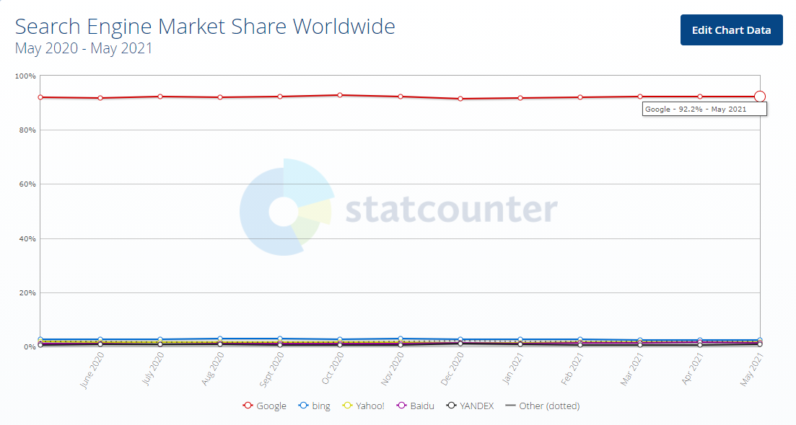

>> programmers 파이썬 입문 강의를 학습, 정리한 내용입니다 (https://programmers.co.kr/learn/courses/2)

# 9. 활용하기

- [9. 활용하기](#9-활용하기)
- [검색하기](#검색하기)
  - [검색 요령](#검색-요령)
  - [실습 - 구글 검색](#실습---구글-검색)
    - [날짜와 시간을 구하는 방법을 검색해보자](#날짜와-시간을-구하는-방법을-검색해보자)
    - [실습 테스트 및 활용](#실습-테스트-및-활용)
  - [검색하기 요약정리](#검색하기-요약정리)
    - [프로그래밍 검색 요령](#프로그래밍-검색-요령)
- [문서찾기](#문서찾기)
  - [실습 - 문서 찾기](#실습---문서-찾기)
  - [웹사이트 검색과 공식 문서를 보는 것에는 어떤 차이가 있을까?](#웹사이트-검색과-공식-문서를-보는-것에는-어떤-차이가-있을까)
    - [스택오버플로나 블로그](#스택오버플로나-블로그)
    - [공식문서](#공식문서)
  - [문서찾기 요약정리](#문서찾기-요약정리)
    - [공식문서](#공식문서-1)
    - [구글 또는 stackoverflow.com](#구글-또는-stackoverflowcom)

<small><i><a href='http://ecotrust-canada.github.io/markdown-toc/'>Table of contents generated with markdown-toc</a></i></small>


# 검색하기
프로그래밍의 핵심은 강의로 배울 수 있지만, 세부사항까지 모두 강의 배울 수는 없다.  
모르는게 있거나 생각이 나지 않는게 있다면 검색을 활용하자.  
## 검색 요령
1. 구글 검색 활용 
   * 구글은 전 세계적으로 가장 많이 사용하는 인터넷 검색엔진 서비스로 압도적인 자료의 양을 자랑한다.  
   * 아무리 복잡하고 어려운 문제라도 구글 어딘가에 반드시 답이 존재할 가능성이 매우 높다!
   * 구글의 점유율
     * 구글은 전세계 검색엔진 시장의 약 92%를 점유하고 있다
    
2. `파이썬3` 또는 `python3`를 포함하여 검색해라
3. 코드 포함한 글을 선택
    * 검색 후 정보를 선택할 때 말로 설명만 되어있는 것보다 코드가 포함되어 있는 정보를 선택해라.
    * 코드를 보고 빠르게 답을 찾자
4. REPL을 사용하여 예제 테스트
    * 직접 실험해보고 확인할 수 있는 문제는 REPL을 활용해 직접 테스트 해보고 답을 찾아보자
5. 영어로 검색 
    * 복잡할수록 디테일할수록 영어로 된 자료가 훨씬 더 많다.
    * stackoverflow의 글은 질문은 읽지 않고 답 위주로 보자
    * 코드만 보고도 이해가 된다면 설명은 읽지 않아도 된다.
* 명사와 동사 사용 구분
   * 파이썬의 용어는 주로 명사이고 가끔 동사도 있는데 가능하면 정확히 집어넣자.  
   * 일반 동사는 정확히 써야 하는 단어를 모른다면 적당히 이것저것 바꿔가면서 살펴보자.

## 실습 - 구글 검색
### 날짜와 시간을 구하는 방법을 검색해보자
* 구글검색 "python3 today date"
  >https://stackoverflow.com/questions/17053099/how-to-print-current-date-on-python3
  * 선택한 정보 코드
    ```py
    import datetime
    now = datetime.datetime.now()

    print(now.year)
    ```
### 실습 테스트 및 활용
```powershell
>>> import datetime
>>> now = datetime.datetime.now()
>>> print(now) 
2021-06-30 17:10:31.379167
>>> print(now.year)
2021
>>> now
datetime.datetime(2021, 6, 30, 17, 10, 31, 379167)
>>> print(now.year, now.month, now.day, now.hour, now.second)
2021 6 30 17 31
>>> print('오늘은 {}년 {}월 {}일이고 지금 시간은 {}시 {}분 {}초 입니다'.format(now.year, now.month, now.day, now.hour, now.minute, now.second))
오늘은 2021년 6월 30일이고 지금 시간은 17시 10분 31초 입니다
>>>
```
## 검색하기 요약정리
### 프로그래밍 검색 요령
1. 구글
2. 파이썬3 또는 python3을 포함
3. 코드 포함 글
4. REPL 테스트
5. 영어 검색


# 문서찾기
문서를 찾아서 읽는 법을 배워보자  
* 검색해서 찾는 것과 문서에서 찾는 것은 조금 다르다  
* 영어도 읽어야 한다. 
* 이미 검색어를 알고 있다면 검색이 쉽고 공식문서가 거의 항상 맨 위에 뜬다
## 실습 - 문서 찾기
1. random모듈 자세한 내용을 알기 위해 검색
   * 구글검색 - "python3 random module"
     * 공식문서가 맨 위에 뜬다.
       * >https://docs.python.org/3/library/random.html
2. 무작위로 숫자를 만들어 내는 방법
   * 구글검색 - "python3 random number generation"
     * 혹시 안나오면 "site:python.org"뒤에 추가
     * `site:` 은 해당 사이트의 페이지만 모아서 보여주는 구글의 검색 기능
   * 구글검색 - "python3 random number generation site:python.org"
     * 공식문서가 맨 위에 뜬다.
       * >https://docs.python.org/3/library/random.html

## 웹사이트 검색과 공식 문서를 보는 것에는 어떤 차이가 있을까?
### 스택오버플로나 블로그
* 특정 문제를 해결하기 위핸 지엽적인 코드가 올라오는 경우가 많다.
* 따라서 나와 똑같은 문제를 겪는 사람이 질문을 올렸다면 한 번에 정답 코드만 찾을 가능성이 높다.
### 공식문서
* 그보다 좁은 범위인 함수 하나의 사용법을 알기 위해 쓰거나  
* 그보다 넚은 범위로 내가 어떤 답을 원하는지 정확히 몰라서 비슷한 기능을 살펴 보고 싶거나  
* 어떤 모듈에서 할 수 있는 일을 모두 살피기 위해서 쓰기도 한다.
* 공식 문서의 예제 코드는 제한적이고 내가 원하는 문제를 정확히 풀어주지 않는 경우가 많다. (좀더 읽어야 한다)
* 대신 공식 문서는 각각의 모듈과 함수의 사용법과 하는 일을 정확히 알려준다.
* 문제가 복잡해질수록 원하는 답을 찾기 힘들 것이다.

## 문서찾기 요약정리
### 공식문서
* 필요한 내용을 둘러보고 싶을때
* 파이썬 내장 모듈과 함수의 정보가 필요할 때
### 구글 또는 stackoverflow.com
* 문제의 구체적인 해결 방법이 알고 싶을 때
* 구글 검색시 사이트 제한 기능 활용 
  * site : stackoverflow.com