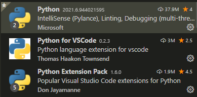

>> programmers 파이썬 입문 강의를 학습, 정리한 내용입니다 (https://programmers.co.kr/learn/courses/2)

# Phthon basic1

- [Phthon basic1](#phthon-basic1)
- [파이썬 설치](#파이썬-설치)
  - [경로설정](#경로설정)
  - [python 실행 확인](#python-실행-확인)
    - [`python` 명령어 입력](#python-명령어-입력)
    - [powershell에서 `py` 명령어 입력](#powershell에서-py-명령어-입력)
  - [python DOCS](#python-docs)
- [에디터 설치](#에디터-설치)
  - [Notepad++](#notepad)
  - [VScode](#vscode)
  - [파일 만들기](#파일-만들기)
    - [실습 `test.py`](#실습-testpy)
    - [cmd 결과](#cmd-결과)
- [Hello World!](#hello-world)
  - [powershell명령](#powershell명령)
  - [print() 함수](#print-함수)
  - [함수란?](#함수란)
    - [실습 `hello.py`](#실습-hellopy)
    - [cmd 결과](#cmd-결과-1)
    - [실습 2](#실습-2)
    - [결과](#결과)

<small><i><a href='http://ecotrust-canada.github.io/markdown-toc/'>Table of contents generated with markdown-toc</a></i></small>


# 파이썬 설치
* python.org에서 version 3.x를 다운로드  
(맥과 리눅스에서는 파이썬이 기본 설치되어 있다.)
## 경로설정
* 설치 시 "Add Python 3.x to Path"를 선택  
(이용에 편리를 위해 경로 추가 설정)
* PYTHONHOME
  * 표준 파이썬 라이브러리의 위치 변경
  * lib\pythonversion에서 검색된다
  * prefix 및 exec_prefix 기본값은 \user\local
* PYTHONPATH
  * 모듈 파일의 기본 검색 경로 확장
  * 기본 검색 경로 prefix/lib/pythonversion
>https://docs.python.org/3.9/using/cmdline.html?highlight=pythonhome#envvar-PYTHONHOME
## python 실행 확인
### `python` 명령어 입력
```
PS C:\Users\Junha> python
Fatal Python error: initfsencoding: unable to load the file system codec
ModuleNotFoundError: No module named 'encodings'

Current thread 0x000061c4 (most recent call first):
PS C:\Users\Junha>
```
* cmd, powershell에서 `python`명령어 x, `py`명령어 o  
* bash는 둘 다 o

### powershell에서 `py` 명령어 입력
```
PS C:\Users\Junha> py
Python 3.9.5 (tags/v3.9.5:0a7dcbd, May  3 2021, 17:27:52) [MSC v.1928 64 bit (AMD64)] on win32
Type "help", "copyright", "credits" or "license" for more information.
>>>
```
>cmd에서 실행하기 https://docs.python.org/3.9/using/windows.html#python-launcher-for-windows

## python DOCS
>튜토리얼 https://docs.python.org/3.9/tutorial/index.html

>파이썬 도큐먼테이션 https://docs.python.org/3.9/index.html

>파이썬 뉴스 https://docs.python.org/3.9/whatsnew/3.9.html

>윈도우에서 파이썬 사용하기 https://docs.python.org/3.9/using/windows.html

# 에디터 설치
## Notepad++
## VScode
* extension 3개 설치
  1. Python - MS에서 제공하는 파이썬 전반적인 지원 툴
  2. Python for VSCode - 신택스 하이라이팅(코드 문법 색), 스니펫(코드단축키), 린팅(코드를 작성할 때 규약을 자동으로 맞춰주는 도구) 제공
  3. Python Extension Pack
     * Python, MagicPython, Jinja, Django, Visual Studio IntelliCode 관련 팩 제공



## 파일 만들기
1. 파일 새로 만들기(new file)
2. .py로 파일을 저장한다  
  (확장자 py 파일 : 프로그램 파일이나 파이썬 해석 된 객체 지향 프로그래밍 언어로 작성된 스크립트)
  * 에디터에서 syntax highlighting 제공
3. 실행
  * terminal 환경에서 `py 파일명.py` 명령어로 실행

### 실습 `test.py`
```py
print("Hello")
```
### cmd 결과
```
C:\Users\Junha\python-workspace>py test.py
Hello!
```

# Hello World!
## powershell명령
ls: 현재 디렉토리(폴더)의 내용을 확인하는 명령
cd: powershell에서 현재 디렉토리(폴더)를 바꾸는 명령
## print() 함수
괄호 안에 있는 내용을 화면에 출력하는 명령
화면에 표시하고 싶은 글은 따옴표(')로 묶어서 표현
예. print('hello, world')
## 함수란?
파이썬이 특정한 기능(예. 화면에 출력)을 수행하도록 하는 명령

### 실습 `hello.py`
Hello World!를 출력해보자
```py
print('Hello, world!')
```
* `print` - print함수. 
  * 파이썬에서 화면에 출력하는 함수
* `()` - 소괄호. 
  * print함수를 실행할 때 어떤 글씨를 화면에 출력할지 알려주는 역할
* `''` - 따옴표. 
  * 사람이 이해할 수 있는 글과 파이썬이 이해할 수 있는 글을 나누는 역할. 
  * 짝이 항상 맞아야 한다.
  * 큰 따옴표 작은 따옴표는 똑같이 인식된다.
  * 혼란을 피하기 위한 규칙 -
    * 큰따옴표는 텍스트, 
    * 작은 따옴표는 기호와 식별자. 
    * 3개의 큰따옴표는 정규표현식과 docstrings에 사용한다.
### cmd 결과
```
C:\Users\Junha\python-workspace>py hello.py
Hello, world!
```
### 실습 2 
Hello World!를 3번 출력
>> 3줄을 쓰면 된다.
```py
print('Hello, world!')
print('Hello, world!')
print('Hello, world!')
```
### 결과
```
C:\Users\Junha\python-workspace>py hello.py
Hello, world!
Hello, world!
Hello, world!
```
