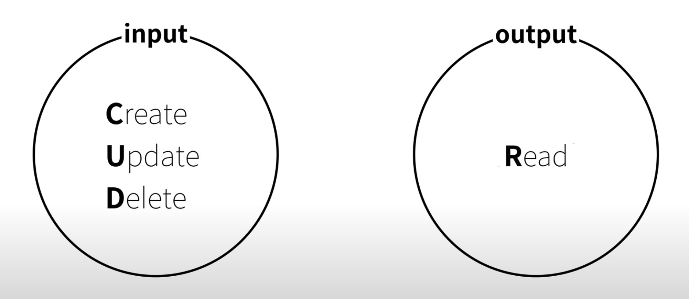
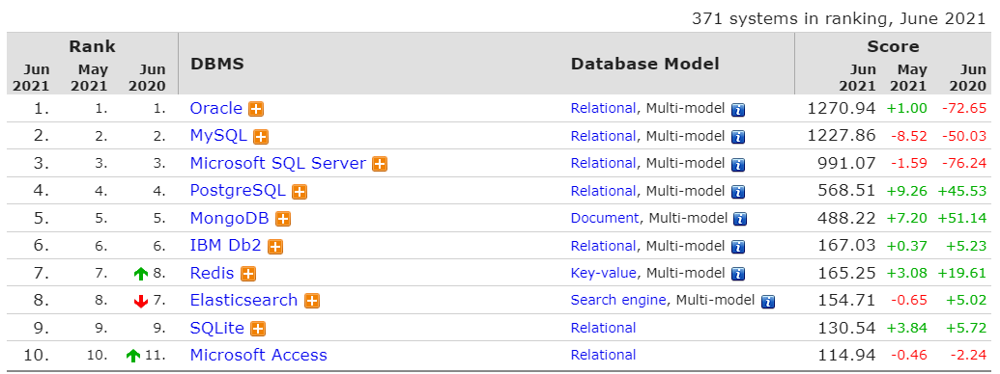
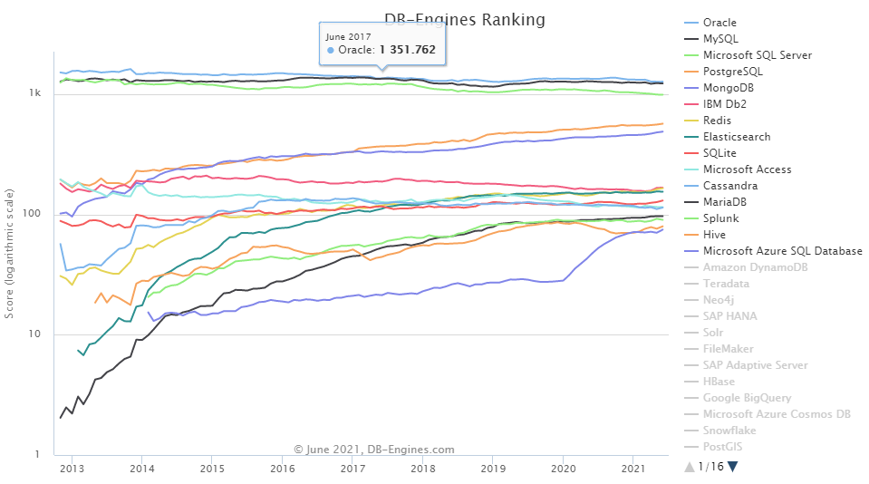

>> 생활코딩 DATABASE1을 학습, 정리한 내용입니다. (https://opentutorials.org/course/3162)

# Database.md
    - Information technology
      - Database
      - File, Database
      - Database software products
  
# 목차
* chapter 1 ~ chapter 4
    1. database1 소개

# database1

2021년 3월 28일 일요일
오후 10:35

## data 
* data를 통해서 다양한 일을 할 수 있다.
  * 인터넷에 연결된 웹과 앱을 통해 소식과 지식을 전파할 수 있다
  * 빅데이터나 인공지능과 같은 기술을 이용해 대규모의 데이터로부터 통찰력있는 분석 결과를 얻어 낼 수 있다.  

## file
* 데이터를 저장하고 꺼낼 수 있는 도구 중 하나
* disk와 같은 저장매체 정보 단위
* 운영체제는 파일 조작 API 제공
* 파일의 이름과 확장자로 식별.

### file의 이용
* 주어진 이름으로 파일을 만든다.
* 파일에 접근할 수 있는 권한에 관한 특성을 설정한다.
* 파일을 열어 콘텐츠를 사용한다.
* 콘텐츠를 읽거나 새로 고친다.
* 새로 고친 콘텐츠를 안정적인 기억 장소로 위임한다.
* 다시 열릴 때까지 접근을 못하게 하기 위해 파일을 닫아 둔다.

### file의 장단점
* 장점 (하도 많아서 열거하기 힘들 정도)
  * 배우기 쉽다
  * 운영체제마다 제공해서 어디서나 사용 가능
  * 심지어 이메일이나 메신저를 이용해서 간편하게 전송
* 단점
  * 성능, 보안, 편의성의 한계
  
## database
파일의 한계를 극복하기 위해 고안된 전문화된 데이터 관리 소프트웨어
* 넓은 의미: 여러 사람이 공유하고 사용할 목적으로 통합 관리되는 정보의 집합
* 좁은 의미: DBMS (database management system) 많은 사람들에게 데이터베이스의 데이터를 사용할 수 있도록 도와주는 소프트웨어 도구모음
  * ex) oracle, MySQL, Postgres, mongoDB, MS-access 등
  * DBMS의 장점
    * DBMS는 자료의 통합성 증가
    * DBMS는 자료와의 관계성을 정의
    * DBMS는 데이터의 접근성이 용이
    * 데이터 통제가 강화
    * 애플리케이션 프로그램들을 쉽게 개발하고 관리 가능
    * 보안이 강화

# 데이터베이스의 본질

2021년 3월 28일 일요일
오후 10:36

## 데이터베이스의 데이터를 어떻게 입력하고 출력할 것인가?
* 입력 - CREATE, Update, Delete
* 출력 - READ
  

# file vs database

2021년 3월 28일 일요일
오후 10:36

* 가장 간단한 데이터를 저장하는 방법인 file이 어떻게 database화 되어 가는가
  
## file -> database
* 데이터를 생산 저장하기에
파일은 검색, 파일 정렬, 생산효율, 정보감추기 등 제약이 있다.
* 만약 어떤 주제의 날짜, 이름, 설명과 같은 분류로 데이터들을 저장하고 관리한다면 여러 개의 파일로 저장하고 관리, 검색하는 것보다  스프레드시트를 사용해서 데이터를 검색하는 것이 빠르다.
### 스프레드시트 
* 제품종류
  * ms 엑셀 , google 문서도구, openoffice
* 표 형식으로 데이터를 조직, 분석, 저장하는 컴퓨터 애플리케이션.
* 주로 회계, 경리등의 계산에 많이 쓰였으나
* 현재는 그래프 및 간단한 자료관리기능, 회계 통계 처리 기능, 값 예측, 자동화 기능 등이 가능해 다양하게 사용한다.

### File -> Spreadsheet -> Database
* 스프레드시트는 어느정도 데이터베이스적인 특성을 가지고 있다.
* file to database의 중간다리 역할을 한다고 볼 수 있다.
* Database와 spreadsheet와의 차이는 자동화
  * 일일히 사람이 작업하지 않아도 어떠한 조건에 따라서 자동으로 데이터를 생성하고 읽고 수정하고 삭제할 수 있다.

## Spreadsheet -> Database
* Database와 spreadsheet와의 차이는 **자동화**
* 프로그래밍적으로 컴퓨터언어를 이용해서 일일히 사람이 작업하지 않아도 어떠한 조건에 따라서 자동으로 데이터를 생성하고 읽고 수정하고 삭제할 수 있다.

# 수업을 마치며

2021년 3월 28일 일요일
오후 10:36

## 어떤 데이터베이스를 사용할 것인가?
### database ranking 2021
* 
    >https://db-engines.com/en/ranking
* 
    >https://db-engines.com/en/ranking_trend

## Oracle
* 비싸기 때문에 관공서, 자금력있는 기업에서 주로 사용한다. 
## MySQL
* 무료고 오픈소스.
* 개인, 자금력이 약한 회사.
* sns와 같이 대규모의 데이터가 생성이 되지만 데이터의 신뢰성이 아주 중요하지는 않은 서비스에 사용.
* 정리한 문서
  * [MySQL basic1](MySQL%20basic1.md)
  * [MySQL basic2](MySQL%20basic2.md)
## MongoDB
* 관계형데이터 베이스가 아님. 
* 다양한 데이터베이스가 새로 생겨나고 성장하고 있다.(nosql이라는 흐름)

