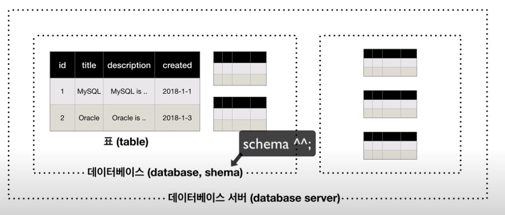

>> 생활코딩 DATABASE2 - MySQL를 학습, 정리한 내용입니다.(https://opentutorials.org/course/3161)

# MySQL basic1

- 데이터베이스
  - MySQL
    - 소개, 설치, 구조, 서버접속
    - 스키마
    - CRUD
  
# 목차
- [MySQL basic1](#mysql-basic1)
- [목차](#목차)
- [1. MySQL 소개](#1-mysql-소개)
    - [File](#file)
    - [Database](#database)
    - [Relational Database](#relational-database)
  - [MySQL](#mysql)
    - [웹에게 MySQL이란](#웹에게-mysql이란)
- [데이터베이스의 목적](#데이터베이스의-목적)
  - [데이터베이스가 무엇이고 왜 사용하는가](#데이터베이스가-무엇이고-왜-사용하는가)
  - [스트페드시트와 데이터베이스의 차이점과 공통점](#스트페드시트와-데이터베이스의-차이점과-공통점)
    - [공통점](#공통점)
    - [차이점](#차이점)
    - [웹을 통해서 데이터베이스를 화면에 표시해보자.](#웹을-통해서-데이터베이스를-화면에-표시해보자)
- [MySQL 설치](#mysql-설치)
  - [검색](#검색)
    - [MySQL community edition](#mysql-community-edition)
  - [Codeanywhere.com](#codeanywherecom)
  - [bitnami](#bitnami)
    - [bitnami wamp](#bitnami-wamp)
  - [설치방법 선택](#설치방법-선택)
  - [설치 후 실행 실습](#설치-후-실행-실습)
    - [cmd](#cmd)
- [MySQL의 구조](#mysql의-구조)
  - [schema](#schema)
- [서버접속](#서버접속)
- [스키마의 사용](#스키마의-사용)
  - [mysql 스키마 실습](#mysql-스키마-실습)
- [SQL과 테이블의 구조](#sql과-테이블의-구조)
  - [SQL 언어](#sql-언어)
  - [테이블의 구조](#테이블의-구조)
- [테이블의 생성](#테이블의-생성)
  - [MySQL에서 표 생성 및 데이터 관리](#mysql에서-표-생성-및-데이터-관리)
  - [SQL cheat sheet](#sql-cheat-sheet)
    - [SQL cheat sheet 참고](#sql-cheat-sheet-참고)
  - [엑셀과 database와의 차이.](#엑셀과-database와의-차이)
    - [MySQL datatypes 참고](#mysql-datatypes-참고)
    - [Terminal](#terminal)
    - [ERROR1820](#error1820)
- [CRUD](#crud)
  - [create, read > update, delete](#create-read--update-delete)
  - [사용](#사용)
- [INSERT](#insert)
    - [검색)](#검색-1)
    - [cmd](#cmd-1)
- [SELECT](#select)
  - [READ](#read)
    - [**프로젝션**(expression ; expr)](#프로젝션expression--expr)
  - [검색) mysql select syntax](#검색-mysql-select-syntax)
  - [select 실습](#select-실습)
  - [select 정리](#select-정리)
- [UPDATE](#update)
    - [cmd](#cmd-2)
  - [**where문의 중요성**](#where문의-중요성)
    - [테이블 컬럼명 수정하기](#테이블-컬럼명-수정하기)
- [DELETE](#delete)
    - [CMD](#cmd-3)
  - [where문의 중요성](#where문의-중요성-1)

<small><i><a href='http://ecotrust-canada.github.io/markdown-toc/'>Table of contents generated with markdown-toc</a></i></small>


# 1. MySQL 소개

2021년 3월 28일 일요일
오후 10:36

### File
* 컴퓨터를 이용한 정보 관리를 위해 만든 도구
* 데이터베이스도 정보를 파일에 저장
* 정보가 많아지고 다양해지면서 파일만으로는 정보를 효과적으로 입력, 저장, 출력하는 것이 어려워진다.
### Database
* 1960년부터 파일의 한계를 극복하려는 시도가 시작됨.
* 데이터베이스는 데이터를 저장 보관하기 위해 고안한 전문적인 소프트웨어
* 1970년 에드거 프랭크 테드커드 ibm에서 '관계형데이터베이스'를 고안
* 이 이론을 기반으로 다양한 제품들이 만들어짐.
* 50년이 지난 지금까지 관계형 데이터베이스는 데이터베이스 분야에서 절대 강자
### Relational Database
* 표의형태로 정리정돈 가능
* 정렬검색과 같은 작업을 빠르고 편리하고 안전하게 할 수 있다. 

* 관계형데이터베이스 제품들은 거의 비슷해서 하나를 배우면 다른 소프트웨어들도 쉽게 알 수 있다.

## MySQL
* 1994 스웨덴에서 개발되기 시작
* 무료, 오픈소스 
* 관계형데이터베이스의 주요기능을 대부분 갖춤.
* 웹의 폭발적인 성장으로 웹 개발자들은 웹페이지를 통해서 표현할 정보를 저장할 데이터베이스로 무료이면서 오픈소스인 MySQL을 많이 사용하게 되어 웹과 함께 MySQL은 폭발적인 동반 성장을 하게 됨.
* 결국 MySQL은 세 손가락 안에 드는 데이터베이스가 되었고 수많은 웹사이트가 MySQL이라는 심장에 의해서 동작하고 있음.

### 웹에게 MySQL이란
* 심장
* 마법의 캐비넷
* 뒤죽박죽이된 데이터를 깔끔하게 정리정돈하는 도구

# 데이터베이스의 목적

2021년 3월 29일 월요일
오후 12:30

## 데이터베이스가 무엇이고 왜 사용하는가 
## 스트페드시트와 데이터베이스의 차이점과 공통점
### 공통점
* 표로 데이터를 표시해준다.
### 차이점
* 데이터베이스는 코딩을 통해서(sql이라는 컴퓨터 언어)를 통해서 데이터베이스와 대화
  * ex) ```mysql> SELECT * FROM topic;```
  * "mysql아 topic으로 부터 *(모든요소)을 선택해줘(보여줘)"
* 스프레드시트는 마우스를 통해 클릭,클릭을 통해 명령하는 느낌(예제 OpenOffice사용)

    ### ***코딩을 통해서 데이터를 조작**하는 것이 엄청난 차이를 만든다.*
  
### 웹을 통해서 데이터베이스를 화면에 표시해보자.

* 데이터베이스의 데이터를 원하는 방식에 의하여 웹사이트에 구현하여 사용자에게 보여줄 수 있다.
* 웹 과 데이터베이스를 같이 활용하면  
  1. 전세계에 있는 누구나 웹 사이트에 접속해서 볼 수 있게 할 수 있다. 
  2. 누구나 글을 쓰면 데이터베이스를 개발자가 직접 제어하지 않아도 사용자들이 데이터를 저장할 수 있다.(데이터베이스에)


# MySQL 설치

2021년 3월 29일 월요일
오후 12:30

## 검색
* mysql community edition download
    > https://www.mysql.com/products/community/
### MySQL community edition

* Community Edition이 순수하게 무료인 에디션
* 설치 과정
  1. MySQL Community Server를 클릭
  2. Generally Available Releases를 보면
  3. 운영체제 선택 
  4. ZIP Archive 선택
  * MySQL Installer를 사용해도 된다.

## Codeanywhere.com
>https://codeanywhere.com/
* 클라우드 통합 개발 환경
* MySQL 대신 사용 가능.
  1. 코드 에디터 역할
     * 거의 모든 개발언어 지원
  2. 서버에서 직접 작업 가능
  3. 콘테이너
     * 선택한 프로그래밍 환경에 맞게 사전 구성 가능한 '컨테이너' 
     * 사전 구축된 개발 환경(도구와 데이터베이스)
  4. 터미널
     * 웹 기반 터미널을 사용해
     * 명령을 실행, 디버그, 서버 명령 출력 표시 가능
     * git, 버전관리, 직접 SSH가능

## bitnami
* bitnami는 가상 어플라이언스 및 웹 애플리케이션, 개발 스택용 소프트웨어 패키지 및 설치 라이브러리
### bitnami wamp
* windowsOS용 Apache, MySQL, PHP 솔루션 스택
* mamp는 macOS용
* PHP, MySQL 및 Apache 외에도 FastCGI, OpenSSL, phpMyAdmin, ModSecurity, SQLite, ImageMagick, xDebug, Xcache, OpenLDAP, ModSecurity, Memcache, OAuth, PEAR, PECL, APC, GD, cURL 및 기타 구성 요소와 프레임 워크 (: Zend Framework, Symfony, CodeIgniter, CakePHP, Smarty, Laravel.) 이 포함되어 있다.
## 설치방법 선택
* MySQL을 직접 다운받아도 된다.
* 설치하지않고 codeanywhere.com을 사용해도 된다.
* bitnami wamp를 다운받아도 된다.
  * Apache와 MySQL를 실습하고 사용하기 때문에 bitnami wamp를 다운받아 사용 결정.

## 설치 후 실행 실습

* 위 파일을 cmd를 통해 실행 
### cmd
```sql
C:\Users\Junha>cd C:\Bitnami\wampstack-8.0.3-1\mysql\bin
C:\Bitnami\wampstack-8.0.3-1\mysql\bin>mysql -uroot -p

mysql root password
xxxxxxxx
```

1. mysql파일이 있는 폴더로 이동 후 
2. ```mysql -uroot -p```를 입력 후 비밀번호 입력을 통해 mysql 서버 로그인 가능

* root는 관리자 계정을 의미. 즉 root계정(관리자 계정)으로 로그인


# MySQL의 구조

2021년 3월 29일 월요일
오후 12:30

## schema
* 스키마(database) : 표들을 그룹핑할때 쓰는 일종의 폴더
* 데이터베이스를 스키마라고 표현함



# 서버접속

2021년 3월 29일 월요일
오후 12:30

* root는 일반적으로 기본유저. 관리자를 의미.
* 중요한 시스템이라면 별도의 사용자를 만들어야 한다.


# 스키마의 사용

2021년 3월 31일 수요일
오후 1:38


## mysql 스키마 실습
1. mysql 실행, 로그인
    * cmd
```sql
C:\Users\Junha>cd C:\Bitnami\wampstack-8.0.3-1\mysql\bin
C:\Bitnami\wampstack-8.0.3-1\mysql\bin>mysql -uroot -p
xxxxxxxx
```

2. 생성 삭제
* 검색
  * mysql create database(schema)
  * mysql delete database(schema)
  * how to show database list in mysql

* cmd
```sql
create schema 스키마 이름;
drop schema 스키마 이름; 
show databases;
use 스키마이름
```


# SQL과 테이블의 구조

2021년 3월 31일 수요일
오후 1:57

## SQL 언어
* SQL 언어의 특징:
  * 어떤 언어보다 쉽다.(html처럼)
  * 중요하다.(html처럼)
  * sql은 관계형 데이터베이스 시스템에서 사용되는 광범위한 보편적인 언어.
  * 쉽고 중요한 가성비가 뛰어난 언어.

## 테이블의 구조 
* column과 row
  * 세로한줄 : 컬럼,
  * 가로한줄 : 로우 


* 이 테이블에는 레코드가 2개(MySQL, Oracle)와 컬럼이 4개(id, title, description, created) 있다.


# 테이블의 생성

2021년 3월 29일 월요일
오후 12:30


## MySQL에서 표 생성 및 데이터 관리
* 스프레드 시트로 치면 컬럼의 이름, 순서를 만들고 그 다음에 데이터를 넣는다.
* 검색
  * create table in MySQL cheat sheet
    * cheat sheet 컨닝페이퍼 라는 뜻.
    * 모든 코딩 분야에서 cheat sheet는 좋은 검색어라 할 수 있다.

## SQL cheat sheet
* sql select statements 예시
  * ```SELECT * FROM tbl```
    * "tbl테이블의 모든 행과 열을 선택"
  * ```SELECT c1, c2 FROM tbl WHERE  conditions ORDER BY c1 ASC, c2, DESC```
    * "conditions조건이 있는 c1, c2 열을 선택하고 테이블 tbl의 순서는 c1 열을 오름차순으로, c2를 내림차순으로 정렬"

### SQL cheat sheet 참고
> zentut.com/sql-tutorial


## 엑셀과 database와의 차이.
* 엑셀은 행에다가 어떤 데이터를 입력해도 상관 없다. 
* 그런데 특정 컬럼(id값 등)에는 숫자나 문자만 입력해야 된다.
* 하지만 사용자들은 기상천외한 데이터를 입력한다.
* 데이터베이스는 아주 중요한 기능이 있다. 
* 컬럼에 데이터타입을 강제할 수 있다.
* 자동 오토 증가 인크리먼트 지정 > 중복되지 않는 식별자를 갖게된다.
* primary key - id 컬럼은 중요한 컬럼이고 중복되면 안되기 때문에 지정

### MySQL datatypes 참고
* MySQL datatypes
    > https://www.techonthenet.com/mysql/datatypes.php
* CHAR : character 문자 
* VAR  variable
* NOT NULL : 공백 허용x
* NULL : 공백허용

### Terminal
```sql
mysql> create table tabletest1(
    -> id INT(11) NOT NULL AUTO_INCREMENT,
    -> title VARCHAR(100) NOT NULL,
    -> description TEXT NULL,
    -> created DATETIME NOT NULL,
    -> author VARCHAR(30) NULL,
    -> profile VARCHAR(100) NULL,
    -> PRIMARY KEY(id));
Query OK, 0 rows affected, 1 warning (0.05 sec)
```

### ERROR1820

 * 검색) MySQL : ERROR 1820 (HY000): You must reset your password using ALTER USER statement before executing this statement.

> https://igeniusdo.tistory.com/16 [iGeniusDo Blog]


# CRUD

2021년 3월 29일 월요일
오후 12:30

## create, read > update, delete
* create, read가 중요하다!
* update, delete 는 역사나 회계같은 분야에서는 지양.

## 사용
* create >> **insert**
* read >> **select**
* **update**
* **delete**


# INSERT

2021년 3월 29일 월요일
오후 12:31

### 검색) 
* mysql create row  >>create
* how to read row in mysql >>insert


* desc는 (디센딩) 내림차순 정렬
* id값은 지정안하면 자동으로 auto_increment 가 된다 (특별히 언급 안해도 된다.)

### cmd 
1. 테이블 보기
    ```sql
    mysql> show tables;
    +-----------------------+
    | Tables_in_schematest1 |
    +-----------------------+
    | tabletest1            |
    +-----------------------+
    1 row in set (0.01 sec)
    ```
    
2. 테이블 내림차순 정렬
    ```
    mysql> DESC tabletest1;
    +-------------+--------------+------+-----+---------+----------------+
    | Field       | Type         | Null | Key | Default | Extra          |
    +-------------+--------------+------+-----+---------+----------------+
    | id          | int          | NO   | PRI | NULL    | auto_increment |
    | title       | varchar(100) | NO   |     | NULL    |                |
    | description | text         | YES  |     | NULL    |                |
    | created     | datetime     | NO   |     | NULL    |                |
    | author      | varchar(30)  | YES  |     | NULL    |                |
    | profile     | varchar(100) | YES  |     | NULL    |                |
    +-------------+--------------+------+-----+---------+----------------+
    6 rows in set (0.01 sec)
    ```

3. 데이터 삽입(create) -1
    ```
    mysql> INSERT INTO tabletest1 (title,description,created,author,profile) VALUES('MySQL','MySQL is ...',NOW(),'egoing','delveloper');
    Query OK, 1 row affected (0.01 sec)
    ```

4. 테이블 확인(데이터 삽입 결과 확인)
    ```
    mysql> SELECT * FROM tabletest1;
    +----+-------+--------------+---------------------+--------+------------+
    | id | title | description  | created             | author | profile    |
    +----+-------+--------------+---------------------+--------+------------+
    |  1 | MySQL | MySQL is ... | 2021-03-31 15:04:11 | egoing | delveloper |
    +----+-------+--------------+---------------------+--------+------------+
    1 row in set (0.00 sec)
    ```

5. 데이터 삽입(create) -2
    ```
    mysql> INSERT INTO tabletest1 (title,description,created,author,profile) VALUES('SQL Server', 'SQL Server is ....', now(), 'taeho', 'data scientist, developer');
    Query OK, 1 row affected (0.00 sec)
    ```

6. 데이터 삽입(create) -3
    ```
    mysql> INSERT INTO tabletest1 (title,description,created,author,profile) VALUES('PostgreSQL', 'PosgreSQL is ...', NOW(),'taeho', 'data scientist, developer');
    Query OK, 1 row affected (0.00 sec)
    ```

7. 데이터 삽입(create) -4
    ```
    mysql> INSERT INTO tabletest1 (title,description,created,author,profile) VALUES('MongoDB', 'MongoDB is...', NOW(), 'egoing', 'developer');
    Query OK, 1 row affected (0.00 sec)
    ```

8. 최종 테이블 확인
    ```sql
    mysql> SELECT * FROM tabletest1;
    +----+------------+--------------------+---------------------+--------+---------------------------+
    | id | title      | description        | created             | author | profile                   |
    +----+------------+--------------------+---------------------+--------+---------------------------+
    |  1 | MySQL      | MySQL is ...       | 2021-03-31 15:04:11 | egoing | delveloper                |
    |  2 | ORACLE     | ORACLE is          | 2021-03-31 15:15:28 | egoing | developer                 |
    |  3 | SQL Server | SQL Server is .... | 2021-03-31 15:16:39 | taeho  | data scientist, developer |
    |  4 | PostgreSQL | PosgreSQL is ...   | 2021-03-31 15:18:09 | taeho  | data scientist, developer |
    |  5 | MongoDB    | MongoDB is...      | 2021-03-31 15:19:02 | egoing | developer                 |
    +----+------------+--------------------+---------------------+--------+---------------------------+
    5 rows in set (0.00 sec)
    ```


# SELECT

2021년 3월 29일 월요일
오후 12:31

## READ
* 읽기는 아주 복잡해 질 수 있다.
### **프로젝션**(expression ; expr) 
* SELECT 와 FROM 사이에 오는것. 
* **표시하고 싶은 컬럼들**의 목록이 나온다

  * 즉 select 뒤에는 컬럼의 목록이 나온다.
  * 
  * 이 그것이다.

## 검색) mysql select syntax 
* 신택스는 문법을 의미
  
    > https://dev.mysql.com/doc/refman/8.0/en/select.html
  * [] 대괄호는 생략가능하다는 뜻.

## select 실습
* 테이블 읽기
    ```sql
    mysql> SELECT * FROM tabletest1;
    +----+------------+--------------------+---------------------+--------+---------------------------+
    | id | title      | description        | created             | author | profile                   |
    +----+------------+--------------------+---------------------+--------+---------------------------+
    |  1 | MySQL      | MySQL is ...       | 2021-03-31 15:04:11 | egoing | delveloper                |
    |  2 | ORACLE     | ORACLE is          | 2021-03-31 15:15:28 | egoing | developer                 |
    |  3 | SQL Server | SQL Server is .... | 2021-03-31 15:16:39 | taeho  | data scientist, developer |
    |  4 | PostgreSQL | PosgreSQL is ...   | 2021-03-31 15:18:09 | taeho  | data scientist, developer |
    |  5 | MongoDB    | MongoDB is...      | 2021-03-31 15:19:02 | egoing | developer                 |
    +----+------------+--------------------+---------------------+--------+---------------------------+
    5 rows in set (0.00 sec)
    ```

* 특정 컬럼지정해 테이블 읽기
    ```sql
    mysql> SELECT id,title,created,author FROM tabletest1;
    +----+------------+---------------------+--------+
    | id | title      | created             | author |
    +----+------------+---------------------+--------+
    |  1 | MySQL      | 2021-03-31 15:04:11 | egoing |
    |  2 | ORACLE     | 2021-03-31 15:15:28 | egoing |
    |  3 | SQL Server | 2021-03-31 15:16:39 | taeho  |
    |  4 | PostgreSQL | 2021-03-31 15:18:09 | taeho  |
    |  5 | MongoDB    | 2021-03-31 15:19:02 | egoing |
    +----+------------+---------------------+--------+
    5 rows in set (0.00 sec)
    ```

* author가 egoing인 테이블 읽기
    ```sql
    mysql> SELECT id,title,created,author FROM tabletest1 WHERE author='egoing';
    +----+---------+---------------------+--------+
    | id | title   | created             | author |
    +----+---------+---------------------+--------+
    |  1 | MySQL   | 2021-03-31 15:04:11 | egoing |
    |  2 | ORACLE  | 2021-03-31 15:15:28 | egoing |
    |  5 | MongoDB | 2021-03-31 15:19:02 | egoing |
    +----+---------+---------------------+--------+
    3 rows in set (0.00 sec)
    ```

* 내림차순(desc)적용해 읽기
    ```sql
    mysql> SELECT id,title,created,author FROM tabletest1 WHERE author='egoing' ORDER BY id DESC;
    +----+---------+---------------------+--------+
    | id | title   | created             | author |
    +----+---------+---------------------+--------+
    |  5 | MongoDB | 2021-03-31 15:19:02 | egoing |
    |  2 | ORACLE  | 2021-03-31 15:15:28 | egoing |
    |  1 | MySQL   | 2021-03-31 15:04:11 | egoing |
    +----+---------+---------------------+--------+
    3 rows in set (0.00 sec)
    ```

* 제한된 갯수만 읽기
    ```sql
    mysql> SELECT id,title,created,author FROM tabletest1 WHERE author='egoing' ORDER BY id DESC LIMIT 2;
    +----+---------+---------------------+--------+
    | id | title   | created             | author |
    +----+---------+---------------------+--------+
    |  5 | MongoDB | 2021-03-31 15:19:02 | egoing |
    |  2 | ORACLE  | 2021-03-31 15:15:28 | egoing |
    +----+---------+---------------------+--------+
    2 rows in set (0.00 sec)
    ```

## select 정리
* 어떤 데이터를 가져오는가를 조건을 넣어 select 할 수 있다.
* select는 수련이 필요! 
* 기본이 쉽고 깊게 들어가면 굉장히 심오하고 복잡해진다.

* 상황 예시
  * 컬럼의 이름을 id가 아닌 아이디로 쓴다?
  * 컬럼 이름을 합계로? 
  * author가 egoing 이거나 duru인 경우?
  * 오름차순?
  * 리미트 - 페이징 기능? 
* **맥락적으로 필요한것을 찾아내는 능력이 가장 중요**


# UPDATE

2021년 3월 29일 월요일
오후 12:31


### cmd
```sql
mysql> SELECT *FROM tabletest1;
+----+------------+-------------------+---------------------+--------+---------------------------+
| id | title      | description       | created             | author | profile                   |
+----+------------+-------------------+---------------------+--------+---------------------------+
|  1 | MySQL      | MySQL is ...      | 2021-03-31 15:04:11 | egoing | developer                |
|  2 | ORACLE     | Oracle is ...     | 2021-03-31 15:15:28 | egoing | developer                 |
|  3 | SQL Server | SQL Server is ... | 2021-03-31 15:16:39 | taeho  | data scientist, developer |
|  4 | PostgreSQL | PostgreSQL is ...  | 2021-03-31 15:18:09 | taeho  | data scientist, developer |
|  5 | MongoDB    | MongoDB is ...     | 2021-03-31 15:19:02 | egoing | developer                 |
+----+------------+-------------------+---------------------+--------+---------------------------+
5 rows in set (0.00 sec)

mysql> UPDATE tabletest1 SET author='duru', profile='data administrator' WHERE id=3;
Query OK, 1 row affected (0.00 sec)
Rows matched: 1  Changed: 1  Warnings: 0

mysql> SELECT *FROM tabletest1;
+----+------------+-------------------+---------------------+--------+---------------------------+
| id | title      | description       | created             | author | profile                   |
+----+------------+-------------------+---------------------+--------+---------------------------+
|  1 | MySQL      | MySQL is ...      | 2021-03-31 15:04:11 | egoing | developer                |
|  2 | ORACLE     | Oracle is ...     | 2021-03-31 15:15:28 | egoing | developer                 |
|  3 | SQL Server | SQL Server is ... | 2021-03-31 15:16:39 | duru   | data administrator        |
|  4 | PostgreSQL | PostgreSQL is ...  | 2021-03-31 15:18:09 | taeho  | data scientist, developer |
|  5 | MongoDB    | MongoDB is ...    | 2021-03-31 15:19:02 | egoing | developer                 |
+----+------------+-------------------+---------------------+--------+---------------------------+
5 rows in set (0.00 sec)
```

## **where문의 중요성**
* where문을 빠뜨리면 범위 지정이 안되 수없이 많은 데이터를 저장하는 서버에서는 엄청나게 많은 데이터를 처리해야 되는 명령문이 되어 컴퓨터가 멈추거나 서버가 에러가 나는 등의 심각한 문제가 발생할 수 있다.

### 테이블 컬럼명 수정하기 
* alter/ rename
```
ALTER TABLE your_table_name RENAME COLUMN original_column_name TO new_column_name;
```
* 여기서 컬럼 네임을 DESC와 같은 문법용 단어로 지정할 수 없다.
> 출처: <https://phoenixnap.com/kb/how-to-rename-column-mysql> 


# DELETE

2021년 3월 29일 월요일
오후 12:31

### CMD
```sql
mysql> DELETE FROM tabletest1 WHERE id = 5;
Query OK, 1 row affected (0.00 sec)

mysql> SELECT *FROM tabletest1;
+----+------------+-------------------+---------------------+--------+---------------------------+
| id | title      | description       | created             | author | profile                   |
+----+------------+-------------------+---------------------+--------+---------------------------+
|  1 | MySQL      | MySQL is ...      | 2021-03-31 15:04:11 | egoing | developer                 |
|  2 | ORACLE     | Oracle is ...     | 2021-03-31 15:15:28 | egoing | developer                 |
|  3 | SQL Server | SQL Server is ... | 2021-03-31 15:16:39 | duru   | data administrator        |
|  4 | PostgreSQL | PostgreSQL is ... | 2021-03-31 15:18:09 | taeho  | data scientist, developer |
+----+------------+-------------------+---------------------+--------+---------------------------+
4 rows in set (0.00 sec)
```

## where문의 중요성
* update때와 마찬가지로 where문을 빠뜨리면 재앙이다.

