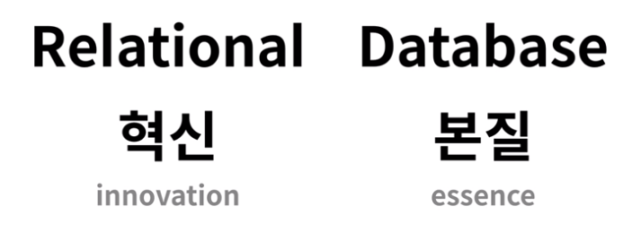
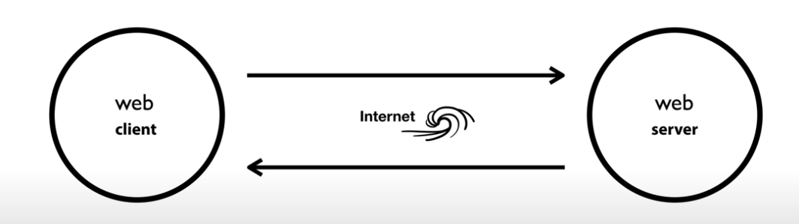
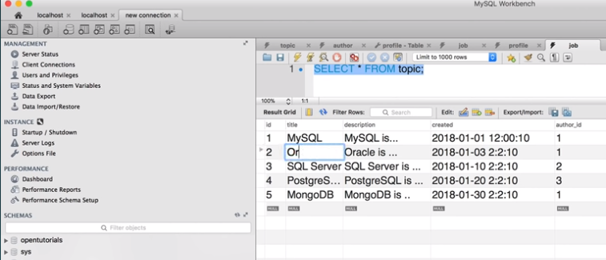
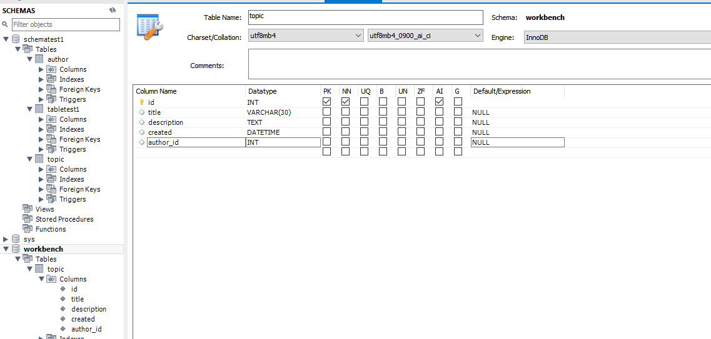

>> 생활코딩 DATABASE2 - MySQL를 학습, 정리한 내용입니다.(https://opentutorials.org/course/3161)

# MySQL basic2

- 관계형데이터 베이스
  - JOIN
  - 인터넷과 database
  - MySQL Client
  - MySQL Workbench
  - 추가학습주제
  
# 목차
- [MySQL basic2](#mysql-basic2)
- [목차](#목차)
- [수업의 정상](#수업의-정상)
  - [중간 점검](#중간-점검)
  - [앞으로의 내용](#앞으로의-내용)
- [관계형데이터베이스의 필요성](#관계형데이터베이스의-필요성)
  - [문제 상황 설정](#문제-상황-설정)
    - [해결](#해결)
    - [JOIN](#join)
- [테이블 분리하기](#테이블-분리하기)
    - [cmd](#cmd)
- [JOIN](#join-1)
  - [조인 JOIN 기능](#조인-join-기능)
    - [결합고리 author_id와 id. 둘을 연결-결합해보자.](#결합고리-author_id와-id-둘을-연결-결합해보자)
    - [CMD](#cmd-1)
  - [중복 제거](#중복-제거)
  - [테이블의 분리의 의미](#테이블의-분리의-의미)
- [인터넷과 데이터베이스](#인터넷과-데이터베이스)
  - [관계](#관계)
    - [database server에서 server의 의미는?](#database-server에서-server의-의미는)
    - [CMD](#cmd-2)
    - [MySQL monitor와 MySQL workbench](#mysql-monitor와-mysql-workbench)
- [MySQL Clinet](#mysql-clinet)
    - [검색)ᅟwhat is the best MySQL client](#검색ᅟwhat-is-the-best-mysql-client)
- [MySQL Workbench](#mysql-workbench)
  - [MySQL workbench 다운받고 실습](#mysql-workbench-다운받고-실습)
- [수업을 마치며](#수업을-마치며)
  - [추가학습주제](#추가학습주제)
    - [1. SQL](#1-sql)
    - [2. SELECLT문](#2-seleclt문)
    - [3. index](#3-index)
    - [4. modeling](#4-modeling)
    - [5. backup](#5-backup)
    - [7. cloud](#7-cloud)
    - [8. programming](#8-programming)

<small><i><a href='http://ecotrust-canada.github.io/markdown-toc/'>Table of contents generated with markdown-toc</a></i></small>


# 수업의 정상

2021년 3월 29일 월요일
오후 12:31

## 중간 점검
* 데이터베이스에서 관계형데이터베이스를 배웠다.
* 데이터베이스에서 공통적으로 공유하고 있는 특징 : CRUD 
* 지금까지 MySQL을 교양의 측면에서 공통적으로 알만한 내용을 살펴본 것.


## 앞으로의 내용
* 이제부터 혁신에 해당하는 **관계형데이터베이스**를 심도있게 배운다.


# 관계형데이터베이스의 필요성

2021년 3월 29일 월요일
오후 12:31

## 문제 상황 설정
* topic 테이블(나는 tabletest1) 에서 중복되는 데이터가 있다. 
* egoing, developer 이런 중복데이터가 매우 많다고 치자 (1억개)
* 이런 데이터가 1억번 등장한다면 성능과 효율이 너무 떨어진다.
* 또는 동명이인이 있거나 하는 문제가 있을 수도 있다.

### 해결
* 별도의 표를 만들자
  * author 표 
  * id, name, profile 칼럼
  * topic 표
  * id, title, description, created, author_id 칼럼

* author_id에는 author테이블의 식별자인 id값으로 대체.
* 이렇게 되면 author 테이블이서 name을 바꾸면 해당 데이터를 참조하고있는 모든 행이 수정된 효과!
* 동명이인과 프로파일도 같은 사람이 있으면 id값이 다름으로 인해 다른 사람인 것을 확인가능!
* 하지만 이러한 방식에는 특정 데이터를 확인하기 위해서 별도의 표를 확인해야하는 불편함이 있다.

### JOIN
* 저장은 분산해서 볼때는 합쳐서! >>>>  JOIN


# 테이블 분리하기

2021년 3월 29일 월요일
오후 12:31

```sql
--
-- Table structure for table `author`
--
CREATE TABLE `author` (
`id` int(11) NOT NULL AUTO_INCREMENT,
`name` varchar(20) NOT NULL,
`profile` varchar(200) DEFAULT NULL,
PRIMARY KEY (`id`)
);
--
-- Dumping data for table `author`
--
INSERT INTO `author` VALUES (1,'egoing','developer');
INSERT INTO `author` VALUES (2,'duru','database administrator');
INSERT INTO `author` VALUES (3,'taeho','data scientist, developer');
--
-- Table structure for table `topic`
--
CREATE TABLE `topic` (
`id` int(11) NOT NULL AUTO_INCREMENT,
`title` varchar(30) NOT NULL,
`description` text,
`created` datetime NOT NULL,
`author_id` int(11) DEFAULT NULL,
PRIMARY KEY (`id`)
);
--
-- Dumping data for table `topic`
--
INSERT INTO `topic` VALUES (1,'MySQL','MySQL is...','2018-01-01 12:10:11',1);
INSERT INTO `topic` VALUES (2,'Oracle','Oracle is ...','2018-01-03 13:01:10',1);
INSERT INTO `topic` VALUES (3,'SQL Server','SQL Server is ...','2018-01-20 11:01:10',2);
INSERT INTO `topic` VALUES (4,'PostgreSQL','PostgreSQL is ...','2018-01-23 01:03:03',3);
INSERT INTO `topic` VALUES (5,'MongoDB','MongoDB is ...','2018-01-30 12:31:03',1);
```
출처: <https://opentutorials.org/course/3161/19521> 

### cmd
```sql
mysql> SELECT * FROM author;
+----+--------+---------------------------+
| id | name   | profile                   |
+----+--------+---------------------------+
|  1 | egoing | developer                 |
|  2 | duru   | database administrator    |
|  3 | taeho  | data scientist, developer |
+----+--------+---------------------------+
3 rows in set (0.00 sec)

mysql> SELECT * FROM topic;
+----+------------+-------------------+---------------------+-----------+
| id | title      | description       | created             | author_id |
+----+------------+-------------------+---------------------+-----------+
|  1 | MySQL      | MySQL is...       | 2018-01-01 12:10:11 |         1 |
|  2 | Oracle     | Oracle is ...     | 2018-01-03 13:01:10 |         1 |
|  3 | SQL Server | SQL Server is ... | 2018-01-20 11:01:10 |         2 |
|  4 | PostgreSQL | PostgreSQL is ... | 2018-01-23 01:03:03 |         3 |
|  5 | MongoDB    | MongoDB is ...    | 2018-01-30 12:31:03 |         1 |
+----+------------+-------------------+---------------------+-----------+
5 rows in set (0.00 sec)
```


# JOIN

2021년 3월 29일 월요일
오후 12:31

## 조인 JOIN 기능
* 관계형 데이터베이스의 꽃
* 각각 독립적인, 분리된 테이블을 읽을 때 마치 하나의 테이블로 저장되어 있었던 것처럼 보이게 하는 기능.
* 데이터의 중복을 쉽게 관리하기 위해 테이블을 분리하게 되고 이 분리된 테이블들을 하나로 결합하기 위해 JOIN 연산자를 사용

### 결합고리 author_id와 id. 둘을 연결-결합해보자.

### CMD
* SELECT * FROM 테이블 LEFT JOIN 테이블명 ON
  * topic테이블의  author_id값이 author테이블의 id값과 그것을 참조해서 join
  * 뒤의 author_id 와 id가 맨앞의 id와 중복되므로 안보이게 설정
    ```sql
    mysql> SELECT * FROM topic LEFT JOIN author ON topic.author_id = author.id;
    +----+------------+-------------------+---------------------+-----------+------+--------+---------------------------+
    | id | title      | description       | created             | author_id | id   | name   | profile                   |
    +----+------------+-------------------+---------------------+-----------+------+--------+---------------------------+
    |  1 | MySQL      | MySQL is...       | 2018-01-01 12:10:11 |         1 |    1 | egoing | developer                 |
    |  2 | Oracle     | Oracle is ...     | 2018-01-03 13:01:10 |         1 |    1 | egoing | developer                 |
    |  3 | SQL Server | SQL Server is ... | 2018-01-20 11:01:10 |         2 |    2 | duru   | database administrator    |
    |  4 | PostgreSQL | PostgreSQL is ... | 2018-01-23 01:03:03 |         3 |    3 | taeho  | data scientist, developer |
    |  5 | MongoDB    | MongoDB is ...    | 2018-01-30 12:31:03 |         1 |    1 | egoing | developer                 |
    +----+------------+-------------------+---------------------+-----------+------+--------+---------------------------+
    5 rows in set (0.00 sec)
    ``` 

* SELECT 컬럼,컬럼,… FROM 테이블 LEFT JOIN 테이블명 ON 
  * topic테이블의  author_id값이 author테이블의 id값과 그것을 참조해서 join
    ```sql
    mysql> SELECT id,title,description,created,name,profile FROM topic LEFT JOIN author ON topic.author_id = author.id;
    ERROR 1052 (23000): Column 'id' in field list is ambiguous
    ```

* d값이 2테이블에 있으므로 애매 > topic.id (토픽테이블의 id)
    ```sql
    mysql> SELECT topic.id,title,description,created,name,profile FROM topic LEFT JOIN author ON topic.author_id = author.id;
    +----+------------+-------------------+---------------------+--------+---------------------------+
    | id | title      | description       | created             | name   | profile                   |
    +----+------------+-------------------+---------------------+--------+---------------------------+
    |  1 | MySQL      | MySQL is...       | 2018-01-01 12:10:11 | egoing | developer                 |
    |  2 | Oracle     | Oracle is ...     | 2018-01-03 13:01:10 | egoing | developer                 |
    |  3 | SQL Server | SQL Server is ... | 2018-01-20 11:01:10 | duru   | database administrator    |
    |  4 | PostgreSQL | PostgreSQL is ... | 2018-01-23 01:03:03 | taeho  | data scientist, developer |
    |  5 | MongoDB    | MongoDB is ...    | 2018-01-30 12:31:03 | egoing | developer                 |
    +----+------------+-------------------+---------------------+--------+---------------------------+
    5 rows in set (0.00 sec)

* id를 topic_id로 보이게 (
  * SELECT topic.id AS **topic_id**
    ```sql
    mysql> SELECT topic.id AS topic_id,title,description,created,name,profile FROM topic LEFT JOIN author ON topic.author_id = author.id;
    +----------+------------+-------------------+---------------------+--------+---------------------------+
    | topic_id | title      | description       | created             | name   | profile                   |
    +----------+------------+-------------------+---------------------+--------+---------------------------+
    |        1 | MySQL      | MySQL is...       | 2018-01-01 12:10:11 | egoing | developer                 |
    |        2 | Oracle     | Oracle is ...     | 2018-01-03 13:01:10 | egoing | developer                 |
    |        3 | SQL Server | SQL Server is ... | 2018-01-20 11:01:10 | duru   | database administrator    |
    |        4 | PostgreSQL | PostgreSQL is ... | 2018-01-23 01:03:03 | taeho  | data scientist, developer |
    |        5 | MongoDB    | MongoDB is ...    | 2018-01-30 12:31:03 | egoing | developer                 |
    +----------+------------+-------------------+---------------------+--------+---------------------------+
    5 rows in set (0.00 sec)
    ```

## 중복 제거
* 중복을 제거 > 정말 혁명적인 발전! 깨닫자.
* 대부분의 기술들이 중복을 제거하기 위해 존재.

## 테이블의 분리의 의미
* 테이블을 분리한다는 것은 단순히 테이블 사이에만 관계를 맺을 수 있는 것이 아니라
* 모든 테이블이 식별자 값을 행에 포함하고 있다면 
* 조인을 통해서 얼마든지 관계를 맺을 수 있다. (중복 관리가 편리하다)


# 인터넷과 데이터베이스

2021년 3월 29일 월요일
오후 12:31

## 관계
* 이 둘의 관계는 ? 
  * 인터넷은 정보의 바다, 이 위에서 데이터베이스가 동작하게 되면 효과는 엄청나다.
  * MySQL은 내부적으로 인터넷을 활용할 수 있도록 고안된 시스템


### database server에서 server의 의미는?
* 인터넷 자체에 대한 얘기 - 
  * 인터넷을 사용하기 위해서는 2대의 컴퓨터가 필요하다. 컴퓨터들이 인터넷으로 연결됨으로써 컴퓨터 사회가 만들어지고 한 대의 컴퓨터가 가지는 한계를 초월함.
  * 인터넷에서는 정보를 요청하는 쪽과 응답하는 쪽으로 나누어짐. 클라이언트(고객, 갑)와 서버(서비스제공자, 을)


* 웹클라이언트 - 웹서버
* 게임클라이언트 - 게임서버
* 데이터베이스 클라이언트 - 데이터베이스 서버

### CMD
```sql
C:\Bitnami\wampstack-8.0.3-1\mysql\bin>mysql -uroot -p
Enter password: ******
Welcome to the MySQL monitor.  Commands end with ; or \g.
Your MySQL connection id is 10
Server version: 8.0.23 MySQL Community Server - GPL

Copyright (c) 2000, 2021, Oracle and/or its affiliates.

Oracle is a registered trademark of Oracle Corporation and/or its
affiliates. Other names may be trademarks of their respective
owners.

Type 'help;' or '\h' for help. Type '\c' to clear the current input statement.
```

### MySQL monitor와 MySQL workbench
* 우리는 MySQL monitor라는 database client를 이용해서 database server와 소통
* 또 하나의 database client : MySQL workbench
  * gui환경에서 그래피컬한 환경에서 마치 액셀을 다루듯이 사용 가능.
  


* 이렇게 클라이언트를 2개를 쓰게 되고 서비스를 더 익숙해지게 된다.
* 폰 노이만 "수학은 이해하는게 아니라 익숙해지는것"
* 우리의 목표도 익숙해지는 것 이 다.


# MySQL Clinet

2021년 3월 29일 월요일
오후 12:31

* MySQL monitor는 명령어를 이용해 사용 > 명령어를 기억해야 한다.
* MySQL workbench는 gui환경에서 사용 >쉽게느껴지지만 클릭하고 기다리고하는 시간,  노력이 더 든다.
* 둘다 써보고 둘만의 장점만을 이용하자!

### 검색)ᅟwhat is the best MySQL client
>https://www.quora.com/What-is-the-best-MySQL-client-for-Mac-OS-X-or-Windows


# MySQL Workbench

2021년 3월 29일 월요일
오후 12:32

## MySQL workbench 다운받고 실습


* 어떤 클라이언트를 사용하든 모든 클라이언트들은 결국에는 sql을 mysql서버에 전송함으로서 데이터베이스 서버를 제어하게 된다는 것.
* 결국 어떤 프로그램을 사용하든 우리는 sql문을 생성해서 서버에 전달하는 것이다.
* 자바 php 파이썬와 같은 컴퓨터 프로그래밍 언어를 통해서 어떤 애플리케이션이나 웹을 만들 때 위의 개념을 이해하는 게 중요.
* MySQL를 사용하는 모든 앱, 웹, 시스템은 모두가 MySQL 클라이언트라고 할 수 있다. 


# 수업을 마치며

2021년 3월 29일 월요일
오후 12:32

## 추가학습주제
### 1. SQL
   * 관계형 데이터베이스의 공식언어는 SQL
   * 더 알아볼 가치가 있다.
### 2. SELECLT문
   * CRUD에서 R에 해당하는 SELECT문은 복잡하기 때문에 끊임없는 단련이 필요하다.    
### 3. index 
  * 색인 기능.
  *  사용자들이 자주 사용하는 컬럼에다가 색인을 걸어두면 데이터가 들어올때 데이터베이스가 그 컬럼에 데이터를 잘 정리정돈해준다.
### 4. modeling 
  * 테이블의 구조를 처음 잘못 설계하면 후에 크게 낭패
  * 정규화 비정규화 역정규화 
  * 이런 전문가들이 고안해놓은 구조. 
### 5. backup 
  * 데이터를 백업하자 
  * 하드디스크에서 예측할 수 있는 것과 예측할 수 없는 것이 있는데 
  * 예측할 수 없는 것은 언제 고장날지 알 수 없다. 
  * 예측할 수 있는 것은 반드시 언젠가 고장이 난다. 
  * 마치 '인간은 죽는다. 언제죽을지 모를 뿐' 과 같은 이치.
  * 2개이상의 컴퓨터에 데이터를 복제해서 보관한다면 데이터가 유실될 가능성이 떨어진다. 
  * 검색어 예시) 
    * mysqldump
    * binary log 
    * ...
### 7. cloud 
  * 내컴퓨터를 데이터베이스 서버로 쓰는것이 아니고 대기업이 운영하고 있는 인프라 위에 있는 컴퓨터를 임대해서 쓰는것. 
  * 원격제어를 통해서 다룬다. 
  * 최근에는 mysql같은 데이터베이스를 온라인 서비스화 시켰다.
  * 검색어 예시)
    * AWS RDS
    * Google Cloud SQL for MySQL
    * AZURE Database for MySQL
    * ...
### 8. programming 
  * 데이터베이스 자체를 쓰는 경우는 많지 않다. 
  * 데이터베이스를부품으로 정보시스템이 완제품으로 만들어지는것. 
  * 많은 프로그램들 안에 부품으로서 mysql이 들어있을 가능성이 크다.
  * 검색어 예시)
    * Python mysql api
    * PHP mysql api
    * Java mysql api
    * ...


