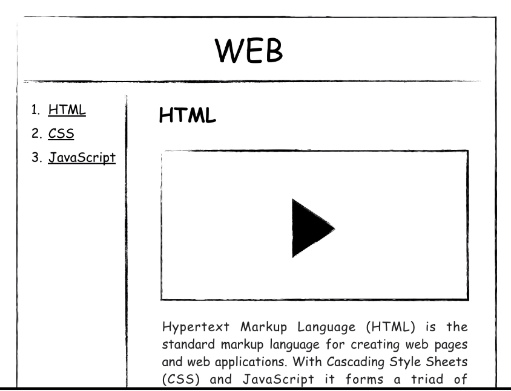
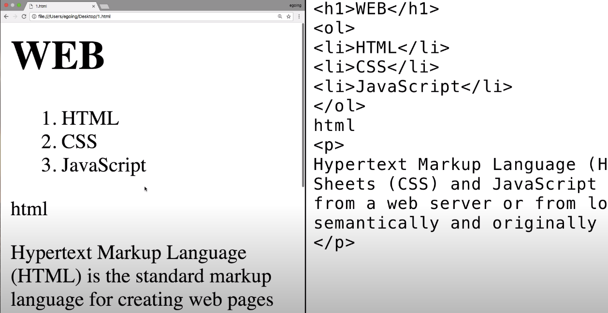
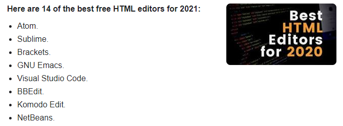

>> 생활코딩 web1 = HTML & Internet 을 학습, 정리한 내용입니다. (https://opentutorials.org/course/3084)

# **HTML & Internet**

- web
    - HTML
      - tag
      - structure
    - Internet
      - server
      - client
      - web server
      - http
      - network

# 목차
- [**HTML & Internet**](#html--internet)
- [목차](#목차)
- [1. 소개](#1-소개)
- [2. 프로젝트의 동기](#2-프로젝트의-동기)
- [3. 기획](#3-기획)
  - [기획자가 되어 보자](#기획자가-되어-보자)
    - [코딩수업과 내용을 잘 정리정돈 할 수 있는 웹사이트를 그림으로 한번 그려보자](#코딩수업과-내용을-잘-정리정돈-할-수-있는-웹사이트를-그림으로-한번-그려보자)
- [4. 코딩과 HTML](#4-코딩과-html)
  - [HTML 코딩](#html-코딩)
    - [1. 기계와 사람이 하는 일을 분리해보자](#1-기계와-사람이-하는-일을-분리해보자)
    - [2. 원인과 결과를 추론해보자](#2-원인과-결과를-추론해보자)
  - [Code, Source, Language](#code-source-language)
  - [Application, App, Program, Webpage, Website](#application-app-program-webpage-website)
    - [다 비슷한 용어. 같은 대상을 바라보는 관점에 따라서 조금씩 달라지는 것에 불과](#다-비슷한-용어-같은-대상을-바라보는-관점에-따라서-조금씩-달라지는-것에-불과)
  - [프로그래밍](#프로그래밍)
  - [HTML](#html)
    - [Webpage](#webpage)
  - [HTML의 장점](#html의-장점)
  - [퍼블릭 도메인](#퍼블릭-도메인)
- [5. HTML 코딩 실습 환경 준비](#5-html-코딩-실습-환경-준비)
  - [실습에 필요한 것](#실습에-필요한-것)
    - [에디터](#에디터)
    - [검색) best HTML Editor 2021](#검색-best-html-editor-2021)
    - [에디터를 다운받고 에디터에서 작업공간(workspace)으로 사용할 폴더를 만들고 파일을 에디터에서 작성해보자.](#에디터를-다운받고-에디터에서-작업공간workspace으로-사용할-폴더를-만들고-파일을-에디터에서-작성해보자)

<small><i><a href='http://ecotrust-canada.github.io/markdown-toc/'>Table of contents generated with markdown-toc</a></i></small>

# 1. 소개
* 웹, 인터넷, 컴퓨터라는 거대한 세계를 탐험하자
* 탐험 시작전에 스스로를 코딩을 배우는 학생이 아니라 나의 문제를 코딩으로 해결하려는 엔지니어라고 상상하자
* ### **어떤 문제가 우리 삶에서 중요하고 심각할수록 문제로부터 우리를 해방시켜줄 것**  
* 반대로 문제가 우리 삶과 동떨어져 있고 사소하다면 공부자체가 삶의 문제가 되어서 해방시키기는 커녕 억압시킬 것
* ### **공부의 효용을 뇌에게 자주 증명한다면 공부를 좋아할 수 밖에 없다. 자연스럽게 실력도 좋아질 것**
* 지식을 배우는 것도 좋지만 공부와 친해지는 계기가 될 것!

# 2. 프로젝트의 동기
* youtube와 같은 무료 동영상 공유 서비스가 HD화질을 만나면서(작은 글씨도 볼 수 있게) 인터넷을 통해 쉽게 원하는 공부를 할 수 있게 되었다.
* 지금 시대는 오프라인에서 온라인으로 아날로그에서 디지털로 넘어가는 과도기라 볼 수 있다.
* 무궁무진한 인터넷의 자료를 활용해 자신이 직면한 문제를 능동적인 학습을 통해 해결하자!

# 3. 기획
* 우리가 무엇인가를 만들기 전에 무엇을 만들 것인가를 미리 상상하고 계획하고 구체화 하는 과정이 필요하다
  * 만들고 나서 원하는게 아니었거나 문제가 있으면 손해고 여러 사람이 같이 하는 경우에 서로 생각하는 바가 다르면 굉장히 곤란하기 때문
* ### 설계하고 그려보는 과정을 기획이라 한다.(기획자)
## 기획자가 되어 보자
### 코딩수업과 내용을 잘 정리정돈 할 수 있는 웹사이트를 그림으로 한번 그려보자
* 위에 web이라는 글씨는 보여지게 하고
* 왼쪽에는 목록 
* 오른쪽에 제목과 내용(동영상, 글 등)을 표시

# 4. 코딩과 HTML
## HTML 코딩
### 1. 기계와 사람이 하는 일을 분리해보자
### 2. 원인과 결과를 추론해보자

* ### 사람이 하는 일 - 원인(오른쪽)
* ### 기계가 하는 일 - 결과(왼쪽)

## Code, Source, Language
* 사람이 하는 일, 원인을 부르는 여러 가지 표현
  1. code - 부호, 선호
  2. source - 원천
  3. language - 약속

## Application, App, Program, Webpage, Website
* 기계가 하는 일, 결과를 부르는 여러가지 표현
  1. Application - 응용 소프트웨어
  2. App - (모바일)응용 소프트웨어
  3. Program - 프로그램
  4. Webpage - web상 문서
  5. Website - 웹 페이지 집합
### 다 비슷한 용어. 같은 대상을 바라보는 관점에 따라서 조금씩 달라지는 것에 불과

## 프로그래밍
* 코드을 통해서 프로그램을 만드는 것이
프로그래밍의 핵심

## HTML
* 다양한 프로그래밍 언어(코드)가 있다.
  * C, C++, java, javascript, python, php,sql 등등등...
* 이 중 웹 페이지를 만드는 코드가 바로 **HTML**
### Webpage
* 인류가 생산한 거의 모든 디지털 정보가 담기는 가장 거대한 그릇
* 그리고 그 웹페이지를 만드는 언어가 HTML

## HTML의 장점
1. 쉽다
   * 그 어떤 프로그래밍 언어보다도 쉽다.
   * 10분이면 문법을 이해할 수 있다.
2. 중요하다
   * 하루에도 100번이상 보는 웹페이지. 자주 사용하는만큼 HTML은 중요하다.
3. 퍼블릭 도메인

## 퍼블릭 도메인
* 우리가 한국어, 영어를 쓰는데 어떠한 비용도 지불하지 않는다. 
* 웹을 처음 만든 팀 버너스 리가 웹을 어떠한 저작권도 존재하지 않는 완전한 자유를 의미하는 퍼블릭 도메인으로 선언했기 때문
* 따라서 google, mozilla, MS, apple, naver와 같은 회사들이 각자 브라우저를 만들 수 있는 것
* 그리고 한 웹페이지를 여러 브라우저에서 똑같이 볼 수 있게 된 것도 이러한 이유
* 사실 퍼블릭 도메인이라는 거대한 바다 위에 저작권이나 특허는 섬처럼 드물게 존재
* **빨리 가려면 혼자 가고 길게 가려면 같이 가라**
* 웹은 특정 기업이 독점하는 기술만큼 빠르게 발전하진 못했지만 독점하지 않기 때문에 30년이 넘도록 살아남았고 앞으로 수십년은 살아있을 가능성이 매우 높다.

# 5. HTML 코딩 실습 환경 준비
HTML을 이용해서 코딩을 해보자

## 실습에 필요한 것
1. 웹 브라우저
2. 에디터 - 코드를 작성하는 프로그램

### 에디터
* 컴퓨터에는 기본 에디터가 내장되어 있다.
  * window-메모장
  * mac-TextEdit
  * linux-gedit
* 에디터마다 사용법이 다르고 코드를 작성하는 것에 최적화된 에디터가 아니다.
* 그래서 코드 작성용 전문적인 에디터를 사용하자.
* Atom, VScode 등
### 검색) best HTML Editor 2021

> 출처 : [best HTML Editor 2021](https://careerkarma.com/blog/best-html-editors/)

### 에디터를 다운받고 에디터에서 작업공간(workspace)으로 사용할 폴더를 만들고 파일을 에디터에서 작성해보자.

