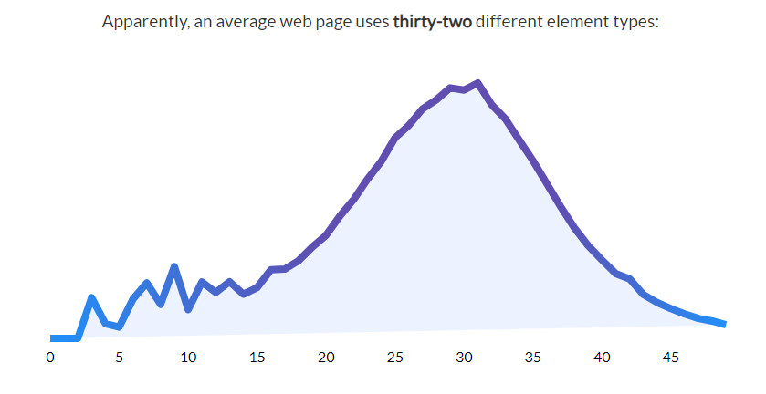

>> 생활코딩 web1 = HTML & Internet 을 학습, 정리한 내용입니다. (https://opentutorials.org/course/3084)

# **HTML & Internet**

- web
    - HTML
      - tag
      - structure
    - Internet
      - server
      - client
      - web server
      - http
      - network

# 목차
* chapter 1 ~ chapter 35
  1. [소개](#1.소개)
  2. [프로젝트의 동기](#2.프로젝트의%20동기)
  3. 기획
  4. 코딩과 HTML
  5. HTML 코딩 실습 환경 준비
  6. 기본 문법 - 태그
  7. 혁명적인 변화
  8. 통계에 기반한 학습
  9. 줄바꿈 `<br>` vs `<p>`
  10. HTML이 중요한 이유
  11. 최후의 문법 속성과 img
  12. 부모 자식과 목록
  13. 문서의 구조와 슈퍼스타들
  14. HTML 태그의 제왕
  15. 웹사이트 완성
  16. 원시웹
  17. 인터넷을 여는 열쇠 : 서버와 클라이언트
  18. 웹호스팅 (github pages)
  19. 웹서버 운영하기
  20. 웹서버 설치(window, mac, linux)
  21. 웹서버와 http(window, mac, linux)
  22. 웹서버와 웹브라우저의 통신(window, mac, linux)
  23. 수업을 마치며 
  24. 부록 : 코드의 힘
  25. 부록 : 코드의 힘 - 동영상 삽입
  26. 부록 : 코드의 힘 - 댓글 기능 추가
  27. 부록 : 코드의 힘 - 채팅 기능 추가
  28. 부록 : 코드의 힘 - 방문자 분석기
  29. 엔딩 크레딧


# 1. 소개
* 웹, 인터넷, 컴퓨터라는 거대한 세계를 탐험하자
* 탐험 시작전에 스스로를 코딩을 배우는 학생이 아니라 나의 문제를 코딩으로 해결하려는 엔지니어라고 상상하자
* ### **어떤 문제가 우리 삶에서 중요하고 심각할수록 문제로부터 우리를 해방시켜줄 것**  
* 반대로 문제가 우리 삶과 동떨어져 있고 사소하다면 공부자체가 삶의 문제가 되어서 해방시키기는 커녕 억압시킬 것
* ### **공부의 효용을 뇌에게 자주 증명한다면 공부를 좋아할 수 밖에 없다. 자연스럽게 실력도 좋아질 것**
* 지식을 배우는 것도 좋지만 공부와 친해지는 계기가 될 것!


# 2. 프로젝트의 동기
* youtube와 같은 무료 동영상 공유 서비스가 HD화질을 만나면서(작은 글씨도 볼 수 있게) 인터넷을 통해 쉽게 원하는 공부를 할 수 있게 되었다.
* 지금 시대는 오프라인에서 온라인으로 아날로그에서 디지털로 넘어가는 과도기라 볼 수 있다.
* 무궁무진한 인터넷의 자료를 활용해 자신이 직면한 문제를 능동적인 학습을 통해 해결하자!


# 3. 기획
* 우리가 무엇인가를 만들기 전에 무엇을 만들 것인가를 미리 상상하고 계획하고 구체화 하는 과정이 필요하다
  * 만들고 나서 원하는게 아니었거나 문제가 있으면 손해고 여러 사람이 같이 하는 경우에 서로 생각하는 바가 다르면 굉장히 곤란하기 때문
* ### 설계하고 그려보는 과정을 기획이라 한다.(기획자)
## 기획자가 되어 보자
### 코딩수업과 내용을 잘 정리정돈 할 수 있는 웹사이트를 그림으로 한번 그려보자
* 위에 web이라는 글씨는 보여지게 하고
* 왼쪽에는 목록 
* 오른쪽에 제목과 내용(동영상, 글 등)을 표시


# 4. 코딩과 HTML
## HTML 코딩
### 1. 기계와 사람이 하는 일을 분리해보자
### 2. 원인과 결과를 추론해보자

* ### 사람이 하는 일 - 원인(오른쪽)
* ### 기계가 하는 일 - 결과(왼쪽)


## Code, Source, Language
* 사람이 하는 일, 원인을 부르는 여러 가지 표현
  1. code - 부호, 선호
  2. source - 원천
  3. language - 약속

## Application, App, Program, Webpage, Website
* 기계가 하는 일, 결과를 부르는 여러가지 표현
  1. Application - 응용 소프트웨어
  2. App - (모바일)응용 소프트웨어
  3. Program - 프로그램
  4. Webpage - web상 문서
  5. Website - 웹 페이지 집합
### 다 비슷한 용어. 같은 대상을 바라보는 관점에 따라서 조금씩 달라지는 것에 불과

## 프로그래밍
* 코드을 통해서 프로그램을 만드는 것이
프로그래밍의 핵심

## HTML
* 다양한 프로그래밍 언어(코드)가 있다.
  * C, C++, java, javascript, python, php,sql 등등등...
* 이 중 웹 페이지를 만드는 코드가 바로 **HTML**
### Webpage
* 인류가 생산한 거의 모든 디지털 정보가 담기는 가장 거대한 그릇
* 그리고 그 웹페이지를 만드는 언어가 HTML

## HTML의 장점
1. 쉽다
   * 그 어떤 프로그래밍 언어보다도 쉽다.
   * 10분이면 문법을 이해할 수 있다.
2. 중요하다
   * 하루에도 100번이상 보는 웹페이지. 자주 사용하는만큼 HTML은 중요하다.
3. 퍼블릭 도메인

## 퍼블릭 도메인
* 우리가 한국어, 영어를 쓰는데 어떠한 비용도 지불하지 않는다. 
* 웹을 처음 만든 팀 버너스 리가 웹을 어떠한 저작권도 존재하지 않는 완전한 자유를 의미하는 퍼블릭 도메인으로 선언했기 때문
* 따라서 google, mozilla, MS, apple, naver와 같은 회사들이 각자 브라우저를 만들 수 있는 것
* 그리고 한 웹페이지를 여러 브라우저에서 똑같이 볼 수 있게 된 것도 이러한 이유
* 사실 퍼블릭 도메인이라는 거대한 바다 위에 저작권이나 특허는 섬처럼 드물게 존재
* **빨리 가려면 혼자 가고 길게 가려면 같이 가라**
* 웹은 특정 기업이 독점하는 기술만큼 빠르게 발전하진 못했지만 독점하지 않기 때문에 30년이 넘도록 살아남았고 앞으로 수십년은 살아있을 가능성이 매우 높다.


# 5. HTML 코딩 실습 환경 준비
HTML을 이용해서 코딩을 해보자

## 실습에 필요한 것
1. 웹 브라우저
2. 에디터 - 코드를 작성하는 프로그램

### 에디터
* 컴퓨터에는 기본 에디터가 내장되어 있다.
  * window-메모장
  * mac-TextEdit
  * linux-gedit
* 에디터마다 사용법이 다르고 코드를 작성하는 것에 최적화된 에디터가 아니다.
* 그래서 코드 작성용 전문적인 에디터를 사용하자.
* Atom, VScode 등
### 검색) best HTML Editor 2021

> 출처 : [best HTML Editor 2021](https://careerkarma.com/blog/best-html-editors/)

### 에디터를 다운받고 에디터에서 작업공간(workspace)으로 사용할 폴더를 만들고 파일을 에디터에서 작성해보자.


# 6. 기본 문법 - 태그
* 태그라는 기초적인 지식만 배워도 1분안에 필요한 태그를 검색하면 된다
* tag 150개 있다.
* 평균적으로 한 웹페이지에 25~40개 정도 쓰인다. > 이 정도만 알아도 ok
## tag 빈도수 순위 
1. `<head>`
2. `<body>`
3. `<title>`
4. `<meta>` - metadata
5. `<div>` - division
6. `<a>` - anchor
7. `<script>` 
8. `<link>` 
9. `` -image
10. `<p>` - paragraph
11. `<span>` - span(가상의 폭, 공간)
12. `<li>` - list
13. `<ul>` - unordered list
14. `<br>` - (line)break
15. `<style>` 
16. `<h1>` - headline1
17. `<h2>` 
18. `<input>` 
19. `<form>` - HTML form 생성
20. `<strong>` 강하게(strong) 강조
21. `<h3>` 
22. `<table>` - 표
23. `<tr>` - table row
24. `<td>` - table data


[실습]
```html
<h1>How to learn programming</h1> 
<ol>
  What is <strong>programming</strong>?
  What is <strong>computer language</strong>?
  Which language should I learn?
  What <u>order</u> should I learn?
</ol>
```

# 7. 혁명적인 변화

### 공부에 대한 오해
중요한 것은 어렵고  
쉬운 것은 사소하다는 것
 
이렇게 생각하게 된 이유 -   
쉬운 것은
시험에 나오지 않기 때문

시험의 목적 :  
누가 얼마나 열심히 공부했는지를 구분하는 것

따라서 틀릴 만한 것이 출제된다.

그래서  
어려운 것이 중요하고,  
쉬운 것은 중요하지 않다는 생각을 가진다.

***처음에 배우는 것은 쉽지만 중요  
가장 자주 사용되는 부품이면서,  
그 부품을 결합해서   
새로운 완제품을 만들어 내는 결합방법이기 때문***

## `<tag>`를 배우기 전과 후는 인생의 전환점이라고 할 정도로 혁명적인 변화다.

### W3C(The World Wide Web Consortium)
국제민간표준화기구의 홈페이지
> [W3](https://www.w3.org/)

웹은 한 기업에 의해서 만들어지는 것이 아니고  
W3C에 소속된 여러 기업과 기관들의
논의를 통해서 만들어 진다.  

미래에는 어떤 기능이 필요하고,  
그 기능은 어떤 태그로 표현할 것인가를 의논하는 것

W3C에서 웹의 미래가 결정되면  
각각의 브라우저 업체들이 같은 태그를
보다 잘 구현하기 위해서 치열하게 경쟁

웹이 다른 기술들과 구분되는  
공공재적인 면모

## 페이지 소스보기(View Page Source)
(아무) 웹사이트에서 오른쪽 클릭 

웹페이지의 소스코드를 볼 수 있다.

### 예시) W3C 웹페이지 소스코드
```html
<h1 class="logo">
    <a tabindex="2" accesskey="1" href="/">
        
    </a> 
    <span class="alt-logo">W3C</span>    
</h1>
```
>>> 단순화
```html
<h1>
    <a>
        
    </a> 
    <span>W3C</span>    
</h1>
```
>>> `<h1>`, `<span>`, `<a>`, `` 태그 확인 할 수 있다.
 
### 검색) HTML h1 tag
```html
<h1>This is heading 1</h1>
<h2>This is heading 2</h2>
<h3>This is heading 3</h3>
<h4>This is heading 4</h4>
<h5>This is heading 5</h5>
<h6>This is heading 6</h6> 
```
결과
<h1>This is heading 1</h1>
<h2>This is heading 2</h2>
<h3>This is heading 3</h3>
<h4>This is heading 4</h4>
<h5>This is heading 5</h5>
<h6>This is heading 6</h6> 

### 예제를 먼저 보고 정의를 보자
* 이론을 통해서 배우는 것보다 경험을 통해서 추론하는 것이 더 기억에 오래 남고 자기 것이 될 확률이 높다.
 
### 예제
```html
The <h1> to <h6> tags are used to define HTML headings. <h1> defines the most important heading. <h6> defines the least important heading.
```
heading은 제목이라는 뜻입니다.  
이를 통해서  
h1은 가장 큰 제목 태그라는 것을 알 수 있습니다.

## 검색의 위대함
우리가 어떤 정보를 알아내는데 1분밖에 걸리지 않는다면 그 정보를 이미 알고 있는 것이나 다름없다.

과거에는 많은 것을 배우고 외워야 했지만
이제는 검색하는 능력만 기른다면 어떤 정보든
이미 알고 있는 것과 다를 바 없다.

무엇인가를 달달 외우는 것은 시대에 어울리지 않는 공부 방법이다.

### 기초만으로도 많은 것을 할 수 있는 시대
기초만 있으면 올바른 검색 키워드를 알 수 있고
제대로 검색할 수 있다.

 
# 8. 통계에 기반한 학습

## 구글의 웹페이지 분석 
구글에서는
전 세계에 있는 수많은 웹페이지를 분석합니다.

그 분석 결과를 공개했었는데
그 결과를 보기 좋게 잘 정리 정돈한 사이트가 있다.

>https://advancedwebranking.com/html/




## 쉬운 것은 더 자주 사용된다 
## 어려운 것은 더 적게 사용된다
쉽고 단순하다고 결코 중요하지 않은 것이 아니고

어렵고 복잡하다고 결코 중요한 것이라 할 수 없다.

결국 통계에 기반해 가장 많이 사용되는 가장 중요한 것들을 먼저 배우고 더 많이 훈련해야 한 다.


# 9. 줄바꿈 `<br>` vs `<p>`

### 그냥 줄을 띄워 줄바꿈을 시도
```html
<h1>HTML</h1>
Hypertext Markup Language (HTML) is the standard markup language for <strong>creating <u>web</u> pages</strong> and web applications.Web browsers receive HTML documents from a web server or from local storage and render them into multimedia web pages. HTML describes the structure of a web page semantically and originally included cues for the appearance of the document.

HTML elements are the building blocks of HTML pages. With HTML constructs, images and other objects, such as interactive forms, may be embedded into the rendered page. It provides a means to create structured documents by denoting structural semantics for text such as headings, paragraphs, lists, links, quotes and other items. HTML elements are delineated by tags, written using angle brackets. 
```
>> 줄바꿈이 되지 않았다.
### `<br>` 태그 사용
```html
<h1>HTML</h1>
Hypertext Markup Language (HTML) is the standard markup language for <strong>creating <u>web</u> pages</strong> and web applications.Web browsers receive HTML documents from a web server or from local storage and render them into multimedia web pages. HTML describes the structure of a web page semantically and originally included cues for the appearance of the document.<br><br>HTML elements are the building blocks of HTML pages. With HTML constructs, images and other objects, such as interactive forms, may be embedded into the rendered page. It provides a means to create structured documents by denoting structural semantics for text such as headings, paragraphs, lists, links, quotes and other items. HTML elements are delineated by tags, written using angle brackets. 
```
>> HTML에서 새로운 줄을 표현할 때 `<br>`을 사용하면 된다.
* br태그는 닫지 않는다. (감싸야 하는 컨텐츠가 없기 때문)
  * img, input, br, hr, meta등이 닫지 않는 태그

## `<p>`태그를 이용한 단락 표현
```html
<h1>HTML</h1>
<p>Hypertext Markup Language (HTML) is the standard markup language for <strong>creating <u>web</u> pages</strong> and web applications.Web browsers receive HTML documents from a web server or from local storage and render them into multimedia web pages. HTML describes the structure of a web page semantically and originally included cues for the appearance of the document.</p><p>HTML elements are the building blocks of HTML pages. With HTML constructs, images and other objects, such as interactive forms, may be embedded into the rendered page. It provides a means to create structured documents by denoting structural semantics for text such as headings, paragraphs, lists, links, quotes and other items. HTML elements are delineated by tags, written using angle brackets. </p>
```
>>> 결과는 br과 거의 같지만 조금 다르다
* p태그는 단락과 단락의 간격이 고정되어 있어
시각적으로 자유도가 떨어진다.
* br태그는 쓰는만큼 줄바꿈이 되서 원하는 만큼 간격을 줄 수 있다.
* 하지만 css를 사용하면 이러한 p태그의 단점을 극복할 수 있다.
* 결론적으로 p태그와 br태그는 그 이름과 용도에 맞게 각각 단락, 줄바꿈의 용도에 맞게 사용하자.


# 10. HTML이 중요한 이유
## 코딩의 기초 HTML
웹사이트를 만들기 위한 기초로서 HTML은 그 자체만으로도 많은 일을 할 수 있다.
## HTML의 중요성
### 1. 비즈니스적인 중요성  
HTML의 기초적 기능에 맞게 코드를 작성한다면  
검색기에도 노출이 잘 되고 코드를 해석하는데도 훨씬 시간이 적게 걸린다.

의미에 맞는 태그로 웹페이지를 만드는 것과 그렇지 않게 만드는 것은 천지차이로

***그렇지 않게 만드는 것은 검색기에 노출이 되자 않아 존재하지 않는 것과 다를 바 없다.***

### 2. 휴머니즘적인 중요성  
웹은 공공재로서 누구나 접근할 수 있다는 접근성이 가장 중요한 철학

신체적인 장애가 있는 사람도 웹을 통해서 정보에 접근할 수 있어야 한다.

만약 시각장애가 있는 사람은 스크린리더와 같은 프로그램을 사용해서 정보를 청각화해서 사용하는데 

***HTML을 사용하지 않고 웹 페이지 전체를 이미지로 만든다던가 기초에 충실하지 않게 웹페이지를 만든다면 자신도 모르는 사이에 누군가를 소외시키고 있는 것.***

### 결론적으로 HTML은 비즈니스적으로도 휴머니즘적으로도 중요한 기술


# 11. 최후의 문법 속성과 img


# 12. 부모 자식과 목록


# 13. 문서의 구조와 슈퍼스타들


# 14. HTML 태그의 제왕


# 15. 웹사이트 완성


# 16. 원시웹


# 17. 인터넷을 여는 열쇠 : 서버와 클라이언트


# 18. 웹호스팅 (github pages)


# 19. 웹서버 운영하기


# 20. 웹서버 설치(window, mac, linux)


# 21. 웹서버와 http(window, mac, linux)


# 22. 웹서버와 웹브라우저의 통신(window, mac, linux)


# 23. 수업을 마치며 


# 24. 부록 : 코드의 힘


# 25. 부록 : 코드의 힘 - 동영상 삽입


# 26. 부록 : 코드의 힘 - 댓글 기능 추가


# 27. 부록 : 코드의 힘 - 채팅 기능 추가


# 28. 부록 : 코드의 힘 - 방문자 분석기


# 29. 엔딩 크레딧


2021년 3월 12일 금요일
오후 2:07

0312
index.html (내컴) WEB browser (visitor) Web server/index.html(github<서버>)


Apache 1등자리 한번도 안뻇긴 제왕
How to install apache http server in os/mac/rinux
Wamp = windows apache mysql php 다운로드.
Wampstack apache 
C:\Bitnami\wampstack-8.0.3-0\apache2\htdocs
Htdocs : hypertextdocuments(webpage 저장된 곳)


주소를 입력해서 웹페이지 열기 vs 파일 불러오기로 웹페이지 열기 
>>웹 브라우저와 웹서버가 같은 컴퓨터에 있기 때문에 보여지는것은 같지만 
사실 둘은 너무나도 다르다.
1.
http://127.0.0.1/index.html
>> web browser가 web server에게 요청 
web server가 index.html 파일을 열어서
web browser에게 전송
http: hyper text transfer protocol. 웹페이지 전송 약속.  웹브라우저와 웹서버가 서로 통신할때
사용하는 규약. 

2.
file:///C:/Bitnami/wampstack-8.0.3-0/apache2/htdocs/index.html
>> web browser가 직접 파일을 열어서 보여줌. 
Web server 관여 x

웹브라우저가 웹서버에 요청을할때는 ip주소가 필요하다. 
웹브라우저의 주소창에 
Localhost=127.0.0.1= 자기자신을 의미. 모든 컴퓨터 공통.
자신의 아이피주소확인 >> 네트워크 공유센터 192.168.31.164

apachi server port 번호 확인 configure 버튼 또는 conf파일에서 확인가능

# 부록

2021년 3월 12일 금요일
오후 5:55

1 동영상 추가 iframe(유투브에서 embed(퍼가기)

2 댓글기능 추가 - 1)disqus, livere
//자신이 댓글기능 개발 가능.
