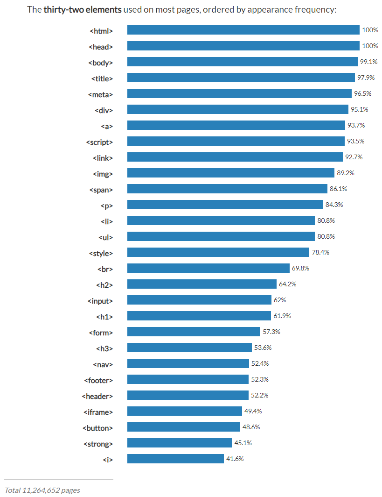

>> 생활코딩 web1 = HTML & Internet 을 학습, 정리한 내용입니다. (https://opentutorials.org/course/3084)

# **HTML & Internet**

- web
    - HTML
      - tag
      - structure
    - Internet
      - server
      - client
      - web server
      - http
      - network

# 목차
- [**HTML & Internet**](#html--internet)
- [목차](#목차)
- [6. 기본 문법 - 태그](#6-기본-문법---태그)
  - [tag 빈도수 순위](#tag-빈도수-순위)
- [7. 혁명적인 변화](#7-혁명적인-변화)
    - [공부에 대한 오해](#공부에-대한-오해)
  - [`<tag>`를 배우기 전과 후는 인생의 전환점이라고 할 정도로 혁명적인 변화다.](#tag를-배우기-전과-후는-인생의-전환점이라고-할-정도로-혁명적인-변화다)
    - [W3C(The World Wide Web Consortium)](#w3cthe-world-wide-web-consortium)
  - [페이지 소스보기(View Page Source)](#페이지-소스보기view-page-source)
    - [예시) W3C 웹페이지 소스코드](#예시-w3c-웹페이지-소스코드)
    - [검색) HTML h1 tag](#검색-html-h1-tag)
    - [예제를 먼저 보고 정의를 보자](#예제를-먼저-보고-정의를-보자)
    - [예제](#예제)
  - [검색의 위대함](#검색의-위대함)
    - [기초만으로도 많은 것을 할 수 있는 시대](#기초만으로도-많은-것을-할-수-있는-시대)
- [8. 통계에 기반한 학습](#8-통계에-기반한-학습)
  - [구글의 웹페이지 분석](#구글의-웹페이지-분석)
  - [쉬운 것은 더 자주 사용된다](#쉬운-것은-더-자주-사용된다)
  - [어려운 것은 더 적게 사용된다](#어려운-것은-더-적게-사용된다)
- [9. 줄바꿈 `<br>` vs `<p>`](#9-줄바꿈-br-vs-p)
    - [그냥 줄을 띄워 줄바꿈을 시도](#그냥-줄을-띄워-줄바꿈을-시도)
    - [`<br>` 태그 사용](#br-태그-사용)
  - [`<p>`태그를 이용한 단락 표현](#p태그를-이용한-단락-표현)
- [10. HTML이 중요한 이유](#10-html이-중요한-이유)
  - [코딩의 기초 HTML](#코딩의-기초-html)
  - [HTML의 중요성](#html의-중요성)
    - [1. 비즈니스적인 중요성](#1-비즈니스적인-중요성)
    - [2. 휴머니즘적인 중요성](#2-휴머니즘적인-중요성)
    - [결론적으로 HTML은 비즈니스적으로도 휴머니즘적으로도 중요한 기술](#결론적으로-html은-비즈니스적으로도-휴머니즘적으로도-중요한-기술)
- [11. 최후의 문법 속성과 img](#11-최후의-문법-속성과-img)
  - [속성(attribute)](#속성attribute)
  - [img 태그](#img-태그)
    - [이미지 넣기 시도](#이미지-넣기-시도)
    - [이미지 넣기 시도 2](#이미지-넣기-시도-2)
    - [내 컴퓨터에 있는 이미지를 표시](#내-컴퓨터에-있는-이미지를-표시)
  - [속성은](#속성은)
- [12. 부모 자식과 목록](#12-부모-자식과-목록)
  - [태그 간의 관계를 나타내는 표현](#태그-간의-관계를-나타내는-표현)
  - [p, a 태그로 보는 부모-자식 태그](#p-a-태그로-보는-부모-자식-태그)
  - [고정된 관계인 태그들](#고정된-관계인-태그들)
  - [기획서](#기획서)
    - [목차 추가](#목차-추가)
  - [목차 태그 `<li>`](#목차-태그-li)
    - [li태그 사용](#li태그-사용)
  - [여러 개의 목차 - `<ul>` 태그 사용](#여러-개의-목차---ul-태그-사용)
    - [ul과 li는 밀접한 관계로 서로를 필요로 한다고 볼 수 있다.](#ul과-li는-밀접한-관계로-서로를-필요로-한다고-볼-수-있다)
    - [ul대신 ol을 쓸 수 있다.](#ul대신-ol을-쓸-수-있다)
  - [ol태그](#ol태그)
- [13. 문서의 구조와 슈퍼스타들](#13-문서의-구조와-슈퍼스타들)
  - [구조를 만드는 법](#구조를-만드는-법)
  - [웹페이지 구조](#웹페이지-구조)
  - [1. title 태그](#1-title-태그)
  - [2. UTF-8 문자 인코딩 설정](#2-utf-8-문자-인코딩-설정)
    - [문자가 깨지는 이유](#문자가-깨지는-이유)
    - [해결](#해결)
  - [3. body, head 태그](#3-body-head-태그)
  - [4. html 태그](#4-html-태그)
  - [5. doctype html](#5-doctype-html)
  - [완성된 html 구조 예제](#완성된-html-구조-예제)
- [14. HTML 태그의 제왕](#14-html-태그의-제왕)
  - [`<a>`태그 (링크)](#a태그-링크)
    - [예제](#예제-1)
    - [target="_blank"](#target_blank)
    - [title="html5 specification"](#titlehtml5-specification)
- [15. 웹사이트 완성](#15-웹사이트-완성)
  - [웹사이트 만들기 순서](#웹사이트-만들기-순서)

<small><i><a href='http://ecotrust-canada.github.io/markdown-toc/'>Table of contents generated with markdown-toc</a></i></small>


# 6. 기본 문법 - 태그
* 태그라는 기초적인 지식만 배워도 1분안에 필요한 태그를 검색하면 된다
* tag 150개 있다.
* 평균적으로 한 웹페이지에 25~40개 정도 쓰인다. > 이 정도만 알아도 ok
## tag 빈도수 순위 
1. `<head>`
2. `<body>`
3. `<title>`
4. `<meta>` - metadata
5. `<div>` - division
6. `<a>` - anchor
7. `<script>` 
8. `<link>` 
9. `` -image
10. `<p>` - paragraph
11. `<span>` - span(가상의 폭, 공간)
12. `<li>` - list
13. `<ul>` - unordered list
14. `<br>` - (line)break
15. `<style>` 
16. `<h1>` - headline1
17. `<h2>` 
18. `<input>` 
19. `<form>` - HTML form 생성
20. `<strong>` 강하게(strong) 강조
21. `<h3>` 
22. `<table>` - 표
23. `<tr>` - table row
24. `<td>` - table data


[실습]
```html
<h1>How to learn programming</h1> 
<ol>
  What is <strong>programming</strong>?
  What is <strong>computer language</strong>?
  Which language should I learn?
  What <u>order</u> should I learn?
</ol>
```

# 7. 혁명적인 변화

### 공부에 대한 오해
중요한 것은 어렵고  
쉬운 것은 사소하다는 것
 
이렇게 생각하게 된 이유 -   
쉬운 것은
시험에 나오지 않기 때문

시험의 목적 :  
누가 얼마나 열심히 공부했는지를 구분하는 것

따라서 틀릴 만한 것이 출제된다.

그래서  
어려운 것이 중요하고,  
쉬운 것은 중요하지 않다는 생각을 가진다.

***처음에 배우는 것은 쉽지만 중요  
가장 자주 사용되는 부품이면서,  
그 부품을 결합해서   
새로운 완제품을 만들어 내는 결합방법이기 때문***

## `<tag>`를 배우기 전과 후는 인생의 전환점이라고 할 정도로 혁명적인 변화다.

### W3C(The World Wide Web Consortium)
국제민간표준화기구의 홈페이지
> [W3](https://www.w3.org/)

웹은 한 기업에 의해서 만들어지는 것이 아니고  
W3C에 소속된 여러 기업과 기관들의
논의를 통해서 만들어 진다.  

미래에는 어떤 기능이 필요하고,  
그 기능은 어떤 태그로 표현할 것인가를 의논하는 것

W3C에서 웹의 미래가 결정되면  
각각의 브라우저 업체들이 같은 태그를
보다 잘 구현하기 위해서 치열하게 경쟁

웹이 다른 기술들과 구분되는  
공공재적인 면모

## 페이지 소스보기(View Page Source)
(아무) 웹사이트에서 오른쪽 클릭 

웹페이지의 소스코드를 볼 수 있다.

### 예시) W3C 웹페이지 소스코드
```html
<h1 class="logo">
    <a tabindex="2" accesskey="1" href="/">
        
    </a> 
    <span class="alt-logo">W3C</span>    
</h1>
```
>>> 단순화
```html
<h1>
    <a>
        
    </a> 
    <span>W3C</span>    
</h1>
```
>>> `<h1>`, `<span>`, `<a>`, `` 태그 확인 할 수 있다.
 
### 검색) HTML h1 tag
```html
<h1>This is heading 1</h1>
<h2>This is heading 2</h2>
<h3>This is heading 3</h3>
<h4>This is heading 4</h4>
<h5>This is heading 5</h5>
<h6>This is heading 6</h6> 
```
결과
<h1>This is heading 1</h1>
<h2>This is heading 2</h2>
<h3>This is heading 3</h3>
<h4>This is heading 4</h4>
<h5>This is heading 5</h5>
<h6>This is heading 6</h6> 

### 예제를 먼저 보고 정의를 보자
* 이론을 통해서 배우는 것보다 경험을 통해서 추론하는 것이 더 기억에 오래 남고 자기 것이 될 확률이 높다.
 
### 예제
```html
The <h1> to <h6> tags are used to define HTML headings. <h1> defines the most important heading. <h6> defines the least important heading.
```
heading은 제목이라는 뜻입니다.  
이를 통해서  
h1은 가장 큰 제목 태그라는 것을 알 수 있습니다.

## 검색의 위대함
우리가 어떤 정보를 알아내는데 1분밖에 걸리지 않는다면 그 정보를 이미 알고 있는 것이나 다름없다.

과거에는 많은 것을 배우고 외워야 했지만
이제는 검색하는 능력만 기른다면 어떤 정보든
이미 알고 있는 것과 다를 바 없다.

무엇인가를 달달 외우는 것은 시대에 어울리지 않는 공부 방법이다.

### 기초만으로도 많은 것을 할 수 있는 시대
기초만 있으면 올바른 검색 키워드를 알 수 있고
제대로 검색할 수 있다.

 
# 8. 통계에 기반한 학습

## 구글의 웹페이지 분석 
구글에서는
전 세계에 있는 수많은 웹페이지를 분석합니다.

그 분석 결과를 공개했었는데
그 결과를 보기 좋게 잘 정리 정돈한 사이트가 있다.

>https://advancedwebranking.com/html/




## 쉬운 것은 더 자주 사용된다 
## 어려운 것은 더 적게 사용된다
쉽고 단순하다고 결코 중요하지 않은 것이 아니고

어렵고 복잡하다고 결코 중요한 것이라 할 수 없다.

결국 통계에 기반해 가장 많이 사용되는 가장 중요한 것들을 먼저 배우고 더 많이 훈련해야 한 다.


# 9. 줄바꿈 `<br>` vs `<p>`

### 그냥 줄을 띄워 줄바꿈을 시도
```html
<h1>HTML</h1>
Hypertext Markup Language (HTML) is the standard markup language for <strong>creating <u>web</u> pages</strong> and web applications.Web browsers receive HTML documents from a web server or from local storage and render them into multimedia web pages. HTML describes the structure of a web page semantically and originally included cues for the appearance of the document.

HTML elements are the building blocks of HTML pages. With HTML constructs, images and other objects, such as interactive forms, may be embedded into the rendered page. It provides a means to create structured documents by denoting structural semantics for text such as headings, paragraphs, lists, links, quotes and other items. HTML elements are delineated by tags, written using angle brackets. 
```
>> 줄바꿈이 되지 않았다.
### `<br>` 태그 사용
```html
<h1>HTML</h1>
Hypertext Markup Language (HTML) is the standard markup language for <strong>creating <u>web</u> pages</strong> and web applications.Web browsers receive HTML documents from a web server or from local storage and render them into multimedia web pages. HTML describes the structure of a web page semantically and originally included cues for the appearance of the document.<br><br>HTML elements are the building blocks of HTML pages. With HTML constructs, images and other objects, such as interactive forms, may be embedded into the rendered page. It provides a means to create structured documents by denoting structural semantics for text such as headings, paragraphs, lists, links, quotes and other items. HTML elements are delineated by tags, written using angle brackets. 
```
>> HTML에서 새로운 줄을 표현할 때 `<br>`을 사용하면 된다.
* br태그는 닫지 않는다. (감싸야 하는 컨텐츠가 없기 때문)
  * img, input, br, hr, meta등이 닫지 않는 태그

## `<p>`태그를 이용한 단락 표현
```html
<h1>HTML</h1>
<p>Hypertext Markup Language (HTML) is the standard markup language for <strong>creating <u>web</u> pages</strong> and web applications.Web browsers receive HTML documents from a web server or from local storage and render them into multimedia web pages. HTML describes the structure of a web page semantically and originally included cues for the appearance of the document.</p><p>HTML elements are the building blocks of HTML pages. With HTML constructs, images and other objects, such as interactive forms, may be embedded into the rendered page. It provides a means to create structured documents by denoting structural semantics for text such as headings, paragraphs, lists, links, quotes and other items. HTML elements are delineated by tags, written using angle brackets. </p>
```
>>> 결과는 br과 거의 같지만 조금 다르다
* p태그는 단락과 단락의 간격이 고정되어 있어
시각적으로 자유도가 떨어진다.
* br태그는 쓰는만큼 줄바꿈이 되서 원하는 만큼 간격을 줄 수 있다.
* 하지만 css를 사용하면 이러한 p태그의 단점을 극복할 수 있다.
* 결론적으로 p태그와 br태그는 그 이름과 용도에 맞게 각각 단락, 줄바꿈의 용도에 맞게 사용하자.


# 10. HTML이 중요한 이유
## 코딩의 기초 HTML
웹사이트를 만들기 위한 기초로서 HTML은 그 자체만으로도 많은 일을 할 수 있다.
## HTML의 중요성
### 1. 비즈니스적인 중요성  
HTML의 기초적 기능에 맞게 코드를 작성한다면  
검색기에도 노출이 잘 되고 코드를 해석하는데도 훨씬 시간이 적게 걸린다.

의미에 맞는 태그로 웹페이지를 만드는 것과 그렇지 않게 만드는 것은 천지차이로

***그렇지 않게 만드는 것은 검색기에 노출이 되자 않아 존재하지 않는 것과 다를 바 없다.***

### 2. 휴머니즘적인 중요성  
웹은 공공재로서 누구나 접근할 수 있다는 접근성이 가장 중요한 철학

신체적인 장애가 있는 사람도 웹을 통해서 정보에 접근할 수 있어야 한다.

만약 시각장애가 있는 사람은 스크린리더와 같은 프로그램을 사용해서 정보를 청각화해서 사용하는데 

***HTML을 사용하지 않고 웹 페이지 전체를 이미지로 만든다던가 기초에 충실하지 않게 웹페이지를 만든다면 자신도 모르는 사이에 누군가를 소외시키고 있는 것.***

### 결론적으로 HTML은 비즈니스적으로도 휴머니즘적으로도 중요한 기술


# 11. 최후의 문법 속성과 img
## 속성(attribute)
* 태그의 심화된 문법
## img 태그
* 본문에 이미지를 넣는 기능
### 이미지 넣기 시도
```html
<h1>HTML</h1>
<p>Hypertext Markup Language (HTML) is the standard markup language for <strong>creating <u>web</u> pages</strong> and web applications.Web browsers receive HTML documents from a web server or from local storage and render them into multimedia web pages. HTML describes the structure of a web page semantically and originally included cues for the appearance of the document.

</p><p style="margin-top:45px;">HTML elements are the building blocks of HTML pages. With HTML constructs, images and other objects, such as interactive forms, may be embedded into the rendered page. It provides a means to create structured documents by denoting structural semantics for text such as headings, paragraphs, lists, links, quotes and other items. HTML elements are delineated by tags, written using angle brackets. </p>
```
>> 실패 - 태그 이름만으로는 정보가 부족.

>> 그래서 새로운 문법을 도입

### 이미지 넣기 시도 2
```html
<h1>HTML</h1>
<p>Hypertext Markup Language (HTML) is the standard markup language for <strong>creating <u>web</u> pages</strong> and web applications.Web browsers receive HTML documents from a web server or from local storage and render them into multimedia web pages. HTML describes the structure of a web page semantically and originally included cues for the appearance of the document.

</p><p style="margin-top:45px;">HTML elements are the building blocks of HTML pages. With HTML constructs, images and other objects, such as interactive forms, may be embedded into the rendered page. It provides a means to create structured documents by denoting structural semantics for text such as headings, paragraphs, lists, links, quotes and other items. HTML elements are delineated by tags, written using angle brackets. </p>
```
>> img 태그에 source의 줄임말인 src를 붙인다.
 
* 추가한 내용
```html

```
>> src가 속성

* https://s3-ap-northeast-2.amazonaws.com/opentutorials-user-file/module/3135/7648.png

>>src라는 속성을 통해서
이미지를 불러올 수 있게 된 것

>>위의 이미지는 인터넷에 있는 이미지입니다.
내 컴퓨터에 이미지가 없어도 표시할 수 있다.

### 내 컴퓨터에 있는 이미지를 표시
1. 웹브라우저에서 원하는 이미지를 찾은 다음
2. 이미지 위에서 오른쪽 클릭을 해서 원하는 위치에 이미지를 저장
   * public domain image
     * 저작권 없는 무료 이미지 검색
     1. Wikimedia Commons
     2. Unsplash
     3. Flickr Commons
     4. Public Domain Pictures
     5. Magdeleine
     6. Old Book Illustrations
     7. ISO Republic
     8. Public Domain Vectors
     9. 1 Million Free Pictures
     10. Free Stock Photos
3. 경로 설정
  ``
4. 이미지 크기 설정
  * 검색) html img size attribute
  * 숫자나 % 등으로 크기 설정 가능
  ```html
  <h1>HTML</h1>
  <p>Hypertext Markup Language (HTML) is the standard markup language for <strong>creating <u>web</u> pages</strong> and web applications.Web browsers receive HTML documents from a web server or from local storage and render them into multimedia web pages. HTML describes the structure of a web page semantically and originally included cues for the appearance of the document.
  
  </p><p style="margin-top:45px;">HTML elements are the building blocks of HTML pages. With HTML constructs, images and other objects, such as interactive forms, may be embedded into the rendered page. It provides a means to create structured documents by denoting structural semantics for text such as headings, paragraphs, lists, links, quotes and other items. HTML elements are delineated by tags, written using angle brackets. </p>
  ```

## 속성은
태그의 이름만으로는 정보가 부족할 때 사용  
속성이라는 문법이 추가되면서 이제 태그는 보다 풍부한 표현력을 가짐.  


# 12. 부모 자식과 목록

## 태그 간의 관계를 나타내는 표현
* 부모(parent), 자식(child)
  ```html
  <parent>
      <child></child>
  </parent>
  ```
  * parent 태그에 대해서
  child 태그를
  자식 태그라고 하고 

  * child 태그에 대해서
  parent 태그를
  부모 태그라고 한다.

## p, a 태그로 보는 부모-자식 태그
```html
<p>
    <a href="https://opentutorials.org">opentutorials</a>
</p>
```

* 그런데 a 태그는
꼭 p 태그의 자식이어야 하는 것은 아니고

* 마찬가지로 p 태그가 꼭 a 태그의 부모일 필요는 없다

* 직장의 상하관계처럼
필요에 따라서 관계가 달라질 수 있다.

## 고정된 관계인 태그들

## 기획서 
 
아직 진행하지 않은 부분이
붉은색으로 표시한 목차 부분

### 목차 추가
```html
1. HTML<br>
2. CSS<br>
3. JavaScript<br>

<h1>HTML</h1>
<p>Hypertext Markup Language (HTML) is the standard markup language for <strong>creating <u>web</u> pages</strong> and web applications.Web browsers receive HTML documents from a web server or from local storage and render them into multimedia web pages. HTML describes the structure of a web page semantically and originally included cues for the appearance of the document.

</p><p style="margin-top:45px;">HTML elements are the building blocks of HTML pages. With HTML constructs, images and other objects, such as interactive forms, may be embedded into the rendered page. It provides a means to create structured documents by denoting structural semantics for text such as headings, paragraphs, lists, links, quotes and other items. HTML elements are delineated by tags, written using angle brackets. 
</p>
``` 

## 목차 태그 `<li>`
### li태그 사용
```html
<li>1. HTML</li>
<li>2. CSS</li>
<li>3. JavaScript</li>

<h1>HTML</h1>
<p>Hypertext Markup Language (HTML) is the standard markup language for <strong>creating <u>web</u> pages</strong> and web applications.Web browsers receive HTML documents from a web server or from local storage and render them into multimedia web pages. HTML describes the structure of a web page semantically and originally included cues for the appearance of the document.
</p><p style="margin-top:45px;">HTML elements are the building blocks of HTML pages. With HTML constructs, images and other objects, such as interactive forms, may be embedded into the rendered page. It provides a means to create structured documents by denoting structural semantics for text such as headings, paragraphs, lists, links, quotes and other items. HTML elements are delineated by tags, written using angle brackets. 
</p>
```
 
## 여러 개의 목차 - `<ul>` 태그 사용
```html
<ul>
  <li>1. HTML</li>
  <li>2. CSS</li>
  <li>3. JavaScript</li>
</ul>
<ul>
  <li>egoing</li>
  <li>k8805</li>
  <li>sorialgi</li>
</ul>
<h1>HTML</h1>
<p>Hypertext Markup Language (HTML) is the standard markup language for <strong>creating <u>web</u> pages</strong> and web applications.Web browsers receive HTML documents from a web server or from local storage and render them into multimedia web pages. HTML describes the structure of a web page semantically and originally included cues for the appearance of the document.
</p><p style="margin-top:45px;">HTML elements are the building blocks of HTML pages. With HTML constructs, images and other objects, such as interactive forms, may be embedded into the rendered page. It provides a means to create structured documents by denoting structural semantics for text such as headings, paragraphs, lists, links, quotes and other items. HTML elements are delineated by tags, written using angle brackets. 
</p>
```
### ul과 li는 밀접한 관계로 서로를 필요로 한다고 볼 수 있다.
### ul대신 ol을 쓸 수 있다.

## ol태그
자동을 순서를 매겨준다.
```html
<ol>
  <li>HTML</li>
  <li>CSS</li>
  <li>JavaScript</li>
</ol>
<h1>HTML</h1>
<p>Hypertext Markup Language (HTML) is the standard markup language for <strong>creating <u>web</u> pages</strong> and web applications.Web browsers receive HTML documents from a web server or from local storage and render them into multimedia web pages. HTML describes the structure of a web page semantically and originally included cues for the appearance of the document.
</p><p style="margin-top:45px;">HTML elements are the building blocks of HTML pages. With HTML constructs, images and other objects, such as interactive forms, may be embedded into the rendered page. It provides a means to create structured documents by denoting structural semantics for text such as headings, paragraphs, lists, links, quotes and other items. HTML elements are delineated by tags, written using angle brackets. 
</p>
```


# 13. 문서의 구조와 슈퍼스타들
## 구조를 만드는 법
문장이 모여 페이지가 되고 페이지가 모여 책이 되듯 웹상에서도 정보가 많아짐에 따라 정돈을 위한 체계, 구조가 필요하다.
## 웹페이지 구조
## 1. title 태그
검색엔진이 웹페이지를 분석할 때
가장 중요하게 생각하는 태그  
`<title>WEB1 - html</title>`
## 2. UTF-8 문자 인코딩 설정
### 문자가 깨지는 이유 
웹페이지가 저장된 문자 표현 방식과
웹브라우저가 웹페이지를 해석하는 방식이 일치하지 않을 때  
웹브라우저는 저렇게 이상한 문자를 표시
### 해결 
`<meta charset="utf-8">` 설정  

웹페이지를 UTF-8로 저장했다면
웹페이지를 열 때도 UTF-8 방식으로
해석해서 열어야 한다

## 3. body, head 태그
본문은 body 태그로  
본문을 설명하는 태그는 head 태그를 사용

## 4. html 태그
body 태그와
head 태그를 감싸는
하나의 태그를 두기로 약속
html 태그

## 5. doctype html
또 이 웹페이지가
HTML로서 만들어졌다는 것을
표현하기 위해서  문서의 시작에 아래와 같은 코드를 추가
`<!doctype html>`

## 완성된 html 구조 예제
```html
<!doctype html>
<html>
<head>
  <title>WEB1 - html</title>
  <meta charset="utf-8">
</head>
<body>
  <ol>
    <li>HTML</li>
    <li>CSS</li>
    <li>JavaScript</li>
  </ol>
  <h1>HTML</h1>
  <p>Hypertext Markup Language (HTML) is the standard markup language for <strong>creating <u>web</u> pages</strong> and web applications.Web browsers receive HTML documents from a web server or from local storage and render them into multimedia web pages. HTML describes the structure of a web page semantically and originally included cues for the appearance of the document.
  
  </p><p style="margin-top:45px;">HTML elements are the building blocks of HTML pages. With HTML constructs, images and other objects, such as interactive forms, may be embedded into the rendered page. It provides a means to create structured documents by denoting structural semantics for text such as headings, paragraphs, lists, links, quotes and other items. HTML elements are delineated by tags, written using angle brackets.
  </p>
</body>
</html>
```


# 14. HTML 태그의 제왕
## `<a>`태그 (링크)
HTML의 H에 해당하는 HyperText를 의미  
하루에도 백번도 넘게 사용하는 기능인 link를 의미  
a는 anchor의 약자  
href는 HypterText REFerence의 약자
### 예제
```html
<a href="https://www.w3.org/TR/html5/" target="_blank" title="html5 specification">Hypertext Markup Language (HTML)</a>
```
### target="_blank"
링크를 클릭했을 때 새창에서 페이지가 열리게 하는 속성
### title="html5 specification"
링크가 어떤 내용을 담고 있는지를 툴팁으로 보여주는 기능


# 15. 웹사이트 완성
페이지가 모이면 책이 되듯이  
웹페이지들을 링크로 모으면 웹사이트가 된다.
## 웹사이트 만들기 순서
1. 웹페이지 전체를 대표하는 큰 제목 만들기
2. 각 부분에 링크를 걸어서 다른 페이지와 연결시키기
3. 파일을 복제해서 여러 개의 파일을 만들고 각각의 파일에 맞게 내용 수정하기

