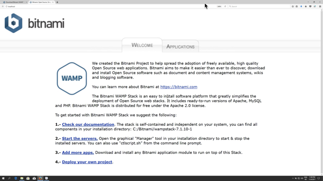

>> 생활코딩 web1 = HTML & Internet 을 학습, 정리한 내용입니다. (https://opentutorials.org/course/3084)

# **HTML & Internet**

- web
    - HTML
      - tag
      - structure
    - Internet
      - server
      - client
      - web server
      - http
      - network

# 목차
- [**HTML & Internet**](#html--internet)
- [목차](#목차)
- [16. 원시웹](#16-원시웹)
  - [인터넷 속의 웹](#인터넷-속의-웹)
    - [또 웹과 동급인 기술이 별처럼 많이 있다.](#또-웹과-동급인-기술이-별처럼-많이-있다)
    - [우리도 웹과 동급인 기술을 개발할 수 있다.](#우리도-웹과-동급인-기술을-개발할-수-있다)
  - [정보기술 역사상 중요한 사건 2개](#정보기술-역사상-중요한-사건-2개)
  - [인터넷의 역사](#인터넷의-역사)
    - [인터넷의 시작](#인터넷의-시작)
    - [웹의 탄생](#웹의-탄생)
    - [웹 탄생의 배경](#웹-탄생의-배경)
    - [WWW](#www)
    - [원시웹](#원시웹)
  - [웹 마스터](#웹-마스터)
- [17. 인터넷을 여는 열쇠 : 서버와 클라이언트](#17-인터넷을-여는-열쇠--서버와-클라이언트)
  - [인터넷이 동작하는 원리](#인터넷이-동작하는-원리)
    - [최초의 웹과 인터넷](#최초의-웹과-인터넷)
    - [웹브라우저와 웹서버](#웹브라우저와-웹서버)
    - [웹브라우저와 웹서버의 동작](#웹브라우저와-웹서버의-동작)
    - [웹브라우저와 웹서버의 관계](#웹브라우저와-웹서버의-관계)
    - [웹브라우저](#웹브라우저)
    - [웹서버](#웹서버)
    - [관계의 명칭](#관계의-명칭)
    - [웹클라이언트](#웹클라이언트)
    - [웹서버](#웹서버-1)
    - [다양한 클라이언트와 서버](#다양한-클라이언트와-서버)
    - [서버와 클라이언트는 인터넷을 이용하는 모든 정보시스템에 적용되는 문법과 같다.](#서버와-클라이언트는-인터넷을-이용하는-모든-정보시스템에-적용되는-문법과-같다)
  - [웹서버의 사용](#웹서버의-사용)
- [18. 웹호스팅 (github pages)](#18-웹호스팅-github-pages)
  - [웹서버를 전문적으로 빌려주는 비즈니스](#웹서버를-전문적으로-빌려주는-비즈니스)
  - [github이용하기](#github이용하기)
  - [static web hosting vs dynamic ~](#static-web-hosting-vs-dynamic-)
  - [추천 웹호스팅 서비스](#추천-웹호스팅-서비스)
- [19. 웹서버 운영하기](#19-웹서버-운영하기)
  - [내 컴퓨터에 웹서버를 설치해서 직접 웹페이지 만들기](#내-컴퓨터에-웹서버를-설치해서-직접-웹페이지-만들기)
  - [웹 서버 프로그램](#웹-서버-프로그램)
  - [Apache 웹 서버 프로그램 설치하기](#apache-웹-서버-프로그램-설치하기)
- [20. 웹서버 설치(window)](#20-웹서버-설치window)
    - [매니저가 자동으로 실행되지 않거나, 나중에 실행하고 싶을 때](#매니저가-자동으로-실행되지-않거나-나중에-실행하고-싶을-때)
- [21. 웹서버와 http(window)](#21-웹서버와-httpwindow)
  - [웹서버와 HTTP](#웹서버와-http)
    - [localhost](#localhost)
    - [도메인 네임(domain name)](#도메인-네임domain-name)
    - [ip 주소(ip address)](#ip-주소ip-address)
    - [파일의 위치](#파일의-위치)
    - [htdocs](#htdocs)
    - [ip and 파일열기](#ip-and-파일열기)
    - [Http](#http)
- [22. 웹서버와 웹브라우저의 통신(window, mac, linux)](#22-웹서버와-웹브라우저의-통신window-mac-linux)
  - [웹서버와 웹브라우저의 통신](#웹서버와-웹브라우저의-통신)
  - [같은 네트워크를 사용하는 컴퓨터들 간의 웹페이지 공유](#같은-네트워크를-사용하는-컴퓨터들-간의-웹페이지-공유)
- [23. 수업을 마치며](#23-수업을-마치며)
  - [기술의 구분 : 본질과 혁신](#기술의-구분--본질과-혁신)
  - [학습의 분리 : 교양과 직업](#학습의-분리--교양과-직업)
  - [**긍정적인 것**과 부정적인 것](#긍정적인-것과-부정적인-것)
  - [복잡성의 문제](#복잡성의-문제)
  - [추가 학습 주제](#추가-학습-주제)
- [24. 부록 : 코드의 힘](#24-부록--코드의-힘)
- [25. 부록 : 코드의 힘 - 동영상 삽입](#25-부록--코드의-힘---동영상-삽입)
    - [소스코드](#소스코드)
- [26. 부록 : 코드의 힘 - 댓글 기능 추가](#26-부록--코드의-힘---댓글-기능-추가)
  - [Disqus 디스커스 댓글 앱 서비스](#disqus-디스커스-댓글-앱-서비스)
- [27. 부록 : 코드의 힘 - 채팅 기능 추가](#27-부록--코드의-힘---채팅-기능-추가)
  - [tawk.to 채팅 앱 서비스](#tawkto-채팅-앱-서비스)
- [28. 부록 : 코드의 힘 - 방문자 분석기](#28-부록--코드의-힘---방문자-분석기)
  - [구글 analytics 웹페이지 분석기 서비스](#구글-analytics-웹페이지-분석기-서비스)

<small><i><a href='http://ecotrust-canada.github.io/markdown-toc/'>Table of contents generated with markdown-toc</a></i></small>


# 16. 원시웹
## 인터넷 속의 웹
웹과 인터넷의 관계를 비유하자면  

인터넷이 도시라면  
웹은 도시 위에 있는 건물 하나

인터넷이 도로라면  
웹은 도로 위를 달리는 자동차 한 대

인터넷이 운영체제라면  
웹은 운영체제 위에서 동작하는 하나의 앱

벤 다이어그램으로 살펴본다면
웹이 인터넷의 부분집합

### 또 웹과 동급인 기술이 별처럼 많이 있다.
### 우리도 웹과 동급인 기술을 개발할 수 있다.

## 정보기술 역사상 중요한 사건 2개
1. 1960년대 인터넷의 탄생
2. 1990년대 웹의 시작

    이 둘은 무려 30년의 시차를 두고 탄생  
    두 기술을 잘 구분하지 못하는 이유는 웹이 너무나 성공했기 때문  
    웹 때문에 인터넷을 쓰기 시작했기 때문  
    웹은 그만큼 중요한 기술!

## 인터넷의 역사
### 인터넷의 시작  
1960년은 인류역사의 처음이자 마지막이었던 핵전쟁이 끝난지 얼마되지 않은 때 핵공격에 통신시스템이 심각한 취약점이 있다는 것을 발견  
통신이 중앙집중적이어서 한번에 통신이 마비되는 위험이 있었던 것  
그래서 분산된 형태의 통신시스템을 구상하기 시작  
그것이 인터넷의 시작
### 웹의 탄생  
수많은 통신장치들이 각자 일종의 전화국 역할을 하는 상호부조 시스템이 인터넷  
인터넷은 중앙이 없다.  
1960년에 인터넷이 탄생하고 30년간 대학, 군대, 기업과 같은 곳에서만 사용하는 엘리트 시스템으로 천천히 확산되고 있었다.  
그런데 1990년  
웹이 탄생한다.
### 웹 탄생의 배경
웹의 고향은 스위스 CERN이라는 유럽입자물리연구소  
강입자 가속기(둘레가 27km)를 힉스 입자의 존재여부를 확인 하는 실험을 하는 연구소.  
127개국에서 모인 12000명의 과학자와 엔지니어가 모인 연구소.  
1980년애 팀 버너스 리가 이 연구소에 도착  
이 때 웹의 전신이 될 프로그램을 만듦.  
### WWW 
그리고 연구소에 인터넷이 도입되면서  
팀버너스리는 지금까지의 경험에 인터넷을 합성  
1990년 10월에 웹페이지를 편집하는 프로그램 만듦.
1990년 11월에 세계 최초의 웹브라우저를 만듦.  
World Wide Web.  
### 원시웹
1990년 12월 24일에 웹서버를 완성하고 info.cern.ch라는 도메인 네임을 부여함.  
> http://info.cern.ch  

이때 부터 인터넷이 웹을 만나면서 본격적인 대중화가 시작  
이고잉은 팀버너스리가 처음으로 창조한 웹의 최최의 모습을 원시웹이라고 부름  
웹이기 위해 필요한 모든 것을 가지면서  
그렇지 않은 것을 배제한 순수한 상태이기 때문  
## 웹 마스터
내가 만든 웹페이지를 전세계 누구나 오랜 시간이 지나도 볼 수 있도록 만들자  
이것을 해낸다면 웹 마스터가 된 것  


# 17. 인터넷을 여는 열쇠 : 서버와 클라이언트
## 인터넷이 동작하는 원리
인터넷이 동작하기 위해서는 최소 2대의 컴퓨터가 필요하다.  
### 최초의 웹과 인터넷
팀버너스리는 인터넷을 이용해 웹을 만들기 위해
2대의 컴퓨터를 준비하고  
2개의 프로그램을 개발  
### 웹브라우저와 웹서버
하나는 웹브라우저, 하나는 웹서버라고 이름 붙임  

  
### 웹브라우저와 웹서버의 동작
웹브라우저가 설치된 컴퓨터는 인터넷을 통해서 
전기적인 신호를  
info.cern.ch라는 주소의 컴퓨터에게 보낸다. 

그 전기적인 신호안에 '나는 index.html이라는 파일의 코드를 원한다' 라는 내용이 있다.

그럼 info.cern.ch에 설치된 웹서버라는 프로그램이 어떤 디렉토리에서 index.html이라는 파일을 찾고  
그 내용을 읽어서 전기적인 신호로 바꾼 후에   
웹브라우저가 설치된 컴퓨터에 신호를 보낸다. 

그럼 웹브라우저가 설치된 컴퓨터에는  
index.html파일의 내용 즉 코드가 도착.  
웹브라우저는 그 코드를 읽어 웹페이지를 화면에 출력  

### 웹브라우저와 웹서버의 관계
웹브라우저가 설치된 컴퓨터와 웹서버가 설치된 컴퓨터가 서로 정보를 주고받는 관계
### 웹브라우저
정보를 요청
### 웹서버
정보를 응답
### 관계의 명칭
자본주의에서 가장 중요한 관계  
고객과 사업자  
고객을 영어로 클라이언트  
사업자를 영어로 서버

인터넷에도 이 비유를 사용

요청하는 컴퓨터를 클라이언트 컴퓨터  
응답하는 컴퓨터를 서버 컴퓨터라 부름.  

### 웹클라이언트
웹브라우저는 클라이언트 컴퓨터에서 동작  
웹브라우저를 다른 말로 웹 클라이언트라고 함

### 웹서버
웹서버는 서버 컴퓨터에서 동작  
그래서 웹서버라고 함

### 다양한 클라이언트와 서버
* 게임 : 게임 클라이언트 - 게임 서버
* 채팅 : 채팅 클라이언트 - 채팅 서버

### 서버와 클라이언트는 인터넷을 이용하는 모든 정보시스템에 적용되는 문법과 같다.

웹브라우저와 웹서버는 컴퓨터에 설치한 후에 실행하면되는 프로그램에 불과하다.

어렵게 생각하지 말자.

폰 노이만은 수학을 잘 하는 법을 묻자 
> 수학은 이해하는 것이 아니라 익숙해지는 것

이라고 답했다.

공부의 목적 또한 익숙해 지는 것  
자꾸 사용하고 이야기하고 생각하다 보면 익숙해지고 잘해진다.

## 웹서버의 사용
1. 직접 컴퓨터에 웹서버 설치
2. 웹서버 제공 업체 이용(웹호스팅)


# 18. 웹호스팅 (github pages)
## 웹서버를 전문적으로 빌려주는 비즈니스
1. github(https://github.com)의 pages 기능  
  무료이면서 유명한 서비스 
  프로그래머들의 성지  
  수많은 오픈소스들이 만들어진다  

## github이용하기
1. 회원가입
2. 로그인
3. 저장소 생성
   1. 저장소 이름(프로젝트 이름)
   2. 공개여부 설정(public, private)
   3. README파일 생성 체크
   4. 저장소 생성 버튼 클릭
4. upload files를 통해 파일 업로드
   1. choose your files 클릭
   2. 변경된 내용 작성
   3. commit changes 버튼 클릭(업로드시작)
5. 업로드한 웹페이지 인터넷 서비스하기
   1. setting버튼 클릭
   2. Github Pages 항목에서 master branch를 선택
   3. Select branch 중 master branch를 선택
   4. 그리고 Save
6. 웹페이지 방문확인하기
   1. 표시된 주소로 접속

## static web hosting vs dynamic ~
HTML만으로 만들어진 웹페이지는 웹브라우저가 해석하기 때문에  
서버에서 특별히 할 일이 없다.(정적인 특성)  
그래서 HTML만으로 만들어진 웹사이트 호스팅하는 서비스는 무료가 많다.  
검색) free static web hosting

동적인 웹페이지를 만들어  
php, python, java, ruby와 같은 기술을 이용하려면 대체로 비용을 지불해야 한다.

## 추천 웹호스팅 서비스
1. https://bitballoon.com
2. http://neocities.org
3. Azure Blob
4. Google Cloud Storage
5. Amazon S3


# 19. 웹서버 운영하기
## 내 컴퓨터에 웹서버를 설치해서 직접 웹페이지 만들기
## 웹 서버 프로그램
1. Apache
2. IIS
3. Nginx
4. 등등
## Apache 웹 서버 프로그램 설치하기
> 검색) how to install apache http server (운영체제 이름)


# 20. 웹서버 설치(window)
> 검색) how to easy install apache on window

> 검색) bitnami WAMP stack


W는 window, A는 Apache, M는 MySQL, P는 PHP  
이중에서 bitnami를 깔아서 Apache를 이용해보자

> (https://bitnami.com/stack/wamp)
1. 사이트 접속 후 다운로드 버튼 클릭
2. No thanks, just take me to the download 클릭
3. bitnami-wampstack installer라고 적혀 있는 파일을 실행해서 설치를 진행
4. 경로 설정
5. MySQL 데이터베이스 비밀번호 설정  
    (지금 사용하지 않지만 기억해두자)
6. 방화벽 설정 - allow access
7. Launch Bitnami Wamp Stack 체크를 확인하고 완료 버튼 클릭
8. 비트나미 메니저라는 프로그램이 실행
9. 매니저에서 Go to Application 버튼

    

    이런 화면이 나오면 성공적으로 설치 된 것
* Manager Servers 탭을 선택하고, Apache Web Server를 선택한 후에 Start, Stop 버튼을 눌러서 웹서버를 켜고 끌 수 있다. 
### 매니저가 자동으로 실행되지 않거나, 나중에 실행하고 싶을 때
윈도우 탐색기에서 Bitnami를 설치한 디렉토리 를 찾자.  
보통 C:\Bitnami\wampstack-** 라고 된 디렉토리 아래에 있다.  
manager-windows라고 되어 있는 프로그램을 실행


# 21. 웹서버와 http(window)
## 웹서버와 HTTP
### localhost
웹서버를 설치한 후에 Go to Application 버튼을 눌렀을 때 나오는 주소

http://localhost/index.html과 똑같다.

http://와 /index.html이 생략된 것

localhost라는 도메인 이름은 '내 컴퓨터'라는 의미의 특수한 주소

http://127.0.0.1/index.html 와도 같다.

### 도메인 네임(domain name)
localhost와 같이 의미가 있는 이름
### ip 주소(ip address)
127.0.0.1과 같이 번호로 되어 있는 것

### 파일의 위치
index.html 파일  
Bitnami wampstack이 설치된 디렉토리에 보시면 apache → htdocs → index.html 의 파일
### htdocs
htdocs 디렉토리는 hypertext documents 의 약자

즉 웹페이지가 저장된 디렉토리

http://127.0.0.1/index.html을 웹브라우저에 입력하면 웹브라우저는 같은 컴퓨터에 설치된 웹서버에게 index.html을 요청  
웹서버는 웹페이지를 저장하기로 약속된 디렉토리인 htdocs에서 index.html 파일의 코드를 읽어서 웹브라우저에게 전송  
웹서버는 코드를 해석해서 화면에 웹페이지를 표시

### ip and 파일열기
아이피 주소인 127.0.0.1을 이용해서 웹페이지를 여는 것과, 파일 열기를 통해서 웹페이지를 여는 것 사이에는 어떤 차이가 있을까

사용자 입장에서는 차이가 전혀 없다.

하지만 내부적으로는 완전히 다르게 동작

웹서버를 끄면 127.0.0.1 주소를 사용하는 웹페이지는 보이지 않을 것

### Http
http://는 HyperText Transfer Protocol의 약자

즉 웹페이지를 전송하기 위해서 만든 통신 규약이라는 뜻

주소창에 입력된 주소가 http://로 시작하면 웹브라우저는 http 통신규약에 따라서 웹서버에 접속

file://로 시작하면 웹브라우저는 파일을 직접 열어서 보여준다.


# 22. 웹서버와 웹브라우저의 통신(window, mac, linux)
## 웹서버와 웹브라우저의 통신
두 대의 컴퓨터가 서로 웹페이지를 주고 받는 방법?  
웹브라우저가 웹서버에 접속하기 위해서는 웹서버가 설치된 컴퓨터의 주소(ip 주소)를 알아야

윈도우 하단에 컴퓨터 모양 혹은 wifi 모양의 버튼을 눌러서 '네트워크와 공유센터 열기' 메뉴를 실행

'네트워크와 공유센터'에서 연결(Connections)항목을 클릭

자세히(Details) 버튼

IPv4라고 되어 있는 주소가 바로 자신의 컴퓨터의 ip 주소

알아낸 ip 주소로 접속해 보면 잘 동작할 것  
각자 ip 주소가 다르다

127.0.0.1
192.168.0.13

둘 다 내 컴퓨터를 가리킨다.

전자는 자기 자신을 의미하는 일종의 대명사   
후자는 저 주소에 해당하는 컴퓨터를 가리키는 고유 명사

## 같은 네트워크를 사용하는 컴퓨터들 간의 웹페이지 공유
모바일 기기와 컴퓨터와 같은 여러 대의 컴퓨터에서 같은 네트워크를 공유하면   
웹서버가 설치된 컴퓨터의 ip주소를 입력해서  
접속할 수 있다.


# 23. 수업을 마치며 
## 기술의 구분 : 본질과 혁신
## 학습의 분리 : 교양과 직업
* 교양은 조금만 공부해도 할 수 있는 것이 기하급수적으로 많아진다.
* 반면 직업은 아무리 노력해도 실력이 잘 늘지 않는다.

## **긍정적인 것**과 부정적인 것
자괴감, 소외감, 불안함과  
같은 감정은 실력향상에 도움이 되고

만족감, 자신감, 기대감  
같은 긍정적인 것도  
실력향상에 도움이 된다.

부정적인 것과  
긍정적인 것 모두가  
공부에 도움이 된다면  
굳이 부정적인 마음에 기대서  
공부할 필요가 있을까?

## 복잡성의 문제
체크박스가 50개일 때  
몇 번의 테스트를 해야할까?  

2의 50승  
1000조.  

우리 주변에는  
체크박스 50개보다 복잡한 앱들이 많다?

세상은 우리 생각과는 다르게  
이렇게 쉽게 복잡해진다.

중요한 것은 이런 복잡함과 불만족을  
자기 눈으로 직접 확인해 보는 것

하는 일이 복잡하고 불만족스럽다면 지금까지 배운 것을 이용해서  
정말 중요한 정보를  
잘 정리정돈 해 보고  
부분 학습하면 된다.

절망감이 클수록 성취감은 더 클 것이다.  
우리를 억압하고 고통주던 공부는  
우리를 해방하고 만족시켜주는 행복이 되어 있을 것.

## 추가 학습 주제
1. css  
웹사이트를 아름답게 꾸밀 수 있다  
html이 태어난지 4년 후에 만들어지기 시작  
웹 퍼블리셔, 웹 디자이너와 같은 직업  
2. javascript  
사용자와 상호작용하는 웹페이지를 만들 수 있다.  
HTML이 태어난지 5년 후에 만들어지기 시작  
웹 프론트엔드 엔지니어, 웹 인터렉티브 디자이너와 같은 직업
3. Back-end  
PHP  
JSP  
Nodejs Express  
Python Django  
Ruby on Rails  
ASP.net  
와 같은 기술들을 사용하면  
파일 하나를 변경했을 때  
1억 개의 웹페이지가 한번에 변경되는  
혁신적인 생산성을 얻을 수 있다.  
이런 기술을 위해서 종사하는 엔지니어를  
백엔드 엔지니어라 한다.


# 24. 부록 : 코드의 힘
코드의 힘.
프로그래밍 언어는 다양하고 각각의 언어들은 시시각각 기하급수적으로 발전하고 있다.
기술은 계속해서 진화하고 없어지기도 하는 등 계속 변하지만 대표적이고 활용성이 높은 기술들이 있다. 
3가지 기술을 배워 보자
# 25. 부록 : 코드의 힘 - 동영상 삽입
유튜브의 영상을 웹페이지에 삽입해보자.
유튜브 영상을 보면 소스코드를 복사할 수 있다.  
### 소스코드
```
<iframe width="788" height="443" src="https://www.youtube.com/embed/7T7r_oSp0SE" title="YouTube video player" frameborder="0" allow="accelerometer; autoplay; clipboard-write; encrypted-media; gyroscope; picture-in-picture" allowfullscreen></iframe>
```
iframe이라는 태그가 사용되었다.
위의 소스코드를 그대로 HTML문서에 넣으면 동영상을 imbed할 수 있다.


# 26. 부록 : 코드의 힘 - 댓글 기능 추가
댓글기능을 직접 구현하는 것은 굉장히 복잡하고 어렵다.

예를 들어 스팸 댓글이 달렸을 때 관리자가 하나하나 삭제하는 것은 어느시점에서 불가능해진다.

또 페이스북이나 구글과 연동을 하는 댓글 서비스를 구현하는 것과 같은 기능을 추가하는 것은 엄청나게 어렵다. (수십년필요)

따라서 댓글 기능을 제공하는 서비스를 사용하자  
1. Disqus
2. 라이브리

## Disqus 디스커스 댓글 앱 서비스
1. 회원가입하고 로그인한다.
2. GET STARTED 클릭
3. I want to install Disqus on my site 클릭
4. Website Name, Category, Language 설정 후 Create Site 클릭
5. 유니버셜 코드가 나오면 그 코드를 HTML파일에 삽입하면 된다.


# 27. 부록 : 코드의 힘 - 채팅 기능 추가
## tawk.to 채팅 앱 서비스
> [tawk.to 사용법](https://urliveblogger.blogspot.com/2021/02/tawk-to-chat-widget-in-blogger.html)

# 28. 부록 : 코드의 힘 - 방문자 분석기
## 구글 analytics 웹페이지 분석기 서비스
> [애널리틱스 시작하기](https://support.google.com/analytics/answer/1008015?hl=ko)
