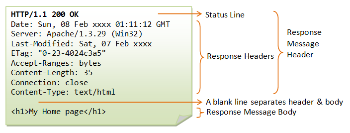
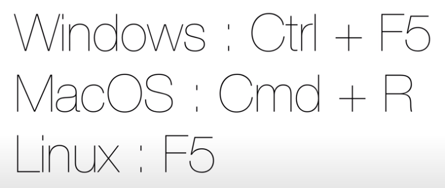

>> 생활코딩 WEB2-HTTP를 학습, 정리한 내용입니다.(https://opentutorials.org/course/3385)
    
# HTTP

- 브라우저와 서버 간 통신 규칙인 HTTP
    - Request Message
    - Response Message
    
# 목차
- [HTTP](#http)
- [목차](#목차)
- [수업소개](#수업소개)
  - [HyperText Transfer Protocol](#hypertext-transfer-protocol)
    - [웹과 HTTP](#웹과-http)
    - [HTTP를 배움으로써...](#http를-배움으로써)
    - [크롬 개발자 툴로 본 HTTP(network탭)](#크롬-개발자-툴로-본-httpnetwork탭)
  - [웹브라우저와 웹서버](#웹브라우저와-웹서버)
- [Request message](#request-message)
  - [http request header](#http-request-header)
- [Response message](#response-message)
  - [http response message](#http-response-message)
    - [http response Header format](#http-response-header-format)
    - [Response Headers](#response-headers)
  - [http status codes](#http-status-codes)
- [수업을 마치며](#수업을-마치며)
  - [정리](#정리)
- [5. 추가학습](#5-추가학습)
  - [WAS](#was)
  - [WAS의 기본 기능 3가지](#was의-기본-기능-3가지)
  - [WAS 종류(제품)](#was-종류제품)
    - [기타제품](#기타제품)
  - [같이 볼 주제](#같이-볼-주제)
  - [웹 서버](#웹-서버)
    - [웹 서버의 기능](#웹-서버의-기능)
  - [DBMS](#dbms)
    - [DBMS의 예](#dbms의-예)

<small><i><a href='http://ecotrust-canada.github.io/markdown-toc/'>Table of contents generated with markdown-toc</a></i></small>

# 수업소개

2021년 3월 28일 일요일
오후 4:23

## HyperText Transfer Protocol
* HTTP는 W3 상에서 정보를 주고받을 수 있는 프로토콜이다. 
* 주로 HTML 문서를 주고받는 데에 쓰인다. 
* HTTP는 주로 Request와 Response를 위한 메세지로 구분되어 있다.
* 주로 TCP를 사용하고 
* HTTP/3 부터는 UDP를 사용하며, 80번 포트를 사용한다. 
* 1996년 버전 1.0, 그리고 1999년 1.1이 각각 발표되었다.

>출처: <https://www.google.com/search?q=http&oq=http&aqs=chrome..69i57j69i60l3j69i65l3j69i60.1429j0j4&sourceid=chrome&ie=UTF-8> 

### 웹과 HTTP
* 1990년 팀 버너스 리와 그의 동료들이 웹을 세상에 최초로 내놓았을때 웹은 크게 4가지 요소로 이루어져 있었다.
	1. html  (웹페이지를 만드는 컴퓨터 언어)
	2. url  (원하는 웹페이지에 방문 할 수 있도록 도와주는 주소체계)
	3. 웹브라우저-웹서버  (웹페이지를 주고받는 소프트웨어)
	4. http  (웹브라우저와 웹서버가 통신할때 사용하는 통신 규칙)
* http는 매우 단순했었다. 하지만 단순한 http의 기능만으로는 성능, 보안, 안정성 확보가 힘들었다.
* 보다 풍부한 기능을 가진 http로 발전하기 시작
* 텍스트 파일 뿐만 아니라 이미지, 오디오, 동영상 등 멀티미디어 파일을 전송하는 가장 중요한 프로토콜 
* 웹을 넘어서서 인터넷을 움직이는 근간이라 할 수 있다. 

### HTTP를 배움으로써...
* '서버와 클라이언트는 어떤 메세지로 서로 응답하는가'를 알 수 있다.
* 'http와 다르지만 본질은 같은 다른 프로토콜에 대한 이해'도 높아질 것이다.

### 크롬 개발자 툴로 본 HTTP(network탭)

* Request Headers 
  * 웹브라우저가 웹서버에게 요청한 데이터(보낸 텍스트)
  * 필수 정보(2줄)
    1. GET /welcome HTTP/1.1
      * GET방식으로   /welcome을 요청하면서 통신방법은 HTTP/1.1
    2. Host: localhost
      * localhost로 접속했다.
* Response Headers(위에)
  * 웹 서버는 사용자가 요청한 내용을 Response Headers로 응답한다.
  * 필수 정보(1줄)
    1. HTTP/1.1 200 OK  
      * HTTP/1.1 - 방식으로 통신할거야 라고 웹 서버가 웹 브라우저에게 응답 
      * 200 OK - 성공적으로 데이터를 찾아서 보냈다. 
    * 추가 주목할만한 정보
      * Content-Length: 8 - 컨텐츠 길이
      * Content-type: text/html - 응답하는 정보가 text이고 text중에 html이다.    

## 웹브라우저와 웹서버
* 웹브라우저 역할 : 
  * 사용자가 요청한 정보를 웹 서버에게 대신 물어봐 줌. (Request Header) 
  * 응답한 정보를 화면에 적당히 그려주는 역할을 하는 프로그램이라고도 보충적으로 알 수 있다.
* 웹서버 역할 : 
  * 자기가 갖고 있는 정보를 보내주면서 Response Header 만들어 주는 그런 기계.
 

# Request message

2021년 3월 28일 일요일
오후 5:04

## http request header  
* 검색 이미지) http request header  
	> https://lh3.googleusercontent.com/proxy/TaEG2-ohfo7fx5tsfmTSm0OoJd6CpibC9xd-KWBZrSxBKW-_s6YS2rUNLezm3RK7O56vu_9isuHYMvzpaKJlTevmTNE0ZaGGtgsTUrAZnvsG3OX2TjpmV_4WbwelR0h9yJrnphyAW8vl1KNoELIIY2qXpyR-wgHUvfMRj-br

* Request Line 중요**
  * GET /doc/test.html HTTP/1.1 
  * GET 방식으로 /doc/test.html파일을 http/1.1버전으로 요청
* Request Headers 
  * Host  중요**
    * 웹사이트의 **웹서버의 주소**를 적는 것.
    * 만약 하나의 웹서버거 여러 개의 도메인을 서비스한다면 그리고 각 주소별로 다른 웹사이트라고 한다면 웹서버는 host에 적혀있는 주소가 무엇이냐를 따라서 다른 정보를 보내줄 수 있다.
  * localhost 
    * 가상호스트 8080: 포트
  * User-Agent
    * 웹브라우저의 다른 이름. 
    * 요청하는 **웹브라우저가 어떤 것인지 운영체제 버전 등 유저의 정보**를 알려준다.
    * 통계를 확인하거나 보안강화에도 사용하는 이름이다.
  * Accept-Encoding 
    * 웹브라우저와 웹서버가 서로 통신할 때 응답하는 데이터의 양이 많으면 그걸 압축해서 전송하면 웹브라우저가 것을 압축을 풀어서 처리할 수 있다. 그러면 네트워크의 자원을 아낄 수 있다. 
    * 그러니까 액셉트 인코딩은 **어떤 압축방식을 지원하는지** 알려주는것. 
    * 적혀있는 것들 중 하나의 압축 방식을 선택해서 압축해서 보낸다.
  * If-Modified-Since 
    * 파일을 요청할 때마다 다운 받는것은 비효율적이므로 **마지막으로 언제 다운로드 받았는지** 알려준다. 
    * 서버는 응답할때 자기가 갖고 있는 파일과 비교해서 자신이 갖고 있는 파일이 최신이면 보내주고 최신이 아니면, 즉 다운로드할 필요가 없으면 전송하지 않아도 되는 것. 

# Response message

2021년 3월 28일 일요일
오후 5:21

## http response message
* 검색 이미지)
  > https://media.vlpt.us/post-images/rosewwross/6fc65770-4b39-11ea-abce-67c155f8f58a/image.png

### http response Header format

* (Http의) 버전이 나오고 응답결과에 대한 얘기(status code)가 나오고 phrase는 응답결과를 사람이 이해하기 쉽도록 말로 풀어쓴 것.

### Response Headers

* 200 이 status code
유명한 헤더
* Content-Type: text/html - 파일의 콘텐츠 타입을 보여줌
* Content-Length : 1434 - 응답하는 파일의 사이즈
* Content_Encoding : gzip - 방축방식을 알려줘서 읽을라면  gzip으로 압축을 풀어서 읽어야 된다.
* Last-Modified - 마지막 수정일

## http status codes
* 검색)
  > https://ko.wikipedia.org/wiki/HTTP_%EC%83%81%ED%83%9C_%EC%BD%94%EB%93%9C
* 1xx (조건부 응답)요청을 받았으며 작업을 계속한다.

* 2xx (성공)이 클래스의 상태 코드는 클라이언트가 요청한 동작을 수신하여 이해했고 승낙했으며 성공적으로 처리했음을 가리킨다.
  * EX) 200(성공): 서버가 요청을 제대로 처리했다는 뜻이다. 이는 주로 서버가 요청한 페이지를 제공했다는 의미로 쓰인다.

* 3xx (리다이렉션 완료)클라이언트는 요청을 마치기 위해 추가 동작을 취해야 한다.

* 4xx (요청 오류) 4xx 클래스의 상태 코드는 클라이언트에 오류가 있음을 나타낸다.
  * EX) 404(Not Found, 찾을 수 없음): 서버가 요청한 페이지(Resource)를 찾을 수 없다. 예를 들어 서버에 존재하지 않는 페이지에 대한 요청이 있을 경우 서버는 이 코드를 제공한다.
  * 403(Forbidden, 금지됨): 서버가 요청을 거부하고 있다. 예를 들자면, 사용자가 리소스에 대한 필요 권한을 갖고 있지 않다. (401은 인증 실패, 403은 인가 실패라고 볼 수 있음)

* 5xx (서버 오류)서버가 유효한 요청을 명백하게 수행하지 못했음을 나타낸다.
  * EX) 500(내부 서버 오류): 서버에 오류가 발생하여 요청을 수행할 수 없다.

# 수업을 마치며

2021년 3월 28일 일요일

## 정리
1. HTTPS(SSL)
  * HTTP 와 HTTPS(SSL)의 차이점 S는 secure 전송하고 있는 내용을 가로챈다고 하더라도 실제로 무슨 내용이 있는지는 당사자만 알 수 있다. 암호화 되어 있기 때문에. 
  * http로 시작하는 사이트에서는 로그인 하면 안된다. 개인 정보 유출 위험 있음.
2. cache 한번 사이트에 접속 해서 다운로드 받았다면 다시 다운로드 받지 않아도 된다.
   * 캐시 갱신 단축키
	
   * 캐시 갱신에 대한 내용을 일반 사용자는 알 수 없다.
   * cache-control , pragma 이러한 헤더값들은 캐시를 제어하는 테크닉 또 애플리케이션 캐시같은 것도 성능향상을 위한 기술
3. cookie 기술을 이용해서 쿠키값을 웹브라우저에 설정하면 사용자 상태를 유지하면서 
쇼핑몰 사이트 장바구니 상태 유지
  * 로그인상태 유지>>쿠키(기록들을 웹사이트와 웹브라우저가 기억하기 있기 때문)
4. web storage
   * 최근 등장, 쿠키보다도 훨씬 더 많은 정보를 저장하면서도 보안적으로도 우수
5. proxy 
  * 중계서버. 중간에 있는 서버가 캐시를 대신해주거나 보안과 관련된 공격을 막아주거나 적당히 사용자 요청을 여러 대 서비스로 분산해주는 역할 등을 함.
  * 서비스가 복잡해지고 중요해지면 프록시서버 기술이 필요.

6. 네크워크 모니터링 도구들
  1. 웹브라우저의 개발자 도구의 네트워크 모니터링 기능
    * 가장 간편한 도구
    * 매우 사용하기 쉽기 때문에 우선적으로 사용해 볼만함.
  
  2. 와이어샤크
    * 그리고 오픈소스이고 무료이면서 가장 강력한 기능을 가진 도구
    * http뿐 아니라 컴퓨터에서 일어나는 모든 네트워크 트래픽을 감시할 수 있는 강력한 도구. 
    * 배우기 어렵고 복잡하지만 익숙해지면 강력한 도구

# 5. 추가학습
## WAS
* **웹 애플리케이션 서버**(Web Application Server, 약자 **WAS**)
* `웹 애플리케이션과 서버 환경을 만들어 동작시키는 기능을 제공하는 소프트웨어 프레임워크`
* 인터넷 상에서 HTTP를 통해 사용자 컴퓨터나 장치에 애플리케이션을 수행해 주는 `미들웨어`(소프트웨어 엔진)로 볼 수 있다.

* 웹 애플리케이션 서버는 `동적 서버 콘텐츠를 수행`하는 것으로 일반적인 웹 서버와 구별이 되며, 주로 `데이터베이스 서버와 같이 수행`이 된다. 

* 한국에서는 일반적으로 "`WAS`" 또는 "`WAS S/W`"로 통칭하고 있으며 공공기관에서는 "`웹 응용 서버`"로 사용되고, 영어권에서는 "`Application Server`" (약자 `AS`)로 불린다.

* 웹 애플리케이션 서버는 `대부분이 자바 기반`으로 주로 자바 EE 표준을 수용하고 있으나, 자바 기반이지만 자바 EE 표준을 따르지 않는 제품과 .NET이나 Citrix 기반인 `비 자바 계열도 존재`한다.

## WAS의 기본 기능 3가지

1. 프로그램 실행 환경과 데이터베이스 접속 기능을 제공한다.
2. 여러 개의 트랜잭션을 관리한다.
3. 업무를 처리하는 비즈니스 로직을 수행한다.

## WAS 종류(제품)

- 아파치 톰캣(Apache Tomcat): 아파치 소프트웨어 재단의 오픈 소스 소프트웨어
- 레진(Resin): Caucho사의 제품
- 제이런(JRun): 매크로미디어사의 제품.

### 기타제품
- 닷넷 애플리케이션 서버: 미국 마이크로소프트사의 제품
- Winstone Servlet Container (http://winstone.sourceforge.net)
- Jetty (https://web.archive.org/web/20111108170514/http://jetty.codehaus.org/jetty)

## 같이 볼 주제
- [미들웨어](https://ko.wikipedia.org/wiki/%EB%AF%B8%EB%93%A4%EC%9B%A8%EC%96%B4)
- [웹 서버](https://ko.wikipedia.org/wiki/%EC%9B%B9_%EC%84%9C%EB%B2%84)
- [클라이언트 서버 시스템](https://ko.wikipedia.org/wiki/%ED%81%B4%EB%9D%BC%EC%9D%B4%EC%96%B8%ED%8A%B8_%EC%84%9C%EB%B2%84_%EC%8B%9C%EC%8A%A4%ED%85%9C)

> 출처 : 위키피디아(https://ko.wikipedia.org/wiki/%EC%9B%B9_%EC%95%A0%ED%94%8C%EB%A6%AC%EC%BC%80%EC%9D%B4%EC%85%98_%EC%84%9C%EB%B2%84)

## 웹 서버
웹 서버(web server)는 다음의 두 가지 뜻 가운데 하나이다.

1. 웹 서버 : 웹 브라우저와 같은 클라이언트로부터 HTTP 요청을 받아들이고, HTML 문서와 같은 웹 페이지를 반환하는 컴퓨터 `프로그램`
2. 웹 서버 (하드웨어) : 위에 언급한 기능을 제공하는 컴퓨터 프로그램을 실행하는 `컴퓨터`

**웹 서버**(Web Server)는 HTTP를 통해 웹 브라우저에서 요청하는 HTML 문서나 오브젝트(이미지 파일 등)을 전송해주는 서비스 프로그램을 말한다. 

웹 서버 소프트웨어를 구동하는 하드웨어도 웹 서버라고 해서 혼동하는 경우가 간혹 있다.

### 웹 서버의 기능
1. 웹 페이지를 클라이언트로 전달
   * 주로 그림, CSS, 자바스크립트를 포함한 HTML 문서가 클라이언트로 전달
2. 클라이언트(웹 브라우저, 웹크롤러)는 HTTP를 통해 리소스를 요청
3. 서버는 해당 리소스를 반환하거나 처리할 수 없을 경우 에러 메시지를 전달 
   * 이러한 리소스는 일반적으로 서버의 보조 기억 장치에 있는 실제 파일을 가리키지만 반드시 그런 것은 아니며 웹 서버가 어떻게 수행하느냐에 따라 달라질 수 있다.

* 주된 기능은 콘텐츠를 제공하는 것
* 클라이언트로부터 콘텐츠를 전달 받는 것도 웹 서버의 기능
* 이러한 기능은 파일 업로드를 포함
* 클라이언트에서 제출한 웹 폼을 수신하기 위해 사용

보통 대다수의 웹 서버는 Active Server Page(ASP), PHP등의 서버 사이드 스크립트 언어(Server-side scripting)를 지원

이는 서버 소프트웨어의 변경 없이도 웹 서버가 수행할 동작을 분리된 서버 사이드 스크립트 언어에 기술할 수 있다는 의미

보통 서버 사이드 스크립트 언어를 통해 구현되는 기능이란 HTML 문서를 동적으로 생성하는 것

이렇게 동적으로 생성된 HTML 문서는 동적 컨텐트라 하는데 주로 데이터베이스의 정보를 조회해서 보여주거나 수정하기 위해 사용

동적 컨텐트와 대비되는 개념으로 정적 컨텐트가 있는데 일반적으로 동적 컨텐트보다 더 빠르게 동작하고 쉽게 캐시될 수 있지만, 반환되는 컨텐트의 내용이 항상 동일

웹 서버는 월드 와이드 웹 뿐만 아니라 프린터, 라우터, 웹캠과 같은 임베디드 장치, 그리고 근거리 통신망(local network)에서도 사용된다. 시스템의 모니터링 또는 장치 관리를 위한 목적으로 사용되는데, 이렇게 웹 서버는 클라이언트에 다른 소프트웨어의 설치 없이 대부분의 운영체제에 포함된 웹 브라우저만으로 서비스를 제공할 수 있다는 장점이 있다.

웹 서버 프로그램들이 세세한 부분에서 다를지라도, 대부분의 프로그램들은 몇 가지 **기본 공통 기능**을 갖고 있다.

1. HTTP
2. 통신 기록

그리고 기본 공통 기능에는 포함되지 않지만 대다수 웹 서버는 다음과 같은 기능도 제공한다.

1. 인증
2. 정적 콘텐츠 관리
3. HTTPS 지원
4. 콘텐츠 압축
5. 가상 호스팅
6. 대용량 파일 지원
7. 대역폭 스로틀링

## DBMS
데이터베이스(영어: database, DB)는 여러 사람이 공유하여 사용할 목적으로 `체계화해 통합, 관리하는 데이터의 집합`이다. 작성된 목록으로써 여러 응용 시스템들의 통합된 정보들을 저장하여 운영할 수 있는 `공용 데이터들의 묶음`이다.

"사용자가 데이터베이스에 대한 액세스를 정의, 생성, 유지 관리 및 제어 할 수있는 소프트웨어 시스템"

### DBMS의 예
* MySQL 
* PostgreSQL
* Microsoft SQL Server 
* Oracle 데이터베이스
* Microsoft Access
