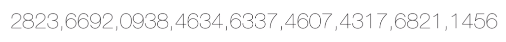
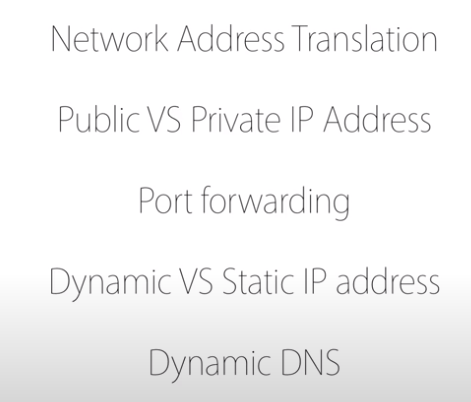
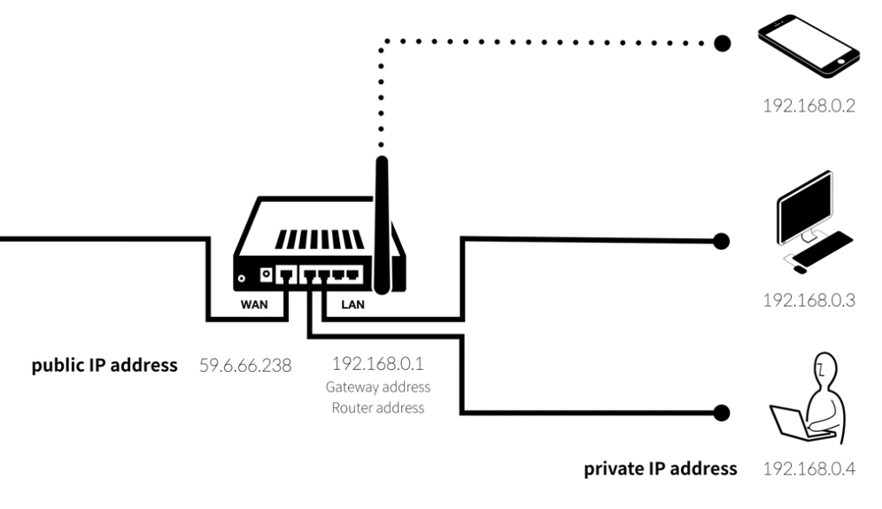
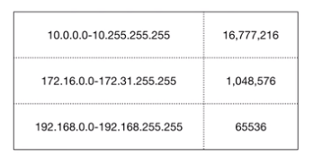
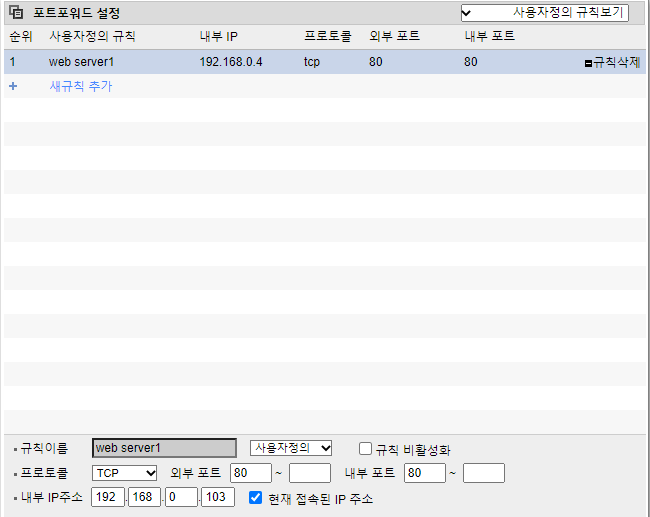
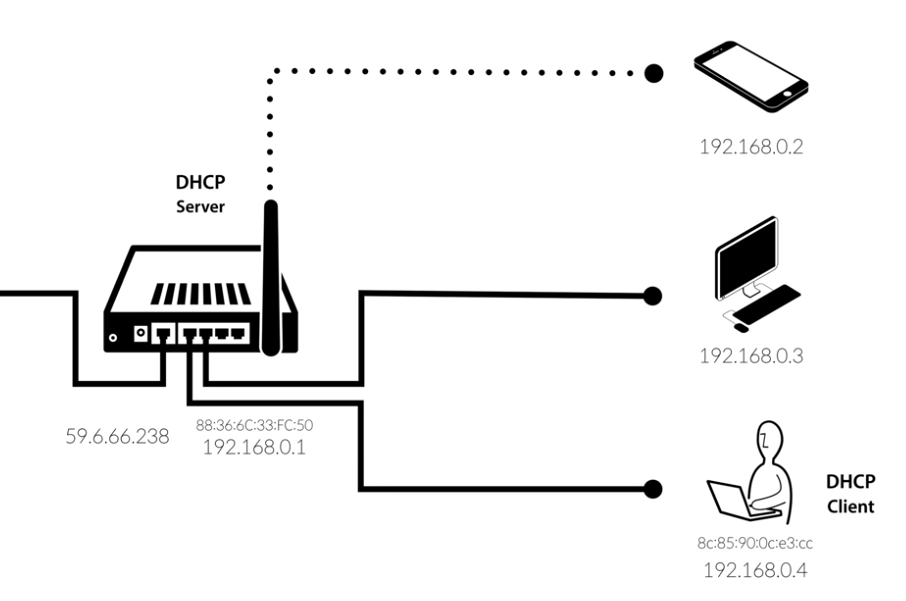
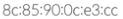
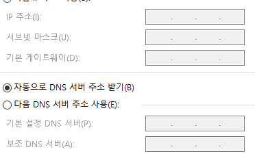
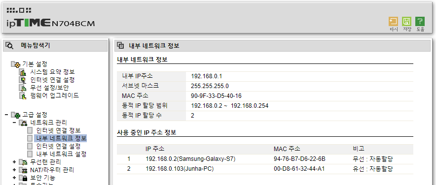
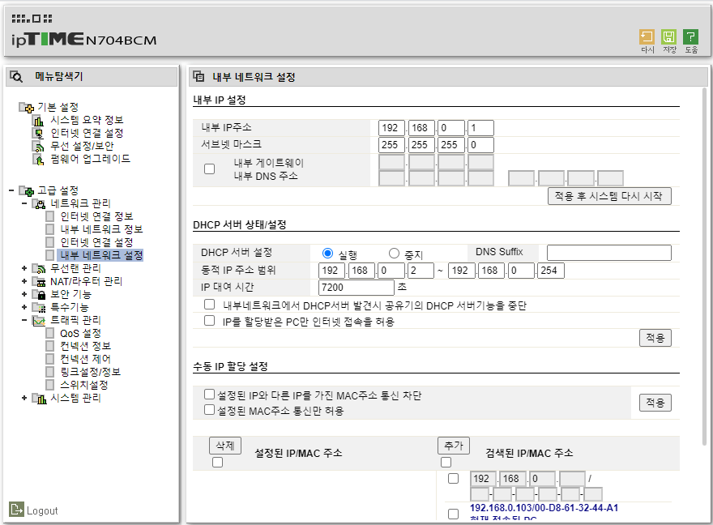

>> 생활코딩 WEB2-Home server를 학습, 정리한 내용입니다. (https://opentutorials.org/course/3265)

# Home server

- 집에서 서버를 운영하는 방법(공유기)   
    - 공유기를 사용하는 환경에서 웹서버를 운영하기 위해 필요한 지식들.
    - 네트워크와 관련된 핵심 개념들.
      - 공유기
      - NAS
      - 네트워크

# 목차
- [Home server](#home-server)
- [목차](#목차)
- [About Home server](#about-home-server)
  - [인터넷 통신규칙 - IP adress](#인터넷-통신규칙---ip-adress)
    - [IPv4](#ipv4)
    - [IPv6](#ipv6)
    - [IPv4, IPv6의 상황](#ipv4-ipv6의-상황)
  - [공유기가 연결된 컴퓨터를 웹서버로 운영](#공유기가-연결된-컴퓨터를-웹서버로-운영)
    - [알아야할 개념](#알아야할-개념)
- [공유기](#공유기)
  - [router(라우터)](#router라우터)
    - [공유기 연결 과정](#공유기-연결-과정)
    - [ipv4 사설ip의 범위](#ipv4-사설ip의-범위)
- [NAT](#nat)
  - [Network Address Translation](#network-address-translation)
    - [요청 응답 과정 (2)](#요청-응답-과정-2)
    - [단점 및 추후상황](#단점-및-추후상황)
- [IP 주소 알아내기](#ip-주소-알아내기)
  - [IP 주소 알아내기](#ip-주소-알아내기-1)
  - [public ip 확인 방법](#public-ip-확인-방법)
- [port](#port)
  - [port](#port-1)
    - [전송 계층 프로토콜](#전송-계층-프로토콜)
    - [포트의 사용(표기)](#포트의-사용표기)
    - [일반 포트 번호](#일반-포트-번호)
    - [응답하는 device](#응답하는-device)
    - [This is represented in a syntax diagram as:](#this-is-represented-in-a-syntax-diagram-as)
- [port forwarding](#port-forwarding)
  - [포트포워딩](#포트포워딩)
- [Dynamic & Static IP address](#dynamic--static-ip-address)
- [DHCP](#dhcp)
  - [Dynamic Host Configuration Protocol](#dynamic-host-configuration-protocol)
    - [DHCP client - host communication](#dhcp-client---host-communication)
  - [공유기 관리자](#공유기-관리자)
- [추가 학습 주제](#추가-학습-주제)
  - [추가적으로 공부할 만한 지식](#추가적으로-공부할-만한-지식)

<small><i><a href='http://ecotrust-canada.github.io/markdown-toc/'>Table of contents generated with markdown-toc</a></i></small>

# About Home server

2021년 3월 27일 토요일
오후 12:08

## 인터넷 통신규칙 - IP adress
* 전화기가 통신하려면 전화번호가 필요하다. 컴퓨터도 마찬가지라 ip주소가 필요하다.
### IPv4
* 42억개의 주소 표현가능하다.
* 웹 스마트폰 클라우드컴퓨팅 사물인터넷과 같은 정보기술이 속속 등장하면서 인터넷에 연결되는 컴퓨터의 숫자가 기하급수적으로 증가해 ip주소가 부족하게 되었다.
### IPv6
* 주소의 형식을 완전히 새롭게 바꾼다.
* ipv6 새로운 주소체계 도입하게 되었다.
* 주소의 숫자는 ...  
 

* 즉 앞으로 천년 뒤에도 쓸수 있는 넉넉한 양이다.
### IPv4, IPv6의 상황
* 하지만 당분간 ipv4를 아껴써야 한다 >> 공유기를 사용하면 하나의 ip주소를 나눠쓴다.
* 통신요금도 절약한다.
* 앞으로 각기 전자제품도 고유 아이피를 갖게되는 IOT환경에 IPv6주소를 활용할 것으로 보인다.
* 가용 가능한 주소 공간이 넓어짐에 따라 NAT가 필요 없어진다.(전 세계 네트워크 어디서나 주소를 변경하지 않고 고유의 주소를 가지고 접속 가능해짐)
## 공유기가 연결된 컴퓨터를 웹서버로 운영
* 공유기가 연결된 컴퓨터의 웹서버에 불특정 다수가 접속하게 하는 것은 쉽지 않다.
* 하지만 클라이언트로만 사용하던 컴퓨터를 웹서버로 사용하는 것은 사용자가 판매자가 되는 혁명적인 일이다.

### 알아야할 개념

# 공유기

2021년 3월 27일 토요일
오후 12:14

## router(라우터)
1. ip address (internet protocol address) : 컴퓨터의 주소 컴퓨터간 통신에 필요.
2. 웬wan(wide area network):광역네트워크(인터넷에 연결된) //
3. 랜lan(local area network)지역네트워크(한공유기에 연결된 디바이스) 
* 공유기는 wan과 lan의 중계자

### 공유기 연결 과정
* 통신사 케이블(ip) >>연결>> wan / lan >>연결>> device
	
* public ip address - 공용 vs rivate ip address - 사설 (일종의 대표번호, 내선번호와 같다.)

### ipv4 사설ip의 범위
* ipv4 42억개 주소 중에서 사설ip로 쓰기로 약속 된 주소의 범위

# NAT

2021년 3월 27일 토요일
오후 12:36

## Network Address Translation
* 네트워크 주소 변환
* IP패킷의 TCP/UDP 포트 숫자와 소스 및 목적지의 IP 주소등을 재기록하면서 공유기를 통해 네트워크 트래픽을 주고 받는 기술을 의미한다.

* 사설 아이피가 외부에 접속할 수 있게 해준다. 사설ip는 외부에서 접속 불가(보안)이기 때문에 공용 ip로 변경을 해야 한다.

### 요청 응답 과정 (2)
* 내부에서 요청한 내용에 대해서 응답하는 과정에서 2가지 과정이 수행된다. (ex 위키피디아로 가기 위해 위키피디아를 검색한다. "위키피디아로 가자")
  1. 요청을 했던 사설ip를 기록한다.
  2. NAT기술이 사설ip주소를 공용ip주소로 변경한 다음에 변경한 데이터를 위키피디아에 
  쏴준다.

* NAT기술을 통해 사설ip를 사용하는 컴퓨터가 공용ip를 통해서 외부 인터넷 환경에 접속할 수 있다.

### 단점 및 추후상황
* IPv6가 보급됨에 따라 점차 NAT를 사용하지 않게 될 수 있다. 각자 고유한 주소를 갖게 되기 때문에 하나의 공인 IP주소를 여러 개의 호스트가 사용할 필요가 없어지기 때문이다.
* 하지만 비용적으로 싸서 당분간 NAT를 편리한 기법이라고 보고 쓸 가능성이 있다.
다만 NAT가 복잡한 호스트 통신으로 인해 네트워크의 성능에 악영향을 끼칠 수 있다.

# IP 주소 알아내기

2021년 3월 27일 토요일
오후 12:41

## IP 주소 알아내기 
* window 제어판  > 네트워크 공유센터 >  ethernet > details
## public ip 확인 방법
1. 공유기 관리자
2. my ip 검색
3. 
외부 IP 주소 | 14.38.154.243
---|---

# port

2021년 3월 27일 토요일
오후 2:15

## port
* 포트는 인터넷 프로토콜에서 운영 체제 통신의 맨 끝(종단점)이다
* 소프트웨어에서는 네트워크 서비스나 특정 프로세스를 식별하는 논리 단위의 의미로 사용한다.
### 전송 계층 프로토콜
* 주로 포트를 사용하는 프로토콜을 전송 계층 프로토콜이라 한다.
* 전송 계층 프로토콜의 예로 전송 제어 프로토콜(TCP)와 사용자 데이터그램 프로토콜(UDP)가 있다.
* 각 포트는 번호로 구별되며 포트 번호라 한다
* 포트 번호는 IP주소와 함꼐 쓰여 해당하는 프로토콜에 의해 사용된다.

### 포트의 사용(표기)
* URI 문법에 의해 사용 및 표기할 수 있다.
* URI 문법에 의해서 사용 및 표기할 수 있으며, IP 주소와 함께 URL을 표기하는 예는 다음과 같다. 
	ftp://000.000.000.000:21
* 위 표기에서 ftp://는 URI 스킴과 구분 기호를, 000.000.000.000은 IP 주소를 의미하며 : 다음의 21은 포트 번호를 의미한다.
* 포트 번호를 생략 가능한 경우가 있는데 예를 들면,
	http://000.000.000.000
* 위와 같은 같은 월드 와이드 웹 URL은 기본적으로 80번 포트를 사용하므로 웹 브라우저는 자동적으로 이를 다음과 같은 의미로 처리한다.
	http://000.000.000.000:80

### 일반 포트 번호
포트 번호는 크게 세 종류로 구분된다.

* 0번 ~ 1023번: 잘 알려진 포트 (well-known port)
* 1024번 ~ 49151번: 등록된 포트 (registered port)
* 49152번 ~ 65535번: 동적 포트 (dynamic port)
  
잘 알려진 포트 번호의 대표적 예는 다음과 같다.

* 20 : FTP(data)
* 21 : FTP(제어)
* 22 : SSH
* 23 : 텔넷
* 53 : DNS
* 80 : 월드 와이드 웹 HTTP
* 119 : NNTP
* 443 : TLS/SSL 방식의 HTTP

### 응답하는 device
* 인터넷에서 접속이 들어왔을때 공유기에 연결되어있는 device중에 누가 응답할것인가?
  * 포트포워딩 
    * '리스닝'

### This is represented in a syntax diagram as:

> 출처: <https://en.wikipedia.org/wiki/URL> 

# port forwarding

2021년 3월 27일 토요일
오후 2:36

## 포트포워딩 

# Dynamic & Static IP address

2021년 3월 27일 토요일
오후 2:51

* dynamic ip address : 유동 ip address
* ISP (internet service provider) (인터넷통신사)와 계약하여 인터넷을 연결하면 
ip address가 지정된다. 그리고 웹서버를 만들고 클라이언트가 서비스를 요청하면 ip주소를 찾아와 서버가 요청에 응답한다. 

* 모든 집집마다 ip를 하나씩 주다보면 ip address가 부족해진다. 그래서 유동 ip를 쓴다. 
  
* 주어진 ip가 계속해서 바뀌는 것. 돌려막기 하는 것. 웹서버가 일정시간 사용되지 않으면 isp가 ip address를 회수하고 다른 서버에 준다. 그리고 내가 다시 접속하면 isp가 새로운 ip를 준다. 즉 ip는 계속해서 바뀐다 동적으로 바뀌는것. 그래서 dynamic ip address.
  
* 근데 이렇게 ip주소가 바뀌면 클라이언트가 바뀐것을 모르면 다른 서버에 들어가게되는 문제가 생긴다. 이게 동적 아이피의 단점 >고정아이피사용
  
* 통신사한테 돈을 더 주면 고정 아이피를 (독점적 사용) 얻을 수 있다.

# DHCP

2021년 3월 27일 토요일
오후 3:00
## Dynamic Host Configuration Protocol

* 같은 공유기 안에서 여러 기기가 연결되어 있을 떄 ip 주소는 중복되면 안된다
* ip주소를 지정해 줘야한다. 하지만 실제로 직접 하지는 않는다.>>복잡하고 어려움
* DHCP가 자동으로 복잡하고 다양한 정보를 지정을 해준다.
* 공유기에 DHCP Server라는 프로그램 내장되어있음.
* 그리고 노트북, 컴퓨터 이런 기기에는 DHCP Client라는 프로그램이 기본으로 깔려 있다.
* 통신 부품들은 부품마다 공장에서 기록된 고유한 식별자를 가지고 있다.
  
	

	

### DHCP client - host communication
* 새로운 기기의 접속이 있을때 DHCP client 와 DHCP server는 서로 통신하여 사용가능한 ip주소를 DHCP client가 받게 되고 DHCP client는 아래와 같이 필요한 정보를 채워 넣는다.

## 공유기 관리자
* 공유기 관리자에서 사용중인 ip주소 확인가능하다. 
* 수동으로 ip주소를 수정하거나 주는 등의 관리동을 할 수 있다.
  
  

# 추가 학습 주제

2021년 3월 27일 토요일
오후 3:14

* 소비문화는 엄청난 혁명이다. 최소한의 지식으로도 엄청난 일을 할 수 있다.
실제로는 복잡한데 쉽게 사용하다보면 문제가 생긴다.
* 인터넷은 수많은 마음과 지식과 정보와 자본을 나르는 통로다. 
* 인터넷은 악의와 가능성으로 가득 차있다. 
* 제대로 배우고 활용하자. 기회의 통로로 삼자!

## 추가적으로 공부할 만한 지식
* 키워드 요약 - 공유기, NAS, Domain, DDns, https, Lets encript, 웹호스팅, 서버호스팅, 클라우드 컴퓨팅
  1. 공유기 - (관리자 메뉴 둘러보자)
  2. **NAS** (network attached stroage) -  ex) 드롭박스 구글드라이브 웹하드같은 저장장소를 직접 집에서 운영하는 것과 같다. 본질적으로는 컴퓨터를 웹서버로 운영하는 것과 다름이 없지만, 저장 백업과 같은 것을 쉽게 해주는 여러 편의 기능들이 포함어있는 솔루션을 사용할 수 있다.
  3. **Domain** - ip가 아닌 Domain을 통해서 서버에 사용자가 접속하게 한다면 도메인은 고정시키고 ip를 변경함으로써 보다 유연하게 서버를 운영할 수 있다. 일반적으로 도메인은 연간 만원에서 10만원 정도를 국제기구에다가 스스로 내고 사용할 수가 있고 freenom.com과 같은 서비스를 이용하면 1년간은 무료로 이용할 수 있다. 
     * **DDns** - 고정 ip를 가지고 있는 것과 비슷한 효과를 domain을 통해서 달성할 수 있다.
  4. 보안 - http는 중간에 누가 감청할 수 있는 가능성이 높다. http의 이러한 보안에서의 단점을 보완하기 위해 만들어진 것이 **https**. 여기서 s는 secure의 약자 https를 이용하면 더 안전하게 서비스를 제공할 수 있다. 사용자의 중요한 정보를 저장하는 서비스를 제공한다면 반드시 https를 이용해야 한다. **Let's encript**와 같은 서비스는 무료로 인증서를 발급해준다.
  5. 웹 호스팅 - 서버를 집에서 운영하는 것은 교육적으로는 괜찮지만 실제 서비스를 운영할 때는 추천되는 방법은 아니다. 서버를 운영할 수 있는 컴퓨터와 네트워크 환경을 제공해주는 업체들이 있다. 
     * 웹서버제공 : **웹호스팅**, 
     * 서버제공 : **서버호스팅**.
  보다 큰 규모로 여러가지 편의 기능을 제공하는 서비스를 **클라우드 컴퓨팅**이라고 한다. (본질적으로는 다 비슷하다.)
	
	
	
