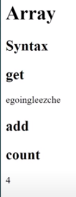
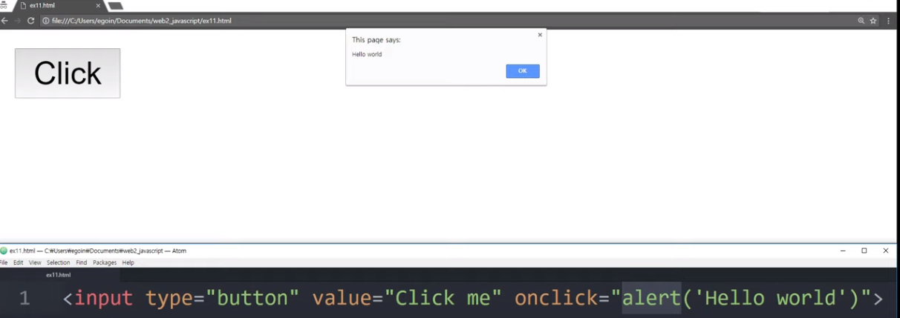

>> 생활코딩 WEB2 - JavaScript을 학습, 정리한 내용입니다. (https://opentutorials.org/course/3085)

# JavaScript basic 2
- [JavaScript basic 2](#javascript-basic-2)
- [12. 리팩토링 중복의 제거](#12-리팩토링-중복의-제거)
    - [중복 제거의 효용](#중복-제거의-효용)
    - [실습](#실습)
- [13. 배열](#13-배열)
    - [배열의 필요성](#배열의-필요성)
    - [배열의 문법, 성격](#배열의-문법-성격)
    - [실습](#실습-1)
- [14. 반복문 roop](#14-반복문-roop)
    - [실습 ex7.html](#실습-ex7html)
- [15. 배열과 반복문](#15-배열과-반복문)
    - [실습 ex8.html](#실습-ex8html)
- [15-2. 배열과 반복문의 활용](#15-2-배열과-반복문의-활용)
    - [웹 콘솔 활용](#웹-콘솔-활용)
    - [쿼리셀렉터](#쿼리셀렉터)
    - [실습 > 편집기에 적용, 낮일 때 blue](#실습--편집기에-적용-낮일-때-blue)
- [16. 함수예고](#16-함수예고)
    - [실습 - head](#실습---head)
    - [실습 - body](#실습---body)
- [16-2. 함수](#16-2-함수)
    - [함수의 효용](#함수의-효용)
    - [실습 - 1 **2-1 2-2** 3 **2-1 2-2**](#실습---1-2-1-2-2-3-2-1-2-2)
- [16-3. 매개변수와 인자](#16-3-매개변수와-인자)
    - [매개변수와 인자의 사용](#매개변수와-인자의-사용)
- [16-4. 함수 (리턴)](#16-4-함수-리턴)
- [16-5. 함수 활용](#16-5-함수-활용)
- [17. 객체 예고](#17-객체-예고)
    - [Object 객체](#object-객체)
- [17-2. 객체 쓰기와 읽기](#17-2-객체-쓰기와-읽기)
- [17-3. 객체와 반복문](#17-3-객체와-반복문)
- [17-4. 객체프로퍼티와 메소드](#17-4-객체프로퍼티와-메소드)
    - [property](#property)
- [17-5. 객체의 활용](#17-5-객체의-활용)
    - [객채의 의미](#객채의-의미)
- [18. 파일로 쪼개서 정리 정돈하기](#18-파일로-쪼개서-정리-정돈하기)
    - [Cache의 효용](#cache의-효용)
    - [script를 파일로 분리](#script를-파일로-분리)
- [19. 라이브러리와 프레임워크](#19-라이브러리와-프레임워크)
    - [라이브러리와 프레임워크](#라이브러리와-프레임워크)
- [20. UI vs API](#20-ui-vs-api)
    - [UI, API 구분](#ui-api-구분)
- [21. 수업을 마치며](#21-수업을-마치며)
  - [추가로 알아 볼만 한 주제.(검색)](#추가로-알아-볼만-한-주제검색)
    - [Document객체, DOM객채(document object model), window객체(웹브라우저 자체 제어 필요 시)](#document객체-dom객채document-object-model-window객체웹브라우저-자체-제어-필요-시)
    - [ajax(웹페이지를 리로드하지 않고 정보를 변경하고 싶을 때 **필수)](#ajax웹페이지를-리로드하지-않고-정보를-변경하고-싶을-때-필수)
    - [cookie(웹페이지가 리로드되어도 현재 상태를 유지하고 싶을 때 사용자를 위한 개인화된 서비스를 제공 가능)](#cookie웹페이지가-리로드되어도-현재-상태를-유지하고-싶을-때-사용자를-위한-개인화된-서비스를-제공-가능)
    - [offline web application(인터넷이 끊겨도 동작하는 웹페이지를 만들고 싶을 때)](#offline-web-application인터넷이-끊겨도-동작하는-웹페이지를-만들고-싶을-때)
    - [webRCT(화상통신 웹,앱을만들고싶을때)](#webrct화상통신-웹앱을만들고싶을때)
    - [speech로 시작하는 api(음성인식, 음성으로 정보전달시)](#speech로-시작하는-api음성인식-음성으로-정보전달시)
    - [webGL(3차원 그래픽 게임)](#webgl3차원-그래픽-게임)
    - [webVR(vr)](#webvrvr)

<small><i><a href='http://ecotrust-canada.github.io/markdown-toc/'>Table of contents generated with markdown-toc</a></i></small>


# 12. 리팩토링 중복의 제거

2021년 3월 16일 화요일
오후 7:22


### 중복 제거의 효용
* 중복을 제거하면 데이터의 양에 따라 작업 능률이 지수폭발적으로 올라간다.
* 중복을 피하기 위한 노력으로 새로운 발견, 기술의 개발이 이뤄진다.

### 실습
```html
<input id="night_day" type="button" value="night" onclick="
    if(document.querySelector('#night_day').value === 'night'){
    document.querySelector('body').style.backgroundColor = 'black';
    document.querySelector('body').style.color = 'white';
    document.querySelector('#night_day').value = 'day'
    } else{
    document.querySelector('body').style.backgroundColor = 'white';
    document.querySelector('body').style.color = 'black';
    document.querySelector('#night_day').value = 'night'
    }
">

<input type="button" value="night" onclick="
    if(this.value === 'night'){
    document.querySelector('body').style.backgroundColor = 'black';
    document.querySelector('body').style.color = 'white';
    this.value = 'day'
    } else{
    document.querySelector('body').style.backgroundColor = 'white';
    document.querySelector('body').style.color = 'black';
    this.value = 'night'
    }
">  

<input type="button" value="night" onclick="
    var target = document.querySelector('body');
    if(this.value === 'night'){
    target.style.backgroundColor = 'black';
    target.style.color = 'white';
    this.value = 'day'
    } else{
    target.style.backgroundColor = 'white';
    target.style.color = 'black';
    this.value = 'night'
    }
">
```


# 13. 배열

2021년 3월 17일 수요일
오후 1:20
### 배열의 필요성
        집에 있는 사물이 많아질 수록 정리정돈 수납공간 필요.
        코딩도 마찬가지 많은 데이터를 다룬다.
        제각각 성격도 다르다.
        사람이 다룰 수 없을 정도로 복잡해진 소프트웨어를
        단순하게 만드는 과정. 배열
        서로 연관된 데이터들을 수납하는 상자 배열 array        

### 배열의 문법, 성격
* 배열은 [시작해서 ]로 끝낸다 
* 값과 값사이는 ,로 구분
* 쓰기불편하므로 변수에 담는다.
  *  Var coworkers = [];
  *  [0] : 인덱스 0번째 



### 실습
```html
<body>
	<h1>Array</h1>
	<script>
		var coworkers = ["egoing", "leezche"];
	<script>
	<h2>get</h2>
	<script>
		Document.write(coworkers[0]);
		Document.write(coworkers[1]);
	</script>
```

* 검색)javascript array add data >>push
```html
<h2>add</h2>
	<script>
		coworkers.push('duru');
		coworkers.push('taeho');
	</script>
	
검색)javascript array count >>length
<h2>count</h2>
	<script>
		document.write(cowrkers.length);
	</script>
</body>
```
	
	
# 14. 반복문 roop

2021년 3월 17일 수요일
오후 1:37

### 실습 ex7.html
```html
<body>
	<h1>loop</h1>
	<ul>
	<script>
		document.write('<li>1</li>');
		var i = 0;
		while(i < 3){
			document.write('<li>2</li>');
			document.write('<li>3</li>');
			i = i +1;
		}
		document.write('<li>4</li>');
	</script>
	</ul>
</body>
```


# 15. 배열과 반복문

2021년 3월 17일 수요일
오후 1:45

### 실습 ex8.html
```html
<body>
	<h1>Loop & Array</h1>
	<script>
		var coworkers = ['egoing', 'leezche', 'duru', 'taeho', 'graphittie'];
	<h2>Co workers<h2>
	<ul>
		<script>
			var i = 0;
			while(i < coworkers.length){
			document.write('<li>'<a href="http://a.com/'+coworkers[i]+'">+coworkers[i]+'</li>');
			i = i + 1;
			}
		</script>
	</ul>
</body>
```

* 배열[] 데이터를 가져올 때 I값은 index값과 일치한다는 특성이 있다.

* **배열과 반복문을 결합했을 때 얻을 수 있는 폭발적인 효과**
  * 배열 순서대로 서로 연관된 데이터를 정리정돈하는 기능
  * 반복문은 순서대로 배열에 담겨있는 데이터를 하나씩 꺼내서 자동화된 처리를 할 수 있는 문법
  * 때문에 이 두 기능은 환상의 콤비


# 15-2. 배열과 반복문의 활용

2021년 3월 17일 수요일
오후 1:59

### 웹 콘솔 활용
* 크롬 웹페이지 검사기 콘솔 
```Document.querySelector('a')```
### 쿼리셀렉터 
* 쿼리셀렉터 : 메소드 = 함수 = 명령어 
* 쿼리셀렉터 해당 태그의 첫번 째 하나만 가져온다.
  
### 실습 > 편집기에 적용, 낮일 때 blue
```html
Document.querySelectorAll('a');
Var alist = Document.querySelectorAll('a');
Console.log(alist[0]);
Console.log(alist[1]);
Console.log(alist.length);

Var alist = document.querySeletorAll('a');
var i = 0;
while(i < alist.length){
    console.log(alist[i]);
    alist[i].style.color = 'powderblue';
    i = i+1
}
```


# 16. 함수예고

2021년 3월 17일 수요일
오후 10:44

### 실습 - head
```html
<script>
    function nightDayHandler(self){
        var target = document.querySelector('body');
        if(self.value === 'night'){
            target.style.backgroundColor = 'black';
            target.style.color = 'white';
            self.value = 'day';
        
            var alist = document.querySelectorAll('a');
            var i = 0;
            while(i < alist.length){
                alist[i].style.color = 'pink';
                i= i + 1;
            }
        }   else{
            target.style.backgroundColor = 'white';
            target.style.color = 'black';
            self.value = 'night';
                    
            var alist = document.querySelectorAll('a');
            var i = 0;
            while(i < alist.length){
                alist[i].style.color = 'blue';
                i= i + 1;
            }
        }
    }       
</script>
```


### 실습 - body
```html
<input id="night_day" type="button" value="night" onclick="
    nightDayHandler(this);
">
```

* nightDayHandler
  
    ```nightDayHandler(this);```   >>> 'nightDayHandler 함수를 실행시켜라' 라는 뜻

* 함수를 이용해 길고 복잡한 다수의 스크립트를 하나의 스크립트로 관리 가능.


# 16-2. 함수

2021년 3월 17일 수요일
오후 10:47

### 함수의 효용
* 중복이 1억개가 발생하고 있고 그것이 연속적이지 않아 반복문을 사용 할 수 없다면
함수를 이용해야 한다.


### 실습 - 1 **2-1 2-2** 3 **2-1 2-2**

```html
<h1>Function</h1>
<h2>Basic</h2>
<ul>
    <script>
        function two(){
            document.write('<li>2-1</li>');
            document.write('<li>2-2</li>');
        }
        document.write('<li>1</li>');
        two();
        document.write('<li>3</li>');
        two();
    </script>
</ul>
```


# 16-3. 매개변수와 인자 

2021년 3월 17일 수요일
오후 10:56

### 매개변수와 인자의 사용
```html
<h2>Parameter & Argument</h2>
<script>
    function onePlusOne(){
        document.write(1+1+'<br>');
    }
    onePlusOne();
    function sum(left, right){
        document.write(left+right+'<br>');
    }
    sum(2,3); // 5
    sum(3,4); // 7
</script>
```
* Sum(2,3); 을 입력함으로서 함수를 이용해 5라는 값을 도출할 수 있다.
* 2,3은 인자 argument 라고 하며
* 2,3이라는 값을 받아서  
* 함수 안으로 매개해주는 변수들을 매개변수 parameter 라고 한다. (left, right)
```function sum(left, right)```


# 16-4. 함수 (리턴)

2021년 3월 17일 수요일
오후 11:09

```html
<h2>Parameter & Argument</h2>
<script>
    function onePlusOne(){
        document.write(1+1+'<br>');
    }
    onePlusOne();
    function sum(left, right){
        document.write(left+right+'<br>');
    }
    function sumColorRed(left, right){
        document.write('<div style="color:red">'+left+right+'</div><br>');
    }
    sum(2,3); // 5
    sumColorRed(2,3); //5
    sum(3,4); // 7
    </script>
<h2>Return</h2>
<script>
    function sum2(left,right){
        return left+right;
    }
    document.write(sum2(2,3)+'<br>');
    document.write('<div style="color:red">'+sum2(2,3)+'</div>');
    document.write('<div style="font-size:3rem;">'+sum2(2,3)+'</div>');
</script>
```
* 계산이라고 하는 기능만을 sum2 함수가 구현함으로써 원자화된 기능을 다양한 맥락에서 활용할수있는 자유도가 생긴다. Return이주는 엄청난 혜택

* 함수의 매개변수(left, right)를 통해서 들어간 값을 return을 통해서 출력함으로써 다양한 용도로 함수를 활용할 수 있게된다라는 중요한 얘기를 해준다.


# 16-5. 함수 활용

2021년 3월 17일 수요일
오후 11:32

* nightDayHandler 연장


# 17. 객체 예고

2021년 3월 18일 목요일
오후 7:12

### Object 객체
* Object 객체 중요하지만 어렵다.
* 함수, 객체가 가장 어렵다.
* 객체는 함수라는 것 기반위에서 존재
* 객체는 잘 정리정돈 하기 위한 도구!

```javascript
function LinksSetColor(color){
    var alist = document.querySelectorAll('a');
    var i = 0;
    while(i < alist.length){
        alist[i].style.color = color;
        i= i + 1;
    }
}
function BodySetColor(color){
    document.querySelector('body').style.color = color;
}
function BodySetBackgroundColor(color){
    document.querySelector('body').style.backgroundColor = color;
}
function nightDayHandler(selfff){
    var target = document.querySelector('body');
    if(selfff.value === 'night'){
        Body.setBackgroundColor('black');
        Body.setColor('white');
        selfff.value = 'day';           
        Links.SetColor('powderblue');                               
    }   else{
        Body.setBackgroundColor('white');
        Body.setColor('black');
        selfff.value = 'night';                     
        Links.SetColor('blue');
    }       
}
```
* Body 객체, setBackgroundColor('white'); 메소드(객체에 속해있는 함수)
* **객체는 일종의 폴더**


# 17-2. 객체 쓰기와 읽기

2021년 3월 18일 목요일
오후 7:32

```html
<h1>Object</h1>
<h2>Create</h2>
<script>
    var coworkers = {
        "programmer":"egoing",
        "designer":"leezche",            
    };
    document.write("programmer : "+coworkers.programmer+"<br>");
    document.write("designer : "+coworkers.designer+"<br>");
    coworkers.bookkeeper = "duru";
    document.write("bookkeeper : "+coworkers.bookkeeper+"<br>");
    coworkers["data scientist"] = "taeho";
    document.write("data scientist : "+coworkers["data scientist"]+"<br>");
</script>
```
* ["data scientist"] >> 띄어쓰기 문자열, []로 감싼다.


# 17-3. 객체와 반복문

2021년 3월 18일 목요일
오후 7:57

```html
<h2>Iterate</h2>
<script>
    for(var key in coworkers) {
        document.write(key+'<br>');
    }
    for(var key in coworkers) {
        document.write(coworkers[key]+'<br>');
    }
    for(var key in coworkers) {
        document.write(key+' : '+coworkers[key]+'<br>');
    }
</script>
```

* 참고 
  * Key값 : programmer designer ..


# 17-4. 객체프로퍼티와 메소드

2021년 3월 18일 목요일
오후 8:13

```html
<h2>Property & Method</h2>
<script>
    coworkers.showAll = function () {
        for (var key in this) {
            document.write(key + ' : ' + this[key] + '<br>');
        }
    }
    coworkers.showAll();

    // showAll = function(){}
    // var showAll = function(){}
    // function showAll(){}  세줄 다 같다.
</script>
```

### property
* 객체에 포함된 함수 = 메소드
* 객체에 포함된 변수 = 프로퍼티


# 17-5. 객체의 활용

2021년 3월 18일 목요일
오후 8:14

```javascript
var Links = {
    setColor: function (color) {
        var alist = document.querySelectorAll('a');
        var i = 0;
        while (i < alist.length) {
            alist[i].style.color = color;
            i = i + 1;
        }
    }
}
var Body = {
    setColor: function (color) {
        document.querySelector('body').style.color = color;
    },
    setBackgroundColor: function (color) {
        document.querySelector('body').style.backgroundColor = color;
    }
}
```

### 객채의 의미
* 함수가 코드가 많아지면 정리정돈하는 도구
* 객체는 함수와 변수가 많아지면 연관된 것들을 서로 그룹핑해서 정리정돈하는 도구
* 객체의 각 프로퍼티를 구분할 때  , 콤마 필요


# 18. 파일로 쪼개서 정리 정돈하기

2021년 3월 18일 목요일
오후 8:31

### Cache의 효용
* Cache 덕분에 파일로 쪼개서 더 많은 페이지를 불러와야 함에도 네트워크 트래픽이 더 좋다.
* Cache에 저장해 놓고 다음에 열 때 더 빠르게 열기 때문.

### script를 파일로 분리
* 새 파일 > "color.js" <script>안의 내용을 옳긴다.
* <script src="colors.js"></script>로 연결한다.


# 19. 라이브러리와 프레임워크

2021년 3월 18일 목요일
오후 8:51

### 라이브러리와 프레임워크
    다른사람이 만든 소프트웨어를 이용해 새로운 소프트웨어를 만드는 방법!
    라이브러리 vs 프레임워크 둘다 다른사람의 소프트웨어를 이용하는것
    라이브러리는 내가 원하는 부품을 잘 정리정돈해논 느낌
    프레임워크는 만들고자 하는 것이 무엇이냐에 따라서 게임 웹 채팅 등등..
    공통적인 것이 있고 달라지는 것이 있을것. 프레임 워크는 개성에 따라 살짝살짝 바꿔줌으로서 만드는 것
    라이브러리는 필요한것을 땡겨와서 쓰는거고 프레임워크는 내가 직접 들어가서 바꾸는 느낌

    자바스크립트 라이브러리중 가장 유명한것.!  Jquery
    직접 짜는 것보다 생산성이 훨씬 높아진다.
    우리가 배운 지식을 가지고 jquery를 만나면 쉽고 즐거워진다.
    Cdn : content delivery network의 약자
    많은 라이브러리들이 cdn을 통해 자기 서버에 파일을 보관해 놓고 우리는 스크립트 src를 통해서 가져갈 수 있다.

``$('a')``
웹페이지에 있는 모든 a 태그를 jquery로 제어하겠다는 뜻

```javascript
var Links = {
    setColor: function (color) {
        // var alist = document.querySelectorAll('a');
        // var i = 0;
        // while (i < alist.length) {
        //     alist[i].style.color = color;
        //     i = i + 1;
        // }
        $('a').css('color', color);
    }
}
var Body = {
    setColor: function (color) {
        //     document.querySelector('body').style.color = color;
        $('body').css('color', color)
    },
    setBackgroundColor: function (color) {
        //     document.querySelector('body').style.backgroundColor = color;
        $('body').css('backgroundColor', color);
    }
}
```

* 우리가 .css를 활용하면 Jquery가 우리 대신에 //안의 코드를 대신 처리해준다.

# 20. UI vs API

2021년 3월 18일 목요일
오후 9:10

### UI, API 구분
* UI (User interface)
* API (Application programming interface)
* 사용자가 시스템을 제어하기 위해서 사용하는 조작장치가 ui
* 웹브라우저를 만드는 사람들이 미리 만들어 놓은 우리가 함수(명령어)를 이용하면 나타나는 조작장치가 api
(alert함수는 경고창을 띄울 수 있게 하는 조작장치)
* 우리는 만들어져있는 부품api를 우리가 원하는 올바른 순서대로 코드를 짜면
* 사용자가 ui를 통해 사용할 수 있는 것이다.



# 21. 수업을 마치며

2021년 3월 18일 목요일
오후 9:23

## 추가로 알아 볼만 한 주제.(검색)
### Document객체, DOM객채(document object model), window객체(웹브라우저 자체 제어 필요 시)
### ajax(웹페이지를 리로드하지 않고 정보를 변경하고 싶을 때 **필수)
### cookie(웹페이지가 리로드되어도 현재 상태를 유지하고 싶을 때 사용자를 위한 개인화된 서비스를 제공 가능)
### offline web application(인터넷이 끊겨도 동작하는 웹페이지를 만들고 싶을 때)
### webRCT(화상통신 웹,앱을만들고싶을때)
### speech로 시작하는 api(음성인식, 음성으로 정보전달시)
### webGL(3차원 그래픽 게임)
### webVR(vr)
