>> 생활코딩 WEB2-Node.js를 학습, 정리한 내용입니다. (https://github.com/qufstar7/TIL)

# Node.js basic1

- Node.js, Node.js와 관련된 주제, 간단한 JavaScript 문법
- Node.js를 이용한 App제작 실습
    - Node.js
    - js문법
    - App제작(Node.js)

# 목차
- [Node.js basic1](#nodejs-basic1)
- [목차](#목차)
- [App 제작-not found 구현](#app-제작-not-found-구현)
  - [App practice](#app-practice)
    - [not found](#not-found)
- [App 제작-홈페이지 구현](#app-제작-홈페이지-구현)
  - [App practice](#app-practice-1)
    - [homepage](#homepage)
- [Javascript 문법3-배열,반복문](#javascript-문법3-배열반복문)
  - [grammar](#grammar)
    - [1) 반복문 loop](#1-반복문-loop)
    - [코드](#코드)
    - [console - syntax/loop.js](#console---syntaxloopjs)
  - [2) 배열 array](#2-배열-array)
  - [3) 배열과 반복문](#3-배열과-반복문)
    - [코드](#코드-1)
- [파일목록 알아내기](#파일목록-알아내기)
  - [문제](#문제)
  - [문제 해결](#문제-해결)
    - [검색](#검색)
- [App 제작-글목록 출력하기](#app-제작-글목록-출력하기)
  - [실습](#실습)
    - [주의해야할 부분](#주의해야할-부분)
    - [단계별 실습](#단계별-실습)
- [Javascipt 문법4-함수](#javascipt-문법4-함수)
    - [함수의 기본 문법](#함수의-기본-문법)
    - [함수의 입력](#함수의-입력)
    - [함수의 출력](#함수의-출력)
- [App 제작-함수를 이용해서 정리 정돈하기](#app-제작-함수를-이용해서-정리-정돈하기)
- [동기와 비동기, callback](#동기와-비동기-callback)
  - [동기적 일 처리 vs 비동기적 일 처리](#동기적-일-처리-vs-비동기적-일-처리)
  - [Sync의 유무](#sync의-유무)
  - [`fs.readFile(path[, options], callback)`](#fsreadfilepath-options-callback)
  - [`fs.readFileSync(path[, options])`](#fsreadfilesyncpath-options)
  - [`var fs = require('fs');`](#var-fs--requirefs)
    - [코드해석](#코드해석)
    - [코드해석](#코드해석-1)
    - [callback에 대해](#callback에-대해)
    - [익명함수](#익명함수)
    - [파라미터](#파라미터)
    - [상황 설정](#상황-설정)
- [패키지 매니저와 PM2](#패키지-매니저와-pm2)
  - [패키지와 패키지 매니저](#패키지와-패키지-매니저)
  - [npm](#npm)
    - [npm 설치](#npm-설치)
  - [pm2의 활용](#pm2의-활용)
  - [Pm2 명령어 :](#pm2-명령어-)
    - [ADVANCED, PRODUCTION PROCESS MANAGER FOR NODE.JS](#advanced-production-process-manager-for-nodejs)
    - [FEATURES](#features)
    - [MONITORING](#monitoring)
    - [MICROSERVICE](#microservice)
  - [문제상황](#문제상황)
    - [부록- pm2 보충학습](#부록--pm2-보충학습)
- [HTML-form](#html-form)
    - [컨텐츠를 사용자가 생성, 수정 ,삭제](#컨텐츠를-사용자가-생성-수정-삭제)
    - [Form 태그](#form-태그)
    - [사용법](#사용법)

<small><i><a href='http://ecotrust-canada.github.io/markdown-toc/'>Table of contents generated with markdown-toc</a></i></small>


# App 제작-not found 구현

2021년 3월 20일 토요일
오후 8:53

## App practice 
### not found
* 커리스트링이 없는 홈으로 들어오게 되면 쿼리스트링이 있는 id값이 있는 주소로 접속하는 그 id값에 해당되는 파일의 데이터 디렉토리에서 찾아서 웹페이지를 생성하자.
* 그리고 그외에 주소로 들어왔을때 예를 들면 http://localhost:3000/favicon.ico 이런 다른 경로로 들어왔을 때는 파일을 찾을 수 없다라는 오류메세지를 사용자에게 전송하는 기능을 만들어 보자. 
  * 제일 먼저 할 것은 루트로 접근했는가 아닌가를 구분하는 것. 
  * 루트라고 하면 http://localhost:3000 > 이렇게 웹페이지 url뒤에 path가 붙지 않는 상태.

```js
console.log(url.parse(_url, true));
```


```js
response.writeHead(200);  >> 파일을 성공적으로 전송했다는 뜻
response.writeHead(404);  >> 파일을 찾을 수 없다. (약속된 규칙)
```


# App 제작-홈페이지 구현

2021년 3월 20일 토요일
오후 9:10

## App practice
### homepage
* Pathname이 / 슬래시 이다.
* 홈에 갔을 때도 페이지로 갔을때도(특별한 경로가 붙어있지 않기 때문에)
Pathname이라고 하는 값은 홈과 각각의 페이지를 구분 할 수 없다.
* *복문을 중첩하면 구분 할 수 있다!
```js
 var pathname = url.parse(_url, true).pathname;
    if (pathname === '/') {
        if (queryData.id === undefined) {
                                        중략...
  } else {
                                        중략...
 } else {
        response.writeHead(404);
        response.end('not found');
    }
```


# Javascript 문법3-배열,반복문

2021년 3월 20일 토요일
오후 9:32

## grammar
### 1) 반복문 loop
* while 
  * 기초적이면서도 불편하다 
  * 하지만 자유도가 높고 
  * 우리가 배운것들을 리뷰할 수 있다. 
  * 반복문에서 가장 중요한것은 무한 루프에 걸리지 않는 것
    * 무한 루프는 아주 심각한 버그. >> 몇 번 반복할 것인지 설정!

### 코드
```js
console.log('A');
console.log('B');
var i = 0;
while(i < 2){
    console.log('C1');
    console.log('C2');
    i = i + 1;
}
console.log('D');
```
* i=0 i=1 2번 반복

### console - syntax/loop.js
```console
C:\Users\Junha\Desktop\web2-nodejs>node syntax/loop.js
A
B
C1
C2
C1
C2
D
```

## 2) 배열 array
* 정보시스템의 핵심은 CRUD create read update delete
* 배열도 마찬가지 crud를 알면 배열을 아는 것.
  * 배열 표시 []
  * 배열은 0부터 자리가 표시됨 0,1,2,3,...
    ```js
    var arr = ['A','B','C','D'];        
    console.log(arr[1]); //2번째 B가 표시됨
    //2번째 요소 c를 3으로 바꾼다! (수정방법)
    arr[2] = 3; 
    //배열에서 몇 개의 값이 들어가 있는지 알아내는 방법
    console.log(arr.length);
    //배열에서 데이터 추가하는 방법 javascript array add data
    arr.push('E');
    console.log(arr);
    ```
    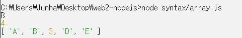

## 3) 배열과 반복문
* ```$('a')``` 
  * 웹페이지에 있는 모든 a 태그를 jquery로 제어하겠다는 뜻
* 많은 숫자로 된 데이터를 더할려면 반복문을 이용하면된다.
* 각 숫자는 element 원소라고 한다.

### 코드
```js
var number = [1, 400, 12, 5132, 77856, 22];
var i = 0;
var total = 0;
while (i < number.length) {
    total = total + number[i]; 
    i = i + 1;
}
console.log(`total : ${total}`);
console.log(`i : ${i}`);
```
* total은 number 0,1,2… 을 순서대로 하나씩 더한 값!!


# 파일목록 알아내기

2021년 3월 20일 토요일
오후 10:11

## 문제
* 코드를 수정또는 삭제해야 할 때 작업할 코드가 많고 빈번하다면 아주 고통스러울 것이다.
## 문제 해결
* 이러한 과정을 기계에게 맡겨야 한다. 자동화
* 그런데 이러한 데이터 디렉토리에 파일이 추가되거나 수정되거나 삭제되었을때 어떻게 node.js를 통해서 알아낼 수 있는가
### 검색
* Nodejs file list in directory

```js
var testFolder = './data'; // ./  <<이건 현재 디렉토리라는 뜻. 즉 ./data는 현재디렉토리에있는 데이터
var fs = require('fs');
fs.readdir(testFolder, function(error, filelist){  // error, filelist 이부분은 변수. 바꿔도 됨
    console.log(filelist);
})
```
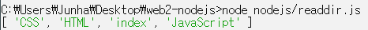
* Node.js는 특정 디렉토리에 있는 파일의 목록을 배열로 이렇게 만들어서 이런 형식으로 전달하는 약속을 가지고 있는것
* 우리는 반복문을 통해서 반복적으로 처리해서 어떠한 결과를 만들수 있다.


# App 제작-글목록 출력하기

2021년 3월 20일 토요일
오후 10:26

## 실습
### 주의해야할 부분
```js
fs.readFile(`data/${queryData.id}`, 'utf8', function (err, description) {
```
* 이 부분은 실수한 부분. 
* 특정 디렉토리에서 파일을 읽어서 디스크립션이라는 변수값을 생성해주는 이 코드는 필요없다. 

### 단계별 실습
```js
fs.readdir('./data', function (error, filelist) { 
console.log(filelist);
}
```
1. 파일 목록을 가져오는 코드로 아래 코드를 덮어 주자.
    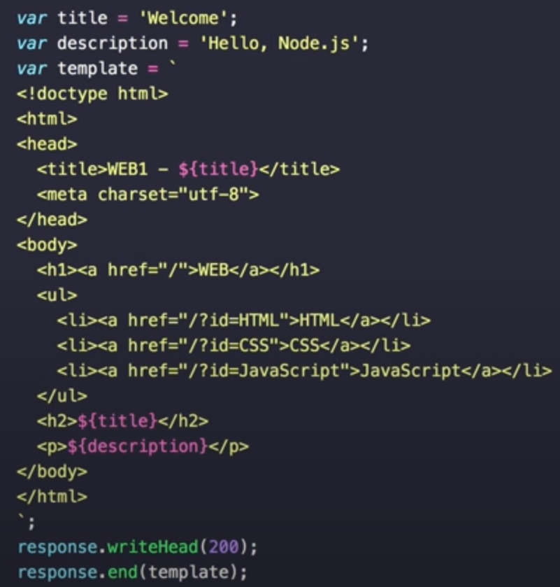

   * 콘솔 출력값>
     
       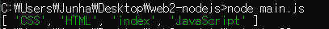

2. `<ul>`태그 안의 코드를 ```${list}```라고 하는 변수로 바꾼다.(프로그래밍적으로 `<ul>~~~</ul>`태그 코드를 만들어 준다.)
   
    ```js
    var list = '<ul>';
    var i = 0;
    while (i < filelist.length) {
    list = list + `<li><a href="/?id=${filelist[i]}">${filelist[i]}</a></li>`;
    i = i + 1;
    }
    list = list + '</ul>';
    ...중략…
    <h1><a href="/">WEB</a></h1>
    ${list}
    <h2>${title}</h2>
    ```

3. List 변수 파일리스트 프로그래밍.
   * 파일리스트는 배열, 그것을 반복문으로 처리하는 것 반복문을 처리할 때 몇 번 반복한다는 i의 값을 담고 반복할때마다 i값을 1씩 증가시키는 while 구문을 사용
   * 그리고 중괄호 부분에서 몇번  반복해야 될까? 
   * 파일리스트에 엘리먼트의 숫자만큼 반복! (i < filelist.length)
   * 코드가 실행될 때마다 리스트에 ```<li>${filelist[i]}</li>``` 를 추가시키면 수정 전 목록이 출력된다.
   * 링크를 추가하자. `<a href="/?id=${filelist[i]}">${filelist[i]}</a>`

    ```js
    var list = '<ul>';
    var i = 0;
    while (i < filelist.length) {
        list = list + `<li><a href="/?id=${filelist[i]}">${filelist[i]}</a></li>`;
        i = i + 1;
    }
    list = list + '</ul>';
    ```

    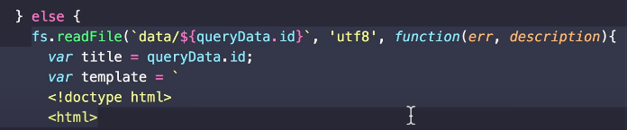

4. Id가 있는 값의 코드인 밑의 else 아래 코드 부분도 수정하자.

    ```js
    } else {
        fs.readdir('./data', function (error, filelist) {                
            var title = 'Welcome~!';
            var description = 'Hello Node.js';
            var list = '<ul>';
            var i = 0;
            while (i < filelist.length) {
                list = list + `<li><a href="/?id=${filelist[i]}">${filelist[i]}</a></li>`;
                i = i + 1;
            }
            list = list + '</ul>';
    ```
    * 추가
  
    ```js 
    <body>
    <h1><a href="/">WEB</a></h1>
    ${list}
    <h2>${title}</h2>
    ```
    * `<ul>`태그 목록 코드 수정 `${list} `변수로 수정.

5. 이제 새로운 페이지를 data폴더에 넣으면 바로 파일리스트에 추가가 되고 웹페이지에 적용이 된다.

    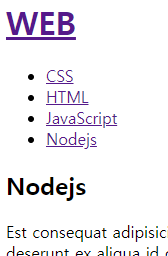

# Javascipt 문법4-함수

2021년 3월 21일 일요일
오후 12:45

### 함수의 기본 문법
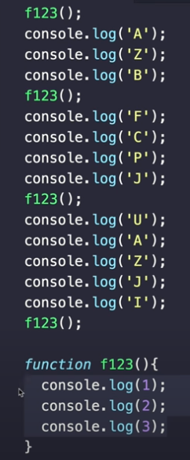

### 함수의 입력
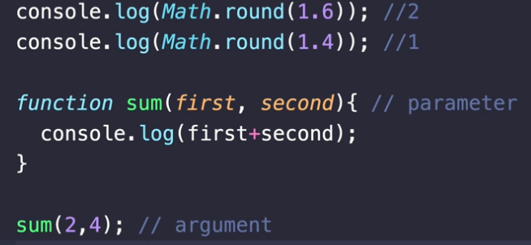

### 함수의 출력 
* return은 함수를 멈추고 return 뒤의 값을 출력한다. 2가지 기능.
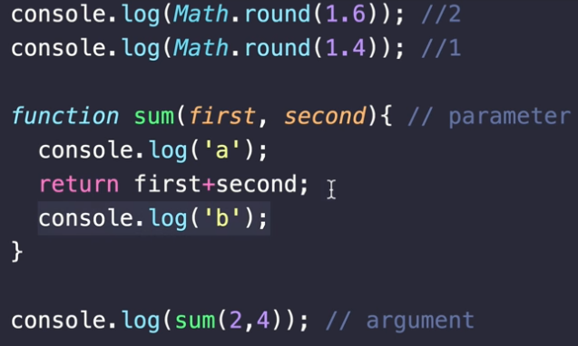
* 콘솔
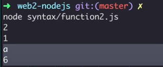


# App 제작-함수를 이용해서 정리 정돈하기

2021년 3월 21일 일요일
오후 10:54

* 함수를 만들어서 중복되는 부분을 정리하자.
* templateHTML 함수. 
* 템플릿은 껍데기? 같은 의미 


# 동기와 비동기, callback

2021년 3월 22일 월요일
오후 1:12

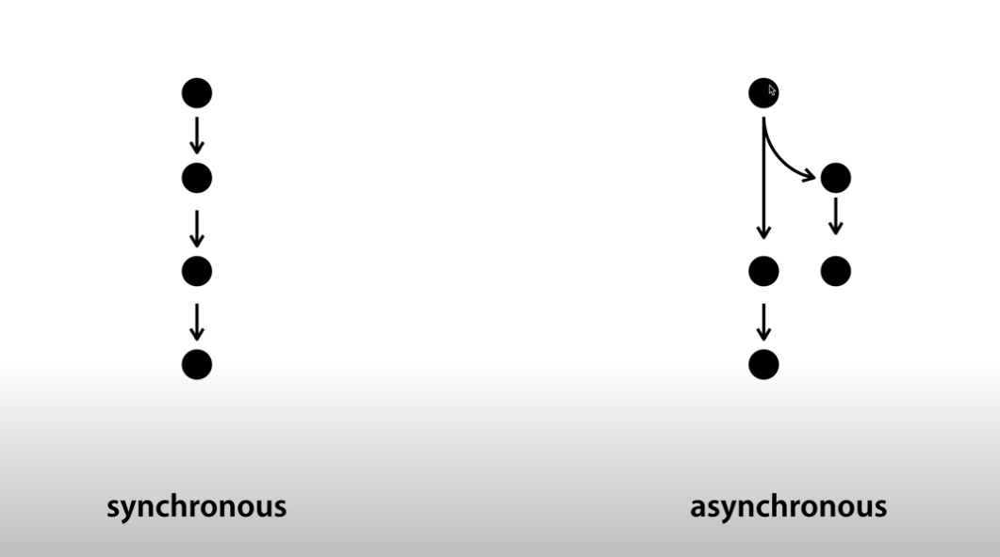
## 동기적 일 처리 vs 비동기적 일 처리
1. 동기와 비동기란?
* 동기적이란 순차적, 시간의 흐름대로 란 뜻. 
* 비동기적은 병렬적으로 여러가지 일이 동시에 진행되는 느낌.
* Node.js를 이용해서 병렬적으로 동시에 여러가지 일을 처리하는 방식인 비동기적 일처리 과정을 배워보자.
* 복잡한 과정이지만 고성능의 프로그램을 만들기 위해 필요하다.

1. 동기 비동기가 코드레벨에서 어떤 차이를 가지는가?
* 노드js사이트 > 도큐먼트 > file system
    >https://nodejs.org/dist/latest-v14.x/docs/api/fs.html

## Sync의 유무
* Sync가 붙어있는 것 안 붙어있는 것. 차이? 
  * callback의 유무
  * 예)

## `fs.readFile(path[, options], callback)`

>출처: <https://nodejs.org/dist/latest-v14.x/docs/api/fs.html#fs_fs_readfile_path_options_callback> 

## `fs.readFileSync(path[, options])`

>출처: <https://nodejs.org/dist/latest-v14.x/docs/api/fs.html#fs_fs_readfilesync_path_options> 


## `var fs = require('fs');`
### 코드해석
* fs모듈을 불러와서(require) var fs 로 변수화 fs라는 이름을 붙임

* (예제 코드)

```js
var fs = require('fs');

//readFileSync (동기적)
console.log('A');
var result = fs.readFileSync('syntax/sample.txt', 'utf8');
console.log(result);
console.log('C');

//readFile (비동기적)
console.log('A');
fs.readFile('syntax/sample.txt', 'utf8', function(err, result){
});
console.log(result);
console.log('C');
```

### 코드해석
* readFilesync는 리턴값을 주는데 readFile은 리턴값이 아니다 따라서 var result를 지우고 대신에 함수를 3번째 인자(callback)로 준다.
* function(err, result){}; 실행시켰을때 첫번째 인자는 에러가나면 에러를 주고 2번째 파라미터에는 파일의 내용을 인자로서 공급해 주도록 약속되어있다.
* 비동기적인 방식으로 하는게 좋으나 너무 코드가 복잡하고 내가하는게 성능이 대단한게 아니면 심플한 이해하기 쉬운 동기적 방식으로 해도 괜찮다


### callback에 대해
1. Callback 상당히 어려운 주제! 이해하려고 하지말고 받아들이자 익숙해지자~
	
    ```js
	fs.readFile('syntax/sample.txt', 'utf8', function(err, result){
	    console.log(result);
	});
	```

	* 코드해석) 
        * node.js야 경로의 파일을 읽어와 근데 시간이 좀 걸리니까 작업이 끝난 다음에 내가 너한테 전달한 3번째 인자인 함수를 실행시켜 라고 이야기한 것. 이게 바로 콜백
	    * 파일을 읽은 다음에 나중에 함수를 호출하는 것을 통해서 나를 불러 이것을 실행해 이렇게 얘기한것. 

## 함수의 성격

```js
function (){
    console.log('A');
}
```

### 익명함수
* 이름이 없는 함수

```js
function a(){
    console.log('A');
}
var a = function (){
    console.log('A');
}
a();
```

* a(); 
  * 이 기호를 통해서 a라는 변수가 담고있는 값인 함수를 실행가능


* 자바스크립트에선 함수가 값이다!
```js
function slowfunc(callback){
    callback();
}
showfunc(a);
```

* `callback`은 파라미터

### 파라미터
* 컴퓨터 프로그래밍에서 매개변수(영어: parameter 파라미터[*])란 변수의 특별한 한 종류로서, 함수 등과 같은 서브루틴[1]의 인풋으로 제공되는 여러 데이터 중 하나를 가리키기 위해 사용된다.
* 여기서 서브루틴의 인풋으로 제공되는 여러 데이터들을 전달인자(argument) 라고 부른다. 

>출처: <https://ko.wikipedia.org/wiki/%EB%A7%A4%EA%B0%9C%EB%B3%80%EC%88%98_(%EC%BB%B4%ED%93%A8%ED%84%B0_%ED%94%84%EB%A1%9C%EA%B7%B8%EB%9E%98%EB%B0%8D)> 


### 상황 설정
아주 오랜시간이 걸리는 함수가 있다고 치자. 이 기능이 끝난 다음에 함수가 끝났으니까 다음 일을 하세요 라고 하고 싶다면 함수의 인자로 callback을 받으면 된다. 그리고 그 콜백을 실행시켜주면된다 

```js
var a = function (){
    console.log('A');
}
function slowfunc(callback){
    callback();
}
slowfunc(a);
```

* Slowfunc라는 함수를 실행하면서 a라고 하는 변수를 갖다 놓으면 slowfunc라는 오랜시간이 걸려서 동작하는 함수가 실행이 되고 callback이라는 파라미터는 a를 가리키는 
* function (){console.log('A');} 이 함수를 갖게 되는 것 
* slowfunc 안에서 callback이라는 함수를 호출하면 console.log('A');가 실행 된다. 

  * **결과** = A 
    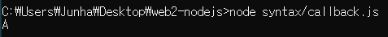


# 패키지 매니저와 PM2

2021년 3월 22일 월요일
오후 2:56

## 패키지와 패키지 매니저
* 패키지는 소프트웨어를 부르는 여러가지 용어중 한가지
* 독립적으로 실행되는 그 프로그램도 패키지라고 할수 있고
* 프로그램에서 부품으로 사용되는 그 작은 프로그램도 패키지라고 할 수 있다.
* 패키지 매니저 소프트웨어 관리 생성 설치 업데이트 관리 삭제 이런 프로그램
* 각각의 언어와 운영체제별로 패키지 매니저는 중요한 역할을 한다

## npm
* 우리가 살펴볼 구체적인 패키지 매니저는 npm 
* 노드js에서 가장 광범위하게 사용되고 있고 * Nodejs를 설치할때 함께 설치됨  

### npm 설치
* Npm을 통해서 프로그램 설치를 해보자. 
* Pm2검색

>출처: <https://pm2.keymetrics.io/> 

## pm2의 활용
* 실행중인 프로그램을 프로세스라고도 함.
* Pm2를 이용하면 노드js를 통해 만든 프로그램 > main.js 를 관리 (프로그램을 다시켜주고 코드를 수정하면 노드js를 껏다 다시 켜야하는 과정을 거쳤는데 
* pm2는 파일이 수정되면 자동으로 프로그램을 껏다 켜줌.

## Pm2 명령어 : 
### ADVANCED, PRODUCTION PROCESS MANAGER FOR NODE.JS
* PM2 is a daemon process manager that will help you manage and keep your application online 24/7
* `npm install pm2 -g`

### FEATURES
* A Complete feature set for production environment, built with a worldwide community of developers and enterprises.
pm2 start app.js
* `pm2 start main.js --watch --no-daemon` 로 실행하자
* no-daemon
  * pm2 실행함과 동시에 로그까지 볼수 있게 하는 것

### MONITORING
* Monitoring all processes launched:
`pm2 monit`
### MICROSERVICE
* List all processes: `pm2 list`

* Act on them: `pm2 stop` / `pm2 restart` / `pm2 delete`


## 문제상황
* Pm2가 터미널창에서 명령어를 입력했을시 not responding 하는 상황 발생 >> 메모리문제? >>컴퓨터 껏다키니까 해결


### 부록- pm2 보충학습

* `pm2 start main.js --watch --ignore-watch="data/*" --no-daemon `
  * 데이터를 입력할 때 pm2가 꺼졌다 켜지면 안된다 위의 코드로 실행시키면 data폴더의 모든 파일을 무시해라 라는 명령어를 넣어서 꺼졌다 켜지지 않는다. 계속 켜지게
* `pm2 start main.js --watch --ignore-watch="data/* 디렉토리명/*" --no-daemon`
    * 특정 디렉토리의 파일을 관리하고싶을때는 띄어쓰기를 해서 뒤에  디렉토리명/* 을 붙여준다.


# HTML-form

2021년 3월 22일 월요일
오후 3:12

### 컨텐츠를 사용자가 생성, 수정 ,삭제
* 컨텐츠를 사용자가 웹을 통해서 생성하고 수정하고 삭제하는 방법을 살펴보자
* 사용자가 서버쪽으로 데이터를 전송하기 위한 방식인 html의 form.

### Form 태그
* Form 태그는 사용자가 입력한 정보를 제출 버튼을 눌렀을때 액션속성이 카리키는 서버로 쿼리스트링의 형태로 데이터를 전송하는 html의 기능이다.

### 사용법
* 서버에서 데이터를 가져올때 get할때는 ?~~하는 쿼리스트링을 쓰고
* 서버에서 데이터를 생성하거나 수정하거나 삭제할 떄는 필요한 테이터를 이렇게 url로 보내면 안된다.(주소를 입력하고 접속할때 수정행위가 일어날수도있다) 눈에 보이지 않는 방식으로 보내야한다. >> method="post" 
* 이렇게 하면 아주 큰 데이터도 전송할 수 있다. Url로 데이터를 전송할 때는 무한히 긴 데이터를 전송x 데이터가 짤릴 수도 있는 문제가능.
* 즉, 서버로부터 사용자가 데이터를 가져올 때는 get방식을 쓴다. >>method="get"이거나 method가 생략되어있을때도 get방식
* 서버에 데이터를 수정, 삭제, 생성과 같은 일을 할 때는 반드시 method를 post방식으로 해야 된다.
