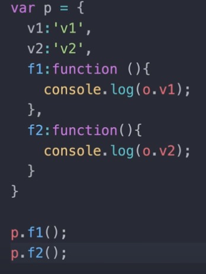

>> 생활코딩 WEB2-Node.js를 학습, 정리한 내용입니다. (https://github.com/qufstar7/TIL)

# Node.js basic1

- Node.js, Node.js와 관련된 주제, 간단한 JavaScript 문법
- Node.js를 이용한 App제작 실습
    - Node.js
    - js문법
    - App제작(Node.js)

# 목차
* chapter 23 ~ chapter 35
    23. App-글생성UI
    24. App-POST방식 데이터 받기
    25. App-파일생성과 리다이렉션
    26. App-글수정
    27. App-글삭제
    28. js문법-객체
    29. App-템플릿 기능 정리
    30. 모듈의 형식
    31. 모듈의 활용
    32. App-입력정보에 대한 보안
    33. App-출력정보에 대한 보안
    34. API와 CreateServer
    35. 수업을 마치며


# App 제작-글생성 UI 만들기

2021년 3월 22일 월요일
오후 3:25

### 글쓰기 화면 만들기

* 웹페이지에 들어왔을때 페이지목록 밑에 create 링크를 만들고
  * ```<a href="/create">create</a>```
* 이동한 web - create페이지에서
  * ```var title = 'WEB - create';```
* 사용자가 제목과 설명을 입력하고
  * ```<input type="text" name="title" placeholder="제목">```
* 제출 버튼을 누르면 process_create페이지로 넘어가게 만들자(post방식으로 데이터를 전송) 
  * ```method="post"```


# App 제작-POST 방식으로 전송된 데이터 받기

2021년 3월 22일 월요일
오후 3:44

### 코드수정
* process_create를 create_process 로 

```js
http.createServer(function (request, response)
```

* createServer에 전달된 콜백함수
* createServer는 노드js로 웹브라우저가 접속이 들어올때마다 크레이트서버로 콜백함수를 nodejs가 호출한다. 
* request에는 요청할 때 웹브라우저가 보낸 정보들을 담는 것
* response는 응답할 때 웹브라우저한테 전송할 정보들을 담는 것

```js
} else if (pathname === '/create_process') {
    var body = '';
    request.on('data', function (data) {
        body = body + data;
    });
    request.on('end', function () {
        var post = qs.parse(body);
        var title = post.title;
        var description = post.description;
        console.log(post.title);
    });
    response.writeHead(200);
    response.end('success');
```

### 정리
* 웹브라우저가 포스트 방식으로 데이터를 전송할 때 데이터가 엄청나게 많으면 그 데이터를 한꺼번에 처리하가는 문제가 생길 수 있다.
* 따라서 노드js는 이런 경우를 대비해서 조각조각의 데이터를 수신할때마다 이 콜백함수를 호출하도록 약속되어 있음.
* 그리고 호출할때 데이터라고 하는 인자들을 수신한 정보들을 주기로 약속되어 있다.


# App 제작-파일생성과 리다이렉션

2021년 3월 22일 월요일
오후 8:06

## 데이터 디렉토리에 저장
* Post방식으로 전송된 데이터를 디렉토리안에 넣는 방법!(저장) 
  * 파일을 전송된 데이터에 맞게 새로 생성한다! 
  * 검색)nodejs file write

    ```js
    fs.writeFile(`data/${title}`, description, 'utf8', 
    ```

### 코드
* Fs.wirteFile(`저장이름`, 설명, 'utf-8', callback)


### 정리
* 생성한 파일을 리다이렉션해서 링크리스트(링크목록)에 자동으로 넣어주는 기능!
* 검색)nodejs redirection
    ```js
    response.writeHead(302, {Location: `/?id=${title}`});
    ```


# app 제작-글수정

2021년 3월 22일 월요일
오후 9:43

## 1. 수정링크생성
* 웹페이지에 update키(링크)를 만들어보자
```js
${control}
`<a href="/create">create</a> <a href="/update?id=${title}">update</a>`
```

## 2. 수정할 정보 전송.
* 업데이트키를 눌렀을때 나타나는 화면을 만들어보자
* 폼(데이터전송), read기능(수정하고자하는 것을 넣어야 하기 때문에)을 넣어야 한다.

```js
} else if (pathname === '/update') {
    fs.readdir('./data', function (error, filelist) {
        fs.readFile(`data/${queryData.id}`, 'utf8', function (err, description) {
            var title = queryData.id;
            var list = templateList(filelist);
            var template = templateHTML(title, list,
                `
                <form action="/update_process" method="post">
                <input type="hidden" name="id" value="${title}">
                <p><input type="text" name="title" placeholder="제목" value="${title}"></p>
                <p>
                    <textarea name="description" placeholder="설명">${description}</textarea>
                </p>
                <p>
                    <input type="submit" value="수정">
                </p>
                </form>
                `,
                `<a href="/create">create</a> <a href="/update?id=${title}">update</a>`
            );
            response.writeHead(200);
            response.end(template);
        });
    });
} else {
```
## 3. 파일명 변경, 내용저장
```js
var body = '';
request.on('data', function (data) {
    body = body + data;
});
request.on('end', function () {
    var post = qs.parse(body);
    var id = post.id;
    var title = post.title;
    var description = post.description;
    fs.rename(`data/${id}`, `data/${title}`, function (error) {
        fs.writeFile(`data/${title}`, description, 'utf8',
            function (err) {
                response.writeHead(302, { Location: `/?id=${title}` });
                response.end();
                });
    })
    console.log(post);
});
```


# App 제작-글삭제

2021년 3월 22일 월요일
오후 10:38

## 1. 글삭제 기능 완성
* 삭제 버튼 기능 구현해보자
* 컨텐츠를 선택했을 때 활성화되는 부분(id를 선택한 page)에서 delete 버튼을 추가하고
* Delete버튼을 눌렀을때 어떤 페이지로 가는게 아니라 바로 삭제되도록 해야한다.
* 따라서 링크<a href></a>를 다는게 아니다. >>form으로 한다.
* 예전에 구글에서 만든 캐싱이라는 플러그인이 있었는데 빠르게 접속하게 하기위해 사용자가 들어가기전에 미리 사이트를 저장해주는 역할이었다.
* 근데 개발자가 삭제키를 get방식으로 (쿼리스트링은 get방식이다)만들어서 삭제버튼을 눌렀을때 플러그인이 미리 그 사이트를 들어가서 삭제되버린 사건이 있었다. 
* 따라서 삭제는 링크로하면 절대로 안된다.
	
```js
`<a href="/create">create</a>
<a href="/update?id=${title}">update</a>
<form action="delete_process" method="post" >
    <input type="hidden" name="id" value="${title}">
    <input type="submit" value="delete">
</form>`
```	

## 2. 글삭제 기능 완성
* 삭제요청을 처리하는 방법을 알아보자
* delete_process라고 하는 path를 통해서 삭제를 하고 싶다면 기존에 만든
update_process코드 부분을 카피해서 이용해 만들어 보자.
* Update를 delete로 바꾸고 id만 가져오면 되니까 title과 description 번수도 삭제하자.
* Fs.write밑 부분도 필요없다. 
* 검색해보자 
    * 검색)nodejs delete file 
        * fs.write(path, callback);
* Path는 데이터위치(경로)를 `data/${id}` 데이터폴더의 id변수를 제목으로 가진 파일을 불러오면 된다. 함수는 기본인 에러만 써주자.
    ```js
    fs.unlink(`data/${id}`), function (error) {
    ```
* 그리고 삭제가 끝나면 끝났다고 알려줘야하는데 사용자를 홈으로 보내버리고 싶다면 302번이 리다이렉션의 코드번호다. (301도 있다)
```js
response.writeHead(302, { Location: `/` });
                response.end();
```
* 헤더정보는 로케이션을 하는데 id값이 없는 쪽
```{ Location: `/` }```
으로 보내주자.
	

## 301vs302 
* 주제에서 벗어 났지만 res.redirect를 추가하려는 경우 언급할만한 가치가 있다.
* 리디렉션 유형을 염두에 두는 것이 좋다.
* 301 대 302, res.redirect는 기본적으로 상태를 302로 설정하지만 이것은 나쁜 SEO. 
* res.redirect의 상태 코드를 변경하려면 301을 추가 한 다음 리디렉션 할 경로를 추가.

>출처: <https://stackoverflow.com/questions/22677940/difference-between-location-and-redirect-in-node-js> 


# Javascript문법5-객체

2021년 3월 23일 화요일
오후 12:22

## 객체
* 추상적이고 철학적인게 맞지만 구체적으로 기능중심으로 생각하자.
* Object vs Array 둘다 정보를 정리정돈하는 도구. 객체는 순서 x 배열은 순서0 정보를 정리정돈한다.

* <형식>
    ```js
    //배열 리터럴(표현하는방법)이 대괄호
    var members = ['kjh', 'quf', 'star7'];
    console.log(members[1]);  //quf

    //객체 리터럴(표현하는방법)이 중괄호, 콘솔에선 2가지방법
    var roles = {
        'programmer': 'kjh',
        'designer': 'quf',
        'manager': 'star7'
    }
    console.log(roles.designer);  //quf
    console.log(roles['designer']); //quf
    ```
### 정리
* 즉 배열은 데이터를 그냥 순서대로 넣으면 된다.
* 객체는 데이터를 그냥 넣는 것이 아니라 각각의 데이터마다 고유한 이름을 준다.

## 배열과 객체의 반복.
```js
var i = 0;
while(i < members.length){
    console.log('array loop', members[i]);
    i = i + 1;
}

for(var name in roles){
    console.log('object => ', name, 'value =>', roles[name]);
}
```
* 객체의 반복은 for(var 변수 in 객체변수){} 으로 한다.

## OOP
* Object Oriented Programming (OOP) :객체 지향 프로그래밍
* 프로그래밍을 한다? > 1데이터, 2데이터를처리 
* 복잡한 데이터를 정리정돈하는 과정 > 배열, 객체, 함수(그루핑)
* 함수는 처리하야될 일에 대한 어떠한 정보를 담고 있는 일종의 구문(statement)인 동시에 값이다. 
* 함수를 변수에 넣을 수 있다면 값이다. 
* 넣을 수없으면 값x
```js
var i = if(true){console.log(1)}; //에러남 자바스크립트에선 조건문이라는 구문이 값이 아니기 때문
var w = while(true){console.log(1)}; //에러남 while도 값이 될수 x

var f = function(){
    console.log(1+1);
    console.log(1+2);
}
console.log(f);  
f();
//f출력 자바스크립트에서는 함수라는 구문이 다른 statement와 다르게 값이 될 수 있다. 즉 펑션, 함수는 처리방법을 담고 있는 구문이면서 그것 자체가 값이 될 수 있다.

var f = function(){
    console.log(1+1);
    console.log(1+2);
}
var a = [f];
a[0]();
//배열의 원소로서 함수가 존재할 수 있다.

var o = {
    func:f    
}
o.func();
//자바스크립트에서 배열과 객체는 모두 서로 연관된 정보를 담는 그긋인데
자바스크립트에서는 처리방법을 그룸핑하는 함수 조차도 데이터이기도 하기 때문에 배열과 객체에다가 담을 수 있다.
```

## 객체 마무리
* 데이터와 처리 방법을 담는 그릇으로서 객체 1억줄의 코드를 2000명이 20년동안 운영한다고 하자.
* 버그찾기가 기하급수적으로 어려워 진다. 이러한 상황에서 도와줄 수 있는 도구가 객체. 하나의 객체안에 연관된 정보를 정리할 수 있다. (폴더와 비슷)

* '함수가 값이다.' 라는 특성을 이용하면 이 함수를 이 함수가 사용하고 있는 데이터들이 그룹핑 되어있는 객체의 멤버로써 추가할 수 있다.

* O라고하는 하나의 객체안에 연관된 값들과 그 값을 처리하는 함수들이 그룹핑 되어 있기 때문에 더 잘 정리정돈 되어 있다.

* 함수가 객체 안에서 사용될 때 그 함수가 자신이 속해 있는 객체를 참조할 수 있는 특수한 약속이 필요하다는 것을 알아냈고 this라고 하는 키워드를 만듦.
  * 함수가 어떠한 이름의 변수에 담긴 것인지와는 상관없이 언제나 함수 내에서this라고하는 약속된 값을 통해서 그 함수가 속해 있는 객체를 참조할 수 있게 된다. 

### 결론
* 함수는 값이다.
* 객체는 값을 저장하는 그릇이다.
  * 라는 특성을 이용해서 
  * 연관된 데이터들과 연관된 처리방법들을 담고 있는 함수들을 
  * 이렇게 그룹핑하는 것을 통해서 
  * 코드의 복잡성을 획기적으로 낮출 수 있다.

### 추가
* 객체에는 인스턴스 클래스 와 같은 복잡한 것도 있다


# App제작-템플릿 기능 정리

2021년 3월 23일 화요일
오후 3:03

### 템플릿 객체 생성
* 템플릿 객체를 만들자(html과 list라는 이름의 함수를 가진)
```js
var template = {
    HTML:function(title, list, body, control) {
        return `
        <!doctype html>
        <html>
        <head>
            <title>WEB1 - ${title}</title>
            <meta charset="utf-8">
        </head>
        <body>
            <h1><a href="/">WEB</a></h1>
            ${list}
            ${control}
            ${body}
        </body>
        </html>
        `;
    }, List:function(filelist) {
        var list = '<ul>';
        var i = 0;
        while (i < filelist.length) {
            list = list + `<li><a href="/?id=${filelist[i]}">${filelist[i]}</a></li>`;
            i = i + 1;
        }
        list = list + '</ul>';
        return list;
    }   
}
```
* 사용하는 쪽도 전부 수정해 주자.
```js
var list = template.List(filelist);
var html = template.HTML(title, list,
	`<h2>${title}</h2>${description}`,
	`<a href="/create">create</a>`
);
response.writeHead(200);
response.end(html);
...생략…
```
## 리펙토링
* 동작방법은 똑같지만 코드를 더효율적으로 짜는것 : 리펙토링
* 실제로 아무리 코딩의 고수라도 심플한 코드에서 시작해 계속해서 리펙토링을 해주는 방식으로 코딩한다. 
* 턴들을 함수화, 배열화, 객체화하는 과정.. 
* 천천히 순차적으로
* 처음부터 이상적인 코드를 완벽한 코드를 짜려고 하면 안된다.


# 모듈의 형식

2021년 3월 23일 화요일
오후 3:23

## 정리정돈 툴 - 모듈
* 정리정돈하다보면 객체가 많아진다. 
* 그 객체들을 정리정돈하는 더 큰 툴이 모듈.
* 배열, 함수, 객체, 모듈
* 모듈을 이용하면 파일로 쪼개서 외부로 독립
가능 (muse.js, mpart.js)

### 코드 설명 1


* ```module.exports = M; ```
    * Mpart.js 라는 파일에 있을 수 있는 기능들 중 M이 가리키는 객체를 모듈바깥에서 사용할 수 있도록 export하겠다는 뜻
### 코드 설명 2

* ./ 는 현재 디렉토리라는 뜻
* require로 모듈
* 변수.함수(); 
* part.f();
* 이렇게 실행 시키면
* M.f(); 과 똑같은 결과가 나온다

### 코드 설명 3

* Part라는 변수는 모듈을 로딩한 결과를 part에 담았는데
* part에는 { v: 'v', f: [Function: f] } 이렇게 생긴 객체가  들어있고 
* 이 객체는 ```module.exports = M;``` 로 대입한 
```js
{
    v: 'v',
    f:function(){
        console.log(this.v);
    }
}
```
* 위 부분이 객체인 것을 알 수 있다.


# 모듈의 활용

2021년 3월 23일 화요일
오후 3:54

## 모듈 적용(main.js)
* 모듈을 main.js에 활용해보자
* Var template 부분인 
```js
var template = {
    HTML: function (title, list, body, control) {
        return `
        <!doctype html>
        <html>
        <head>
            <title>WEB1 - ${title}</title>
            <meta charset="utf-8">
        </head>
        <body>
            <h1><a href="/">WEB</a></h1>
            ${list}
            ${control}
            ${body}
        </body>
        </html>
        `;
    }, List: function (filelist) {
        var list = '<ul>';
        var i = 0;
        while (i < filelist.length) {
            list = list + `<li><a href="/?id=${filelist[i]}">${filelist[i]}</a></li>`;
            i = i + 1;
        }
        list = list + '</ul>';
        return list;
    }
} 
```
* 이부분을 template.js 파일로 lib디렉토리로 분리시키고, 
* `module.exports`로 main.js로 보내주자
* `module.exports = template;` 를 뒤에 파일 맨 뒤에 붙여서 보내도 되고
* 맨위의 `var template`를 `module.exports`로 바꿔도 된다.
* 그리고 main.js파일에서 
`var template = require('./lib/template.js');`로 모듈을 불러오면 된다.


# App제작-입력정보에 대한 보안

2021년 3월 23일 화요일
오후 8:34

## 보안감수성-입력정보
* 보안의 중요함을 느껴보고 입력정보에 대해 적용해 보자
  * 검색) nodejs path parse >>
path.parse(path)

출처: <https://nodejs.org/api/path.html> 

### Cmd에서 즉석 실행
```
> var path = require('path');
undefined
> path.parse('../[password.js');
{                                   // 객체{}에 들어있다.
  root: '',                         
  dir: '..',                        // Dir -  별도의 프로퍼티Base - .~~뒤에 붙인 정보
  base: '[password.js',            
  ext: '.js',                       // Ext - 확장자	
  name: '[password'                 // Name - 이름
} 

> path.parse('../[password.js').base;
'[password.js'
>>.base를 붙이면 ../password라고 해도 경로를 탐색해나가는 정보를 세탁할 수 있다.
```

* 외부에서 들어온 정보는 readdir 코드 부분, 삭제 부분이다 
* 오염된 정보를 쳐내는것을 필터라고함 
* filteredId로 ../로 보내는 정보를 세탁하자.
```js
var filteredId = path.parse(queryData.id).base;
fs.readFile(`data/${filteredId}`
```
```js
var filteredId = path.parse(id).base;
fs.unlink(`data/${filteredId}`
```


# App제작-출력정보에 대한 보안

2021년 3월 23일 화요일
오후 9:12

## 보안감수성-출력정보
* 웹페이지 사용자가 글을 입력할때 `<script>`태그를 이용해서 alert로 경고창을 띄우거나 a href로 다른 사이트로 이동하게 만들 수 있다. 
* 따라서 `<script>`태그안의 내용을 모두 지우는 방식을 이용하거나 <>괄호를 문자 그대로 나타나게 하는 방식을 이용해야 한다.
  * 검색) html entities < : &lt   // > : &gt
```
&lt;script&gt;
location.href = 'http://opentutorials.org';
&lt;/script&gt;
```

### 방법 2가지
* 2가지를 살펴보자
1. 첫 번째 사용자가 정보를 입력할 때 오염된 정보가 있다면 그것을 소독하는 것.
2. 두 번째는 npm을 통해서 내가 아닌 다른 사람이 만든 모듈을 사용해서 애플리케이션을 빠르게 만드는 법.
   * 검색) npm sanitize html >> https://www.npmjs.com/package/sanitize-html
   * Npm포털에서 모듈을 검색, weekly download 확인 할 수 있다.

### 적용
* Sanituze html을 우리 애플리케이션에서 부품으로 사용하자
* Terminal에서 npm init 명령어를 실행시키자 
* 애플리케이션을 npm으로 관리하기 위한 절차가 시작. 
* 각종 정보를 정하는데 엔터쳐서 넘기자.
* package.json 파일 생성됨
* Npm install -S sanitize html 명령어로 다운
* node_modules 디렉토리 생성됨 
* 안에 sanitize-html디렉토리에 있는 파일들있음
* Package-json파일(상위폴더에있는)를 보면
```js
"dependencies": {
    "sanitize-html": "^2.3.3"
  }
```
예전에 pm2를 인스톨할떄는 -g를 썼다. global약자 Pm2를 이컴퓨터 전역에서 어디서나 쓸 수 있는 독립된 프로그램으로 깐것 
-S하면 프로젝트에서 사용할 작은 조각으로서 부품으로서 다운로드한다.

### sanitize-html과 의존성 설명
* Dependencies(의존성) ~~ 버전이 써있음
* 우리가 sanitize-html을 쓰고있다면 우리는 sanitize-html에 의존하고 있는 것
* 그렇다면 node_modules 디렉토리에 있는 다른 디렉토리들과 파일들은 뭐냐 
  * sanitize-html이 의존하고 있는 다른 소프트웨어들 각각의 소프트웨어들은 다른 소프트웨어들에게 의존하고 있다. 
  * 이렇게 복잡한 의존성을 npm이 관리해준다.

### Sanitize-html 모듈 require하기
```js
var sanitizeHtml = require('sanitize-html');
```
### 상세 페이지를 보는 코드에서 title과 dsecription을 sanitized하기
```
var sanitizedTitle = sanitizeHtml(title);
var sanitizedDescription = sanitizeHtml(description);
```


# API와 CreateServer

2021년 3월 23일 화요일
오후 10:16

## API
* 우리가 만든 웹애플리케이션은 node.js를 호출함으로써 동작하게 된다.
* api를 사용하는 것.

### fs.readFile함수
* `fs.readFile` 함수는 nodejs를 만든 개발자들이 만든 함수. 어떤 원리로 동작? 모른다.
* 단지 node.js 사이트에서 파일을 읽어올때는 이 함수를 이용하라고 사용설명서를 통해서 말해준다.

### 함수와 인터페이스
* 함수의 이름과 파라미터, 리턴 값은 nodejs를 만든 개발자들과 nodejs를 이용하는 개발자들 간의 약속된 조작장치.
* 이런 조작장치를 인터페이스라고함.
  
### 다시 API
* 이렇게 애플리케이션을 프로그래밍 하기 위해서 제공되는 인터페이스를 애플리케이션 프로그래밍 인터페이스 줄여서 API라고 한다.
* 이제 어떤 프로그래밍 언어를 만나건 간에 그 언어가 가지고 있는 조작장치가 궁금하면 api를 검색하면 된다!
## Node.js documentation
* Nodejs공식홈페이지의 문서항목
* >https://nodejs.org/dist/latest-v14.x/docs/api/
* Nodejs에서 제공하는 모듈들
* http라는 모듈을 들어가보면 Http라는 모듈이 가지고 있는 기능들이 나온다. 
* Http는 웹 브라우저와 웹서버가 서로 통신할 때 사용하는 통신 규칙이고 바로 그 통신을 지원하는 노드js의 기능들이 여기에 있는 것. 
* main.js 코드에서 http라는 모듈의 createServer를 사이트에서 검색해보면
  
* api문서에 http모듈(객체이기도함)에 createServer라고하는 함수(함수가 객체안에 있으면 메소드라고도함)가 있는데 인자로는 options, requestListener라고 하는 파라미터가 있고 []대괄호의 의미는 생략가능하다는 의미. 
  
* Options 인자는 우리 코드에 사용하지 않았고, requestListener 인자를 사용하였다.
* requestListener 인자는 함수로 우리 코드의 많은 부분을 감싸고 있다.
  
```js
var app = http.createServer(function (request, response) {
```
* createServer함수로 우리는 웹서버를 만든 것.
* 그리고 이 웹서버로 외부에서 요청이 들어올 때마다 웹서버는 이 첫번쨰 인자에 해당되는 function (request, response) 함수를 호출하면서 
* 그 함수에 첫번째 파라미터로는 웹브라우저로부터 들어온 요청에 대한 여러 정보를 담고 있는 객체인 request 를 인자로 주기로 약속되어 있고 
* 두번째 파라미터 값으로는 response 인데 이것으로 밑의 코드인 함수 안의 구현을 통해서
```js
var _url = request.url;
    var queryData = url.parse(_url, true).query;
    var pathname = url.parse(_url, true).pathname;
    if (pathname === '/') {
        if (queryData.id === undefined) {
            fs.readdir('./data', function (error, filelist) {
                //home
                var title = 'Welcome';
                var description = 'Hello, Node.js';
                var list = template.List(filelist);
                var html = template.HTML(title, list,
                    `<h2>${title}</h2>${description}`,
                    `<a href="/create">create</a>`
                );
                response.writeHead(200);
                response.end(html);
            });
        } else {
```
* 사용자에게 전송하고 싶은 정보, 
  * 예를 들면 `200` 
* 처리가 성공했는지 파일을 찾을 수 없는지 이러한 코드값, 또 그 실제 내용, 이러한 정보를 `response` 를 통해서 여러분이 응답할 수 있도록 `response`라고하는 객체를 넘겨주고 있는 것. 
* 그럼 그 약속에 따라서 요청한 정보와 응답할 정보를 잘 버무려서 웹 애플리케이션을 만들게 되는 것.

### http.createServer([options][, requestListener])
출처: <https://nodejs.org/dist/latest-v14.x/docs/api/http.html#http_http_createserver_options_requestlistener> 

### createServer (리턴값, 반환값)
* createServer는 리턴값으로 http.Server를 반환하도록 되어있다.
```js
var app = http.createServer(function (request, response) {
```
* `app`이라하는 저 변수에 http서버라고 하는 객체가 담겨있는 것 http서버라고 하는 api는 어떻게 생겼을까
* 코드 맨 밑을 보면 `app.listen(3000);` 라고 되어있는데
* 매뉴얼을 보면
    ```
    server.listen()#
    Starts the HTTP server listening for connections. This method is identical to server.listen() from net.Server.
    ```
    >출처: <https://nodejs.org/dist/latest-v14.x/docs/api/http.html#http_server_listen> 

* 요청에 대해서 응답할 수 있도록 http 서버를 구동시킨다. 
* 리슨이라고하는 api는 server.listen()과 net.Server라는 모듈과 똑같은 것이다 라고 적혀있다.
### server.listen()#
* Start a server listening for connections. A net.Server can be a TCP or an IPC server depending on what it listens to.
>출처: <https://nodejs.org/dist/latest-v14.x/docs/api/net.html#net_server_listen> 

### 파서블 시그니쳐. 
* 시그니처는 그 함수의 형태 이름이라든지 인자라든지 리턴값이라든지 이런 형식들을 시그니쳐라고함. 여러 시그니처, 형식들 중 포트가 첫번째 인자로 들어와 있는 
`server.listen([port[, host[, backlog]]][, callback])` 형식을 쓰고 있다. 
* 첫번쨰 자리에 포트 (3000포트를 쓰고있음)
app.listen(3000); 라고 적어주면 웹서버는 listen 코드를 시작할때 3000번 포트를 바라보고있다가, 또는 귀기울이고 있다가,
* 웹브라우저로 접속이 들어올때 3000번 포트로 들어오면 우리 앱이 응답해서 동작하게 되는 것.


# 수업을 마치며

2021년 3월 23일 화요일
오후 11:03

## 배운것
* 자바스크립트문법과 노드js기능을 이용해 웹애플리케이션을 만드는 방법을 배웠다.
* 현대적인 웹 애플리케이션을 위한 필수적인 요소이면서 인터넷의 많은 동작원리를 배웠다.

## 도전해볼만한 주제: 
1) 자바스크립트는 원래 웹브라우저를 프로그래밍적으로 제어하기 위해 고안된 언어 자바스크립트를 노드js를 배우기전에 처음 다뤄봤다면 자바스크립트의 고향인 웹브라우저를 자바스크립트로 제어하는 방법에 도전해보자. 그럼 여러분은 사용자에게 보여지는 클라이언트 쪽 부분과 서버 내에서 데이터를 처리하는 서버측 부분 모두를 하나의 단일 언어인 자바스크립트로 구현하게 됨. 이렇게 하는 것에 효용은 또있음 자바스크립트를 nodejs를 처음 만났다면 하나로 인식할 수 있음 하지만 웹브라우저와 nodejs를 따로 작업해본다면 절도있게 nodejs를 쓰는 자바스크립트와 아닌 자바스크립트를 구분할 수 있음 
2) 데이터베이스. 우리는 정보를 데이터라는 데렉토리에 파일의 형태로 저장하고 있음. 파일은 쉽고 어디에나 있음 (장점). 파일은 불편하고 위험하고 느림(단점).
파일을 이용하면서도 안전하면서도 빠르게 하려면 그것 자체로 우리의 인생을 갈아넣어도 될까말까한 어려운 주제 이런 어려운 일을 위해서 소수의 천재적인 엔지니어들이 만든 파일의 대체제가 데이터베이스. 데이터베이스를 ㅗ입하면 데이터 디렉토리에 저장했던 정보를 데이터 베이스라고하는 전문화된 프로그램에 저장하게 된다. 그렇게 되면 우리의 웹은 데이터베이스가 가진 엄청난 성능과 보안과 편리함을 거져먹는 애플리케이션으로 탈피할 수 있게 된다. Nodejs와 같이 자주 쓰이는 db는 MongoDB MySQL 
3) 프레임워크. 각 분야별로 소프트웨어들은 공통적인 부분과 공통x 부분 공존.
Ex) 웹앱 만들때 사용자의 요청 처리 인증 보안 파일 서비스 >> 공통 
이런 공통적인 것을 미리 만들어 놓은 것 >>프레임워크 
4) 무엇보다 중요한것 nodejs가 어떤 기본적인 모듈을 가지고 있는가?
그리고 nodejs 생태계가 만들고있는, npm과 같은 패키지 매니저를 이용해서 쓸수 있는 모듈들이 어떤 것이 있는가를 풍부하게 파악하는것
최근 어썸이라고하는 문화현상이 생겨나고있음. 여러 라이브러리들을 모아놓은 북마크들 최근에 많이 많들고 있다. 검색) nodejs awesome으로 검색해보자 >> 주목받는 모듈들을 아라보자 모듈을 많이 알아야 
			
## 마치며
불안하고 초조하다면 우리가 짠 코드를 다시 짜보고 안보고도 짜보고 혼자서 설명도해보고 남들에게 설명도 해보면서 작성한 코드를 우리의 뇌에 계속해서 로드하자. 어느순간 폭발적으로 진도를 뺄 수 있는 시간이 온다. 그때가 진도를 나가기 아주 좋은 타이밍이 아닐까 싶다.
