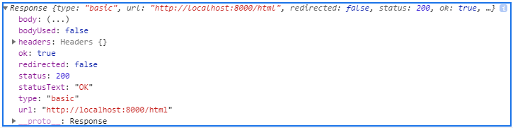
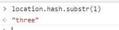

>> 생활코딩 WEB3-ajax을 학습, 정리한 내용으로 javascript를 기반으로 두고 있습니다.(https://opentutorials.org/course/3281)

# Ajax basic
 **Ajax는 리로드 없이 웹서버에게 정보를 요청해서 부분적으로 정보를 갱신해주는 기술**


# 목차
* chapter 1 ~ chapter 12   
    1. 수업소개
    2. 수업의 목적
    3. 실습환경 준비
    4. 동적으로 컨텐츠 변경하기
    5. fetch API
    6. Ajax의 적용
    7. 리팩토링 함수화
    8. 초기 페이지
    9. 글목록 1
    10. 글목록 2 
    11. fetch API polyfill
    12. 수업을 마치며
   

# 1. 수업소개

2021년 3월 24일 수요일
오후 8:08

### ajax의 등장배경
자바스크립트가 나오고 웹페이지와 동적으로 상호작용하게 됨.(문서>애플리케이션)
하지만 새로운 불만이 등장했다. 웹페이지의 정보를 부분적으로 변경하는 것.

### ajax의 예시 및 작동방식
* 예시) 추천검색어 : 모든 가능한 추천검색어를 다운로드 받는 것이 아니다.
* 작동방식
  * ajax를 통해서 웹서버와 통신을 하고 있다. 
  * 문자를 입력할때마다 서버와 통신이 이뤄지고 추천검색어가 바뀌는 것.

### ajax의 역사
* ajax는 마이크로소프트가 만들어 internet explorer에 탑재했다.
* 1999 구글이 2004 gmail 에 탑재(페이지에 리로드 없이 받은 정보함의 정보를 보여줌) '웹에 관련된 고정관념을 리로드했다.'
* 그 후 제씨제임스가렛이 Asynchronous Javascript And Xml 라고 이름붙였다.

### ajax의 역할
* 불필요한 정보까지 끄집어내는 무거운 그물이 아니다,
* 필요한 정보만 부분적으로 정교하게 낚아채는 낚시대.
* 클라이언트 사용자는 좋은 경험을 주고 운영자는 지출을 줄여준다.


# 2. 수업의 목적

2021년 3월 24일 수요일
오후 8:28

### ajax의 효율성
* ajax는 필요한 부분만 로드하기 때문에 효율적이다.
* 바뀔수 있는 부분 - title, 본문 이런 부분만 바뀌게 만들면 효율적이다.
* ajax를 이용하면 각각의 페이지마다 모든 내용을 가지고 있을 이유가 없다.
* 하나의 페이지로 싱글페이지로 다양한 내용을 보여줄 수 있는 ajax


# 3. 실습환경 준비

2021년 3월 24일 수요일
오후 9:46

### javascript 코드 다운로드
1. 코드 다운로드
    >[깃헙자바스크립트코드](https://github.com/web-n/web2_javascript) 에서 자바스크립트 코드 다운가능
2. 아파치 bitnami서버 시작하고 웹페이지 연결 확인 
   - localhost:포트번호 , 127.0.0.1
   - Localhost = 127.0.0.1 = '자기자신'을 의미. (모든 컴퓨터 공통)
   - 자신의 아이피주소 확인 >> 네트워크 공유센터 192.168.31.164
   - apachi server port 번호 확인가능 configure 버튼 또는 conf파일에서 확인


# 4. 동적으로 컨텐츠 변경하기

2021년 3월 24일 수요일
오후 10:28

### 실습 목표
1. html, css, javascript 파일을 따로 만들어서
2. <h2>HTML</h2>HTML is....와 같은 정보를 넣고
3. onclick 했을 때 해당 파일의 정보를 가져올 수 있게 하는게 목표

* 검색어  
    "html tag append in javascript"
* 코드형식  
    .innerHTML = 내용 ;

### 코드
```javascript
 <ol>
    <li><a onclick="
        document.querySelector('article').innerHTML = '<h2>HTML</h2>HTML is....';
      ">HTML</a></li>
    <li><a onclick="
      document.querySelector('article').innerHTML = '<h2>CSS</h2>CSS is....';
      ">CSS</a></li>
    <li><a onclick="
      document.querySelector('article').innerHTML = '<h2>Javacript</h2>Javascript is....';
      ">JavaScript</a></li>
  </ol>
 <article></article>
```


# 5. fetch API

2021년 3월 24일 수요일
오후 11:42

## 사용법
* ajax를 구현한 여러가지 방법중 최신방법?인 fetch API를 알아보자 
* fetch.html파일 생성
### fetch.html
```html
<!doctype html>
<html>
    <body>
        <input type="button" value="fetch" onclick="
            fetch('css').then(function(response){
                response.text().then(function(text){
                    alert(text);
                })
            })
        ">
    </body>
</html>
```
### fetch.html 에서 ajax 작동(사용)과정
1. 버튼을 클릭하면
2. 'css'파일을 서버에게 요청하고
3. 응답(response)이 끝난 다음에(then)
4. text(변수. 서버가 응답해준 데이터가 담겨있음)를 alert(경고창)으로 띄운다.는 것만 알면된다.

### tip
코드의 원리를 모두 알 필요는 없다 스마트폰을 쓰듯이 그냥 쓰자


## 요청과 응답


```javascript
//Asynchronous
function callbackme(){
    console.log('response end');
}
fetch('html').then(callbackme);
console.log(1);
console.log(2);
```
### ajax의 a 비동기
### 코드설명
1. fetch를 시작하고, 즉 서버에게 응답을 요청하고 
2. 다른 코드도 동시 실행(비동기적)하고 
3. fetch가 끝나면 즉 응답이 오면, 
4. then을 실행 (callbackme 함수)

## response 객체
익명함수>> 이경우에서만 독점적으로 사용
```javascript
then(function(response){
                response.text().then(function(text){
                    alert(text);
                })
            })
```

, 이름이있는함수 >> 여기저기서 부를 때
```javascript
1           function callbackme(){
                console.log('response end');
            }
            fetch('html').then(callbackme);

2           callbackme = function(){
                console.log('response end');
            }                    
            fetch('html').then(callbackme);

3 (익명함수) fetch('html').then(function(){
                console.log('response end');
            });
```

## 코드설명
* 위 코드 3개 다 같다. 이렇게 익명함수를 사용할 수 있다.
* fetchAPI의 사용설명서를 보면 
    >"then에 callbackme 함수를 주면 함수를 실행시킬 때 함수의 첫 번째 인자의 값으로 response객체를 주겠습니다" <

    라고 적혀있음.

    ```javascript
    fetch('html').then(function(response){
                    console.log(response);
                });
    ```

### console 출력값



* status: 200 >>성공이라는 의미
* status: 404 >>not found 찾을 수 없다.

## 활용 예제
```javascript
fetch('javascript').then(function(response){
                console.log(response.status);
                if(response.status == '404'){
                    alert('Not Found')
                }
            });
```
이렇게 활용 할 수 있다.

### 코드설명
* response(이름바꿔도됨)객체, 파라미터
* response.status 하면 status번호를 응답.
* if 로 not found시 경고창 뜨게 응용.


# 6. ajax의 적용

2021년 3월 26일 금요일
오후 12:03

## fetch API 써먹어보기

```javascript
<ol>

<li><a onclick="
      fetch('html').then(function(response){
        response.text().then(function(text){
          document.querySelector('article').innerHTML = text;
        })
      });
    ">HTML</a></li>
    <li><a onclick="
      fetch('css').then(function(response){
        response.text().then(function(text){
          document.querySelector('article').innerHTML = text;
        })
      });
    ">CSS</a></li>
    <li><a onclick="
      fetch('javascript').then(function(response){
        response.text().then(function(text){
          document.querySelector('article').innerHTML = text;
        })
      });
    ">JavaScript</a></li>
</ol>
<article></article>
```

* **파일명만 바꿔주면 파일에서 text를 가져와서 innerHTML응답한다.**

```javascript
fetch('파일명').then(function(response){
    response.text().then(function(text){
        document.querySelector('article').innerHTML = text;
    })
})
```


# 7. 리팩토링 함수화

2021년 3월 26일 금요일
오후 2:31

### 개선 및 발전
* ajax의 본질을 사용해서 좀 더 우아하게 개선, 발전시켜 보자
    - 중복이 있는가? 중복되면 안되는 것은 무엇인가?
    - 어떻게 중복을 없앨까? >> **함수 이용**

```javascript
 <ol>
    <li><a onclick="fetchPage('html')">HTML</a></li>
    <li><a onclick="fetchPage('css')">CSS</a></li>
    <li><a onclick="fetchPage('javascript')">JavaScript</a></li>
  </ol>
  <article>
  </article>
  <script>
    function fetchPage(name) {
      fetch(name).then(function (response) {
        response.text().then(function (text) {
          document.querySelector('article').innerHTML = text;
        })
      });
    }
  </script>
```

# 8. 초기 페이지

2021년 3월 26일 금요일
오후 2:35

## 특정문단으로 접속
* 현재 웹 사이트는 각 리스트 마다 url이 다르지 않다. 즉 사용자가 url 주소를 통해서 특정 페이지를 바로 방문할 수 없다.이런 한계를 보완해보자.

### 적용
* 특정 페이지의 특정 문단에 접속 할 수 있게 하자
  1. 북마크 **hash(원하는 위치로 이동 >> 색인,목차 등에 활용)**
  2. 식별하고 싶은거에 id값을 주자
  3. #id를 url뒤에 입력하면 해당 페이지의 해당 위치(id값이 three인)로 스크롤이 이동한다. 
 * 문단 내용( Lorem ipsum ~중략~ perspiciatis distinctio. ) : 조각, fragment
 * three : 조각식별자, fragment identifier

```javascript
<a href="#three">three</a>
<p id="three">문단내용</p>
```

## 해쉬 값으로 시작페이지 세팅
* 해쉬 값이 무엇이냐에 따라서 ajax로 다른 페이지를 로드해서 시작되는 페이지를 세팅할 수 있다. 
* 검색) how to get hash from url javascript  
  * **location.hash** 이 코드가 url의 three부분을 나타내는 것을 알 수 있다.

    ```html
    <script>
            if (location.hash) {
            console.log(location.hash);
            } else {            
            }
    </script>
    ```

* 검색) javascript how to get substring (서브스트링:스트링,문자전체에서 일부만 떼내는것)
    ```javascript
    location.hash.substr(1)
    ```
  * url (http://localhost:8000/hash.html#three) 에서 #뒤에 있는 값만 가져온다.

     

## 적용 실습 (index.html)
```html
<a href="#!html" onclick=
```
* #이라고하는것은 북마크 기능이기 때문에 용도 구분위해 관습적으로 !표를 붙인다.
* 샾을 해쉬 !를 뱅이라고도 해서 #! 이걸 해쉬뱅이라고도 한다.
* 이렇게 href="#!파일명"을 넣어주면 링크가 생기고, url이 바뀐다.

## 주소 공유시 똑같은 화면 보여주기
* 만약 누군가에게 주소를 공유했고 그사람이 들어왔을 때 똑같은 화면을 보여주려면 ?

### 문제해결
* location.hash값이면 fetchPage를 통해서 hash값을 주는데 해쉬값은 #!자바스크립트니까
* **2번째 다음에 있는 텍스트를 서브스트링**하면 된다. 
* 그리고 해쉬가 없다면 fetchPage를 통해서 welcome이라고하는것을 읽도록하고 디폴트로 welcome 페이지를 만들자

```html
  <h1><a href="#!welcome" onclick="fetchPage('welcome')">WEB</a></h1>
```

## ajax단점 : 검색엔진 최적화가 잘 안됨. 
* 검색엔진은 웹페이지를 다운로드 받아서 그걸 분석해야 되는데 이 웹페이지 자체는 보는 것처럼 실제 내용이 없다. (내용은 백엔드에서 동적으로 가져오니까) 또 네비게이션 했을 때 내용이 바뀌어야 하는데 안 잘안바뀐다.(구현가능하다) 

* 요즘은 hash태그 구현방식은 잘 쓰지않고 요즘은 pjax를 더 많이 쓴다.


# 9. 글목록 1

2021년 3월 26일 금요일
오후 3:54

## ```list code``` 분리
* 웹사이트의 데이터는 바뀔수 있다.
* 바뀔수 있는 부분인 list코드 부분을 분리하자!

### 적용법
1. list파일을 만들고
2. 리스트 코드를 옳기고
3. ```<ol>```태그에 id값를 주자
    - 코드 :
    ```html
    <ol id="nav">    
    </ol>
    ```
    
5. fetch코드를 이용해 list 파일을 불러오자
    - 코드 :  
    ```javascript
    fetch('list').then(function (response) {
        response.text().then(function (text) {
        document.querySelector('#nav').innerHTML = text;
        })
    });

## nav, #nav
- ('nav') : 태그의 이름이 nav인 태그
- ('#nav') : id값이 nav인 태그 
- 일종의 약속이다


# 10. 글목록 2

2021년 3월 26일 금요일
오후 6:27

### list 파일의 중복을 없애보자.
```html
<li><a href="#!html" onclick="fetchPage('html')">HTML</a></li>
<li><a href="#!css" onclick="fetchPage('css')">CSS</a></li>
<li><a href="#!javascript" onclick="fetchPage('javascript')">JavaScript</a></li>
```
* 위 코드를 아래 코드로
* html, css, javascript 

### 배열을 이용하자
* 검색) how to make array from string in javascript 
  * 각각의 항목들을 원소로 하는 배열을 만들 수 있다면 배열에 담겨 있는 데이터를 반복문을 이용해서 하나씩 꺼내 쓸 수 있다.

```js
fetch('list').then(function (response) {
    response.text().then(function (text) {
        var items = text.split(',');
        var i = 0;
        var tags = '';
        while (i < items.length) {
            var item = items[i];
            var item = item.trim();
            var tag = '<li><a href="#!'+item+'" onclick="fetchPage(\''+item+'\')">'+item+'</a></li>';
            tags = tags + tag;
            i = i + 1;
        }
        document.querySelector('#nav').innerHTML = tags;
    })
});
```


# 11. fetch API polyfill

2021년 3월 26일 금요일
오후 8:58

## fetch API polyfill
* 구형 버전의 익스플로러를 쓰는 사람도 기술을 쓸 수 있게 해준다.
* 검색) fetch API polyfill
    >[github fetch](https://github.com/github/fetch)

## polyfill 적용
```javascript
<script src="fetch-master/fetch.js"></script>
```
* 위 코드로 다운 받은 폴리필 사용가능하다.
* 폴리필은 최신버전 크롬에서는 구동할 수 없다.
* 구형 버전의 브라우저에서만 작동되어 fetch api실행을 도와준다.


# 12. 수업을 마치며

2021년 3월 26일 금요일
오후 9:14

## 정리
* ajax를 이용해서 페이지의 전환없이도 서버로부터 데이터를 부분적으로 가져와서 동적으로 페이지의 내용을 교체하는 방법을 배움. 
* 이것이 가능해지면서 페이지 단위로 머물러있던 web은 문서에서 확장되어서 본격적인 애플리케이션의 대열에 합류. 
* web은 기본적으로 문서이지만 앱에서 사용되는 좀더 동적이고 사용자 친화적인 것을 얹은 것이라고 볼 수 있다.
* web은 app과 다르게 검색이 되면서 app으로서의 역할을 할 수 있다.

## 공부할 만한 주제
1. xml vs json
   * ajax는 xml을 공부하면 더 복잡한 데이터를 구조화 할 수 있다.(데이터 분류가 ,콤마 만으로 부족하면)
   * 하지만 json이 좀 더 보편화
 
2. **Single Page Application**  :spa 
   * 서버로부터 완전한 새로운 페이지를 불러오지 않고 현재의 페이지를 동적으로 다시 작성함으로써 사용자와 소통하는 웹 애플리케이션이나 웹사이트를 말한다. 

3. pjax (pushState ajax)
   * **Progressive Web Apps** : spa를 기반으로 만들어진 웹에 오프라인에서도 동작하는 특성을 추가.
   * online+offline 웹과 앱의 장점을 모아놓은 느낌.
