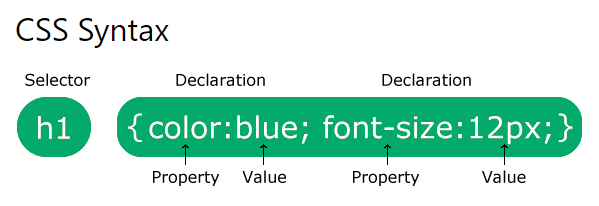

# 목차
- [목차](#목차)
- [CSS_Syntax.md](#css_syntaxmd)
  - [contents](#contents)
  - [CSS syntax](#css-syntax)
    - [Selector (선택자)](#selector-선택자)
    - [Declaration block (선언 블록)](#declaration-block-선언-블록)
    - [property (속성)](#property-속성)

<small><i><a href='http://ecotrust-canada.github.io/markdown-toc/'>Table of contents generated with markdown-toc</a></i></small>


>> based on W3Cschool - CSS(https://www.w3schools.com/css/default.asp), MDN Web Docs - CSS(https://developer.mozilla.org/ko/docs/Web/CSS)

# CSS_Syntax.md
## contents
    - Selector  선택자
    - Declaration block  선언문
      - Property  속성
      - Value  (속성)값

## CSS syntax
* selector와 선언문으로 구성되는 css 규칙(문법)



### Selector (선택자)
* 선택자는 스타일을 지정하기 원하는 HTML 요소를 가리킴.
### Declaration block (선언 블록)
* {}안의 요소
* 1개 또는 여러 개의 선언문을 포함
* 각각의 선언문은 ;세미콜론으로 구분된다.
* ex) 
    ```css
    {color:black; background-color:white;}
    ```
### property (속성)
* 스타일을 정할 속성 의미
* 각각의 선언문은 CSS property 이름과 값을 포함
* ,콜론으로 구분
* ex) color, background-color
