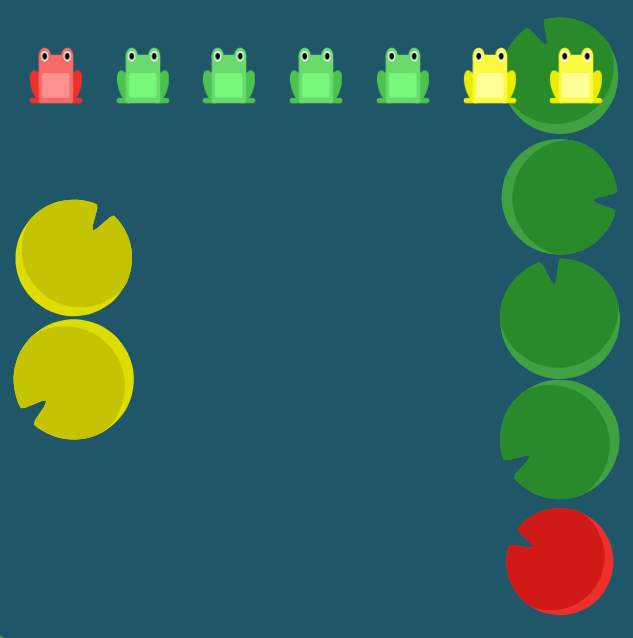
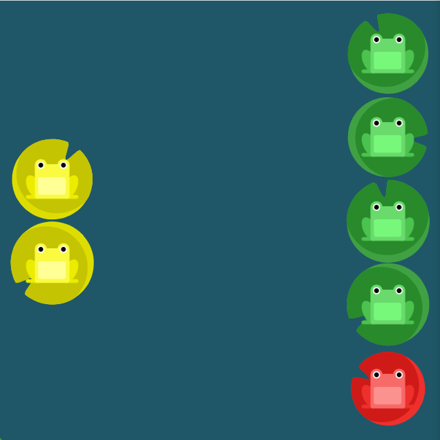

# 목차
- [목차](#목차)
- [CSS display:flex property](#css-displayflex-property)
  - [justify-content](#justify-content)
  - [align-items](#align-items)
  - [flex-direction](#flex-direction)
  - [order](#order)
  - [align-self](#align-self)
  - [flex-wrap](#flex-wrap)
  - [flex-flow](#flex-flow)
  - [align-content](#align-content)
    - [align-content와 align-items](#align-content와-align-items)
- [flexbox froggy 24 단계](#flexbox-froggy-24-단계)

<small><i><a href='http://ecotrust-canada.github.io/markdown-toc/'>Table of contents generated with markdown-toc</a></i></small>


>> display:flex 실습게임사이트 (flexboxfroggy.com)

# CSS display:flex property 
```css
selector {
    display : flex;
    property : value;
}
```

## justify-content 
flex요소 **가로선상 정렬**

* flex-start(defalut)
  * 왼쪽 정렬 (스타트라인을 향해 압축)
* flex-end
  * 오른쪽 정렬 (끝선으로 포장)
* center
  * 가운데 정렬 (라인을 따라 중앙에 배치)
* space-between
  * 요소들 사이에 동일한 간격을 둠
* space-around
  * 요소들 사이에 동일한 간격을 둠
* space-evenly
  * 두 요소 사이, 첫 요소 앞, 마지막 요소 간격 동일

## align-items
flex요소 **세로선상 정렬**

* flex-start
  * 위로 정렬
* flex-end
  * 아래로 정렬
* center 
  * 세로선상의 가운데로 정렬
* baseline
  * 시작 위치에 정렬
* stretch(defalut)
  * 컨테이너에 맞도록 늘립니다.

## flex-direction
flex요소의 **정렬할 방향**을 지정
* row(defalut)
  * 텍스트 방향과 동일하게 정렬
* row-reverse
  * 텍스트 방향의 반대로 정렬
* column
  * 위에서 아래로 정렬
* column-reverse
  * 아래에서 위로 정렬

## order
flex요소의 **순서**를 지정
```css
<integer> (... -1, 0 (default), 1, ...)
```
- ```<integer>```만큼 순서 바꿈 
  - ex) order : 1  >> 오른쪽 1번째 요소와 위치 바꿈, 
  - ex2) order : -3  >> 왼쪽3번째 요소와 위치 바꿈.

## align-self
**지정**된 align-items값을 **무시**하고 flex요소를 **세로선상에서 정렬**
* flex-start
  * 위로 정렬
* flex-end
  * 아래로 정렬
* center 
  * 세로선상의 가운데로 정렬
* baseline
  * 시작 위치에 정렬
* stretch
  * 컨테이너에 맞도록 늘립니다.

## flex-wrap
flex요소들을 **한 줄 또는 여러 줄에 걸쳐 정렬**
* nowrap
  * 한 줄에 정렬
* wrap
  * 여러 줄에 걸쳐 정렬
* wrap-reverse
  * 여러 줄에 걸쳐 반대로 정렬

## flex-flow
**flex-direction 과 flex-wrap**이 자주 같이 사용되기 때문에 두 속성들을 간략히 한 속성
* ex) 
    ```css
    selector {
        display: flex;
        flex-flow:column wrap;
    }
    ```

## align-content
세로선 상에 여분의 공간이 있는 경우 flex 컨테이너 사이의 간격을 조절
* flex-start
  * 여러 줄들을 컨테이너의 꼭대기에 정렬
* flex-end
  * 여러 줄들을 컨테이너의 바닥에 정렬
* center
  * 여러 줄들을 세러손상의 가운데에 정렬
* space-between
  * 여러 줄들 사이에 동일한 간격을 둠
* space-around
  * 여러 줄들 주위에 동일한 간격을 둠
* stretch(defalut)
  * 여러 줄들을 컨테이너에 맞도록 늘림

### align-content와 align-items
* align-content는 **여러 줄들** 사이의 간격을 지정하며, align-items는 컨테이너 안에서 어떻게 **모든 요소**가 정렬하는지를 지정.
* 한 줄만 있는 경우, align-content는 효과를 보이지 않는다.

# flexbox froggy 24 단계

```css
#pond {
    display: flex;
    flex-direction:column-reverse;
    flex-wrap:wrap-reverse;
    align-content:space-between;
    justify-content:center;
}
```
