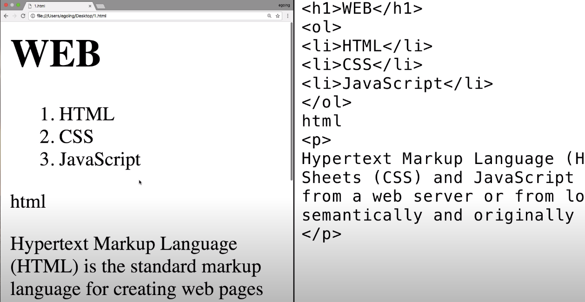

>> 생활코딩 web1 = HTML & Internet 을 학습, 정리한 내용입니다. (https://opentutorials.org/course/3084)

# Web
 **HTML & Internet**

- 
    - 핵심주제 1
    - 핵심주제 2

# 목차
* chapter 1 ~ chapter 35
  1. [소개](#1.소개)
  2. [프로젝트의 동기](#2.프로젝트의%20동기)
  3. 기획
  4. 코딩과 HTML
  5. HTML 코딩 실습 환경 준비
  6. 기본 문법 - 태그
  7. 혁명적인 변화
  8. 통계에 기반한 학습
  9. 줄바꿈 ` ` vs `
`
  10. HTML이 중요한 이유
  11. 최후의 문법 속성과 img
  12. 부모 자식과 목록
  13. 문서의 구조와 슈퍼스타들
  14. HTML 태그의 제왕
  15. 웹사이트 완성
  16. 원시웹
  17. 인터넷을 여는 열쇠 : 서버와 클라이언트
  18. 웹호스팅 (github pages)
  19. 웹서버 운영하기
  20. 웹서버 설치(window, mac, linux)
  21. 웹서버와 http(window, mac, linux)
  22. 웹서버와 웹브라우저의 통신(window, mac, linux)
  23. 수업을 마치며 
  24. 부록 : 코드의 힘
  25. 부록 : 코드의 힘 - 동영상 삽입
  26. 부록 : 코드의 힘 - 댓글 기능 추가
  27. 부록 : 코드의 힘 - 채팅 기능 추가
  28. 부록 : 코드의 힘 - 방문자 분석기
  29. 엔딩 크레딧

# 1. 소개
* 웹, 인터넷, 컴퓨터라는 거대한 세계를 탐험하자
* 탐험 시작전에 스스로를 코딩을 배우는 학생이 아니라 나의 문제를 코딩으로 해결하려는 엔지니어라고 상상하자
* ### **어떤 문제가 우리 삶에서 중요하고 심각할수록 문제로부터 우리를 해방시켜줄 것**  
* 반대로 문제가 우리 삶과 동떨어져 있고 사소하다면 공부자체가 삶의 문제가 되어서 해방시키기는 커녕 억압시킬 것
* ### **공부의 효용을 뇌에게 자주 증명한다면 공부를 좋아할 수 밖에 없다. 자연스럽게 실력도 좋아질 것**
* 지식을 배우는 것도 좋지만 공부와 친해지는 계기가 될 것!

# 2. 프로젝트의 동기
* youtube와 같은 무료 동영상 공유 서비스가 HD화질을 만나면서(작은 글씨도 볼 수 있게) 인터넷을 통해 쉽게 원하는 공부를 할 수 있게 되었다.
* 지금 시대는 오프라인에서 온라인으로 아날로그에서 디지털로 넘어가는 과도기라 볼 수 있다.
* 무궁무진한 인터넷의 자료를 활용해 자신이 직면한 문제를 능동적인 학습을 통해 해결하자!

# 3. 기획
* 우리가 무엇인가를 만들기 전에 무엇을 만들 것인가를 미리 상상하고 계획하고 구체화 하는 과정이 필요하다
  * 만들고 나서 원하는게 아니었거나 문제가 있으면 손해고 여러 사람이 같이 하는 경우에 서로 생각하는 바가 다르면 굉장히 곤란하기 때문
* ### 설계하고 그려보는 과정을 기획이라 한다.(기획자)
## 기획자가 되어 보자
### 코딩수업과 내용을 잘 정리정돈 할 수 있는 웹사이트를 그림으로 한번 그려보자
* 위에 web이라는 글씨는 보여지게 하고
* 왼쪽에는 목록 
* 오른쪽에 제목과 내용(동영상, 글 등)을 표시

# 4. 코딩과 HTML
## HTML 코딩
### 1. 기계와 사람이 하는 일을 분리해보자
### 2. 원인과 결과를 추론해보자

* ### 사람이 하는 일 - 원인(오른쪽)
* ### 기계가 하는 일 - 결과(왼쪽)

## Code, Source, Language
* 사람이 하는 일, 원인을 부르는 여러 가지 표현
  1. code - 부호, 선호
  2. source - 원천
  3. language - 약속

## Application, App, Program, Webpage, Website
* 기계가 하는 일, 결과를 부르는 여러가지 표현
  1. Application - 응용 소프트웨어
  2. App - (모바일)응용 소프트웨어
  3. Program - 프로그램
  4. Webpage - web상 문서
  5. Website - 웹 페이지 집합
### 다 비슷한 용어. 같은 대상을 바라보는 관점에 따라서 조금씩 달라지는 것에 불과

## 프로그래밍
* 코드을 통해서 프로그램을 만드는 것이
프로그래밍의 핵심

## HTML
* 다양한 프로그래밍 언어(코드)가 있다.
  * C, C++, java, javascript, python, php,sql 등등등...
* 이 중 웹 페이지를 만드는 코드가 바로 **HTML**
### Webpage
* 인류가 생산한 거의 모든 디지털 정보가 담기는 가장 거대한 그릇
* 그리고 그 웹페이지를 만드는 언어가 HTML

## HTML의 장점
1. 쉽다
   * 그 어떤 프로그래밍 언어보다도 쉽다.
   * 10분이면 문법을 이해할 수 있다.
2. 중요하다
   * 하루에도 100번이상 보는 웹페이지. 자주 사용하는만큼 HTML은 중요하다.
3. 퍼블릭 도메인

## 퍼블릭 도메인
* 우리가 한국어, 영어를 쓰는데 어떠한 비용도 지불하지 않는다. 
* 웹을 처음 만든 팀 버너스 리가 웹을 어떠한 저작권도 존재하지 않는 완전한 자유를 의미하는 퍼블릭 도메인으로 선언했기 때문
* 따라서 google, mozilla, MS, apple, naver와 같은 회사들이 각자 브라우저를 만들 수 있는 것
* 그리고 한 웹페이지를 여러 브라우저에서 똑같이 볼 수 있게 된 것도 이러한 이유
* 사실 퍼블릭 도메인이라는 거대한 바다 위에 저작권이나 특허는 섬처럼 드물게 존재
* **빨리 가려면 혼자 가고 길게 가려면 같이 가라**
* 웹은 특정 기업이 독점하는 기술만큼 빠르게 발전하진 못했지만 독점하지 않기 때문에 30년이 넘도록 살아남았고 앞으로 수십년은 살아있을 가능성이 매우 높다.

# 5. HTML 코딩 실습 환경 준비
HTML을 이용해서 코딩을 해보자

## 실습에 필요한 것
1. 웹 브라우저
2. 에디터 - 코드를 작성하는 프로그램

### 에디터
* 컴퓨터에는 기본 에디터가 내장되어 있다.
  * window-메모장
  * mac-TextEdit
  * linux-gedit
* 에디터마다 사용법이 다르고 코드를 작성하는 것에 최적화된 에디터가 아니다.
* 그래서 코드 작성용 전문적인 에디터를 사용하자.
* Atom, VScode 등
### 검색) best HTML Editor 2021

> 출처 : [best HTML Editor 2021](https://careerkarma.com/blog/best-html-editors/)

### 에디터를 다운받고 에디터에서 작업공간(workspace)으로 사용할 폴더를 만들고 파일을 에디터에서 작성해보자.

# 6. 기본 문법 - 태그

# 7. 혁명적인 변화

# 8. 통계에 기반한 학습

# 9. 줄바꿈 ` ` vs `
`

# 10. HTML이 중요한 이유

# 11. 최후의 문법 속성과 img

# 12. 부모 자식과 목록

# 13. 문서의 구조와 슈퍼스타들

# 14. HTML 태그의 제왕

# 15. 웹사이트 완성

# 16. 원시웹

# 17. 인터넷을 여는 열쇠 : 서버와 클라이언트

# 18. 웹호스팅 (github pages)

# 19. 웹서버 운영하기

# 20. 웹서버 설치(window, mac, linux)

# 21. 웹서버와 http(window, mac, linux)

# 22. 웹서버와 웹브라우저의 통신(window, mac, linux)

# 23. 수업을 마치며 

# 24. 부록 : 코드의 힘

# 25. 부록 : 코드의 힘 - 동영상 삽입

# 26. 부록 : 코드의 힘 - 댓글 기능 추가

# 27. 부록 : 코드의 힘 - 채팅 기능 추가

# 28. 부록 : 코드의 힘 - 방문자 분석기

# 29. 엔딩 크레딧

0310 
[강의] - <생활코딩> html 강의

html은 우리가 가장 많이 쓰는 기술 중 하나인 웹페이지를 만드는 언어.
27년간 살아남았고 27년간 살아남을 가능성이 매우 큰 언어.
10분이면 문법공부가능한 가장 쉬운 언어

tag 문법
<strong> 강조
<u> 밑줄(underline)
<h1> ~ <h6> 제목
 등등.

태그라는 기초적인 지식만 배워도 1분안에 필요한 태그를 검색하면 된다
tag 150개 있음. 평균적으로 한 웹페이지에 25~40개 정도 쓰임 >그정도만 ok
tag 빈도수 순위 head body title meta div a script link img p span li ul br style h1 h2 input form strong h3 table tr td

ctrl 커서(윈도우) >> 다중커서

[검색어] best html editor 2021 (atom 에디터 난 노트패드++)
w3c w3c school website.
unsplash(무료사진)

[실습]
<h1>How to learn programming</h1> 
<ol>
What is <strong>programming</strong>?
What is <strong>computer language</strong>?
Which language should I learn?
What <u>order</u> should I learn?
</ol>

x

2021년 3월 12일 금요일
오후 2:07

0312
index.html (내컴) WEB browser (visitor) Web server/index.html(github<서버>)

Apache 1등자리 한번도 안뻇긴 제왕
How to install apache http server in os/mac/rinux
Wamp = windows apache mysql php 다운로드.
Wampstack apache 
C:\Bitnami\wampstack-8.0.3-0\apache2\htdocs
Htdocs : hypertextdocuments(webpage 저장된 곳)

주소를 입력해서 웹페이지 열기 vs 파일 불러오기로 웹페이지 열기 
>>웹 브라우저와 웹서버가 같은 컴퓨터에 있기 때문에 보여지는것은 같지만 
사실 둘은 너무나도 다르다.
1.
http://127.0.0.1/index.html
>> web browser가 web server에게 요청 
web server가 index.html 파일을 열어서
web browser에게 전송
http: hyper text transfer protocol. 웹페이지 전송 약속.  웹브라우저와 웹서버가 서로 통신할때
사용하는 규약. 

2.
file:///C:/Bitnami/wampstack-8.0.3-0/apache2/htdocs/index.html
>> web browser가 직접 파일을 열어서 보여줌. 
Web server 관여 x

웹브라우저가 웹서버에 요청을할때는 ip주소가 필요하다. 
웹브라우저의 주소창에 
Localhost=127.0.0.1= 자기자신을 의미. 모든 컴퓨터 공통.
자신의 아이피주소확인 >> 네트워크 공유센터 192.168.31.164

apachi server port 번호 확인 configure 버튼 또는 conf파일에서 확인가능

부록

2021년 3월 12일 금요일
오후 5:55

1 동영상 추가 iframe(유투브에서 embed(퍼가기)

2 댓글기능 추가 - 1)disqus, livere
//자신이 댓글기능 개발 가능.
