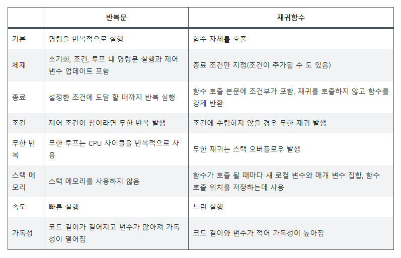
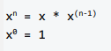
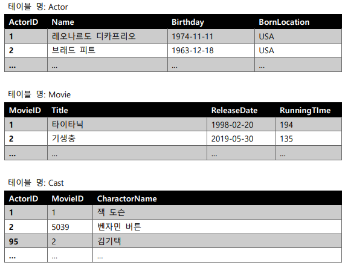

# 1. Iterator, functional parameter 응용 코드 작성
## 참고 기초 이론
### Iterable
* Iterable 객체 - 반복 가능한 객체
* Iterable한 타입 - list, dict, set, str, bytes, tuple, range
* for-in문, zip(), map() 함수에서 iterable을 argument로 받는 것으로 정의되어 있다.(sequence 작업 특화)
### Iterator
* Iterator 객체 - 값을 차례대로 꺼낼 수 있는 객체
* Iterator는 Iterable한 객체를 내장함수 또는 Iterable 객체의 메소드로 객체를 생성 가능
* next() 메소드로 데이터를 순차적으로 호출하는 객체. 만약 next()로 다음 데이터를 불러 올 수 없을 경우(가장 마지막 데이터인 경우) StopIteration exception을 발생시킨다.
* iterable이라고 해서 꼭 iterator는 아니다.
* iterable을 iterator로 변환하고 싶다면, `iter()`라는 내장함수를 사용한다.
* for문으로 iterable한 객체를 looping하면 python내부에서 임시로 list를 iterator로 자동 변환하는 과정이 있다.
#### 참고 자료
https://docs.python.org/2/glossary.html#term-iterable  
https://docs.python.org/2/glossary.html#term-iteratr  
https://docs.python.org/2/library/functions.html#itr

## 1번 파이썬 예시 문제 (3)
## 1-1. a ~ b 모든 정수 더하기
```py
def solution(a, b):
    sum = 0
    for i in range(a, b):
        sum = sum + i
        
    return sum
```
## 1-2. a ~ b 모든 정수 곱하기
```py
def solution(a, b):
    mul = 1
    for i in range(a, b+1):
        mul = mul * i
        
    return mul
```
## 1-3. n개의 무작위 정수를 모두 곱하거나 더하기
```py
import random
import sys

def solution(n):
    max = sys.maxsize
    min = -sys.maxsize -1
    
    sum = 0
    mul = 1
    
    for i in range(n) :
        ran = random.randrange(min, max)
        sum = sum + ran
        mul = mul * ran
        li = [sum, mul]
    
    answer = random.choice(li)    
    return answer
```


# 2. Stack Variable(지역변수)
무엇이고 어떻게 생성되고 소멸되는지 Activation Record Instance(활성화 레코드 인스턴스)와 연관지어 설명
```
Stack Variable, 즉 지역 변수는 함수 영역에서 선언된 변수로 해당 함수에서만 사용할 수 있다.
선언과 동시에 스택 프레임이라고도 불리는 활성화 레코드에 저장된다.(운영체제가 함수를 호출하는 순간 함수의 활성화레코드가 생성된다. )
함수가 종료되면서 메모리에서 사라진다.
```
## 언어별 지역 변수
1. C언어 - 중괄호(블록)안
2. java - 메소드 안

메인 함수 역시 프로그램을 실행하기 위해 운영체제가 호출하는 일종의 지역함수
## 활성화 레코드
>https://m.blog.naver.com/PostView.naver?isHttpsRedirect=true&blogId=swryu02&logNo=220696545412

스택에 저장되는 것으로 스택 프레임이라고도 한다.
활성화 레코드는 컨텍스트 스위칭을 하기전 함수 상태를 기록하고 복원하기 위한 것으로 해당 함수의 리턴 값, 값, 파라미터, 지역 변수, 귀환 주소 등의 정보가 기록된다.
활성화 레코드는 대략 네 부분으로 나누어 볼 수 있다.  
   - 반환 값(Return Value): 피호출 함수가 호출 함수에게 반환하는 값.
   - 값 파라미터(Value Parameter): 호출 함수가 피호출 함수에게 넘기고자 하는 값. 
   - 반환 주소(Return Address): 함수가 호출된 곳의 다음 주소. 운영체제 프로그램의 번지수 200번지에 있는 명령문에서 메인함수를 불렀다면,  메인 함수 수행이 끝난 다음에는 다시 운영체제 프로그램의 바로 다음 명령문(예를 들어, 명령문 길이가 4 바이트라면 204번지)을  수행해야 하기 때문에 여기에 204를 기록한다.
   - 지역 변수(Local Variables): 함수 내에서 선언된 지역변수를 저장하는 곳.

### 메모리와 활성화 레코드
프로그램을 실행할 때 메모리는 두개의 섹션으로 나뉘는데 기계어 코드가 들어있는 코드 섹션과 데이터가 들어있는 데이터 섹션이다.

코드 섹션은 프로그램 실행을 위해 읽을 수만 있는 부분이다.
데이터 섹션은 다시 전역 메모리, 스택 메모리, 힙 메모리로 나뉘는데 프로그램 내에서 데이터가 어떻게 선언되어 있느냐에 따라 컴파일러는 이들 3개 중 한 가지 메모리를 할당하게 된다. 이 중 스택에 활성화 레코드가 생성되는데 지역변수도 이 공간에 저장된다.


# 3. C언어 함수 코드 문제
틀린 이유와 고치는 방법 설명, 활성화 레코드 인스턴스와 연관지어 동작 원리를 설명
```c
void swap(int x, int y) {
int temp = x, x = y, y = temp;
}
```
* 틀린 이유 : temp변수가 선언이 되기 전에 `y = temp`에서 temp가 사용되었으므로 활성화 레코드 인스턴스에 지역변수 temp가 없어 오류가 난다.
* 고치는 방법 : int temp = x; 로 선언 후 행을 바꿔 temp를 사용하게끔 코드를 수정한다.
    ```c
    void swap(int x, int y) {
    int temp = x;
    x = y;
    y = temp;
    }
    ```
* 동작 원리 : C언어에서 콤마 연산자의 경우 2번째 연산을 수행해 결과값을 반환하므로 제시된 코드의 경우 temp의 선언보다 temp의 사용이 먼저 있어 ARI오류가 발생한다.

### 활성화 레코드(activation record) 구조
- 부 프로그램의 비코드 부분의 형식, 즉 배치(layout)를 활성화 레코드라 한다. 
왜냐하면 이 부분이 서술하는 데이터는 부프로그램의 활성화, 즉 부 프로그램 실행과 관련이 되기 때문이다. 활성화 레코드의 형식은 정적이다. 활성화 레코드 사례(activation record instance; ARI)는 활성화 레코드의 구체적인 예이며 활성화 레코드 형식에 존재하는 데이터의 모임이다.
 
- 단순 부프로그램의 활성화 레코드
  - 지역 변수
  - 매개 변수
  - 복귀 주소

- 단순 부프로그램은 별도의 두 부분으로 구성된다. 즉 변하지 않는 부프로그램 코드와 부프로그램이 실행되는 동안 변할 수 있는 지역 변수와 위에서 열거한 자료들이다. 단순 부프로그램의 경우 둘 다 고정 크기를 갖는다.

> https://redcarrot.tistory.com/40


# 4. 
정렬(Sorting)은 무엇이고, 이를 수행하는 이유를 설명하세요.
```
항목들을 체계적으로 정리하는 과정으로 순서를 정하고 분류한다는 서로 다른 의미의 특성이 있다. 정렬 알고리즘은 원소들을 일정한 순서대로 열거하는 알고리즘으로 효율적인 정렬을 통해 다른 알고리즘을 최적화할 수 있다. 

주로 정렬을 사용하는 이유는 탐색이다. 컴퓨터가 다루는 데이터는 보통 백만개 단위이기 때문에 데이터베이스의 경우 이론상 무한 개의 데이터를 다룰 수 있어야 한다. 이때 탐색할 데이터가 정렬되어 있지 않다면 순차 탐색 이외에 다른 알고리즘을 사용할 수 없지만 정렬되어 있다면 이진 탐색 알고리즘을 사용할 수 있다. 삽입과 삭제가 자주 일어나는 데이터의 경우 정렬에 시간이 더 많이 들어가기 때문에 순차 탐색을 하는 경우도 있지만 대부분의 경우 데이터를 조회하는 것이 삽입/삭제의 경우보다 많기 때문에 정렬 알고리즘이 필요하다. 

이미 정렬된 데이터는 임의이 값을 지정하였을때 해당 값의 오른쪽에 더 크거나 같은 값이 차례대로 위치한다는 특징을 보인다. 따라서 찾고자 하는 값보다 임의의 값이 더 크면 오른쪽만 찾아보면 되는 것이다. 이 임의의 값을 후보군 가운데로 설정하는 탐색 알고리즘이 이진 탐색 알고리즘이다.

이진 탐색 알고리즘은 최악의 경우라도 log n 의 성능을 보인다. 예를 들어 약 43억 개의 정렬된 데이터에서 어떤 값을 찾아야 할 때 최악의 비교 횟수는 겨우 32회이다. 33회 비교시에는 약 86억 개의 자료를 탐색할 수 있다. 

더 발전된 알고리즘으로 비례 탐색 알고리즘이 있다. 찾는 값이 후보군의 최솟값과 최댓값 사이의 몇 % 위치에 있는지 계산하는 알고리즘으로 더 적은 횟수의 비교로 원하는 값을 찾아낼 수 있다.

정렬을 하는 이유가 바로 이렇게 이진 탐색 또는 비례 탐색 알고리즘과 같은 탐색에 필요한 정렬 데이터를 갖추기 위해서 이다.
```
> https://ko.wikipedia.org/wiki/%EC%A0%95%EB%A0%AC_%EC%95%8C%EA%B3%A0%EB%A6%AC%EC%A6%98  
> https://namu.wiki/w/%EC%A0%95%EB%A0%AC%20%EC%95%8C%EA%B3%A0%EB%A6%AC%EC%A6%98


# 5. 재귀
문제 : Recursion(재귀)을 사용하여 정의된 함수를 for, while과 같은 반복(iteration) 제어로 변환하고
자 합니다. 아래의 질문에 답하세요

* 참고 : 재귀는 자기 자신을 참조하는 방식을 의미한다. 자기언급과도 관련되고 언어학 논리학 등 다양한 분야에서 연구되며 컴퓨터 과학과 수학에서 재귀는 함수가 자신의 정의에 의해 정의될 때의 개념을 의미한다.
재귀함수의 경우  종료 조건이 꼭 필요하다. 재귀함수는 컴퓨터에서 스택 자료구조를 사용하기 때문에 함수를 계속 호출했을 경우 가장 마지막에 호출한 함수가 먼저 끝나야(LIFO구조) 앞의 함수 호출이 종료되기 때문이다. 따라서 무한 루프에 빠지지 않도록 종료 조건이 필수적이다.



> https://libertegrace.tistory.com/entry/9-Algorithms-Recursive-Function  
> https://namu.wiki/w/%EC%9E%AC%EA%B7%80%ED%95%A8%EC%88%98

## 5-1. 필요한 자료구조는 무엇이고 왜 필요한가
```
for와 while 반복문 과 같은 반복문들은 반복 제어 구조라고도 할 수 있다. 반복 제어 구조에는 초기화 조건, 증가 조건이 필요하며 다양한 변수들을 선언하여 루프 내의 명령문을 반복적으로 사용하게 된다. 스택에 함수를 반복적으로 호출하는 재귀와 달리 스택을 사용하지 않고 메모리에 변수를 저장하고 반복문 실행 도중 필요한 데이터들을 저장하는 방식이기 때문이다.
```
## 5-2. 재귀를 반복으로 변환하면 얻게 되는 장점
```
재귀를 사용하면 코드는 간결해지지만 스택 메모리에 반복적으로 자기 자신을 부르면서 저장하기 때문에 성능이 확연히 느리다. 또한 호출 횟수가 많아지면 돌아갈 곳의 주소 값을 저장하고 있는 스택이 넘쳐 프로그램이 강제 종료될 가능성이 있는데 비재귀 함수로 변환하면 시스템 다운의 우려가 없다. 따라서 프로그래밍 최종단계에서 비재귀 함수로 변환한다.(꼬리재귀 최적화도 있다.)
```
>http://wiki.gurubee.net/pages/viewpage.action?pageId=1507916  
>https://www.bsidesoft.com/4314

## 5-3. 계산 절차를 재귀로 작성하면 얻을 수 있는 장점
```
재귀함수 등의 함수형 사고를 통해 프로그래밍하면 함수를 최대한 단순하고 불변적으로 유지할 수 있다. 따라서 코드가 간결해지고 훨씬 더 이해하기 쉬운 경우가 있다. 

예를 들어 xml이나 json을 파싱한다거나 퀵 정렬을 만든다면 반복문보다 재귀를 쓰는 것이 더 쉽다. 이런 알고리즘을 반복문으로만 처리하려면 스택을 따로 구현해야 한다.
```


# 6. 
주어진 숫자 x를 구하는 지수 함수의 정의가 아래와 같을 때 시간 복잡도는 O(n)입니다. 시간
복잡도를 O(log n)으로 줄일 수 있도록 지수 함수를 정의하세요



```
log _{x}n = log _{x}1 * log _{x}(n-1)
```

## 지수함수와 로그함수
### 지수함수
* 지수함수는 거듭제곱의 지수를 변수로하고 정의역을 실수 전체로 정의하는 초월함수. 
* 로그함수의 역함수.
* 정의 : y = a^x 
  * 예시 : f(x) = 2^x
  * a^0 = 1
  * a^(p+q) = a^p * a^q
* 로그함수의 역함수로서의 정의
### 로그함수
* 지수함수의 역함수
* 어떤 수를 나타내기 위해 고정된 밑을 몇 번 곱하여야 하는지 나타낸다.
* 복잡한 단위의 계산을 간편하게 계산할 수 있다
* 지수함수적 정의
  * a > 0, a!=1이고, y>0 일 때, x,y 사이에 y=a^x라는 관계가 있으면 x는 a를 밑으로 하는 y의 로그”라 하고 log _{a}y=x로 표기한다.
  * 예시 : 3^{4}=81이므로 log _{3}81=4


# 7. 
아래 코드에서 함수 식이 드러내는 T는 어떤 자료 구조인지 이유는 무엇인지 설명
```
g(f(a, f(b, f(c, t)))) = a {여기서, a b c 는 문자이며, t 는 T 형 자료 구조}
```

# 8. 
교과 과정을 선수 과목 관계에 따라 정렬하고자 합니다. 어떤 정렬 방법이 적합한지를 설명하
고, 정렬 대상이 되는 데이터의 어떠한 특성을 고려한 것인지 설명하세요.

---
# System Programming
# 9. 
어떤 명령의 수행 결과로 stdout, stderr 등의 표준 파일 스트림이 출력되는 경우, 이를 모두
사라지게 만드는 Bash 스크립트 mute를 작성하세요. 아래의 명령 실행 결과는 작성할 스크립
트 mute의 동작 예시를 보여줍니다.
```
$ echo hello
hello
$ ./mute echo hello
$
```
# 10. 
다음은 폴더 이름을 인자로 받아서 cd(change directory)를 수행하는 쉘 스크립트 cdls입니다.
이 스크립트를 실행했을 때 폴더가 바뀌지 않는 이유를 설명하세요.
```
#!/bin/sh
cd "$1" && ls
```
```
$ mkdir folder && cd folder && touch in_folder && cd ..
$ cdls folder
in_folder
$ ls
folder
```
# 11. 
다음 중 교착(Deadlock)을 일으키는 필수 조건이 아닌 것을 선택하고, 그 이유를 설명하세요.
   * A. Mutual Exclusion (상호 배제)
   * B. Hold-and-wait (점유 대기)
   * C. Circular-waiting (순환 대기)
   * D. Preemption (선점)
# 12. 
Orphan Process와 Zombie Process의 차이에 대해 설명하세요.

---
# Database System
# 13. 
데이터베이스 시스템에서, Schema(스키마)가 무엇인지 설명하고, 스키마가 필요한 이유와 스
키마가 필요하지 않은 이유에 대해 설명하세요.
# 14. 
데이터베이스의 속도 향상을 위해 제공되는 여러 기술 중에서, Index(인덱스)를 이용한 속도
향상 기법에 대해 설명하고 Query Optimizer(쿼리 최적화기)의 역할과 동작 방식에 대해 설명
하세요.
# 15. 
관계형 데이터베이스 모델링에서, Normalization(정규화)를 제대로 수행하지 않았을 시 발생할
수 있는 문제를 1차 정규형, 2차 정규형, 3차 정규형에서의 예를 들어 설명하세요.
# 16. 
관계형 데이터베이스에 아래와 같은 세 테이블이 있고, 테이블 외에 어떠한 개체(키, 인덱스
등)도 생성하지 않았다고 가정할 때,



아래 쿼리는 브래드 피트가 출연한 모든 영화를 반환할 목적으로 작성되었지만 제대로 동작
하지 않습니다.
```sql
SELECT Movie.MovieID, Title, ReleaseDate, RunningTime, CharacterName
FROM Movie, Cast, Actor
WHERE
Movie.MovieID = Cast.MovieID AND
Actor.Name = '브래드 피트';
```
위 쿼리를 브래드 피트가 출연한 모든 영화를 반환하도록 수정하고, 데이터 무결성을 위해 추
가해야 해야 할 개체와 속도 향상을 위해 추가해야 할 개체에 대해 설명하세요.

---
# Advanced Programming
# 17. 
Java 프로그래밍 언어에서, int와 Integer의 차이에 대해 설명하세요.
# 18. 
Interface(인터페이스)와 Abstract Class(추상 클래스)에 대해 설명하고, Abstract Class(추상 클래
스)를 사용해야 하는 경우와 Interface(인터페이스)를 사용해야 하는 경우에 대해 설명하세요.
# 19. 
다음 코드에서 사용된 디자인 패턴의 이름은 무엇이며, 해당 디자인 패턴의 특징과 사용하는
이유에 대해 설명하세요.
```
public class DateService {
 private static DateService dateService = null;
 private DateService() {}
 public static DateService getInstance() {
 if (dateService == null) {
 dateService = new DateService();
 }
 return dateService;
 }
}
```
# 20. 
Java 프로그래밍 언어에서 try / catch / finally와 try-with-resource가 하는 일과 차이점에 대해
설명하세요.