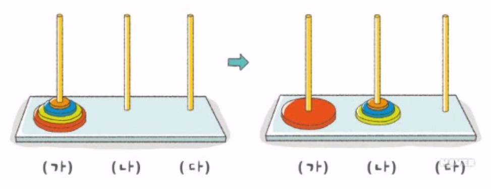

> 프로그래머스 - '자료구조와 알고리즘' 강의를 학습, 정리하였습니다.(https://programmers.co.kr/learn/courses/57)
 
# Programmers basic lecture 
Data structure and algorithm with python3

# 3.재귀
- [Programmers basic lecture](#programmers-basic-lecture)
- [3.재귀](#3재귀)
- [파트4. 재귀 알고리즘(Recursive Algorithms) 기초](#파트4-재귀-알고리즘recursive-algorithms-기초)
  - [재귀함수(recursive functions)란](#재귀함수recursive-functions란)
    - [예시 1 - 이진트리 (binary trees)](#예시-1---이진트리-binary-trees)
    - [예시 2 - 자연수의 합 구하기](#예시-2---자연수의-합-구하기)
    - [코드1](#코드1)
    - [코드2](#코드2)
  - [재귀함수의 종결 조건](#재귀함수의-종결-조건)
    - [일반적인 재귀함수의 종결 조건](#일반적인-재귀함수의-종결-조건)
  - [재귀 알고리즘의 효율](#재귀-알고리즘의-효율)
    - [결론](#결론)
  - [극단적인 예시](#극단적인-예시)
    - [결론](#결론-1)
  - [재귀 알고리즘 추가 예제](#재귀-알고리즘-추가-예제)
    - [결론](#결론-2)
  - [실습: 피보나치 순열 구현하기](#실습-피보나치-순열-구현하기)
    - [문제 설명](#문제-설명)
    - [풀이](#풀이)
- [파트5. 재귀 알고리즘(Recursive Algorithms) 응용](#파트5-재귀-알고리즘recursive-algorithms-응용)
  - [조합의 수 계산](#조합의-수-계산)
    - [문제 : n개의 서로 다른 원소에서 m개를 택하는 경우의 수](#문제--n개의-서로-다른-원소에서-m개를-택하는-경우의-수)
  - [재귀 알고리즘의 유용성](#재귀-알고리즘의-유용성)
    - [문제 : 하노이의 탑](#문제--하노이의-탑)
  - [재귀 알고리즘의 비효율성](#재귀-알고리즘의-비효율성)
    - [피보나치 수열의 구현](#피보나치-수열의-구현)
    - [피보나치 수열의 함수 호출](#피보나치-수열의-함수-호출)
  - [실습: 재귀적 이진 탐색 구현하기](#실습-재귀적-이진-탐색-구현하기)
    - [문제 설명](#문제-설명-1)
    - [풀이 1](#풀이-1)

<small><i><a href='http://ecotrust-canada.github.io/markdown-toc/'>Table of contents generated with markdown-toc</a></i></small>


# 파트4. 재귀 알고리즘(Recursive Algorithms) 기초
## 재귀함수(recursive functions)란
* 하나의 함수에서 ***자신을 다시 호출***하여 작업을 수행하는 것
* 생각보다 많은 종류의 문제가 재귀적으로 해결 가능
### 예시 1 - 이진트리 (binary trees)
* 12라는 노드, 왼쪽 서버트리의 원소들은 모두 작거나 같을 것, 오른쪽 서브트리의 원소들은 모두 클 것
* 위 원칙을 모든 노드에 적용, 즉 재귀적으로 적용
* 트리 탐색 : (이진 탐색과 비슷) 10을 찾아라 - 12 > 10 - 9 < 10

### 예시 2 - 자연수의 합 구하기
* 1부터 n까지 모든 자연수의 합을 구하시오
  * 1부터 n-1까지의 합 + n로 나눌 수 있다.
  * 위의 논리 반복 > 재귀
### 코드1
```py
def sum(n)
    return n + sum(n - 1)

a = int(intput("Number:"))
print(sum(a))
```
* RecursionError: maximum recursion depth exceeded라는 에러가 뜬다
* 입력한 수에서 -1씩 996번의 반복을 거친 후 종료되었다.
* n의 범위를 지정해주자
### 코드2
```py
def sum(n):
    print(n) # 각각의 재귀 확인
    if n <= 1:
        return n
    else:
        return n + sum(n - 1)

a = int(input("Number:"))
print(sum(a)) # 답 출력
```
```
3
2
1
6
```
* 3을 입력해 주었더니 3, 2, 1 이렇게 3번의 재귀가 이뤄짐을 알 수 있었고 3+2+1인 6이라는 답이 정확하게 출력되었다.
* if-else문 대신 sum(1)=1이라는 수식을 추가해도 된다.

## 재귀함수의 종결 조건
* 재귀함수를 호출할 때는 종결조건이 중요하다
* '기저사례', '탈출조건'이라고도 부른다
### 일반적인 재귀함수의 종결 조건
```py
def sum(n)
    if n ... :
        ...
    else :
        ...
        sum(...)
```
* 알고리즘은 유한한 시간내에 답을 찾아야 하므로 알고리즘의 종결조건에 반드시 필요
## 재귀 알고리즘의 효율
* 모든 재귀 알고리즘은 대칭이 되는 반복적인 알고리즘을 가지고 있다. ( Recursive vs Iterative )
* 예시 - 1부터 n까지 자연수의 합
  1. Recursive version (재귀적인 버전)
      ```py
      def sum(n)
          if n <= 1 :
              return n
          else :
              return n + sum(n-1)
      ```
  2. Iterative version (반복적인 버전)
      ```py
      def sum(n)
          s = 0
          while n >= 0:
              s += n
              n -= 1
          return s
      ```
* 복잡도는 n에 비례하여 반복함으로 O(n)으로 같다.
* 하지만 효율성의 측면에서 보면
  * Recursive version은 함수를 호출하고 return하는데 드는 부가적인 작업이 필요하기 때문에 효율성은 떨어진다.
### 결론
***재귀 함수는 사람이 생각하는 알고리즘을 표현하기에 유리한 면도 있지만 효율적인 측면에서 조심해야할 부분이 분명히 있다.***
## 극단적인 예시
1부터 n까지 자연수의 합을 구하는 공식을 활용하는 알고리즘
```py
def sum(n):
return n * (n + 1) // 2
```
* 복잡도는 O(1)로 상수시간에 실행
* 효율성뿐 아니라 복잡도 측면에서도 더 좋은 알고리즘
### 결론
***즉 복잡도와 효율성 모두 주의를 기울여서 재귀 함수를 사용해야 한다.***
## 재귀 알고리즘 추가 예제
```py
def what(n):
    if n <= 1:
        return 1
    else:
        return n * what(n-1)
```
* 위 함수는 1부터 n까지의 곱을 구하는 함수, 즉 $n!$을 구한다
### 결론
***직관적으로 이미 알고 있는 함수를 구현하는데 재귀함수는 굉장히 쓸모가 있다.***

## 실습: 피보나치 순열 구현하기
### 문제 설명
인자로 0 또는 양의 정수인 x 가 주어질 때, Fibonacci 순열의 해당 값을 구하여 반환하는 함수 solution() 을 완성하세요.

Fibonacci 순열은 아래와 같이 정의됩니다.
F0 = 0
F1 = 1
Fn = Fn - 1 + Fn - 2, n >= 2

재귀함수 작성 연습을 의도한 것이므로, 재귀적 방법으로도 프로그래밍해 보고, 반복적 방법으로도 프로그래밍해 보시기 바랍니다.
### 풀이
1. 재귀적 방법
```py
def solution(x):    
    # Recursive
    if x == 0:
        return 0
    elif x == 1:
        return 1
    else:
        return solution(x-1) + solution(x-2)
```
2. 반복적 방법
  * while문
    ```py
    def solution(x):
        a, b = 0, 1
        while x > 0:
            x -= 1
            a, b = b, a+b    
        return a
    ```
  * for in range문
    ```py
    def solution(x):
        a, b = 0, 1
        if x == 0:
            return a
        for i in range(x-1):
            a, b = b, a+b    
        return b
    ```
* 그밖에도 동적계획법을 활용하거나 파이썬의 동작방식을 활용하거나 행렬 곱셈을 활용한 풀이 법이 있다.
* >> 참고 : [피보나치 수열 알고리즘을 해결하는 5가지 방법](https://shoark7.github.io/programming/algorithm/%ED%94%BC%EB%B3%B4%EB%82%98%EC%B9%98-%EC%95%8C%EA%B3%A0%EB%A6%AC%EC%A6%98%EC%9D%84-%ED%95%B4%EA%B2%B0%ED%95%98%EB%8A%94-5%EA%B0%80%EC%A7%80-%EB%B0%A9%EB%B2%95)
* >> 참고 : [python docs :  defining-functions](https://docs.python.org/3/tutorial/controlflow.html#defining-functions)

# 파트5. 재귀 알고리즘(Recursive Algorithms) 응용
## 조합의 수 계산
### 문제 : n개의 서로 다른 원소에서 m개를 택하는 경우의 수
$(n, m) = n!/m!(n-m)!$
* from math import factorial as f
    ```py
    def combi(n,m):
        return f(n)/(f(m) * f(n-m))
    ```
* 재귀적 방법
    * $(n, m) = (n-1, m)+(n-1,m-1)$
    * 특정한 하나의 원소 입장에서 볼 때,
    * $(n-1,m-1)$원소를 포함하는 경우와
    * 그렇지 않은 경우를 따로 계산해서 더한다.
    ```py
    def combi(n,m):
        return combi(n-1, m) + combi(n-1, m-1)
    ```
      * trivial case를 고려하지 않은 경우
    * 올바른 재귀적 방법
    ```py
    def combi(n,m):
        if n == m:
            return 1
        elif m == 0:
            return 1
        else:
            return combi(n-1, m) + combi(n-1, m-1)
    ```
    * 효율성 측면에서 여러 번의 함수 호출이 n이 커지면 상당히 비효율적.
    * 차라리 loop, 즉 반복적 방법을 사용하는 것이 더 빠르다.
## 재귀 알고리즘의 유용성
* 사람이 생각하는 방식을 그대로 코드로 옮길 수 있기 때문에 쓸모 있는 경우도 많다.
### 문제 : 하노이의 탑

* '가', '나', '다' 세 개의 기둥이 있고 '가' 기둥에 크기가 서로 다른 n개의 원반이 꽂혀 있는데 원반의 크기를 순서대로 전부 다른 기둥으로 옮기는 방법
* 가장 큰 원반을 제외한 다른 원반들을 '나'기둥에 옮기고 가장 큰 원반을 '다'원반에 옮긴 뒤 '나'의 원반들을 '다'로 옮기면 된다.

## 재귀 알고리즘의 비효율성
### 피보나치 수열의 구현

### 피보나치 수열의 함수 호출

* 재귀적인 방법은 확실히 컴퓨터 성능 상으로 비효율적인 모습을 보여준다.
* 각각의 방법으로 짠 코드의 실행 시간을 구해보면 n=40일 때 실행시간이 0초/40초정도로 엄청난 차이를 보인다.

## 실습: 재귀적 이진 탐색 구현하기
### 문제 설명
리스트 L 과, 그 안에서 찾으려 하는 원소 x 가 인자로 주어지고, 또한 탐색의 대상이 되는 리스트 내에서의 범위 인덱스가 l 부터 u 까지로 (인자로) 정해질 때, x 와 같은 값을 가지는 원소의 인덱스를 리턴하는 함수 solution() 을 완성하세요. 만약 리스트 L 안에 x 와 같은 값을 가지는 원소가 존재하지 않는 경우에는 -1 을 리턴합니다. 리스트 L 은 자연수 원소들로 이루어져 있으며, 크기 순으로 정렬되어 있다고 가정합니다. 또한, 동일한 원소는 두 번 이상 나타나지 않습니다.

인덱스 범위를 나타내는 l 과 u 가 인자로 주어지는 이유는, 이 함수를 재귀적인 방법으로 구현하기 위함입니다. 빈 칸에 알맞은 내용을 채워서 재귀 함수인 solution() 을 완성하세요.
### 풀이 1
* l > u
```py
def solution(L, x, l, u):
    if l > u:  
        return -1
    mid = (l + u) // 2
    if x == L[mid]:
        return mid
    elif x < L[mid]:
        return solution(L, x, l, mid - 1)
    else:
        return solution(L, x, mid + 1, u)
```
* 이진탐색을 재귀적 방법으로 구현한 정석적인 방법이라 할 수 있다.
* `x < L[mid]` 인 경우와 `x > L[mid]`의 경우 u와 l을 각각 mid-1, mid+1로 재귀호출하면 된다.
* 이때 맨위 if문에서 if x not in L을 하게 되면 재귀호출때마다 L리스트를 계속해서 탐색하므로 중복탐색이다(효율성이 떨어져 효율성 테스트 실패)
* 만약 [1,2,3,4]에서 6을 찾는다고 가정하면
  * l == 3, u == 3 일 때는 (즉, 혹시 인덱스 3 의 원소가 찾고자 하는 값인 6 을 가지고 있는지를 검사하는 단계에서) 이 재귀 함수는 solution(L, 6, 3, 3) 으로 호출되었을 것
  * 이 때, mid 의 값을 계산하면 이것 역시 3 
  * 그런데 L[3] == 4 이므로 6 보다 작아서 L9 의 else 절이 수행
  * 그러면 solution(L, 6, 4, 3) 이 호출될 것이고 이 때는 더 이상 리스트 내에서 탐색할 범위가 남아 있지 않으므로 (if l > u 가 참이 되어) -1 을 리턴
  * 이것이 이 재귀함수가 동작하고자 하는 의도된 바