> 프로그래머스 - '자료구조와 알고리즘' 강의를 학습, 정리하였습니다.(https://programmers.co.kr/learn/courses/57)
 
# Programmers basic lecture 
Data structure and algorithm with python3

# 5.연결리스트
- [Programmers basic lecture](#programmers-basic-lecture)
- [5.연결리스트](#5연결리스트)
- [파트7. 연결 리스트(Linked Lists) (1)](#파트7-연결-리스트linked-lists-1)
  - [추상적 자료구조](#추상적-자료구조)
  - [연결리스트](#연결리스트)
  - [기본적 연결리스트](#기본적-연결리스트)
    - [노드](#노드)
    - [알고 있어야 할 정보들](#알고-있어야-할-정보들)
    - [정리](#정리)
  - [연결리스트의 추상적 자료구조 만들기](#연결리스트의-추상적-자료구조-만들기)
  - [실습 : 특정 원소 참조](#실습--특정-원소-참조)
    - [코드](#코드)
  - [배열과 비교한 연결 리스트](#배열과-비교한-연결-리스트)
  - [실습: 연결 리스트 순회 구현하기](#실습-연결-리스트-순회-구현하기)
    - [문제 설명](#문제-설명)
    - [풀이](#풀이)
- [파트8. 연결 리스트(Linked Lists) (2)](#파트8-연결-리스트linked-lists-2)
  - [1. 원소의 삽입](#1-원소의-삽입)
    - [메서드 insertAt](#메서드-insertat)
    - [n번째에 newNode 삽입](#n번째에-newnode-삽입)
    - [newNode 삽입의 과정 3단계](#newnode-삽입의-과정-3단계)
    - [원소 삽입 코드 구현 - 프로토타입](#원소-삽입-코드-구현---프로토타입)
    - [주의사항](#주의사항)
    - [원소 삽입 코드 구현 - 수정본](#원소-삽입-코드-구현---수정본)
    - [원소 삽입 코드 구현 - 완성본](#원소-삽입-코드-구현---완성본)
  - [연결 리스트 원소 삽입의 복잡도](#연결-리스트-원소-삽입의-복잡도)
  - [2. 원소의 삭제](#2-원소의-삭제)
    - [메서드 popAt](#메서드-popat)
    - [n번째 node 삭제 (데이터 추출)](#n번째-node-삭제-데이터-추출)
    - [주의사항](#주의사항-1)
  - [코드](#코드-1)
  - [연결리스트 원소 삭제의 복잡도](#연결리스트-원소-삭제의-복잡도)
  - [연결 리스트 연산 - 두 리스트의 연결](#연결-리스트-연산---두-리스트의-연결)
    - [메서드 `concat`](#메서드-concat)
  - [연결리스트의 장단점](#연결리스트의-장단점)
  - [`linkelist.py` 파일을 통한 연습](#linkelistpy-파일을-통한-연습)
  - [실습: 연결 리스트 노드 삭제하기](#실습-연결-리스트-노드-삭제하기)
    - [문제 설명](#문제-설명-1)
- [파트9. 연결 리스트(Linked Lists) (3)](#파트9-연결-리스트linked-lists-3)
  - [연결리스트들의 응용 예시](#연결리스트들의-응용-예시)
    - [연결리스트의 장점 극대화](#연결리스트의-장점-극대화)
    - [새로운 코드의 필요성](#새로운-코드의-필요성)
  - [새로운 메서드의 정의](#새로운-메서드의-정의)
  - [조금 변형된 연결 리스트](#조금-변형된-연결-리스트)
    - [코드 구현 `linkedlist2.py`](#코드-구현-linkedlist2py)
    - [연산 정의 및 코드 구현](#연산-정의-및-코드-구현)
  - [1. 길이 얻어내기](#1-길이-얻어내기)
  - [2. 리스트 순회](#2-리스트-순회)
    - [`traverse()`](#traverse)
  - [3. 특정 원소 참조(k번째)](#3-특정-원소-참조k번째)
    - [`getAt()`](#getat)
  - [4. 원소 삽입](#4-원소-삽입)
    - [`insertAfter()`](#insertafter)
    - [`insertAt()` - `insertAfter()`를 이용해 구현](#insertat---insertafter를-이용해-구현)
  - [5. 원소 삭제](#5-원소-삭제)
    - [`popAfter()`](#popafter)
    - [주의사항](#주의사항-2)
    - [`popAt()` - `popAfter()`를 이용해 구현](#popat---popafter를-이용해-구현)
  - [6. 두 리스트 합치기](#6-두-리스트-합치기)
    - [`concat()`](#concat)
  - [실습: dummy head 를 가지는 연결 리스트 노드 삭제](#실습-dummy-head-를-가지는-연결-리스트-노드-삭제)
    - [문제 설명](#문제-설명-2)
    - [풀이](#풀이-1)
- [파트10. 양방향 연결 리스트(Doubly Linked Lists)](#파트10-양방향-연결-리스트doubly-linked-lists)
  - [연결리스트가 유용할 때](#연결리스트가-유용할-때)
  - [양방향(이중) 연결 리스트](#양방향이중-연결-리스트)
  - [양방향 연결 리스트 만들려면](#양방향-연결-리스트-만들려면)
  - [class DoublyLinkedList](#class-doublylinkedlist)
    - [양방향 연결 리스트의 연산](#양방향-연결-리스트의-연산)
  - [리스트 순회](#리스트-순회)
    - [`traverse()`](#traverse-1)
  - [리스트 역순회](#리스트-역순회)
    - [`reverse()`](#reverse)
  - [원소의 삽입](#원소의-삽입)
    - [`insertAfter()`](#insertafter-1)
  - [특정 원소 얻어내기](#특정-원소-얻어내기)
    - [`getAt()`](#getat-1)
  - [원소의 삽입 2](#원소의-삽입-2)
    - [`insertAt()`](#insertat)
  - [특정 원소 얻어내기 2](#특정-원소-얻어내기-2)
    - [`getAt()`](#getat-2)
  - [양뱡향 연결리스트의 다양한 기타 연산](#양뱡향-연결리스트의-다양한-기타-연산)
    - [`insertBefore(self, next, newNode)`](#insertbeforeself-next-newnode)
    - [`popAfter(self, prev)`](#popafterself-prev)
    - [`popBefore(self, next)`](#popbeforeself-next)
    - [`popAt(self, pos)`](#popatself-pos)
    - [`concat(self, L)`](#concatself-l)
  - [양방향 연결 리스트의 특징 정리](#양방향-연결-리스트의-특징-정리)
  - [실습: (1) 양방향 연결 리스트 역방향 순회](#실습-1-양방향-연결-리스트-역방향-순회)
    - [풀이](#풀이-2)
  - [실습: (2) 양방향 연결 리스트 노드 삽입](#실습-2-양방향-연결-리스트-노드-삽입)
    - [문제 설명](#문제-설명-3)
    - [풀이](#풀이-3)
  - [실습: (3) 양방향 연결 리스트 노드 삭제](#실습-3-양방향-연결-리스트-노드-삭제)
    - [문제 설명](#문제-설명-4)
    - [풀이](#풀이-4)
  - [실습: (4) 양방향 연결 리스트의 병합](#실습-4-양방향-연결-리스트의-병합)
    - [문제 설명](#문제-설명-5)
    - [풀이](#풀이-5)

<small><i><a href='http://ecotrust-canada.github.io/markdown-toc/'>Table of contents generated with markdown-toc</a></i></small>


# 파트7. 연결 리스트(Linked Lists) (1)
## 추상적 자료구조
* Abstract Data Structures
* 자료구조의 내부 구현은 숨겨두고 밖에서 보이는 것들 2가지를 제공하는 자료구조
    1. 데이터(Data)
       * 예: 정수, 문자열, 레코드(데이터들의 묶음), ...
    2. 일련의 연산들(A set of operations)
       * 삽입, 삭제, 순회(특정한 순서로 각 자료들을 방문하는, 꺼내는), ...
       * 정렬, 탐색(특정 원소를 찾는), ...
* 데이터들의 일련의 연산을 추상적으로 보여주는 자료구조를 추상적 자료구조라고 한다.
## 연결리스트
* 자료구조의 일종
* 연결리스트는 데이터 원소들을 순서를 지어 늘어놓는다는 점에서 선형배열과 비슷하지만 데이터 원소를 늘어 놓는 방식에서 차이가 있다. 
  * 선형 배열은 "번호가 붙여진 칸에 원소들을 채워넣는 방식"
  * 연결리스트는 "각 원소들을 줄줄이 엮어서 관리하는 방식"
## 기본적 연결리스트
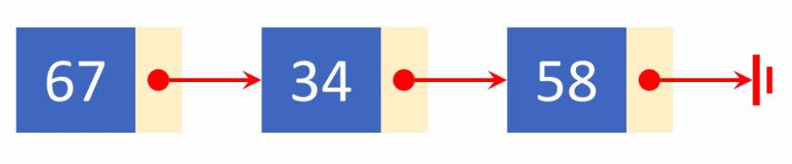
* 예시 : 3개의 데이터 아이템들이 순서를 지어 연결되어 있고 앞의 데이터가 뒤의 데이터를 가리키도록 되어있는 리스트  
### 노드
* 각각의 아이템들
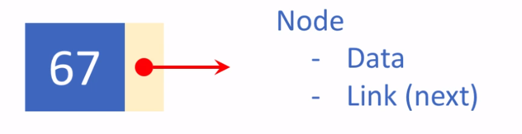
* data와 Link의 정보를 담고있다.
* Node 내의 데이터는 다른 구조로 이루어질 수 있다.
### 알고 있어야 할 정보들
* Head: 리스트의 맨 앞
  * 리스트를 찾는데 사용
* Tail: 리스트의 맨 끝
  * 리스트의 맨 끝에 덧붙일 때 사용
* `# of nodes`: 3
  * 노드의 개수
### 정리
* 이런 연결리스트의 정보들과 연결리스트에 적용될 수 있는 연산들을 뭉뚱그려 집어 넣을 수 있으면 연결리스트의 추상적 자료구조가 된다.

## 연결리스트의 추상적 자료구조 만들기
1. 2개의 클래스(2개의 자료구조) 만들기
    1. `Node`
        * data, link
        ```py
        class Node:
          def __init__(self, item):
              self.data = item
              self.next = None
        ```
    2. `LinkedLisk`
        * nodeCount, head, tail
        ```py
        class LinkedList:
            def __init__(self):
                self.nodeCount = 0
                self.head = None
                self.tail = None
        ```
* 위 2개의 자료구조에 특정 연산들을 수행하면 연결리스트의 속성을 가지도록 할 수 있다.   
2. 연산 정의
   1. 특정 원소 참조(k번째)
   2. 리스트 순회
   3. 길이 얻어내기
   4. 원소 삽입
   5. 원소 삭제
   6. 두 리스트 합치기

## 실습 : 특정 원소 참조
* 주어진 연결리스트에서 k번째 원소를 참조하는 연산을 구현해 보자
* 위의 연결리스트 예제를 사용하였다.
* 3개의 노드로 이루어진 단순한 연결리스트
* 노드들의 번호를 1,2,3으로 임의로 정해주었다(0부터 시작 x, 이유는 차후에 0을 다른 용도로 사용하기 위해)
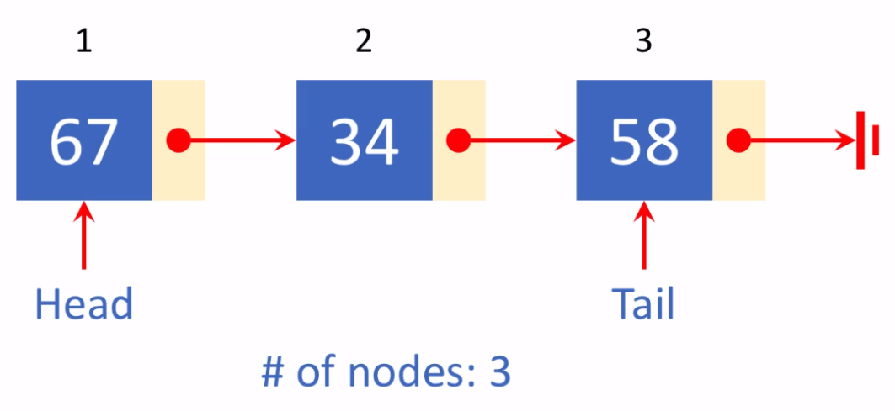

### 코드
* LinkedList의 메소드 `getAt(self, pos)` 
* pos번째에 있는 노드를 return
```py
def getAt(self, pos):
    if pos <= 0 or pos > self.nodeCount:
        return None
    i = 1
    curr = self.head 
    while i < pos: 
        curr = curr.next
        i += 1
    return curr
```
* curr이 연결리스트의 첫번째 노드인 head를 가리키도록 함
* 만약 번호가 0보다 작거나같고 노드 개수보다 큰 수 이면 return None
* 그렇지 않으면
* i = 1, current는 head를 가리키도록 함.
* i가 pos보다 작은 동안 i를 하나씩 증가시키면서 curr를 curr의 next를 가리키도록 하면, 즉 pos-1만큼 전진하면
그때 curr가 가리키고 있는 것이 내가 리턴하려는 pos번째 노드를 가리키게 될 것
1. pos가 1이면 i = 1, curr = 67, while(1<1)실행 x return curr(67)
2. pos가 2이면 i = 1, curr = 67, while 1<2 curr = curr.next = 67.next = 34, i = 2, 2<2 while문 종료. return curr(34)
3. pos가 3이면 i = 1, curr = 67, while (1<3, curr = 34, i = 2). (2<3, curr = 58, i = 3). (3<3) while문 종료. return curr(58)
4. pos가 0보다 작거나 같은 수 이거나, 3보다 큰 수 일 경우 return None

## 배열과 비교한 연결 리스트
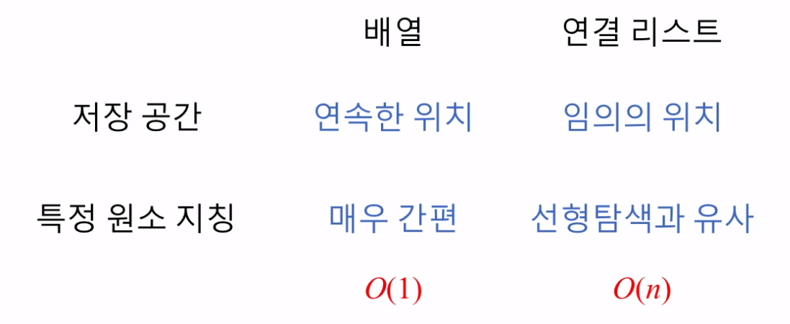
* 선형배열과 연결리스트 비교
1. 저장공간(메모리)
   * 배열은 연속한 위치에 데이터가 놓여야 한다. 
   * 그래야만 k 번째 라고 했을 때 단칼에 그 위치를 처음으로부터 떨어진 거리를 이용해 찾아갈 수 있다.
   * 연결리스트는 각 노드들이 링크로 연결되어 있기 때문에
   * 노드들이 임의의 위치에 있어도 된다.
2. 특정 원소 지칭
   * 배열의 경우 몇 번째라는 index만 지정하면 바로 찾을 수 있다. 상수 시간 $O(1)$이 걸린다
   * 연결리스트의 경우 앞에서 부터 하나하나 링크를 따라가야 하기 때문에 선형탐색과 유사하다. n에 비례하는 시간 $O(n)$이 걸린다.(linear time algorithm)


## 실습: 연결 리스트 순회 구현하기
* list traversal
* head 부터 tail까지 다음 노드들을 찾아가는 방식으로 구현
### 문제 설명
제 7 강에서 소개된 추상적 자료구조로 LinkedList 라는 이름의 클래스가 정의되어 있다고 가정하고, 이 리스트를 처음부터 끝까지 순회하는 메서드 traverse() 를 완성하세요.

메서드 traverse() 는 리스트를 리턴하되, 이 리스트에는 연결 리스트의 노드들에 들어 있는 데이터 아이템들을 연결 리스트에서의 순서와 같도록 포함합니다. 예를 들어, LinkedList L 에 들어 있는 노드들이 43 -> 85 -> 62 라면, 올바른 리턴 값은 [43, 85, 62] 입니다.

이 규칙을 적용하면, 빈 연결 리스트에 대한 순회 결과로 traverse() 메서드가 리턴해야 할 올바른 결과는 [] 입니다.

[참고] "실행" 을 눌렀을 때 통과하는 것은 아무 의미 없습니다.

### 풀이
```py
class Node:
    def __init__(self, item):
        self.data = item
        self.next = None

class LinkedList:
    def __init__(self):
        self.nodeCount = 0
        self.head = None
        self.tail = None

    def traverse(self):
        list = []
        curr = self.head
        while curr != None:
            list.append(curr.data)
            curr = curr.next
        return list
```


# 파트8. 연결 리스트(Linked Lists) (2)
* 연결리스트에서 노드의 삽입과 삭제를 구현해보자
## 1. 원소의 삽입
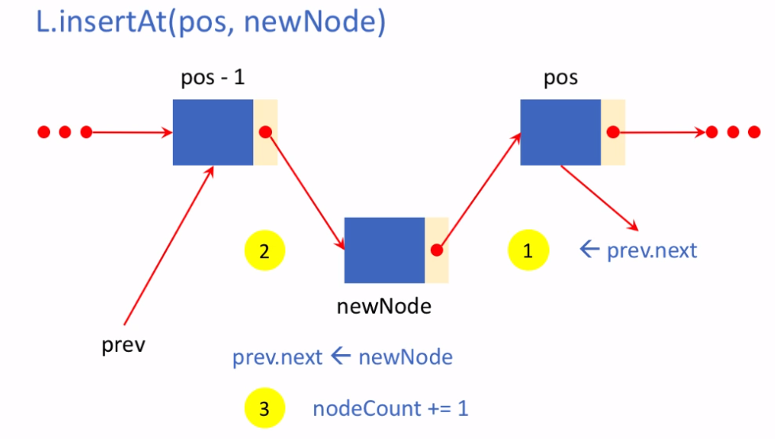
### 메서드 insertAt
* `def insertAt(self, pos, newNode)`
  * pos가 가리키는 위치에(`1<=pos<=nodeCount+1`) newNode를 삽입하고
  * 결과의 성공/실패에 따라 True/False를 리턴
### n번째에 newNode 삽입
* 예를 들어 'n'번째에 'newNode'원소를 삽입한다면
  * 'n'번째의 뒤에 있는 원소들은 한 칸씩 뒤로 밀고 n-1번째 까지는 그냥 남아 있을 것.
  * 'n-1'번째 원소와 'n'번째 원소 사이에 'newNode'원소를 삽입한다.
### newNode 삽입의 과정 3단계
* 'n-1'번 node를 찾고 prev라 부르기로 한다.
1. newNode의 뒤 쪽 링크 조정
   * `n`번 node를 newNode의 next link가 가리키도록 한다.
2. prev가 newNode를 가리키게 한다.
   * newNode를 prev.next가 가리키도록 한다.
3. nodeCount를 1만큼 증가

### 원소 삽입 코드 구현 - 프로토타입
```py
def insertAt(self, pos, newNode):
    prev = self.getAt(pos - 1)
    newNode.next = prev.next
    prev.next = newNode
    self.nodeCount += 1
```
### 주의사항
1. 삽입하려는 위치가 리스트 맨 앞일 때
   * prev 없음
   * Head 조정 필요
2. 삽입하려는 위치가 리스트 맨 끝일 때
   * Tail 조정 필요 
* 빈 리스트에 삽입할 때 > 위 2개의 조건에 의해 처리가 된다. 
### 원소 삽입 코드 구현 - 수정본
```py
def insertAt(self, pos, newNode):
    if pos < 1 or pos > self.nodeCount +1:
        return False

    if pos == 1:
        newNode.next = self.head
        self.head = newNode

    else:
        prev = self.getAt(pos - 1)
        newNode.next = prev.next
        prev.next = newNode

    if pos == self.nodeCount + 1:
        self.tail = newNode

    self.nodeCount += 1
    return True
```
* 삽입하려는 위치가 리스트 맨 끝일 때, 즉 `pos == nodeCount+1`인 경우
  * `prev == tail`이다.
  * 맨 앞에서부터 찾아갈 필요가 없다.
### 원소 삽입 코드 구현 - 완성본
```py
def insertAt(self, pos, newNode):
    if pos < 1 or pos > self.nodeCount +1:
        return False

    if pos == 1:
        newNode.next = self.head
        self.head = newNode

    else:
        if pos == self.nodeCount + 1:
            prev = self.tail
        else:
            prev = self.getAt(pos - 1)
        newNode.next = prev.next
        prev.next = newNode

    if pos == self.nodeCount + 1:
        self.tail = newNode

    self.nodeCount += 1
    return True
```
## 연결 리스트 원소 삽입의 복잡도
* 맨 앞에 삽입하는 경우 : $O(1)$
* 중간에 삽입하는 경우 : $O(n)$
* 맨 끝에 삽입하는 경우 : $O(1)$
  * tail을 유지해서 상수시간이 걸린다.

## 2. 원소의 삭제
단순 삭제 뿐 아니라 삭제하기 위해 추출한 데이터를 리턴한다.
### 메서드 popAt
* `def popAt(self, pos)`
  * pos가 가리키는 위치에(`1 <= pos <= nodeCount`) node를 삭제하고
  * 그 node의 데이터를 리턴
### n번째 node 삭제 (데이터 추출)
* 예를 들어 'n'번째 원소를 삭제한다면
  * 'n-1' 원소와 'n+1' 원소 사이의 원소를 뽑아서 그 데이터를 리턴
    * 'n-1' 원소를 찾아서 prev라는 변수를 가리키게 한다.
    * 'n'번 원소 curr를 뽑는데
    * `prev.next <- curr.next` 링크를 조정한다.
    * 그리고 데이터를 꺼내서 리턴
    * nodeCount를 1만큼 감소
### 주의사항
1. 삭제하려는 node가 맨 앞의 것일 때
   * prev 없음
   * Head 조정 필요
2. 리스트 맨 끝의 node를 삭제할 때(`pos == nodeCount`)
   * Tail 조정 필요
   * 한번에 처리 x(prev를 찾을 수 없다), 앞에서부터 찾아와야 한다.
* 유일한 노드를 삭제할 때
  * 위 2개의 조건에 의해 처리되는가?
  * Head와 Tail 모두 위 2개의 조건에 의해 None을 가리키게 되고 처리되는 줄 알았지만
  * 사실 리스트길이가 1인 리스트의 유일한 원소를 지우면 Head와 tail이 더이상 가리키지 않아야되는데 그 원소를 가리키게 된다. 따라서 조건문 추가.

## 코드
```py
def popAt(self, pos):
    if pos < 1 or pos > self.nodeCount:
        return False
                
    prev = self.getAt(pos - 1)
    curr = self.getAt(pos)
    
    if pos == 1: # 맨 앞 삭제
        if self.nodeCount==1: # 유일한 노드 삭제
            self.head=None
            self.tail=None
        self.head = curr.next
                                
    elif pos == self.nodeCount: # 맨 끝 삭제
            self.tail = prev
            prev.next = None
    else: 
        prev.next = curr.next
        
    self.nodeCount -= 1
    return curr.data
```

## 연결리스트 원소 삭제의 복잡도
* 맨 앞에 삽입하는 경우 : $O(1)$
* 중간에 삽입하는 경우 : $O(n)$
* 맨 끝에 삽입하는 경우 : $O(n))$

## 연결 리스트 연산 - 두 리스트의 연결
### 메서드 `concat`
* 연결 리스트 self의 뒤에 또 다른 연결 리스트인 L을 이어 붙임
* `L1.concat(L2)`
  * L1.tail이 L2.Head를 가리키게
  * self.tail = L2.tail
    ```py
    def concat(self, L):
        self.tail.next = L.head
        self.tail = L.tail
        self.nodeCount += L.nodeCount
    ```
    * 뒤에 붙이는 리스트가 빈 리스트일 경우 tail이 None값이 되어 버리기 때문에 조건문 필요
    ```py
    def concat(self, L):
        self.tail.next = L.head
        if L.tail: # L.tail != None
            self.tail = L.tail
        self.nodeCount += L.nodeCount
    ```
## 연결리스트의 장단점
* 단점 
  * 특정 연산들이 오래 걸린다.
  * 인덱싱 x, 따라서 특정 노드를 지칭하는데 길이에 비례하는 시간이 걸린다는 단점
* 장점
  * 삽입과 삭제를 유연하게 할 수 있다.
  * 병합도 array에서는 할 수 없는 방법

## `linkelist.py` 파일을 통한 연습
```powershell
>>> from linkedlist import *
>>> a = Node(67)
>>> b = Node(34) 
>>> c = Node(28)
>>> L = LinkedList()
>>> L
LinkedList: empty
>>> L.insertAt(1,a)
True
>>> L.insertAt(2,b)
True
>>> L.insertAt(3,c)
True
>>> L
67 -> 34 -> 28
```

## 실습: 연결 리스트 노드 삭제하기
### 문제 설명
제 8 강에서 소개된 추상적 자료구조 LinkedList 클래스의 메서드로서 popAt() 메서드를 강의 내용에 소개된 요구조건을 만족시키도록 구현하세요.

초기 코드로 들어 있는 것은 solution() 함수를 포함하여 다른 부분은 수정하지 말고, def popAt(self, pos): 의 메서드 몸체만 구현하세요.

만약, 인자로 주어진 pos 가 올바른 범위의 값을 가지지 않는 경우에는 IndexError exception 을 발생시키도록 합니다. 이렇게 하기 위한 코드는 raise IndexError 입니다.

*** 2020년 3월 23일, 학습자의 질문에 답하면서 보니 특정한 경우의 정확성을 올바르게 검증하지 못하는 경우가 발견되어 테스트 케이스 4 번을 추가했습니다.


# 파트9. 연결 리스트(Linked Lists) (3)
## 연결리스트들의 응용 예시

* 스마트폰에서 실행중인 앱 정렬 기능
* 여러 개의 앱들이 순서지어 연결되어 있다.
* 앱을 위로 밀어내면 앱을 종료(활성창 삭제)

### 연결리스트의 장점 극대화
연결리스트의 장점인 삽입과 삭제가 유연하다는 점이 가장 큰 장점이다.
* 삽입이나 삭제나 연결된 요소들의 링크만 조정해주면 된다.
* 즉, 삽입과 삭제가 빠르고 간편하다.
### 새로운 코드의 필요성
`linkedlist.py`의 insertAt()을 보면 
사실 그렇게 효율적이지 않다.
* `prev = self.getAt(pos-1)`의 코드는
* 처음부터 pos번째의 노드를 찾아가는 코드
* 매번 할 때마다 앞에서부터 링크를 찾아가는 부담이 생긴다.
다른 종류의 코드를 작성해 보자.
## 새로운 메서드의 정의
* `insertAfter(prev, newNode)`  
* `popAfter(prev)`  
삽입과 삭제를 할 때, 그 위치를 position, 즉 숫자로 알려주는 것이 아니라 어떤 node를 기준으로 두고 그 뒤에 삽입 또는 그 뒤의 요소를 삭제.
* 맨 앞의 요소를 삽입 또는 삭제할 때, 충분히 고민이 필요.
## 조금 변형된 연결 리스트
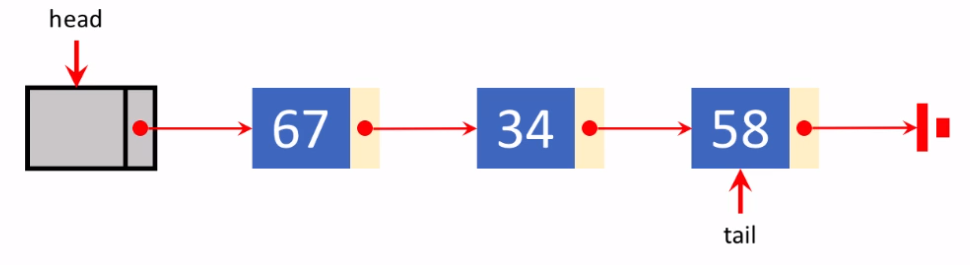
* 맨 앞에 dummy node 를 추가한 형태 (순서  - 0번)
  * 더미 노드는 데이터가 없는 노드, 자리만 차지하는 노드.
* 추상적인 연결리스트를 구현한 코드보다 조금 더 단순하게 짤 수 있다.
### 코드 구현 `linkedlist2.py`
```py
class LinkedList:
	def __init__(self):
		self.nodeCount = 0
		self.head = Node(None) # dummy node
		self.tail = None
		self.head.next = self.tail
```
* dummy node - Node(None)
* head가 dummy node를 가리키게 한다.
  *  `self.head = Node(None)`
* head의 next가 tail을 가리키게 한다.(None을 가리키게 해서 끝임을 알림)
### 연산 정의 및 코드 구현
* dummy node를 추가한 상태에서 각 연산을 새롭게 정의해보자
1. 길이 얻어내기
2. 리스트 순회
3. 특정 원소 참조(k번째)
4. 원소 삽입
5. 원소 삭제
6. 두 리스트 합치기

## 1. 길이 얻어내기
* 그냥 nodeCount를 리턴
* 저번과 변화 x
```py
def getLength(self):
  return self.nodeCount
```

## 2. 리스트 순회
### `traverse()`
* curr.next의 링크가 연결되는 동안 요소들의 데이터를 result[]에 추가
```py
def traverse(self):
  result = []
  curr = self.head
  while curr.next:
    curr = curr.next
    result.append(curr.data)
  return result
```

## 3. 특정 원소 참조(k번째)
### `getAt()`
* 범위 지정시에 1이 아닌 0(head, dummy node)을 최소값으로 사용
```py
def getAt(self, pos):
  if pos < 0 or pos > self.nodeCount:
    return None

  i = 0
  curr = self.head
  while i < pos:
    curr = curr.next
    i += 1

  return curr
```

## 4. 원소 삽입
### `insertAfter()`
* prev가 가리키는 node의 다음에 newNode를 삽입하고 성공/실패에 따라 True/False를 리턴(이전 코드와 동일)
* 코드 순서
  1. newNode.next가 prev.next를 가리키게
  2. prev.next가 newNode를 가리키게
  3. nodeCount + 1
  4.`return True`
  5. 주의할 사항 (: 맨 끝에 요소 삽입) 추가 `self.tail = newNode`
```py
def insertAfter(self, prev, newNode):
  newNode.next = prev.next
  if prev.next is None:
    self.tail = newNode
  prev.next = newNode
  self.nodeCount += 1
  return True
```
* 이전 코드(linkedlist의 `insertAt()`)보다 더 간단하다.
  * dummy node를 둬서 맨 앞 요소의 삽입에 관한 조건문을 고려하지 않아도 된다.
### `insertAt()` - `insertAfter()`를 이용해 구현
```py
def insertAt(self, pos, newNode):
  if pos < 1 or pos > self.nodeCount + 1:  # 올바르지 않은 리스트의 범위
    return False

  if pos != 1 and pos == self.nodeCount + 1:  # 빈 리스트에 노드 삽입
    prev = self.tail
  else:
    prev = self.getAt(pos-1)

  return self.insertAfter(prev, newNode)
```
* 코드가 더 간단해 졌다.

## 5. 원소 삭제
### `popAfter()`
* 함수 실행시 입력값을 원소의 인덱스(숫자)가 아니라 원소이름(변수이름, 데이터이름)을 실행인자로 넣어준다.
  * ex) `L.popAfter(a)`
* prev의 다음 node를 삭제하고 그 node의 data를 리턴 (`popAt()`과 동일)
```py
def popAfter(self, prev):
  if prev.next == None:
    return None

  curr = prev.next
  if curr.next == None:
    prev.next = None
    self.tail = prev

  else:
    prev.next = curr.next

  self.nodeCount -= 1    
  return curr.data
```
### 주의사항
1. prev가 마지막 node일 때 (`prev.next == None`)
   * 삭제할 node가 없음
   * return None
2. 리스트 맨 끝의 node를 삭제할 때 (`curr. next == None`)
   * Tail 조정 필요
### `popAt()` - `popAfter()`를 이용해 구현
```py
def popAt(self, pos):
  if pos < 1 or pos > self.nodeCount:
    raise IndexError

  if pos == 1:
    prev = self.head	

  else:
    prev = self.getAt(pos-1)
    
  return self.popAfter(prev)
```
## 6. 두 리스트 합치기
### `concat()`
```py
def concat(self, L):
  self.tail.next = L.head.next
  if L.tail:
    self.tail = L.tail
  self.nodeCount += L.nodeCount
```
* linkedlist의 concat()가 비교하면 `self.tail.next = L.head`이
`self.tail.next = L.head.next`로 바뀐 차이밖에 없다.
* dummy node가 때문에 L.head가 아닌 L.head.next로 연결해야 데이터가 완벽하게 하나의 리스트로 연결이 된다.

## 실습: dummy head 를 가지는 연결 리스트 노드 삭제
### 문제 설명
제 9 강에서 소개된 추상적 자료구조 LinkedList 는 dummy head node 를 가지는 연결 리스트입니다. 이 클래스의 아래와 같은 메서드들을, 강의 내용에 소개된 요구조건을 만족시키도록 구현하세요.

popAfter()
popAt()
이 때, popAt() 메서드의 구현에서는 popAfter() 를 호출하여 이용하도록 합니다. (그렇게 하지 않을 수도 있지만, 여기에서는 popAfter() 의 이용에 의해서 코드 구현이 보다 쉬워지는 것을 확인하기 위함입니다.)

초기 코드로 들어 있는 것은 solution() 함수를 포함하여 다른 부분은 수정하지 말고, def popAfter(self, prev): 와 def popAt(self, pos): 의 메서드 몸체만 구현하세요.

만약, popAt() 메서드에 인자로 주어진 pos 가 올바른 범위의 값을 가지지 않는 경우에는 IndexError exception 을 발생시키도록 합니다. 이렇게 하기 위한 코드는 raise IndexError 입니다.
### 풀이
```py
class Node:

    def __init__(self, item):
        self.data = item
        self.next = None


class LinkedList:

    def __init__(self):
        self.nodeCount = 0
        self.head = Node(None)
        self.tail = None
        self.head.next = self.tail


    def traverse(self):
        result = []
        curr = self.head
        while curr.next:
            curr = curr.next
            result.append(curr.data)
        return result


    def getAt(self, pos):
        if pos < 0 or pos > self.nodeCount:
            return None

        i = 0
        curr = self.head
        while i < pos:
            curr = curr.next
            i += 1

        return curr


    def insertAfter(self, prev, newNode):
        newNode.next = prev.next
        if prev.next is None:
            self.tail = newNode
        prev.next = newNode
        self.nodeCount += 1
        return True


    def insertAt(self, pos, newNode):
        if pos < 1 or pos > self.nodeCount + 1:
            return False

        if pos != 1 and pos == self.nodeCount + 1:
            prev = self.tail
        else:
            prev = self.getAt(pos - 1)
        return self.insertAfter(prev, newNode)


    def popAfter(self, prev):
        if prev.next == None:
            return None
        
        curr = prev.next
        if curr.next == None:
            prev.next = None
            self.tail = prev
		
        else:
            prev.next = curr.next
        
        self.nodeCount -= 1            
        return curr.data

    def popAt(self, pos):
        if pos < 1 or pos > self.nodeCount:
            raise IndexError
            
        if pos == 1:
            prev = self.head
        else:
            prev = self.getAt(pos-1)
        return self.popAfter(prev)
        
def solution(x):
    return 0
```


# 파트10. 양방향 연결 리스트(Doubly Linked Lists)
양방향 연결 리스트 (이중 연결 리스트)에 대해 알아보자.
## 연결리스트가 유용할 때
* 스마트폰 실행중인 앱 리스트
  * 반대쪽으로도 이동할 수 있다.
## 양방향(이중) 연결 리스트
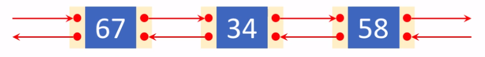
* 한 쪽으로만 링크를 연결하지 말고, 양쪽으로 연결한다
  * 앞으로도(next 링크를 따라가면) 진행이 가능하고
  * 뒤로도(prev 링크를 따라가면) 진행이 가능하다
* 각 노드마다 링크가 왼쪽 오른쪽으로 2개씩 붙어 있다. (양쪽에 in, out 1개씩)
## 양방향 연결 리스트 만들려면
* 노드의 구조 확장이 필요하다
  ```py
  class Node:
      def __init__(self, item):
          self.data = item
          self.prev = None
          self.next = None
  ```
  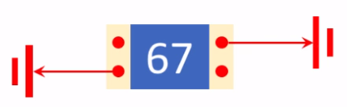

* 리스트 처음과 끝에 dummy node 사용
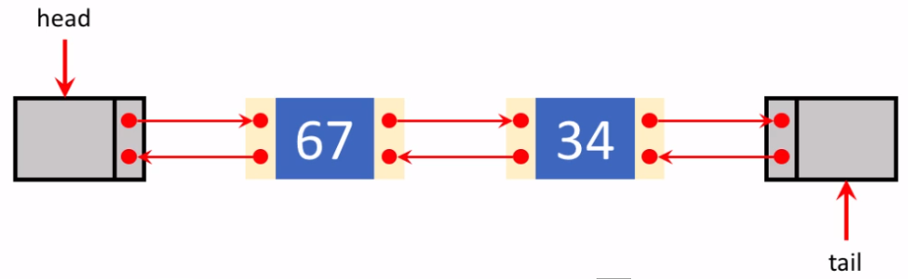
  * 데이터를 담고 있는 node들은 모두 같은 모양 > 코드 작성 편리해진다.

## class DoublyLinkedList
* head와 tail의 더미 노드가 있고 각 양쪽 끝은 소위 termination(종료) 되어 있다.
```py
class DoublyLinkedList:
    def __init__(self):
        self.nodeCount = 0
        self.head = Node(None)
        self.tail = Node(None)
        self.head.prev = None
        self.head.next = self.tail
        self.tail.prev = self.head
        self.tail.next = None
```
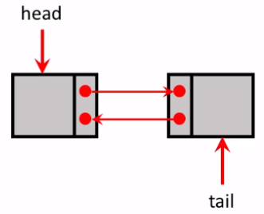

### 양방향 연결 리스트의 연산
* 역순회가 가능해졌다. `reverse()`추가

## 리스트 순회
### `traverse()`
```py
def traverse(self):
    result = []
    curr = self.head
    while curr.next.next:
        curr = curr.next
        result.append(curr.data)
    return result
```
* while 조건만 살짝 다르다.
  * tail도 더미노드가 들어있기 때문에 .next를 추가해줘야 한다.(전체 순방향 순회)
* 빈 리스트에 대해서도 유효하다
  * `curr`이 `head`고 `curr.next.next`는 tail.next이기 때문에 `None`이고(없고) while문이 실행 되지 않아 빈 리스트가 `return`된다.

## 리스트 역순회
### `reverse()`
```py
def reverse(self)
    result = []
    curr = self.tail
    while curr.prev.prev:
        curr = curr.prev
        result.append(curr.data)
    return result
```
* `traverse()`와 거의 비슷
  * `curr`을 `self.tail`로 정의
  * `next`를 `prev`로 바꾼다.
    * 뒤에서 앞으로 오게

## 원소의 삽입
### `insertAfter()`
* 메서드의 모양은 단방향 연결리스트의 코드와 같다.
* 양방향으로 링크를 조정해줘야 한다.
  * 어려울거라 예상되지만 실제로 해보면 
  * 더 유연하고 쉽게 코드를 짤 수 있다.
* `prev`가 주어지면 `next`를 `prev.next`로 정의해서 양쪽 노드를 모두 코드에서 사용할 수 있게 한다.
* `newNode`의 `next`와 `prev`링크를 조정한다
  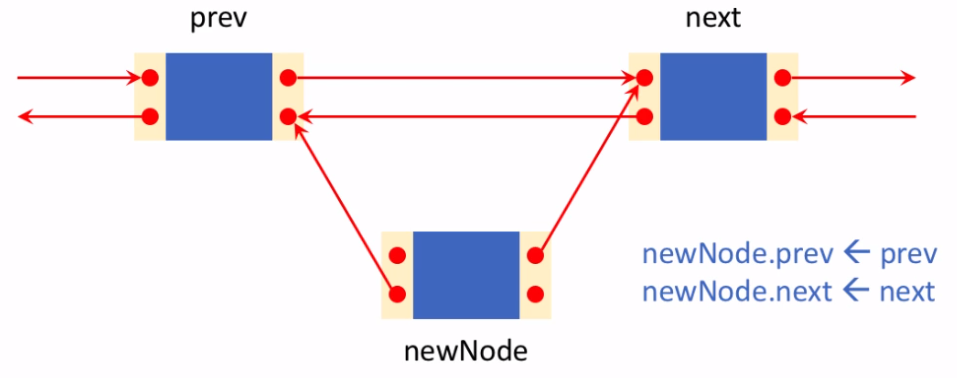
* 기존의 링크를 끊는다
  * `prev.next <- newNode`
    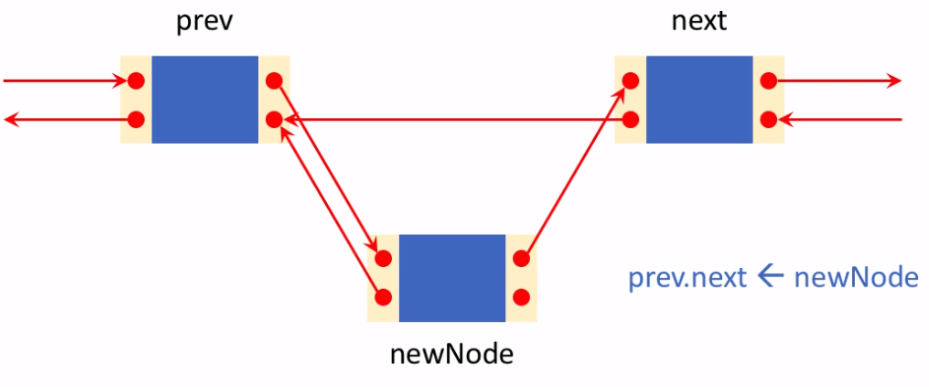
  * `next.prev <- newNode`
    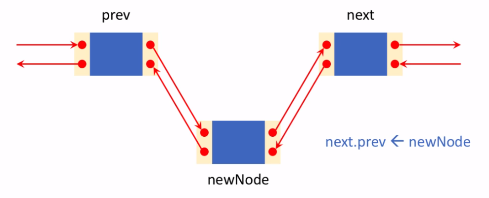
* `newNode`를 기준으로 양 방향의 링크가 모두 조정이 되었다
* `nodeCount + 1`
* `return True`

```py
def insertAfter(self, prev, newNode):
    next = prev.next
    newNode.prev = prev
    newNode.next = next
    prev.next = newNode
    next.prev = newNode
    self.nodeCount += 1
    return True
```
* `self.head`, `self.tail`을 조정하는 등의 조건을 설정하지 않고 `link`만 조정하면 되므로 더 단순하다.

## 특정 원소 얻어내기
### `getAt()`
* dummy node를 가진 단방향 연결 리스트의 `getAt()`과 완전히 동일하다.
```py
def getAt(self, pos):
		if pos < 0 or pos > self.nodeCount:
			return None

		i = 0
		curr = self.head
		while i < pos:
			curr = curr.next
			i += 1

		return curr
```
## 원소의 삽입 2
### `insertAt()`
* 포지션(`pos`)을 지정하고 새로운 노드를 삽입하는 `insertAt`메서드를 `getAt`메서드를 이용해 구현할 수 있다.
```py
def insertAt(self, pos, newNode):
    if pos < 1 or pos > self.nodeCount + 1:
        return False

    prev = self.getAt(pos - 1)
    return self.insertAfter(prev, newNode)
```
* 위의 코드는 지나치게 단순해보인다
* 만약 리스트 마지막에 원소를 삽입하면?
  * 앞에서부터 찾아가서 처리해야 하기 때문에 빠르게 처리하지 못한다.
* `getAt()`메서드를 수정해서 `insertAt()`의 이러한 비효율성 문제를 해결할 수 있다.
  
## 특정 원소 얻어내기 2
### `getAt()`
* 인자로 주어진 `pos`이 `nodeCount`의 절반보다 뒤쪽이면 앞에서부터 찾아가지 말고 `tail`부터 `prev`를 따라가면서 찾게
* 절반보다 앞쪽이면 원래대로 앞에서부터 찾아가게
```py
def getAt(self, pos):
    if pos < 0 or pos > self.nodeCount:
        return None

    if pos > self.nodeCount // 2: # pos가 nodeCount의 절반보다 크면 > 뒤쪽에 있으면 뒤에서부터 찾는다
        i = 0
        curr = self.tail
        while i < self.nodeCount - pos + 1:
            curr = curr.prev
            i += 1
    else: # pos가 앞쪽이면
        i = 0
        curr = self.head
        while i < pos:
            curr = curr.next
            i += 1

    return curr
```
* 이렇게 코드를 짜도 여전히 어떤 특정 위치에 원소를 삽입하는 것은 리스트의 길이가 길어지면 길어질수록 그에 비례해서 시간이 오래 걸리는 선형시간 알고리즘임은 변함이 없다.

## 양뱡향 연결리스트의 다양한 기타 연산
### `insertBefore(self, next, newNode)`
* 주어진 원소의 앞에 삽입하는 기능
### `popAfter(self, prev)`
* 어떤 노드가 주어지면 다음 노드를 뽑아내기(삭제)
### `popBefore(self, next)`
* 어떤 노드가 주어지면 이전 노드를 뽑아내기(삭제)
### `popAt(self, pos)`
* 포지션이 주어지면 특정 위치에 있는 노드를 뽑아내기(삭제)
### `concat(self, L)`
* 두 연결리스트를 이어붙이기
  * 조건문을 덜 사용해도 된다.

## 양방향 연결 리스트의 특징 정리
* 링크가 차지하는 메모리 용량이 조금 더 크다.
* 단방향 리스트와 다르게 양쪽으로 진행이 가능하다.
* `head`나 `tail`의 위치 조정이 필요하지 않아서 코드는 단순하다.
* 맨 마지막 원소를 뽑아내는 것이 자동적으로 시간이 덜 걸린다.
  * 단방향 연결리스트에서는 마지막 원소를 찾기 위해 리스트 전체를 거쳐야 하므로 비효율적이었다.
  * 이제는 양방향으로 진행할 수 있고
  * `getAt()`메서드에서 더 효율적으로 찾을 수 있게 했기 때문에
  * 쉽고 더 빠르게 리스트의 원소를 찾아서 원하는 기능을 수행할 수 있다.
* 참고 
  * 스택과 큐를 array로 구현할 수 도 있지만 양방향 연결 리스트로 구현할 수 있다.


## 실습: (1) 양방향 연결 리스트 역방향 순회
###문제 설명
제 10 강에서 소개된 추상적 자료구조 `DoublyLinkedList` 에 대하여, 또한 강의 내용에서 언급한 `reverse()` 메서드를 구현하세요.

이 `reverse()` 메서드는 양방향 연결 리스트를 끝에서부터 시작해서 맨 앞에 도달할 때까지 (tail 방향에서 head 방향으로) 순회하면서, 방문하게 되는 node 에 들어 있는 data item 을 순회 순서에 따라 리스트에 담아 리턴합니다.

예를 들어, `DoublyLinkedList` L 에 들어 있는 노드들이 `43 -> 85 -> 62` 라면, 올바른 리턴 값은 `[62, 85, 43]` 입니다.

이 규칙을 적용하면, 빈 연결 리스트에 대한 역방향 순회 결과로 `reverse()` 메서드라 리턴해야 할 올바른 결과는 `[]` 입니다.

### 풀이
```py
def reverse(self):
    # 뒤에서부터 하나씩 역순회
    # 배열에 저장해서 출력
    result = []
    curr = self.tail
    while curr.prev.prev: # dummy node 까지 
        curr = curr.prev
        result.append(curr.data)
    return result
```

## 실습: (2) 양방향 연결 리스트 노드 삽입
### 문제 설명
제 10 강에서 소개된 추상적 자료구조 DoublyLinkedList 의 메서드로 insertBefore() 를 구현하세요.

이 insertBefore() 메서드에는 두 개의 인자가 주어지는데, next 는 어느 node 의 앞에 새로운 node 를 삽입할지를 지정하고, newNode 는 삽입할 새로운 node 입니다.

강의 내용에서 소개된 insertAfter() 메서드의 구현과 매우 유사하게 할 수 있습니다.

### 풀이
```py
def insertBefore(self, next, newNode):        
    prev = next.prev
    newNode.prev = prev
    newNode.next = next
    prev.next = newNode
    next.prev = newNode        
    self.nodeCount += 1
    return True
```

## 실습: (3) 양방향 연결 리스트 노드 삭제
### 문제 설명
제 10 강에서 소개된 추상적 자료구조 DoublyLinkedList 에 대하여 node 의 삭제 연산에 관련한 아래와 같은 메서드들을 구현하세요.

popAfter()
popBefore()
popAt()
popAfter(prev) 는 인자 prev 에 의하여 주어진 node 의 다음에 있던 node 를 삭제하고, popBefore(next) 는 인자 next 에 의하여 주어진 node 의 이전에 있던 node 를 삭제합니다. 그리고 삭제되는 node 에 담겨 있던 data item 을 리턴합니다.

popAt(pos) 는 인자 pos 에 의하여 지정되는 node 를 삭제하고 그 node 에 담겨 있던 data item 을 리턴하는데, 위 popAfter() 또는 popBefore() 를 호출하여 이용하는 방식으로 구현하세요. 또한, 만약 인자 pos 가 올바른 범위 내에 있지 않은 경우에는 raise IndexError 를 이용하여 IndexError exception 을 일으키도록 구현하세요.

테스트 케이스 1-3 은 각각 (1) popAfter(), (2) popBefore(), (3) popAt() 메서드의 올바른 동작을 검증하는 케이스입니다.

### 풀이
```py
def popAfter(self, prev):
    curr = prev.next # 삭제 대상
    next = curr.next # curr의 next
    prev.next = next
    next.prev = prev
    self.nodeCount -= 1
    return curr.data
    
def popBefore(self, next):
    curr = next.prev # 삭제 대상
    prev = curr.prev # curr의 prev
    prev.next = next
    next.prev = prev
    self.nodeCount -= 1
    return curr.data

def popAt(self, pos):
    if pos < 1 or pos > self.nodeCount:
        raise IndexError
        
    prev = self.getAt(pos - 1)
    return self.popAfter(prev)
```
* `popAt()` 코딩 때 참고로 `popBefore()`를 참조하는 아래의 코드는 런타임 에러 발생한다.
  ```py
  def popAt(self, pos):
    if pos < 1 or pos > self.nodeCount:
        raise IndexError
    next = self.getAt(pos + 1)
    return self.popBefore(next)
  ```
* `getAt()`이 리스트의 처음과 끝에 대하여 대칭적으로 만들어져 있지 않기 때문
  * pos == 0인 경우
    * popBefore에서 prev 정의가 안된다.
  * pos == self.nodeCount인 경우 
    * 인자로 받은 next가 nodeCount보다 커지게 된다.
* 대칭적으로 만들려면... 
  * 원소의 개수가 홀수 인 경우 정가운데 요소에 해당하는 조건문을 따로 만들고 
  * 정확히 양쪽을 가른다.
  * 원소가 0개 이거나 1개 인 경우도 에러발생가능성을 고려한다.

## 실습: (4) 양방향 연결 리스트의 병합
### 문제 설명
제 10 강에서 소개된 추상적 자료구조 DoublyLinkedList 에 대하여 두 개의 양방향 연결 리스트를 앞뒤로 이어 붙이는 메서드 concat() 을 구현하세요.

예를 들어, 양방향 연결 리스트 L1 에는 1 -> 2 -> 3 의 원소가 순서대로 들어 있고, 또다른 양방향 연결 리스트 L2 에는 4 -> 5 의 순서로 원소가 들어 있을 때, 메서드 호출 L1.concat(L2) 의 결과로 L1 은 1 -> 2 -> 3 -> 4 -> 5 의 양방향 연결 리스트가 됩니다. 물론, L1 또는 L2 또는 둘 다가 비어 있는 양방향 연결 리스트인 경우도 고려되도록 코드를 작성해야 합니다.

### 풀이
```py
def concat(self, L):
    prev = self.tail.prev # self.의 마지막 원소
    next = L.head.next # L의 첫 원소         
    prev.next = next # 링크 조정1
    next.prev = prev  # 링크 조정2        
    self.tail = L.tail # self.tail 재정의
    self.nodeCount += L.nodeCount # nodeCount 더하기
```